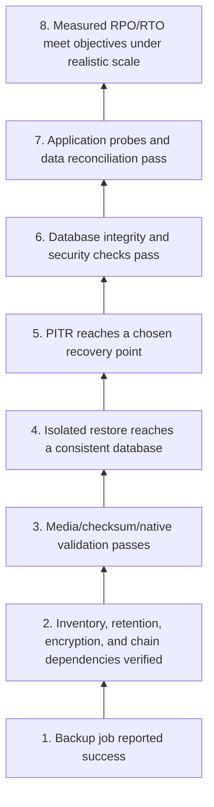
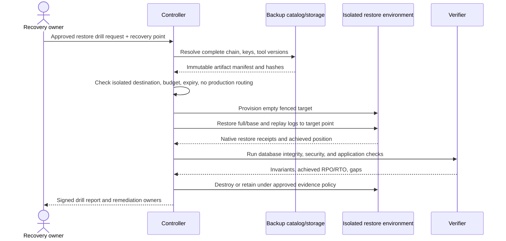
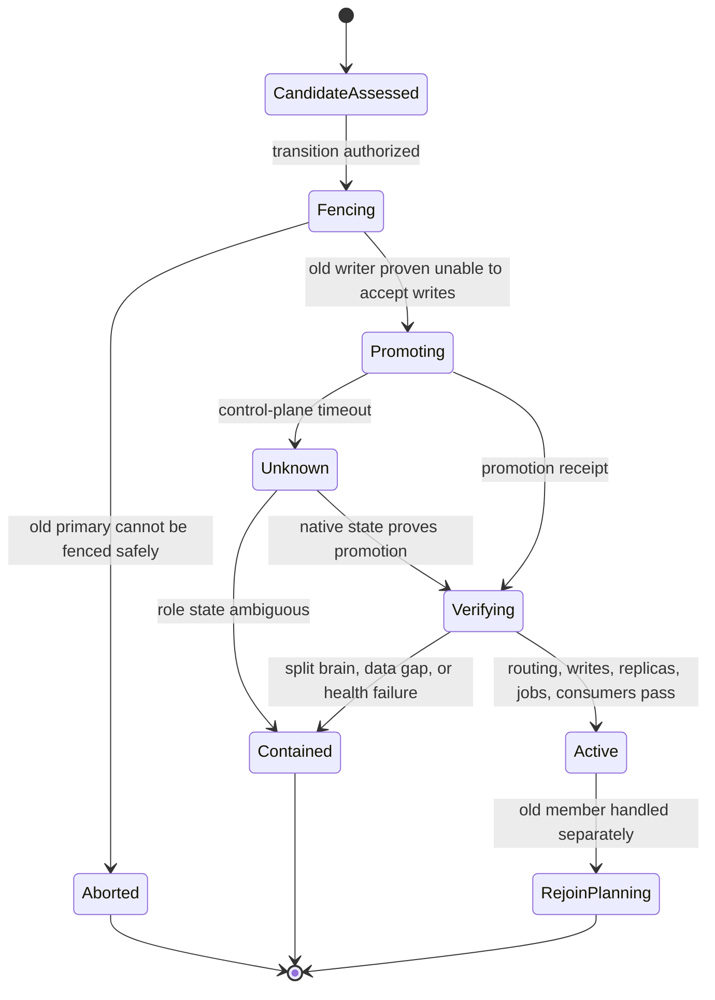

# Backup, Restore, Replication, and Failover

> **Status:** Research-backed production blueprint  
> **Last researched:** 2026-08-31  
> **Scope:** Recoverability evidence, restore drills, replication safety, switchover/failover, and managed-service transitions  
> **Evidence:** [Research packet](../../research/packets/database-operations-agent-blueprint.md)  
> **Blueprint index:** [README](README.md)

A green backup job and a healthy replica are not proof that the service can recover. The agent should model recoverability as a tested chain from source data through backup artifacts, keys, logs, tooling, infrastructure, application reconciliation, and named human ownership.

## Recovery assurance ladder

Only the upper levels demonstrate useful recoverability. PostgreSQL `pg_verifybackup`, Oracle RMAN `VALIDATE`, and SQL Server `RESTORE VERIFYONLY` are valuable media/metadata checks, but none substitutes for restoring and exercising the database. SQL Server explicitly states that `VERIFYONLY` does not verify the structure of data; PostgreSQL warns that verification cannot replace test restores.

## Backup evidence model

For every protected database, inventory:

- immutable target/database identity and engine/version;
- backup type, start/end time, consistency scope, recovery position, and size;
- full/base backup plus differential/incremental and log/WAL/binlog dependencies;
- retention/immutability policy and deletion authority;
- storage account/region, encryption key ID, key availability, and access test;
- tool and format version compatibility;
- database-level versus cluster/global objects, roles, jobs, extensions, keys, and external dependencies;
- native validation result and most recent isolated restore result;
- achieved recovery point, restore duration by phase, dataset scale, and application verification;
- owner, escalation path, and next drill deadline.

The dependency graph is a first-class artifact. PostgreSQL incremental backups require their ancestor chain, and PostgreSQL does not maintain a built-in catalog that automatically knows which backups depend on which other backups. MySQL point-in-time recovery needs a suitable full backup plus the required binary logs. Deleting an “old” artifact without resolving dependencies can make newer recovery points unusable.

## Restore drill workflow

### Drill safety

- Restore into a network-isolated account/project/subscription or explicitly fenced environment.
- Disable outbound jobs, webhooks, email, payments, CDC publishers, schedulers, and production secrets before opening the database to applications.
- Generate a new target identity; do not reuse production DNS or service-discovery names.
- Apply masking if people will inspect sensitive restored data, and enforce a short data-retention deadline.
- Verify roles, row/tenant policies, encryption/decryption, extensions, jobs, and application configuration—not only tables.
- Measure provisioning, transfer, restore, replay, integrity check, and application validation separately. This exposes the actual bottleneck.
- Destroy the environment and credentials on schedule; retain only redacted evidence and hashes.

Google Cloud’s reliability guidance recommends testing the full application recovery path and measuring both integrity and RPO/RTO. That is a useful provider-neutral standard. See [testing recovery from data loss](https://docs.cloud.google.com/architecture/framework/reliability/perform-testing-for-recovery-from-data-loss).

## Engine-specific recovery notes

| Engine | Agent must account for |
|---|---|
| PostgreSQL 18 | Base backup plus continuous WAL archive for PITR; replay duration can dominate RTO; dumps are per-database and do not automatically synchronize multiple databases; cluster-global objects need separate handling; replication slots can retain WAL until storage fills |
| MySQL 8.4 | Full backup plus binary logs for PITR; log retention must preserve the desired window; cloning a replication source requires needed binlogs not to purge before replication starts |
| SQL Server 2025 | Full/differential/log chain and recovery model; `RESTORE VERIFYONLY` is limited; use restored `DBCC CHECKDB`/application checks; Always On secondaries do not replace backups |
| Oracle 26ai | RMAN catalog/control-file metadata, backup sets/copies, archived redo, encryption wallet/key access, and `VALIDATE`; Data Guard is continuity, not backup |

Primary references: [PostgreSQL continuous archiving/PITR](https://www.postgresql.org/docs/current/continuous-archiving.html), [MySQL PITR](https://dev.mysql.com/doc/refman/8.4/en/point-in-time-recovery-binlog.html), [SQL Server restore statements](https://learn.microsoft.com/en-us/sql/t-sql/statements/restore-statements-for-restoring-recovering-and-managing-backups-transact-sql?view=sql-server-ver17), and [Oracle RMAN validation](https://docs.oracle.com/en/database/oracle/oracle-database/26/bradv/validating-database-files-backups.html).

## Replication is a lossy queue unless proven otherwise

Track more than “seconds behind”:

- source and replica positions plus measurement time;
- bytes/transactions/time lag and trend;
- receive, persist, flush, replay/apply, and visibility state where available;
- slot/queue/backlog retention and remaining disk/headroom;
- conflict/cancellation/error state;
- synchronous/quorum configuration and actual participants;
- schema, policy, credential, job, and external object parity;
- downstream CDC/subscriber/checkpoint positions;
- last successful write/read probe and topology epoch.

Asynchronous replication can lose acknowledged writes on failover. Synchronous modes trade latency/availability and still require correct configuration and fencing. A scalar lag estimate can look small while one large transaction or queue is expensive to apply; measure backlog and recovery throughput.

## Switchover and failover are different capabilities

| Transition | Preconditions | Data-loss posture | Approval |
|---|---|---|---|
| Planned switchover | Both sides healthy; catch-up can be confirmed; old primary can be cleanly demoted/fenced | Target zero loss, verified positions | Change approval and application owner |
| Unplanned failover | Primary unavailable/unsafe; candidate eligibility known; fencing decision possible | Potential loss explicitly quantified/accepted | Incident commander and database authority |
| Disaster restore | Replicas unavailable/corrupted or isolation boundary lost | Recovery point selected from validated backup | Disaster/incident authority; new topology established |

### Safe role-transition sequence

1. Freeze other database effects and acquire a topology transition lease.
2. Resolve current roles from multiple authoritative signals; never trust cached labels.
3. Stop or fence writes to the old primary. If its state is unknown, use infrastructure-level fencing/STONITH before allowing new writes.
4. Measure candidate recovery/apply position, health, configuration, and data-loss exposure.
5. Require the relevant approval and explicit loss decision.
6. Promote using the database/provider-native operation; record native transition ID.
7. Advance the topology epoch and invalidate outstanding credentials, approvals, and caches tied to the old topology.
8. Update routing and verify writes cannot reach both primaries.
9. Run read/write/application probes and reconcile data, replicas, jobs, CDC consumers, connection pools, and observability.
10. Rebuild/rejoin the old primary only through a separate workflow; never simply reverse routing to a divergent node.

PostgreSQL documentation states that PostgreSQL itself does not provide the failure-detection/orchestration system needed for failover and discusses fencing to prevent both nodes becoming primary. SQL Server forced failover can lose data; ancillary logins and jobs may require separate handling. Oracle Data Guard distinguishes zero-loss switchover from failover that can lose data depending on protection, and recommends Broker-based role management in 26ai. See [PostgreSQL failover](https://www.postgresql.org/docs/current/warm-standby-failover.html), [SQL Server failover modes](https://learn.microsoft.com/en-us/sql/database-engine/availability-groups/windows/failover-and-failover-modes-always-on-availability-groups?view=sql-server-ver17), and [Oracle Data Guard role transitions](https://docs.oracle.com/en/database/oracle/oracle-database/26/sbydb/managing-oracle-data-guard-role-transitions.html).

## Managed-service guardrails are useful, not sufficient

Provider operations should be separate adapters with provider API idempotency, operation IDs, and documented failure states.

For example, Amazon RDS Blue/Green Deployments run switch guardrails, stop writes, wait for catch-up, and may roll back on timeout, but connections can drop and the new green environment’s point-in-time recovery history does not include backups from before the blue/green deployment. Keep the old environment for the required recovery window and rehearse application reconnection. See [RDS blue/green switching](https://docs.aws.amazon.com/AmazonRDS/latest/UserGuide/blue-green-deployments-switching.html) and [RDS blue/green considerations](https://docs.aws.amazon.com/AmazonRDS/latest/UserGuide/blue-green-deployments-considerations.html).

Cloud SQL and Azure SQL similarly document lag/data-loss considerations for disaster failover. A provider button does not choose the business RPO, fence non-provider writers, validate downstream systems, or prove application correctness.

### Representative managed-service adapter qualifications

These rows are separate contracts, not a portability promise. Recheck the exact service page, tier, region, engine build, API/SDK, and deployment before every continuity capability release.

| Service surface | Native behavior worth using | Qualification and deployment-specific limits |
|---|---|---|
| Amazon RDS Blue/Green | Readiness guardrails, bounded switchover timeout, write stop, lag catch-up, coordinated renames | Track immutable `DbiResourceId`, not the changing instance name. The green resource becomes a different production incarnation; earlier blue PITR history does not carry over. PostgreSQL logical mode has DDL/large-object limits; DMS checkpoints and attached integrations/roles may require recreation. Connections—including RDS Proxy connections—drop and clients must reconnect. |
| Amazon Aurora Global Database | Managed switchover/failover and a global writer endpoint | Do not reuse the RDS Blue/Green contract. Cross-region loss depends on lag; AWS documents old-region write fencing as best effort, so momentary divergent writes/split brain remain a reconciliation case. Verify engine/version, endpoint caching, global topology, and post-transition member health. |
| Google Cloud SQL HA and advanced DR | In-region HA keeps the connection target; advanced DR distinguishes switchover from immediate replica failover and returns long-running operation identity | Existing connections close during HA failover. Advanced-DR replica failover can lose lagging data; after promotion a best-effort backup can leave PITR unavailable for a documented interval. Edition, transaction-log storage, designated-DR eligibility, SDK/CLI version, VPC Service Controls, and unsupported Terraform failover path must be tested. |
| Azure SQL Database failover groups | Listener endpoints and separate planned versus forced failover APIs | Geo-replication is asynchronous. Planned failover synchronizes; `Force Failover Allow Data Loss` does not. `sp_wait_for_database_copy_sync` hardens selected transactions on the secondary but does not wait for redo/read visibility. Do not copy this contract to SQL Managed Instance; permissions, networking, topology, and drill guidance differ. |
| Oracle Autonomous AI Database | Managed backups, Serverless/Dedicated restore, and Autonomous Data Guard switchover/failover | Distinguish Serverless, Dedicated, and Cloud@Customer plus local/cross-region standby. Switchover targets zero loss; manual failover can lose data and reports it. Automatic failover/data-loss-limit and concurrent-operation behavior vary. Customer-managed keys must remain available for applicable long-term backup clones; some flashback/restore-point capabilities are restricted. |

For each provider effect, persist the request/effect key, provider resource IDs before and after, native operation ID/state, last authoritative observation, endpoint/routing revision, old/new topology epochs, and documented terminal/failed/rollback states. If the API times out after acceptance, reconcile the provider operation and resource graph; do not issue a semantically new transition.

## Data-loss and recovery decision gates

Continuity execution stops until an accountable human can see and accept the decision in operational units, not a vague “some loss possible” warning.

| Gate | Required evidence | Stop condition |
|---|---|---|
| Loss window | Last acknowledged source commit/LSN/GTID/SCN or provider position, candidate durable/replay position, measurement time and uncertainty | Positions are incomparable, stale, or sourced only from a cached dashboard |
| Business exposure | Transactions/entities/tenants/jobs possibly absent or duplicated; financial/compliance/customer consequence; reconciliation owner | Exposure cannot be bounded or no owner can reconcile it |
| Fencing | Infrastructure/provider/database proof that the old writer and external writers cannot accept traffic | Old primary state is unknown and no qualified incident authority accepts an explicit exception |
| Recovery choice | Comparison of candidate failover, backup/PITR, and wait-for-recovery against measured RPO/RTO and corruption scope | Replica may contain the same corruption or backup chain/key/tool compatibility is unproved |
| Capacity | Candidate connection, CPU/I/O, cache-warmup, replay, storage, and downstream admission headroom | Recovery traffic plus normal workload exceeds tested envelope or overload cannot be shed |
| Approval | Named incident/change authority binds candidate, positions, maximum accepted loss, fencing evidence, routing plan, and expiry | Approval is conversational, expired, or predates a material position/topology change |
| Post-transition | Single-writer probe, application invariants, data-gap/duplicate reconciliation, jobs/CDC/replicas, backups/PITR, security and audit | Any writer ambiguity, unexplained gap, missing protection, or failed critical probe |

An exceeded RPO is an incident fact, not a reason for the agent to hide the estimate or choose a more destructive path. Preserve the pre-transition evidence, advance the topology epoch once, and make repair/reseed/rejoin separate approved workflows.

## Continuity acceptance checklist

- [ ] Backup dependency graph, retention, immutability, keys, and deletion authorities are inventoried.
- [ ] Native validation and isolated full restore are both scheduled.
- [ ] Restore drills disable all external side effects and production routing.
- [ ] Database integrity, security policy, tenant boundaries, and application probes are verified.
- [ ] Achieved RPO/RTO are measured at realistic data volume and replay backlog.
- [ ] Replication monitoring includes positions, backlog, trend, disk/headroom, conflicts, and downstream consumers.
- [ ] Planned switchover, failover, and restore use distinct policy and runbooks.
- [ ] No promotion occurs before fencing or an explicit documented exception by incident authority.
- [ ] Topology epoch invalidates stale approvals and credentials.
- [ ] Old primary rejoin and divergent-data handling are separate approved workflows.
- [ ] Provider limitations are pinned to the active service/engine version.

## Related guides

- [Migrations, transactions, locks, and rollback](05-migrations-transactions-locks-and-rollback.md)
- [Reliability, observability, scaling, and operations](08-reliability-observability-scaling-and-operations.md)
- [Durable execution](../../runtime/durable-execution.md)
- [Failure taxonomy](../../reliability/failure-taxonomy.md)

## Selected sources

- [PostgreSQL `pg_basebackup`](https://www.postgresql.org/docs/current/app-pgbasebackup.html)
- [PostgreSQL `pg_verifybackup`](https://www.postgresql.org/docs/18/app-pgverifybackup.html)
- [MySQL binary log](https://dev.mysql.com/doc/refman/8.4/en/binary-log.html)
- [SQL Server business continuity](https://learn.microsoft.com/en-us/sql/database-engine/sql-server-business-continuity-dr?view=sql-server-ver17)
- [SQL Server `DBCC CHECKDB`](https://learn.microsoft.com/en-us/sql/t-sql/database-console-commands/dbcc-transact-sql?view=sql-server-ver17)
- [Oracle Data Guard transition assessment](https://docs.oracle.com/en/database/oracle/oracle-database/26/haovw/role-transition-assessment-tuning-and-troubleshooting.html)
- [Amazon RDS Blue/Green limitations](https://docs.aws.amazon.com/AmazonRDS/latest/UserGuide/blue-green-deployments-considerations.html)
- [Amazon Aurora Global Database disaster recovery](https://docs.aws.amazon.com/AmazonRDS/latest/AuroraUserGuide/aurora-global-database-disaster-recovery.html)
- [Cloud SQL advanced disaster recovery](https://docs.cloud.google.com/sql/docs/postgres/use-advanced-disaster-recovery)
- [Azure SQL Database failover groups](https://learn.microsoft.com/en-us/azure/azure-sql/database/failover-group-configure-sql-db?view=azuresql)
- [Oracle Autonomous backup and restore](https://docs.oracle.com/en-us/iaas/autonomous-database-serverless/doc/backup-restore.html)
- [GitHub October 2018 incident analysis](https://github.blog/news-insights/company-news/oct21-post-incident-analysis/)
- [GitLab January 2017 database outage postmortem](https://about.gitlab.com/blog/postmortem-of-database-outage-of-january-31/)
