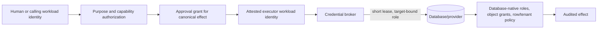
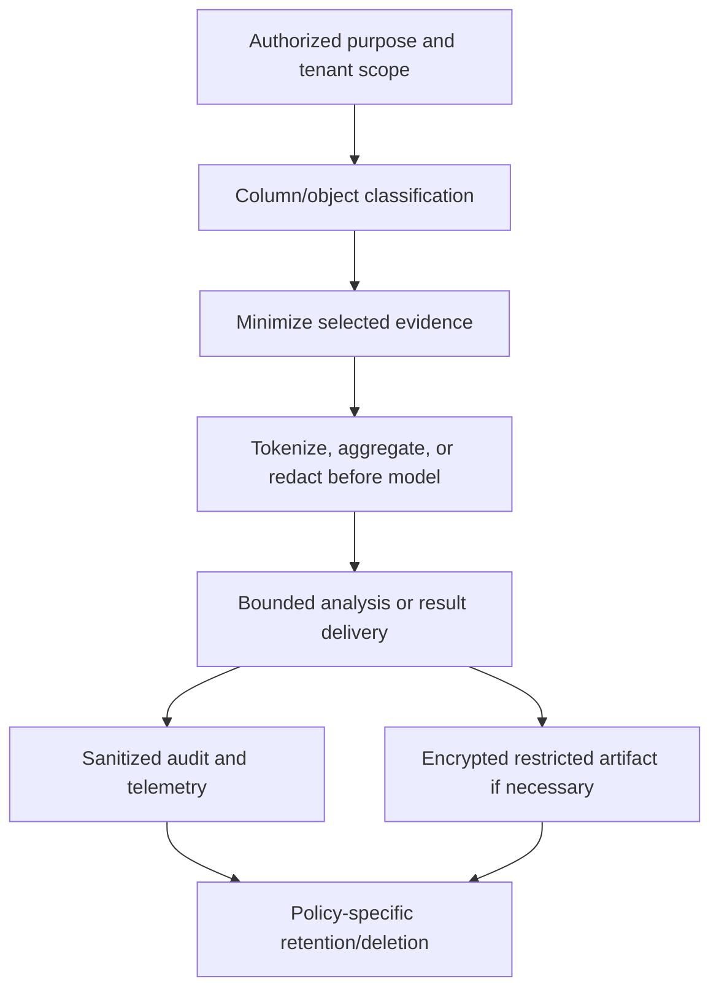

# Security, Identity, Tenancy, and PII

> **Status:** Research-backed production blueprint  
> **Last researched:** 2026-08-31  
> **Scope:** Identity, credential brokering, privilege boundaries, tenant isolation, PII handling, prompt injection, and audit  
> **Evidence:** [Research packet](../../research/packets/database-operations-agent-blueprint.md)  
> **Blueprint index:** [README](README.md)

The database should remain safe if the planner is compromised. That is the practical test for every security control in this blueprint.

## Identity chain

Record and preserve each link; do not collapse them into “the agent user.” The human requester, approver, controller, executor, and database principal have different accountability and should often be different principals.

## Credential design

- Use separate credentials for advisory telemetry, query preview, migration effect, backup inspection, restore drill, and failover control.
- Separate development, staging, and production issuers and roles. A staging grant must be cryptographically or structurally unusable in production.
- Have the executor authenticate to a broker with its workload identity only after approval and commit-time preflight.
- Request a credential for one target, database, capability, and short lease. Revoke or let it expire immediately after the step.
- Keep credentials out of prompts, workflow history, proposal artifacts, traces, command output, and model tool results.
- Prefer database-native authentication/federation or brokered dynamic credentials. Where static service credentials are unavoidable, rotate, narrow, and isolate them; do not fall back to a broad shared DBA account.
- Deny privilege delegation, role creation, security-policy changes, and access to credential/configuration tables unless a dedicated separately governed capability requires them.
- Test revocation and expiry during long operations. Define whether an in-flight database session survives lease expiry and how it is fenced.

HashiCorp Vault’s database secrets engine can issue unique leased dynamic credentials and revoke them, but plugin/database support and root-credential rotation behavior vary. Treat a broker as an implementation mechanism, not proof of least privilege. See [Vault database secrets engine](https://developer.hashicorp.com/vault/docs/secrets/databases) and [lease semantics](https://developer.hashicorp.com/vault/docs/concepts/lease).

## Privilege matrix by mode

| Capability | Planner | Evidence collector | Executor | Verifier |
|---|---:|---:|---:|---:|
| Exported/offline advisory | Artifact read | None | None | Artifact read |
| Live catalog/workload advisory | None | Allowlisted metadata/telemetry | None | Same or independent read |
| Query preview | None | Schema/classification read | Dedicated read identity with row/resource policy | Audit/metrics read |
| Migration review | None | Catalog/dependency/plan read | None | None |
| Migration apply | None | Preflight read | One migration capability and target | Metadata/data/workload checks |
| Restore drill | None | Backup catalog read | Restore only into approved isolated destination | Restored DB and app checks |
| Failover | None | Topology/health read | Native transition/fencing calls only | Independent role/routing/data checks |

The model runtime itself should have no route to the database or credential broker.

## Tenant isolation

Tenant identity is an authorization attribute, not a query hint. Carry it from authenticated request through proposal, approval, credential, database session, results, artifacts, and audit.

### Isolation strategies

| Strategy | Strengths | Risks/operations |
|---|---|---|
| Database/cluster per tenant | Strong isolation and per-tenant recovery/control | Fleet complexity, cost, schema drift |
| Schema per tenant | Useful namespace/credential separation | Catalog scale, search-path hazards, migration fan-out |
| Shared tables with database-native row policy | Efficient shared operations; centralized policy | Policy correctness, privileged bypass, connection/session context |
| Application predicates only | Simple initially | Weak defense in depth; one missing predicate can cross tenants |

Prefer physical separation for the most sensitive tenants and database-native row policy for shared designs. Application/model query rewriting alone is not an adequate boundary.

### Engine-specific caveats

- **PostgreSQL:** row security policies can restrict rows, but superusers and roles with `BYPASSRLS` bypass them; table owners normally bypass unless `FORCE ROW LEVEL SECURITY` is used. Policy combination semantics also matter. The agent’s read role must not own tenant tables or hold bypass privileges. See [PostgreSQL row security](https://www.postgresql.org/docs/18/ddl-rowsecurity.html).
- **SQL Server:** row-level security enforces predicates in the database tier, but highly privileged policy managers can create side channels or collude. Keep predicate functions/policies in a separate controlled schema and deny the agent alter/control authority. See [SQL Server row-level security](https://learn.microsoft.com/en-us/sql/relational-databases/security/row-level-security?view=sql-server-ver17).
- **Oracle:** Virtual Private Database dynamically adds predicates through security policy functions; test application context, policy type, refresh behavior, privileged paths, and online redefinition interactions. See [Oracle VPD](https://docs.oracle.com/en/database/oracle/oracle-database/26/dbseg/using-oracle-vpd-to-control-data-access.html).
- **MySQL 8.4:** standard privilege scopes include global, database, table, column, and routine controls, with partial revokes for schemas; there is no generic PostgreSQL-equivalent row-policy abstraction to assume. Use views/credentials or product-specific isolation that the deployment has actually validated. See [MySQL access control](https://dev.mysql.com/doc/refman/8.4/en/access-control.html) and [partial revokes](https://dev.mysql.com/doc/refman/8.4/en/partial-revokes.html).

Run negative tests for cross-tenant joins, subqueries, views, routines, prepared statements, connection-pool reuse, background jobs, exports, backups, traces, and error paths. On pooled connections, clear and re-establish tenant/session context on every checkout; fail closed if it cannot be proven.

## PII and sensitive-data lifecycle

NIST SP 800-122 recommends protection appropriate to the impact of inappropriate PII access, use, or disclosure. GDPR Article 5 establishes principles including purpose limitation, data minimization, accuracy, storage limitation, and security for covered processing. The exact legal obligations depend on jurisdiction and role; the engineering system should expose the controls needed to meet the organization’s policy, not provide legal determinations.

### Data handling rules

- Maintain column/object classification metadata with an owner and freshness. Unknown classification raises risk.
- Bind every sensitive read to caller, purpose, tenant, classification set, and destination.
- Prefer counts, histograms, sketches, fingerprints, and synthetic examples over raw rows.
- Redact before model ingestion, logging, tracing, or third-party model/tool calls—not after response generation.
- Keep literal values and parameters out of query telemetry by default. Full query text or result artifacts use encryption, access logging, short retention, and legal/policy holds where applicable.
- Apply data residency and provider/model contractual controls to prompts and artifacts.
- Prevent model-generated output from becoming an unrestricted export path: cap results and require a separate approved export workflow for bulk data.
- Treat embeddings, summaries, cached context, evaluations, and replay fixtures as derived sensitive data until assessed otherwise.
- Test deletion across primary artifact storage, caches, vector indexes, workflow histories, observability backends, and evaluation corpora.

SQL Server Dynamic Data Masking is not a security boundary; Microsoft notes that users with ad hoc query access may infer values and privileged users see unmasked data. Masking is useful presentation defense, not a substitute for permission and row/column isolation. See [Dynamic Data Masking](https://learn.microsoft.com/en-us/sql/relational-databases/security/dynamic-data-masking?view=sql-server-ver17).

## Prompt injection from database content

Object names, comments, migration descriptions, rows, logs, tickets, dashboards, and stored procedures can contain instructions intentionally or accidentally. Use an explicit message/data boundary:

- The system prompt and capability policy are fixed, versioned application configuration.
- Retrieved database content is labeled with source, classification, and delimiters as data.
- Content cannot add tools, change the target, authorize an effect, request secrets, or alter approval policy.
- The controller validates every proposed evidence request and effect independently.
- The planner receives no credential or hidden system topology that it does not need.
- Outputs are scanned and policy-filtered before reaching another tool or user.
- High-risk effects require evidence not derived solely from untrusted text and a qualified external approver.

A second model can detect suspicious content, but deterministic authority boundaries must make a missed injection non-catastrophic.

## Secrets and error handling

Errors are data-exfiltration channels. Database drivers and provider APIs may return connection strings, SQL text, object names, row fragments, key identifiers, or host topology. Normalize errors into safe codes for the model and retain raw diagnostics only in a restricted artifact store.

Never ask a model to redact a secret it should not have received. Use structured driver fields, known parameter positions, classification metadata, and logging filters before serialization. Run canary-secret tests through prompts, tool inputs/results, retries, exceptions, approval UI, traces, metrics labels, and incident exports.

## Audit requirements

The audit record should answer:

- Who requested, approved, executed, verified, and viewed sensitive results?
- For what purpose, tenant, target, engine capability, and policy version?
- What canonical effect and artifact hashes were approved?
- Which credential class and database principal were issued, for how long?
- What database/provider operation IDs, rows/objects, recovery positions, and postconditions resulted?
- What model, prompt, adapter, and controller versions contributed?
- Was any approval invalidated, gate fired, credential revoked, result truncated, or redaction applied?
- Who owns unresolved or contained state?

Make audit storage append-only/tamper-evident and separate its administration from the operator. Avoid copying sensitive row values into the audit trail; store hashes and protected artifact references.

## Software and tool supply-chain controls

Database drivers, dialect parsers, migration binaries, credential plugins, provider SDKs, workflow workers, collector processors, model SDKs, and container images can all change effect or data-handling semantics. Treat them as production capabilities, not incidental dependencies.

- Pin source revision and immutable artifact/container digest; verify publisher signature or build provenance where available.
- Produce an SBOM and retain provenance, vulnerability scan, license/policy decision, and reproducible configuration for every executor and adapter release.
- Separate the dependency set of the unprivileged reasoning plane from the executor. The executor should not load arbitrary model-generated packages, plugins, migration callbacks, or collector processors.
- Allowlist driver, Vault database plugin, migration tool, provider SDK, and OpenTelemetry collector components. A new plugin/version reopens privilege, network, retry, redaction, and failure tests.
- Verify downloaded migration/tool artifacts before approval and again at execution. Bind their hashes, entrypoints, environment, and configuration to the approval grant.
- Sandbox or reject tool features that execute hooks, shell commands, network callbacks, dynamic code, or user-supplied plugins. `gh-ost` hooks and throttle endpoints, Flyway callbacks, Liquibase custom changes, and telemetry processors need their own authority review.
- Scan source-controlled migrations and runbooks for injected instructions, secret material, obfuscated SQL, unsafe callbacks, and dependency substitution. Human review does not replace policy parsing.
- Maintain a rapid disable/rollback path for a compromised dependency, certificate, image, model SDK, or plugin without weakening database-native controls or losing workflow/effect state.

NIST SSDF 1.1 is the current final baseline on the research date; SSDF 1.2 is still draft. Its provenance and third-party component guidance supports retaining integrity evidence and updating it whenever a component changes. See [NIST SP 800-218](https://csrc.nist.gov/pubs/sp/800/218/final).

## Security acceptance checklist

- [ ] Compromising the planner does not yield a database credential or network path.
- [ ] Mode, environment, and capability identities are separate and least-privileged.
- [ ] Effect credentials are target-bound, short-lived, auditable, and revocable.
- [ ] Requester, approver, executor, and verifier identities remain distinct.
- [ ] Tenant scope is enforced in database/credentials and survives pool reuse and privileged paths.
- [ ] PII purpose, classification, minimization, output, retention, deletion, and residency policies are enforced before model use.
- [ ] Database content cannot change instructions, tools, target, or authorization.
- [ ] Raw errors, query literals, results, traces, and workflow histories are scrubbed or restricted.
- [ ] Break-glass access is outside the model path, time-limited, monitored, and reviewed.
- [ ] Executor/adapter artifacts are pinned, provenance-verified, inventoried, scanned, and cannot load unapproved hooks or plugins.
- [ ] Negative isolation, canary-secret, and audit-tampering tests pass.

## Related guides

- [Discovery, analysis, and query safety](03-discovery-analysis-and-query-safety.md)
- [Agent threat model](../../security/agent-threat-model.md)
- [Permissions, sandboxing, and secrets](../../security/permissions-sandboxing-and-secrets.md)
- [Prompt injection and untrusted data](../../security/prompt-injection-and-untrusted-data.md)

## Selected sources

- [OWASP Database Security Cheat Sheet](https://cheatsheetseries.owasp.org/cheatsheets/Database_Security_Cheat_Sheet.html)
- [OWASP Multi-Tenant Security Cheat Sheet](https://cheatsheetseries.owasp.org/cheatsheets/Multi_Tenant_Security_Cheat_Sheet.html)
- [NIST SP 800-122](https://csrc.nist.gov/pubs/sp/800/122/final)
- [NIST Privacy Framework](https://www.nist.gov/privacy-framework)
- [NIST SP 800-218 Secure Software Development Framework](https://csrc.nist.gov/pubs/sp/800/218/final)
- [GDPR Article 5](https://eur-lex.europa.eu/legal-content/EN/TXT/?uri=CELEX:32016R0679)
- [SQL Server security best practices](https://learn.microsoft.com/en-us/sql/relational-databases/security/sql-server-security-best-practices?view=sql-server-ver17)
- [OpenTelemetry database span conventions](https://opentelemetry.io/docs/specs/semconv/db/database-spans/)
