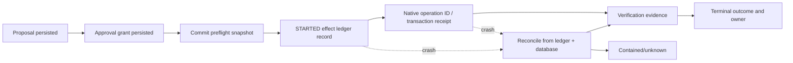
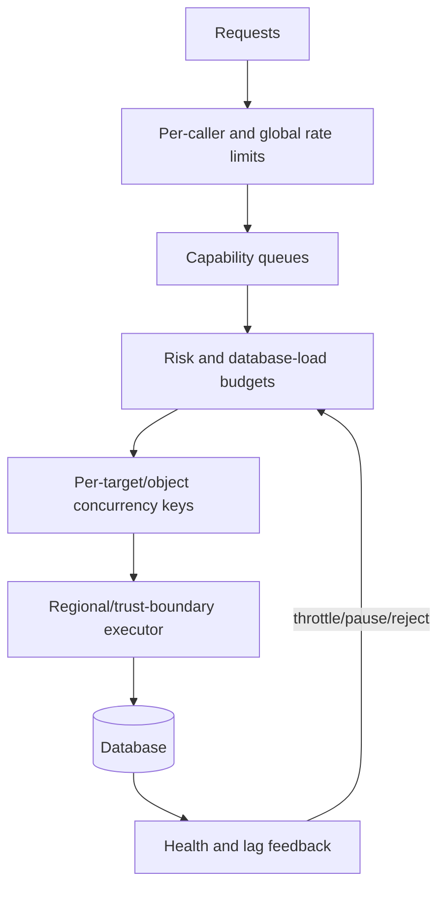

# Reliability, Observability, Scaling, and Operations

> **Status:** Research-backed production blueprint  
> **Last researched:** 2026-08-31  
> **Scope:** Failure handling, retries, checkpoints, telemetry, capacity, cost, deployment, incident response, and lifecycle operations  
> **Evidence:** [Research packet](../../research/packets/database-operations-agent-blueprint.md)  
> **Blueprint index:** [README](README.md)

The database agent is a safety-critical control system attached to another safety-critical system. Optimize first for bounded failure and recoverable state, then for autonomy or throughput.

## Failure taxonomy

| Failure class | Example | Required behavior |
|---|---|---|
| Intent/target | “Production orders” resolves to two clusters | No database access; require explicit immutable target |
| Evidence | Statistics reset, stale topology, truncated plan | Mark limitation; recollect or refuse effect |
| Reasoning | Invented column, wrong root cause, unsafe alternative | Schema/adapter validation; evidence-linked output; no authority from confidence |
| Policy/approval | Stale grant, wrong approver, changed plan | Fail closed and issue a new proposal |
| Admission | Target overloaded, window closed, conflicting effect | Queue, reject, or expire; never bypass a gate |
| Execution | Deadlock, lock timeout, provider rate limit | Capability-specific bounded retry only after classification/reconciliation |
| Ambiguous effect | Connection drops after commit/promotion request | Reconcile using native state and effect ledger before retry |
| Partial effect | Invalid index, paused online operation, half-complete batch | Contain and execute the pre-reviewed cleanup/recovery path |
| Verification | Object exists but workload regresses | Do not declare success; pause/recover/escalate |
| Continuity | Promotion succeeds but old primary still writes | Fence, stop routing, declare incident; avoid automatic reverse transition |
| Security/privacy | Restricted value appears in trace | Stop result propagation, revoke access, preserve restricted evidence, incident process |
| Control plane | Workflow worker or audit sink unavailable | Durable resume; writes fail closed unless authoritative record is guaranteed |

Retries are not a generic reliability feature. Retry observation on a transient transport error with jitter and a deadline. Retry an effect only when reconciliation proves no effect or the capability is semantically idempotent in the current target state. Authorization failures, failed invariants, syntax/unsupported capability, data corruption, and ambiguous state require correction or human ownership—not repeated attempts.

## Durable checkpoints

Checkpoint only after the preceding record is durably visible. Use optimistic state versions so two workers cannot advance one workflow. A per-target/object lease prevents concurrent cooperating effects, but every step still verifies the target and topology epoch because leases can expire or topology can change.

For long backfills, store key range, transformation version, batch receipt, and verification. For provider operations, store the provider request token and operation ID. For failover, store role observations and fencing evidence before promotion. For a restore drill, store immutable backup manifest and achieved recovery position.

## Observability design

Separate business/safety events from high-volume traces.

| Signal | Authoritative purpose | Must not be used as | Retention/access posture |
|---|---|---|---|
| Audit/event ledger | Who authorized/did/verified what; state reconstruction; evidence and effect hashes | Debug text stream or substitute for native database evidence | Durable, append-only/tamper-evident, restricted administration, policy/legal retention |
| Metrics | Aggregate rates, latency, safety outcomes, load, capacity, SLO/error-budget calculation | Per-effect proof, target identity store, or high-cardinality query/tenant log | Low-cardinality labels; operational retention; exemplars link to restricted traces |
| Traces | Causal timing across evidence, model, policy, approval, executor, database, and verifier | Authorization record or raw SQL/result archive | Sampled and access-controlled; query text sanitized; parameters/content opt-in only |
| Operational logs | Bounded diagnostics, adapter/provider errors, worker lifecycle, reconciliation detail | Durable workflow state, secret/result store, or approval channel | Structured safe error codes by default; raw diagnostics in encrypted restricted artifacts with shorter retention |
| SLOs/alerts | User-visible reliability and safety objectives by operating mode; page/ticket triggers | Average score that can hide tenant, duplicate-effect, fencing, or recovery hard failures | Versioned objective, window, owner, alert/runbook and review history |

### Audit and lifecycle events

- request accepted/rejected;
- target resolved and topology changed;
- evidence collected/expired;
- proposal normalized and risk classified;
- approval requested/granted/rejected/expired/invalidated;
- effect lease acquired/lost;
- preflight passed/failed;
- execution started, native receipt received, timeout/ambiguity detected;
- gate fired, cancellation requested/confirmed;
- verification passed/failed/unknown;
- containment, recovery, escalation, and ownership transfer;
- credential issued/revoked/expired;
- sensitive result viewed/exported/deleted.

Events include IDs and hashes, not raw secrets or result data.

### Operational logs

Emit structured event/workflow/attempt/adapter/native-operation correlation IDs, safe error class, retryability decision, cancellation/reconciliation status, and redacted diagnostic reference. Do not log connection strings, SQL parameters, result rows, approval tokens, broker credentials, or unrestricted provider payloads. Logging loss must be visible; for writable effects, the authoritative event/effect record is committed before execution rather than reconstructed later from logs.

### Metrics

Track by capability, engine adapter/version, environment, and risk tier—without high-cardinality database/query/tenant identifiers in labels:

- request and proposal rate; rejection/revision/approval/expiry rate;
- end-to-end and per-state latency, including human wait separately;
- evidence freshness and collection failures;
- policy denial reasons and commit-time drift invalidations;
- execution success, no-effect, ambiguous, contained, recovered, and escalated outcomes;
- retries after reconciliation and duplicate-effect count;
- database load induced: query duration, rows/bytes, lock wait, CPU/I/O/log approximation, replica lag contribution;
- verification failure and delayed-regression rate;
- restore drill achieved RPO/RTO and age since last passing drill;
- security isolation failures, redaction escapes, and credential lease anomalies;
- model tokens/cost and tool calls per completed advisory/proposal, as secondary efficiency indicators.

### Traces and artifacts

Trace request → evidence → planning → policy → approval → execution → verification with correlation IDs. Follow OpenTelemetry database semantic conventions, sanitize statements, and avoid query parameters by default. Model tool inputs/results can be sensitive; the OpenTelemetry GenAI conventions remain an evolving area, so pin the semantic-convention version and keep capture opt-in. Store large plans, lock graphs, diffs, raw native receipts, and restore reports as encrypted artifacts with hashes and access policy.

## Service objectives

Define SLOs by mode rather than one aggregate “agent success” number.

| Mode | Example SLO dimensions |
|---|---|
| Advisory | Evidence freshness, unsupported-claim rate, diagnosis usefulness, time to evidence bundle |
| Query assistant | Policy escape rate (target zero), tenant/PII escape rate (target zero), bounded completion, cancellation success, database budget adherence |
| Migration reviewer | Unsafe-plan miss rate, lock/rewrite forecast coverage, review latency, human acceptance with no safety override |
| Supervised operator | Duplicate/unknown effect rate, preflight drift detection, postcondition pass, containment time, human takeover time |
| Continuity | Passing restore-drill age, achieved RPO/RTO, fencing verification, failover reconciliation completeness |

Safety metrics are release gates, not error budgets to spend casually. Availability targets for advisory output should never motivate bypassing policy, approval, or verification.

## Admission control and scaling

Scale model inference and evidence processing separately from database work.

- Isolate queues for observation, query preview, migration, restore, and continuity work.
- Apply global, tenant, caller, target, and capability quotas.
- Permit many offline analyses but very few live expensive observations; default to one schema effect per conflicting object.
- Cache catalog snapshots only within their TTL and target/topology fingerprint. Never cache approvals or current-role decisions as ordinary application data.
- Use request coalescing for identical telemetry observations; do not repeat expensive plan/stat queries for every chat turn.
- Route database access through an executor near the target trust boundary, but keep policy and audit semantics identical.
- Feed live database health and replica lag into admission. Backpressure is a safety response, not a reason to provision infinite executor concurrency.

### Connection admission and database protection

Worker concurrency is not database concurrency. Account separately for controller work, evidence queries, execution sessions, verification probes, migration helper connections, restore/replay workers, provider control-plane calls, and application connections already consuming the target.

- Reserve database connections for the application, database administration/break-glass, health checks, and recovery; the agent receives only its explicit pool budget.
- Use one small pool per target/capability/trust boundary or a broker/proxy with equivalent isolation. Never let a global agent pool fan out until every database hits `max_connections` or worker limits.
- Admit from live headroom: configured and effective connection cap, active/idle-in-transaction count, pool wait, transaction age, CPU/I/O, lock queue, memory per session, replica lag, and recovery/background workers.
- Bound concurrent actual-plan/query previews more tightly than catalog reads. Serialize conflicting DDL and continuity effects. Restore and integrity-check workloads use a separate capacity class.
- Apply queue TTL and shed stale advisory work. Do not hold an approval, database connection, transaction, or lock while waiting in the model or human queue.
- Test connection storms, DNS/endpoint changes, proxy failover, half-open sockets, slow consumers, cancellation cleanup, and pool session-context reset. Verify released capacity from the database side.

### Recovery capacity and control-plane disaster recovery

Capacity planning must include the failure case, when backlog, replay, cache coldness, reconnects, verification, and operator queries arrive together.

| Capacity surface | Evidence required before writable release |
|---|---|
| Effect ledger/workflow/audit | Multi-zone/region recovery design as required; point-in-time restore drill; reconciled high-watermarks; no duplicate effect after failover |
| Artifact and key stores | Cross-boundary availability, key recovery, manifest integrity, retention/deletion behavior, tested access from the recovery environment |
| Executor fleet | Cold-start and dependency availability, per-target lease recovery, old/new worker version routing, credential issuer reachability |
| Database recovery | Restore transfer/replay/integrity throughput at realistic size, connection and I/O admission during warm-up, log/backup headroom |
| Application/downstream | Reconnect rate limiting, cache warm-up, job/CDC restart ordering, loss/duplicate reconciliation capacity |
| Human operations | Pager/approval fallback, break-glass and kill controls, incident handoff artifact, named ownership when the agent is unavailable |

The control plane's RTO is not the database RTO. A database can be writable while approvals, effect history, or reconciliation state are unavailable; in that condition the agent remains read-only or disabled. Quarterly recovery exercises should restore durable workflow/event state and prove the event/source high-watermarks and `UNKNOWN` effects before re-enabling execution.

### Cost reality

Token spend is visible, but production database load, engineer approval time, restore infrastructure, extended change windows, and incident risk usually dominate. Optimize in this order:

1. reduce unnecessary live evidence and database work;
2. reuse safe fresh artifacts;
3. shorten human review with clear canonical diffs and evidence;
4. route simple classification/summarization to cheaper evaluated models;
5. compress prompts without removing provenance or safety context.

Never trade a deterministic preflight or restore drill for fewer tool calls.

## Deployment and change management

Version all behavior that can affect an outcome:

- model and provider configuration;
- system prompt and evidence templates;
- tool/proposal/result schemas;
- policy bundle and risk rules;
- database/provider adapter and dialect parser;
- verifier definitions and thresholds;
- workflow definitions;
- evaluation datasets and scorers.

Release path:

1. Run unit, contract, policy, adapter, and replay tests.
2. Run engine/version matrices against ephemeral databases.
3. Replay historical incidents and proposals offline.
4. Shadow production observations with no user-visible or database effect.
5. Enable advisory output to a small qualified group.
6. Enable one bounded capability in canary targets and windows.
7. Compare safety, load, and human-override metrics; expand gradually.
8. Keep the preceding compatible executor/workflow version until active runs finish or migrate safely.

An engine major upgrade is an agent release event. Meta’s MySQL 8 migration found that operational automation broke on changed error codes and data-dictionary assumptions. Adapter tests must cover control-plane behavior and failure text, not only SQL syntax. See [Meta’s MySQL 8 migration](https://engineering.fb.com/2021/07/22/core-infra/mysql/).

## Incident response

### Kill controls

Provide independently authenticated controls to:

- stop new proposals or a capability globally/per environment/per target;
- freeze approval consumption;
- pause queued and pausable work;
- revoke executor credentials and block credential issuance;
- cancel a specific query/operation where cancellation is safe;
- fence a database member or executor network path;
- disable a model/prompt/adapter version;
- transfer all nonterminal workflows to a named incident owner.

Do not make the agent itself the only path to disable the agent.

### Incident handoff bundle

Include request, target fingerprint/topology history, canonical proposal and approval, state transition log, evidence and artifact hashes, issued credential metadata, native operation IDs/receipts, current lock/replication/backup state, verification failures, attempted cancellation/recovery, and explicit unknowns. Raw sensitive artifacts remain access-controlled.

After containment, review both database and agent/control-plane contributions. Add the failure to the evaluation corpus, update policy/adapter/runbook, expire affected outstanding approvals, and rehearse the fix before re-enabling the capability.

## Operational readiness checklist

- [ ] Effects survive worker restarts without blind retry or lost ownership.
- [ ] Audit and workflow records are durable before execution advances.
- [ ] Database-load admission, per-target serialization, and backpressure are enforced.
- [ ] Metrics distinguish rejection, no effect, ambiguous, contained, recovered, and verified success.
- [ ] Query text, parameters, results, prompts, traces, and artifacts are sanitized and access-controlled.
- [ ] SLOs and alerts exist per operating mode and safety property.
- [ ] Model, policy, adapter, verifier, and workflow releases are independently versioned and canaried.
- [ ] Engine upgrades run the full adapter/failure matrix.
- [ ] Kill switches, credential revocation, cancellation, fencing, and incident handoff are rehearsed.
- [ ] Capacity tests include approval bursts, database overload, provider rate limiting, and restore/failover operations.

## Related guides

- [Tool, effect, state, and approval contracts](04-tool-effect-state-and-approval-contracts.md)
- [Evaluation, failure injection, and delivery](09-evaluation-failure-injection-and-delivery.md)
- [Observability and tracing](../../evaluation/observability-and-tracing.md)
- [Scaling, capacity, and SLOs](../../operations/scaling-capacity-and-slos.md)
- [Deployment, release, and incident response](../../operations/deployment-release-and-incident-response.md)

## Selected sources

- [OpenTelemetry database span conventions](https://opentelemetry.io/docs/specs/semconv/db/database-spans/)
- [OpenTelemetry GenAI attribute registry](https://opentelemetry.io/docs/specs/semconv/registry/attributes/gen-ai/)
- [Temporal Activity definition](https://docs.temporal.io/activity-definition)
- [Temporal worker versioning](https://docs.temporal.io/production-deployment/worker-deployments/worker-versioning)
- [GitLab database outage postmortem](https://about.gitlab.com/blog/postmortem-of-database-outage-of-january-31/)
- [GitHub October 2018 incident analysis](https://github.blog/news-insights/company-news/oct21-post-incident-analysis/)
