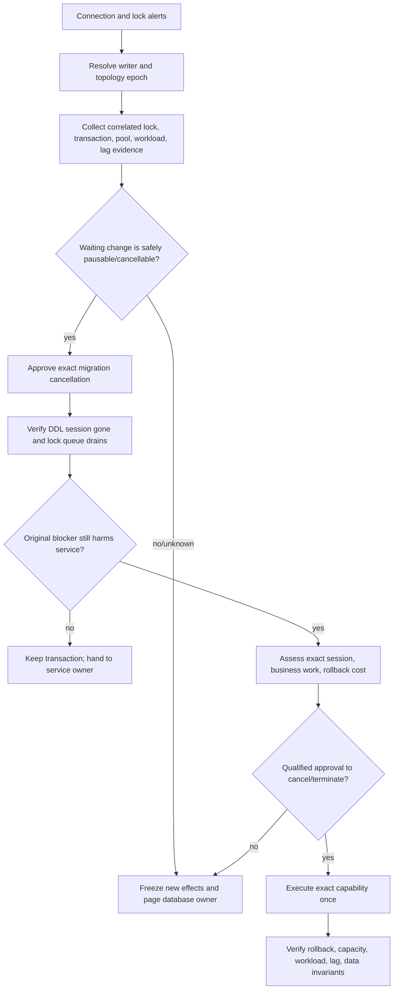
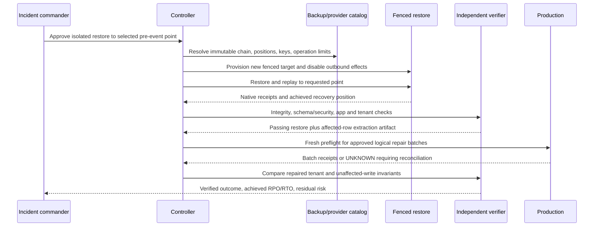

# Production Runbooks and Walkthroughs

> **Status:** Research-backed production blueprint  
> **Last researched:** 2026-08-31  
> **Scope:** Executable runbook structure and realistic diagnosis, migration, restore, and failover walkthroughs  
> **Evidence:** [Research packet](../../research/packets/database-operations-agent-blueprint.md)  
> **Blueprint index:** [README](README.md)

These runbooks show how the contracts in the blueprint behave under pressure. They are templates, not commands to copy into an unknown database. Replace thresholds, evidence collectors, engine operations, approver roles, and recovery steps with qualified deployment-specific values; rehearse every writable path on representative infrastructure.

The synthetic `orders` service used below has a PostgreSQL primary and replica for concrete examples. Each runbook names the points where MySQL, SQL Server, Oracle, or a managed service requires a different adapter. The model may explain evidence and draft the next typed proposal. Deterministic policy, database-native controls, qualified humans, and effect reconciliation own execution.

## Runbook contract

Every production runbook should be executable without depending on a chat transcript.

| Field | Required content |
|---|---|
| Trigger and non-trigger | Exact alert/request plus conditions where this runbook must not be used |
| Authority | Read-only diagnosis, DML, DDL, admin, continuity, break-glass; requester/approver/executor/verifier separation |
| Target | Immutable resource/database/object identity, topology epoch, tenant scope, engine/build/provider |
| Inputs | Freshness-bounded evidence, source high-watermarks, classifications, known limitations |
| Preconditions | Database, application, workload, replication, backup, storage, connection, security, and change-state checks |
| Plan | Typed fixed steps with per-step budgets, expected receipts, pause/cancel semantics, and no improvisation after approval |
| Gates | Start/continue/throttle/pause/cancel/contain/escalate thresholds and who may change them |
| Verification | Object/data/workload/application/security/recovery postconditions independent of the planner |
| Recovery | Transaction rollback, compensation, forward fix, traffic switchback, PITR, or human repair—with proof and owner |
| Unknown handling | Reconciliation query, native/provider operation ID, next safe action, and forbidden retries |
| Handoff | Current state, approvals, effects, explicit unknowns, artifacts, owner, deadline, and communication channel |
| Exit evidence | Terminal outcome, residual risk, audit hash, metrics, follow-up owners, and new evaluation fixture |

Before an effect, freeze the canonical plan and approval. During an effect, the model cannot add a step, widen a target, raise a budget, select another credential, or reinterpret a failed gate. After an ambiguous transport result, the next action is reconciliation, not repetition.

## Walkthrough 1: connection saturation and a DDL lock convoy

### Trigger, scope, and authority

**Synthetic incident:** application checkout latency and database connections rise sharply. A deployment started `ALTER TABLE orders ...`, the DDL waits behind a six-minute application transaction, and later requests queue behind the waiting DDL. Replica lag is also increasing.

Start this runbook when connection/pool saturation coincides with lock-wait growth or transaction age. Do not use it for CPU-only saturation without lock evidence, a known provider outage, or a security incident requiring separate containment.

The advisory capability may collect catalog, session, lock, pool, workload, and replication evidence. It has no cancel/terminate authority. `query.cancel` and `session.terminate` are separate R3/R4 effects: the exact native session/request, owning service, transaction age, rollback cost, and approver must be known. The migration executor identity is frozen while incident command decides containment.

### Deterministic evidence bundle

Collect one time-correlated snapshot, then refresh only volatile fields:

- target fingerprint, writer member, topology epoch, engine build, provider state;
- effective connection cap, active/idle/idle-in-transaction sessions, pool waiters and timeout rate;
- blocker/wait graph with native session/transaction IDs, lock resource/mode, statement fingerprints, transaction start and application identity;
- DDL operation ID/progress, lock and statement budgets, migration artifact hash and owner;
- top workload fingerprints, error/latency, CPU/I/O/log/temp/storage and recent deployment/change events;
- replica receive/replay positions, backlog/lag trend, slot/queue retention and disk headroom;
- safe cancellation semantics and estimated rollback/recovery cost for each candidate session/operation.

Use engine-specific collectors: PostgreSQL `pg_locks` joined to activity/transaction evidence, MySQL Performance Schema and InnoDB lock views plus metadata-lock evidence, SQL Server DMVs/Query Store and request/session IDs, or Oracle wait/session/transaction and cursor evidence. A lock graph is a timestamped observation, not a durable handle.

### Decision tree



Cancel the waiting DDL first when that safely removes the convoy; killing the original transaction may discard customer work and create expensive rollback. Do not choose a victim solely because it is the oldest or appears at the root of one snapshot. The owning application, transaction semantics, and rollback cost matter.

### Example incident progression

| Time | Evidence and state | Safe action |
|---|---|---|
| 10:02 | Pool utilization 96%; DDL waits; transaction `tx-781` owns required lock; topology epoch 42 | Freeze new database effects; no cancellation yet |
| 10:03 | DDL artifact and session match approved migration; adapter says cancellation is safe before engine commit; lag is rising | Incident approver binds exact DDL session and cancellation budget |
| 10:04 | Cancel request returns transport timeout | Mark effect `UNKNOWN`; reconcile session and object definition; do not send cancel again blindly |
| 10:05 | Native session absent; schema definition unchanged; connection queue starts draining | Record `NO_EFFECT` on schema plus verified cancellation outcome; continue observation |
| 10:07 | `tx-781` completes normally; pools below 70%; lag trend recovering | No customer transaction termination; keep migration disabled |
| 10:20 | Workload and replication gates stable; audit complete | Exit incident containment; migration requires a new proposal and window |

### Gates and exit evidence

Page/contain if target role is ambiguous, the DDL may have committed, the cancellation result remains unknown, rollback saturates storage/log, fencing/cancellation is unavailable, or database evidence conflicts with the provider control plane. Exit only after connection and pool headroom, transaction age, lock queue, error/latency, replication backlog, storage/log headroom, and critical application probes remain within thresholds for the defined soak.

The handoff includes the lock-graph artifacts and timestamps, exact sessions/actions, migration hash, approval and cancellation receipt, schema definition before/after, replication positions, data/application checks, remaining long transactions, and owner for rescheduling. Turn the convoy and timeout into adapter and failure-injection fixtures.

## Walkthrough 2: expand/contract migration on a hot orders table

### Change intent and rejection conditions

**Synthetic change:** add `fulfillment_region`, backfill 1.8 billion order rows, enforce validity, and support a new lookup without blocking writes. Application versions overlap for two weeks.

Reject a one-shot `ADD ... NOT NULL DEFAULT` or full-table update until the exact engine/build/provider demonstrates its lock/rewrite behavior at representative scale. Reject execution when object identity/schema hash drifted, oldest transactions exceed the lock budget, free space/log headroom is unproved, replica retention is unsafe, the application cannot read both shapes, the established migration tool/history is unavailable, or no restore/forward-repair path passes rehearsal.

### Immutable migration plan

1. **Expand schema.** Add a compatible nullable column or companion structure using the qualified engine primitive. Create supporting index/constraint in the engine-specific online/concurrent/staged mode and fail if that mode is unsupported.
2. **Deploy compatible writers/readers.** New code writes the value; all deployed readers tolerate null/old shape. Record application compatibility high-watermarks.
3. **Backfill.** Use stable keyset ranges, fixed transformation version, small transactions, deterministic rate/lag/connection gates, per-batch receipt and invariants.
4. **Repair concurrent gaps.** Re-scan eligible rows or consume a governed change stream; prove no missing/incorrect values rather than trusting batch counts.
5. **Validate.** Check null/allowed-value/domain invariants, tenant partitions, application probes, query plans, index health, privileges/policies, replication and backup impact.
6. **Enforce.** Add/validate the final constraint through the engine-qualified path. Use a separately approved artifact and fresh preflight.
7. **Switch and soak.** Move reads behind a feature/routing flag; monitor workload and correctness through a stated period.
8. **Contract later.** Remove old compatibility behavior only after rollback/switchback window and old application versions are gone.

The plan has separate operation/effect IDs. Approval for expansion does not authorize backfill, enforcement, or contraction.

### Engine adapter branches

| Engine | Evidence the adapter must supply |
|---|---|
| PostgreSQL 18 | Whether each `ALTER` rewrites/scans/locks; transaction constraints; `CREATE INDEX CONCURRENTLY` waits, two scans, invalid residue and cleanup; staged constraint-validation option; WAL/slot/storage impact |
| MySQL 8.4 LTS | Per-operation `INSTANT`/`INPLACE`/`COPY` and `LOCK` support for the exact schema; metadata-lock convoy risk; online-log/storage and replication impact; no silent downgrade from requested concurrency |
| SQL Server 2025 | Edition/platform support for `ONLINE`, resumable, and low-priority options; schema-lock phases, abort policy, transaction-log/temp/storage impact and resumable state reconciliation |
| Oracle 26ai | Implicit DDL commits; online redefinition/online operation eligibility and VPD/policy interaction; `DDL_LOCK_TIMEOUT`; intermediate/redefinition object cleanup and forward-recovery plan |

Flyway or Liquibase remains the migration-history authority if the project uses it. Pin its exact artifact and configuration. Flyway transaction grouping cannot make non-transactional engine statements transactional. Liquibase automatic rollback is change-type and changelog-format specific. `gh-ost`, when already qualified for MySQL, brings binlog, privilege, topology, trigger/foreign-key, throttle, hook, and cutover prerequisites rather than generic “online” safety.

### Backfill effect and reconciliation

```yaml
capability: backfill.keyset_batch.v2
target: {fingerprint: 'sha256:...', topology_epoch: '42', object_id: '...'}
transformation: {version: fulfillment-region/3, artifact_hash: 'sha256:...'}
range: {after_id: 920000000, through_id: 920049999}
budgets: {rows: 50000, wall_time: 20s, lock_wait: 250ms, connections: 1}
abort_gates: {replica_lag: 10s, pool_wait_p95: 50ms, log_headroom: 30m}
effect_key: 'sha256:capability+target+transform+range'
verification: [eligible_count, updated_count, domain_invariant, tenant_invariant]
```

If the worker disconnects after commit, query the range and transformation marker/invariants using a new bounded transaction. Retry only when reconciliation proves the batch absent. A partially correct range is a repair case, not an unqualified rerun.

### Rehearsal, benchmark, and exit evidence

Benchmark at production-like table/index size, write/read concurrency, data skew, longest transaction, replica/backlog, connection budget, cold/warm cache, and storage/log limits. Measure lock acquisition and hold time, total and tail application latency, error rate, rows/bytes/log per batch, replica apply throughput, storage peak, cancel/pause latency, restart/reconciliation time, and plan regression. Failure-inject before send, after batch commit, during online build, during cutover, after constraint enforcement, and while the topology epoch changes.

Exit each phase with its object/schema/history hashes, application compatibility evidence, effect receipts, invariants, workload/replication/storage results, explicit residue, and next owner. The migration exits only after the final soak and a separate contract approval; it is not complete merely because the DDL tool returned zero.

## Walkthrough 3: accidental data change and point-in-time recovery

### Incident framing

**Synthetic incident:** a privileged application job updated the wrong tenant at 14:07 UTC. Detection occurred at 14:19. Replication is healthy—but contains the same bad change. The service RPO is five minutes and the team cannot discard other tenants' valid writes between 14:07 and detection.

Freeze the offending job/credential and conflicting database effects. Preserve audit/query/job evidence and current backup/log retention. Do not immediately restore over production or fail over to a replica. The decision is among logical repair from an isolated PITR copy, full service PITR/cutover, application compensation, or another approved recovery method.

### Recovery-point and backup preflight

- Bind the source database incarnation, destructive transaction/fingerprint and best-known before/after recovery positions—not only a wall-clock timestamp with uncertain clock semantics.
- Resolve a complete immutable backup/log/WAL/binlog chain, retention dependencies, checksums/manifests, tool/engine compatibility, storage location and all encryption key versions/permissions.
- Prove the isolated destination identity, network fence, no production route, no outbound jobs/CDC/email/payment/webhook, sanitized application configuration, capacity quota and expiry.
- Estimate transfer, provision, restore, replay, integrity, extraction/reconciliation, application validation and optional cutover time separately.
- Preserve log/backup retention while investigating. A cleanup automation must not delete the only usable recovery chain.

Provider behavior is not portable: Cloud SQL PITR creates a new instance; restoring over an existing Cloud SQL target can overwrite its current data and PITR logs. Amazon RDS Blue/Green production does not inherit the older blue PITR history. Oracle Autonomous backup/restore, key and Data Guard restrictions vary by deployment. SQL Server backup/log chains and recovery model, PostgreSQL base/WAL dependencies, MySQL backup/binlog continuity, and Oracle RMAN/catalog/wallet requirements need native verification.

### Isolated restore and repair workflow



In this scenario, the passing pre-event restore supplies a trusted comparison for the affected tenant. A separate typed DML repair copies or reconstructs only proven affected rows while preserving other tenants' later valid writes. Each repair batch has keyset bounds, before/after hashes or domain invariants, tenant scope, log/lag/load gates, approval and reconciliation. Bulk export/import is not implied authority.

Choose full PITR/cutover only if corruption scope makes selective repair unsafe and business authority accepts the loss/reconciliation plan for all post-point writes. A healthy replica is useful evidence or an availability target, not an uncorrupted recovery source for a replicated bad change.

### Data-loss, capacity, and completion gates

Before any cutover or destructive repair, record:

- requested and achieved recovery point, uncertainty, affected and preserved write windows;
- transaction/entity/tenant exposure and reconciliation method/owner;
- restore throughput and projected RTO at actual data/log volume;
- destination connection/CPU/I/O/storage/cache headroom plus application reconnect admission;
- backup/PITR availability after transition, encryption key access and retention;
- fencing/routing/single-writer evidence if the restored target becomes production;
- application, data, security policy, jobs, CDC/subscriber and audit verification.

If the isolated restore cannot prove integrity/application completeness, keep the incident open and try another qualified recovery source/point. If a production repair returns an ambiguous result, stop the next overlapping batch until reconciliation proves its outcome. Completion requires repaired business invariants, no unintended tenant/object change, stable workload/replication, restored protection, destroyed or retained restore data under policy, achieved RPO/RTO, and named follow-ups for the original privilege/job failure.

## Walkthrough 4: lagged regional failover

Use this runbook only after the service has reached [Stage 5](09-evaluation-failure-injection-and-delivery.md#stage-5-continuity-operations).

**Synthetic incident:** the primary region is unreachable. The designated cross-region replica last reported a 38-second apply gap; the business RPO is 30 seconds. The network partition means the old primary may still accept writes from regional workers.

1. Freeze agent effects and credential issuance; acquire the topology transition lease.
2. Resolve provider/database roles and positions from multiple authoritative signals. Mark the old primary state unknown.
3. Fence old-region application workers, database endpoints, job runners and other writers at infrastructure/provider boundaries. If fencing cannot be proven, stop unless incident authority accepts the explicit split-brain exception.
4. Convert the 38-second technical gap into potentially absent transactions/entities/tenants and compare failover, continued wait, or backup restore. Record uncertainty; do not round it down to the RPO.
5. Require incident-command and database authority over the candidate member IDs, positions, maximum accepted loss, fencing receipt, routing plan, recovery plan and expiry.
6. Call the provider-native transition once with the effect/request key. Persist its native operation ID. Timeout enters `UNKNOWN`; poll/reconcile the same transition rather than starting another.
7. On confirmed promotion, advance topology epoch; invalidate old grants, leases, caches and credentials; update routing; prove only the new writer accepts writes.
8. Rate-limit application reconnects. Verify critical transactions, data-gap/duplicate reconciliation, connection/load headroom, jobs, CDC/subscribers, replicas, observability, backup and PITR.
9. Keep the old primary fenced. Rejoin/reseed/repair is a separate workflow after divergence evidence is preserved.

AWS Aurora Global Database explicitly documents that cross-region loss depends on lag and old-primary fencing can be best effort. Cloud SQL advanced-DR replica failover can lose lagging data and temporarily lacks PITR after the post-promotion backup begins. Azure SQL forced failover can lose asynchronously replicated data. Oracle Autonomous manual failover can lose data depending on topology/protection. These statements justify separate provider adapters and data-loss approvals; they do not predict this deployment's exact loss.

## Drill cadence and runbook ownership

| Runbook | Minimum rehearsal evidence |
|---|---|
| Lock/connection incident | Quarterly per engine or after driver/pool/major engine change; cancellation and rollback under workload |
| Expand/contract migration | Every new primitive/tool/engine combination; representative size and concurrency before each high-risk change |
| Restore/PITR | Full application restore on the service's RPO/RTO cadence; chain/key loss and isolated-environment controls injected |
| Failover | Planned switchover regularly; loss/fencing tabletop and controlled failure drill; after provider/topology change |

Each runbook has a database owner, application owner, incident/change approver, executor/verifier owners, last passing drill, tested versions/topology, known limitations, expiry, and links to immutable evidence. A failed drill disables the affected writable capability or narrows its support matrix until remediation passes.

## Related guides

- [Discovery, analysis, and query safety](03-discovery-analysis-and-query-safety.md)
- [Migrations, transactions, locks, and rollback](05-migrations-transactions-locks-and-rollback.md)
- [Backup, restore, replication, and failover](06-backup-restore-replication-and-failover.md)
- [Reliability, observability, scaling, and operations](08-reliability-observability-scaling-and-operations.md)
- [Evaluation, failure injection, and delivery](09-evaluation-failure-injection-and-delivery.md)

## Selected sources

- [PostgreSQL lock monitoring](https://www.postgresql.org/docs/current/view-pg-locks.html)
- [MySQL metadata locking](https://dev.mysql.com/doc/refman/8.4/en/metadata-locking.html)
- [SQL Server Query Store](https://learn.microsoft.com/en-us/sql/relational-databases/performance/monitoring-performance-by-using-the-query-store?view=sql-server-ver17)
- [Oracle Data Guard transition assessment](https://docs.oracle.com/en/database/oracle/oracle-database/26/haovw/role-transition-assessment-tuning-and-troubleshooting.html)
- [Amazon RDS Blue/Green limitations](https://docs.aws.amazon.com/AmazonRDS/latest/UserGuide/blue-green-deployments-considerations.html)
- [Amazon Aurora Global Database disaster recovery](https://docs.aws.amazon.com/AmazonRDS/latest/AuroraUserGuide/aurora-global-database-disaster-recovery.html)
- [Cloud SQL advanced disaster recovery](https://docs.cloud.google.com/sql/docs/postgres/use-advanced-disaster-recovery)
- [Azure SQL failover groups](https://learn.microsoft.com/en-us/azure/azure-sql/database/failover-group-configure-sql-db?view=azuresql)
- [Oracle Autonomous backup and restore](https://docs.oracle.com/en-us/iaas/autonomous-database-serverless/doc/backup-restore.html)
- [GitLab database outage postmortem](https://about.gitlab.com/blog/postmortem-of-database-outage-of-january-31/)
- [GitHub October 2018 incident analysis](https://github.blog/news-insights/company-news/oct21-post-incident-analysis/)
