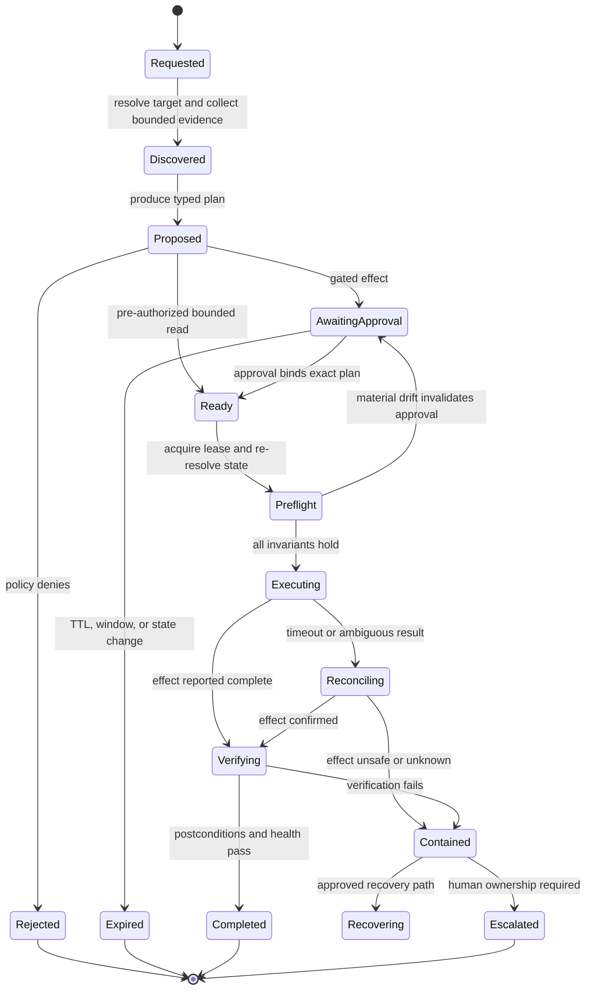

# Database Operations Agent Blueprint

> **Status:** Research-backed production blueprint  
> **Last researched:** 2026-08-31  
> **Scope:** Database discovery, query analysis, schema-change review, supervised operations, backup/restore, and failover across PostgreSQL 18, MySQL 8.4 LTS, SQL Server 2025, and Oracle AI Database 26ai  
> **Evidence:** [Research packet](../../research/packets/database-operations-agent-blueprint.md)

A database-operations agent should not be a chatbot with a privileged SQL tool. The safe production shape is a constrained reasoning component inside a deterministic database safety plane:

> **The model proposes and explains. Application-owned policy authorizes. Capability-scoped tools execute. Independent checks decide whether the outcome is acceptable.**

This separation matters because a syntactically valid statement can still block a hot table, expose another tenant, exhaust replica capacity, invalidate a backup chain, or promote the wrong replica. Natural-language intent and model confidence are not authorization signals.

## Recommended operating posture

Build capability in this order. Each level keeps the controls of the levels before it.

| Mode | Typical outputs | Database authority | Recommended posture |
|---|---|---:|---|
| Advisory analyst | Diagnosis, evidence bundle, runbook suggestion | None | Safe default and first release |
| Query assistant | Parameterized read query, estimated plan, bounded result | Dedicated read-only capability | Useful after tenant, PII, cost, and timeout controls exist |
| Migration reviewer | DDL critique, lock forecast, expand/contract plan, rollback or recovery plan | None by default | Prefer proposal artifacts that humans or CI apply |
| Supervised operator | Predefined maintenance, migration, restore drill, or failover workflow | Narrow, temporary, approval-bound | Last stage; use only for rehearsed capabilities with deterministic gates |

Do not make “autonomous DBA” a fifth level. In the 2026 DBA-Bench preprint, the best evaluated agent achieved a 17.9% safe-pass rate on live PostgreSQL operations, compared with 93.4% for human DBAs. The benchmark is new and its artifacts were still being finalized when researched, so its exact numbers should not be generalized; the large safety gap is nevertheless a strong reason to require supervision and independently enforced controls. See [DBA-Bench](https://arxiv.org/abs/2607.22165) and its [artifact repository](https://github.com/TanJI-C/DBA-Bench).

## Reference architecture

```mermaid
flowchart LR
    U[Operator or calling service] --> I[Intent and target selector]
    I --> D[Discovery and evidence collector]
    D --> M[Model planner and critic]
    M --> P[Typed proposal]
    P --> V[Deterministic policy and risk engine]
    V -->|reject or revise| U
    V -->|approval required| A[Approval service]
    A --> C[Commit-time revalidation]
    V -->|pre-authorized read| C
    C --> X[Capability-scoped engine adapter]
    X --> DB[(Database or managed service)]
    DB --> O[Independent outcome verifier]
    O --> L[Effect ledger, audit, metrics, artifacts]
    O -->|unexpected state| H[Stop, contain, recover, escalate]
```

The model never receives a generic production credential or an unrestricted `execute_sql` primitive. It receives catalog snapshots, redacted evidence, and tools whose schemas encode the permitted effect. The executor resolves credentials just in time, verifies the target again, enforces budgets, records the effect, and discards the credential.

### Control-plane components

| Component | Must be deterministic about | May use model reasoning for |
|---|---|---|
| Target resolver | Environment, cluster identity, database, tenant, topology epoch | Explaining the selected target |
| Evidence collector | Query budgets, redaction, provenance, freshness | Choosing which approved evidence to request next |
| Planner | Schema-valid proposal output | Diagnosis, alternatives, migration decomposition |
| Policy engine | Identity, capability, risk, window, separation of duties | Nothing authoritative |
| Approval service | Immutable plan hash, approver eligibility, expiry | Human-readable summary |
| Executor | Statements, ordering, timeouts, cancellation, idempotency | Nothing that changes the approved effect |
| Verifier | Postconditions, health thresholds, tenant/security invariants | Summarizing discrepancies |
| Effect ledger | Append-only attempt and outcome records | Nothing authoritative |

## The production control loop

An approval is not “permission to do something similar.” It binds the target fingerprint, topology epoch, exact proposal artifact, normalized statements or workflow steps, risk class, credential class, change window, abort thresholds, recovery plan, approver, and expiry. Any material drift creates a new proposal.

## Non-negotiable invariants

1. **Target identity is fail-closed.** Every effect names environment, provider, account or subscription, region, cluster or server, database, and where relevant tenant. Friendly aliases are never sufficient at commit time.
2. **Read-only is a capability, not a claim.** Reads can expose PII, create load, block DDL, call side-effecting functions, or write temporary objects. Use database privileges, session settings, replica routing, parser checks, resource limits, and result redaction together.
3. **Approval cannot be self-issued.** The planner cannot approve its own proposal, broaden a credential, extend an expired window, or weaken a failed postcondition.
4. **Unknown effects are reconciled before retry.** Network timeouts and worker crashes may occur after the database committed. Retrying blind can duplicate or compound the effect.
5. **Rollback is not assumed.** Oracle DDL implicitly commits; MySQL migration transaction behavior is operation-dependent; many large data changes are operationally irreversible. Every proposal declares either a tested rollback or a forward-recovery/restore path.
6. **A replica is not a backup.** Replication can faithfully copy deletion and corruption. Backup validation progresses from inventory and checksum checks to isolated restore and application-level verification.
7. **Failover requires fencing.** Promotion is not complete until the old primary is prevented from accepting writes, routing is verified, data-loss exposure is acknowledged, and dependent jobs and consumers are reconciled.
8. **Tenant and PII boundaries survive observability.** Tool arguments, query text, results, traces, model prompts, and approval artifacts receive the same data-handling controls as the database.
9. **Database-native protections remain authoritative.** Row policies, roles, resource governors, lock timeouts, and provider guardrails must not be replaced by prompt instructions.
10. **Every writable capability has a kill path.** Stop new work, cancel safely where supported, expire credentials, fence the target, and transfer ownership to a named human.

## Guide map

| Guide | Primary decision |
|---|---|
| [Operating models, requirements, and risk](01-operating-models-requirements-and-risk.md) | Which mode is justified, and what must never be delegated? |
| [Reference architecture, runtime, and control](02-reference-architecture-runtime-and-control.md) | Where should model reasoning stop and deterministic execution begin? |
| [Discovery, analysis, and query safety](03-discovery-analysis-and-query-safety.md) | How can the agent inspect databases without turning analysis into an incident? |
| [Tool, effect, state, and approval contracts](04-tool-effect-state-and-approval-contracts.md) | What exact contracts make proposals reviewable, replay-safe, and auditable? |
| [Migrations, transactions, locks, and rollback](05-migrations-transactions-locks-and-rollback.md) | How should schema and data changes account for engine-specific semantics? |
| [Backup, restore, replication, and failover](06-backup-restore-replication-and-failover.md) | How are recoverability and role transitions verified rather than assumed? |
| [Security, identity, tenancy, and PII](07-security-identity-tenancy-and-pii.md) | How are privileges, tenants, secrets, and sensitive data isolated? |
| [Reliability, observability, scaling, and operations](08-reliability-observability-scaling-and-operations.md) | How does the system behave through retries, overload, incidents, and releases? |
| [Evaluation, failure injection, and delivery](09-evaluation-failure-injection-and-delivery.md) | What evidence is required before each capability reaches production? |
| [Production runbooks and walkthroughs](10-production-runbooks-and-walkthroughs.md) | What does safe diagnosis, migration, and recovery look like under realistic pressure? |

## Fast design decisions

| Question | Default answer |
|---|---|
| Custom loop or agent framework? | A small custom safety controller; frameworks may assist planning but cannot own authorization or effects. |
| Workflow engine? | Add one only for long-lived approvals, change windows, restore drills, and failover workflows that must survive restarts. |
| One executor for all engines? | One stable effect contract with engine-specific adapters and explicit capability discovery. |
| Query rewriting for tenant safety? | Do not rely on it. Enforce tenant boundaries in database-native policy or isolated credentials/databases; parsing is defense in depth. |
| Estimated or actual plans? | Estimated by default. Actual plans only on a safe target with an explicitly bounded execution policy. |
| Automatic rollback? | Only when the adapter proves the operation is transactionally reversible and the rollback was tested. |
| Human approval for every read? | No. Pre-authorize narrow reads with resource and data budgets; gate sensitive or unusually expensive reads. |
| Human approval for every write? | Initially yes. Later, only pre-approved, rehearsed, low-blast-radius workflows may bypass per-run approval. |
| Model confidence threshold? | Never an authorization gate. Use executable preconditions, policy, independent verification, and evaluation evidence. |

## Baseline compatibility

This blueprint uses current stable or long-term-support documentation as of the research date: PostgreSQL 18.6; MySQL 8.4 LTS, with 8.4.11 as the general server release and 8.4.12 documented as a Docker-image-only security update; SQL Server 2025 (17.x, CU8 current); and Oracle AI Database 26ai. Engine and managed-service capabilities change; each adapter must probe server build, edition, configuration, topology, and provider features rather than infer support from a brand name. Refresh the packet at every engine major upgrade and before enabling a new writable capability.

## Selected sources

- [PostgreSQL versioning policy](https://www.postgresql.org/support/versioning/)
- [MySQL 8.4 release notes](https://dev.mysql.com/doc/relnotes/mysql/8.4/en/)
- [SQL Server 2025 release notes](https://learn.microsoft.com/en-us/sql/sql-server/sql-server-2025-release-notes?view=sql-server-ver17)
- [Oracle AI Database 26ai documentation](https://docs.oracle.com/en/database/oracle/oracle-database/26/)
- [OWASP AI Agent Security Cheat Sheet](https://cheatsheetseries.owasp.org/cheatsheets/AI_Agent_Security_Cheat_Sheet.html)
- [GitLab database outage postmortem](https://about.gitlab.com/blog/postmortem-of-database-outage-of-january-31/)
- [GitHub October 2018 incident analysis](https://github.blog/news-insights/company-news/oct21-post-incident-analysis/)
