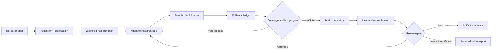

# Production Deep-Research Agent Blueprint

> **Status:** Research-backed production blueprint  
> **Research baseline:** 2026-08-31  
> **Scope:** Open-web and approved private-corpus research that produces reproducible, claim-level cited artifacts  
> **Evidence:** [Deep-research agent research packet](../../research/packets/deep-research-agent-blueprint.md)

A deep-research agent is not a chatbot with search. It is a long-running evidence-production system. It turns a bounded research brief into a versioned artifact whose important claims can be traced to captured evidence, challenged, refreshed, and reproduced.

The recommended production shape is **hybrid**:

- deterministic application code owns identity, policy, budgets, durable state, retries, evidence integrity, and release gates;
- one adaptive research loop chooses queries and follows leads;
- bounded workers are added only when the brief contains genuinely independent breadth;
- a separate verification pass checks claim support, citations, quotes, contradictions, and freshness before publication.

The evidence ledger—not the conversation transcript—is the center of the design. Search results, fetched representations, extracted passages, claims, citations, contradictions, and artifact revisions have stable identifiers and explicit provenance.

## What this blueprint is for

Use it for systems that must:

- decompose ambiguous, multi-part questions;
- search and browse repeatedly rather than retrieve once;
- combine public web, scholarly, and authorized internal sources;
- preserve citation and quote integrity across a long run;
- expose disagreement instead of silently averaging it away;
- resume after worker, network, or provider failure;
- prove which evidence supported each released claim;
- refresh time-sensitive claims without rerunning everything blindly;
- evaluate research quality beyond prose style or citation count.

Do **not** use a deep-research architecture for simple lookups, low-latency chat, deterministic database reports, or tasks with a known fixed retrieval path. Those should use direct retrieval, SQL/analytics, or a small workflow.

## Read in this order

| Guide | Decision it helps you make |
|---|---|
| [Requirements and threat model](requirements-and-threat-model.md) | Define the research contract, non-goals, trust boundaries, risks, and release invariants |
| [Architecture and stack selection](architecture-and-stack-selection.md) | Choose single-agent, orchestrator-worker, workflow, custom, framework, or hybrid boundaries |
| [Connectors and provider qualification](connectors-and-provider-qualification.md) | Qualify search, web, browser, database, document, paper, dataset, archive, enterprise, and managed-research adapters |
| [Research loop and source acquisition](research-loop-and-source-acquisition.md) | Design decomposition, search, browsing, parsing, coverage, stopping, and cost controls |
| [Evidence, citations, and verification](evidence-citations-and-verification.md) | Specify the evidence ledger, source quality, atomic claims, quotes, contradictions, freshness, and reproducibility |
| [State, context, and artifacts](state-context-and-artifacts.md) | Keep long runs coherent without treating the context window as storage |
| [Security, permissions, and isolation](security-permissions-and-isolation.md) | Contain prompt injection, SSRF, exfiltration, private-source mixing, and unsafe content |
| [Reliability, observability, and operations](reliability-observability-and-operations.md) | Recover safely, deploy versions, trace research, control capacity, and operate at scale |
| [Evaluation and acceptance testing](evaluation-and-acceptance-testing.md) | Build research-specific offline, failure-injection, safety, and release evaluations |
| [Implementation blueprint](implementation-blueprint.md) | Apply concrete contracts, pseudocode, configuration, storage layout, and a staged roadmap |
| [Worked cases, exercises, and runbooks](worked-cases-exercises-and-runbooks.md) | Rehearse public, private, correction, recovery, and rollout paths from zero to production |

For a first implementation, read the requirements, connector, research-loop, evidence, and implementation guides; then build Case 1 in the worked guide against a frozen corpus. Add private sources, parallel workers, and managed research only after the single-loop evidence path passes its gates.

## Scope boundary with adjacent agents

This blueprint owns the **general evidence-production substrate**: bounded planning, heterogeneous acquisition, source identity, claims, citations, reproducibility, and production operations. It deliberately does not absorb the domain workflows of adjacent agents:

| Adjacent area | It owns | This blueprint may provide |
|---|---|---|
| Enterprise Knowledge | Continuous organization-wide ingestion, knowledge retrieval UX, ACL-aware knowledge maintenance | A scoped private-source adapter and evidence contract for one approved brief |
| Competitive Intelligence | Recurring competitor monitoring, market/entity ontology, alerts, strategic interpretation | General public research, source provenance, and refresh primitives |
| Patent/IP Research | Patent-family/legal-status semantics, claim charts, prosecution history, freedom-to-operate workflow | Generic patent-source acquisition and cited evidence only when a specialist policy owns interpretation |
| Regulatory Intelligence | Jurisdiction/effective-date ontology, rulemaking lifecycle, obligation mapping, regulatory change operations | Generic official-source capture, versioning, contradiction, and refresh mechanics |
| Scientific Research | Experimental design, domain methods, statistical analysis, lab/data workflows, scientific synthesis | Paper/dataset discovery, provenance, citation, and reproducibility infrastructure |
| Investigative Journalism | Source protection, confidential-human-source handling, editorial/legal review, publication workflow | General open-source evidence and artifact lineage without newsroom authority |

When a brief crosses one of these boundaries, keep the deep-research controller as a supporting component and route domain decisions to the specialized workflow. Do not silently emulate specialist authority with a stronger prompt.

## System guarantees versus model behavior

| Concern | Model or framework may help with | Application must guarantee |
|---|---|---|
| Decomposition | Propose subquestions and searches | Contract coverage, bounds, ownership, and change history |
| Retrieval | Rank or choose queries | Connector authorization, robots/terms policy, SSRF controls, and capture metadata |
| Source quality | Suggest which source looks credible | Policy-specific quality criteria and escalation for weak evidence |
| Citations | Emit citation markers | Stable target, exact support span, claim association, display integrity, and link safety |
| Quotes | Copy text | Exact-byte verification, location, edition, and quote limits |
| Verification | Judge whether evidence supports a claim | Deterministic checks, calibrated graders, disagreement handling, and release thresholds |
| Long context | Summarize prior work | Durable plan, evidence, run-control state, lineage, and resume semantics |
| Multi-agent | Delegate and synthesize | Fan-out limits, deduplication, cancellation, result contracts, and accountable ownership |
| Durability | Checkpoint framework state | Idempotency, effect receipts, schema migration, retention, and recovery testing |
| Safety | Detect some injections or unsafe requests | Least privilege, isolation, egress policy, data-flow controls, and audit evidence |

Treat model output as a proposal. Treat framework features as conveniences until their documented semantics and failure tests establish a stronger guarantee.

## Reference invariants

A production release should fail closed when any mandatory invariant is false:

1. Every material factual claim is linked to one or more captured evidence spans, or explicitly labeled as analysis, assumption, or unresolved.
2. Every verbatim quote matches a captured source representation exactly after a declared normalization policy.
3. Every citation resolves to the intended source identity and supports the nearby claim—not merely the surrounding topic.
4. Conflicting material evidence is preserved and surfaced; it is never overwritten by the last worker to finish.
5. Public-web content and private-source content cannot share an unrestricted outbound channel.
6. The run can be resumed without duplicating a fetch, losing accepted evidence, or silently changing a released claim.
7. The artifact manifest pins the brief, plan, source snapshots or validators, model/provider route, prompts, tools, policies, and verifier versions.
8. Budget exhaustion, insufficient evidence, stale evidence, or unresolved contradiction produces a bounded and legible result, not invented certainty.
9. Connector rights, access, retention, deletion, and coverage claims are versioned capabilities; no adapter may overstate the provider contract.
10. Every compaction and handoff produces a loss-aware continuity receipt that proves required state was flushed and lists intentionally omitted working material.

## Architecture recommendation at a glance

| Workload | Default | Add complexity when |
|---|---|---|
| Narrow question, few likely sources | Single adaptive loop | Independent research branches or long waits dominate |
| Broad landscape or enumerative scan | Orchestrator with bounded workers | Evidence merge and coordination are measured to improve recall enough to justify cost |
| Regulated, resumable, scheduled, or multi-hour research | Durable workflow with agentic steps | Never remove the workflow boundary; add workers inside bounded activities |
| Repeated known report | Deterministic workflow plus model-assisted extraction/synthesis | Unknown leads materially affect the answer |
| Private plus public research | Staged workflow with separate trust zones | Do not give one context both secrets and arbitrary egress |

## Version baseline and refresh triggers

This blueprint intentionally avoids binding correctness to one provider or agent framework. At the research baseline:

- OpenAI and Google document deep-research APIs as asynchronous, long-running workflows; product/API features and model aliases are volatile.
- Google's documented Deep Research API is preview functionality as of 2026-08-26.
- MCP and OpenTelemetry agent/GenAI conventions continue to evolve; pin the exact revision used by an implementation.
- Python 3.14 is the current stable feature series and Node.js 24 is LTS as of the baseline; choose the runtime your team can operate and test, not the one with the most agent demos.

Refresh this blueprint when a provider changes deep-research tool support or retention semantics, a protocol revision changes authorization, OpenTelemetry stabilizes or renames agent conventions, a benchmark is contaminated or materially revised, a browser/search provider changes capture terms, or a security incident reveals a new cross-source exfiltration path.

## Definition of done

A production candidate is not done because it writes an impressive report. It is done when the team can answer, from durable records:

- What question and scope did the user approve?
- Why was each source selected, and which representation was actually read?
- Which evidence supports or contradicts every material claim?
- What changed between two artifact versions?
- What did the system omit because of policy, budget, access, or uncertainty?
- Can a reviewer reproduce the result or explain why the live web has changed?
- Can the system survive retries and upgrades without corrupting evidence lineage?
- Do repeated and adversarial evaluations meet the release thresholds?

If those answers depend on reading an opaque transcript or trusting a model's self-report, the system is still a prototype.
