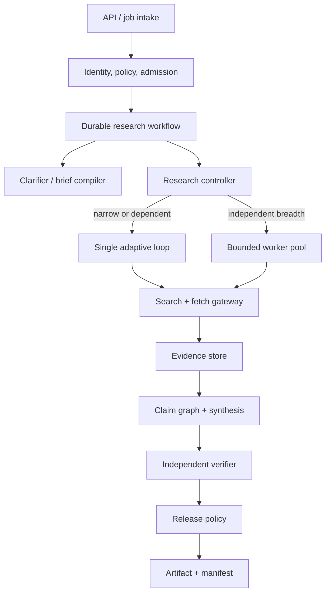
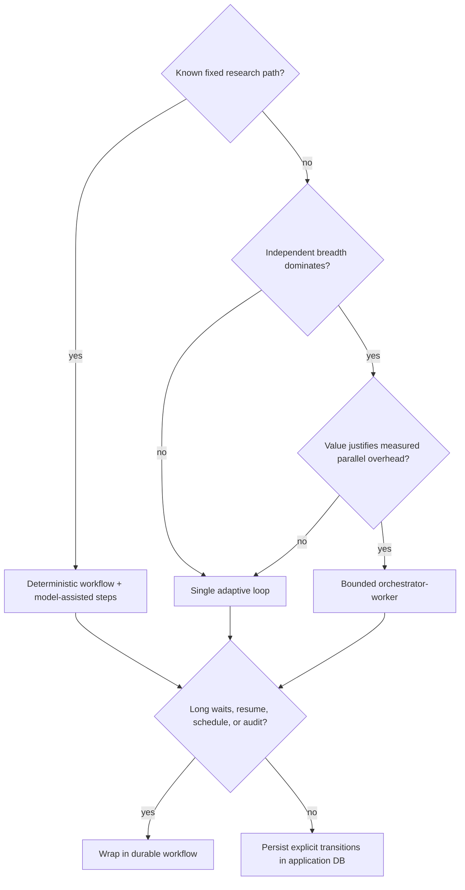

# Architecture and Stack Selection

> **Decision:** Choose the minimum control topology and runtime that can meet the research contract, recovery needs, and evidence guarantees.

## Recommended production shape

Start with a durable workflow containing one adaptive researcher. Add bounded parallel workers for independent breadth. Keep verification and release gates outside the researcher's authority.

Logical boundaries do not require microservices. A first production version can be one deployable with a durable database, a job runner, and isolated fetch/analysis workers. Split processes when isolation, capacity, ownership, or independent scaling demands it.

## Compare the three control topologies

| Dimension | Single adaptive agent | Orchestrator-worker | Workflow-based hybrid |
|---|---|---|---|
| Best fit | Narrow/dependent research, modest horizon | Breadth-first enumeration or independent subdomains | Regulated, resumable, scheduled, multi-hour, or multi-stage work |
| Control flow | Model chooses next action | Lead model delegates; workers adapt locally | Code owns stages; models choose within bounded stages |
| Context | One evolving context | Clean worker contexts plus coordinator context | Stage-specific bounded contexts backed by durable state |
| Parallelism | Tool-level only | Branch and tool parallelism | Explicit activities; workers optional inside stages |
| Coordination cost | Low | High | Medium and visible |
| Failure isolation | Weak unless steps persist | Branch failures can be isolated | Strong when activity/retry boundaries are designed correctly |
| Reproducibility | Harder | Harder across worker races | Best because stage inputs/outputs are explicit |
| Cost | Lowest baseline | Highest; duplicated search and synthesis are common | Controllable by stage and workload class |
| Main failure | Context rot and serial latency | Duplication, gaps, fan-out, blocked lead, lossy handoff | Rigid stages, replay mistakes, framework/engine complexity |

### Single adaptive loop

Use one loop when evidence dependencies are sequential: a discovered entity determines the next query, one source unlocks the next, or all branches need the same dense context. It is the easiest topology to debug and usually the cheapest.

Do not confuse “single agent” with “one giant prompt.” The loop should still persist plan, queries, observations, evidence, claims, and budgets after each accepted transition.

### Orchestrator-worker

Use bounded workers when subquestions are independent and the answer benefits from breadth: scanning countries, companies, standards, papers, or competing hypotheses. Anthropic's production report describes large gains on its internal breadth-first research eval, but also reports substantial token overhead and coordination failures. Treat those numbers as vendor/workload-specific evidence, not a universal forecast.

A worker contract needs:

- one question and explicit exclusions;
- evidence needed and preferred source classes;
- query/tool/fetch/token/time budgets;
- a required structured result, not free-form chat;
- ownership of no more than one evidence partition;
- cancellation and deadline semantics;
- permission to return `insufficient_evidence`;
- stable artifact references rather than large pasted summaries.

Limit fan-out using a deterministic budget allocator. A lead model can propose workers; code admits at most the allowed number, rejects overlap, and tracks marginal contribution.

#### Parallel-worker admission rule

Score proposals before dispatch; do not use a model's confidence as the admission decision.

| Include when all are true | Reject when any is true |
|---|---|
| Exclusive question/evidence partition with stable IDs | Same queries, entities, or mandatory sources as an active branch |
| No unresolved dependency on another branch's findings | One shared definition/version must be settled first |
| Distinct source space or material latency that can run concurrently | Fan-out only changes prose ownership |
| Structured partial/insufficient result contract | Worker can return only a narrative summary |
| Reserved branch budget, deadline, capability, and cancellation path | Worker would reset budgets or expand privileges |
| Merge owner and contradiction path are defined | Conflicting results would be last-writer-wins |
| Expected verified-evidence or latency gain exceeds merge/duplication cost | Historical routing eval shows no meaningful marginal gain |

Start with at most two or three admitted branches and expand only after the first returns show distinct accepted evidence. Record `proposed`, `admitted`, or `rejected` plus reason, overlap score, reservation, and expected value. Cancel branches whose remaining work no longer maps to an open material gap.

### Workflow-based hybrid

Use a durable workflow when work must survive process loss, wait for approval, run on a schedule, refresh prior work, or preserve auditable stage boundaries. The workflow should orchestrate activities such as fetch, parse, model call, verify, and publish. Nondeterministic I/O belongs outside replayed workflow logic.

Durability does not make arbitrary effects exactly once. Search/fetch calls can be safely deduplicated by operation key; publication and notifications need idempotency keys and receipts. Provider background jobs need reconciliation by provider operation ID before retry.

## Selection decision tree

## Custom, framework, managed agent, or hybrid

| Option | Choose it when | What it owns well | What remains application-owned |
|---|---|---|---|
| Thin custom loop | Few tools, simple topology, strong internal platform | Exact event/state contracts, minimal dependencies | All orchestration, tool execution, tracing, recovery, upgrades |
| Agent framework | Its loop, tool adapters, tracing, or handoffs remove real work | Common model/tool plumbing and developer ergonomics | Evidence semantics, policy, security, durable business state, release gates |
| Durable workflow engine | Multi-hour runs, waits, retries, schedules, recovery | Timers, queues, replay, stateful orchestration | External-effect idempotency, evidence integrity, model behavior, verification |
| Managed deep-research API | Speed to market and provider behavior meet the contract | Provider-specific planning/search/synthesis | Brief validation, data policy, output verification, retention, manifests, portability |
| Hybrid | Most production systems | Each component handles its documented strength | Application remains accountable for end-to-end guarantees |

Do not adopt a graph framework merely because the system has phases; ordinary functions or workflow steps may be clearer. Do not build a custom durable engine. Do not treat managed-agent citations as already verified.

Every provider route must pass the same application boundary. The [connector qualification guide](connectors-and-provider-qualification.md) defines the capability manifest and current representative adapters. A managed research API may own an internal trajectory, but the application still owns the approved brief, tool-call budget, response/job reconciliation, evidence capture permitted by provider terms, independent claim/citation verification, and release status.

## Provider and model roles

Separate model roles so each can be evaluated and changed independently:

| Role | Desired properties | Default cost posture |
|---|---|---|
| Clarifier | Instruction following, structured output, low latency | Small capable model |
| Planner/controller | Strong decomposition, adaptive tool use, calibrated stopping | Strong model; bounded turns |
| Worker researcher | Search persistence, source discrimination, concise evidence output | Cheaper capable model when evals pass |
| Parser/extractor | Long-document grounding, schema adherence | Small/medium model; deterministic parser first |
| Synthesizer | Long-form organization and cross-source reasoning | Strong model with evidence-only context |
| Verifier | Claim-evidence entailment and contradiction sensitivity | Different prompt/model route when practical; human calibration |
| Safety classifier | High recall for domain policy | Dedicated policy model or deterministic rules where possible |

Model routing must pass task-specific evaluation. A high context limit does not prove effective use of the full context. A model that searches well may synthesize weakly; one that writes well may stop searching too early.

Prefer snapshot/version identifiers over floating aliases when the provider supports them. Version the effective system as:

`brief schema + prompts + model routes + tool contracts + controller + policies + parsers + verifier + renderer`.

## Language and runtime choice

Language choice should follow operational ownership and integration needs.

| Runtime | Prefer when | Watch closely |
|---|---|---|
| Python | Research/NLP/parsing ecosystem, data analysis, evaluation notebooks becoming services | Blocking libraries in async paths, process isolation for CPU/OCR, packaging and memory |
| TypeScript on Node.js | Web product, streaming UI, connector-heavy service, shared frontend/backend types | Runtime validation, cancellation propagation, event-loop blocking, dependency churn |
| Go | High-concurrency gateways, fetchers, policy proxies, compact static deployment | Smaller agent-framework ecosystem, explicit schema/eval integration work |
| JVM or .NET | Enterprise integration, mature service platform, existing operations | SDK feature lag and careful mapping of provider streaming/cancellation semantics |
| Rust | Hardened fetch/parsing/sandbox gateways or constrained footprint | Higher implementation cost and smaller model SDK ecosystem |

A common practical split is TypeScript or Python for the research control plane and Go/Rust for hardened fetch/sandbox services—but only split languages when the isolation or operational benefit is real.

Baseline examples in this blueprint are language-neutral Python-like pseudocode. As of 2026-08-31, Python 3.14 is the current stable feature series and Node.js 24 is LTS. Pin a supported patch release, dependencies, container base, parsers, browser engine, and model SDK in the run manifest.

## Data plane and control plane ownership

| Component | Owns | Must not own |
|---|---|---|
| Admission | Identity, purpose, class, budget, policy version | Research conclusions |
| Workflow/controller | Run state, transitions, leases, deadlines, cancellation | Raw credential material |
| Search gateway | Provider adapters, quotas, normalized result metadata | Final source-quality judgment |
| Fetch/parse cell | Safe network access, capture, parsing, malware limits | Private corpus credentials outside its task scope |
| Evidence store | Immutable representations, spans, lineage, hashes | Unversioned mutable “truth” |
| Claim service | Claims, support/refute edges, dispositions | Citation rendering only |
| Verifier | Release checks and findings | Silent mutation of evidence or claims |
| Artifact renderer | Deterministic formatting and links | Inventing content to fill gaps |
| Audit/telemetry | Causal operational evidence | Unredacted prompts/secrets by default |

## Scaling model

Scale by constrained resource, not agent count:

- search-provider requests and query quotas;
- concurrent browser/fetch sessions per domain;
- parser/OCR CPU and memory;
- model input/output tokens and concurrent long calls;
- evidence-store write throughput and object storage;
- verification claims per second;
- human review arrival and service rate.

Use separate workload classes for interactive, standard background, high-depth, scheduled refresh, and high-impact review. Reserve capacity and budgets per tenant. A larger worker pool cannot overcome search or model quotas and often worsens duplicate work.

## Architecture acceptance questions

- Can the research controller be replaced without migrating the evidence schema?
- Can a provider or model change without changing claim and citation semantics?
- Is there one retry owner and one deadline lineage for every call path?
- Can a running job finish on its pinned version during a deployment?
- Can a worker fail without losing already accepted evidence?
- Does cancellation stop new scheduling and prevent artifact publication even if a child is slow to stop?
- Is every public/private data transfer mediated by deterministic policy?
- Can cost, coverage, and contradiction be explained per branch?
- Is the system still understandable when drawn without framework-specific vocabulary?

## Strong sources and related local guidance

- [Anthropic: How we built our multi-agent research system](https://www.anthropic.com/engineering/multi-agent-research-system)
- [Anthropic: Building effective agents](https://www.anthropic.com/engineering/building-effective-agents)
- [Google: Deep researcher with test-time diffusion](https://research.google/blog/deep-researcher-with-test-time-diffusion/)
- [Google Gemini Deep Research API](https://ai.google.dev/gemini-api/docs/deep-research)
- [OpenAI Deep Research API guide](https://developers.openai.com/api/docs/guides/deep-research)
- [Temporal Workflow Execution](https://docs.temporal.io/workflow-execution)
- [Custom loop vs framework vs workflow engine](../../comparisons/custom-loop-vs-framework-vs-workflow-engine.md)
- [Choosing an agent runtime language](../../languages/choosing-an-agent-runtime-language.md)
