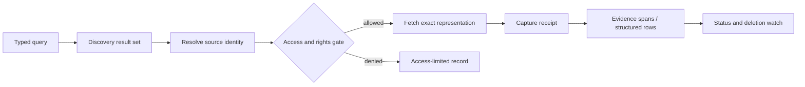

# Connectors and Provider Qualification

> **Decision:** Treat every source integration as a versioned evidence adapter with explicit coverage, rights, freshness, identity, pagination, and deletion semantics—not as a generic `search()` tool.  
> **Primary-source check:** 2026-08-31. Re-check every provider row before production onboarding or contract renewal.

## The connector boundary

A connector has two responsibilities:

1. expose a source system through a small, typed capability surface; and
2. translate provider-specific behavior into the application's source, representation, evidence, correction, and access model without inventing stronger guarantees.

Keep discovery separate from evidence capture:



A search hit, index row, or provider-generated answer is not automatically evidence. Evidence begins when the adapter can identify and capture the representation or structured record that the claim assessor actually read.

## Capability manifest

Every deployed adapter publishes an immutable manifest. The controller admits a proposed action only when the manifest and the run's policy agree.

```yaml
adapter:
  id: brave-web-search
  version: 2.1.0
  provider_contract_checked_at: 2026-08-31
  api_revision: web-search-v1
capabilities:
  operations: [discover]
  source_classes: [public_web]
  query:
    filters: [country, language, freshness, safe_search]
    operators: [phrase, exclude, site, filetype]
  pagination:
    mode: offset_page
    max_page_size: 20
    hard_depth: 10
    may_overlap: true
  freshness:
    provider_filter: true
    meaning: source_reported_publish_or_modified_date
    change_feed: false
  capture:
    result_metadata_retention: transient_only
    full_representation: false
    evidence_eligible: false
  rights:
    robots_applies_to_provider_crawl: provider_owned
    downstream_fetch_policy: required
    redistribution: prohibited
    model_training_or_evaluation: prohibited_by_provider_terms
  access:
    auth: api_key
    tenant_scope: credential
    regions: [provider_managed]
  corrections:
    update_feed: false
    deletion_feed: false
  limits:
    rate_headers: true
    retry_after: provider_specific
security:
  network_zone: public
  untrusted_fields: [title, url, description, extra_snippets]
  credentials_visible_to_model: false
qualification:
  fixture_suite: brave-web-search-v2
  last_passed_at: 2026-08-29
  expires_at: 2026-11-29
```

Do not use a Boolean such as `supports_freshness`. Record what the provider means by freshness, which clock it uses, and whether the value is an assertion, validator, change token, or captured observation.

## Exact request and result envelopes

Provider SDK objects must not leak into the controller. Normalize them into an application-owned envelope while retaining a governed raw response when terms permit.

```json
{
  "operation_id": "op_01K...",
  "adapter_id": "openalex",
  "adapter_version": "3.0.1",
  "action": "discover",
  "question_id": "q-7",
  "authorization_scope_id": "scope_public_scholarly",
  "request": {
    "query": "immersion cooling water consumption",
    "filters": {"from_publication_date": "2024-01-01"},
    "page": {"cursor": "*", "limit": 100},
    "requested_at": "2026-08-31T11:03:19Z"
  },
  "result": {
    "status": "succeeded",
    "provider_request_id": null,
    "result_set_id": "qrs_01K...",
    "items": [
      {
        "discovery_item_id": "hit_01K...",
        "provider_item_id": "https://openalex.org/W123",
        "source_locator": {"doi": "10.1234/example", "url": "https://doi.org/10.1234/example"},
        "title": "...",
        "published_at": "2025-06-02",
        "provider_updated_at": "2026-08-10T09:00:00Z",
        "snippet": null,
        "license_assertions": [{"scope": "metadata", "license": "CC0"}],
        "access": "metadata_only"
      }
    ],
    "page": {"next_cursor": "opaque", "complete": false, "reported_total": 417},
    "coverage": {"ranking": "provider_relevance", "known_cutoff": null},
    "charged": {"requests": 1, "credits": 10, "estimated_usd": 0.001},
    "received_at": "2026-08-31T11:03:20Z"
  },
  "raw_receipt": {
    "response_hash": "sha256:...",
    "retention_class": "provider_terms_allow_metadata",
    "rate_limit_snapshot": {"remaining": 99990, "reset_at": "2026-09-01T00:00:00Z"}
  }
}
```

For `fetch`, `query`, and `render` operations add:

- final identity after redirects or provider resolution;
- representation ID, media type, byte length, raw hash, validators, capture time, parser route, and storage class;
- exact query text/hash, parameters, schema, snapshot/version/job ID, row ordering, page tokens, and truncation status for databases;
- ACL/policy decision, credential principal class, region, and authorization recheck time;
- rights assertions per returned object or field, not only per API;
- typed partial-success and typed error records.

## Qualification gate

No adapter reaches production until its owner can answer and test all rows.

| Gate | Required evidence | Reject when |
|---|---|---|
| Identity | Stable provider ID and rules for aliases, versions, redirects, mirrors, and deletions | A URL or title is the only identity |
| Query semantics | Supported syntax, escaping, filters, ranking, locale, default scope, and total-count meaning | The adapter silently drops unsupported filters |
| Pagination | Cursor/offset contract, expiry, maximum depth, overlap, mutation behavior, and completion signal | `next` is guessed or a partial page is treated as complete |
| Freshness | Index delay, provider update clock, change feed/validator, and revalidation path | Fetch time is presented as publication/effective time |
| Coverage | Included/excluded source types, geography/language, hidden/private content, and known caps | The provider is called “the web” or “all documents” |
| Access | Delegated/application credentials, row/item ACL enforcement, tenant/region, and revocation latency | Broad admin access is used for convenience |
| Rights | API terms, record/file licenses, attribution, retention, redistribution, automated access, and robots policy | Rights cannot be expressed per captured object |
| Capture | Raw/derived retention, hash/validator, locators, reproducibility, and prohibited fields | Only a generated snippet or summary can be retained |
| Corrections/deletions | Delta feed, tombstones, retractions, supersession, hard deletion, and downstream invalidation | Removed items remain silently reusable |
| Limits | Quota units, headers, burst/sustained limits, concurrency, backoff, and bulk route | Parallel workers can multiply traffic without one governor |
| Security | Credential handling, untrusted fields, redirects, downloads, macros/scripts, and egress zone | Source content can grant authority or reveal credentials |
| Operations | Status page, versioning/deprecation, sandbox, fixtures, ownership, and disable switch | The adapter cannot be fenced independently |

Qualification expires on a fixed interval and immediately when terms, authentication, pagination, schema, retention, or deletion behavior changes.

## Representative provider matrix

The entries below are qualification examples, not endorsements. Contracts and account-specific limits override public documentation.

| Source route | Representative implementation | Query and coverage semantics | Pagination and freshness | Rights, access, and evidence capture | Production disposition |
|---|---|---|---|---|---|
| Search | Brave Web Search API | Independent web index; country/language/freshness filters and search operators; ranking and coverage remain provider-controlled | Up to 20 web results per page, offsets 0–9, possible overlap; follow `more_results_available`; freshness is inferred from source-reported dates | API key and rate headers. Terms updated 2026-02-11 restrict storage/caching, redistribution, and AI training/evaluation use of search results. Retain only what the contract allows; fetch the source separately under its own policy | Good discovery route; never represent snippets as retained evidence |
| Direct web | Hardened HTTP fetch gateway | Exact allowed URL with method/header policy; sitemap and link traversal are separate declared operations | Conditional requests with `ETag`/`Last-Modified`; pagination follows documented site/API links, never guessed | Respect RFC 9309 for the declared user agent plus terms, authentication, license, and rate policy. Record every redirect and resolved address. Capture raw bytes only when lawful | Default evidence path for static public pages and files |
| Browser | Pinned Playwright/Chromium in an isolated cell | Use only when static fetch cannot obtain essential rendered content; record navigation and network allowlist | No universal pagination or freshness; page actions and scroll/cursor behavior are site-specific and must be bounded | Fresh non-persistent browser context per operation; authenticated state is a secret. Disable extensions, cross-zone cookies, uploads, notifications, clipboard, and arbitrary downloads. Browser access does not bypass robots, terms, paywalls, or license | Expensive fidelity fallback, not the default crawler |
| Database | PostgreSQL read replica or governed BigQuery job | Approved views/columns; parameterized `SELECT`; explicit snapshot and row order; no model-authored arbitrary SQL at commit boundary | Database cursor/page token is not evidence identity. PostgreSQL repeatable-read/serializable read-only snapshots support coherent reports; BigQuery returns job ID, location, page token, completion, bytes, and cache status | Least-privilege role, statement/transaction/byte/row limits, regional routing, column/row policy, query audit. Capture query hash/text under policy, schema, snapshot/job ID, ordered rows, and truncation | Strong structured evidence when snapshot and access semantics are pinned |
| Document | HTTP/object-store fetch plus pinned HTML/PDF/Office/OCR parsers | File or object version, not extracted text, is the source representation | Re-fetch by object version/validator; parser upgrades create new derived representations | Enforce content, size, decompression, page, pixel, macro, script, CPU, and memory limits. Capture raw hash, parser/version, page/structure locators, OCR confidence, and per-file rights | Default for documents after sandbox qualification |
| Paper metadata | Crossref REST API | DOI-centric bibliographic and relation metadata; not a guarantee of full text, quality, or complete correction data | Cursor paging for deep result sets; current API reports five-minute cursor expiry; offset is limited to 10,000 | Metadata fields may include license links, but article/abstract/full-text rights remain publisher-specific. Store member/deposit timestamps and relation/status checks | Identity and correction signal; acquire the paper from a lawful source |
| Paper graph | OpenAlex API/snapshot | Works/authors/sources graph; search, filter, and semantic coverage are OpenAlex's indexed corpus | Supported `per_page` maximum 100; basic paging limited to 10,000, then cursor; use the snapshot for bulk. Provider update time is not publication time | OpenAlex states its data is CC0, while linked full text can carry separate rights. Current API is budgeted and capped at 100 requests/s; untrusted text is passed through | Good discovery/entity-resolution route; pin work ID plus DOI and representation provider |
| Biomedical paper index | NCBI PubMed E-utilities | Entrez query semantics and PubMed coverage; abstracts are not full papers | Use Entrez History/batches for large sets. NCBI documents 3 requests/s without a key and 10/s with a key by default | Send registered tool/email as required by guidance; display NCBI disclaimer/copyright notice. Abstracts may be copyrighted | Preferred biomedical discovery/metadata route when scope fits |
| Paper graph alternative | Semantic Scholar Academic Graph API/datasets | Papers, citations, authors, venues, and provider-derived metadata | API-key introductory limit is documented as 1 request/s; use dataset releases/diffs for bulk | API attribution is required; API and dataset licenses plus third-party content licenses apply. Do not assume PDF links grant reuse rights | Qualify only after legal use case and attribution path are approved |
| Dataset repository | Zenodo records/OAI-PMH/dumps | Search published records and files; `all_versions` controls record-version visibility | Anonymous page size up to 25 and authenticated up to 100 in current REST docs; use OAI-PMH or metadata dumps for bulk; consume the deleted-record dump | Record/file licenses and access differ. Pin concept DOI plus version DOI, file key, checksum, and selected version | Good versioned dataset route when file-level license/access is captured |
| Dataset repository | Dataverse 6.11 API | Search datasets/files, persistent IDs, explicit dataset versions, public/restricted/embargoed states | File lists support limit/offset and total count; `:latest` can resolve differently with privileged draft access; pin `x.y` | Dataset license, terms of access, guestbook, restriction, deaccession, and file checksums must be retained. Never replace a version ID with `:latest` in evidence | Strong evidence route with explicit version and file checksum |
| Web archive | Common Crawl index plus WARC/WAT/WET | Periodic crawl, not complete or current web coverage; index hit points to archived payload | Pin crawl ID such as `CC-MAIN-2026-34`, WARC filename, byte offset/length, capture timestamp, digest; use columnar index for bulk rather than overloading index API | Common Crawl data is free to access, but crawled content remains subject to source-owner terms/rights. CCBot follows robots at crawl time; downstream use still needs rights review | Useful historical representation; never infer absence from no hit |
| Web archive | Internet Archive Wayback/CDX | Historical snapshots with uneven coverage and possible later unavailability | Pin original URL, archive timestamp, digest/status/mime, and replay URL; page the CDX response exactly; treat playback failure/deletion as a status change | Archive availability does not grant republication rights. Do not use archives to bypass access controls or a valid deletion/restriction | Secondary historical route with an explicit coverage limitation |
| Enterprise files | Google Drive API v3 | `files.list` query over the authorized corpus; Drive item ID is stable within its system; native Docs require export format choice | Follow `nextPageToken`; use Changes API start/page tokens and removal entries; as of 2026-07-07 current docs state change page tokens do not expire | Prefer narrow read-only/delegated scopes; some scopes require security assessment. Recheck item ACL at fetch and release. Capture file ID, revision/version metadata, modified time, export format, raw hash, and ACL hash | Qualified private-source route when deletion and permission changes propagate |
| Enterprise files/search | Microsoft Graph Search plus Drive delta | Search is over Microsoft-indexed OneDrive/SharePoint content; KQL and managed properties affect results; hidden/private content behavior is configurable | Search exposes ranked hit containers; Drive delta returns `@odata.nextLink` then `@odata.deltaLink`, may repeat an item, and reports latest state rather than every intermediate change | Delegated permissions preserve user scope; application search can require region and broader admin permission. Track by item ID, not path. Recheck access and record permission changes/deletions | Good enterprise discovery plus delta route; index lag and regional/app-permission limits must be disclosed |
| Enterprise wiki | Confluence Cloud REST v2 | Page/space retrieval under the caller's authorization; CQL/search coverage and indexing are provider-controlled | REST v2 uses cursor pagination through `Link`/`_links.next`; do not construct cursors | Delegated OAuth scopes and page/space restrictions; capture content ID, version, space, status, representation/body format, and authorization receipt | Qualify per tenant; add a reconciliation crawl if no complete change feed is available |
| Managed deep research | OpenAI Responses API deep-research models | Managed planning/search/synthesis over web search, file search, and search/fetch MCP interfaces; output includes tool-call items and inline citations | Background jobs are reconciled by response ID; current official docs recommend `max_tool_calls` for cost/latency bounds | Official docs checked 2026-08-31 say background mode retains response data for roughly 10 minutes and is incompatible with ZDR; `store=true` data is logged for 30 days unless ZDR. Use trusted MCPs and staged public/private calls. Provider citations still need application verification/capture | Provider accelerator behind the same brief, evidence, security, and release contracts—not the system of record |

## Database result identity

Rows need stable evidence locators. The minimum structured-result identity is:

```text
db_result_id = hash(
  connector_id,
  authorization_scope_id,
  normalized_query_hash,
  bound_parameter_hash,
  schema_hash,
  snapshot_or_job_id,
  result_ordering,
  page_sequence,
  row_content_hashes
)
```

Reject a result set when the query has no deterministic ordering but the artifact depends on row position, when a page is missing, or when the result was truncated without an explicit limit record. A `LIMIT` is a query fact, not a harmless transport optimization.

## Provider correction and deletion mapping

Normalize every provider signal into one of these events:

| Provider signal | Domain event | Required action |
|---|---|---|
| HTTP representation hash/validator changed | `representation.changed` | Capture a new representation; diff dependent spans |
| Crossref relation/Crossmark status or retraction data changed | `source.integrity_changed` | Quarantine or regrade dependent evidence |
| Google Drive removal/change or Microsoft Graph deleted facet | `source.access_or_presence_changed` | Recheck authorization; tombstone reuse; propagate deletion policy |
| ACL/permission change | `source.authorization_changed` | Remove from future contexts immediately; re-evaluate released distribution |
| Zenodo deleted-record dump or Dataverse deaccession | `source.withdrawn` | Preserve only governed audit metadata; invalidate affected claims as policy requires |
| Provider loses item while lawful snapshot remains | `source.live_unavailable` | Keep reproducibility snapshot if allowed; disclose live unavailability |
| Contract or license changes | `source.rights_changed` | Stop new use; re-evaluate retention, redistribution, and artifact exposure |

Never convert a provider deletion into a hard delete before evaluating legal hold, audit, reproducibility, and the provider/source owner's deletion obligations. The correct result may be a tombstone plus cryptographic erasure of content and a retained minimal audit receipt.

## Qualification exercise

Choose one planned connector and produce these artifacts before implementation:

1. a completed capability manifest;
2. three exact request/result fixtures: success, partial page, and deletion/permission loss;
3. a rights decision for discovery metadata, raw content, excerpts, and released citations;
4. a coverage statement with one known blind spot;
5. a load envelope with burst, sustained, and bulk paths;
6. a correction propagation test reaching a released artifact;
7. a kill switch and owner.

**Decision gate:** if any item cannot be stated and tested, the connector remains experimental and cannot support a mandatory evidence need.

## Primary sources

- Brave, [Web Search API](https://api-dashboard.search.brave.com/app/documentation/web-search/get-started), [rate limiting](https://api-dashboard.search.brave.com/documentation/guides/rate-limiting), and [Search API Terms of Use](https://api-dashboard.search.brave.com/documentation/resources/terms-of-service) — checked 2026-08-31; terms last updated 2026-02-11.
- OpenAI, [Deep research API guide](https://developers.openai.com/api/docs/guides/deep-research) — checked 2026-08-31.
- Playwright, [BrowserContext](https://playwright.dev/docs/api/class-browsercontext) and [authentication state](https://playwright.dev/docs/auth) — checked 2026-08-31.
- PostgreSQL, [`SET TRANSACTION`](https://www.postgresql.org/docs/current/sql-set-transaction.html) and [client connection defaults](https://www.postgresql.org/docs/current/runtime-config-client.html) — PostgreSQL 18.6 docs checked 2026-08-31.
- Google Cloud, [BigQuery query execution](https://cloud.google.com/bigquery/docs/running-queries) and [`jobs.getQueryResults`](https://cloud.google.com/bigquery/docs/reference/rest/v2/jobs/getQueryResults) — pages updated 2026-08-27 and 2026-05-30 respectively; checked 2026-08-31.
- Crossref, [REST API](https://api.crossref.org/) and [post-publication updates](https://www.crossref.org/documentation/retrieve-metadata/retractions-and-post-publication-updates/) — checked 2026-08-31.
- OpenAlex, [API authentication and limits](https://help.openalex.org/api/authentication/), [paging](https://help.openalex.org/api/paging/), and [pricing/data license](https://help.openalex.org/access/pricing/) — pages updated 2026-08-11 through 2026-08-19; checked 2026-08-31.
- NCBI, [E-utilities guidance](https://www.ncbi.nlm.nih.gov/books/NBK25497/) — checked 2026-08-31.
- Semantic Scholar, [Academic Graph API](https://www.semanticscholar.org/product/api) and [API license](https://www.semanticscholar.org/product/api/license) — checked 2026-08-31; license last updated 2023-05-17.
- Zenodo, [REST API and bulk metadata/deletion dumps](https://developers.zenodo.org/) — checked 2026-08-31.
- Dataverse, [6.11 API Guide](https://guides.dataverse.org/en/latest/api/) and [Data Access API](https://guides.dataverse.org/en/latest/api/dataaccess.html) — guide updated 2026-07-01; checked 2026-08-31.
- Common Crawl, [Get Started](https://commoncrawl.org/get-started), [index server](https://index.commoncrawl.org/), and [Terms of Use](https://commoncrawl.org/terms-of-use) — checked 2026-08-31.
- Internet Archive, [Wayback CDX server reference](https://github.com/internetarchive/wayback/tree/master/wayback-cdx-server) — checked 2026-08-31; public operational/rights guarantees remain less explicit than the strongest APIs in this matrix.
- Microsoft, [Search OneDrive and SharePoint](https://learn.microsoft.com/en-us/graph/search-concept-files), [Drive delta](https://learn.microsoft.com/en-us/graph/api/driveitem-delta?view=graph-rest-1.0), and [application-permission region behavior](https://learn.microsoft.com/en-us/graph/search-concept-searchall) — checked 2026-08-31.
- Google, [Drive Changes API](https://developers.google.com/workspace/drive/api/reference/rest/v3/changes/list) and [sharing/permissions](https://developers.google.com/workspace/drive/api/guides/manage-sharing) — checked 2026-08-31; Changes reference updated 2026-07-07.
- Atlassian, [Confluence Cloud REST v2 introduction and pagination](https://developer.atlassian.com/cloud/confluence/rest/v2/intro/) — checked 2026-08-31.
- IETF, [RFC 9309: Robots Exclusion Protocol](https://www.rfc-editor.org/rfc/rfc9309.html) and [RFC 9111: HTTP Caching](https://www.rfc-editor.org/rfc/rfc9111.html).
