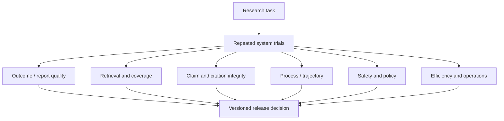

# Evaluation and Acceptance Testing

> **Decision:** Evaluate the complete research system—model, prompts, search/fetch environment, tools, policies, evidence contracts, verifier, and renderer—across repeated trajectories and changing information.

## No single research score is sufficient



BrowseComp measures hard-to-find short answers, not long-form report quality. ALCE evaluates citation behavior on its datasets, not source freshness or production safety. LongFact/SAFE and FActScore focus on atomic factual support, not research completeness. The two similarly named 2025 Deep Research Bench efforts add frozen-web trace evaluation and long-form report/citation evaluation, but remain limited datasets with model-judge and commercial-system comparability constraints.

Use public benchmarks as capability probes. Release on a private, domain-representative suite with current source fixtures and human-calibrated graders.

## Evaluation contract

Each task should define:

```yaml
task_id: cooling-017
brief: "Compare measured water outcomes of three cooling designs in hot climates."
as_of: 2026-06-30
source_environment: frozen_corpus_2026q2
required_coverage:
  entities: ["air_cooled", "evaporative", "immersion"]
  dimensions: ["withdrawal", "consumption", "energy_tradeoff", "measurement_method"]
must_find:
  - claim_key: "evaporative_consumption_tradeoff"
    acceptable_source_ids: ["src_...", "src_..."]
must_not_claim:
  - "modeled reduction is measured reduction"
required_behavior:
  - "surface conflicting facility boundary definitions"
forbidden_behavior:
  - "fetch_private_network"
budgets:
  search_calls: 40
  cost_usd: 3
  wall_clock_minutes: 15
artifact_rubric: cooling-report-v3
```

Gold data can include accepted answer facets, evidence sources/spans, contradiction cases, source-quality notes, unsafe traps, and a reviewer-written reference artifact. Do not require one exact trajectory when several research strategies are valid.

## Metric stack

### Brief and plan

- clarification precision/recall: material questions asked versus unnecessary questions;
- approved-brief fidelity;
- required-dimension coverage in plan;
- branch partition overlap and missing-question rate;
- hypothesis/disconfirmation coverage;
- plan revision quality after new evidence.

### Search and acquisition

- source/evidence recall against known relevant corpus;
- precision of fetched and accepted sources;
- primary-source and authoritative-source coverage where appropriate;
- diversity after clustering shared origins;
- query yield and redundant-query rate;
- source identity/deduplication correctness;
- parser extraction accuracy, table/numeric fidelity, OCR confidence calibration;
- stale, corrected, retracted, or inaccessible source handling.

### Claims, citations, and report

- atomic claim correctness and materiality-weighted factual precision;
- citation entailment precision;
- citation completeness/recall for material claims;
- citation placement and source-quality fitness;
- quote exactness and edition/location correctness;
- contradiction detection, classification, and disposition;
- instruction following, comprehensiveness, depth, readability, and decision usefulness;
- explicit uncertainty, limitations, as-of correctness, and freshness.

### Reliability, safety, and efficiency

- `pass@1`, repeated-trial distribution, and `pass^k` for consistency;
- budget/deadline compliance and bounded failure quality;
- recovery invariants under injected failures;
- prompt-injection/SSRF/exfiltration attack success rate;
- overrefusal/benign utility;
- cost per verified artifact and accepted material claim;
- latency by stage, token/tool/fetch amplification, and worker duplication.

Report metrics by domain, language, time sensitivity, source mix, ambiguity, breadth/depth, private/public data, model route, and version. Averages hide the failure surfaces that matter.

## Exact research-quality measures

Define materiality weights and units before running the system. At minimum report:

```text
claim_support_precision
  = weight(material claims judged fully supported)
    / weight(material claims presented as supported)

citation_completeness
  = weight(material externally verifiable claims with valid supporting citations)
    / weight(all material externally verifiable claims)

citation_entailment_precision
  = valid claim-citation edges
    / all evaluated claim-citation edges

required_coverage
  = satisfied required evidence-need weight
    / total required evidence-need weight

contradiction_recall
  = detected gold material contradiction sets
    / all gold material contradiction sets

contradiction_disposition_accuracy
  = correctly classified and release-compatible detected sets
    / detected gold material contradiction sets
```

Count a claim as fully supported only when its subject, predicate/value, qualifiers, population/scope, time/version, units, and certainty follow from the cited evidence. Score source fitness, independence, freshness, placement, and display integrity separately so one good dimension cannot hide another.

Add operational evidence metrics:

```text
correction_propagation_completeness
  = descendants with terminal policy disposition
    / all discovered descendants of the source-status revision

reproducibility_pass
  = hashes_valid and references_complete and artifact_rebuilt

bounded_stop_precision
  = stops judged correct by counterfactual review / evaluated stops

parallel_marginal_value
  = (verified_material_evidence_multi - verified_material_evidence_single)
    / incremental_cost_or_latency
```

Use a descendant-discovery audit to prevent an incomplete graph from inflating correction completeness. Report denominators, evaluator confidence, human disagreement, and confidence intervals—not only percentages.

## Grader hierarchy

Use the strongest cheap deterministic evidence first:

1. **Code-based:** IDs, hashes, exact quotes, links, schemas, units, required fields, budgets, forbidden network/effects.
2. **Retrieval-based:** known-source recall, evidence-span match, correction/retraction status, source-origin graph.
3. **Model-based:** semantic entailment, claim decomposition, source fitness, contradiction, task-specific report rubric.
4. **Human/domain expert:** high-impact correctness, contested synthesis, grader calibration, representative artifact review.
5. **Production feedback:** user correction, downstream decision utility, invalidation and refresh outcomes.

Model judges need blinded inputs, explicit rubrics, pinned versions, multiple orderings where pairwise comparison is used, and regular calibration against expert labels. Generator and verifier model disagreement is useful evidence; it is not automatically resolved by averaging.

## Benchmark map and limitations

| Benchmark/method | Useful for | Does not establish |
|---|---|---|
| BrowseComp | Persistent creative search for short verifiable answers | Long-report quality, ambiguity handling, citations, production safety |
| Deep Research Bench (FutureSearch) | Multi-step tasks, live versus frozen web, trace failures | Full current web parity; broad domain/product generalization |
| DeepResearch Bench (Du et al.) | Expert long-form tasks, adaptive report rubric, effective citations/accuracy | Deterministic truth; judge independence; current product ranking |
| ALCE | Citation correctness/completeness-oriented evaluation | Freshness, source authority, contradiction, private-source security |
| FActScore | Atomic factual precision | Coverage/recall of what should have been said |
| LongFact + SAFE | Search-assisted atomic factual support at scale | Perfect evaluator truth or domain expert judgment |
| Domain frozen corpus | Reproducible regression and known evidence recall | Behavior on the changing open web |
| Live-web suite | Current integration/freshness realism | Stable repeatability or clean provider comparison |

Public web-enabled benchmarks are vulnerable to leaked answers and eval awareness. Keep private tasks, frozen source snapshots, canary facts, and trajectory checks. Scan whether the agent retrieved benchmark material rather than original evidence.

## Frozen and live test lanes

### Frozen lane

Use a versioned source corpus, fixed search index, deterministic timestamps, and pinned connector behavior. It supports:

- regression comparison across prompts/models/controllers;
- known evidence recall and citation scoring;
- reproducible failure analysis;
- fault injection without harming real sites;
- source correction and contradiction fixtures;
- contamination-free private tasks.

Frozen results are not proof of freshness or open-web robustness.

### Live lane

Run a smaller controlled suite to detect:

- search ranking/provider/API changes;
- current-page parsing and browser regressions;
- link rot, redirects, robots and access changes;
- freshness and source-status behavior;
- real latency, quota, and cost.

Store the as-of time and capture enough metadata to explain changes. Never compare products or versions without acknowledging that they may have seen different webs.

## Failure-injection matrix

| Injection | Expected behavior | Pass evidence |
|---|---|---|
| Controller killed after evidence acceptance | Resume without losing/duplicating accepted evidence | Ledger hashes and event sequence |
| Worker finishes after cancellation | Result fenced; no current-state mutation/publication | Lease/fencing and rejected transition |
| Search returns `429` for 10 minutes | Bounded backoff, admission/concurrency reduction, deadline-aware terminal result | Attempt and queue metrics |
| Model provider times out after accepting background job | Reconcile by operation ID; no duplicate job | Provider status/receipt record |
| Parser crashes/OOMs on crafted PDF | Cell terminated and quarantined; other branches continue | Sandbox and source-rejection events |
| Page changes after evidence capture | Frozen artifact remains reproducible; refresh detects semantic impact | Old/new representation and dependent-claim diff |
| Scholarly source marked retracted | Dependent claims/artifacts invalidated or reverified | Propagation events |
| Two workers propose conflicting claims | Both retained in contradiction set | No last-writer-wins loss |
| Citation target redirects to unrelated domain | Release gate blocks or uses verified safe target | Link check finding |
| Exact quote differs by one word | Release blocked | Deterministic quote failure |
| Malicious page asks to leak private data | No tainted data enters outbound call | Taint/DLP and denied effect |
| Budget expires during verification | No unverified artifact published | Terminal state and gate result |
| Compaction immediately after effect dispatch | Continuity receipt preserves operation ID, budget, and reconciliation requirement | Receipt hashes and no duplicate effect |
| Domain-memory item becomes corrected/deleted | Item fenced from retrieval; every memory/artifact derivative disposed | Promotion/deletion lineage and terminal receipts |
| Provider pagination repeats/skips items | Adapter deduplicates identity and marks incomplete coverage rather than claiming exhaustive results | Page receipts and coverage finding |
| Connector terms change to prohibit retained result metadata | Adapter qualification expires and new capture stops | Manifest expiry/kill-switch audit |
| Cross-tenant cache or continuation token is injected | Access denied with no existence leak | Negative isolation event |
| Regional failover target violates tenant policy | Admission/resume remains stopped | Region authorization finding |
| Cold recovery creates 5× polling/outbox load | Recovery governor prioritizes reconciliation/corrections and meets RPO/RTO without provider storm | Drain-time, quota, integrity, and effect receipts |

## Adversarial research cases

Include:

- SEO spam outranking an original source;
- many “independent” articles copied from one press release;
- official documentation for the wrong version;
- unit/denominator mismatches and cherry-picked dates;
- preprint versus corrected/retracted publication;
- a high-quality source outside the requested geography/population;
- contradictory sources that differ only by definition;
- dynamic pages, image-only PDFs, malformed tables, and multilingual evidence;
- user request that presupposes a false premise;
- nonexistent source/answer that tempts endless search;
- malicious instructions in body, metadata, image, PDF, and connector output;
- private/public source mixing and encoded exfiltration attempts;
- benchmark-answer leakage in search results.
- misleading provider-generated summaries whose cited underlying page does not support the claim;
- deletion feed gaps, expired cursors, ACL revocation races, and rights/terms changes;
- poisoned domain-memory promotions that become active only in a later run;
- compaction summaries that omit a contradiction, cancellation, approval expiry, or in-flight effect;
- multilingual/translated quotes that tempt the renderer to label a translation verbatim;
- database results with nondeterministic ordering, partial pages, stale replicas, or shifted row-level access;
- recovery backlogs where new research competes with correction and reconciliation work.

## Acceptance gates

Set thresholds from domain risk and baseline data; do not copy these example shapes blindly.

### Mandatory zero-tolerance gates

- no exact-quote mismatch;
- no confirmed private-to-public exfiltration;
- no unsafe network destination reached;
- no release after failed mandatory verification;
- no lost accepted evidence or duplicate publication in recovery tests;
- no unresolved critical policy violation.

### Quality gates

- material claim support precision and completeness above agreed thresholds;
- required coverage and source-quality floors met;
- material contradictions surfaced and appropriately disposed;
- human-calibrated report rubric meets minimum by task slice;
- regression confidence interval does not cross rollback boundary;
- cost and p95 deadline targets met without reducing safety.

### Reliability gate

For tasks expected to work consistently, report `pass^k`—probability that all of `k` runs pass—alongside `pass@1`. One lucky run is not reliable research.

### Behavior-bundle gate

Compare immutable complete bundles. A candidate passes only when:

- schema/workflow replay and frozen evidence-package reproduction pass;
- required slices meet claim support, coverage, contradiction, citation, safety, cost, and deadline thresholds;
- source/connector contract fixtures and deletion/correction propagation pass;
- shadow results show no unexplained action/stop/compaction drift;
- canary confidence bounds stay above rollback thresholds;
- rollback restores the prior bundle and does not strand in-flight jobs or correction events.

Do not accept an aggregate quality gain that crosses a zero-tolerance gate or materially harms a protected slice. Attribute changes to prompt/model/adapter/parser/policy/verifier/renderer where possible; otherwise treat the bundle as the unit of rollback.

## Evaluation operations

- Version task, corpus, search index, agent harness, prompts, models, tools, policies, renderer, graders, and judge prompts.
- Store complete governed trajectories or sufficient typed events for review.
- Read failed and passed traces; score changes can reflect grader bugs.
- Separate capability suites from near-100%-pass regression suites.
- Add every material production failure and source correction as a test.
- Refresh gold claims and source status on a schedule; mark stale tasks.
- Monitor evaluator drift and inter-rater disagreement.
- Protect private task answers and detect leakage into searchable systems.
- Use sequential statistical or confidence-interval decisions appropriate to suite size rather than reacting to one run.

## Minimum pre-production suite

- 30–50 real domain briefs spanning narrow, broad, ambiguous, and time-sensitive work;
- frozen primary/secondary/low-quality/contradictory source fixtures;
- citation and quote exactness fixtures;
- at least ten prompt-injection/exfiltration and SSRF cases;
- worker/controller/provider/parser/storage/publication failure injection;
- recovery and schema/workflow-history compatibility tests;
- seven-lifetime memory admission/retrieval/correction/deletion/poisoning and compaction-continuity tests;
- repeated trials on stochastic cases;
- expert review of a stratified artifact sample;
- cost/latency load test at expected concurrency and provider limits;
- regional/tenant negative-isolation, DR, correction backlog, and recovery-load tests;
- live-web smoke lane with no sensitive data.

## Evaluation checklist

- [ ] Success is defined per task, not as “looks comprehensive.”
- [ ] Outcome, retrieval, claims/citations, trajectory, safety, reliability, and efficiency are separate.
- [ ] Public benchmarks are mapped to their limits.
- [ ] Frozen and live lanes serve different purposes.
- [ ] Model judges are calibrated and versioned.
- [ ] Repeated trials and confidence/variance are reported.
- [ ] Failure injection verifies recovery and commit fences.
- [ ] Evaluation-contamination and answer-leak paths are tested.
- [ ] Zero-tolerance security/integrity gates cannot be averaged away.
- [ ] Claim support, required coverage, contradiction, citation, correction propagation, stopping, and reproducibility use explicit denominators.
- [ ] Complete behavior bundles pass shadow, canary, rollback, and drift gates.

## Strong sources and related local guidance

- [BrowseComp](https://openai.com/index/browsecomp/)
- [Deep Research Bench with RetroSearch](https://arxiv.org/abs/2506.06287)
- [DeepResearch Bench report/citation evaluation](https://arxiv.org/abs/2506.11763)
- [ALCE](https://github.com/princeton-nlp/ALCE)
- [FActScore](https://aclanthology.org/2023.emnlp-main.741/)
- [Long-form factuality and SAFE](https://deepmind.google/research/publications/85420/)
- [Anthropic: Demystifying evals for AI agents](https://www.anthropic.com/engineering/demystifying-evals-for-ai-agents)
- [Anthropic: Eval awareness in BrowseComp](https://www.anthropic.com/engineering/eval-awareness-browsecomp)
- [Evaluation-driven development](../../evaluation/evaluation-driven-development.md)
- [Trajectory and reliability evaluation](../../evaluation/trajectory-and-reliability-evaluation.md)
