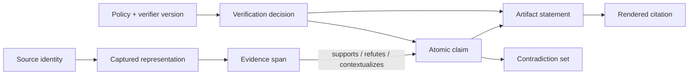
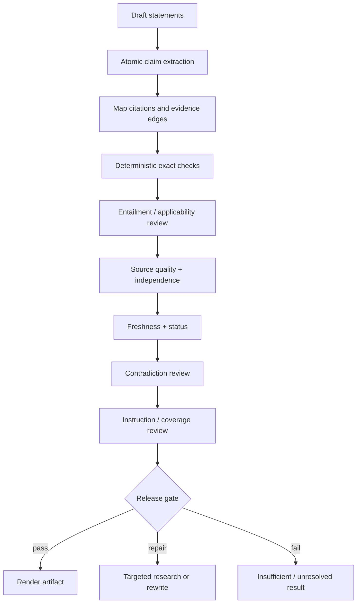
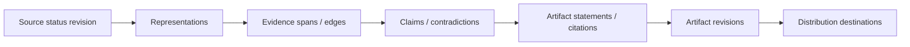

# Evidence, Citations, and Verification

> **Decision:** Make the released report a projection of a durable evidence/claim graph, not the only record of what the system believes.

## Evidence ledger as the source of traceability

The ledger is append-only for observations and versioned for decisions. It stores what was fetched, what passage was extracted, what claim was proposed, whether evidence supports or challenges it, and how a reviewer or verifier disposed of it.



Do not store only a citation URL next to generated prose. URLs change, pages update, and one paragraph may contain several claims with different support.

## Minimal data model

| Record | Required fields | Notes |
|---|---|---|
| `source` | stable ID, canonical identifiers, title, publisher/author, source type, relationships | Identity independent of one URL |
| `representation` | source ID, requested/final URL, captured time, published/updated/effective time, media type, raw hash, parser version, storage/retention class | Immutable captured object or compliant validator record |
| `evidence_span` | representation ID, exact text/hash, structural locator, offsets/page/timecode, extraction method/confidence | Never rewritten by summarization |
| `claim` | atomic normalized text, qualifiers, subject/predicate/object or typed fields, materiality, volatility, status | Can have many artifact renderings |
| `evidence_edge` | claim ID, span ID, relation, applicability, independence group, assessor, confidence/reason | Relation: supports, refutes, limits, defines, contextualizes |
| `contradiction_set` | competing claim/edge IDs, cause class, materiality, status, disposition | Preserve unresolved disagreement |
| `artifact_statement` | artifact/revision ID, claim IDs, text, section, citations | Analysis sentences may link to multiple claims |
| `verification` | target IDs, check type, result, rationale, verifier/human version, time | Immutable result; a new pass creates a new record |

### Typed identities and revision rules

Use opaque application IDs plus typed natural keys. IDs identify records; revisions identify changing assertions about them.

| Identity | Stable key or derivation | New record/revision rule |
|---|---|---|
| `SourceId` | Namespaced provider ID: DOI, filing ID, dataset concept/version DOI, repository+commit, enterprise drive+item, canonical archive capture, or application ULID | Alias/URL change updates relations; a genuinely different work/edition/item gets a new source |
| `RepresentationId` | `SourceId + capture activity + raw content hash + media/format` | Any byte, export-format, parser-input, access-zone, or lawful-retention difference creates a new representation |
| `ArtifactObjectId` | Content-addressed object hash plus tenant/access namespace | Same bytes can deduplicate physically only when authorization permits; logical references remain tenant-scoped |
| `EvidenceSpanId` | `RepresentationId + structural locator + exact normalized-text hash + normalization version` | Parser/locator/text change creates a new span; never move an old span silently |
| `ClaimId` | Opaque ID for one normalized proposition and qualifier set | Wording may have multiple statement renderings; qualifier/meaning change creates a claim revision or new claim |
| `EvidenceEdgeId` | Claim revision + evidence span + relation + applicability scope + assessor version | Changed support/refute judgment creates a new edge revision |
| `ContradictionId` | Opaque set identity with member claim/edge revisions | Membership/disposition is versioned; the set is never overwritten by a winning claim |
| `CitationId` | Artifact revision + statement ID + claim IDs + evidence span IDs + rendered target policy | Any target, placement, label, claim mapping, or artifact revision change creates a new citation |
| `ArtifactRevisionId` | Stable artifact ID plus monotonic immutable revision | Any content, evidence graph, verifier, rights, or release-status change creates a revision/event |

Natural identifiers are not universally unique. A DOI identifies a registered work/version relation, not the bytes the system read. An enterprise path can change while the item ID remains stable. A database page token identifies transport continuation, not a result set. Preserve these distinctions in types so they cannot be accidentally interchanged.

```typescript
type SourceId = string & { readonly __brand: "SourceId" };
type RepresentationId = string & { readonly __brand: "RepresentationId" };
type EvidenceSpanId = string & { readonly __brand: "EvidenceSpanId" };
type ClaimId = string & { readonly __brand: "ClaimId" };
type ContradictionId = string & { readonly __brand: "ContradictionId" };
type CitationId = string & { readonly __brand: "CitationId" };
```

### Example claim record

```json
{
  "claim_id": "clm_01J...",
  "text": "Facility A reported a 32% reduction in annual cooling-water withdrawal after retrofit.",
  "type": "quantitative_observation",
  "materiality": "high",
  "qualifiers": {
    "subject": "Facility A",
    "metric": "cooling-water withdrawal",
    "change": -0.32,
    "period": "annual",
    "basis": "reported",
    "boundary": "facility"
  },
  "volatility": "medium",
  "status": "accepted_with_limitations",
  "limitations": ["No weather-normalized counterfactual"]
}
```

Atomic does not mean context-free. Split compound factual statements, but retain qualifiers needed to avoid changing meaning.

## Claim classes and evidence bars

| Claim class | Evidence expectations | Common mistake |
|---|---|---|
| Definition/API behavior | Current authoritative specification or official documentation | Citing an old blog/tutorial |
| Current status/price/person | Fresh authoritative source with explicit as-of time | Treating search rank or model memory as current |
| Quantitative observation | Original dataset/study/filing plus method and unit alignment | Copying a secondary statistic without denominator |
| Causal claim | Design appropriate to causality; alternatives and limitations | Turning correlation or vendor case study into causation |
| Forecast | Assumptions, model/scenario, issuer, date, uncertainty | Presenting a projection as observed fact |
| Consensus | Representative and independent evidence; scope and dissent | Counting derivative reports as independent |
| Legal/regulatory | Current official text and effective date; expert review as required | Relying only on commentary |
| Security behavior | Current official docs/source plus adversarial or reproducible test | Treating a marketing guarantee as a control |
| Analysis/inference | Explicitly labeled reasoning from cited facts | Attaching a citation as if the source made the inference |

## Citation integrity has multiple dimensions

Evaluate these separately:

1. **Validity:** The citation target exists and is the intended identity/version.
2. **Entailment:** The cited span supports the nearby claim with its qualifiers.
3. **Completeness:** Material externally verifiable claims have citations.
4. **Placement:** A reader can determine which claim each citation supports.
5. **Quality:** The source is fit for this claim type.
6. **Independence:** Apparent corroboration does not share one origin.
7. **Freshness:** The representation is current enough for the claim's volatility.
8. **Display integrity:** The rendered link and label match the verified target.

ALCE and later deep-research benchmarks reinforce the need to separate citation correctness from completeness and report quality. A report can have many accurate citations but omit citations for its most important claims, or cite correct sources for weak conclusions.

## Verification pipeline



### Deterministic checks first

Use code for:

- citation/claim IDs exist and belong to the run;
- citation anchors fall within captured representation bounds;
- exact quotes match their spans under the declared normalization;
- URL labels and destinations correspond to verified source records;
- required metadata, as-of dates, units, and versions are present;
- no forbidden source or private storage URL is rendered;
- duplicate citations and orphaned evidence are detected;
- numeric values/units in a statement match structured extraction where available;
- artifact references resolve and the manifest hashes match.

Use a calibrated model or human for semantic entailment, scope/applicability, source fitness, contradiction materiality, and synthesis quality. Give the verifier only the claim, relevant spans, metadata, and rubric—not the generator's hidden reasoning.

## Quote integrity

Quotes require a stricter path than paraphrases:

1. Select the shortest passage that materially serves the research purpose.
2. Capture the exact source representation and edition/version.
3. Store exact start/end locator and text hash.
4. Apply only declared normalization, such as line-ending normalization; never silently repair words.
5. Verify the draft quote byte/code-point sequence against the stored span.
6. Render quote marks, omission markers, insertions, and translation status honestly.
7. Enforce source- and artifact-level quote budgets and applicable rights policy.
8. If OCR confidence is low, obtain a better representation or require human review.

```python
def verify_quote(quote, span, policy):
    actual = normalize(span.exact_text, policy.normalization)
    proposed = normalize(quote.text, policy.normalization)
    if proposed not in actual:
        return Failure("QUOTE_NOT_EXACT")
    if quote.representation_id != span.representation_id:
        return Failure("EDITION_MISMATCH")
    if len(proposed.split()) > policy.max_words_per_source:
        return Failure("QUOTE_BUDGET_EXCEEDED")
    return Pass()
```

Do not turn a translation into a verbatim quote. Label it “translated” and preserve original text and translation provenance.

## Contradiction handling

Contradiction is data, not an exception to smooth away.

### Classify apparent conflicts

| Class | Example | Resolution path |
|---|---|---|
| Temporal | Old and new API behavior differ | Choose version/as-of scope; retain history |
| Definitional | “Water use” means withdrawal in one source, consumption in another | Normalize terms; do not compare until aligned |
| Population/scope | Global average versus one region | Qualify claims; may not be a true conflict |
| Methodological | Modeled versus measured; survey versus telemetry | Report method difference and evidence fitness |
| Version/edition | Preprint versus corrected publication | Prefer applicable version; retain relationship |
| Genuine empirical | Comparable studies report opposing results | Surface disagreement and assess quality/uncertainty |
| Source integrity | Retraction, correction, compromised dataset | Quarantine or downgrade; re-evaluate dependent claims |
| Extraction | OCR/table/parser error | Reparse or manually verify |

Never use source count as a vote without independence and fitness. A newer source is not automatically better; an official source is not automatically independent or unbiased for all claim types.

### Contradiction disposition

Each material set ends in one state:

- `resolved_by_scope` — claims apply to different conditions;
- `resolved_by_version` — one supersedes another for the requested as-of state;
- `resolved_by_integrity` — one source is corrected/retracted or extraction was wrong;
- `accepted_uncertainty` — best evidence still disagrees;
- `insufficient_evidence` — cannot determine;
- `escalated` — domain expert judgment required.

The artifact should expose the disposition and rationale, not just the winning sentence.

## Freshness model

Store distinct times:

- `published_at` — first publication;
- `updated_at` — source-declared modification;
- `effective_at` — when a rule/version/state applies;
- `observed_period` — period the data describes;
- `fetched_at` — when this representation was acquired;
- `verified_at` — when claim support/status was checked;
- `valid_until` or refresh policy — application decision.

Fresh fetch does not make old underlying data current. A new article may describe a 2019 measurement; a cached API page may still be the current contract.

Use HTTP validators (`ETag`, `Last-Modified`) where available, content hashes, release/commit IDs, DOI relations, and source-specific change feeds. Revalidation may yield:

- unchanged representation;
- changed representation but unaffected spans;
- changed/retracted source affecting claims;
- unavailable source with retained lawful snapshot;
- live source changed but reproducibility snapshot preserved.

### Correction, deletion, and rights propagation

A source-status change is a graph operation, not a background metadata update.



Process it with an idempotent propagation job:

1. append the provider signal, source-status revision, cursor/watermark, and observed time;
2. immediately fence the source from new retrieval, memory promotion, context assembly, and publication when access, integrity, rights, or deletion requires it;
3. enumerate every descendant, including derived summaries, embeddings/index entries, caches, evaluation samples, exports, and destination copies;
4. assign each descendant a policy action: `no_impact`, `reverify`, `supersede`, `invalidate`, `redact`, `tombstone`, `cryptographic_erase`, `legal_hold`, or `human_review`;
5. execute/reconcile effects and record receipts;
6. close only when every descendant has a terminal disposition and feed watermarks show no gap.

Do not delete provenance first and then try to discover affected outputs. Where content must be erased, retain only the minimal permitted tombstone—opaque ID, event/policy, time, and erasure receipt—so deleted material cannot be reconstructed.

Material correction response time is measured to complete downstream disposition, not merely to ingest the notification. Re-test authorization at artifact release even when the evidence was valid at capture time.

Claim volatility classes should drive refresh, for example:

| Volatility | Examples | Refresh strategy |
|---|---|---|
| Immutable-ish | Historical date, published paper result | Recheck integrity/corrections, not daily content |
| Versioned | API behavior, standards, regulation | Trigger on release/change feed plus scheduled check |
| Fast-changing | Price, office holder, availability, incident status | Verify near publication and display as-of time |
| Event-driven | Retraction, advisory, court decision | Subscribe/poll authoritative status sources |

## Reproducibility

A reproducibility manifest should include:

```yaml
manifest_version: 1
run_id: run_01J...
brief_revision: 3
as_of: 2026-08-31T00:00:00Z
controller_version: research-controller@1.4.2
prompt_bundle_hash: sha256:...
model_routes:
  planner: {provider: example, model: planner-snapshot}
  synthesizer: {provider: example, model: writer-snapshot}
  verifier: {provider: other, model: verifier-snapshot}
tool_contracts: {search: 3, fetch: 5, parse_pdf: 4}
policy_versions: {source: 7, security: 12, release: 9}
evidence_bundle_hash: sha256:...
claim_graph_hash: sha256:...
artifact_hash: sha256:...
limitations:
  - "Two licensed sources cannot be redistributed; metadata and validators retained."
```

Support two replay modes:

- **Frozen replay:** rebuild claims/artifact from retained representations and pinned code/models where available. This tests lineage and deterministic rendering; model nondeterminism may require stored outputs.
- **Fresh rerun:** repeat discovery against a new as-of date. This tests freshness and should produce a semantic diff, not be expected to match exactly.

### Reproducible evidence package

A package is self-describing, content-addressed, and separable into governed and distributable parts:

```text
evidence-package/<artifact>/<revision>/
├── manifest.yaml
├── brief-and-plan/
├── methods/query-and-source-dispositions.ndjson
├── graph/sources-representations-spans.ndjson
├── graph/claims-edges-contradictions.ndjson
├── verification/findings-and-release-gate.ndjson
├── receipts/tool-access-rights-continuity.ndjson
├── artifact/artifact-ir.json
├── artifact/report.md
└── checksums.sha256
```

The manifest lists omitted objects and why (`licensed_not_redistributable`, `private`, `deleted`, `provider_retention_prohibited`, or `not_captured`). For retained raw objects, it stores governed object references and hashes rather than leaking private URLs. Include schema versions and a verification procedure that checks hashes, referential integrity, quote spans, citation targets, and artifact hash without calling the live web.

Package acceptance requires:

- every referenced ID resolves exactly once;
- all pages/cursors are complete or explicitly truncated;
- raw-to-derived parser lineage and normalization versions are present;
- access/rights receipts cover every representation and released excerpt;
- source-status checks and feed watermarks are current for release policy;
- frozen rendering reproduces the artifact bytes or an explained nondeterministic semantic equivalence;
- fresh rerun differences are reported as new evidence, not replay failure.

WARC is an established format for aggregate web capture, but capture scope, rights, dynamic content, and secrets may prevent full retention. When raw retention is not allowed, preserve metadata, cryptographic hashes where lawful, validators, excerpts permitted by policy, and the limitation.

## Artifact generation

Generate artifacts from accepted claims, not from the entire browsing transcript. A robust sequence is:

1. freeze the accepted claim graph revision;
2. create an outline tied to brief requirements;
3. render factual statements from claim records and analysis from explicit inference records;
4. attach citation IDs programmatically;
5. verify the rendered statements;
6. run coverage, contradiction, quote, link, privacy, and style gates;
7. render deterministic Markdown/HTML/PDF from the verified intermediate representation;
8. publish artifact and manifest atomically.

Never let a renderer “improve” missing citations or facts. It may adjust formatting only.

## Failure policy

| Verification finding | Default |
|---|---|
| Unsupported material claim | Remove, qualify, or research; block release |
| Partially supported compound claim | Split and retain only supported atoms |
| Citation supports topic but not claim | Replace/research; block release |
| Weak source where authoritative primary is accessible | Pursue primary or label limitation |
| One-source consequential claim | Seek independent corroboration or escalate |
| Exact quote mismatch | Block release |
| Unresolved material contradiction | Surface prominently or block based on domain policy |
| Stale volatile claim | Revalidate before release |
| Source corrected/retracted | Re-evaluate all dependent claims and prior artifacts |
| Verifier disagreement | Route to human review; do not average opaque scores |

## Verification checklist

- [ ] Claims are atomic enough to grade and qualified enough to remain true.
- [ ] Evidence spans point into immutable representations.
- [ ] Citation validity, entailment, completeness, placement, quality, independence, and freshness are scored separately.
- [ ] Exact quotes pass deterministic comparison and rights/length policy.
- [ ] Contradictions are classified and disposed, never overwritten.
- [ ] Corrections, retractions, superseding versions, and shared origins are modeled.
- [ ] Artifacts are generated from an accepted claim graph revision.
- [ ] Frozen replay and fresh rerun are distinct operations.
- [ ] Every released artifact includes an as-of date and meaningful limitations.

## Strong sources

- [ALCE: Enabling Large Language Models to Generate Text with Citations](https://github.com/princeton-nlp/ALCE)
- [FActScore](https://aclanthology.org/2023.emnlp-main.741/)
- [Long-form factuality and SAFE](https://deepmind.google/research/publications/85420/)
- [DeepResearch Bench: report and citation evaluation](https://arxiv.org/abs/2506.11763)
- [W3C PROV-O](https://www.w3.org/TR/prov-o/)
- [Library of Congress WARC format description](https://www.loc.gov/preservation/digital/formats/fdd/fdd000236.shtml)
- [Crossref Crossmark](https://www.crossref.org/services/crossmark/)
- [Crossref Retraction Watch production data guidance](https://www.crossref.org/labs/retraction-watch)
- [RFC 9111: HTTP Caching](https://www.rfc-editor.org/rfc/rfc9111.html)
