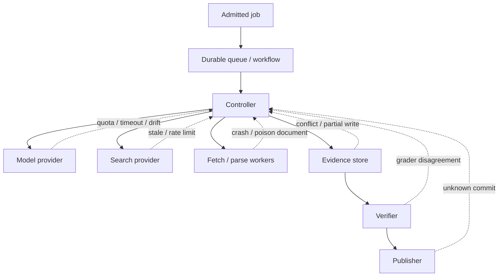

# Reliability, Observability, and Operations

> **Decision:** Operate research as a durable, versioned workload whose useful outcome is a verified artifact—not a successful model response.

## Failure domains



Design recovery per boundary. Restarting the whole agent is not a recovery strategy.

## Run states and terminal outcomes

Use explicit states such as:

`queued → clarifying → planning → researching → gap_review → synthesizing → verifying → awaiting_review → publishing → completed`.

Terminal outcomes should distinguish:

- `completed_verified`;
- `completed_with_limitations`;
- `insufficient_evidence`;
- `unresolved_material_conflict`;
- `budget_exhausted`;
- `deadline_expired`;
- `cancelled`;
- `policy_blocked`;
- `failed_internal`;
- `publication_unknown`.

Do not label budget exhaustion or a verifier failure as success simply because prose exists.

## Retry ownership and classification

Assign one retry owner for each logical call. SDK retries count against the activity/run budget and must be observable.

| Failure | Retry? | Recovery |
|---|---|---|
| Explicit transient provider rejection | Bounded | Honor `Retry-After`, exponential backoff with jitter, preserve deadline |
| Provider overload/quota | Not immediately | Reduce concurrency, queue, shed/degrade, or use an evaluated equivalent route |
| Auth/policy/schema error | No | Surface configuration/permanent failure |
| Read timeout before result | Bounded | Retry using stable operation ID/cache key if within deadline |
| Background model job connection lost | Reconcile first | Query provider operation status, then decide |
| Parser crash on one object | Bounded alternate | Quarantine object, try one approved parser/OCR fallback |
| Deterministic bad model/tool arguments | Not unchanged | Correct through model once or stop; engine retry will repeat failure |
| Evidence-store optimistic conflict | Yes | Reload current revision and reapply idempotent transition |
| Verifier rejects claim | Not as infrastructure retry | Targeted research/rewrite with a separate repair budget |
| Publication timeout | Reconcile first | Query destination by idempotency key/receipt before retry |

All attempts carry a root deadline and remaining budgets. A child may use less, never silently reset them.

## Idempotency and concurrency

Use stable operation keys:

- search: hash of normalized query, filters, provider, authorization scope, freshness bucket;
- fetch: canonical URL, representation policy, authorization scope, validator/version;
- parse: raw object hash plus parser/version/config;
- extraction: representation ID plus schema/prompt/model version;
- verification: claim/evidence revision plus verifier/rubric version;
- artifact render: verified intermediate hash plus renderer version;
- publication: artifact revision plus destination.

Do not deduplicate across tenants or access scopes unless explicitly safe.

Use optimistic concurrency or fenced leases for branch and run ownership. Accepted evidence is append-only; concurrent workers should not overwrite one another. Deduplicate exact spans by identity while preserving each worker's observation/decision.

Cancellation has multiple semantics:

1. stop admitting new branches/tools;
2. request cooperative child cancellation;
3. fence evidence/claim mutations from obsolete workers;
4. prevent publication/commit;
5. reclaim sandbox/network resources;
6. record which children could not be stopped immediately.

Test these semantics. A method named `cancel` does not prove descendant quiescence.

## Effect and reconciliation boundaries

Separate proposals, reservations, external attempts, observed outcomes, and committed domain transitions. Only the last changes authoritative run/artifact state.

| Boundary | Stable key | Ambiguous outcome response | Commit evidence |
|---|---|---|---|
| Search/discovery | Normalized query, filters, provider, scope, freshness bucket | Reuse lawful response cache or retry within budget; duplicate discovery is tolerable but charged/recorded | Result-set receipt with completion/truncation |
| Fetch | Canonical locator, representation policy, scope, validator | Check content-addressed object/operation receipt; conditional retry | Representation ID, raw hash, final URL, rights/access receipt |
| Managed model/background job | Provider operation ID plus application attempt ID | Poll/retrieve provider job; never create a second job merely because local connection failed | Final provider status and stored normalized output/tool-call receipt |
| Database/warehouse query | Query/parameter/snapshot or job ID | Reconcile job status and result pages; do not re-run against a changed snapshot silently | Complete ordered result hash, page count, schema, bytes/cost |
| Evidence/claim mutation | Expected aggregate revision and transition ID | Reload and idempotently reapply or reject stale writer | Database transaction/event/outbox commit |
| Memory/domain promotion | Promotion ID plus object/policy revision | Query promotion ledger and target index; fence duplicate | Promotion receipt with provenance, scope, TTL, deletion route |
| Publication/export/notification | Artifact revision, destination, idempotency key | Query destination/outbox/receipt before retry | Destination version/receipt and postcondition hash |
| Correction/deletion | Source-status revision plus descendant ID | Replay idempotently until terminal disposition | Per-descendant action/erasure/invalidation receipt and feed watermark |

Use a transactional outbox for effects requested by authoritative database state. A worker may execute an effect, but a reconciler owns unknown outcomes and closure. Never let a model decide that an ambiguous publication, deletion, payment-like licensed query, or provider job “probably failed.”

## Observability model

Use application events as the stable contract and map them to traces, metrics, and logs. Trace at least:

```text
research.run
├── brief.compile
├── plan.create
├── branch br_17
│   ├── search.query
│   ├── fetch.document
│   ├── parse.document
│   └── evidence.assess
├── claim.synthesize
├── claim.verify
├── artifact.render
└── artifact.publish
```

Span attributes should use low-cardinality identifiers and versions. Full prompts, source text, queries, tool arguments, and results are sensitive/high-cardinality and opt-in under governed storage. Link parallel branch spans to the run and preserve causation even when asynchronous.

Useful trace fields:

- run/brief/plan/branch/question IDs;
- workload class, tenant pseudonym, policy versions;
- model provider/route/snapshot, tool contract version;
- attempt, deadline, retry reason, cache outcome;
- source/representation/evidence/claim IDs—not raw text;
- token/tool/fetch bytes/cost estimates;
- verification result and artifact revision;
- cancellation and terminal reason.

Keep the signal roles explicit:

| Signal | Answers | Required properties | Must exclude by default |
|---|---|---|---|
| Trace | Where time, retries, and causal branch/effect flow went | Run/branch/question/operation IDs, version bundle, attempt/deadline, linked async spans | Raw source text, credentials, opaque provider cursors |
| Structured log | Why one transition/tool attempt failed or was blocked | Event/error code, safe reason, policy/version, operation ID, redaction class | Full prompts/results and sensitive query strings |
| Metric | Whether quality/capacity/SLO behavior is changing | Low-cardinality workload/tenant-class/region/bundle labels | Source URL, claim ID, user ID, unbounded error text |
| Audit record | Who/what was authorized, accessed, approved, published, corrected, or deleted | Actor/principal class, object IDs, policy decision, purpose, time, immutable receipt | Unnecessary content; audit is not a shadow evidence store |
| Governed trajectory | How behavior produced an outcome for evaluation/incident review | Typed actions/results, referenced evidence, sampling consent/policy | Cross-tenant data and data whose provider terms forbid retention |

Instrument queue admission, branch proposal/admission/rejection, every connector page, saturation/stop decisions, context assembly and continuity receipt, claim/citation verification, correction propagation, and reconciliation. A trace ending at “provider returned 200” cannot explain a research artifact.

OpenTelemetry's GenAI/agent conventions are evolving. Own a stable internal event schema and translate at the export boundary. Never put secrets or private evidence in trace baggage.

## Metrics that describe useful research

### Outcome and quality

- verified completion rate by task class;
- material claim support precision and citation completeness;
- exact quote pass rate;
- unresolved material contradictions per artifact;
- freshness-policy pass rate;
- human acceptance, edit distance, and invalidation rate;
- repeat reliability across trials;
- source independence and primary-source coverage where required.

### Research behavior

- plan revisions, branches, delegation depth, and duplicate-branch rate;
- queries per accepted claim and zero-yield query ratio;
- discovered → fetched → accepted source conversion;
- fetch/parser failure by domain/media type/version;
- evidence accepted/rejected and reasons;
- repair cycles and verifier finding classes;
- time spent in queue, search, fetch, model, verification, review, publication.

### Cost and capacity

- tokens, search calls, fetch bytes, browser minutes, OCR pages by role/branch;
- cost per admitted, terminal, and verified artifact;
- cost per accepted material claim;
- abandoned and retry-amplified cost;
- queue age, in-flight jobs, estimated drain time;
- saturation by provider quota, browser pool, parser CPU/memory, verifier, and human review.

Avoid optimizing raw citation count, source count, tool calls, tokens, or report length. Each can increase while quality declines.

## SLOs and alerts

Example research-class SLOs:

| SLI | Objective idea | Page when |
|---|---|---|
| Admission decision | Timely accept/reject/clarify | Intake unavailable or queue admission stuck |
| Deadline-valid terminal result | Verified/limited/insufficient before deadline | Burn rate threatens objective |
| Evidence durability | No accepted evidence lost | Hash/state invariant fails |
| Publication safety | No release with failed mandatory gate | Any occurrence |
| Cross-zone confidentiality | No forbidden private-to-public flow | Any occurrence |
| Resume correctness | No duplicate publish/lost state in recovery cohort | Any confirmed occurrence |
| Material correction closure | Every affected descendant reaches a terminal disposition within class target | Backlog age or incomplete propagation threatens target |
| Access/deletion enforcement | Revoked/deleted content excluded from new contexts within policy target | Any known post-fence retrieval |
| Queue deadline viability | Admitted work has enough predicted service time to finish | Oldest-ready age or drain-time forecast breaches class budget |
| Evidence-package reproducibility | Frozen package integrity and render checks pass | Hash/reference/rights-receipt failure |

Use quality dashboards for slower sampled signals and page on operational/security conditions that require immediate action. Segregate tenant, workload, model/tool/policy version, source class, and release cohort so averages do not hide regressions.

Define SLOs with measurement boundaries. For example, correction latency starts when the system observes or should have polled the source event and ends only when every dependent claim, artifact, cache/memory entry, and governed destination has a disposition. Exclude no backlog merely because a connector is down; report dependency-caused unavailability separately.

## Deployment and behavior bundles

Release an immutable behavior bundle, not an informal combination of “current” components:

```yaml
bundle_id: research-behavior-2026-08-31.3
schemas: {brief: 4, evidence: 7, events: 3, artifact_ir: 5}
controller: research-controller@1.8.0
prompts: sha256:...
model_routes: {planner: snapshot-a, extractor: snapshot-b, verifier: snapshot-c}
adapters: {brave: 2.1.0, http_fetch: 5.3.2, openalex: 3.0.1}
parsers: {html: 4.1.0, pdf: 4.2.1, ocr: 2.0.0}
policies: {source: 9, security: 14, memory: 3, release: 11}
renderer: markdown-renderer@3.4.0
graders: {citation: 6, report: 4}
```

Keep prior bundles and compatible workers available for running jobs and frozen replay. Deployment options:

- **rainbow/side-by-side:** old jobs finish on old compatible workers; new jobs use new version;
- **workflow patching/version gates:** replay-safe change paths for durable histories;
- **shadow:** new planner/verifier runs without controlling publication;
- **canary:** small evaluated task/tenant cohort with rollback criteria;
- **artifact replay:** run new verifier/renderer against frozen claim/evidence bundles.

Use shadow results to compare decisions and artifacts without effects. Canary by workload class, source zone, tenant risk, language, and publication authority; never expose a high-impact/publication cohort first. Define rollback boundaries before release for material claim support, coverage, contradiction recall, citation correctness, security, p95 deadline, cost, and correction propagation.

Drift monitors should cover input/task mix, query/result yield, source/provider coverage, parser/OCR output, model action distribution, context/compaction loss, grader/human disagreement, cost/latency, and source-status feeds. Separate expected live-web change from system drift using frozen canaries and provider-specific probes.

Release gates should include schema compatibility, workflow replay, deterministic unit/contract tests, frozen-corpus research evals, live-web smoke tests, adversarial security tests, failure injection, cost/latency bounds, and human-reviewed artifact samples.

Never upgrade model aliases, prompts, parsers, search ranking, and verifier simultaneously without a way to attribute change. If several must change together, canary and roll back the declared complete bundle rather than composing an untested mixture.

### Controlled failure mining

Production data becomes an evaluation candidate only through a governed pipeline:

1. detect a correction, invalidation, user edit, verifier disagreement, security event, high-cost outlier, saturation mistake, or recovery failure;
2. preserve typed IDs/receipts and minimize or redact content under source/provider/tenant policy;
3. classify root cause and counterfactual expected behavior with reviewer approval;
4. create a frozen synthetic or authorized fixture that reproduces the mechanism;
5. keep the candidate out of the release suite until labels and contamination checks pass;
6. add it to either a capability set or near-100%-pass regression set with provenance and expiry;
7. verify the fix across adjacent slices, not only the mined example.

Do not train prompts/models on raw failures and then grade them on the same artifacts. Maintain held-out cohorts and measure whether fixes trade off benign utility, coverage, or cost.

## Capacity and backpressure

Bound queues and admit only work likely to finish before its deadline. Track oldest ready age and drain time, not queue length alone. Separate interactive planning from long background research and scheduled refreshes.

When constrained:

1. stop low-value branch expansion;
2. reuse fresh authorized evidence/cache;
3. choose evaluated cheaper routes for low-risk extraction;
4. preserve mandatory verification;
5. reduce optional depth, visuals, or exhaustive enumeration;
6. shed or defer work before it becomes stale;
7. never remove security/release gates as a degradation mode.

Use tenant and workload concurrency limits to prevent a single broad brief from consuming every browser/model slot.

Capacity models must include fan-out and retries. Estimate demand in resource units, not jobs:

```text
required_search_rps = admitted_jobs_per_second
                      * expected_branches_per_job
                      * expected_search_calls_per_branch
                      * retry_amplification

drain_seconds = queued_remaining_service_units / sustainable_free_service_units_per_second
```

Rate governors operate at provider credential, tenant, domain, region, and global levels. Reserve a small capacity pool for verification, cancellation/reconciliation, corrections/deletions, and incident recovery; otherwise exploratory traffic can prevent the system from making outputs safe. Bulk backfills use separate queues and provider bulk/snapshot interfaces.

## Regional and tenant isolation

Bind every run and derived object to `tenant_id`, `data_region`, `access_scope_id`, `encryption_key_id`, and `retention_policy_id`. Enforce them in database row policy or physical partitioning, object-store prefixes/buckets plus IAM, queues, caches, vector/full-text indexes, telemetry exporters, and backup/restore tooling.

Rules:

- do not route a model, connector, object, log, backup, or failover copy outside the allowed region;
- use tenant-scoped provider credentials and quotas where possible; never deduplicate private objects across tenants solely by hash;
- delegated enterprise results remain bound to the subject/access scope that produced them;
- regional failover is an authorization decision, not an automatic DNS change;
- keep public evidence shareable only through an explicit policy path—“public” does not erase tenant purpose, provider terms, or deletion obligations;
- test negative isolation: cross-tenant IDs, caches, continuation tokens, artifact URLs, traces, and backup restores must all fail.

For multi-geo providers, record the actual provider/job region or document that it is provider-managed/unknown. Microsoft Graph application search, for example, documents regional constraints; BigQuery result retrieval requires the job location in relevant cases. A deployment cannot claim regional control that its providers do not expose contractually.

## Disaster recovery and recovery load

Define RPO/RTO per state class:

| State | Typical priority | Recovery proof |
|---|---|---|
| Brief, plan, evidence, claims, approvals, artifact, audit/outbox | Zero or minimal data loss | Database point-in-time restore plus invariant/hash scan |
| Raw/derived representations | Content-addressed recovery under rights/region policy | Object inventory matches representation ledger |
| Provider jobs and publication effects | Reconcile, never assume | Operation/destination status and receipts |
| Working contexts and caches | Rebuildable | Continuity receipts and authoritative state reconstruct next action |
| Telemetry | Lower product RPO, higher incident-dependent value | Exporter/backfill gap explicitly reported |

Recovery creates burst load: replayed outboxes, provider polling, object verification, cache misses, overdue freshness checks, corrections, and queued new work. Test a cold-region recovery with provider quotas and tenant limits enabled. Throttle rehydration, prioritize reconciliation/corrections over new research, and calculate drain time. A backup restore test that never resumes external operations or full load does not prove service recovery.

Quarterly or risk-based drills should inject database loss, object-store lag, expired provider cursors, unavailable model/search routes, duplicate outbox delivery, and partial destination recovery. Pass only when RPO/RTO, tenant/region policy, evidence hashes, no-duplicate effects, and correction watermarks hold under expected recovery concurrency.

## Operational runbooks

### Search provider outage

- reduce/stop admission for affected classes;
- allow jobs to wait only within deadlines;
- switch to an approved provider only if semantic/eval parity is established;
- preserve partial evidence and return a limitation rather than hallucinate;
- avoid retry storms.

### Model route regression

- halt new jobs on the route;
- pin affected cohort and compare prompts/tools/model versions;
- shadow prior/alternate route on frozen cases;
- invalidate unpublished candidates failing gates;
- review released artifacts only when lineage indicates impact.

### Parser vulnerability

- disable vulnerable media/parser version;
- quarantine affected representations;
- trace dependent spans/claims/artifacts;
- rebuild in patched sandbox, compare hashes/extraction, reverify;
- rotate any credentials exposed to the cell, though none should be present.

### Source correction or retraction

- ingest status event;
- identify dependent evidence edges and claims;
- mark artifacts under review or invalidated according to materiality;
- seek replacement evidence and issue a new revision/diff;
- retain the audit trail.

### Run stuck in progress

- inspect lease/heartbeat and oldest in-flight operation;
- reconcile external operations;
- cancel/fence orphaned workers;
- resume on compatible worker or close with explicit terminal state;
- create a regression/failure-injection case.

## Cost/performance choices

| Technique | Benefit | Risk / condition |
|---|---|---|
| Parallel independent workers | Lower wall time and broader search | Token/tool duplication; only after partition-quality eval |
| Tool-result compaction | Smaller contexts | Must preserve evidence IDs and omitted-detail access |
| Content-addressed capture/parse cache | Avoid repeated fetch/OCR | Scope by authorization/freshness; respect retention |
| Prompt/model input caching | Lower repeated-prefix cost | Provider-specific privacy and invalidation semantics |
| Small model for extraction | Lower cost/latency | Schema and grounding eval must pass |
| Strong model for planner/verifier | Better decisions | May dominate cost; measure per verified outcome |
| Draft-first iterative refinement | Focuses research gaps | Can anchor on a bad initial draft; require disconfirming search |
| Frozen evidence synthesis | Reproducible and safer | Not a freshness check |

## Operational readiness checklist

- [ ] Every dependency has deadlines, quotas, failure classification, and retry ownership.
- [ ] Provider background jobs and publication are reconciled before retry.
- [ ] Leases are fenced; stale workers cannot mutate current state.
- [ ] Cancellation prevents publication and new scheduling.
- [ ] Events/traces identify evidence and claims without logging raw sensitive content by default.
- [ ] Traces, structured logs, metrics, audit records, and governed trajectories have distinct schemas and retention.
- [ ] Dashboards measure verified outcomes, coverage, correction propagation, cost, and saturation.
- [ ] Deployments preserve workflow/state compatibility and pin complete behavior bundles.
- [ ] Shadow/canary/rollback and drift monitoring cover quality, security, cost, latency, and source behavior.
- [ ] Queues are bounded; workload, tenant, provider, and regional capacity are isolated.
- [ ] DR tests restore evidence integrity, reconcile effects, and sustain measured recovery load within RPO/RTO.
- [ ] Controlled failure mining creates reviewed, de-identified, uncontaminated regression fixtures.
- [ ] Runbooks cover provider outage, model regression, parser incident, source correction, and stuck run.
- [ ] Cost is optimized per verified artifact, never by removing mandatory verification or security.

## Strong sources and related local guidance

- [Temporal Workflow Execution](https://docs.temporal.io/workflow-execution)
- [Temporal Retry Policies](https://docs.temporal.io/encyclopedia/retry-policies)
- [OpenAI Deep Research background execution](https://developers.openai.com/api/docs/guides/deep-research)
- [Google Gemini Deep Research API](https://ai.google.dev/gemini-api/docs/deep-research)
- [Anthropic multi-agent research operations](https://www.anthropic.com/engineering/multi-agent-research-system)
- [OpenTelemetry context propagation](https://opentelemetry.io/docs/concepts/context-propagation/)
- [Production agent control plane](../../architectures/production-agent-control-plane.md)
- [Idempotency and side effects](../../reliability/idempotency-and-side-effects.md)
- [Observability and tracing](../../evaluation/observability-and-tracing.md)
