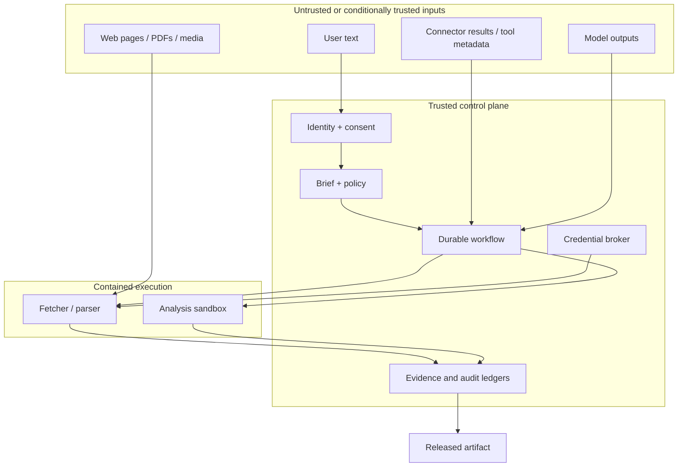

# Requirements and Threat Model

> **Purpose:** Convert “build a deep-research agent” into a testable product contract and a concrete risk model.  
> **Baseline:** 2026-08-31. Revalidate privacy, crawling, provider-retention, and connector requirements for the deployment jurisdiction and source set.

## Start with the research contract

A research request is incomplete until the system knows what counts as a useful, permissible, and sufficiently supported result. Clarification is a product stage, not a conversational nicety.

```yaml
research_brief:
  question: "Compare approaches for reducing data-center cooling water use."
  decisions_supported: ["technology shortlist", "pilot design"]
  audience: "engineering and sustainability leads"
  jurisdictions: ["India", "Singapore"]
  as_of: "2026-08-31T00:00:00Z"
  source_scope:
    allow: ["public_web", "approved_internal_corpus"]
    prefer: ["standards", "regulators", "original_research", "vendor_technical_docs"]
    exclude: ["personal_data_brokers", "unlicensed_paywall_bypass"]
  output:
    format: "decision_memo"
    max_words: 5000
    citation_style: "inline_links_plus_manifest"
  evidence_bar:
    material_claim_support: "two_independent_sources_or_one_authoritative_primary"
    quote_policy: "minimal_exact_excerpts"
    unresolved_conflicts: "surface"
  budgets:
    wall_clock_minutes: 25
    search_calls: 80
    fetched_documents: 120
    model_tokens: 500000
    estimated_cost_usd: 5
```

The application should ask only clarifications that change research scope, risk, cost, or output. A broad product question may need geography, date, comparison criteria, source policy, and intended decision. A well-formed technical question may need none.

## Functional requirements

| Capability | Minimum production requirement | Failure response |
|---|---|---|
| Clarification | Detect material ambiguity and bind approved answers into a versioned brief | Pause before costly research or state assumptions explicitly |
| Decomposition | Map every required decision/criterion to research questions and evidence needs | Mark coverage gaps; do not hide them in prose |
| Search | Support query reformulation, multiple discovery routes, and source-type targeting | Stop a failing route and record the blind spot |
| Connector qualification | Version provider query, coverage, access, pagination, rate, rights, retention, correction, and deletion capabilities | Keep an unqualified adapter experimental; never let it satisfy a mandatory evidence need |
| Acquisition | Fetch, parse, normalize, identify, deduplicate, and retain only permitted evidence/metadata | Quarantine malformed/untrusted content; preserve fetch/access/rights error |
| Evidence | Store exact passages and lineage independently of summaries | Reject unsupported claim publication |
| Verification | Check claim support, citation completeness, quote exactness, contradiction, and freshness | Repair, downgrade confidence, or fail the release gate |
| Artifact generation | Generate from accepted claims and expose methods, limitations, sources, and as-of date | Emit an incomplete-research artifact with explicit status |
| Resume | Continue from durable state after process/provider failure | Reconcile in-flight operations before retry |
| Refresh | Identify and revalidate time-sensitive claims and changed sources | Mark stale until reverified |
| Correction/deletion propagation | Traverse source → representation → evidence → claim → artifact → destination for correction, retraction, permission loss, rights change, and deletion | Fence reuse immediately; invalidate, reverify, redact, or cryptographically erase by policy |
| Review | Give a human reviewer claim-to-evidence drill-down and version diffs | Block high-impact release without required review |

## Non-functional requirements

Define targets per research class; a single global SLO is misleading.

| Dimension | Example service objective | Guardrail |
|---|---|---|
| Useful completion | 95% of admitted standard briefs reach a terminal artifact or legible insufficiency result | HTTP success is not completion |
| Citation support | At least 98% of material claims have reviewer-accepted supporting evidence | Citation count is not support precision |
| Quote integrity | 100% exact match to captured representation and valid source location | Zero tolerance release gate |
| Freshness | All volatile claims meet their class-specific age policy at publication | “Recently fetched” does not prove current truth |
| Resume | No accepted evidence loss and no duplicate external effect across injected worker crashes | Exercise in CI and staging |
| Latency | Class-specific p50/p95 from admission to verified artifact | Separate queue, research, verification, and review time |
| Cost | Cost per verified artifact and per accepted claim | Track abandoned/failed work too |
| Security | No cross-zone secret egress in adversarial corpus tests | Prompt-level defenses are insufficient |
| Reproducibility | Rebuild artifact from frozen evidence and pinned versions | Live-web replay is a different test |
| Correction propagation | 100% of descendants reach a terminal disposition within the source-class SLO | Acknowledging a feed event is not completion |

## Trust boundaries and assets



Protect at least:

- user identity, intent, uploaded files, internal corpus content, and access tokens;
- research brief, exclusion rules, and source allow/deny policy;
- evidence snapshots, quotes, claim decisions, contradiction records, and reviewer actions;
- unreleased commercial, legal, medical, security, or personal conclusions;
- model/provider prompts, route choices, budgets, and evaluation datasets;
- artifact integrity, source links, citation anchors, and provenance manifest;
- crawling reputation, licensed-access agreements, and provider quotas.

## Threat actors and failure agents

The system can fail without a malicious human. Treat these as actors in the threat model:

- a malicious page author planting direct or hidden instructions;
- a compromised or overly broad connector returning hostile content;
- a user attempting surveillance, doxxing, policy bypass, or copyrighted-content extraction;
- a source that is authoritative but outdated, corrected, or retracted;
- coordinated sources repeating the same originating error;
- a model inventing evidence, overgeneralizing, or following untrusted instructions;
- a verifier model sharing the generator's blind spots;
- an operator misconfiguring egress, retention, tenant access, or release thresholds;
- a provider/API changing behavior or tool semantics behind an alias;
- network, parser, OCR, queue, storage, and workflow failures that create partial state.

## Risk register

| Risk | Typical path | Impact | Primary controls | Detection evidence |
|---|---|---|---|---|
| Indirect prompt injection | Hostile instructions in page, PDF, metadata, or connector output | Search diversion, false report, exfiltration | Untrusted-data labeling, separated trust zones, deterministic tool policy, restricted egress | Tool-call anomaly, injection canaries, blocked flow record |
| SSRF | Crafted URL, redirect, DNS rebinding, alternate IP encoding | Metadata/credential theft, internal scanning | Fetch proxy, scheme/port policy, DNS/IP validation per redirect, network isolation | Resolved-IP and redirect-chain audit |
| Cross-source exfiltration | Private facts appear in public query, URL, or third-party tool argument | Confidentiality breach | Public/private staged runs, DLP, argument schema, outbound allowlist | Taint lineage from private evidence to egress sink |
| Citation laundering | Secondary page cited for a claim originating elsewhere | False authority and hidden circularity | Source lineage, original-source pursuit, independence graph | Shared-origin clusters and citation-chain record |
| Quote corruption | Paraphrase presented as quote; OCR or edition drift | Legal/reputational harm | Raw snapshot, exact span, hash, edition/location, quote verifier | Exact-match gate and diff |
| Freshness failure | Search index or cached page is older than report assumes | Wrong current-state conclusion | As-of semantics, published/updated/fetched fields, validators, refresh policy | Stale-claim report |
| Retraction/correction miss | Scholarly source changed after capture | Invalid evidence | DOI metadata, Crossmark/Retraction Watch checks where relevant | Source-status check result |
| Contradiction suppression | Synthesizer selects one side or worker result overwrites another | False consensus | Append-only observations, contradiction objects, independent verification | Unresolved material-conflict count |
| Worker explosion | Ambiguous plan spawns excessive agents/searches | Cost, latency, quota exhaustion | Admission, fan-out and depth caps, leases, marginal-value stopping | Branch/tool/token budget metrics |
| Retry amplification | SDK, worker, workflow, and provider each retry | Outage amplification and cost | One retry owner per layer, deadlines, attempt ledger | Attempt lineage and retry reason |
| Evidence poisoning | Malicious content persists into memory or later runs | Delayed compromise | Immutable raw/derived separation, trust labels, TTL/review for memory | Provenance and taint scan |
| Evaluation contamination | Agent finds benchmark answer or recognizes the test | False capability score | Frozen corpora, private tasks, leak scans, trajectory review | Contamination flags and adjusted scores |

## Privacy and sensitive-research policy

Before accepting a brief, classify both the **subject** and the **sources**:

| Class | Examples | Default |
|---|---|---|
| Public, low impact | Product documentation comparison | Admit with normal controls |
| High-impact professional | Medical, legal, financial, employment, safety | Require domain policy, stronger sources, uncertainty, and human review |
| Personal information aggregation | Identity, location, relationships, vulnerabilities | Reject or tightly constrain according to policy and lawful purpose |
| Internal confidential | Strategy, incidents, source code, customer data | Private zone, least-privilege retrieval, no arbitrary public egress |
| Dual-use or dangerous | Cyber, chemical, biological, weapon-related research | Capability/policy screening, constrained tooling, specialist review |

“Publicly available” does not mean harmless to aggregate. Deep research changes risk by joining fragments into a more actionable profile. Record purpose, authorization, allowed attributes, retention, and reviewer requirements before collection.

## Release invariants by impact

| Invariant | Ordinary report | High-impact report |
|---|---:|---:|
| Material claim has evidence | Required | Required |
| Citation entailment checked | Automated + sample review | Automated + expert review |
| Independent corroboration | Risk-based | Required for consequential claims unless authoritative primary source is sufficient |
| Contradictions surfaced | Required | Required with reviewer disposition |
| Quote exactness | Required | Required |
| Source freshness | Class policy | Strict claim-specific policy |
| Human approval | Optional | Required before external action/publication |
| Reproducibility manifest | Required | Required with retained evidence under governed access |
| Advice disclaimer | Context-specific | Never substitute for licensed professional judgment |

## Misuse and non-goals

The system is not:

- an authority for truth based only on fluent synthesis;
- a mechanism to bypass paywalls, authentication, robots rules, licensing, or access controls;
- a surveillance or personal-data aggregation engine;
- a substitute for professional review in high-impact decisions;
- an “exactly once” source of truth for volatile web facts;
- a plagiarism engine or a way to reproduce substantial copyrighted text;
- a guarantee that cited sources are correct, independent, or current merely because links resolve;
- a reason to give a model unrestricted browser, network, secrets, or code-execution access.

## Requirements checklist

- [ ] Research classes and admission policy are defined.
- [ ] Brief schema captures scope, as-of date, source policy, evidence bar, and budgets.
- [ ] Material claim and material contradiction are defined for the domain.
- [ ] Public/private data-flow boundaries and egress sinks are enumerated.
- [ ] Crawling, licensing, privacy, retention, and deletion policies are approved.
- [ ] Every connector has a current capability manifest, qualification fixtures, owner, expiry, and kill switch.
- [ ] Source permission loss, correction, retraction, rights change, and deletion propagate through derived summaries and released destinations.
- [ ] Release invariants are automated where possible and assigned to human roles where not.
- [ ] Failure states include insufficient evidence, access denied, stale evidence, unresolved conflict, budget exhausted, unsafe request, and internal error.
- [ ] Threat tests cover prompt injection, SSRF, cross-source exfiltration, poisoning, and evaluator contamination.
- [ ] The product can explain its limitations without converting uncertainty into fabricated confidence.

## Strong sources

- [OpenAI Deep Research API guide](https://developers.openai.com/api/docs/guides/deep-research)
- [OpenAI Deep Research System Card](https://cdn.openai.com/deep-research-system-card.pdf)
- [NIST AI RMF Generative AI Profile](https://www.nist.gov/publications/artificial-intelligence-risk-management-framework-generative-artificial-intelligence)
- [OWASP SSRF Prevention Cheat Sheet](https://cheatsheetseries.owasp.org/cheatsheets/Server_Side_Request_Forgery_Prevention_Cheat_Sheet.html)
- [Model Context Protocol specification](https://modelcontextprotocol.io/specification/2025-03-26/index)
- [RFC 9309: Robots Exclusion Protocol](https://www.rfc-editor.org/rfc/rfc9309.html)
