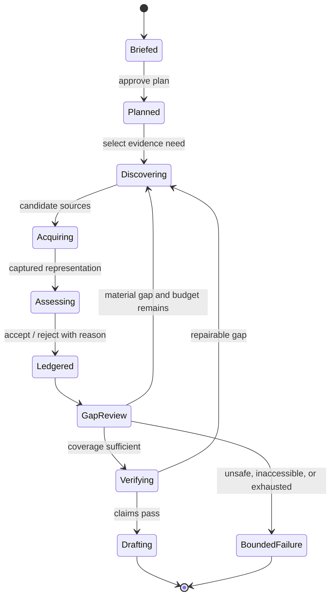
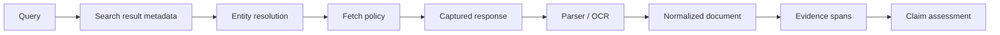

# Research Loop and Source Acquisition

> **Decision:** Build an adaptive but bounded process that searches for evidence, not a loop that optimizes for activity.

## The control loop



Every transition writes durable state. “Thinking” is not the state machine.

## Step 1: compile the brief into evidence needs

Decomposition should produce a testable coverage map, not a decorative outline.

```json
{
  "question_id": "q-water-004",
  "question": "What measured water reduction has immersion cooling achieved?",
  "claim_types": ["quantitative", "comparative"],
  "evidence_needed": [
    {"type": "field_measurement", "priority": "required"},
    {"type": "methodology", "priority": "required"},
    {"type": "vendor_claim", "priority": "context_only"}
  ],
  "dimensions": ["baseline", "climate", "facility_boundary", "measurement_period"],
  "exclusions": ["modeled savings presented as measured"],
  "status": "open"
}
```

Useful decomposition axes include:

- decision criteria, not just topic headings;
- entities, jurisdictions, time periods, and definitions;
- competing hypotheses and disconfirming evidence;
- factual, quantitative, causal, normative, and forecast claim types;
- expected source classes and known access constraints;
- dependencies between questions;
- output sections and mandatory caveats.

Require the planner to identify what would change the conclusion. This prevents a search process that collects only confirming material.

### Bounded planning contract

Planning is a versioned compilation step, not an unbounded pre-research conversation. Each question must declare:

```yaml
question_id: q-water-004
parent_id: q-technology-01
decision_dimension: measured_water_consumption
priority: required
dependencies: [q-definitions-01]
evidence_bar: original_measurement_with_method
preferred_routes: [paper_index, dataset_repository, public_web]
disconfirming_targets: [energy_penalty, shifted_water_boundary]
completion_predicate: "one fit primary result or two exhausted qualified routes"
branch_budget: {queries: 8, fetches: 12, tokens: 45000, wall_seconds: 360}
owner: controller
```

The plan compiler enforces maximum question count, dependency depth, active branches, and budget sum. A revision must cite new evidence/gap IDs and explain adds, splits, merges, reprioritization, and removals. Reject revisions that merely rename the outline, reopen completed questions without new evidence, or allocate more than the run's unreserved budget.

**Planning stop rule:** approve the smallest plan that covers every required decision dimension, includes a disconfirming route for each material conclusion, and assigns a completion predicate. Unknown leads are handled by bounded revisions, not speculative branches.

## Step 2: choose breadth and depth

Partition only independent work. Bad partitions duplicate search or break causal context.

| Partition | Good when | Bad when |
|---|---|---|
| By entity | Each company/country/product can be researched independently | Entities share one changing regulatory or market context |
| By claim type | Separate efficacy, cost, safety, and operations evidence | One study provides the relationships among them |
| By source class | One worker finds standards, another original studies | Workers cannot reconcile versions or shared identifiers |
| By hypothesis | Red-team and confirmatory searches stay independent | Evidence is sparse and worker budgets would be wasted |
| By time period | Historical versus current state | Definitions changed and need continuous interpretation |

Start with two or three high-value branches. Expand only after branches return distinct evidence and remaining gaps justify more work. Fan-out is a budget decision made by code, not an unconstrained tool the lead model can call repeatedly.

## Step 3: generate a query portfolio

One verbose query is rarely sufficient. Build a portfolio:

1. **Orientation:** short broad queries to learn vocabulary and identify primary actors.
2. **Primary-source targeting:** domains, standards numbers, DOI/title, agency, repository, release notes.
3. **Claim targeting:** exact metric, date, geography, methodology, definition.
4. **Disconfirmation:** criticism, replication, correction, retraction, limitation, failure, incident.
5. **Entity resolution:** aliases, prior names, authors, organizations, canonical identifiers.
6. **Freshness:** latest official update, changelog, filing, archived prior version.
7. **Gap repair:** queries derived from uncovered claim dimensions.

Record the query, intent, parent evidence need, provider, filters, timestamp, result set ID, and cost. Query strings may contain sensitive terms; apply telemetry redaction and prevent private evidence from being interpolated into public searches.

## Step 4: separate discovery from acquisition

Search results are leads, not evidence. A snippet may be truncated, synthesized, stale, or unrelated to the resolved page.



The acquisition layer should support:

- HTTP fetch with explicit user agent, timeouts, byte limits, content-type policy, and redirect validation;
- API and repository connectors using least-privilege credentials;
- HTML boilerplate removal while retaining headings, tables, links, and locations;
- PDF text extraction with layout-aware fallback and OCR confidence;
- safe archive/document decompression with nesting and size limits;
- structured formats such as JSON, CSV, XML, and scholarly metadata;
- browser rendering only when static fetch cannot obtain essential content;
- malware scanning and sandboxed parsing for complex files;
- object capture or compliant validators when retention is restricted.

Route each action through the [connector capability manifest and qualification gate](connectors-and-provider-qualification.md). If a discovery provider prohibits retention of results, retain only the allowed operation receipt and immediately resolve promising hits through a separately qualified acquisition path. If a provider cannot expose exact representation or structured-row identity, it can orient the search but cannot satisfy a material claim by itself.

Follow robots rules for crawler behavior, source terms, authentication, license, rate limits, and organizational policy. `robots.txt` is a protocol control, not a complete legal permission model.

## Safe fetch contract

```json
{
  "operation_id": "fetch:sha256(canonical_url|policy|representation)",
  "url": "https://example.org/report.pdf",
  "allowed_schemes": ["https"],
  "max_redirects": 3,
  "max_bytes": 25000000,
  "connect_timeout_ms": 3000,
  "read_timeout_ms": 15000,
  "network_zone": "public_web",
  "robots_policy": "respect",
  "credential_ref": null,
  "accepted_types": ["text/html", "application/pdf"],
  "capture": "encrypted_object_store"
}
```

The fetch gateway must validate every redirect and resolved IP, block local/link-local/private/metadata destinations for public-web jobs, restrict ports and schemes, and re-resolve according to a DNS-rebinding-safe policy. Do not let model code open arbitrary URLs directly.

## Identity, canonicalization, and deduplication

URL equality is not document equality. Track:

- requested URL and every redirect;
- canonical URL asserted by the page and the system's normalized URL;
- source-controlled identifiers such as DOI, report number, standard ID, commit SHA, filing ID, or dataset version;
- title, authors/organization, publication/update dates, edition/version;
- content hash of raw representation and normalized text;
- language, media type, parser and parser version;
- relationships such as mirrors, translations, preprint/published version, correction, retraction, and derivative reporting.

Deduplicate exact captures by content hash. Cluster near-duplicates and shared-origin reports, but keep each source identity because publication context, date, and authority may differ. Ten articles repeating one press release are not ten independent corroborations.

For scholarly sources, DOI metadata can assist identity and status, but metadata is incomplete and can lag. Preserve publisher/source metadata and reconciliation decisions.

## Source assessment at acquisition time

Do not reduce source quality to one universal score. Record dimensions and let the claim policy decide fitness.

| Dimension | Questions |
|---|---|
| Directness | Is this the original data, standard, filing, source code, or firsthand statement? |
| Authority | Is the publisher responsible, qualified, and identifiable for this claim type? |
| Method | Are definitions, sample, measurements, analysis, and limitations available? |
| Currency | What is published, updated, effective, observed, and fetched time? |
| Independence | Does it share an origin, funding, authorship, dataset, or press release with other evidence? |
| Specificity | Does it address this claim, population, version, geography, and period? |
| Integrity status | Is it corrected, retracted, superseded, disputed, or archived? |
| Access fidelity | Did the system read full content, an abstract, OCR, snippet, or secondary quote? |

A source can be excellent for one claim and poor for another. Vendor documentation is primary for its API contract and conflicted evidence for product efficacy. A regulation is authoritative for the legal text; commentary may be better for interpretation but cannot replace the text.

## Evidence acceptance

The researcher proposes an evidence span. Deterministic code creates its immutable identity and records an acceptance decision:

```json
{
  "span_id": "ev_01J...",
  "representation_id": "rep_01J...",
  "locator": {"page": 14, "heading": "Limitations", "char_start": 880, "char_end": 1244},
  "text_hash": "sha256:...",
  "access_fidelity": "pdf_text_layer",
  "claim_relevance": ["q-water-004"],
  "quality_dimensions": {"directness": "primary", "method": "reported", "currency": "2026-03"},
  "decision": "accepted",
  "decision_reason": "Measured facility result with baseline definition"
}
```

Keep raw representation, normalized document, and extracted evidence distinct. Parser or normalization changes must produce a new derived representation, never mutate prior evidence.

## Coverage and stopping

More searches can always find more pages. Stop based on evidence coverage and marginal value, not model fatigue.

Evaluate at each checkpoint:

- Are all required questions addressed?
- Does each material claim type have evidence fit for its policy?
- Are definitions, geography, population, time, and methodology aligned?
- Were plausible disconfirming searches attempted?
- Are material contradictions resolved or explicitly open?
- Is the latest evidence within its freshness window?
- Did recent calls add new accepted claims/sources or only duplicates?
- What budget and deadline remain?
- Would another branch change the decision or only add prose?

```text
continue = material_gap
           and budget_remaining
           and expected_information_value > next_step_cost
           and not policy_blocked
```

Expected information value can begin as rules: required gap > material contradiction > weak-source replacement > corroboration > optional depth. Learn a statistical stopping model only after collecting reliable labels.

### Search saturation rule

Use a rolling window per question and source route. A query counts as **material yield** only if it adds one of:

- evidence that satisfies an uncovered required dimension;
- a more fit or more direct source replacing weak evidence;
- a material refutation, limitation, correction, or independence relationship;
- a new source identity for a required entity/version/time slice;
- evidence that changes a claim, contradiction disposition, or decision recommendation.

```text
yield_rate      = material_yield_actions / completed_actions
novelty_rate    = new_independence_groups / fetched_sources
duplicate_rate  = duplicate_or_shared_origin_sources / fetched_sources
gap_delta       = prior_material_gap_weight - current_material_gap_weight
```

Stop a route as saturated when all configured conditions hold, for example: at least eight recent completed actions, zero material yields in the last five, `gap_delta = 0`, duplicate/rejection rate above 0.75, and no untried qualified query family likely to change a material conclusion. The exact window and threshold are calibrated on evaluation data, versioned, and reported—not embedded in a prompt.

Stop the entire research loop when:

1. all required coverage predicates are satisfied or explicitly terminal (`inaccessible`, `insufficient`, `policy_blocked`);
2. material contradictions have a release-compatible disposition;
3. freshness and source-status gates pass;
4. every remaining action is optional, saturated, lower value than its cost, or outside the deadline;
5. a verification budget remains.

Continue only for a named material gap. On every stop, persist the coverage vector, saturation window, untried routes, budget, and counterfactual: “what evidence would reopen this question?”

## Cost controls

Apply independent caps:

- planner/controller turns;
- active workers and delegation depth;
- search calls per branch and provider;
- fetched documents, bytes, render seconds, and OCR pages;
- model tokens by role;
- repeated/near-duplicate query rate;
- wall-clock deadline and queue age;
- cost per task and tenant;
- verifier repair cycles.

Cache search results only within policy and a declared freshness period. Reuse fetched objects by content identity and authorization scope. Do not let caches cross tenants or private/public zones.

Route inexpensive work—URL normalization, exact match, parsing, hashing, metadata extraction—to deterministic code. Use models for semantic tasks that need them. Compact tool results before model context, while preserving references to full evidence.

## Acquisition failure matrix

| Failure | Class | Response | Must record |
|---|---|---|---|
| `429` / quota | Transient/overload | Honor retry guidance, reduce concurrency, alternate approved provider if semantics allow | Provider, attempt, delay, remaining deadline |
| Timeout before response | Ambiguous read | Retry within budget using operation key | URL, attempt, deadline |
| Redirect to unsafe network | Policy/security | Block permanently; quarantine source | Full redirect/resolution chain |
| Unsupported/malformed content | Parser | Try bounded approved fallback; then reject | Media type, parser errors, object hash |
| Paywall/auth required | Access | Use approved connector or report inaccessible; never bypass | Access class and attempted lawful path |
| `robots.txt` disallow | Policy | Do not crawl via that agent; use allowed source/API if available | Rule and user agent |
| Dynamic page incomplete | Fidelity | Browser-render in isolated cell if allowed | Rendering version and capture limits |
| OCR low confidence | Evidence quality | Seek alternate text/edition or require review | Page/region confidence |
| Source disappears | Freshness/repro | Use retained lawful snapshot or validators; mark live status | Last capture, hash, fetch error |
| Duplicate/circular source | Evidence quality | Cluster, lower independence, pursue origin | Provenance edges |

## Review checklist

- [ ] Every search action maps to a brief question or gap.
- [ ] Search result snippets are never treated as final evidence without explicit low-fidelity labeling.
- [ ] The fetcher enforces network, content, size, timeout, robots, and credential policy.
- [ ] Redirects and DNS results are validated at every hop.
- [ ] Exact and near-duplicate sources are clustered without losing identity.
- [ ] Source quality is multidimensional and claim-specific.
- [ ] The loop searches for disconfirmation and corrections, not only supporting evidence.
- [ ] Stopping is decided from coverage, marginal value, policy, deadline, and cost.
- [ ] Budget exhaustion yields an honest gap report.

## Strong sources

- [ReAct: Synergizing Reasoning and Acting in Language Models](https://arxiv.org/abs/2210.03629)
- [IRCoT: Interleaving Retrieval with Chain-of-Thought](https://aclanthology.org/2023.acl-long.557/)
- [Anthropic multi-agent research system](https://www.anthropic.com/engineering/multi-agent-research-system)
- [WebGPT](https://arxiv.org/abs/2112.09332)
- [RFC 9309: Robots Exclusion Protocol](https://www.rfc-editor.org/rfc/rfc9309.html)
- [RFC 9111: HTTP Caching](https://www.rfc-editor.org/rfc/rfc9111.html)
- [OWASP SSRF Prevention Cheat Sheet](https://cheatsheetseries.owasp.org/cheatsheets/Server_Side_Request_Forgery_Prevention_Cheat_Sheet.html)
- [Crossref metadata retrieval](https://www.crossref.org/documentation/retrieve-metadata/)
