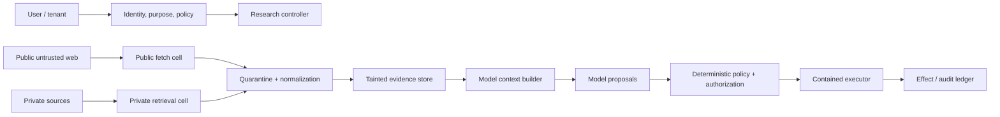
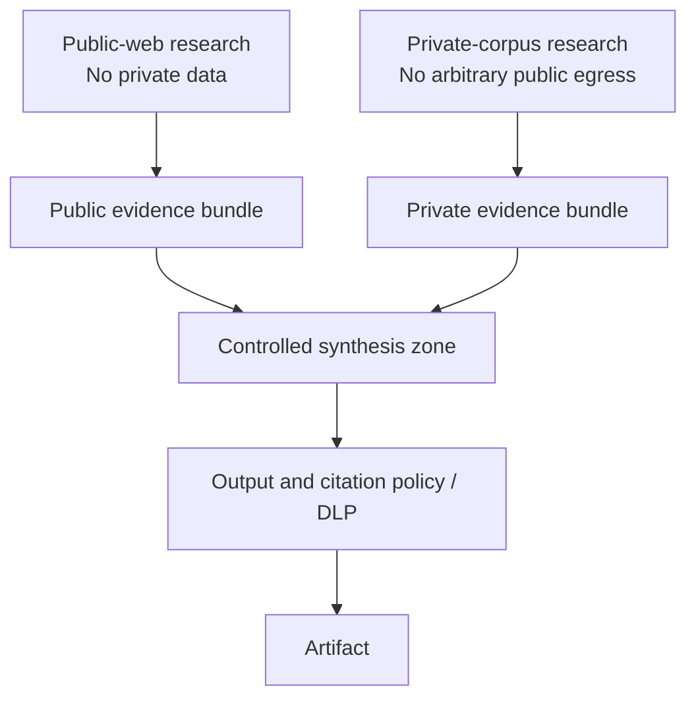

# Security, Permissions, and Isolation

> **Decision:** Assume every retrieved token can be adversarial and every model-proposed action can be wrong. Enforce security in deterministic gateways and containment boundaries.

## Threat-driven architecture



The model never receives raw long-lived credentials and never calls the network directly. A trusted connector can return untrusted content; trust in transport or operator does not make document instructions authoritative.

## Primary attack paths

### Indirect prompt injection

A page, PDF, image, metadata field, search result, or connector response tells the model to ignore instructions, expose data, change scope, call a tool, or manipulate the report. Hidden CSS, white text, alt text, comments, encoded content, and OCR are all input.

Controls:

- label source content as data with provenance and trust zone;
- keep system policy and tool authorization outside source text;
- restrict the controller to typed tools with strict argument schemas;
- separate retrieval from effectful tools;
- use deterministic policy to reject scope changes and sensitive egress;
- inspect model-generated queries/URLs for tainted private data;
- cap redirects, domains, bytes, calls, and tool arguments;
- scan and sandbox complex document parsing;
- test adaptive injections across multiple turns and persisted notes;
- treat detection models as defense in depth, not a guarantee.

### Cross-source exfiltration

The most dangerous research topology gives one model private evidence and arbitrary public-web egress. A malicious public page can instruct it to place private content in a search query, URL path, connector argument, or generated link.

Preferred staged design:



If a combined context is unavoidable, make every outbound sink a policy-enforced effect with information-flow checks. Do not rely on telling the model not to leak.

### SSRF and unsafe browsing

The public fetch gateway must:

- allow only required schemes, normally HTTPS/HTTP;
- reject embedded credentials and unsafe/ambiguous URL forms;
- normalize and parse with a standards-compliant library;
- resolve DNS and block loopback, private, link-local, multicast, broadcast, and cloud metadata ranges;
- validate every address and every redirect hop;
- restrict ports and request methods;
- disable automatic redirects until validated;
- enforce connection/read/total timeouts, byte and decompression limits;
- prevent cookie/auth/header leakage across domains;
- run in a network zone with no internal-service route;
- log the requested URL, normalized URL, redirect chain, and resolved destinations with sensitive-query redaction.

URL blocklists alone are bypass-prone. Network isolation is the backstop.

### Malicious files and parser exploits

PDFs, office documents, archives, images, and media can exploit parsers or exhaust resources. Use disposable, non-privileged containers or stronger sandboxes; scan files; disable macros/scripts; cap pages, pixels, nesting, decompressed size, CPU, memory, and time; patch parser images; and destroy the cell after use.

Never place host credentials or shared writable storage in the parser sandbox. Move accepted output through a narrow content-addressed channel.

### Source and citation attacks

Attackers can create SEO pages, typo-squatted domains, misleading titles, unsafe links, or citations that redirect after verification.

Controls:

- preserve final resolved source identity and capture hash;
- screen rendered destinations and labels;
- show users the true destination domain;
- prevent private/internal storage URLs from rendering;
- do not automatically open artifact links with privileged browser state;
- cluster derivative sources and pursue originals;
- record corrections/retractions and invalidate dependent claims;
- add `rel`/browser isolation appropriate to the renderer.

### Data poisoning and delayed memory attacks

Malicious evidence can influence future runs if summaries or source text enter shared memory. Default to run-scoped evidence. Cross-run promotion requires source provenance, tenant scope, review, trust label, retention, freshness, and deletion policy. Re-apply authorization and taint checks when recalled.

## Permissions model

Use capabilities scoped to one run, branch, source class, action, and expiry.

```json
{
  "capability_id": "cap_01J...",
  "subject": "worker:br_17",
  "tenant": "tenant_7",
  "actions": ["search.public", "fetch.public"],
  "constraints": {
    "domains": ["*.gov", "*.edu", "approved-vendor.example"],
    "max_calls": 20,
    "max_bytes": 50000000,
    "network_zone": "public",
    "private_data": "deny",
    "expires_at": "2026-08-31T13:00:00Z"
  },
  "policy_version": 12
}
```

Authorize again at execution time using canonical identity and current policy. A tool description or prompt cannot grant authority. Credentials are minted or retrieved by a broker after authorization, injected only into the executor, and never returned to the model.

## Tool risk tiers

| Tier | Examples | Default control |
|---|---|---|
| 0: local pure | Hash, normalize text, validate schema | In-process with resource limits |
| 1: public read | Search, safe fetch | Public egress cell, SSRF and content controls |
| 2: private read | Internal search, document retrieval | Least privilege, private zone, audited results |
| 3: compute | Code, OCR, browser rendering | Disposable sandbox, no secrets, restricted network/files |
| 4: durable effect | Publish, send, write shared memory, export | Exact effect preview, policy, idempotency, approval where required |
| 5: high-impact | Release regulated advice, expose sensitive synthesis | Domain expert approval and postcondition/audit checks |

Most research workers need only tiers 0–1. Synthesis should not inherit fetch credentials. Verifiers should be read-only. Publication should be a separate, tightly scoped activity.

## Approval semantics

Approval is useful for legible, consequential choices: accessing a sensitive corpus, widening scope, exceeding a large budget, or publishing externally. Bind approval to:

- exact run, brief revision, artifact hash, destination, audience, and effect;
- evidence/verification revision;
- identity and policy decision;
- expiry and single-use nonce.

Approval does not replace isolation or authorization. Revalidate immediately before commit; if the artifact, evidence, policy, or destination changes, approval is stale.

## Retention, telemetry, and privacy

Classify separately:

- raw fetched objects;
- normalized text and OCR;
- evidence excerpts;
- queries and browsing history;
- model inputs/outputs and hidden provider retention;
- internal-source IDs and access metadata;
- artifacts and manifests;
- operational traces and evaluation samples.

Apply tenant isolation, encryption, region, retention, deletion, legal hold, and access logging by class. Avoid full content in traces by default. OpenTelemetry baggage can propagate to unintended downstream systems; never place credentials, raw private facts, or sensitive query text in it.

Provider background modes may retain data or conflict with zero-data-retention requirements. Check current provider terms and documented behavior before enabling them.

## Source protection and rights enforcement

Protect sources from both disclosure and misuse. A citation-safe public source, a licensed document, an internal item, a confidential human source, and a warehouse row require different controls even when their extracted text looks identical.

| Source concern | Control at acquisition | Control in context and artifact | Control after change/deletion |
|---|---|---|---|
| Public web rights/robots | Declared user agent; robots decision; terms/license/access record; rate governor | Minimal quotation; no false license inference; safe verified destination | Revalidate changed rights and live status |
| Licensed/paywalled content | Approved account/connector; contract-scoped capture and excerpt limit | Never expose raw storage URL or credentials; enforce audience/redistribution restrictions | Contract termination fences reuse and triggers governed erasure/review |
| Enterprise document | Delegated or least-privilege application access; item ID, tenant, region, ACL receipt | Private zone; authorization-filtered retrieval; no public egress | Permission/delta event removes from future context and propagates to artifacts |
| Database/warehouse | Approved views/columns, read-only principal, query/row/byte/time limits | Treat every string field as untrusted; aggregate/minimize sensitive rows; record snapshot/job | Apply row/subject deletion and source-table corrections through result lineage |
| Scholarly paper/dataset | Per-record/file license, version, integrity/retraction status, access class | Distinguish metadata license from abstract/full-text/data license | Correction, retraction, deaccession, and deleted-record feeds invalidate descendants |
| Confidential human source | Outside the default deep-research workflow | Never place identity or raw material in ordinary connectors/models | Route to a specialized source-protection/editorial workflow |

Rights policy is enforced twice: before capture and before release. The second check matters because license, access, user authorization, and intended audience can change during a long run. Store opaque source IDs in logs; keep sensitive titles, queries, URLs, ACLs, and content in access-controlled evidence storage.

Provider terms can prohibit retaining discovery results even when source pages are public. The [connector qualification manifest](connectors-and-provider-qualification.md) therefore declares retention/redistribution/training rights separately for provider results and acquired source representations.

## Supply chain

Pin and scan:

- model and connector SDKs;
- browser and headless automation images;
- HTML/PDF/OCR/document parsers;
- native binaries, codecs, and font libraries;
- workflow and telemetry dependencies;
- prompt/tool bundles and policy packages;
- container base images and build provenance.

Treat remote MCP/tool servers as third-party code/data processors. Audit operator, authentication, tool definitions, data requested, retention, egress, and change process. Tool annotations and descriptions are untrusted metadata unless the server and version are approved.

## Incident response

Prepare run- and source-level containment:

1. disable a connector, domain, parser, model route, or policy version;
2. cancel scheduling and fence publication while allowing evidence preservation;
3. rotate credentials and revoke capabilities;
4. find affected runs/claims/artifacts by lineage;
5. quarantine evidence and invalidate or supersede released artifacts;
6. preserve governed forensic records;
7. notify owners/reviewers according to impact;
8. convert the incident into adversarial and regression tests.

An artifact invalidation mechanism is essential. Research conclusions can become unsafe after a source correction or discovered injection even if no code changed.

## Security failure-injection scenarios

| Scenario | Expected invariant |
|---|---|
| Hidden page says to upload private context | No private data reaches any outbound argument; event is blocked/audited |
| Search result URL redirects to `169.254.169.254` | Fetch denied before connection |
| Allowed domain resolves to private IP on second lookup | Fetch denied; DNS/rebinding evidence retained |
| Connector returns malicious tool instructions | Treated as content; no authority change |
| PDF expands to 20 GB | Sandbox terminated; run continues with rejected-source record |
| Model encodes a secret into search terms | Taint/DLP gate blocks call |
| Worker tries publication tool | Authorization denies capability |
| Citation link changes destination after verification | Publication uses verified target record or flags freshness change |
| Poisoned evidence is promoted to shared memory | Promotion denied without explicit governed review |
| Approval is replayed after artifact revision | Commit rejected as stale |

## Security readiness checklist

- [ ] Public web, private data, analysis compute, and publication are separate trust zones.
- [ ] Model outputs and connector content are untrusted proposals/data.
- [ ] Network access passes through an SSRF-hardened gateway.
- [ ] Complex parsing and code run in disposable contained cells.
- [ ] Capabilities are short-lived, least-privilege, and commit-time authorized.
- [ ] Credentials never enter model context or parser sandboxes.
- [ ] Private evidence cannot reach arbitrary public egress.
- [ ] Citation destinations and labels are screened.
- [ ] Retention and provider background-mode semantics meet policy.
- [ ] Rights, robots, licensing, source access, and release-audience checks are enforced per representation, not inferred from a provider name.
- [ ] Source correction, permission loss, contract termination, and deletion fence every derived memory/artifact by lineage.
- [ ] Incidents can invalidate evidence, claims, and released artifacts by lineage.

## Strong sources and related local guidance

- [OpenAI Deep Research safety guidance](https://developers.openai.com/api/docs/guides/deep-research)
- [OpenAI Deep Research System Card](https://cdn.openai.com/deep-research-system-card.pdf)
- [NIST AI RMF Generative AI Profile](https://www.nist.gov/publications/artificial-intelligence-risk-management-framework-generative-artificial-intelligence)
- [OWASP SSRF Prevention Cheat Sheet](https://cheatsheetseries.owasp.org/cheatsheets/Server_Side_Request_Forgery_Prevention_Cheat_Sheet.html)
- [OWASP LLM06:2025 Excessive Agency](https://genai.owasp.org/llmrisk/llm062025-excessive-agency/)
- [MCP specification security principles](https://modelcontextprotocol.io/specification/2025-03-26/index)
- [OpenTelemetry baggage security considerations](https://opentelemetry.io/docs/concepts/signals/baggage/)
- [Prompt injection and untrusted data](../../security/prompt-injection-and-untrusted-data.md)
- [Permissions, sandboxing, and secrets](../../security/permissions-sandboxing-and-secrets.md)
