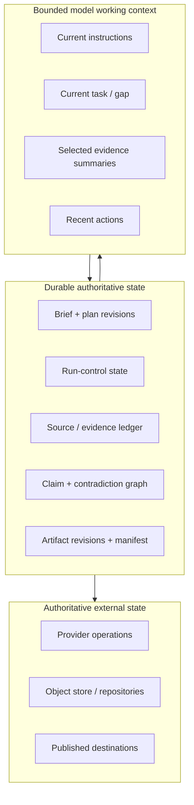
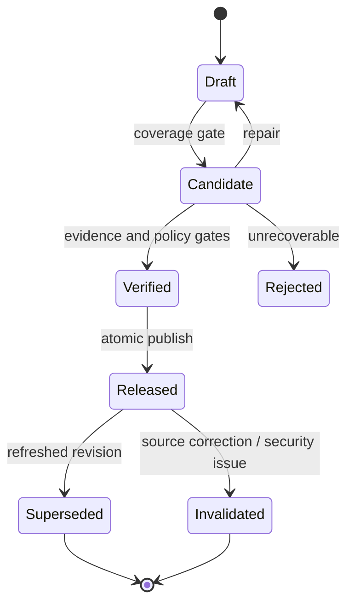

# State, Context, and Artifacts

> **Decision:** Preserve continuity through durable typed state and referenced artifacts; use the model context as a disposable working set.

## Separate the state planes



Keep at least five distinct state classes:

1. **Brief state:** approved intent, constraints, evidence bar, as-of date, output contract.
2. **Research state:** questions, plan versions, branches, queries, gaps, stopping decisions.
3. **Evidence state:** source identities, captured representations, spans, quality and lineage.
4. **Run-control state:** phase, leases, attempts, budgets, deadlines, approvals, cancellation.
5. **Artifact state:** claims, contradictions, draft/release revisions, manifests, reviewer decisions.

Provider conversation IDs, framework checkpoints, and model transcripts are adapters or diagnostic records. They are not substitutes for this domain state.

## Event model

Own a stable application envelope:

```json
{
  "event_id": "evt_01J...",
  "event_type": "evidence.accepted",
  "event_version": 2,
  "occurred_at": "2026-08-31T12:34:56.123Z",
  "run_id": "run_01J...",
  "tenant_id": "tenant_7",
  "actor": {"type": "worker", "id": "worker_3", "version": "1.4.2"},
  "causation_id": "evt_01J_previous",
  "correlation_id": "trace_...",
  "brief_revision": 3,
  "policy_versions": {"source": 7, "security": 12},
  "payload": {"span_id": "ev_01J...", "claim_need_id": "q-water-004"}
}
```

Events explain transitions; current-state tables make reads efficient. Do not make an event log the only persistence mechanism unless the team already operates event-sourced systems well.

Important transitions include:

- `brief.created`, `brief.clarification_requested`, `brief.approved`;
- `plan.created`, `plan.revised`, `branch.admitted`, `branch.cancelled`;
- `query.executed`, `source.discovered`, `representation.captured`;
- `evidence.proposed`, `evidence.accepted`, `evidence.rejected`;
- `claim.proposed`, `claim.verified`, `claim.superseded`;
- `contradiction.opened`, `contradiction.disposed`;
- `budget.threshold_reached`, `run.paused`, `run.resumed`, `run.cancelled`;
- `verification.failed`, `artifact.released`, `artifact.invalidated`.

## Plan continuity

The plan is a versioned artifact with stable question IDs. Models may propose revisions; application code validates them against the brief.

```yaml
plan_revision: 4
parent_revision: 3
change_reason: "Primary study uses consumption, not withdrawal; split metric question."
questions:
  - id: q-water-004a
    parent: q-water-004
    status: open
    dependency_ids: []
    owner: worker-2
  - id: q-water-004b
    parent: q-water-004
    status: blocked
    block_reason: "Facility boundary unavailable"
coverage:
  required_complete: 7
  required_total: 9
```

Never allow compaction to be the only place the plan exists. A compacted summary can be wrong; the next context should load the typed plan plus selected evidence, not trust a narrative handoff.

## Context assembly

Build each model input just in time from the smallest high-signal state needed for the next decision.

| Role | Include | Exclude by default |
|---|---|---|
| Planner | Brief, coverage map, question statuses, source-policy summary, remaining budgets | Full documents, raw prior reasoning |
| Search worker | One question, exclusions, query history summary, accepted source identities, gap definition | Other branches' large evidence sets, private data not required |
| Extractor | Exact representation/chunk, extraction schema, claim need | Global transcript and unrelated sources |
| Synthesizer | Accepted claims, evidence summaries/locators, contradiction dispositions, outline contract | Search snippets, rejected evidence, hidden credentials |
| Verifier | Atomic claim, cited spans, relevant metadata, rubric | Generator reasoning, irrelevant favorable evidence |
| Renderer | Verified intermediate artifact and citation registry | Model tools and research history |

Context selection itself should be observable: record which state IDs and revisions were provided. This enables failure analysis without logging every sensitive token.

## Compaction policy

Compaction reduces working history; it does not create truth. When a context threshold is reached:

1. flush all accepted evidence, plan changes, decisions, budgets, and in-flight operation IDs;
2. create a structured handoff with pointers to authoritative records;
3. verify required fields and unresolved items deterministically;
4. create the next context from current state;
5. retain or govern the original transcript separately according to policy.

```json
{
  "receipt_version": 2,
  "receipt_id": "compact_01K...",
  "run_id": "run_01J...",
  "from_context_id": "ctx_18",
  "to_context_id": "ctx_19",
  "source_event_high_watermark": "evt_01J_last_flushed",
  "version_pins": {"behavior": "deep-research/2026.08.31.3", "policy": 7, "tool_registry": "research-tools/12", "context_compiler": "research-context/5"},
  "authoritative_revisions": {
    "brief": 3,
    "plan": 4,
    "claim_graph": 12,
    "budget": 19,
    "policy": 7
  },
  "current_phase": "gap_review",
  "required_continuity": {
    "open_question_ids": ["q-water-004a", "q-cost-002"],
    "accepted_claim_ids": ["clm_..."],
    "open_contradiction_ids": ["con_..."],
    "in_flight_operation_ids": ["fetch_..."],
    "approval_ids": [],
    "remaining_budgets": {"search_calls": 17, "wall_clock_seconds": 620},
    "next_decision": "Choose repair branch or proceed with limitation"
  },
  "active_clocks": [{"clock_id": "run-deadline", "due_at": "2026-08-31T12:10:20Z", "owner": "research-controller"}],
  "pending_effect_ids": ["export_effect_19"],
  "unknown_effect_ids": [],
  "next_safe_action": "reconcile_export_then_choose_repair_or_limit",
  "loss": {
    "omitted_classes": ["superseded_scratch_notes", "full_tool_payloads"],
    "omitted_object_ids": ["scratch_77"],
    "omitted_item_refs": ["scratch_77", "tool_payloads_by_evidence_id"],
    "reason": "not authoritative; full payloads remain addressable by evidence IDs",
    "estimated_tokens_discarded": 48211,
    "semantic_risk": "low",
    "unresolved_loss": []
  },
  "integrity": {
    "invariant_hash": "sha256:...",
    "from_context_reference_hash": "sha256:...",
    "flushed_state_hash": "sha256:...",
    "to_context_reference_hash": "sha256:...",
    "required_fields_check": "pass",
    "in_flight_reconciliation_check": "pass"
  }
}
```

The receipt is loss-aware because it records both preserved continuity and deliberate omission. Compaction fails closed when required IDs are absent, a decision exists only in scratch text, an in-flight effect lacks an operation ID, a budget/approval revision is stale, or `unresolved_loss` is non-empty. Rehydrate the next context from the receipt's authoritative revisions, recompute its reference hash, and compare it before the next model or tool action.

Evaluate continuity with injected compactions at the worst points: immediately before/after accepting evidence, opening a contradiction, reserving budget, requesting approval, dispatching an external effect, and receiving cancellation. The post-compaction trajectory must preserve outcome-relevant decisions and must not resurrect superseded or poisoned content.

Long-context research shows that available context length is not equal to reliable retrieval/reasoning across that context. Compaction, note-taking, and clean worker contexts are mitigations; they still need evaluation on the chosen models and task distribution.

## Worker handoffs

Workers return structured research artifacts, not only summaries:

```json
{
  "branch_id": "br_17",
  "question_id": "q-water-004a",
  "status": "partial",
  "accepted_evidence_ids": ["ev_1", "ev_2"],
  "proposed_claim_ids": ["clm_7"],
  "rejected_source_ids": ["src_9"],
  "query_result_set_ids": ["qrs_4", "qrs_5"],
  "open_gaps": ["No climate-normalized baseline"],
  "contradiction_ids": ["con_2"],
  "stop_reason": "branch_budget_exhausted"
}
```

The coordinator reads IDs and selected summaries. It should not copy tens of thousands of tokens through a chain of agents. Large outputs go directly to governed artifact/evidence storage with lightweight references.

## Seven memory lifetimes

Research systems need explicit continuity and retention, not one undifferentiated “memory.” Exactly seven application lifetimes are useful; telemetry and provider transcripts remain separate diagnostic records.

| Lifetime | Admitted content | Retrieval | Retention | Correction and deletion | Poisoning controls |
|---|---|---|---|---|---|
| Turn/scratch memory | Current instructions, one decision, selected evidence excerpts, temporary calculations | Compiled just in time by role and question | Destroy after the call or short diagnostic window | Rebuild from authoritative IDs; never patch as truth | No direct promotion; untrusted text labeled and isolated from authority/tool policy |
| Working/run memory | Typed plan progress, query history, open gaps, active contradictions, budgets, rejected routes | Run/branch/question-scoped with current revisions | Until terminal state plus short resume/debug TTL | Append correction/status events; remove fenced source references before next context | Schema admission, provenance required, branch isolation, duplicate/taint checks |
| Session memory | User-approved clarifications and a derived continuity view across related turns | Session ID plus tenant/user authorization; always joined to durable task IDs | Product-defined session TTL | User can inspect/correct; deletion fans out to derived summaries | Never treat a session summary as evidence; resist instructions recalled from source content |
| Durable workflow/task memory | Brief, plan, operations, evidence, claims, contradictions, verification, approvals, artifacts, receipts | Exact run/task IDs, revisions, and access scope | Domain/legal/audit policy; often longer than session | Version, supersede, invalidate, tombstone, redact, or cryptographically erase through lineage | Strict schemas, immutable raw/derived separation, authorization, integrity hashes, reviewer gates |
| Domain knowledge memory | Curated reusable sources, definitions, verified claims, and source-status watches | Domain, tenant, authorization, as-of/freshness, version, and applicability filters | Explicit TTL or event-driven revalidation | Correction/deletion propagates to every derivative and future retrieval; retain minimal lawful tombstone | Human or policy promotion, independence review, source trust/rights labels, quarantine, canary retrieval tests |
| Long-term/preference memory | Minimal consented user or team preferences such as citation style, language, and output format | Only for the owning subject/scope; never used as factual evidence | Until expiry, withdrawal, or account policy | Inspectable/editable; consent withdrawal deletes or disables all replicas | Allowlisted fields, no sensitive inference, no source instructions, no authority/role elevation |
| Episodic/outcome memory | Reviewed outcomes: correction, incident, invalidation, successful/failed pattern, human disposition | Evaluation/mining jobs under controlled access, not ordinary prompts by default | Versioned evaluation-retention policy | Remove affected content/labels on correction or deletion; preserve de-identified incident receipt where lawful | Human review, de-identification, contamination/leak scans, holdout separation, no raw private trajectories |

Admission and retrieval are separate authorizations. Content that was lawful to store is not automatically lawful or useful to retrieve for another run, tenant, model provider, or purpose.

### Promotion receipt

Promotion between lifetimes is an effect. Require:

```json
{
  "promotion_id": "prom_01K...",
  "from": "durable_workflow_task",
  "to": "domain_knowledge",
  "object_ids": ["clm_17", "src_42"],
  "provenance_complete": true,
  "review": {"policy": "domain-promotion-v3", "decision": "allow", "reviewer": "human:role"},
  "scope": {"tenant": "tenant-7", "domain": "cooling", "purpose": "research"},
  "freshness": {"verified_at": "2026-08-31T12:00:00Z", "refresh_rule": "source_event_or_90d"},
  "rights": {"reuse": true, "redistribution": false},
  "deletion_route": "lineage-propagation-v2",
  "poisoning_checks": ["source_status", "independence", "injection_scan"],
  "expires_at": "2026-11-29T12:00:00Z"
}
```

Never automatically promote arbitrary web text, model summaries, search snippets, or unreviewed claims. Retrieval must recheck current access, source status, freshness, purpose, and policy even when the promotion receipt remains valid.

Telemetry is not an eighth memory: it is a sampled/redacted operational signal with separate retention and must not be silently recalled into model context.

## Artifact lifecycle



Each artifact revision should have:

- stable artifact ID and immutable revision ID;
- brief, plan, claim graph, evidence bundle, renderer, and policy revisions;
- `as_of`, created, verified, released, and superseded timestamps;
- verification findings and human approvals;
- a semantic diff from the prior revision;
- explicit status: draft, candidate, verified, released, superseded, invalidated;
- distribution destinations and publication receipts;
- retention/deletion class.

Publish the artifact and its manifest transactionally when possible. If a destination is external, use an idempotency key and store the destination receipt before marking released.

## Resume and reconciliation

On resume:

1. acquire a run lease with fencing token;
2. load pinned controller/policy/schema versions or run a tested migration;
3. reconcile in-flight provider, fetch, worker, and publication operations by operation ID;
4. validate state invariants and hashes;
5. expire stale approvals and recheck authorization;
6. rebuild the next context from authoritative state;
7. continue within the original deadline/budget unless an authorized extension exists.

Do not replay a provider request merely because the response was not recorded. Query the provider by operation ID when supported; otherwise use a safe idempotency/deduplication strategy or classify the result as unknown.

## Schema evolution

- Add version fields to every durable contract.
- Prefer additive schema changes; keep tolerant readers and strict writers.
- Store prompt/tool/policy versions referenced by past runs.
- Test workflow replay against representative histories before deployment.
- Use side-by-side or rainbow versions so old jobs finish under compatible code.
- Do not reinterpret old evidence with a new parser without creating a new derived representation and verification revision.
- Make invalidation propagation explicit when a source or claim changes.

## State integrity checklist

- [ ] Context, transcript, checkpoint, evidence, run control, and artifact state are separate.
- [ ] The plan and coverage map survive model/context replacement.
- [ ] Every context can be reconstructed from durable IDs and revisions.
- [ ] Compaction flushes state before discarding history.
- [ ] Every compaction emits and verifies a loss-aware continuity receipt with no unresolved required-state loss.
- [ ] Worker handoffs reference ledgered evidence instead of only prose summaries.
- [ ] All seven memory lifetimes have admission, retrieval, retention, correction/deletion, and poisoning policies.
- [ ] Cross-lifetime promotion is a governed, reviewable effect with a deletion route.
- [ ] Resume reconciles unknown operations before retry.
- [ ] Artifact revision/status and invalidation are explicit.
- [ ] Schema and workflow-history compatibility are tested before release.

## Strong sources and related local guidance

- [Anthropic: Effective context engineering](https://www.anthropic.com/engineering/effective-context-engineering-for-ai-agents)
- [Anthropic: Multi-agent research system](https://www.anthropic.com/engineering/multi-agent-research-system)
- [Lost in the Middle](https://aclanthology.org/2024.tacl-1.9/)
- [W3C PROV-O](https://www.w3.org/TR/prov-o/)
- [Temporal Workflow Execution](https://docs.temporal.io/workflow-execution)
- [Agent state and event contracts](../../runtime/agent-state-and-event-contracts.md)
- [Tool results, artifacts, and provenance](../../tools/tool-results-artifacts-and-provenance.md)
