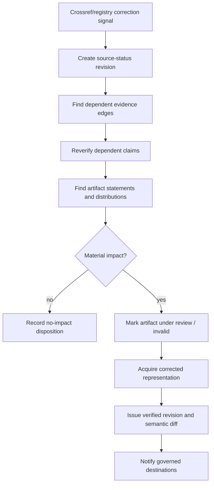

# Worked Cases, Exercises, and Runbooks

> **Purpose:** Turn the architecture into a build sequence that a team can rehearse from first request through production recovery.

## Learning path from zero to production

Do the stages in order. Each gate prevents a polished demo from outrunning its evidence and operational controls.

| Stage | Build and learn | Exercise | Exit gate |
|---|---|---|---|
| 1. One frozen case | Brief, plan, source identity, immutable representation, span, claim, citation, artifact | Reproduce the cooling example below from local fixtures with no live tools | A reviewer can traverse every material sentence to exact evidence |
| 2. One public connector | Search discovery plus hardened HTTP/PDF acquisition | Inject duplicate results, a redirect, stale metadata, `429`, and a malformed PDF | Snippets never become evidence; failures are typed and bounded |
| 3. Verification | Atomic claims, support/refute edges, contradiction sets, exact quotes, coverage | Change one number and one qualifier in the draft | Both mutations block release deterministically or semantically |
| 4. Durable run | Queue/workflow, attempt ledger, leases, budgets, cancellation, reconciliation | Kill the controller after fetch and after publication acknowledgement loss | No accepted evidence is lost; no duplicate publication occurs |
| 5. Private source | Staged public/private research, delegated access, ACL receipt, deletion path | Revoke one document during the run | The document leaves future context and publication is re-authorized |
| 6. Operations | Traces, metrics, audit, SLOs, backpressure, regional/tenant routing, DR | Run the recovery-load scenario below at the provider quota ceiling | RTO/RPO, quota, and tenant-isolation assertions pass |
| 7. Controlled evolution | Full behavior bundles, frozen/live/adversarial evals, shadow/canary/rollback | Ship a parser/model change that improves prose but loses one citation | Release gate rejects or rollback restores the complete prior bundle |

## Case 1: Public-web technology decision

### Public decision brief

```yaml
question: "For a hot-climate 5 MW data center, which cooling approaches have measured evidence of reducing annual water consumption without an unacceptable energy penalty?"
decision: "Select two technologies for engineering diligence"
as_of: 2026-08-31
required_dimensions:
  - water_consumption_not_only_withdrawal
  - facility_boundary
  - measured_not_only_modeled
  - climate_and_load
  - energy_tradeoff
source_policy:
  required: [original_measurement_or_dataset, methodology]
  contextual_only: [vendor_marketing, derivative_news]
budgets: {search_calls: 45, fetched_documents: 70, wall_clock_minutes: 20}
```

### Plan revision 1

| Question ID | Evidence need | Disconfirming search | Completion rule |
|---|---|---|---|
| `q-def-01` | Definitions of withdrawal, consumption, and facility boundary | Sources using the terms inconsistently | One authoritative definition set plus mapped aliases |
| `q-imm-01` | Measured immersion result with baseline and method | Energy or heat-rejection penalty; modeled-only claims | One original measurement fit for scope or explicit insufficiency |
| `q-air-01` | Hot-climate dry/air-cooled outcome | Seasonal performance and water shifted upstream | Same evidence bar as immersion |
| `q-evap-01` | Evaporative outcome and energy trade-off | Consumption/withdrawal mismatch | Same evidence bar plus definition alignment |
| `q-compare-01` | Comparable normalized metrics | Facility/load/climate incompatibility | All mandatory dimensions filled or marked non-comparable |

The planner may propose two parallel technology branches because their discovery work is independent. It must reject a separate “find sources” worker because it overlaps every branch and has no exclusive evidence partition.

### Concrete trajectory

```text
query q-imm-01/1
  -> qrs_01KQ... (10 hits, 3 duplicate-origin clusters)
  -> hit_01KQ7 maps to src_doi_10_1234_example
fetch src_doi_10_1234_example
  -> rep_01KQA (publisher PDF, sha256:7a..., 18 pages)
parse rep_01KQA with pdf-parser@4.2.1
  -> drep_01KQB (text layer, sha256:91...)
extract page 7 table 2 row 4
  -> ev_01KQC ("annual water consumption ...", locator and exact hash)
propose quantitative claim
  -> clm_01KQD
verify support/applicability
  -> ver_01KQE: partial_support; facility boundary excludes heat rejection
open gap q-imm-01a
  -> search/fetch methodology appendix
  -> clm_01KQD becomes accepted_with_limitations at revision 2
```

Exact normalized tool result returned to the controller:

```json
{
  "operation_id": "op_fetch_01KQA",
  "status": "succeeded",
  "source_id": "src_doi_10_1234_example",
  "representation": {
    "representation_id": "rep_01KQA",
    "retrieved_from": "https://publisher.example/article.pdf",
    "final_url": "https://publisher.example/article.pdf",
    "captured_at": "2026-08-31T11:11:04Z",
    "media_type": "application/pdf",
    "bytes": 1844912,
    "content_hash": "sha256:7a...",
    "validators": {"etag": "\"abc\"", "last_modified": "2026-04-18T09:00:00Z"},
    "rights": {"access": "open", "license": "CC-BY-4.0", "quote_limit_policy": "minimal"},
    "storage_ref": "object://tenant-7/raw/7a..."
  },
  "capture": {"complete": true, "truncated": false, "redirects": []},
  "cost": {"fetch_bytes": 1844912, "wall_ms": 744}
}
```

### Coverage checkpoint

```yaml
required_needs: 15
satisfied: 11
limited: 2
open_material: 2
recent_actions:
  window: 8
  new_fit_evidence: 1
  duplicate_or_rejected: 7
contradictions:
  open_material: 1
remaining: {search_calls: 9, wall_clock_seconds: 310}
decision: continue_targeted
reason: "One definition conflict and one missing hot-climate baseline could change the shortlist."
```

After the two targeted attempts, the branch must stop if neither returns new fit evidence and the best remaining route is access-blocked. The artifact can still complete with the affected comparison marked non-comparable.

### Released evidence package

```text
artifact-bundle/art_01KQ/rev_3/
├── artifact.md
├── artifact-ir.json
├── manifest.yaml
├── brief/rev_2.yaml
├── plan/rev_4.yaml
├── methods/query-ledger.ndjson
├── methods/source-dispositions.ndjson
├── graph/sources.jsonl
├── graph/representations.jsonl
├── graph/evidence-spans.jsonl
├── graph/claims-and-edges.jsonl
├── graph/contradictions.jsonl
├── verification/findings.jsonl
├── verification/release-gate.json
├── receipts/tool-operations.jsonl
├── receipts/rights-and-access.jsonl
├── receipts/continuity.jsonl
└── checksums.sha256
```

Raw captured files may remain in governed object storage rather than the distributable bundle. `manifest.yaml` records their content hashes, access class, and reproducibility limitation.

### Public-source independence exercise

Replace the primary study with three articles copied from one press release. The system should create three source identities but one independence group and should fail the original-measurement requirement.

**Pass:** the report says primary evidence was not located and does not turn repeated coverage into corroboration.

## Case 2: Public plus enterprise research

### Enterprise incident brief

The user asks: “Using approved internal postmortems and public vendor documentation, identify which documented platform limits contributed to our last three incidents.” This remains a general deep-research workflow. Incident response ownership, enterprise-wide knowledge ingestion, and vendor competitive monitoring stay outside this blueprint.

### Safe topology

```mermaid
sequenceDiagram
    participant C as Controller
    participant W as Public zone
    participant P as Private zone
    participant S as Controlled synthesis
    C->>W: Search public docs with no incident data
    W-->>C: Public evidence IDs
    C->>P: Retrieve approved postmortems; no public egress
    P-->>C: Private claim/evidence IDs + ACL receipts
    C->>S: Selected public/private IDs, no credentials
    S-->>C: Candidate cross-source claims
    C->>P: Recheck ACL and subject authorization
    C->>C: DLP, citation, and release policy
```

Private connector result:

```json
{
  "operation_id": "op_graph_01KR",
  "status": "succeeded",
  "source_id": "msgraph:drive:drv_7:item:item_42",
  "representation_id": "rep_01KR",
  "provider_version": {"e_tag": "\"{A1},7\"", "c_tag": "c:{A1},5"},
  "access_receipt": {
    "principal_class": "delegated_user",
    "tenant_id": "tenant-7",
    "permission_scope": "Files.Read.All",
    "checked_at": "2026-08-31T12:01:00Z",
    "acl_hash": "sha256:44...",
    "region": "IND"
  },
  "capture": {"media_type": "application/pdf", "content_hash": "sha256:55..."},
  "deletion_watch": {"type": "drive_delta", "cursor_ref": "secret://delta/tenant-7/drive-7"}
}
```

The delta token is an opaque secret-like capability. Keep it out of model context, logs, artifacts, and user-visible manifests.

### Permission-revocation drill

1. Capture the postmortem under delegated access.
2. Revoke the user's access before synthesis completes.
3. Deliver the permission/delta event.
4. Fence the source from future contexts.
5. Mark dependent candidate claims `authorization_pending`.
6. Recheck whether already-derived facts may remain under policy; default to no publication until reviewed.
7. Record cryptographic erasure or retained audit-only metadata according to deletion/retention policy.

**Pass:** no private content appears in public search arguments, the revoked document is absent from the released artifact, and the audit trail explains the transition without retaining forbidden content.

## Case 3: Correction after publication

### Initial state

`art_01KS/rev_2` contains claim `clm_rate_7`, supported by paper representation `rep_paper_v1` and dataset file `rep_data_v3`. Both are material.

### Trigger and propagation



Propagation receipt:

```json
{
  "propagation_id": "prop_01KS",
  "trigger": {"type": "source.corrected", "source_id": "doi:10.1234/example", "status_revision": 4},
  "affected": {
    "representations": ["rep_paper_v1"],
    "evidence_edges": ["edge_17", "edge_22"],
    "claims": ["clm_rate_7"],
    "artifacts": ["art_01KS/rev_2"],
    "destinations": ["portal:decision-memos"]
  },
  "actions": [
    {"type": "claim.reverify", "status": "completed", "result": "unsupported"},
    {"type": "artifact.invalidate", "status": "completed"},
    {"type": "destination.replace", "status": "completed", "receipt": "pub_91"}
  ],
  "opened_at": "2026-09-14T08:03:00Z",
  "closed_at": "2026-09-14T08:19:22Z",
  "complete": true
}
```

### Correction replay exercise

Inject a source deletion while the correction processor is down, then restore it after the event-retention window begins draining.

**Pass:** replay is idempotent, the watermark proves no event gap, every affected artifact reaches a terminal disposition, and the correction SLO is measured from source-event observation rather than worker restart.

## Decision exercises

### Exercise: choose the acquisition route

For each source, choose static fetch, browser, structured API, licensed connector, archive, or `inaccessible`:

| Situation | Correct default | Why |
|---|---|---|
| Public HTML with stable content | Static fetch | Best capture fidelity/cost with validators |
| JavaScript table visible only after a user-selected filter | Structured endpoint if authorized, otherwise isolated browser | Preserve exact filter/action and rendered representation |
| Paywalled paper with no licensed account | Metadata plus `inaccessible` | Do not bypass access |
| Internal Drive file | Delegated enterprise connector | Preserve item identity and ACL semantics |
| Deleted public page needed for historical comparison | Approved archive | Pin archive capture and disclose coverage/rights limits |
| Warehouse metric | Read-only governed query | Capture snapshot/job/query/result semantics |

### Exercise: single or multiple researchers

Score a proposed branch from 0–2 on independence, expected evidence yield, distinct source space, latency saved, merge cost, and privilege expansion. Admit parallel work only when:

```text
independence + evidence_yield + distinct_source_space + latency_saved
  > merge_cost + privilege_expansion + configured_margin
```

Hard reject when branches share the same mandatory source/definition dependency, duplicate a query portfolio, require copying private evidence across zones, lack exclusive question IDs, or cannot return a typed partial result.

### Exercise: stop or continue

Given the following checkpoint, choose one action:

```yaml
required_coverage: 0.93
open_material_gaps: 0
open_optional_gaps: 2
material_contradictions: 0
last_10_actions: {fit_evidence: 0, duplicates: 8, rejected: 2}
estimated_next_step_cost_usd: 0.32
remaining_cost_usd: 0.70
```

The correct default is **stop and verify**. Optional gaps plus zero recent yield do not justify more acquisition.

## Operator runbook cards

### Provider search degradation

**Trigger:** high `429`/5xx, rising zero-yield ratio, or ranking-drift canary failure.

1. Fence new calls on the affected adapter version.
2. Reduce admission and concurrency before retrying.
3. Preserve partial result sets and remaining deadlines.
4. Switch only to a pre-qualified semantically compatible provider; record route change.
5. Return a provider-coverage limitation when no qualified route exists.
6. Re-run frozen and live canaries before restoring capacity.

### Source correction or access deletion

**Trigger:** correction/retraction feed, content hash change, delta tombstone, ACL loss, or rights change.

1. Persist the source-status event and provider cursor/watermark.
2. Stop new retrieval/context inclusion.
3. Traverse representation → evidence edge → claim → statement → artifact → destination.
4. Apply retention/deletion policy; never leave derived summaries outside the traversal.
5. Reverify or invalidate by materiality.
6. Publish a replacement/diff where permitted and reconcile every destination receipt.
7. Close only when all descendants have a terminal disposition.

### Evidence-store regional failover

**Trigger:** regional database/object-store unavailability exceeds failover threshold.

1. Stop admission for tenants whose policy disallows failover region.
2. Fence writers and record the last durable event/outbox/object watermark.
3. Promote only a tested policy-compatible replica.
4. Reconcile missing objects, outbox events, provider jobs, and publication effects before scheduling research.
5. Run integrity hashes and tenant/region assertions.
6. Resume gradually under recovery concurrency limits.
7. Measure RPO/RTO and add the actual failure to the recovery suite.

### Behavior-bundle rollback

**Trigger:** citation, coverage, security, cost, latency, or drift guardrail breached by a canary.

1. Stop new admissions to the bundle; do not mutate its contents.
2. Route new work to the last accepted complete bundle.
3. Let compatible in-flight work finish or migrate only through a tested transition.
4. Re-run affected frozen evidence bundles through old/new verifiers.
5. Quarantine unpublished candidates and identify released artifacts by lineage.
6. Roll back prompts, model routes, adapters, parsers, policies, verifier, and renderer as one declared unit where attribution is not proven.

## Production graduation checklist

- [ ] One frozen case can be rebuilt from its evidence package.
- [ ] One live public connector and one private connector pass qualification.
- [ ] All seven memory lifetimes pass correction, deletion, and poisoning tests.
- [ ] Search saturation and multi-worker routing make deterministic, logged decisions.
- [ ] Correction/deletion propagation reaches every artifact and destination.
- [ ] Crash, ambiguous effect, cancellation, and recovery-load drills pass.
- [ ] Shadow/canary/rollback operates on complete behavior bundles.
- [ ] A reviewer can run every operator card without reading model transcripts.
