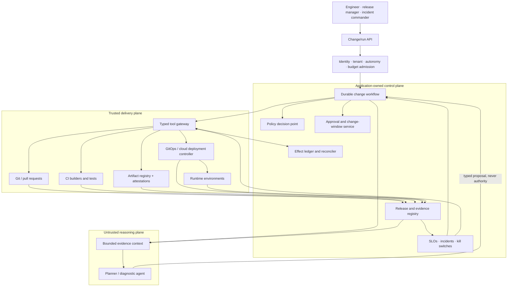
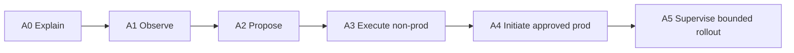

# DevOps and Deployment Agent

> **Status:** Research-backed production blueprint  
> **Last researched:** 2026-08-31  
> **Scope:** Designing an agent that observes delivery systems, prepares evidence-bound changes, coordinates governed promotion, and supervises bounded deployment and recovery.  
> **Evidence:** [DevOps and deployment agent research packet](../../research/packets/devops-deployment-agent-blueprint.md)

A production deployment agent is a **bounded change controller**. It turns delivery intent into a typed proposal, collects authoritative evidence, obtains deterministic policy decisions and any required human approval, commits only the approved operation, and verifies the real outcome.

It is not a chatbot with shell access, a replacement for CI/CD, or a model allowed to infer production authority from a ticket or conversation.

## Use this guide set to decide

| Decision | Guide |
|---|---|
| What the agent should and should not do; which autonomy level fits | [Mission, workloads, and autonomy](mission-workloads-and-autonomy.md) |
| Push CI/CD, GitOps, or hybrid; custom loop, framework, or durable workflow | [Reference architecture and build choices](reference-architecture-and-build-choices.md) |
| How to bind a plan, policy decision, approval, and change ticket | [Plans, policy, approvals, and change control](plans-policy-approvals-and-change-control.md) |
| How to build once, verify provenance, and promote the same digest | [Artifacts, provenance, and promotion](artifacts-provenance-and-promotion.md) |
| How to canary, blue/green, pause, cancel, roll back, or reconcile | [Progressive delivery, rollback, and recovery](progressive-delivery-rollback-and-recovery.md) |
| How to expose Git, CI, registry, Kubernetes, cloud, IaC, ticket, and incident tools | [Tool adapters and deployment evidence](tool-adapters-and-deployment-evidence.md) |
| How to constrain credentials, tenants, environments, and supply-chain trust | [Security, credentials, and tenant isolation](security-credentials-and-tenant-isolation.md) |
| How to compile context, choose memory classes, compact safely, and evolve behavior | [Context compilation, memory, and behavior evolution](context-compilation-memory-and-behavior-evolution.md) |
| How to persist runs, instrument them, evaluate behavior, scale, and control cost | [Durability, observability, evaluation, and cost](durability-observability-evaluation-and-cost.md) |
| How to stage implementation and prove readiness with failure injection | [Implementation roadmap and production tests](implementation-roadmap-and-production-tests.md) |

## Ownership boundary

This blueprint owns **software-release change control**: assembling release evidence, proposing and authorizing promotion, invoking the selected delivery path, supervising rollout, and reconciling the observed deployment outcome.

| Neighboring agent | It owns | This deployment agent owns | Required handoff |
|---|---|---|---|
| [Coding agent](../coding-agent/README.md) | Product-code edits, local validation, patch/PR provenance, merge candidate | Release eligibility, artifact promotion, environment plan, rollout, and recovery | Reviewed source revision, build request/evidence, and declared compatibility—not production authority |
| [Infrastructure operations agent](../infrastructure-operations-agent/README.md) | Cloud/Kubernetes resource lifecycle, host operations, IAM/network/storage maintenance, infrastructure remediation | Application/config release through an already approved target; exact application-owned IaC promotion only when that module is explicitly delegated | Sealed IaC or infrastructure-operation plan; deployment pauses until infrastructure outcome is authoritative |
| [SRE incident-response agent](../sre-incident-response-agent/README.md) | Alert intake, incident command support, diagnosis, mitigation coordination, communications, postmortem | Deployment timeline, release freeze, rollout status, and incident-delegated release recovery | Incident ID, commander/delegate, affected scope, exact recovery authority, expiry, and handback |
| [MLOps/model operations agent](../mlops-model-operations-agent/README.md) | Model/prompt/evaluator release identity, champion/candidate gates, drift and delayed-label quality, serving traffic policy | Ordinary serving-image/config delivery when MLOps has already authorized the model release | Immutable model-release manifest and rollout contract; DevOps must not select the champion or redefine quality gates |

If one change crosses boundaries, compose separately authorized workflows. Do not give this agent the union of coding, infrastructure, SRE, and MLOps credentials.

## Production position

The recommended default is a hybrid architecture:

- an agent framework or small custom loop handles model messages, structured tool calls, and explanations;
- application-owned services hold run state, policy, approvals, release manifests, effect identity, and evidence;
- a durable workflow runtime coordinates long waits, retries, cancellation, and recovery when the workload requires it;
- CI builds and tests immutable artifacts;
- GitOps or a provider deployment controller owns environment reconciliation and rollout mechanics;
- admission and policy systems independently enforce what may run;
- short-lived workload credentials are brokered only to trusted adapters;
- deterministic analysis gates advance, pause, or recover a rollout.



The diagram shows responsibility, not a required service count. A small team can run several logical components in one application and database. Preserve the contracts before distributing the system.

## Non-negotiable guarantees

| Guarantee | Owning mechanism | Why the model cannot own it |
|---|---|---|
| Principal, tenant, and environment identity | Authenticated admission and server-side context | Prompt text is untrusted and spoofable |
| Allowed actions and targets | Versioned policy plus scoped capability | Model output is probabilistic, not authorization |
| Exact reviewed change | Plan/release digest and commit-time comparison | A regenerated proposal can differ after approval |
| Artifact identity and origin | Digest, signature, provenance, verifier policy | Tags move and prose can invent provenance |
| One semantic operation | Effect ID, downstream idempotency, reconciliation | Retries and recovery can duplicate writes |
| Durable pause and resume | Workflow state and authenticated resume event | A conversation or process can disappear |
| Deployment completion | Provider/controller status plus postcondition checks | Request acceptance or log text is not completion |
| Rollout advancement | Deterministic metric and exposure gates | Threshold behavior must be stable and auditable |
| Cancellation outcome | Cancel request plus authoritative reconciliation | Stopping a worker does not stop the remote effect |
| Separation of duties | Repository/environment roles and independent identities | The agent cannot approve its own proposal safely |
| Incident override | Incident command state and external kill switches | Containment must work if the agent is faulty |

## The change contract

Every production-capable run should resolve one immutable contract before commit:

```yaml
change:
  id: chg_01K...
  proposal_version: 4
  source:
    repository: scm://platform/payments
    revision: 9fd52b8...
    rendered_config_digest: sha256:6a7c...
  release:
    manifest_id: rel_2026_08_31_042
    artifacts:
      - name: registry.example/payments
        digest: sha256:91df...
    provenance_predicate: https://slsa.dev/provenance/v1
  target:
    environment_id: env_prod_in_west
    observed_revision: rv_884102
  plan:
    kind: kubernetes-server-dry-run
    digest: sha256:0c12...
    risk: high
  policy:
    bundle_digest: sha256:aa4e...
    decision_id: pol_018...
  approval:
    id: apr_01K...
    expires_at: 2026-08-31T17:30:00Z
  rollout:
    strategy: canary
    template: payments-prod-v7
    rollback_release: rel_2026_08_22_031
```

The commit path rejects any mismatch. The model can generate a draft, but trusted code resolves logical IDs, canonicalizes data, hashes the contract, and checks current state.

## Default effect path

```mermaid
sequenceDiagram
    participant A as Agent
    participant W as Change workflow
    participant P as Policy / approval
    participant G as Tool gateway
    participant D as Delivery controller
    participant E as Evidence store

    A->>W: Typed proposal with evidence references
    W->>P: Canonical plan, subject, target, risk
    P-->>W: Bound decision or approval requirement
    W->>G: Commit exact change + effect ID + grant
    G->>E: Record intended and dispatched
    G->>D: Start operation with idempotency/deployment ID
    alt explicit provider response
        D-->>G: Accepted operation ID
        G->>D: Read status and postconditions
        D-->>G: Authoritative outcome
        G->>E: Verified outcome and rollout evidence
    else timeout or disconnect
        G->>E: Mark outcome unknown
        G->>D: Reconcile by operation ID
        D-->>G: Running, committed, absent, or still unknown
        G->>E: Update; never blind-retry a possible commit
    end
    E-->>W: Terminal or waiting state
```

## CI/CD, GitOps, and direct APIs

| Path | Best fit | Agent writes | Production credential owner |
|---|---|---|---|
| CI/CD push | Provider operations, legacy systems, tests and builds | Pipeline inputs or dispatch request | Protected deploy job/controller |
| GitOps pull | Declarative Kubernetes and infrastructure desired state | Pull request or protected desired-state commit | In-environment reconciler |
| Direct API | Queries, pause/abort, incident containment, operations with no declarative representation | Typed operation through gateway | Scoped adapter identity |
| Hybrid | Most production systems | Git for desired state; APIs for control and evidence | Separate identities per operation class |

There must be one authoritative writer for each kind of state. If Git is authoritative for a workload, routine direct cluster patches create competing writers and should be denied. Incident overrides need an explicit suspension and handback protocol.

## Autonomy ceiling

The practical maturity goal is not unlimited autonomy. It is the highest **bounded** level justified by evidence:



Start at A1/A2. Advance per workload and effect class only after the production tests in this guide show that policy, approval, cancellation, idempotency, rollback, incident override, and tenant isolation survive failure.

## Simplest adoption path

Do not add a model when deterministic delivery already solves the decision:

~~~text
fixed structured predicates + fixed rollout
    -> conventional CI/CD, policy, approval, and controller
heterogeneous evidence + repeated human synthesis
    -> read-only A1 evidence view
useful, grounded recommendations
    -> A2 advisory MVP and draft PR/change
proven durable effects in non-production
    -> reliable v1 with one typed adapter
service-specific production safety case
    -> bounded A4/A5 production
measured tenancy and load pressure
    -> isolated cells, quotas, and resilient scale
~~~

Keep the deterministic path as the execution fallback. The [implementation roadmap](implementation-roadmap-and-production-tests.md) defines the exit gate for each increment; higher autonomy is optional.

## Anti-patterns

- One shell tool with cloud, Git, registry, and cluster credentials.
- A “confirm?” chat message used as production approval.
- Rebuilding the artifact for each environment.
- Deploying a tag without resolving and verifying its digest.
- Letting the model parse raw terminal text to decide whether a deploy succeeded.
- Retrying a timed-out apply or rollout without reconciling provider state.
- Having the same identity propose, approve, deploy, and verify.
- Treating a green readiness probe as proof of application success.
- Automatic rollback that ignores schemas, queues, data, or external effects.
- Writing only success logs and losing plans, denied policy decisions, and ambiguous outcomes.
- Sharing one cross-tenant credential, queue, workspace, or trace store.
- Putting the kill switch behind the model or the same queue it must stop.

## Minimal advisory slice

The smallest defensible first agent release is read/propose only; it is intentionally not production-capable:

1. one repository and one non-production environment;
2. read-only Git, CI, registry, and runtime adapters;
3. an application-owned run record and evidence references;
4. a typed proposal with a deterministic rendered diff or plan;
5. pull-request creation under a bot identity with no merge permission;
6. evaluation against historical deployment scenarios;
7. complete tracing, redaction, budgets, and a kill switch.

Do not start by wiring a general shell to production. Add non-production commit only after the proposal path is reliable; add production initiation only after external approval, digest promotion, and recovery are proven.

## Canonical repository links

- [Production agent control plane](../../architectures/production-agent-control-plane.md)
- [Durable execution](../../runtime/durable-execution.md)
- [Run controls](../../runtime/run-controls.md)
- [Execution boundaries](../../runtime/execution-boundaries.md)
- [Idempotency and side effects](../../reliability/idempotency-and-side-effects.md)
- [Permissions, sandboxing, and secrets](../../security/permissions-sandboxing-and-secrets.md)
- [Tool contracts](../../tools/tool-contracts.md)
- [Tool results, artifacts, and provenance](../../tools/tool-results-artifacts-and-provenance.md)
- [Deployment, release, and incident response](../../operations/deployment-release-and-incident-response.md)
- [Observability and tracing](../../evaluation/observability-and-tracing.md)

## Readiness snapshot

- [ ] The system can explain which identity, subject, target, plan, policy, and approval authorize every effect.
- [ ] Production credentials never enter the prompt, sandbox, checkpoint, or general trace.
- [ ] Builds produce immutable digests and verifiable provenance; promotion does not rebuild.
- [ ] Plans are sensitive immutable artifacts and are revalidated at commit.
- [ ] Deployment state includes `unknown`, `cancel_requested`, `paused`, and recovery states.
- [ ] Rollout thresholds and missing-data behavior are deterministic and versioned.
- [ ] Incident command can independently freeze or constrain the agent.
- [ ] Every supported adapter has documented idempotency, cancellation, and reconciliation semantics.
- [ ] Tenant and environment scope are enforced at every storage, queue, tool, and credential boundary.
- [ ] Context manifests and compaction preserve authority, cancellation, unknown effects, freshness, and source provenance.
- [ ] Every memory class has an explicit enabled/disabled decision and no free-form episode can become a production procedure.
- [ ] Offline, shadow, canary, and failure-injection evidence supports the configured autonomy level.
