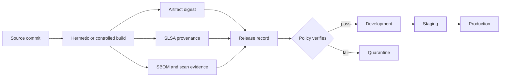
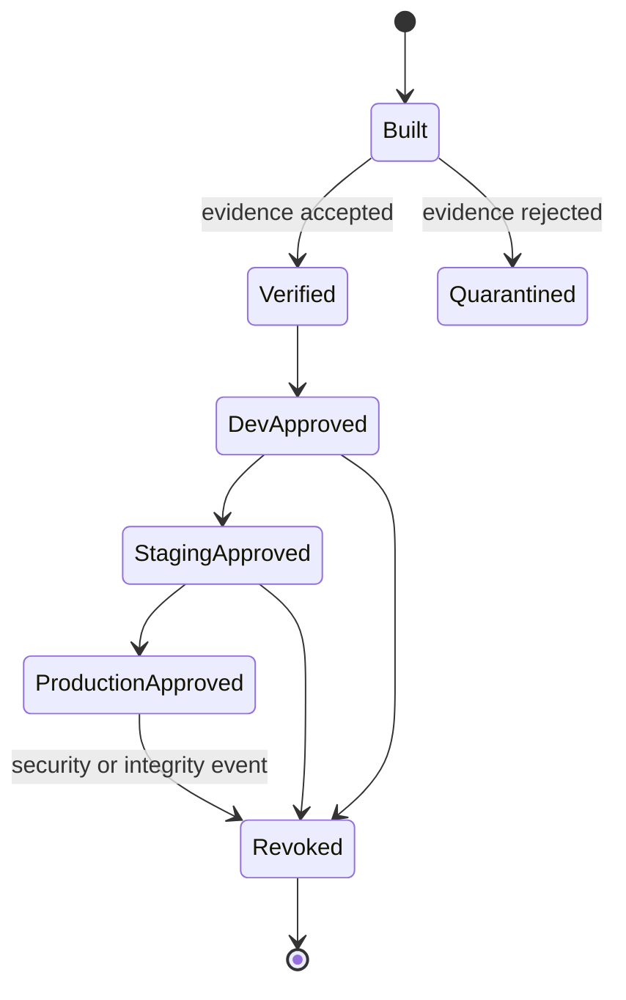

# Artifacts, Provenance, and Promotion

> **Status:** Production design guide  
> **Research date:** 2026-08-31  
> **Scope:** Release identity, attestations, registry controls, and environment promotion

## Decision

Build an immutable release once, identify it by digest, attach verifiable evidence, and promote that same identity through environments. A deployment agent may assemble and verify a release record, but it must not silently rebuild, retag, or substitute artifacts during promotion.

This guide uses these terms precisely:

- **Artifact:** deployable content such as an OCI image, Helm chart, function bundle, or signed manifest.
- **Digest:** content-derived immutable identity. A mutable tag is only a locator.
- **Attestation:** a signed statement about an artifact, such as build provenance or an SBOM predicate.
- **Provenance:** evidence describing how an artifact was produced.
- **Release record:** the agent's normalized, append-only bundle of identities and evidence.
- **Promotion:** authorization of an existing release for another environment, not another build.

## Release identity chain



The release record, rather than an image tag or pipeline run URL, is the stable promotion subject.

## Canonical release record

Store a normalized record in durable state and, where feasible, sign it. Keep large evidence in immutable object storage and refer to it by digest.

```yaml
apiVersion: delivery.example.io/v1
kind: Release
metadata:
  id: rel_01J...
  service: checkout-api
spec:
  source:
    repository: https://github.com/example/checkout
    commit: 91f42e0b...
    treeDigest: sha256:13ad...
  artifacts:
    - mediaType: application/vnd.oci.image.manifest.v1+json
      repository: registry.example.com/checkout
      digest: sha256:6bf4...
      displayTag: 2026.08.31.1       # informational only
      platforms: [linux/amd64, linux/arm64]
  evidence:
    provenance:
      predicateType: https://slsa.dev/provenance/v1
      statementDigest: sha256:93d1...
      uri: oci://registry.example.com/checkout@sha256:7e21...
    sbom:
      format: spdx-json
      digest: sha256:9a25...
    vulnerabilityScan:
      scanner: scanner-a@4.2.1
      databaseVersion: 2026-08-31T02:00:00Z
      completedAt: 2026-08-31T02:14:07Z
      digest: sha256:20c9...
  builder:
    identity: https://token.actions.githubusercontent.com#repo:example/checkout:...
    workflowRef: .github/workflows/release.yml@91f42e0b...
  policySnapshot:
    bundleDigest: sha256:310e...
  createdAt: 2026-08-31T02:15:00Z
```

Required invariants:

1. Every deployable artifact has an immutable digest.
2. The source revision and builder identity are explicit.
3. Evidence objects have their own digests; URLs alone are insufficient.
4. Scanner version, vulnerability database version, and completion time are retained.
5. The record is append-only. A new artifact or predicate creates a new release version.

## Standards and mechanisms

| Concern | Recommended primitive | What it proves | What it does not prove |
|---|---|---|---|
| Build provenance | [SLSA provenance v1](https://slsa.dev/provenance/v1) in an [in-toto Statement v1](https://github.com/in-toto/attestation/blob/v1.2.0/spec/v1/statement.md) | Declared subject, builder, build type, materials, and invocation metadata | That the artifact is safe or authorized for production |
| Envelope | [DSSE](https://github.com/secure-systems-lab/dsse/blob/master/protocol.md) | Signature binds an unambiguous payload type and bytes | That the signer should be trusted |
| Registry attachment | [OCI Distribution 1.1.1 referrers](https://github.com/opencontainers/distribution-spec/blob/v1.1.1/spec.md) | Discoverable relationships between a subject manifest and artifacts | Universal registry retention or policy behavior |
| Keyless signing | [Sigstore Cosign](https://docs.sigstore.dev/cosign/signing/signing_with_blobs/) | Signature associated with an ephemeral certificate and transparency evidence | Authorization unless issuer, identity, and claims are verified |
| Admission enforcement | [Sigstore policy-controller](https://docs.sigstore.dev/policy-controller/overview/) or [Kyverno image verification](https://kyverno.io/docs/policy-types/cluster-policy/verify-images/) | Workload matches configured verification policy | Completeness of upstream build controls |
| Build assurance | [SLSA Build track](https://slsa.dev/spec/v1.2/levels) | Increasing guarantees about provenance and build isolation | Deployment correctness, runtime security, or absence of vulnerabilities |

Treat evidence types as complementary. A signature authenticates bytes and identity; provenance records production context; an SBOM inventories components; a vulnerability scan is a time-bounded analysis.

As of the research date, the [in-toto Attestation Framework release is 1.2](https://github.com/in-toto/attestation/releases/tag/v1.2.0), while the Statement schema identifier remains v1. Do not confuse the framework release with the Statement or predicate version. OCI Distribution 1.1.1 is the stable baseline used here; its referrers fallback behavior still requires registry-specific conformance and retention tests.

## Verification policy

Verification must be deterministic and run again at commit time. The model may explain a failure, but cannot reinterpret a failed predicate as a pass.

```yaml
releasePolicy:
  allowedRegistries:
    - registry.example.com
  requireDigestReference: true
  provenance:
    predicateType: https://slsa.dev/provenance/v1
    trustedBuilders:
      - issuer: https://token.actions.githubusercontent.com
        subjectPattern: repo:example/*:ref:refs/heads/main
    minimumSlsaBuildLevel: 2
  sbom:
    requiredFormats: [spdx-json, cyclonedx-json]
    maxAge: 30d
  vulnerabilities:
    maxScanAge: 24h
    deny:
      - severity: critical
        exploitability: known_exploited
  signatures:
    transparencyLogRequired: true
  exceptions:
    requireTicket: true
    maximumTtl: 24h
    approverGroup: product-security
```

Order verification to fail cheaply:

1. Parse and schema-validate the release record.
2. Resolve the digest and verify registry/repository allowlists.
3. Retrieve evidence by immutable identity with strict size/time limits.
4. Verify envelope signatures and certificate claims.
5. Verify that every statement subject matches every promoted digest.
6. Evaluate builder, source, dependency, SBOM, and vulnerability policy.
7. Persist the exact verification inputs, outputs, policy digest, and verifier version.

### Fail closed, with explicit availability policy

| Condition | Default production decision | Safe operator option |
|---|---|---|
| Signature invalid or subject mismatch | Deny | Rebuild or correct the release record |
| Transparency service temporarily unavailable | Deny new promotion | Pre-authorized cached inclusion evidence with bounded age |
| SBOM missing | Deny | Time-bounded, ticketed exception if policy permits |
| Vulnerability database stale | Deny or require security approval | Refresh scan without rebuilding the artifact |
| Registry cannot return digest | Unknown; do not deploy | Retry and reconcile |
| Verifier version changes | Reverify | Keep old result for audit, never silently replace it |

## Build once, promote by digest



Promotion changes authorization and environment configuration, never artifact bytes. Environment differences belong in independently reviewed configuration, secret references, feature flags, or deployment parameters.

| Pattern | Decision |
|---|---|
| Copy the same digest between trust-separated registries | Acceptable when copy verification proves source and destination bytes match |
| Retag a digest for human discovery | Acceptable only if deployment still pins the digest |
| Rebuild for each environment | Reject; destroys evidence continuity and makes environments incomparable |
| Mutate an image during security scanning | Reject; the resulting digest is a new artifact and release |
| Patch production manifests directly | Reject except controlled break-glass; reconcile the canonical source afterward |

## Promotion transaction

Promotion should be a compare-and-swap operation over an environment pointer or desired-state revision.

```json
{
  "operation": "promote",
  "releaseId": "rel_01J...",
  "target": "checkout/prod-eu",
  "expectedCurrentRelease": "rel_01H...",
  "expectedConfigDigest": "sha256:17c0...",
  "approvalSetDigest": "sha256:a180...",
  "policyDecisionDigest": "sha256:7132...",
  "idempotencyKey": "chg_01J...:commit:1"
}
```

The adapter must reject a stale expected release or configuration digest. It must return `already_applied` when the idempotency key and result match, and `conflict` when the key was reused with different inputs.

## Registry and repository controls

- Enable tag immutability where the registry supports it; it reduces accidental overwrite but does not replace digest pinning.
- Separate build-write, promotion-read/copy, and runtime-pull identities.
- Deny artifact deletion during the evidence and rollback retention window.
- Replicate both the subject and its referrer evidence; validate registry-specific behavior before relying on referrers.
- Restrict cross-repository mounts and destination namespaces by tenant.
- Keep quarantine, candidate, and released namespaces distinct when operationally useful.
- Record garbage-collection configuration and prove that referenced evidence survives it.

## CI examples and cautions

GitHub Actions can create [artifact attestations](https://docs.github.com/en/actions/security-for-github-actions/using-artifact-attestations/about-artifact-attestations) and use [OIDC](https://docs.github.com/en/actions/concepts/security/openid-connect) instead of long-lived cloud keys. Workflow actions must be pinned to full commit SHAs for strong supply-chain control, as GitHub's [secure-use guidance](https://docs.github.com/en/actions/how-tos/security-for-github-actions/security-guides/security-hardening-for-github-actions) recommends.

```yaml
permissions:
  contents: read
  id-token: write
  attestations: write
  packages: write

steps:
  - uses: actions/checkout@<full-commit-sha>
  - name: Build and push by immutable digest
    run: ./approved-build-wrapper
  - name: Generate provenance attestation
    uses: actions/attest-build-provenance@<full-commit-sha>
    with:
      subject-name: registry.example.com/checkout
      subject-digest: ${{ steps.build.outputs.digest }}
      push-to-registry: true
```

The wrapper remains responsible for hermeticity, material capture, multi-platform identity, and returning a trustworthy digest. An attestation action does not retroactively make an uncontrolled build trustworthy.

### Known implementation traps

- Docker BuildKit's default minimal provenance is not equivalent to every field expected from full SLSA provenance; configure and verify the actual predicate rather than assuming defaults.
- Tekton Chains has historically accepted multiple provenance-format names. Verify the installed version and emitted predicate type, not a configuration alias.
- Some registries emulate referrers with fallback tags. Test retention, replication, authorization, and garbage collection end to end.
- Multi-architecture indexes and their platform manifests have different digests. Policy must state whether evidence covers the index, children, or both.
- A signature on a tag lookup does not freeze future tag resolution. Verify and deploy the digest subject.

## Revocation and re-evaluation

New vulnerability intelligence or compromised builder identity can invalidate an otherwise unchanged release.

1. Mark the release `revoked` with reason, actor, time, and evidence.
2. Block future promotions and new rollouts immediately.
3. Find currently deployed environments from evidence lineage.
4. Open an incident or remediation workflow according to severity.
5. Decide whether to stop, roll back, rebuild, or accept a bounded risk.
6. Preserve the original decision and the later revocation; do not rewrite history.

Re-scanning an immutable artifact creates new evidence attached to the same artifact. A rebuilt artifact, even from identical source, is a new release identity.

## Acceptance criteria

- A release cannot be promoted using only a mutable tag.
- Subject digest mismatch is rejected before any environment mutation.
- The same release digest is observed in build, staging, and production evidence.
- Verification results include policy, verifier, evidence, and trust-root versions.
- Attestation framework, Statement, predicate, envelope, verifier, and registry baseline versions are recorded separately.
- Artifact and attestation replication survives registry garbage collection tests.
- Stale scans, unavailable verification services, and revoked signers follow explicit policies.
- A tenant credential cannot read or copy another tenant's release artifacts.
- Revocation can enumerate affected deployments within the incident SLO.

## Related guides

- [Plans, policy, approvals, and change control](plans-policy-approvals-and-change-control.md)
- [Progressive delivery, rollback, and recovery](progressive-delivery-rollback-and-recovery.md)
- [Tool adapters and deployment evidence](tool-adapters-and-deployment-evidence.md)
- [Security, credentials, and tenant isolation](security-credentials-and-tenant-isolation.md)
- [Tool results, artifacts, and provenance](../../tools/tool-results-artifacts-and-provenance.md)
