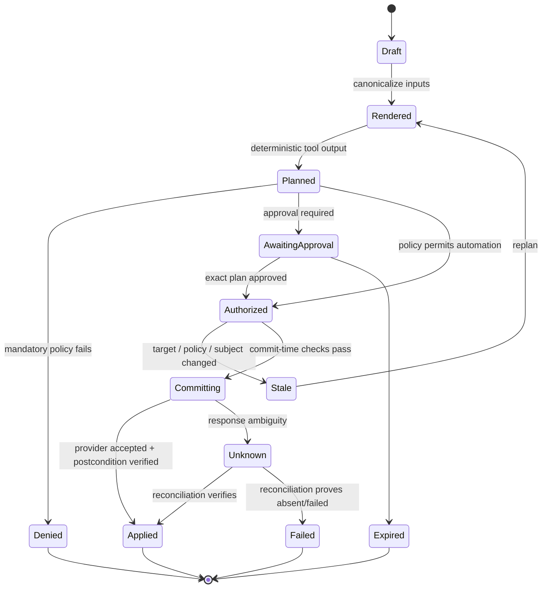
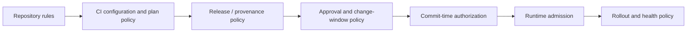

# Plans, Policy, Approvals, and Change Control

> **Status:** Production control guide  
> **Last researched:** 2026-08-31  
> **Decision:** Bind review and authorization to an immutable machine plan, then revalidate current state at commit.  
> **Evidence:** [Research packet](../../research/packets/devops-deployment-agent-blueprint.md)

## The approval integrity problem

An unsafe workflow often looks superficially governed:

1. the agent describes a change;
2. a person clicks approve;
3. the agent regenerates arguments or reruns a plan;
4. the target changed, the artifact tag moved, or the new plan includes more effects;
5. a privileged tool commits the new operation under the old approval.

The fix is not a longer confirmation message. Approval must bind to the exact semantic operation.

## Plan lifecycle



`Planned`, `Authorized`, and `Applied` are different facts. Do not collapse them into “approved” or “success.”

## Canonical change envelope

Trusted code should build a canonical representation before policy or review:

```json
{
  "schema_version": "deployment-change/v1",
  "change_id": "chg_01K5W...",
  "proposal_version": 3,
  "actor": {
    "principal_id": "usr_1042",
    "tenant_id": "ten_acme"
  },
  "source": {
    "repository_id": "repo_payments",
    "commit": "9fd52b8b...",
    "rendered_digest": "sha256:6a7c..."
  },
  "release": {
    "manifest_id": "rel_2026_08_31_042",
    "artifact_digests": ["sha256:91df..."]
  },
  "target": {
    "environment_id": "env_prod_in_west",
    "base_revision": "rv_884102"
  },
  "effects": [
    {
      "operation": "deploy_existing_release",
      "resource": "service/payments",
      "strategy": "canary-template/payments-v7"
    }
  ],
  "plan": {
    "kind": "kubernetes-server-dry-run",
    "tool_version": "record-at-runtime",
    "artifact_ref": "evidence://plans/pln_01K...",
    "digest": "sha256:0c12..."
  },
  "risk": {
    "class": "R3",
    "max_exposure_percent": 25,
    "reversible": "traffic_only"
  }
}
```

Canonicalization rules must be versioned. Sort unordered collections, normalize resource identifiers, include defaults that affect behavior, exclude display-only text, and hash the serialized bytes. Do not ask the model to reproduce the digest.

## Plan types and their limits

| Target | Plan mechanism | Strong evidence | Not proven |
|---|---|---|---|
| Git change | Base/head diff plus rendered output | Exact versioned source change | Runtime convergence |
| Kubernetes | Server-side dry-run, diff, schema/admission, field ownership | API validation and predicted object | Controller/application health |
| Terraform/OpenTofu | Saved binary plan plus normalized JSON summary | Provider-planned graph against observed state | Apply success or values unknown until apply |
| Azure ARM/Bicep | What-if response | Predicted create/update/delete | Resources beyond limits; runtime success |
| Cloud deployer | Provider preview/release configuration | Target/strategy validation | Traffic and application outcome |
| Database migration | Schema diff, compatibility and dry-run where supported | Expected DDL/data operations | Production duration, locks, and data-dependent behavior |
| Feature flag | Current/desired value, cohort diff | Exact exposure rule | Application semantics and stale clients |

### Sensitive plan handling

[Terraform](https://developer.hashicorp.com/terraform/cli/commands/plan) and [OpenTofu](https://opentofu.org/docs/cli/commands/plan/) explicitly warn that saved plans can contain sensitive values in cleartext. Apply the same conservative policy to all plans:

- store in a restricted artifact store, never Git;
- encrypt with target/tenant-specific access control;
- redact the human view without altering the machine artifact;
- log only digest, size, classification, and reference;
- expire speculative plans after a short policy-defined window;
- delete or retain according to evidence policy, including derived indexes;
- do not pass the full plan to the model if a bounded semantic summary is enough.

## Semantic risk extraction

Raw diffs are not sufficient for approval. Derive stable facts:

```yaml
semantic_summary:
  creates: 2
  updates: 4
  deletes: 0
  replacements: 0
  privileged_identity_changes: 0
  public_network_changes: 0
  persistent_storage_changes: 0
  schema_changes: 0
  image_digest_changes: 1
  replica_delta: 2
  regions_affected: [in-west]
  estimated_blast_radius: one_service_one_region
  unknown_values: []
  policy_data_complete: true
```

Use target-specific parsers. Do not let the model infer destructive effects from colorized terminal output as the only control.

## Policy layers



| Layer | Typical rules |
|---|---|
| Repository | Protected branches, required checks, code owners, signed changes, no direct push |
| CI | Tests, static analysis, dependency policy, plan risk, forbidden resource types |
| Release | Builder identity, source repository/revision, signature, provenance, SBOM, scan freshness |
| Approval | Risk tier, independent role, maintenance window, ticket, recovery readiness |
| Commit-time | Exact plan/subject/target match, current base revision, grant and approval validity |
| Admission | Namespace, workload security, resource limits, image digest and attestations |
| Rollout | Absolute SLO floors, control comparison, sample, exposure, missing-data behavior |

Defense in depth is valuable when layers use independent evidence. Repeating the same brittle check in six places increases operational burden without creating independence.

## Policy decision contract

Return a machine decision, not only a string:

```json
{
  "decision_id": "pol_01K...",
  "policy_bundle_digest": "sha256:aa4e...",
  "input_digest": "sha256:0c12...",
  "decision": "require_approval",
  "approval_rules": [
    {"role": "service_owner", "count": 1},
    {"role": "production_operator", "count": 1}
  ],
  "constraints": {
    "not_before": "2026-08-31T16:00:00Z",
    "expires_at": "2026-08-31T18:00:00Z",
    "max_canary_percent": 25,
    "allowed_actions": ["start", "pause", "abort", "traffic_revert"]
  },
  "denials": [],
  "warnings": ["first release after database client upgrade"]
}
```

Persist the evaluated input digest and policy bundle digest. A later policy change can deliberately invalidate or grandfather pending decisions according to organization policy.

## Policy-as-code example

This simplified Rego illustrates the boundary; production policy needs organization-specific schemas and tests:

```rego
package deploy.authorization

default decision := {"allow": false, "reason": "no matching rule"}

decision := {"allow": true, "approval": "none"} if {
  input.target.tier == "development"
  input.risk.class in {"R0", "R1", "R2"}
  input.plan.deletes == 0
  input.release.provenance_verified
}

decision := {"allow": true, "approval": "independent-production"} if {
  input.target.tier == "production"
  input.risk.class == "R3"
  input.effect.operation == "deploy_existing_release"
  input.plan.deletes == 0
  input.plan.replacements == 0
  input.release.provenance_verified
  input.release.scan_within_policy
  input.recovery.verified
  not input.incident.active
}
```

Missing fields should fail closed for protected effects. Policy tests must cover undefined values, not just happy-path booleans.

## Approval design

### Exact approval record

```yaml
approval:
  id: apr_01K...
  change_id: chg_01K...
  proposal_version: 3
  plan_digest: sha256:0c12...
  release_manifest_digest: sha256:4d33...
  target_environment_id: env_prod_in_west
  rollout_contract_digest: sha256:821a...
  policy_decision_id: pol_01K...
  decision: approved
  approver:
    principal_id: usr_884
    asserted_roles: [production_operator]
  decided_at: 2026-08-31T16:12:44Z
  expires_at: 2026-08-31T18:00:00Z
  comment: "Canary limited to 25%; abort on missing payment success metric."
```

The comment can narrow authority but should not expand beyond policy. Convert machine-enforceable restrictions into structured constraints.

### Approval-set contract

Multiple buttons or comments do not prove independent approval. Build one canonical set and validate identity conflicts at commit:

~~~yaml
schemaVersion: approval-set/v1
approvalSetId: aps_01K...
subjectDigest: sha256:9f70...
planDigest: sha256:0c12...
releaseManifestDigest: sha256:4d33...
targetEnvironmentId: env_prod_in_west
rolloutContractDigest: sha256:821a...
policyDecisionId: pol_01K...
requirements:
  - requirementId: service-risk
    eligibleRole: service_owner
    count: 1
  - requirementId: production-operation
    eligibleRole: production_operator
    count: 1
independence:
  distinctPrincipalsAcrossRequirements: true
  denyRequester: false
  denySourceAuthors: true
  denyProposalWorkload: true
  denyPolicyBundleAuthors: true
decisions:
  - approvalId: apr_01K_a
    requirementId: service-risk
    principalId: usr_884
    identityProvider: corp-idp
    roleSnapshotVersion: groups-21991
    decision: approved
    decidedAt: 2026-08-31T16:12:44Z
    expiresAt: 2026-08-31T18:00:00Z
setDigest: sha256:a180...
~~~

`subjectDigest` hashes the complete canonical change envelope, not only the plan. `setDigest` hashes the normalized approval-set fields and decisions while excluding `setDigest` itself.

At approval time and commit time:

1. resolve the authenticated principal rather than trusting callback fields;
2. verify current role eligibility and the role snapshot used for audit;
3. compare requester, source authors/mergers, proposal identity, policy authors, builders, approvers, and deploy identity against the independence rules;
4. count a principal once even if it belongs to several eligible groups;
5. reject expired, revoked, duplicate, replayed, or conflicting decisions;
6. recompute the approval-set digest after every new decision.

Administrative bypass is a separate break-glass event, never an implicit member of the normal approval set.

### Separation of duties

At minimum, prevent one principal or equivalent automation identity from controlling all of:

- source/desired-state change;
- policy or workflow definition;
- build/provenance production;
- release approval;
- production deploy;
- outcome verification and evidence deletion.

Example role matrix:

| Role | Propose | Merge desired state | Approve production | Deploy | Change policy | Delete evidence |
|---|---:|---:|---:|---:|---:|---:|
| Agent proposal bot | Yes | No | No | No | No | No |
| Service developer | Yes | Policy-limited | No self-approval | No direct | No | No |
| Code owner | Review | Yes | Service approval only | No direct | No | No |
| Production operator | Read | No | Operational approval | Via controller | No | No |
| Security/platform policy owner | Read | Policy repo only | High-risk approval | No routine | Yes with review | No |
| Evidence custodian | Read | No | No | No | No | Retention-policy only |

Administrative roles can often bypass normal gates. Monitor and restrict them rather than pretending the product UI makes bypass impossible.

### Approval fatigue controls

- auto-authorize only a narrow, measured low-risk class;
- show semantic effects and changed risk, not thousands of raw lines;
- group related read-only evidence but never batch unrelated effects into one approval;
- expire decisions and invalidate them on material change;
- measure approval latency, rejection, edits, rubber-stamp time, and post-approval incidents;
- make rejection and evidence requests first-class, not failure paths;
- rotate approvers and ensure sufficient eligible staff.

## Change tickets

A ticket is context and workflow state, not automatically authorization.

The adapter should retrieve:

- immutable ticket ID and tenant/project;
- change type and risk;
- requested window and affected services;
- linked incidents/problems/releases;
- approver decisions from the authoritative system;
- current status and version/update sequence;
- implementation, validation, and recovery plans.

The change workflow should write back:

- release manifest and artifact digests;
- plan and policy decision references;
- deployment/rollout ID and environment;
- current status and timestamps;
- validation and recovery evidence;
- incident link if impact occurs.

Do not paste secrets, full sensitive plans, or unbounded logs into tickets. Store controlled evidence and link it.

### Ticket race conditions

Re-read the ticket at commit. Reject if:

- status changed or it was cancelled;
- the window expired;
- approval was revoked;
- affected service/target differs;
- update sequence moved in a way policy considers material;
- an incident or freeze now blocks the change.

When the ticket API accepts updates asynchronously, use a caller-supplied update identity and confirm ingestion if the record is part of the audit requirement.

## Commit-time revalidation

The trusted commit function should perform this order:

1. authenticate the calling workflow, not model-supplied identity;
2. load the canonical change and latest approval by immutable ID;
3. re-resolve repository revision, artifact digest, target, and current base revision;
4. verify plan and release hashes;
5. re-evaluate policy or validate the decision's allowed reuse semantics;
6. verify approval eligibility, independence, scope, constraints, and expiry;
7. check change window, active incident, freeze, quota, and rollout capacity;
8. atomically reserve an effect ID and environment concurrency slot;
9. obtain a short-lived target credential;
10. dispatch exactly the approved operation;
11. persist provider operation ID before acknowledging progress;
12. reconcile and verify postconditions.

Any mismatch returns `stale`, not a model-fixable transient error. Replan and request a new approval.

## Concurrent deployments

Serialize semantic writers per target boundary. A lock key might be:

```text
tenant_id / environment_id / application_id / change_domain
```

Use a durable lease with fencing/version checks, not a process mutex. Define whether newer work queues, supersedes, cancels, or is rejected. Never allow two plans based on the same base revision to commit silently.

GitLab's `resource_group` is one provider-specific serialization mechanism; other systems require environment locks, workflow concurrency, or controller-native queues. Record the actual owner.

## Failure matrix

| Failure | Required state | Safe response |
|---|---|---|
| Plan tool times out before result | `plan_failed` | Retry within budget; no effect occurred if tool contract guarantees read-only |
| Plan artifact upload succeeds but response is lost | `plan_store_unknown` | Query by content digest before uploading again |
| Policy service unavailable | `policy_unavailable` | Fail protected writes closed; preserve proposal |
| Approval callback duplicated | Same approval ID | Deduplicate; reject conflicting second decision |
| Approval arrives after expiry | `approval_expired` | Preserve audit; do not authorize |
| Target revision changed | `stale` | Replan and reapprove |
| Environment lock lost | `commit_blocked` | Do not dispatch without current fencing token |
| Provider accepts then gateway crashes | `effect_unknown` | Reconcile by provider/effect ID |
| Ticket writeback fails after deploy | Deployment outcome unchanged | Retry idempotent evidence update; do not redeploy |
| Policy changed during rollout | Version policy decides | Usually continue pinned rollout gates; block new effects until re-evaluated |

## Verification checklist

- [ ] Machine and human plan views derive from the same canonical input.
- [ ] Plans are hashed, versioned, access-controlled, and treated as sensitive.
- [ ] Unknown/computed values have explicit policy behavior.
- [ ] Policy inputs and bundles are digest-linked to decisions.
- [ ] Approval binds exact subject, target, plan, policy, and expiry.
- [ ] Self-approval and admin bypass risks are explicitly configured and monitored.
- [ ] Approval sets count distinct authenticated principals and enforce author/proposer/policy/deployer conflicts.
- [ ] Ticket state is re-read and is not confused with authorization.
- [ ] Commit-time checks use fresh authoritative state.
- [ ] Target concurrency uses durable fencing.
- [ ] A lost provider response leads to reconciliation, not blind retry.

## Related guides

- [Artifacts, provenance, and promotion](artifacts-provenance-and-promotion.md)
- [Progressive delivery, rollback, and recovery](progressive-delivery-rollback-and-recovery.md)
- [Idempotency and side effects](../../reliability/idempotency-and-side-effects.md)
- [Tool contracts](../../tools/tool-contracts.md)
- [Permissions, sandboxing, and secrets](../../security/permissions-sandboxing-and-secrets.md)
