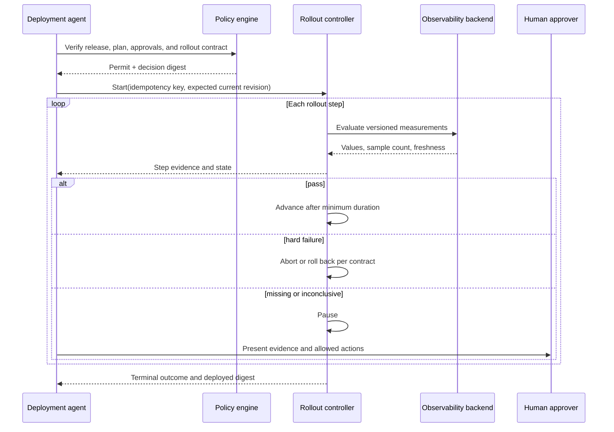
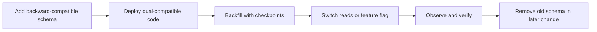
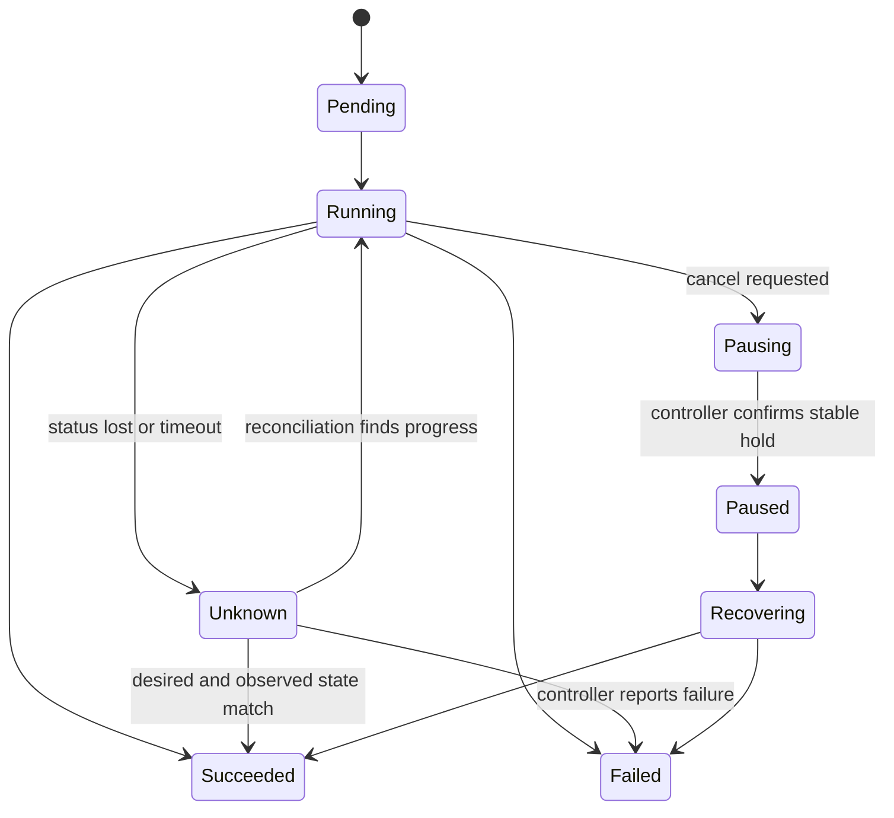

# Progressive Delivery, Rollback, and Recovery

> **Status:** Production rollout guide  
> **Research date:** 2026-08-31  
> **Scope:** Deployment strategies, automated analysis, cancellation, rollback, and recovery

## Decision

Let a deployment controller execute the rollout and let deterministic policy decide whether measured gates pass. The agent proposes a strategy, starts a bounded operation, monitors evidence, and explains outcomes. It must not improvise success criteria while production is changing.

Progressive delivery reduces blast radius; it does not prove safety. A small canary can still corrupt shared data, overload a dependency, or expose every user to a schema change.

## Strategy selection

| Strategy | Best fit | Primary benefit | Important cost or failure mode |
|---|---|---|---|
| Rolling update | Stateless, compatible changes with trusted health checks | Simple and resource efficient | Mixed versions coexist; weak comparative evidence |
| Canary | Changes whose risk can be sampled by traffic, cohort, or region | Limits initial exposure and supports control comparison | Biased traffic, noisy metrics, and shared-state effects |
| Blue-green | Fast traffic switch and enough duplicate capacity | Clear active/preview boundary and quick switchback | Double capacity, database compatibility, warm-up, connection draining |
| Ring/region waves | Fleet or multi-region systems | Contains correlated failures by failure domain | Long rollout and configuration drift between rings |
| Feature flag | User-facing behavior separable from artifact rollout | Decouples code deployment from exposure | Flag debt, inconsistent evaluation, and non-code changes remain risky |
| Recreate | Development or workloads that cannot run mixed versions | Straightforward consistency | Intentional downtime |

Choose based on failure isolation, observability, state compatibility, capacity, traffic representativeness, and recovery—not on the strategy name.

## Rollout contract

The contract is generated during planning, approved with the change, and immutable during commit except through a new approved revision.

```yaml
apiVersion: delivery.example.io/v1
kind: RolloutContract
metadata:
  changeId: chg_01J...
  digest: sha256:8b0a...
spec:
  target: checkout/prod-eu
  release: rel_01J...
  strategy:
    type: canary
    steps:
      - weight: 1
        minimumDuration: 10m
      - weight: 10
        minimumDuration: 20m
      - weight: 50
        minimumDuration: 30m
      - weight: 100
  analysis:
    baseline: stable-revision
    queries:
      - id: request-success
        source: prometheus-prod-eu
        queryRef: checkout_success_ratio_v3
        interval: 1m
        minimumSamples: 8
        pass: canary >= 0.999 and canary - baseline >= -0.001
      - id: p99-latency
        source: prometheus-prod-eu
        queryRef: checkout_p99_seconds_v2
        interval: 1m
        minimumSamples: 8
        pass: canary <= 0.8 and canary <= baseline * 1.10
    missingData: pause
    inconclusiveAfter: 15m
    inconclusiveAction: require-human
  hardStops:
    - alertRef: checkout-data-corruption
    - alertRef: checkout-slo-fast-burn
  recovery:
    automaticRollbackThroughStep: 10
    drainTimeout: 5m
    stabilizationWindow: 15m
```

Do not let the model emit arbitrary monitoring queries directly against production. Use versioned query templates with typed parameters, ownership, units, known cardinality, and tests.

## Control loop and ownership



The rollout controller owns timers, weights, replica changes, traffic routing, and step transitions. This survives agent process restarts and prevents an LLM loop from becoming the production scheduler.

## Analysis design

Google SRE describes a canary as a partial, time-limited deployment evaluated against a control. Apply that rigor explicitly:

- Compare against the stable revision when traffic and cohorts are comparable.
- Include service-level symptoms and critical dependency or business invariants.
- Declare units, direction, thresholds, sample requirements, and lookback windows.
- Separate a hard stop from a soft regression and an inconclusive result.
- Check freshness. A green value from an old time range is not evidence.
- Account for warm-up, caches, autoscaling, delayed queues, and low traffic.
- Precompute multiple-comparison or repeated-peeking behavior where statistical testing is used.
- Record raw query references and immutable summarized results so decisions can be reproduced.

### Result semantics

| Result | Meaning | Default action |
|---|---|---|
| `pass` | All required gates have enough fresh evidence and pass | Advance after dwell time |
| `fail` | A declared failure threshold is crossed | Stop; automatically recover only if authorized |
| `hard_stop` | Safety or integrity invariant is violated | Abort immediately; page incident responders |
| `inconclusive` | Evidence exists but cannot support the declared decision | Pause and escalate |
| `unknown` | Evidence could not be obtained or trusted | Pause; never convert to success |

### Analysis-decision evidence

Persist what the deterministic evaluator actually saw, including absent data:

~~~yaml
schemaVersion: rollout-analysis-decision/v1
decisionId: anl_01K...
rolloutContractDigest: sha256:8b0a...
step: 10-percent
evaluatorVersion: rollout-gates/4.2.0
evaluatedAt: 2026-08-31T04:28:00Z
measurements:
  - queryRef: checkout_success_ratio_v3
    queryTemplateDigest: sha256:1e92...
    source: prometheus-prod-eu
    window: [2026-08-31T04:18:00Z, 2026-08-31T04:28:00Z]
    fetchedAt: 2026-08-31T04:28:01Z
    canarySamples: 9
    baselineSamples: 10
    canaryValue: 0.9993
    baselineValue: 0.9995
    result: pass
  - queryRef: checkout_p99_seconds_v2
    queryTemplateDigest: sha256:b884...
    source: prometheus-prod-eu
    window: [2026-08-31T04:18:00Z, 2026-08-31T04:28:00Z]
    fetchedAt: 2026-08-31T04:28:01Z
    canarySamples: 0
    baselineSamples: 10
    result: unknown
    reason: canary-series-absent
decision: pause
evidenceDigest: sha256:5aa3...
~~~

Store raw query response references under access control, the normalized result, evaluator/query versions, window, freshness, sample count, and missing-data reason. Replaying the decision should produce the same result.

## Rollout capacity preflight

Before commit, prove that the strategy itself is feasible:

- canary/ring capacity can serve the planned exposure without distorting autoscaling or dependency saturation;
- blue-green duplicate capacity, quotas, IPs, load-balancer targets, and warm-up time are available within budget;
- observability sources can handle the planned query rate and label cardinality;
- old capacity and artifacts remain available through the recovery/stabilization window;
- target controller and analysis queues have reserved incident/reconciliation capacity;
- maintenance windows are long enough for minimum dwell, stabilization, and bounded recovery;
- regional and tenant quotas cannot cause the agent to substitute an unapproved target.

Capacity failure returns a typed blocked or stale result. It never shortens evidence windows or widens rollout steps merely to finish on time.

## Kubernetes controllers

[Kubernetes Deployments](https://kubernetes.io/docs/concepts/workloads/controllers/deployment/) provide rolling update controls and progress status. A `progressDeadlineSeconds` breach reports `ProgressDeadlineExceeded`; Kubernetes does not automatically roll back the Deployment. The agent must not claim otherwise.

[Argo Rollouts](https://argo-rollouts.readthedocs.io/en/stable/features/analysis/) supplies canary/blue-green steps and analysis integration. Its [rollback window](https://argo-rollouts.readthedocs.io/en/stable/features/rollback/) can fast-track recently used revisions, but recovery eligibility and verification still belong in policy. [Flagger](https://docs.flagger.app/) is an alternative controller integrating service meshes, ingress controllers, metrics, and webhooks.

Use controller-specific capabilities behind a normalized adapter; do not erase meaningful semantic differences.

## GitOps interactions

Git and the live controller form two coupled states. Recovery must decide which is authoritative and prevent reconciliation from undoing the action.

| Situation | Safe response |
|---|---|
| Bad desired-state commit is actively syncing | Revert or supersede the commit, then reconcile; record live mitigation separately |
| Emergency live rollback is permitted | Pause/disable conflicting reconciliation, act, then immediately create the canonical Git repair |
| Argo CD auto-sync is enabled | Do not assume a UI rollback will persist; Argo CD documents that rollback cannot be performed while automated sync is enabled |
| Selective sync was used | Treat it as a restricted diagnostic tool; Argo CD skips hooks and does not record selective sync in history, so rollback is unavailable |
| Auto-prune is enabled | Require explicit deletion review, scope limits, and `allowEmpty` policy |

[Argo CD sync waves and hooks](https://argo-cd.readthedocs.io/en/stable/user-guide/sync-waves/) can order migrations and validations. [Sync windows](https://argo-cd.readthedocs.io/en/stable/user-guide/sync_windows/) constrain when applications may sync; the agent must evaluate them before commit and again when delayed work resumes.

## Blue-green specifics

Blue-green is safe only when the preview environment is representative and the switch is reversible.

1. Provision preview capacity and validate the exact release digest.
2. Warm caches and connections without producing unintended side effects.
3. Run smoke, synthetic, security, and compatibility checks.
4. Verify the traffic switch mechanism and expected current target.
5. Switch with a bounded drain policy.
6. Observe the new active environment through a stabilization window.
7. Retain old capacity only for the approved rollback window, then decommission it.

Long-lived connections, DNS caches, asynchronous consumers, cron jobs, and singleton workers require explicit switching semantics. Two colors must not both process a non-idempotent singleton job.

## Data and schema changes

Artifact rollback cannot undo destructive data changes. Prefer expand-and-contract:



Classify migrations separately:

- **Reversible:** additive index or column with tested down path.
- **Compensatable:** forward repair is possible, but exact rollback is not.
- **Irreversible:** destructive transform, external notification, or lost information.

Irreversible effects require narrower autonomy, stronger approval, backups or restore proof, and a forward-recovery plan. Never label redeploying an old image as a database rollback.

## Rollback is a new controlled operation

A rollback has its own target, preconditions, risk, policy decision, approval requirements, idempotency key, and evidence. Prefer a known-good immutable release, not a mutable notion of "previous."

```yaml
kind: RecoveryPlan
spec:
  trigger: rollout-analysis-failed
  targetRelease: rel_01H_known_good
  expectedCurrentRelease: rel_01J_candidate
  compatibilityChecks:
    - schemaSupports: rel_01H_known_good
    - configSupports: rel_01H_known_good
    - featureFlagsSupport: rel_01H_known_good
  actions:
    - setDesiredRelease
    - waitForController
    - verifyRuntimeDigest
    - evaluateStabilizationGates
  onUnknown: pause-and-page
```

### Recovery choice

| Failure | Prefer | Reason |
|---|---|---|
| Stateless binary regression, old version compatible | Roll back release | Fast restoration with bounded state risk |
| Forward-only schema already used | Roll forward or disable feature | Old binary may be incompatible |
| Bad configuration | Revert configuration revision | Artifact may be healthy |
| Dependency degradation | Pause, shed load, or fail over | Changing the application may add risk |
| Corrupted data | Incident recovery and restore/repair | Deployment rollback cannot restore truth |
| Compromised artifact or signer | Revoke, isolate, and deploy verified replacement | Preserve forensic evidence |

## Cancellation and unknown outcomes

Cancellation is a requested state, not proof that production stopped changing.



On timeout or transport loss, query provider operation IDs and observed state before retrying. Do not issue a second rollout merely because the first response was lost.

## Incident-mode behavior

- Freeze unrelated autonomous changes in the affected scope.
- Continue read-only diagnosis and evidence collection.
- Give incident command a narrow, expiring override with an explicit action allowlist.
- Shorten the approval path only through predefined break-glass policy.
- Record human commands, policy overrides, direct mutations, and reconciliation repairs.
- Revoke elevated credentials and restore normal Git/control-plane authority after stabilization.
- Link the deployment timeline to the incident and postmortem.

## Failure-injection checklist

- Metrics backend returns stale, delayed, partial, NaN, and contradictory data.
- Canary receives non-representative internal traffic while stable serves customers.
- Agent crashes at every rollout transition and reconnects without duplication.
- The rollout controller accepts the request but the response is lost.
- Desired Git revision changes between approval and rollout step two.
- A human cancels while traffic routing is midway through an update.
- Old release is schema-incompatible when automatic rollback is requested.
- Registry tag moves while the digest remains pinned.
- GitOps reconciliation tries to restore a rejected release after live mitigation.
- Feature-flag provider is unavailable during rollback.

## Acceptance criteria

- Every production rollout uses a versioned immutable rollout contract.
- Thresholds cannot be edited after approval without a new plan revision.
- Missing or untrusted evidence never becomes a pass.
- Provider operation IDs and observed release digests survive process restarts.
- Cancellation converges to a confirmed state or remains visibly `unknown`.
- Recovery checks schema, configuration, and flag compatibility.
- Git desired state and live state converge after emergency action.
- Incident responders can freeze autonomy without disabling audit collection.
- Analysis evidence can be replayed from versioned queries, windows, samples, missing-data facts, and evaluator version.
- Capacity/quota failure blocks rollout without changing the approved strategy.

## Related guides

- [Artifacts, provenance, and promotion](artifacts-provenance-and-promotion.md)
- [Plans, policy, approvals, and change control](plans-policy-approvals-and-change-control.md)
- [Durability, observability, evaluation, and cost](durability-observability-evaluation-and-cost.md)
- [Deployment, release, and incident response](../../operations/deployment-release-and-incident-response.md)
- [Durable execution](../../runtime/durable-execution.md)
