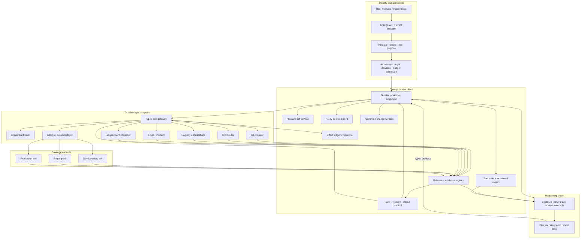
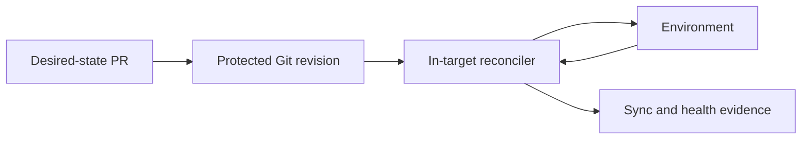

# Reference Architecture and Build Choices

> **Status:** Production architecture guide  
> **Last researched:** 2026-08-31  
> **Decision:** Choose the smallest architecture that preserves identity, durable state, exact plans, policy, effect reconciliation, and independent deployment control.  
> **Evidence:** [Research packet](../../research/packets/devops-deployment-agent-blueprint.md)

## Start with ownership, not products

The central architecture decision is which component owns each invariant.

| Invariant | Authority |
|---|---|
| User, workload, tenant, target scope | Admission service |
| Run lifecycle, waits, retries, cancellation | Durable workflow/run state |
| Reasoning and proposed next action | Model-facing agent loop |
| Source of desired application/infrastructure state | Protected Git or IaC workspace |
| Release subject and evidence | Release/evidence registry |
| Authorization and approval | Policy and approval services |
| External effect identity and ambiguity | Effect ledger plus reconciler |
| Build result | CI builder and registry digest |
| Runtime reconciliation | GitOps or cloud deployment controller |
| Rollout health decision | Versioned deterministic analysis policy |
| Incident authority | Incident command system and kill switches |

One process can implement several rows at low scale. Do not merge the concepts: a chat transcript is not run state, a CI log is not an effect ledger, and a model's tool choice is not authorization.

## When deterministic delivery is enough

Prefer no deployment agent when the complete decision is a fixed predicate over structured facts:

~~~text
release manifest valid
AND required tests and provenance policy pass
AND exact external approval or automation grant is current
AND target revision is unchanged
=> invoke one fixed rollout contract and controller
~~~

A conventional pipeline, policy engine, approval service, and rollout controller are simpler, cheaper, and more reproducible. Add the model loop only when operators repeatedly need bounded synthesis across heterogeneous evidence, ambiguous failure diagnosis, risk explanation, or proposal drafting. Keep the final identity, policy, plan, effect, and rollout gates deterministic.

## Reference topology



### Trust boundaries

1. **User input and retrieved content:** untrusted, including logs, diffs, tickets, manifests, and tool metadata.
2. **Model output:** untrusted structured proposal.
3. **Application control plane:** trusted to enforce state transitions, but not automatically trusted to access production.
4. **Tool gateway:** trusted capability boundary with independent validation.
5. **Credential broker:** high-value boundary; secrets never return to the model.
6. **Delivery controllers:** authoritative for provider operations and runtime status within assigned targets.
7. **Evidence plane:** append-only/versioned records with stricter write rules than ordinary logs.

## Choose the deployment path

### Push-oriented CI/CD


Use when:

- the provider operation is inherently imperative;
- existing pipelines already encode reliable deployment and rollback;
- non-Kubernetes or legacy targets lack a reconciler;
- a cloud deployment service owns the rollout;
- migration jobs need tightly ordered steps.

Risks:

- the pipeline often holds broad target credentials;
- retries may repeat effects;
- pipeline configuration can become a privileged program;
- one compromised runner/action/plugin can reach later jobs or shared state;
- drift between runs is not continuously reconciled.

The agent should dispatch a protected pipeline template with typed inputs, not write an arbitrary script into a privileged job.

### Pull-oriented GitOps



Use when:

- the target state is declarative;
- continuous drift correction is valuable;
- cluster/cloud credentials should remain inside the environment;
- reviewable versioned desired state is a strong operational fit.

Risks:

- a reconciler can quickly amplify a bad approved declaration;
- direct manual changes and self-heal can fight each other;
- Git revision, rendered output, artifact digest, and live state can diverge if not linked;
- prune, allow-empty, hooks, sync waves, windows, and rollback semantics are product/configuration specific;
- secret material must not be stored in plaintext desired state.

### Hybrid—the recommended production default

Use Git for desired state and direct controller APIs for:

- read-only evidence;
- plan and diff generation;
- sync pause/resume or rollout pause/abort;
- incident containment;
- provider operations not representable declaratively;
- ticket, approval, and evidence updates.

Define a writer matrix:

| State | Normal writer | Incident writer | Reconciliation after incident |
|---|---|---|---|
| Application desired state | Protected Git | Incident PR or explicit override | Reconcile override into Git before resume |
| Cluster workload object | GitOps reconciler | Incident controller under suspension | Compare and adopt/revert intentionally |
| Traffic weight | Rollout controller | Incident traffic runbook | Restore controller ownership with known step |
| Feature flag | Flag controller/API | Incident commander delegate | Record target state and handback |
| IaC resource | IaC workspace/controller | Specialized break-glass | Import/refresh/replan before next apply |

## Component boundaries

### Change API

Expose `create`, `get`, `events`, `approve/reject` through the approval system, `cancel`, and `resume` for authenticated inputs. A dropped client connection must not cancel the run unless policy says so.

### Durable workflow

Owns explicit states, timers, retries, waits, leases, version pinning, cancellation, and recovery. It invokes model calls and tool adapters as recorded activities or steps.

It does not authorize itself or infer external success.

### Evidence registry

Stores references to immutable artifacts:

- source and desired-state revisions;
- rendered diffs and sensitive plan artifacts;
- build subjects, provenance, SBOMs, scans, and tests;
- policy and approval decisions;
- provider operation receipts and rollout analysis;
- incident and recovery links.

Large or sensitive content belongs in an artifact store with access controls. The model receives bounded summaries and references.

### Context compiler

Build a fresh projection for each decision from authenticated authority, durable run/effect state, versioned change identity, current target observations, and governed procedures. Emit a context manifest with source versions, freshness, completeness, token lanes, conflicts, and truncation. Compaction and session memory are continuity aids only; see [Context compilation, memory, and behavior evolution](context-compilation-memory-and-behavior-evolution.md).

### Plan service

Runs deterministic rendering, validation, dry-run, IaC plan, policy input normalization, and semantic classification. It should produce both a machine plan and a human view from the same canonical data.

### Tool gateway

Resolves logical resource IDs, validates schemas, checks grants, obtains credentials, sets deadlines, assigns effect IDs, invokes adapters, redacts results, and reconciles ambiguous outcomes.

### Operations controller

Owns rollout gates, SLO policies, concurrency, maintenance windows, active incident constraints, kill switches, and automation handback. It must have an independent route that does not depend on the model service.

## Custom, framework, and hybrid build paths

| Path | Use when | You receive | You still own | Main trap |
|---|---|---|---|---|
| Small custom loop | Narrow read/propose agent; few tools; short runs | Exact control and low dependency surface | Messages, tool loop, validation, tracing, budgets, state | Ad hoc features grow into an undocumented framework |
| Agent framework | Multiple tools, structured outputs, interruptions, tracing, provider adapters | Model/tool ergonomics and common lifecycle features | Identity, policy, effects, approvals, deployment truth, operations | Treating framework session/checkpoint guarantees as application guarantees |
| Durable workflow only | Predominantly deterministic release orchestration | Timers, retries, waits, recovery, operational state | Model integration, tool contracts, policy, effects | Encoding every reasoning choice as brittle workflow logic |
| Agent framework + durable workflow | Long-running, effectful production agent | Ergonomic reasoning plus robust orchestration | Boundary between replayable control and nondeterministic activities | Two state models drift or duplicate retries |
| Existing CI/CD/GitOps + thin agent | Mature delivery platform needing better diagnosis/proposals | Maximum reuse and smallest authority expansion | Evidence normalization and safe tool facade | Exposing raw administrative APIs instead of bounded operations |

### Recommended progression

1. Start with a thin A1/A2 agent over existing delivery systems.
2. Persist application-owned run and evidence records.
3. Add framework checkpointing only if interruptions or state inspection require it.
4. Add a general durable workflow when runs cross process loss, long waits, or effectful multi-system steps.
5. Preserve one retry owner and one authoritative state per invariant.

## Framework convenience versus owned guarantees

| Framework capability | Convenient for | Not a guarantee of |
|---|---|---|
| Tool schema | Structural model arguments | Domain validity, current authorization, or safe effect |
| Tool approval interrupt | Pausing and resuming a run | Independent approver eligibility, exact plan binding, or expiry |
| Session memory | Conversation continuity | Authoritative release, target, policy, or environment state |
| Graph checkpoint | Resuming graph nodes | Exactly-once deploy or safe external retry |
| Built-in trace | Debugging model/tool flow | Complete audit, secrets redaction, or cross-provider lineage |
| Session/compaction memory | Conversational continuity and token control | Current target truth, approval validity, effect status, or audit reconstruction |
| Guardrail callback | Fast validation hook | Unbypassable organization policy unless enforced at the trusted boundary |
| Durable adapter | Workflow recovery | Target-specific reconciliation and compensation |

Write these distinctions into the architecture decision record. They prevent a later SDK migration from silently changing a control.

## Language choice

Choose primarily for the existing platform and adapter ecosystem.

| Runtime | Strong fit | Caution |
|---|---|---|
| TypeScript/Node.js | Git/CI/cloud APIs, JSON schemas, event-driven services, teams with web platform expertise | Validate all runtime inputs; control process/subprocess and cancellation lifecycles |
| Python | Agent frameworks, policy/evaluation pipelines, rapid integration, data analysis | Use strict type/runtime validation; isolate blocking SDKs and manage async boundaries |
| Go | High-concurrency gateways/controllers, Kubernetes ecosystem, small static deployment, predictable resource use | Agent SDK ecosystem can be thinner; iteration on model-facing features may be slower |
| JVM/.NET | Existing enterprise platform, strong service infrastructure, cloud SDKs, governance | Avoid adding a second runtime solely for fashionable agent libraries |
| Rust | Hardened gateway/sandbox-adjacent components where memory safety and footprint justify cost | Higher integration effort and smaller agent ecosystem |

Practical default:

- use the organization's supported service language for the control plane;
- use Go when extending Kubernetes controllers if that matches the team;
- permit a separate Python/TypeScript reasoning worker only if deployment, security, and on-call ownership remain clear;
- communicate through versioned typed contracts rather than shared mutable database tables.

## Model choice

Select with task-specific evaluation, not a leaderboard.

Required capabilities by workload:

| Workload | Model properties |
|---|---|
| Evidence synthesis | Long structured inputs, reliable citation/reference use, resistance to untrusted instructions |
| Plan drafting | Strict structured output, diff reasoning, low unsupported-field rate |
| Failure diagnosis | Log/config reasoning, hypothesis calibration, tool selection |
| Change explanation | Concise risk communication and uncertainty disclosure |
| Rollout supervision | Stable classification from bounded normalized metrics—not raw autonomous thresholding |

Operational rules:

- pin or record the exact model route and parameters per run;
- keep temperature and sampling appropriate to reproducibility-sensitive work;
- cap model and tool turns;
- qualify fallback routes for schema, tool, data-policy, and safety compatibility;
- never silently switch providers if retention, region, or identity policy differs;
- route simple extraction to deterministic code before adding a smaller model;
- measure cost per verified useful change, not per token.

Do not put raw high-cardinality logs into a huge context by default. Search and summarize into evidence artifacts, then allow targeted retrieval.

## Runtime and deployment topology

### Small installation

- one API/worker service;
- one relational database for runs, approvals references, effect ledger, and event outbox;
- object storage for plans/logs/evidence;
- existing CI/CD and GitOps systems;
- one credential broker integration;
- separate logical queues for interactive and background work.

### Scale-out triggers

Split components only when evidence demands it:

| Trigger | Split |
|---|---|
| Long waits and worker replacement | Durable workflow service from model workers |
| Many providers and credentials | Tool gateway and credential broker |
| Noisy tenants or data residency | Execution/evidence cells by tenant/region |
| Heavy log analysis | Evidence ingestion/indexing from run control |
| Rollout SLO criticality | Deterministic rollout controller from reasoning worker |
| High audit retention | Operational telemetry from immutable evidence archive |
| Independent security ownership | Policy/approval service from agent application |

## Data and event flow

Use durable semantic events, not token streams, to reconstruct the run:

```text
change.admitted
evidence.observed
proposal.created
plan.generated
policy.evaluated
approval.requested | approval.decided | approval.expired
effect.intended | effect.dispatched | effect.unknown | effect.reconciled
deployment.started | deployment.progressed | deployment.paused
deployment.promoted | deployment.recovery_started | deployment.terminal
incident.linked | automation.frozen | automation.resumed
```

Store vendor event references and payload hashes. CDEvents can inform the vocabulary, but the domain model should retain provider-specific identifiers and semantics.

## Architecture review checklist

- [ ] Each invariant has one authoritative owner.
- [ ] The model has no direct credentials and cannot construct trusted tenant/target identity.
- [ ] CI/CD, GitOps, and direct writers have an explicit ownership matrix.
- [ ] Run lifetime is independent of the client connection and agent worker process.
- [ ] Model/tool framework retries cannot multiply workflow or provider retries.
- [ ] Plans, approvals, releases, and effects are immutable and version-linked.
- [ ] The tool gateway can represent `unknown` and reconcile by stable operation ID.
- [ ] Rollout advancement and incident containment do not depend on model availability.
- [ ] Tenant/region cells and storage partitions match the threat and data model.
- [ ] The starting topology is no more distributed than the reliability requirement demands.

## Related guides

- [Mission, workloads, and autonomy](mission-workloads-and-autonomy.md)
- [Tool adapters and deployment evidence](tool-adapters-and-deployment-evidence.md)
- [Durable execution](../../runtime/durable-execution.md)
- [Custom loop vs framework vs workflow engine](../../comparisons/custom-loop-vs-framework-vs-workflow-engine.md)
- [Production agent control plane](../../architectures/production-agent-control-plane.md)
- [Context compilation, memory, and behavior evolution](context-compilation-memory-and-behavior-evolution.md)
