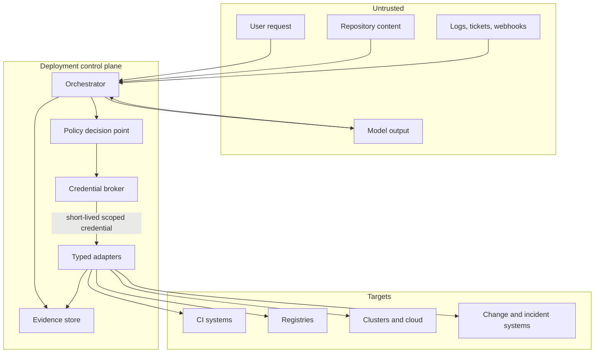
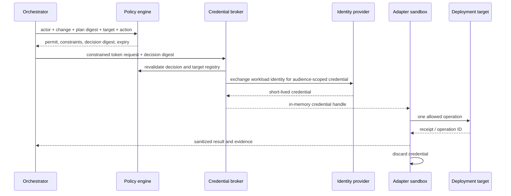

# Security, Credentials, and Tenant Isolation

> **Status:** Production security guide  
> **Research date:** 2026-08-31  
> **Scope:** Threat model, workload identity, credential brokering, authorization, and isolation

## Decision

Treat the deployment agent as a privileged control-plane workload operating on untrusted input. Keep models credentialless; issue short-lived, target-scoped credentials to deterministic adapters only after policy authorization. Enforce tenant and environment boundaries in every layer, not merely in the prompt or UI.

## Threat model

Protected assets include production workloads, infrastructure state, source repositories, pipeline definitions, signing identities, artifact registries, policy bundles, approvals, secrets, evidence, and incident controls.

Principal adversaries and failures:

| Threat | Example | Required control |
|---|---|---|
| Prompt or indirect injection | Repository README or log says to bypass approval and run a command | Untrusted-data labeling; typed tools; deterministic policy; no model-held credentials |
| Compromised source or dependency | Malicious workflow action, build plugin, or IaC provider | Pinning, provenance, protected paths, isolated builds, verification |
| Confused deputy | Valid user causes the agent to deploy into another tenant | Canonical target registry and authorization on user, workload, action, and target |
| Credential theft | Token leaks into logs, traces, model context, or artifacts | Brokered short-lived tokens, audience binding, redaction, egress controls |
| Approval forgery or replay | Old approval is reused for a changed plan | Exact digest binding, nonce, expiry, identity assurance, append-only audit |
| Cross-tenant data leak | Search, cache, vector retrieval, or evidence query crosses namespace | Tenant keys, row/bucket isolation, authorization filters, adversarial tests |
| Control-plane compromise | Adapter or orchestrator is altered | Signed builds, least privilege, segmentation, runtime hardening, audit |
| Availability abuse | Agent triggers pipelines or expensive previews repeatedly | Quotas, budgets, concurrency limits, circuit breakers |
| Insider misuse | Authorized operator expands scope or uses break-glass casually | Separation of duties, just-in-time access, immutable evidence, review |

The [OWASP Top 10 CI/CD Security Risks](https://owasp.org/www-project-top-10-ci-cd-security-risks/) is useful threat coverage, while [NIST SP 800-204D](https://csrc.nist.gov/pubs/sp/800/204/d/final) frames software-supply-chain integration in CI/CD. Neither substitutes for a system-specific threat model.

## Trust boundaries



All data entering from the untrusted zone remains data. It cannot define tool policy, change authorization, select credential scopes, or install executable integration code.

## Identity planes

Keep these identities distinct and record each one:

1. **Requester:** human or system asking for a change.
2. **Approver:** human or group authorizing a particular plan.
3. **Agent workload:** service identity running orchestration.
4. **Adapter workload:** service identity allowed to request a particular credential profile.
5. **Provider principal:** short-lived identity seen by Git, cloud, cluster, or registry.
6. **Artifact builder/signer:** workload identity that produced or attested the release.

`onBehalfOf` metadata improves auditability but does not magically delegate all requester permissions. Authorization evaluates the complete chain and uses the least privilege of the requested effect.

## Credential broker flow



Credential properties:

- lifetime no longer than the operation plus a small bounded margin;
- explicit audience, tenant, environment, target, and action scope where providers support them;
- minted only after commit-time authorization;
- delivered to the adapter, not serialized into run state or model context;
- revocable or rendered useless by short lifetime and broker policy;
- refreshed only after policy, incident freeze, and cancellation checks.

[GitHub Actions OIDC](https://docs.github.com/en/actions/concepts/security/openid-connect) and [GitLab CI/CD ID tokens](https://docs.gitlab.com/ci/secrets/id_token_authentication/) support federation without stored cloud secrets. Validate issuer, audience, subject, repository/project, ref, workflow, environment, and other claims; an OIDC token is authentication material, not authorization by itself.

[Vault dynamic secrets](https://developer.hashicorp.com/vault/docs/secrets) provide leased credentials for supported systems. [SPIFFE](https://spiffe.io/docs/latest/spiffe-about/spiffe-concepts/) provides workload identity concepts and SVIDs. Choose mechanisms already operated reliably by the organization rather than creating a new identity system solely for the agent.

## Canonical target registry

Never derive a production endpoint, account, namespace, or credential profile from free-form model output.

```yaml
apiVersion: targets.delivery.example.io/v1
kind: Target
metadata:
  ref: target://tenant-a/prod-eu/checkout
  tenant: tenant-a
  environmentClass: production
spec:
  owner: checkout-team
  changeRepository: git://platform/prod-manifests/checkout
  controller: argocd://prod-eu/checkout
  runtime:
    cluster: cluster://prod-eu-1
    namespace: tenant-a-checkout
  credentialProfiles:
    inspect: k8s-reader/prod-eu/tenant-a-checkout
    deploy: argocd-sync/prod-eu/checkout
    emergency: breakglass/prod-eu/checkout
  policyBundles:
    - policy://global/production@sha256:...
    - policy://tenant-a/checkout@sha256:...
  allowedReleaseRepositories:
    - registry.example.com/tenant-a/checkout
  concurrencyKey: prod-eu/checkout
  incidentFreezeScope: tenant-a/prod-eu
```

Only administrators outside the deployment-agent path may alter sensitive target mappings. Changes to this registry receive code-owner review, policy checks, and audit.

## Authorization tuple

Evaluate at least:

```text
allow(
  requester,
  approvers,
  agent_workload,
  adapter_workload,
  action,
  canonical_target,
  release,
  plan_digest,
  policy_version,
  time,
  incident_state
)
```

Re-evaluate immediately before mutation and when a paused or retried operation resumes. Cache only within the decision's explicit validity window and invalidate on policy, membership, target, release, incident, or approval changes.

## Tenant and environment boundaries

| Layer | Required boundary |
|---|---|
| API | Authenticated tenant context; object-level authorization on every request |
| Orchestrator | Tenant keyed runs, queues, caches, rate limits, and idempotency namespace |
| Durable store | Row-level or database-level isolation plus tested authorization; tenant in primary lookup keys |
| Object/evidence store | Tenant-specific prefixes/buckets and access policies; opaque signed references |
| Retrieval/model context | Filter before retrieval; label tenant/source; never rely on post-generation filtering |
| Credential broker | Tenant/target/action in authorization and issuance policy |
| Provider | Separate projects/accounts/namespaces/repositories and least-privilege roles |
| Network | Egress allowlists or segmented workers for high-risk targets |
| Observability | Tenant-aware queries and export; scrub sensitive labels |
| Administration | Separate control-plane admin from tenant deployment roles |

Kubernetes namespaces are useful boundaries but are not automatically strong multi-tenant isolation. The Kubernetes [multi-tenancy guidance](https://kubernetes.io/docs/concepts/security/multi-tenancy/) distinguishes namespace and virtual-control-plane approaches. Use stronger isolation—separate clusters/accounts or virtual control planes—when adversaries, compliance, noisy-neighbor risk, or control-plane access justify it.

## Environment separation

- Production and non-production use different credential profiles and preferably separate cloud accounts/projects and clusters.
- A non-production compromise must not mint, read, or route production credentials.
- Production policy bundles cannot be overridden by tenant repository content.
- Test fixtures must not contain production secrets or provider receipts.
- Production evidence may be visible to non-production analytics only through a sanctioned, redacted export.
- Runner placement and egress reflect the target's risk; do not use an internet-exposed shared runner for privileged production operations.

## CI/CD and source controls

GitHub recommends pinning third-party actions to full-length commit SHAs and limiting `GITHUB_TOKEN` permissions in its [security hardening guide](https://docs.github.com/en/actions/how-tos/security-for-github-actions/security-guides/security-hardening-for-github-actions). Apply equivalent controls elsewhere:

- protect workflow, build, policy, CODEOWNERS, target-registry, and deployment files;
- require independent review for changes that can weaken the review path itself;
- prevent untrusted pull-request code from accessing privileged secrets or self-hosted runners;
- isolate build and deploy identities;
- pin actions, images, plugins, modules, providers, and reusable workflows by immutable identity;
- prevent an agent-authored change from satisfying its own review requirement;
- verify merge base/head and required-check results immediately before merge.

## Model and tool containment

- Present tool names and schemas from a server-side allowlist; ignore instructions embedded in repository content that request new tools.
- Parse structured data with bounded parsers; limit response size, recursion, archives, and log windows.
- Delimit untrusted text and identify its source; summarize large logs through deterministic filters before optional model analysis.
- Deny network access from the model runtime unless explicitly required; route provider access through adapters.
- Sandbox renderers, scanners, plan parsers, and third-party CLIs, which process attacker-controlled content.
- Never use model classification as the sole guard for secrets, target authorization, or dangerous commands.

## Context, cache, and memory threats

Compaction and retrieval can preserve an attack after its original source disappears from view. Apply the same tenant, provenance, and authority controls to derived data:

- compile context only after authenticated tenant/target admission;
- filter before retrieval, then recheck every returned object's tenant and source;
- include source version, observation/fetch time, expiry, completeness, digest, sensitivity, and redaction metadata;
- use tenant, provider instance, target, query, and source version in cache keys;
- never negative-cache an authorization, incident, revocation, or mutable target-state decision beyond its explicit validity;
- treat summaries and embeddings as untrusted indexes; re-fetch authoritative facts before policy or mutation;
- prevent repository/log/ticket content from writing cross-run procedural memory;
- delete derived caches, indexes, transcripts, and compaction artifacts when their source or tenant data is deleted;
- test indirect injection that is retrieved, cached, compacted, and resurfaced in a later run.

General cross-run episodic memory and online self-learning are disabled by default. Reviewed incidents and corrections enter versioned evaluations or runbooks through a separate change process. See [Context compilation, memory, and behavior evolution](context-compilation-memory-and-behavior-evolution.md).

## Third-party integration supply chain

Every adapter, action, reusable workflow, CLI, container, IaC provider/module, GitOps plugin, admission plugin, and model connector is privileged code relative to its credential and data plane.

- pin immutable versions or digests and verify provenance/signatures where the ecosystem supports it;
- qualify the exact provider version, product tier, API, auth mode, scopes, network path, and retention behavior;
- isolate parsing/rendering of attacker-controlled repositories, plans, manifests, logs, and archives;
- prohibit runtime plugin/tool installation by the model;
- separate adapter build/publish permission from production adapter deployment and credential profiles;
- maintain an allowlist and software inventory with owner, end-of-support/deprecation monitoring, and rollback;
- canary adapter and policy upgrades with dual reads before enabling changed write semantics;
- disable an affected capability version without disabling status, cancellation, reconciliation, or manual recovery.

## Secrets and evidence hygiene

1. Detect known secret fields before logging or tracing.
2. Redact at the adapter boundary before data enters shared telemetry.
3. Store secret references, not values, in plans.
4. Treat IaC plans, crash dumps, environment variables, command lines, and HTTP headers as potentially sensitive.
5. Encrypt durable state and evidence with tenant-aware access controls.
6. Restrict model-provider retention and training use according to organizational policy.
7. Test redaction with seeded canary secrets and provider-specific token formats.
8. Make raw-evidence access exceptional and audited.

## Separation of duties

| Activity | May propose | May approve | May execute | May alter governing policy |
|---|---:|---:|---:|---:|
| Deployment agent | Yes | No | Within authorized ceiling | No |
| Service owner | Yes | Risk-dependent | Through control plane | Service-scoped policy only, reviewed |
| Release manager | Yes | Production promotion | Through control plane | No |
| Security | Yes | Security exception | No by default | Security policy, independently reviewed |
| Platform admin | Platform change | No self-approval | Break-glass only | Platform policy, independently reviewed |
| Incident commander | Recovery proposal | Incident-scoped override | Delegates bounded actions | No permanent changes |

Do not let one bot identity author a change, approve it, merge it, change the policy, and deploy it. Technical separation is stronger than workflow convention.

## Break-glass

Break-glass is a predesigned incident path, not a generic administrator token.

- require an active incident and named commander;
- restrict tenant, environment, target, operations, and duration;
- use phishing-resistant human authentication and just-in-time issuance;
- notify an independent channel immediately;
- record the normal policy denial and explicit override reason;
- retain commands, receipts, and observed effects;
- revoke on expiry or incident stabilization;
- reconcile direct changes back into canonical desired state;
- review every use after the incident.

Availability must not depend on the model: operators need documented manual recovery and credential procedures when the agent control plane is down.

## Revocation and queued work

When membership, approval, signer, release, policy, target, or credential status changes:

1. Invalidate future credential issuance.
2. Mark affected pending and paused operations for reauthorization.
3. Request cancellation of unsafe in-flight work where possible.
4. Reconcile operations whose provider outcome is uncertain.
5. Identify affected deployed environments through lineage.
6. Record revocation as a new event; do not erase prior authorization evidence.

Long-running work must refresh authorization before each new effect, not merely renew a token.

## Security acceptance tests

- Cross-tenant identifiers in URLs, request bodies, cache keys, search queries, and evidence references are denied.
- A forged tenant claim cannot select another tenant's target registry entry.
- Model output containing a raw endpoint, account ID, namespace, or role cannot bypass canonical target lookup.
- Expired, wrong-audience, wrong-subject, and replayed OIDC tokens are rejected.
- Credentials never appear in model transcripts, durable run state, logs, traces, metrics, or error reports.
- An agent-authored workflow/policy change cannot approve or deploy itself.
- Protected environment and branch controls remain effective under API-based operations.
- Broker outage fails closed for new mutations while read-only diagnosis remains possible.
- Revoked approval or group membership blocks resumed work.
- Break-glass expires, notifies, audits, and forces desired-state reconciliation.
- Compromised non-production workers cannot reach production control or data planes.
- Oversized logs, malicious archives, symlinks, and parser exploits are contained.
- Cached, indexed, or compacted cross-tenant and prompt-injection payloads cannot survive source revocation or bypass revalidation.
- A third-party adapter/tool upgrade cannot gain new targets, scopes, or effect semantics without requalification.

## Residual limitations

- Short-lived credentials reduce exposure but do not prevent misuse during their lifetime.
- Namespace or logical isolation cannot provide the same assurance as separate control planes.
- Supply-chain attestations depend on trustworthy identity, builders, and policy configuration.
- A compromised control-plane administrator may alter several controls; independent logs, organizational separation, and external detection remain important.
- Prompt-injection defenses lower risk but do not make arbitrary untrusted text safe for an autonomous privileged model.

## Related guides

- [Plans, policy, approvals, and change control](plans-policy-approvals-and-change-control.md)
- [Tool adapters and deployment evidence](tool-adapters-and-deployment-evidence.md)
- [Artifacts, provenance, and promotion](artifacts-provenance-and-promotion.md)
- [Permissions, sandboxing, and secrets](../../security/permissions-sandboxing-and-secrets.md)
- [Production agent control plane](../../architectures/production-agent-control-plane.md)
- [Execution boundaries](../../runtime/execution-boundaries.md)
- [Context compilation, memory, and behavior evolution](context-compilation-memory-and-behavior-evolution.md)
