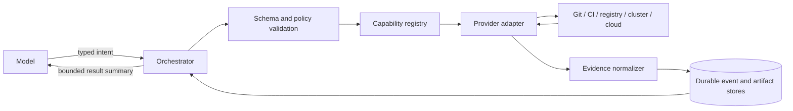
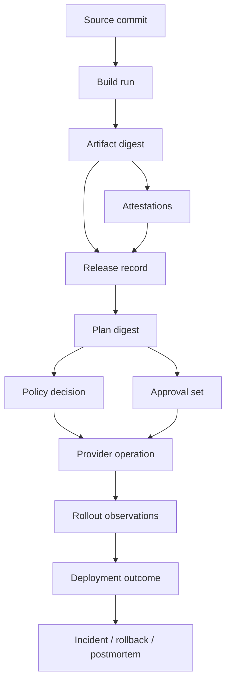

# Tool Adapters and Deployment Evidence

> **Status:** Production integration guide  
> **Research date:** 2026-08-31  
> **Scope:** Agent-facing tool contracts, provider adapters, normalized evidence, and lineage

## Decision

Expose narrow, typed deployment capabilities rather than a general shell, cloud console, or unconstrained SDK. Every effecting tool follows a prepare/commit/status/reconcile lifecycle and returns durable evidence. Provider adapters may normalize common behavior, but must expose capability gaps instead of pretending all systems have identical semantics.

## Tool boundary



The model never receives ambient credentials. The orchestrator resolves a registered target, policy-authorized capability, and scoped workload identity after deterministic checks.

## Common effect lifecycle

| Operation | Effect | Required behavior |
|---|---|---|
| `inspect` | Read only | Return source freshness, scope, and pagination/completeness metadata |
| `prepare` | No target mutation | Resolve inputs, compute diff/plan, identify risks, and return a plan digest |
| `commit` | Mutating | Require exact plan/approval/policy binding, compare-and-swap preconditions, and idempotency key |
| `status` | Read only | Query by durable provider operation ID, not by guessed resource state alone |
| `cancel` | Mutating request | Request cancellation and return its current state; never imply completion prematurely |
| `reconcile` | Read with optional separately authorized repair | Determine actual outcome after timeout, crash, or ambiguous response |

An adapter that cannot support these semantics must declare the limitation and receive a lower autonomy ceiling.

## Capability descriptor

```yaml
apiVersion: tools.delivery.example.io/v1
kind: Capability
metadata:
  name: kubernetes.apply.v2
spec:
  adapterVersion: 2.4.1
  effects: [prepare, commit, status, cancel, reconcile]
  targets:
    registryRef: target://tenant-a/prod-eu/checkout
  inputSchema: schema://kubernetes.apply.v2/input
  outputSchema: schema://deployment.operation.v1
  idempotency:
    supported: true
    keyScope: target-and-plan-digest
    retention: 30d
  preconditions:
    - expectedDesiredRevision
    - expectedLiveResourceVersion
  cancellation: cooperative
  evidence:
    - diff
    - admissionDecision
    - providerOperation
    - observedResources
  maximumDuration: 2h
  credentialProfile: deployer/prod-eu/checkout
  owner: platform-delivery
```

Version schemas and adapter behavior independently. Changing how a plan digest is computed or how `success` is inferred is a breaking semantic change even if JSON fields remain compatible.

## Provider qualification record

Do not enable a third-party adapter because its happy-path API call worked. Qualify the exact provider edition, API version, authentication mode, and configuration used by each target class.

~~~yaml
apiVersion: tools.delivery.example.io/v1
kind: ProviderQualification
metadata:
  provider: gitlab
  adapter: gitlab-deploy/2.3.0
  qualificationId: qual_01K...
spec:
  productVersion: gitlab-19.3.1
  offering: self-managed
  apiVersions: [v4]
  auth:
    controlApi:
      mechanism: oauth-access-token
      requiredScopes: [api]
    deployJob:
      mechanism: oidc-id-token-to-workload-federation
      audience: https://sts.example.com
      requiredClaims: [iss, aud, job_project_id, ref_protected, environment_protected]
      downstreamRole: delivery/prod-eu/checkout
  operations:
    deploy:
      idempotency: adapter-ledger-plus-resource-group
      concurrencyOwner: resource-group/prod-checkout
      stableOperationId: deployment-id
      cancelStates: [requested, completed, impossible]
      reconciliation: deployment-and-job-read
  eventDelivery:
    signatureVerified: true
    duplicatesExpected: true
    ordering: not-guaranteed
    backfill: polling
  limits:
    providerRateProfile: instance-config/2026-08-31
    adapterRequestBudgetPerMinute: 300
    adapterMaximumPayloadBytes: 2000000
  evidence:
    nativeReceiptsRetained: true
    retentionVerifiedDays: 90
  testedAt: 2026-08-31T03:00:00Z
  expiresAt: 2026-11-30T00:00:00Z
  owner: platform-delivery
~~~

Qualification must answer:

- Which immutable provider identifiers bind the repository, pipeline, artifact, environment, operation, and actor?
- Can a caller supply an idempotency token? If not, which compare-and-swap precondition and read-after-write query prevent duplication?
- Does cancellation mean requested, accepted, or terminal? Can the operation become uncancellable?
- Who serializes work, and what ordering does that mechanism actually provide?
- Which API responses are asynchronous, partial, paginated, eventually consistent, or lossy?
- How are webhooks authenticated, deduplicated, reordered, and backfilled after loss?
- Which native receipt proves acceptance, and which independent postcondition proves completion?
- Which product tier, preview feature, administrator bypass, and retention setting changes the guarantee?
- What rate, object, payload, and log limits apply, and how does the adapter degrade?
- Can a tenant-scoped credential enumerate, infer, or mutate another tenant's objects?

Expire and rerun qualification on provider edition/version changes, material configuration changes, deprecation notices, incident findings, or adapter semantic changes.

## Request and result envelopes

```json
{
  "tool": "deployment.promote.v1",
  "runId": "run_01J...",
  "changeId": "chg_01J...",
  "targetRef": "target://tenant-a/prod-eu/checkout",
  "planDigest": "sha256:1c10...",
  "approvalSetDigest": "sha256:aa20...",
  "policyDecisionDigest": "sha256:ed70...",
  "expectedState": {
    "release": "rel_01H...",
    "desiredRevision": "91f42e0b..."
  },
  "idempotencyKey": "chg_01J...:promotion:effect-1",
  "deadline": "2026-08-31T05:00:00Z"
}
```

```json
{
  "outcome": "accepted",
  "operationId": "argo:checkout:rollout:3481",
  "providerRequestId": "req-a92...",
  "observedAt": "2026-08-31T04:01:03Z",
  "evidence": [
    {"type": "policy-decision", "digest": "sha256:ed70..."},
    {"type": "provider-receipt", "digest": "sha256:780d..."}
  ],
  "next": {"operation": "status", "notBefore": "2026-08-31T04:01:13Z"}
}
```

Use a closed outcome vocabulary:

- `succeeded`: verified terminal success.
- `failed`: verified terminal failure.
- `accepted`: provider accepted work; outcome is not terminal.
- `already_applied`: same idempotency key and same canonical inputs completed previously.
- `denied`: deterministic authorization or policy rejection.
- `conflict`: precondition failed or idempotency key was reused for different inputs.
- `cancel_requested`: cancellation is pending.
- `unknown`: provider outcome cannot yet be proven.

Never map network timeout to `failed` or `succeeded` without reconciliation.

## Error model

| Class | Example | Retry policy |
|---|---|---|
| `invalid_input` | Schema error or unsupported strategy | Do not retry; revise plan |
| `denied` | Policy, approval, or target boundary rejects | Do not retry unchanged |
| `conflict` | Git head, resource version, or current release changed | Re-inspect and re-plan |
| `rate_limited` | Provider quota with retry hint | Retry within deadline using jitter and budget |
| `transient` | Temporary service failure before request acceptance is known | Reconcile first when an operation may exist |
| `terminal_provider` | Rollout failed or IaC apply returned terminal error | Do not blind retry; diagnose and plan recovery |
| `unknown` | Lost response or inconsistent status | Poll/reconcile; escalate after bounded time |

Preserve sanitized provider error codes and request IDs. Do not collapse every error into prose produced by the model.

## Provider capability map

### Third-party integration decisions

| Surface | Representative systems | Safest first capability | Production mutation prerequisites and non-obvious semantics |
|---|---|---|---|
| Git/PR | GitHub, GitLab, Bitbucket | Resolve immutable commit/tree, diff, rules, checks, reviews | Base/head compare-and-swap; protected paths; exact head merge; bot cannot approve itself; preserve provider review and merge receipts |
| CI/CD | GitHub Actions, GitLab CI/CD, Bitbucket Pipelines, Jenkins, Tekton | Read run/job/attempt, logs, artifacts, and cancellation state | Dispatch only a pinned protected template; record run and attempt; model provider-native environment gates and queue locks; retries of deploy jobs are new effect attempts |
| Registry | ECR, ACR, Google Artifact Registry, Harbor | Resolve tag to digest; fetch manifest/referrers; verify evidence | Repository-scoped identity; copy subject and referrers; verify destination digests; prove retention/garbage-collection behavior; tags remain discovery pointers |
| GitOps | Argo CD, Flux | Desired/live diff, source revision, reconciliation/health, suspension state | Git remains routine writer; capture controller UID/revision; define suspend/incident handback; test prune, hooks, waves, image automation, and selective-sync limitations |
| Cloud deployer | AWS CodeDeploy, Google Cloud Deploy, Azure deployment APIs | Read release/deployment/rollout and provider audit IDs | Start with expected target/release; retain stable operation ID; model pending/uncancellable stop; treat rollback as another operation; verify runtime state separately |
| Kubernetes | API server plus native or progressive controller | Typed reads, server dry-run, resource versions, conditions | Use controller-owned desired state or explicit field manager; preserve UID/generation/resourceVersion; conflicts block; status and rollout health are separate |
| IaC | Terraform/OpenTofu CLI, HCP Terraform, provider-native previews | Validate, speculative plan, saved plan metadata, state lineage | Apply the exact approved plan/run; protect plan/state as secrets; use workspace/state lock; reject state/config/provider/version drift; partial apply is not rolled back transactionally |
| Change ticket | Jira Software, ServiceNow Change Management | Read exact ticket/change ID, model/type, state, approvals, window, version | Ticket state is not authority by itself; re-read before commit; use API version and caller update identity; verify ignored fields and asynchronous work |
| Incident/collaboration | Incident platform, pager, chat | Read incident identity, commander, affected scope; notify | Incident system owns roles/freeze; chat is not approval by default; effect authority is narrow, expiring, and independently audited |

Current first-party behavior illustrates why the adapter cannot flatten these systems:

- GitHub environments can prevent self-review, but administrator bypass and feature availability are configurable ([deployments and environments](https://docs.github.com/en/actions/reference/workflows-and-actions/deployments-and-environments)).
- GitLab deployment approvals block jobs but do not automatically start them after approval; resource-group process modes have different ordering and idempotency implications ([deployment approvals](https://docs.gitlab.com/ci/environments/deployment_approvals/), [resource groups](https://docs.gitlab.com/ci/resource_groups/)).
- Bitbucket serializes in-progress deployment environments, while custom deployment permissions are plan-dependent; record the actual workspace policy ([deployment environments](https://support.atlassian.com/bitbucket-cloud/docs/set-up-and-monitor-deployments/), [custom deployment permissions](https://support.atlassian.com/bitbucket-cloud/docs/set-custom-deployment-permissions-for-your-environments/)).
- OCI Distribution 1.1.1 defines referrer discovery and a fallback tag schema, but registry retention, replication, and authorization remain implementation-specific ([OCI Distribution 1.1.1](https://github.com/opencontainers/distribution-spec/blob/v1.1.1/spec.md)).
- Argo CD auto-sync and selective sync change rollback, hook, and history semantics; Flux image automation is itself a Git writer that can be suspended and may sign commits ([Argo CD auto-sync](https://argo-cd.readthedocs.io/en/stable/user-guide/auto_sync/), [Argo CD selective sync](https://argo-cd.readthedocs.io/en/stable/user-guide/selective_sync/), [Flux image automation](https://fluxcd.io/flux/components/image/imageupdateautomations/)).
- AWS CodeDeploy can leave stopped deployments indeterminate and [models rollback as a new deployment](https://docs.aws.amazon.com/codedeploy/latest/userguide/deployments-rollback-and-redeploy.html); Google Cloud Deploy represents release promotion and repair as provider operations ([CodeDeploy stop](https://docs.aws.amazon.com/codedeploy/latest/userguide/deployments-stop.html), [Cloud Deploy automation](https://docs.cloud.google.com/deploy/docs/automation)).
- Azure what-if has expansion/time limits that produce ignored results; ignored is not evidence of no change ([ARM what-if](https://learn.microsoft.com/en-us/azure/azure-resource-manager/templates/deploy-what-if)).

### Git and pull requests

| Capability | Prepare | Commit | Evidence and constraints |
|---|---|---|---|
| Read repository state | Resolve commit, tree, protected path ownership | — | Commit SHA, tree digest, branch protections |
| Propose desired-state change | Render patch and semantic diff | Create branch/commit/PR | Base SHA precondition; bot identity; no force push |
| Merge promotion PR | Recheck status and approvals | Merge exact head SHA | Merge commit, reviewer identities, required-check results |
| Revert desired state | Prepare inverse or superseding patch | New PR/commit | Link original change; never rewrite history |

Prefer pull requests for production desired-state changes. Protect workflow, policy, environment, and ownership files with code-owner review. A Git write is not proof that a GitOps controller applied it.

### CI/CD systems

| Provider examples | Useful primitives | Adapter obligation |
|---|---|---|
| GitHub Actions | Workflow dispatch/runs, environments and protection rules, OIDC, deployments, artifact attestations | Pin workflow revision; restrict token permissions; capture run attempt and environment approval |
| GitLab CI/CD | Pipelines/jobs, protected environments, deployment approvals, `resource_group`, ID tokens, deployments API | Preserve pipeline/job/deployment IDs; model deployment serialization and manual-job behavior accurately |
| Jenkins/Tekton/other | Build/run resources, logs, artifacts, credentials | Declare plugin/task versions and nonstandard cancellation or provenance semantics |

[GitHub deployment environments](https://docs.github.com/en/actions/reference/workflows-and-actions/deployments-and-environments) can enforce reviewers and wait rules. [GitLab protected environments](https://docs.gitlab.com/ci/environments/protected_environments/) and [deployment approvals](https://docs.gitlab.com/ci/environments/deployment_approvals/) provide related but not identical controls. Keep provider-native evidence in addition to the normalized result.

### Artifact registries

Registry qualification must test the configured product, not infer compliance from “OCI-compatible” marketing:

| Registry | Verified current mechanism | Qualification trap |
|---|---|---|
| Amazon ECR | [`ListImageReferrers`](https://docs.aws.amazon.com/AmazonECR/latest/APIReference/API_ListImageReferrers.html) lists artifacts for a subject digest and paginates results | Default filtering returns active artifacts; record pagination, artifact status, IAM conditions, lifecycle rules, replication, and destination evidence |
| Azure Container Registry | [ORAS/referrers support](https://learn.microsoft.com/en-us/azure/container-registry/container-registry-manage-artifact) uses the OCI referrers API for most features and a fallback tag schema for CMK-encrypted registries | [Untagged-manifest retention](https://learn.microsoft.com/en-us/azure/container-registry/container-registry-retention-policy) is tier/preview dependent and excludes OCI manifests; test preservation of subject and referrers |
| Google Artifact Registry | Docker repositories can use [immutable tags](https://docs.cloud.google.com/artifact-registry/docs/docker/pushing-and-pulling), and Docker attachments can be found through the referrers API | Attachment management is documented as preview, cleanup is asynchronous, and deleting a target deletes its attachments; qualify lifecycle policy and regional copy behavior |
| Harbor | [Tag immutability](https://goharbor.io/docs/main/working-with-projects/working-with-images/create-tag-immutability-rules/) is project/rule scoped; [garbage collection](https://goharbor.io/docs/main/administration/garbage-collection/) can include untagged artifacts | Tags are mutable by default; qualify the installed release, replication mode, retention rules, garbage-collection window, and evidence copied with a subject |

Required operations:

- resolve tag to digest for display, then use the digest;
- fetch manifest and platform children with strict media-type and size validation;
- discover and retrieve attestations/referrers;
- verify signatures and subject relationships;
- copy by digest with post-copy digest verification;
- query retention/immutability state where supported;
- never delete through the general deployment capability.

Registry authorization must bind tenant, source repository, destination repository, and permitted actions. A registry-wide robot credential is not an acceptable default.

### Kubernetes and GitOps

| Capability | Safe implementation notes |
|---|---|
| Inspect | Use typed resource reads; capture API server identity, resource versions, managed fields, and completeness |
| Prepare apply | Server-side dry-run and admission where supported; semantic diff; discover immutable/recreated resources |
| Commit apply | Server-side apply with an explicit field manager or controller-owned desired state; compare resource version where meaningful |
| Start rollout | Prefer a rollout controller; return its stable resource UID and operation identity |
| Status | Check observed generation, conditions, replicas, runtime image digests, and controller health |
| Cancel/pause | Use controller-supported pause/abort semantics; confirm observed state |
| GitOps sync | Capture desired revision, sync operation, health, and controller reconciliation result |

Kubernetes [server-side apply](https://kubernetes.io/docs/reference/using-api/server-side-apply/) tracks field ownership; conflicts are safety signals, not invitations to force ownership. Admission dry-run can still differ from commit due to time, external systems, mutating webhooks, or concurrent changes.

### Infrastructure as code

Use this surface only for an application-owned module that is part of the release contract or for an exact plan explicitly delegated by infrastructure operations. General cloud, network, IAM, storage, host, and cluster lifecycle work remains outside this agent's authority.

| Tool family | Prepare | Commit binding | Critical caveat |
|---|---|---|---|
| Terraform/OpenTofu | Saved plan plus normalized summary | Apply the exact saved plan after freshness checks | Plan files can contain sensitive values and are environment/version specific |
| Kubernetes manifests | Server dry-run plus semantic diff | Exact desired revision and field-manager contract | Admission and live state may change |
| Azure ARM/Bicep | What-if result | Deployment with matching template/parameters | What-if may report noise or unsupported changes; inspect result kinds |
| Cloud vendor APIs | Provider-native preview if available | Conditional request or operation token | Many APIs lack transactional multi-resource guarantees |

For Terraform, HashiCorp documents that a saved plan contains the decisions to apply, while the plan file can contain sensitive data in cleartext. [OpenTofu documents the same saved-plan sensitivity](https://opentofu.org/docs/cli/commands/plan/) and notes that [state locking is backend-dependent](https://opentofu.org/docs/language/state/backends/). Encrypt plans, scope access, retain them minimally, and bind CLI version, backend/workspace, state lineage/serial, variables, dependency lock, providers, and configuration digest. Reject a backend that cannot meet the concurrency contract instead of silently running with locking disabled.

### Change, incident, and collaboration systems

- Change-ticket adapter: read/create/update structured risk, window, approvals, evidence links, and terminal outcome.
- Incident adapter: open/link incident, freeze scope, attach deployment timeline, and resolve with human authority.
- Chat adapter: notification only by default; chat reactions are not approvals unless identity, intent, scope, exact plan digest, expiry, and replay protection are guaranteed.

The [Jira deployment API](https://developer.atlassian.com/cloud/jira/software/rest/api-group-deployments/) is asynchronous and uses `updateSequenceNumber` to resolve update order. Treat HTTP acceptance as ingestion, not successful deployment. GitHub and GitLab deployment records likewise complement—not replace—runtime verification.

ServiceNow's [Change Management API](https://www.servicenow.com/docs/r/api-reference/rest-apis/change-management-api.html) exposes change models, risk, approvals, conflicts, and state transitions, but fields, workflows, roles, and available API versions are instance/release dependent. Record ignored fields and re-read the change after writes or asynchronous work.

### Webhook and polling contract

Provider events are wake-up hints, not sole truth:

1. authenticate the source before parsing the payload;
2. enforce tenant/provider-instance routing before object lookup;
3. deduplicate on native event/delivery ID and payload digest;
4. retain source occurrence time and ingestion time;
5. tolerate duplicates, missing events, and reordering without state regression;
6. fetch the authoritative object by immutable native ID;
7. advance local state only if the provider version/sequence is newer;
8. run periodic backfill and reconciliation for active and recently terminal operations.

An adapter without a list/backfill route needs a documented evidence gap, a shorter verification interval, and a lower autonomy ceiling.

## Deployment evidence model

```yaml
apiVersion: evidence.delivery.example.io/v1
kind: DeploymentEvent
metadata:
  eventId: evt_01J...
  occurredAt: 2026-08-31T04:08:30Z
  recordedAt: 2026-08-31T04:08:31Z
  sequence: 184
spec:
  subject:
    changeId: chg_01J...
    operationId: op_01J...
    targetRef: target://tenant-a/prod-eu/checkout
  type: rollout.step.completed
  actor:
    kind: workload
    id: spiffe://example.com/ns/delivery/sa/agent
    onBehalfOf: user:alice@example.com
  inputs:
    releaseId: rel_01J...
    planDigest: sha256:1c10...
    policyDecisionDigest: sha256:ed70...
  provider:
    name: argo-rollouts
    resourceUid: 7fae...
    requestId: req-a92...
  observed:
    step: 10-percent
    runtimeDigests: [sha256:6bf4...]
  result: succeeded
  evidenceRefs:
    - type: analysis-result
      uri: evidence://tenant-a/sha256:90bf...
      digest: sha256:90bf...
  previousEventDigest: sha256:8110...
```

Use append-only events with stable event IDs, source timestamps, ingestion timestamps, and deduplication. A hash chain can expose accidental mutation, but a signed, access-controlled store and external retention policy are still required.

## Lineage graph



The graph must answer:

- Which source, builder, and evidence produced the bytes currently running?
- Who approved which exact plan under which policy version?
- Which provider operation changed each target?
- What was actually observed after the change?
- Which deployments are affected by a revoked artifact, signer, policy, or configuration?

[CDEvents](https://cdevents.dev/docs/) provides a vendor-neutral vocabulary for continuous-delivery events. Use it at integration boundaries where beneficial, but retain domain-specific fields needed for plan, approval, and evidence integrity.

## Evidence storage and redaction

| Data | Storage guidance | Retention driver |
|---|---|---|
| Plans, decisions, approvals | Immutable metadata store; encrypted | Audit, incident analysis, compliance |
| Provider receipts and normalized events | Append-only event store | Reconciliation and lineage |
| Logs | Central log store with secret redaction | Troubleshooting and operational policy |
| Large diffs, attestations, analysis outputs | Content-addressed object storage | Evidence and reproducibility |
| Secrets and credentials | Never store in evidence | Credential system only |
| Saved IaC plans | Strongly encrypted and narrowly authorized | Shortest period needed to apply/audit |

Record hashes or structured redacted values when raw provider output contains secrets, personal data, or excessive payloads. Keep an explicit `redactionApplied` field and never ask an LLM to be the only secret-redaction control.

## Adapter conformance tests

Every adapter must prove:

- canonical serialization yields the same plan and request digest across processes;
- a repeated idempotency key with identical input never duplicates effects;
- the same key with different input returns conflict;
- stale expected state prevents commit;
- timeout after provider acceptance reconciles to the original operation;
- status never reports success before observed terminal conditions;
- cancellation distinguishes requested, confirmed, and impossible;
- tenant and target scopes are enforced before credential issuance;
- evidence contains provider identity, versions, request IDs, and observed state;
- secrets are absent from model context, logs, traces, and fixtures;
- malformed, oversized, paginated, and partial provider responses fail safely;
- rate limits and retry hints respect global retry and deadline budgets.
- provider qualification covers version/tier, authentication, concurrency, webhook loss, pagination, retention, and native reconciliation.

## Anti-patterns

- `run_shell(command)` as the main production deployment tool.
- Returning only human prose such as "deployment looks healthy."
- Reconstructing provider operation identity from resource names after a crash.
- Hiding unsupported cancellation or rollback behind a generic boolean.
- Treating CI success as runtime deployment success.
- Converting every provider object into one lossy schema and discarding the original receipt.
- Passing raw logs or untrusted repository instructions directly into the model without delimiters, filtering, and tool-policy isolation.

## Related guides

- [Plans, policy, approvals, and change control](plans-policy-approvals-and-change-control.md)
- [Artifacts, provenance, and promotion](artifacts-provenance-and-promotion.md)
- [Security, credentials, and tenant isolation](security-credentials-and-tenant-isolation.md)
- [Durability, observability, evaluation, and cost](durability-observability-evaluation-and-cost.md)
- [Tool contracts](../../tools/tool-contracts.md)
- [Tool results, artifacts, and provenance](../../tools/tool-results-artifacts-and-provenance.md)
