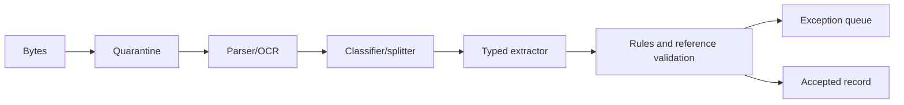
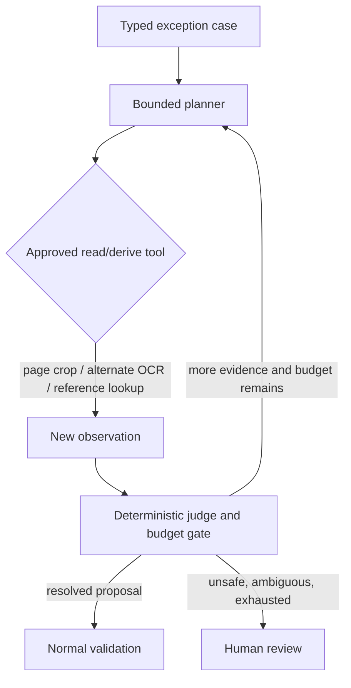

# Purpose, Architecture, and Technology Selection

**Purpose:** Decide whether the workload needs an agent, define its authority ceiling, and select the smallest architecture, runtime, model strategy, and product boundary that can meet measured production requirements.  
**Research baseline:** 2026-08-31

## Start with the operational contract

“Process documents” hides several different products. Before selecting a model, state exactly what the system must produce and what happens when it is unsure.

| Workload | Required product | Typical authority ceiling |
|---|---|---:|
| Archive digitization | Searchable text, layout, page images, quality report, lineage | Extract and route |
| Form/claim intake | Class, split, typed fields, evidence, exception case | Stage case metadata |
| Accounts payable | Invoice facts, duplicate signals, PO/receipt validation | Draft payable; never pay by extraction alone |
| Contract intake | Parties, dates, clauses, signature observations, review package | Route and annotate |
| Regulatory filing | Validated record plus exact submission package | Prepare; authorized filer commits |
| Identity/health evidence | Minimal typed facts, redacted derivatives, access/audit history | Purpose-limited extraction |
| Knowledge ingestion | Structured text/chunks and citations | Index only after ACL and content gates |

For each document class, define:

- accepted sources and file types;
- authoritative original and source-of-truth system;
- expected pages, attachments, language/script, capture quality, and signature state;
- output schema, literal versus normalized values, and evidence requirements;
- field-level error costs and allowed straight-through coverage;
- exception owner, SLA, escalation, and terminal dispositions;
- downstream effects, approvers, destination receipts, and recovery path;
- purpose, residency, retention, legal hold, deletion, and export policy.

If those decisions are absent, an agent cannot safely infer them from the document.

## Authority tiers

Use an explicit ceiling so “automation” cannot quietly expand during implementation:

| Tier | Allowed capability | Typical use | Required boundary |
|---|---|---|---|
| D0 — observe | parse, render, OCR, and report quality | digitization and search | immutable inputs and evidence lineage |
| D1 — interpret | classify, split, extract, normalize, validate, and abstain | structured document processing | typed schemas, evidence, local evaluation |
| D2 — stage | create a draft record, route a case, request review, or prepare an effect intent | case intake and exception handling | durable state, tenant/purpose policy, human escalation |
| D3 — commit material effect | file, sign, pay, release, or delete | separately approved business operation | independent authorization, exact intent binding, idempotency, receipt, reconciliation |

The normal document-intelligence ceiling is **D1**, with narrowly defined **D2** staging. D3 is not inherited from extraction quality or an agent label. Each D3 effect is a separate product capability with its own approvers, limits, adapter, tests, and kill switch. If the deployment has no material effect, omit the credentialed effect plane entirely.

## Requirements and production success

### Functional requirements

1. Accept an authenticated intake envelope and commit exact bytes before parsing.
2. Detect unsupported, encrypted, malformed, oversized, active, or suspicious content without exposing the application runtime.
3. Preserve original, derivative, page, embedded-object, and batch relationships.
4. Classify and split mixed document packets without losing page order.
5. Extract native text or OCR, layout, tables, selection marks, images, barcodes, and handwriting only as required.
6. Produce schema-valid candidate fields with literal values, normalized values, evidence anchors, and validation state.
7. Route uncertainty, conflicts, safety findings, and policy-required reviews into durable queues.
8. Version every schema, model, prompt, parser, configuration, policy, review, and result.
9. Reprocess from preserved inputs and compare versions without rewriting history.
10. Commit authorized downstream effects once semantically, or reconcile them to a known outcome.

### Quality attributes

| Attribute | Concrete requirement |
|---|---|
| Integrity | Any result can be traced to exact bytes, pages, observations, transformations, actors, and versions |
| Safety | A malicious document cannot execute active content, obtain credentials/network, or grant itself authority |
| Accuracy | Metrics are field/class/page specific and weighted by business harm, not one document-average score |
| Selectivity | The system abstains and queues uncertain cases at a measured risk/coverage point |
| Durability | Process, worker, provider, or reviewer outages do not lose the case or duplicate effects |
| Privacy | Tenant, purpose, region, retention, deletion, and minimization apply end to end |
| Operability | Operators can quarantine, pause, replay, reprocess, reconcile, and explain every terminal state |
| Cost | Page/model/reviewer/storage costs are attributable by tenant, class, stage, and pipeline version |
| Evolvability | Old in-flight runs resume under compatible code; new versions shadow before promotion |

### Define success with business loss

Raw F1 is insufficient. A production objective should resemble:

```text
expected_loss =
    false_accepts × harm(false_accept, field, class)
  + false_rejects × harm(false_reject, field, class)
  + duplicate_effects × harm(duplicate_effect)
  + missed_sla × harm(delay)
  + human_minutes × loaded_review_cost
  + compute_and_provider_cost
```

The optimum can legitimately prefer lower straight-through coverage when a bank account, amount, claimant identity, dosage, or filing deadline has asymmetric error cost.

## When not to use an agent

Use ordinary software when all required steps and branches are known in advance.

| Situation | Better design | Why |
|---|---|---|
| Stable template and fixed fields | Deterministic parser/OCR plus rules | Lower variance and easier conformance testing |
| Barcode/QR carries authoritative identifier | Decode and verify it | A model adds no value |
| Native structured format exists | Validate XML/JSON/EDI/CSV directly | Rasterization discards structure and types |
| Simple conversion/searchable PDF | Sandboxed conversion/OCR job | No reasoning or tool choice is required |
| Regulatory rule has finite decision table | Rules/policy engine | Rules are reviewable and reproducible |
| One provider API meets measured quality | Thin asynchronous adapter | A framework or agent loop only adds state |
| No safe exception action exists | Human queue | An agent cannot manufacture authority or evidence |
| Every accepted result requires full human transcription | Assisted annotation UI | Optimize reviewer ergonomics before autonomy |

An “agentic” label is justified only when a bounded exception requires runtime decisions such as comparing conflicting pages, choosing an approved lookup, obtaining missing context, or explaining why validation failed. Even then, a deterministic workflow owns the state and tools.

## Architecture selection

### Option A: deterministic document pipeline



Choose this when classes, schemas, and failure branches are stable. “Deterministic” does not mean every component is non-ML; a fixed OCR or classifier can be probabilistic while orchestration and acceptance rules remain explicit.

### Option B: model-assisted durable workflow

Add one or more model calls as typed activities inside the pipeline. The model may classify, extract, compare candidates, or explain an anomaly. Its output must pass schema, evidence, confidence, policy, and business validation before transition.

This is the recommended default for heterogeneous production inputs because it gains model flexibility without letting model text become state or authority.

### Option C: agentic exception resolution



The resolver receives a fixed task envelope and tool subset. It cannot change tenant, document, schema, policy, destination, or authority. Its tools should normally be read/derive operations such as:

- fetch a declared page or evidence crop;
- run an approved alternate OCR/parser on a bounded region;
- retrieve an allow-listed reference record under the case identity;
- compare two candidate values or recompute a table total;
- request human review with a structured reason.

It should not have `send`, `sign`, `file`, `pay`, `release`, `delete`, arbitrary browser, shell, or unrestricted storage tools.

Every allowed tool uses a semantic, typed contract rather than a generic HTTP/browser/database primitive:

```yaml
tool_request:
  tool_call_id: tc_01K
  tool_name: alternate_ocr_region
  tool_contract_version: 3
  tenant_id: tenant_42
  run_id: run_01K
  expected_run_version: 31
  purpose: resolve_total_conflict
  input:
    crop_artifact_id: crop_7
    crop_sha256: "..."
    engine_route_id: ocr-secondary-eu-v2
  allowed_output: [literal_candidates, token_polygons, raw_result_ref]
  deadline: "2026-08-31T10:15:00Z"
  budget_debit: {provider_calls: 1, cost_usd: "0.02"}
```

The tool service reauthorizes tenant, purpose, artifact/version, selected provider route, and remaining budgets; validates output schema and exact evidence lineage; and appends an attempt/result event. Model text cannot choose arbitrary endpoints, credentials, queries, file paths, model aliases, or regions. Reference-data tools return a purpose-scoped snapshot plus source/version/freshness/coverage, never an unqualified “match.” Derive tools create immutable artifacts or observations. Any third-party integration is separately qualified for authentication, data handling, pagination/completeness, rate limits, idempotency, error taxonomy, contract drift, and reconciliation as applicable.

## Selection matrix

| Criterion | Deterministic | Model-assisted | Agentic exceptions |
|---|---:|---:|---:|
| Stable templates and schemas | Best | Good | Poor fit |
| Long-tail layouts and language | Limited | Strong | Strong for residual cases |
| Reproducibility | Strong | Version-dependent | Trajectory-dependent |
| Latency/cost | Lowest | Medium | Highest |
| Security/permission surface | Smallest | Moderate | Largest |
| Human-review reduction | Moderate | Strong | Potentially strong after evidence |
| Failure diagnosis | Direct | Needs model/prompt evidence | Needs full trajectory evidence |
| Consequential effects | External gate required | External gate required | External gate required |

Adopt in that order. Promote a workload to the next column only when the current column has a measured failure class that the next design fixes at acceptable risk and cost.

## Control profile

Publish a deployable declaration rather than relying on architecture prose:

```yaml
control_profile:
  reviewed_on: 2026-08-31
  authoritative_state:
    received_artifact: "immutable object version + sha256"
    structured_record: "accepted extraction version"
    external_effect: "destination receipt or reconciled destination state"
  autonomy:
    default: "classify-extract-route"
    agentic_exception_tools:
      - read_page_region
      - run_alternate_ocr
      - lookup_authorized_reference
      - request_review
    denied:
      - sign
      - file
      - pay
      - release
      - delete_original
  isolation:
    parse_cell: "disposable, unprivileged, no network, no ambient credentials"
    model_lane: "untrusted content only; no effect tools"
    effect_lane: "typed intent only; no document text as instruction"
  evidence:
    required_per_field: [literal, normalized, artifact_id, page_id, region_or_span, extractor_version]
  effects:
    approval_binding: "effect_intent_sha256"
    retry: "same semantic operation id; reconcile unknown outcomes"
```

## Language and runtime choice

Choose the language for the dominant operational boundary, not for model fashion.

| Runtime | Best fit | Advantages | Watch-outs |
|---|---|---|---|
| Python | OCR/layout/VLM evaluation, local ML inference, data transforms | Deep document/ML ecosystem; rapid experimentation | Native dependencies, blocking CPU/GPU work, memory pressure, weak isolation if parsers run in-process |
| Java/Kotlin | Apache Tika/PDFBox/POI-heavy ingestion, enterprise services | Mature file-format libraries, strong types, JVM operations | Large parser dependency surface; fork hostile parsing rather than trust the JVM process |
| TypeScript/Node.js | Intake APIs, review UI, connector-rich orchestration | Excellent web/product tooling and typed APIs | Keep CPU-heavy rendering/OCR out of the event loop; library ecosystem is thinner for complex parsing |
| C#/.NET | Microsoft-heavy estates and document workflows | Strong Office/cloud integration and enterprise hosting | Verify library behavior for every legacy format and active-content boundary |
| Go | High-throughput gateways, queue workers, effect adapters | Small deployments, concurrency, predictable operations | Less mature local document/ML tooling; usually call isolated specialists |

Practical defaults:

- Start with one language if a managed document API provides the heavy processing.
- Use Python workers only when local ML/OCR quality, privacy, or cost justifies them.
- Add a Java parsing cell only when Tika/PDFBox/POI capabilities are needed; do not make cross-language services an architectural goal.
- Keep page rendering and OCR in process pools or separate workers with resource limits.
- Keep effect adapters small, typed, and independent of model libraries.

## Custom code, agent framework, workflow engine, or hybrid

| Choice | Use when | Do not expect it to provide |
|---|---|---|
| Provider SDK + queue + database | Short extraction-only jobs, limited wait/retry states | Long-lived replay, approvals, effect reconciliation |
| Custom deterministic state machine | Modest state graph, team can own migrations and operations | Free durability or exactly-once effects |
| Agent framework | You need typed model/tool loops, streaming, traces, or provider adapters | File safety, authorization, schema semantics, retention, workflow durability |
| Durable workflow runtime | Reviews, long-running batches, retries, timers, reprocessing, and effects | Idempotent external APIs or safe model behavior |
| Hybrid workflow + small model SDK | Most consequential document systems | No substitute for application-owned evidence and policy |

Prefer direct model SDK calls for classification/extraction activities. Add an agent framework only if the exception resolver genuinely uses a tool loop. Prefer a durable workflow runtime when cases can wait hours/days, fan out across pages, survive deployments, or reach an external effect.

Temporal, DBOS, Restate, Dapr Workflow, and similar runtimes have different replay, transaction, language, hosting, and versioning models. Select them with the repository’s [durable workflow comparison](../../comparisons/durable-agent-workflow-runtimes.md) and [custom loop versus framework guide](../../comparisons/custom-loop-vs-framework-vs-workflow-engine.md). A runtime can replay control flow; it cannot make an external filing or payment exactly once unless the destination participates or the adapter reconciles.

## Model and processor selection

Benchmark capabilities, not product categories.

| Component | Suitable work | Required evidence |
|---|---|---|
| Native format parser | Text, metadata, embedded objects, logical structure | Parser version, raw spans, parse warnings |
| OCR engine/service | Printed/handwritten text and word/line geometry | Page image digest, tokens, polygons, confidence, language, transforms |
| Layout/table model | Regions, reading order, table cells/spans | Page coordinates, hierarchy, model version |
| Specialized extractor | Known invoices/IDs/forms | Field values, anchors, confidence, supported-version record |
| Multimodal model | Ambiguous layouts, cross-region reasoning, visual semantics | Exact images/crops, structured output, evidence mapping, model/prompt version |
| Rules/reference validators | Dates, totals, identifiers, entity matches, policy | Rule and reference snapshot, pass/fail reason |

Run a bake-off on the local corpus. Include exact cloud processor/model versions, regions, feature flags, page render settings, prompt/schema, retry policy, and price date. Do not compare a provider’s field confidence directly with another provider’s score.

### Recommended cascade

1. Verify bytes and format; extract native structure where trustworthy.
2. Render pages reproducibly and assess quality.
3. Use the cheapest measured OCR/layout/specialized extractor for the class.
4. Invoke a multimodal model only on pages/regions and fields where it adds value.
5. Apply deterministic schema, cross-field, reference, and policy validation.
6. Route disagreement, low calibrated confidence, and high-risk fields to review.

Running every document through multiple frontier models is not a reliability strategy. It increases cost and can create correlated, hard-to-explain errors. Use alternate models as targeted fallbacks or disagreement signals measured on local data.

## Build-versus-buy boundary

Buy or reuse commodity capabilities when they meet policy and evaluation needs:

- OCR, layout, pretrained invoice/receipt/ID models;
- object storage, queueing, KMS/HSM, secrets, malware scanning;
- durable workflow runtime, audit export, and review UI primitives;
- digital-signature validation or signing service certified for the relevant regime.

Own the workload-specific control plane:

- intake/document/revision/duplicate identity;
- canonical evidence schema and provenance graph;
- class and field schemas, normalization, validation, and authority tiers;
- local calibration, evaluation slices, threshold policy, and exception routing;
- tenant/purpose/retention/deletion behavior;
- exact approval/effect contract and destination reconciliation.

These are the semantics that vendors cannot infer from generic documents.

## Architecture acceptance checklist

- [ ] A deterministic pipeline was evaluated before agentic exception handling.
- [ ] Every model call is an activity with typed input/output, deadline, budget, and version.
- [ ] Parser/OCR work cannot access orchestration credentials or unrestricted network.
- [ ] Workflow state and business records remain valid if all model context disappears.
- [ ] One provider/model can be replaced without changing artifact, evidence, or effect identities.
- [ ] Every accepted field has local quality evidence and an abstention path.
- [ ] Every consequential effect is a separate operation with a current approval and destination oracle.
- [ ] Queued runs are pinned to compatible schema/pipeline versions across deployment.
- [ ] The system can operate in extraction-only degraded mode when model or effect providers are unavailable.

## Sources

- [Google Document AI processor overview](https://docs.cloud.google.com/document-ai/docs/overview)
- [Amazon Textract document response objects](https://docs.aws.amazon.com/textract/latest/dg/how-it-works-document-layout.html)
- [Azure Document Intelligence quotas and versions](https://learn.microsoft.com/en-us/azure/ai-services/document-intelligence/service-limits)
- [Apache Tika 4.0.0 downloads and release line](https://tika.apache.org/download)
- [Temporal workflow execution](https://docs.temporal.io/workflow-execution)
- [Temporal workflow determinism](https://docs.temporal.io/workflow-definition)
- [DBOS architecture and recovery](https://docs.dbos.dev/architecture)
- [NIST AI RMF Core](https://airc.nist.gov/airmf-resources/airmf/5-sec-core/)
