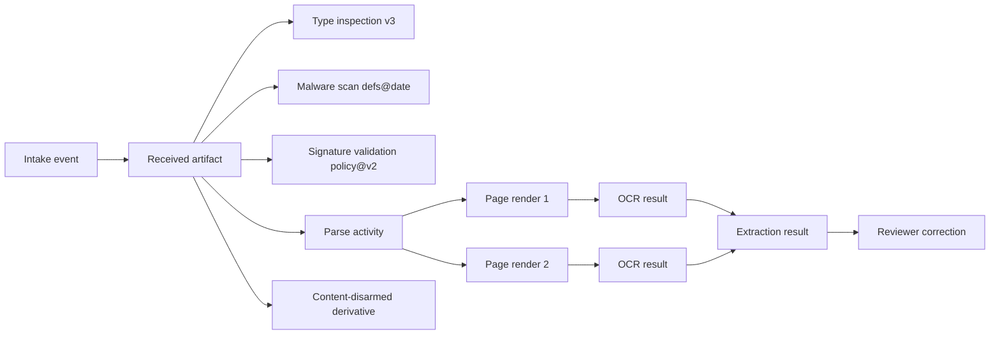

# Intake, Document Identity, Lineage, and Storage

**Purpose:** Preserve what was received, distinguish transport events from document identity, model exact and business duplicates, and make every derivative and reprocessing result traceable.  
**Research baseline:** 2026-08-31

## Why identity comes before OCR

Without a stable identity model, the system cannot answer basic production questions:

- Did the same bytes arrive twice, or are these two revisions of one business document?
- Which pages and embedded files were actually processed?
- Did a later OCR/model version change an amount that was previously approved?
- Which original supports a record in the destination system?
- Does a deletion or legal hold cover the original, page renders, crops, OCR, cache, and evaluation copy?

A filename, upload URL, PDF `/ID`, email subject, invoice number, model-assigned class, or OCR text is not a safe primary identity. Each can be absent, duplicated, attacker-controlled, or change during processing.

## Separate five identities

| Identity | Meaning | Example | Mutability |
|---|---|---|---|
| `intake_id` | One receipt event from one channel | Upload, email attachment, API object, scanner batch | Append-only |
| `artifact_id` | One exact byte object/version | The received PDF or embedded XLSX bytes | Immutable |
| `document_id` | One logical document recognized by the application | Invoice, claim form, contract, cover letter | Stable; assertions may change |
| `revision_id` | One content revision of a logical document | Rescanned signed version, amended invoice | Immutable |
| `processing_run_id` | One attempt/version of the processing pipeline | OCR v4 + invoice schema v7 | Append-only |

Add `bundle_id` for a transport containing several logical documents and `effect_operation_id` for a later filing, payment, signature, or release. Do not overload `document_id` with workflow-run or destination identifiers.

## Intake envelope

The trusted intake gateway creates the envelope; document metadata cannot rewrite it.

```yaml
intake:
  intake_id: "in_01K4..."
  tenant_id: "tenant_7f2"
  principal_id: "user_1842"
  purpose: "accounts-payable-intake"
  channel: "supplier-portal"
  channel_message_id: "upload_8ec1"
  received_at: "2026-08-31T08:14:52Z"
  declared_filename: "Invoice-August.pdf"   # untrusted display metadata
  declared_media_type: "application/pdf"    # untrusted hint
  declared_size_bytes: 842193
  source_ip_class: "external"
  region_policy: "in-ap-south"
  retention_class: "finance-seven-years"
  legal_hold_ids: []
  request_id: "req_01K4..."
```

The gateway should stream bytes into quarantine while computing a digest and enforcing transport size/time limits. It must not parse, render, preview, unzip, or call a model in the request process.

## Commit the immutable original

The byte-commit transaction should establish:

```yaml
artifact:
  artifact_id: "art_01K4..."
  object_uri: "quarantine://tenant_7f2/art_01K4.../version/193847"
  object_version: "193847"
  byte_length: 842193
  sha256: "2d5d...b81a"
  computed_at: "2026-08-31T08:14:53Z"
  stored_media_type: "application/octet-stream"
  claimed_filename: "Invoice-August.pdf"
  encryption_key_ref: "tenant/7f2/document-originals"
  retention_class: "finance-seven-years"
  write_receipt: "store-receipt-8912"
```

The object key should be application-generated. Keep the original filename as escaped metadata only; never use it as a filesystem path or object authorization boundary.

SHA-256 establishes exact-byte equality with negligible accidental-collision risk for this use. It does **not** establish:

- authorship, signature validity, or absence of tampering before receipt;
- that two visually identical files have the same bytes;
- that two different invoice files represent the same obligation;
- that an attacker is permitted to learn whether another tenant stored those bytes.

Use a storage version/generation plus digest. A mutable object key with only a database hash is not an immutable original.

## Artifact manifest

Large or regulated exchanges benefit from a manifest model similar to BagIt: opaque payloads plus checksums and descriptive tag information. A complete processing manifest should cover originals and derivatives, even if the implementation does not literally package a BagIt bag.

```json
{
  "manifest_version": "doc-manifest/1.0",
  "bundle_id": "bun_01K4...",
  "payloads": [
    {
      "artifact_id": "art_01K4...",
      "role": "received-original",
      "sha256": "2d5d...b81a",
      "bytes": 842193,
      "object_version": "193847"
    }
  ],
  "derived": [],
  "intake_ids": ["in_01K4..."],
  "created_at": "2026-08-31T08:14:53Z"
}
```

Sign or protect the manifest when it serves an evidentiary or inter-organizational transfer requirement. A checksum detects byte changes; it is not a signature or trusted timestamp.

## Inspect without mutating identity

After commit, an isolated inspector may create observations:

- detected MIME/type candidates and signature/extension disagreements;
- encryption/password/signature/macro/active-content flags;
- container and embedded-object tree;
- page count candidates and parser warnings;
- decompressed size, nesting depth, pixel dimensions, and resource estimates;
- digital-signature containers and validation results;
- malware/CDR decisions and scanner version.

These are versioned observations about `artifact_id`. Do not modify the artifact row as successive scanners disagree. Preserve each result and let policy choose a disposition.



W3C PROV’s entity/activity/agent vocabulary is a useful interchange model: artifacts and results are entities, parsing/OCR/review are activities, and services or people are agents. The operational database can remain simpler, but it should preserve equivalent `used`, `wasGeneratedBy`, `wasDerivedFrom`, `wasAssociatedWith`, and invalidation relationships.

## Page identity and completeness

Do not use only `page_number`. A stable page record should include:

```yaml
page:
  page_id: "pg_01K4..."
  source_artifact_id: "art_01K4..."
  source_page_index: 0      # internal zero-based index
  display_page_number: 1   # UI value
  page_render_artifact_id: "art_render_01K4..."
  render_sha256: "91c2...a83f"
  render_profile: "pdfium@build-7e91;300dpi;srgb;autorotate=false"
  width_px: 2480
  height_px: 3508
  transform_to_source: [1, 0, 0, 1, 0, 0]
  parse_warnings: []
```

The page manifest must record expected and completed pages before aggregation. Never treat “some page workers succeeded” as a complete document.

| Completeness check | Failure disposition |
|---|---|
| Parser page counts disagree | Alternate parser or human/security review |
| A page render is missing | Run remains partial; no extraction acceptance |
| Blank page detected | Retain it; label blank candidate; do not silently drop |
| Page order uncertain | Preserve received order and flag for review |
| Duplicate page within packet | Record page-level duplicate signal; do not remove until business rule confirms |
| Expected continuation/backside absent | Document completeness exception |

## Rendition and visible-state semantics

One source page can have several materially different renditions. Keep a distinct identity for each instead of treating `page_id` as a pixel blob:

| Rendition | Purpose | Evidence rule |
|---|---|---|
| Source object view | Preserve PDF/Office object structure, layers, annotations, forms, signatures, and incremental revisions | Never execute active content; retain parser observations and signed-byte coverage |
| Canonical review render | Stable human review and evidence coordinates | Pin renderer/build/profile and digest; this is the default visible evidence only for its declared rendering policy |
| OCR input render | Resolution/colorspace/preprocessing optimized for recognition | New derivative with transform and declared losses; never replace review evidence silently |
| Alternate renderer view | Detect parser/render differentials or ambiguous appearance | Store as a competing observation and require disposition when material views disagree |
| Redacted/disarmed view | Purpose-limited disclosure or safer presentation | Label as derivative; record removed/flattened features and never call it the original |
| Region/crop | Minimized input for OCR, VLM, or review | Bind to parent rendition, exact polygon/transform, digest, tenant, purpose, and retention |

A rendition record should include `rendition_id`, source artifact version, source page index, renderer/transformation profile, output digest, dimensions, coordinate transform, included/excluded layers and annotations, color/alpha policy, redaction/CDR status, and declared uses. Evidence anchors point to a specific rendition and retain a transform back to the source page.

PDF incremental revisions, annotations, optional-content groups, form appearances, embedded fonts, transparency, and damaged objects can cause two renderers—or one renderer with different flags—to show different pixels. A cryptographic signature may cover an earlier byte revision while a later permitted or impermissible change affects the visible page. When the visible difference can change a field, signature interpretation, or classification, stop automatic acceptance and preserve both views plus the signature-validation report.

Version semantics are append-only:

- changing renderer build, DPI, colorspace, annotation/form policy, preprocessing, or orientation creates a new rendition version;
- re-OCR references the exact rendition digest it consumed;
- a review decision binds the exact rendition/evidence version displayed;
- a later rendition defect creates an affected cohort and reprocessing run, not a mutation of old evidence;
- deletion, retention, legal hold, residency, and tenant policy traverse every rendition and crop.

## Embedded documents and containers

ZIP, email, PDF portfolios, and Office files can contain nested documents. Model them as a containment graph:

```text
parent_artifact_id + child_artifact_id + embedded_path + ordinal + depth
+ extractor_version + child_sha256 + truncation_status
```

The embedded path is untrusted metadata, not an extraction path. Assign every child a generated artifact ID and its own digest, policy, scan, and disposition. Enforce maximum depth, count, total expanded bytes, compression ratio, individual child size, and processing time.

Apache Tika 4.0 documents containment IDs and synthetic paths, but its security model explicitly says Tika is not a security boundary. It also documents that some unpack truncation is reported only in logs, not the overall success status. Production adapters must convert truncation, skipped children, and limit events into first-class incomplete results.

## Derivatives are new artifacts

Common derivatives include:

- rasterized pages and thumbnails;
- normalized orientation/deskewed images;
- OCR text, hOCR/ALTO, layout graphs, and table structures;
- content-disarmed or flattened copies;
- redacted copies and field/page crops;
- document splits and merged review packets;
- model request images and structured response snapshots.

For every derivative, record:

| Field | Requirement |
|---|---|
| Identity | New artifact/result ID and object version |
| Parentage | One or more exact parent IDs and derivation role |
| Transformation | Tool, build/model, configuration, code digest, prompt/schema if applicable |
| Integrity | Output digest and byte length |
| Coordinates | Transform between source and derivative coordinate systems |
| Loss | Dropped content, redaction, flattening, truncation, resolution, color, or compression |
| Policy | Tenant, data class, purpose, residency, retention, hold, and access |
| Actor/time | Workload identity, start/end, request/provider job IDs |

A content-disarmed PDF is not “the safe original.” It is a derivative. Flattening can remove embedded files, active content, annotations, layers, forms, or signatures and can change what a human sees. Preserve the original and explicitly state the derivative’s allowed use.

## Duplicate taxonomy

“Duplicate” must name a comparison level.

| Level | Signal | Meaning | Safe automated action |
|---|---|---|---|
| Transport duplicate | Same channel message/request identity | Sender retried the same delivery | Reuse intake response; preserve retry audit |
| Exact-byte duplicate | Same tenant/policy scope and SHA-256 + length | Identical bytes | Link a new intake to existing artifact; reuse compatible derived results |
| Visual duplicate | Page/render perceptual similarity | Looks similar after rendering | Queue/link candidate; do not merge records automatically |
| Textual duplicate | Normalized OCR/text fingerprint similarity | Similar extracted content | Candidate only; OCR may erase meaningful differences |
| Business duplicate | Same issuer, number, date, amount, account/case, etc. | May represent the same obligation/record | Apply domain rules and review before suppressing/effecting |
| Revision/variant | Same logical document with meaningful changes | New signed, corrected, or annotated version | Create revision and diff; keep both |

### Exact duplicate algorithm

Within one authorized deduplication scope:

1. Canonicalize no bytes; hash exactly what was received.
2. Look up `(tenant_scope, sha256, byte_length)` using a constant-response authorization-safe API.
3. If absent, write the object with a conditional create and store its version receipt.
4. If present, verify stored digest/length and link the new `intake_id` to the existing `artifact_id`.
5. Reuse a processing result only if pipeline, configuration, schema, purpose, data policy, and result-retention state are compatible.
6. Never expose “another tenant already has this document” through timing, messages, counts, object identifiers, or cache hits.

Storage-level deduplication across tenants may be an internal optimization only if encryption, key destruction, residency, isolation, billing, deletion, legal hold, and existence privacy are all correct. The safer default is tenant-scoped logical deduplication.

### Business duplicate decision

Use explicit features and outcomes:

```yaml
duplicate_assessment:
  assessment_id: "dup_01K4..."
  left_document_id: "doc_A"
  right_document_id: "doc_B"
  ruleset_version: "invoice-duplicate/6"
  features:
    supplier_id: {match: true, evidence: ["...field ids..."]}
    invoice_number: {match: "normalized", edit_distance: 0}
    currency_amount: {match: true}
    invoice_date: {delta_days: 0}
    purchase_order: {match: true}
    page_visual_similarity: 0.997
  decision: "review_required"
  reason: "same business keys, different signed page bytes"
```

Do not ask a model for a bare duplicate yes/no. It may propose an assessment, but deterministic rules, field evidence, existing destination records, and policy own the decision.

## Document, packet, and revision relationships

One intake artifact can contain many documents; one logical document can span multiple artifacts; one packet can be a revision of another. Use explicit edges:

| Relation | Example |
|---|---|
| `contains` | Email contains PDF and spreadsheet |
| `split_from` | Invoice pages 3–5 split from a 20-page batch |
| `continues` | Backside page continues a form |
| `attachment_to` | Supporting receipt belongs to claim form |
| `revision_of` | Signed PDF revises unsigned PDF |
| `supersedes` | Corrected invoice replaces erroneous invoice |
| `duplicate_candidate_of` | Similar business identifiers pending disposition |
| `translation_of` | Certified translation linked to source document |
| `redacted_from` | Disclosure copy derived from protected original |

Relationships are assertions with actor, method, confidence, evidence, and version. A corrected split or duplicate decision creates a new assertion/version; it does not erase the previous model decision.

## Reprocessing and result identity

Every processing run pins its behavior:

```yaml
processing_run:
  processing_run_id: "run_01K4..."
  artifact_id: "art_01K4..."
  pipeline_release: "doc-pipeline/3.8.2+sha.9b127"
  parser_profile: "tika-pipes/4.0.0@cfg-7c91"
  renderer_profile: "pdfium@build-7e91;300dpi"
  ocr_profile: "enterprise-ocr/region/version/flags"
  extraction_schema: "invoice/7.2.0"
  model_profile: "provider/model-snapshot/prompt-sha/schema-sha"
  policy_bundle: "doc-policy/2026-08-15@a84e"
  requested_by: "reprocess-job-55"
  reason: "model-upgrade-shadow"
  supersedes_run_id: "run_01JZ..."
```

Reprocessing rules:

- Read the exact preserved artifact version, not a mutable download URL.
- Produce new page/OCR/extraction/result versions, even when bytes match.
- Diff fields, document boundaries, pages, validation, confidence, and review disposition.
- Do not mutate a previously approved or effected extraction.
- Do not automatically re-send downstream effects. Create a separate correction/reversal/amendment workflow when policy allows.
- Keep old code or compatible workers long enough to resume queued workflows, or migrate them through a tested version boundary.

## Storage layout and ownership

| Store | Content | Recommended properties |
|---|---|---|
| Quarantine object store | Received and embedded bytes | No public serving, no execution, generated keys, tenant keys, versioning, short controlled access |
| Record/original archive | Admitted originals requiring retention | Immutable/versioned policy, legal hold, integrity inventory, restricted retrieval |
| Derived artifact store | Pages, crops, sanitized/redacted copies, OCR payloads | Content-addressable within tenant, lineage, lifecycle, access by role/purpose |
| Operational database | Intakes, artifacts, runs, states, relations, reviews, effects | Transactions, constraints, optimistic concurrency, auditable migrations |
| Search/index | Approved searchable text/metadata | ACL and purpose filters, version/tombstone, rebuildable from authoritative records |
| Evaluation store | Licensed, consented, de-identified test examples and labels | Separate access/retention, provenance, no silent production copying |
| Audit store | Policy, actor, transition, review, effect records | Append-only/tamper-evident controls, independent access, defined retention |

WORM controls can protect required records, but configuring them is a governance decision. Cloud object-lock systems generally protect specific object versions and support time retention and/or legal hold; they do not decide which documents must be retained, nor do they solve privacy deletion by themselves.

## Integrity verification and inventory

Run scheduled reconciliation independent of the processing workflow:

1. Enumerate expected object versions from the artifact database.
2. Compare storage inventory, version, length, retention, hold, encryption, and digest metadata.
3. Sample or fully re-hash according to risk and storage guarantees.
4. Detect orphan objects, missing database rows, delete markers, unexpected versions, and policy drift.
5. Reconcile derived lineage: every derivative parent exists or has an authorized tombstone.
6. Alert on missing audit/effect receipts and retention-policy changes.

Do not let telemetry sampling be the only record of a write or transformation.

## Failure matrix

| Failure | Unsafe shortcut | Required behavior |
|---|---|---|
| Upload ends mid-stream | Parse partial bytes | Abort intake or record incomplete artifact that cannot be admitted |
| Object write succeeds, DB response is lost | Upload again under new identity | Reconcile request/intake ID and object receipt before retry |
| Hash exists | Drop new event | Preserve new intake; link exact artifact only within policy |
| Parser reports 12 pages, renderer 11 | Accept 11 | Mark incomplete; alternate parse or review |
| Embedded extraction reaches limit | Treat parent as fully parsed | Record skipped/truncated children and block completeness-dependent output |
| CDR produces clean copy | Replace original | Store derivative with loss/signature warnings and parent digest |
| Reprocessing changes total | Update old record | New result/diff; route correction workflow; never replay old effect |
| Legal hold arrives during deletion | Delete derivatives first | Atomically freeze applicable graph, record conflict, and escalate |
| Tenant cache collision | Share result | Scope lookup and encryption; prevent existence leak |

## Acceptance checklist

- [ ] Exact bytes are durable and digest-verified before any parser sees them.
- [ ] Every intake remains visible even when it links to a prior exact artifact.
- [ ] Page and embedded-object completeness are first-class states.
- [ ] Original, sanitized, redacted, rasterized, and OCR artifacts have distinct identities.
- [ ] Coordinate transforms allow evidence to be rendered against the original page.
- [ ] Business duplicate decisions are evidence-backed, versioned, and reversible.
- [ ] Reprocessing never rewrites approved history or silently repeats an effect.
- [ ] Inventory reconciliation detects missing/orphan versions and policy drift.
- [ ] Holds and deletion traverse the complete artifact/result graph.

## Sources

- [RFC 8493: The BagIt File Packaging Format](https://www.rfc-editor.org/rfc/rfc8493)
- [W3C PROV overview](https://www.w3.org/TR/prov-overview/)
- [W3C PROV constraints](https://www.w3.org/TR/prov-constraints/)
- [Library of Congress ALTO description](https://www.loc.gov/standards/alto/description.html)
- [Apache Tika embedded document metadata](https://tika.apache.org/docs/4.0.x/advanced/embedded-documents.html)
- [Apache Tika unpack safety limits](https://tika.apache.org/docs/4.0.x/pipes/unpack-config.html)
- [Amazon S3 Object Lock](https://docs.aws.amazon.com/AmazonS3/latest/userguide/object-lock.html)
- [Azure immutable Blob storage](https://learn.microsoft.com/en-us/azure/storage/blobs/immutable-storage-overview)
- [Google Cloud Storage Bucket Lock](https://docs.cloud.google.com/storage/docs/bucket-lock)
