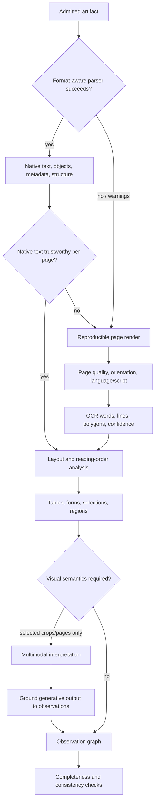

# Document Understanding: OCR, Layout, Tables, Images, and Handwriting

**Purpose:** Convert admitted bytes into evidence-bearing page observations without flattening away structure or inventing missing content.  
**Research baseline:** 2026-08-31

## The output is a page model, not a text dump

Plain text loses the information needed to validate most production documents:

- page and region location;
- reading order and section hierarchy;
- key/value relationships and selection marks;
- row/column/cell spans and table headers;
- printed versus handwritten text;
- images, charts, stamps, signatures, and barcodes;
- visibility, layers, annotations, comments, and embedded content;
- which characters came from native text, OCR, correction, or a generative model.

The understanding stage should produce an immutable, versioned **observation graph**. Classification and extraction consume it but cannot silently rewrite it.

## Representation cascade



The cascade is page-specific. A 200-page born-digital PDF may contain one scanned signature page; forcing OCR on every page wastes time and may degrade searchable text.

## Format-aware parsing

The parser should identify, but not execute:

- PDF objects, text runs, fonts/maps, pages, annotations, attachments, forms, signatures, actions, and encryption;
- OOXML/ODF package structure, document text, comments, revisions, relationships, media, formulas, macros, and external links;
- email headers, MIME parts, attachments, and nested messages;
- image frames, EXIF/orientation, color profile, pixel size, and compression;
- archive/container entries and nesting.

Parsing untrusted formats belongs in the isolated cell described in [security and privacy](05-security-privacy-tenancy-retention-and-deletion.md). The parser result must include warnings, skipped objects, time/memory/output limits, and crash/timeout status. A partial parse is not success.

### Native text trust checks

Use native PDF/Office text when it is complete and maps coherently to the visible page. Route a page to OCR or review when checks find:

- empty or near-empty text on a nonblank rendered page;
- replacement characters, broken font maps, or implausible Unicode distributions;
- text coordinates outside the page or extreme overlap;
- invisible/white/off-page text that differs materially from the visible render;
- duplicated text layers from prior OCR;
- implausible reading order in columns, tables, or rotated regions;
- a rendered content region with no corresponding text;
- a digital signature or incremental revision whose visible state requires separate validation.

Native text and OCR can both be retained as candidates. Do not merge their characters without recording the reconciliation method.

## Reproducible rendering

Pin the rendering implementation and profile because page pixels are model input and review evidence.

```yaml
render_profile:
  engine: "pdfium"
  build: "7e91f2"
  dpi: 300
  colorspace: "sRGB"
  alpha_background: "white"
  annotations: "render-separately"
  form_appearance: "captured"
  autorotate: false
  anti_aliasing: "engine-default@7e91f2"
```

Retain source-to-render coordinate transforms. A later reviewer must be able to highlight a field on the correct original page even if the OCR engine used normalized `[0,1]` coordinates or a deskewed crop.

Use multiple renderers only as a targeted diagnostic for parser differentials or high-risk formats. Different rendering does not by itself establish which view is legally or semantically authoritative.

## Page quality and preprocessing

Measure before changing pixels:

| Signal | Why it matters | Response |
|---|---|---|
| Effective DPI/text height | Small glyphs increase recognition error | Higher-quality rescan or specialist OCR |
| Blur/compression/noise | Confusable digits and punctuation | Denoise/alternate OCR; retain raw render |
| Skew/perspective/warping | Breaks lines, forms, and table grids | Derived deskew/dewarp with transform |
| Rotation/orientation | Changes reading order and language handling | Detect then record orientation transform |
| Clipping/cut-off edges | Missing totals, signatures, IDs | Completeness exception, not a blank field |
| Low contrast/background | Faxes, thermal receipts, watermarks | Binarization/contrast variants as derivatives |
| Blank/near-blank | May be valid backside or separator | Preserve and classify; never silently delete |
| Duplex/order anomaly | Mispaired form sides | Packet-level review |

Preprocessing should be an evaluated pipeline, not a pile of image filters. Over-binarization can erase faint handwriting, stamps, decimal points, or security features. Keep each materially different image derivative and its transform/configuration.

## OCR contract

An OCR output should carry at least:

```json
{
  "page_id": "pg_01K4...",
  "source_render_sha256": "91c2...a83f",
  "engine": "provider-or-local/region/version",
  "configuration_sha256": "e17a...92f1",
  "languages_requested": ["en", "hi"],
  "languages_detected": [{"tag": "en", "score": 0.94}],
  "orientation_degrees": 0,
  "tokens": [
    {
      "token_id": "tok_000184",
      "text": "1,240.50",
      "text_kind": "printed",
      "confidence_raw": 0.93,
      "polygon_normalized": [[0.71, 0.82], [0.83, 0.82], [0.83, 0.85], [0.71, 0.85]],
      "line_id": "line_42",
      "reading_order": 184
    }
  ],
  "warnings": []
}
```

Raw OCR confidence is engine-specific. Keep it for calibration and diagnostics; do not relabel it “probability correct.”

### Engine selection

| Choice | Best fit | Trade-offs |
|---|---|---|
| Managed document OCR | Fast deployment, pretrained layouts/languages, variable volume | Data boundary, region/version availability, page pricing, quotas, vendor-specific schema |
| Tesseract | Local printed OCR, many languages, reproducible baseline | Image preprocessing and layout quality matter; not a complete document workflow |
| Open-source document stack such as Docling | Local parsing/layout/tables with pluggable OCR/VLM | Model/dependency/GPU operations and rapid version change |
| Custom/fine-tuned OCR | Stable high-value script/capture domain with sufficient labels | Dataset, calibration, maintenance, and drift burden |
| General multimodal model as OCR | Complex pages or residual fallback after benchmarking | May omit/rewrite/hallucinate text; evidence and cost are harder |

Cloud feature claims are not equivalent. For example, current official documentation describes:

- Amazon Textract block relationships, geometry, confidence, tables, queries, signatures, layout types, and printed/handwriting labels, but fixed quotas include important language and vertical-text limitations;
- Google Document AI `Document` entities with text/page anchors, normalized vertices, detected languages, nested properties, normalized values, and processor-specific versions/regions;
- Azure Document Intelligence layout spans, polygons, tables, selection marks, and handwriting style, with API-version- and input-format-specific differences.

Pin the exact processor and region. “Textract,” “Document AI,” or “Document Intelligence” is not a reproducible model identifier.

Before a route can serve production traffic, complete the [provider and self-hosted adapter qualification](09-provider-and-self-hosted-adapter-qualification.md). Qualify synchronous and asynchronous semantics, result pagination/sharding, page-set completeness, raw-response retention, coordinate transforms, release maturity, exact region and processing path, quotas, result-retention/deletion behavior, contract drift, and failure recovery. A provider response that parses successfully is not evidence that every requested page was processed.

For self-hosted routes, pin more than the package version: OCR language/model data, parser backend, layout/table weights, preprocessing, runtime/native libraries, accelerator/driver/precision, plugin policy, remote-service policy, and configuration digest all belong in provenance. Benchmark quality and tail latency on the exact hardware/runtime profile promoted to production.

## Layout and reading order

The page model should preserve:

- region class: title, heading, paragraph, list, header/footer, footnote, table, figure, caption, form, code/formula, stamp, signature candidate;
- region polygon and parent/child hierarchy;
- sequence/read-order edges with confidence and method;
- text span/token membership;
- repeated furniture versus body content;
- cross-page continuation and section relationships.

Do not infer reading order solely from top-to-bottom coordinates. Multi-column pages, sidebars, footnotes, rotated text, tables, forms, and floating captions require layout context. Evaluate reading order separately from OCR character accuracy.

ALTO is a useful interchange option for OCR text and physical layout; METS can provide structural/administrative context. Provider-native graphs may be richer. The internal schema should retain source-native payloads and map them into a stable application model rather than discard fields during normalization.

## Tables

A table is a grid and relationship structure, not Markdown text.

```yaml
table:
  table_id: "tbl_18"
  page_ids: ["pg_3", "pg_4"]
  region_evidence: ["ev_88", "ev_144"]
  header_rows: [0]
  rows: 14
  columns: 6
  cells:
    - cell_id: "cell_0_0"
      row: 0
      column: 0
      row_span: 1
      column_span: 2
      role: "column_header"
      literal: "Description"
      token_ids: ["tok_221", "tok_222"]
      polygon_normalized: [[0.1, 0.3], [0.5, 0.3], [0.5, 0.34], [0.1, 0.34]]
  continuation:
    next_table_id: "tbl_19"
    repeated_header_detected: true
```

Validate tables at several levels:

| Level | Checks |
|---|---|
| Detection | Correct page region; no omitted or merged adjacent table |
| Structure | Rows, columns, merged/spanning cells, headers, reading order |
| Text | Cell literals, punctuation, signs, decimals, units, footnote markers |
| Semantics | Column types, currencies, dates, line-item grouping |
| Arithmetic | Subtotals, taxes, discounts, quantities × unit price, grand total |
| Continuation | Repeated headers, carry-over rows, page break, table identity |

Never let arithmetic validation “correct” the observation. Keep the literal cell, propose a normalized/corrected candidate, and route disagreement according to field risk.

Markdown or CSV exports are views. They cannot represent every merged-cell, header, footnote, coordinate, or cross-page relationship and must not become canonical evidence.

## Images, charts, stamps, signatures, and codes

### Images and figures

Extract or crop a figure only when a downstream task needs it. Preserve its page region, source render digest, crop transform, caption relationship, and image type. A generated description is an interpretation, not the figure itself.

For charts, separate:

- visible title/legend/axis labels from OCR;
- detected chart/plot regions;
- digitized data, if attempted, with a dedicated uncertainty model;
- model-generated description or conclusion.

Do not treat a chart caption as the chart’s numeric data.

### Stamps and signature observations

An image or layout model may detect a signature-like mark or stamp region. That observation does not prove identity, intent, certificate validity, signing authority, or document integrity. Keep separate statuses:

- `visual_mark_detected`;
- `cryptographic_signature_present`;
- `cryptographic_signature_valid_under_policy`;
- `signer_identity_resolved`;
- `signer_authority_verified`;
- `document_revision_covered`.

Digital-signature validation must inspect the signed byte ranges, certificate/trust/revocation/timestamp evidence, permitted modifications, and current validation policy. Use a dedicated validation service/library and retain its report.

### Barcodes and QR codes

Decode with a specialized library. Treat decoded text/URLs as untrusted data. Bind the symbol polygon and raw payload to the page. Verify structured identifiers or signed payloads with the relevant scheme. Never automatically follow an embedded URL from the parse/model lane.

## Handwriting

Handwriting requires a distinct quality and authority policy:

- detect printed/handwritten regions and mixed text;
- route only the region to a measured handwriting model;
- preserve strokes/ink as pixels; do not replace with a clean transcription;
- use lexicons only as candidate constraints, never to fill a missing name/amount;
- evaluate by writer, capture device, form, language/script, and field type;
- lower straight-through authority for critical numeric or identity fields unless local evidence supports it;
- show reviewers the region at useful scale plus neighboring labels and alternate candidates.

Public handwriting sets such as IAM are useful component baselines but do not represent local cursive, forms, abbreviations, scripts, scanners, or demographic distribution. Local consent/licensing and reviewer adjudication are essential.

## Multilingual and mixed-script documents

Language is a page/region property, not only a document property. The pipeline should:

1. retain all Unicode literals without transliteration;
2. record detected language/script and score per page/region;
3. use locale-aware OCR and normalization;
4. distinguish translated, transliterated, and original values;
5. preserve right-to-left order and bidirectional controls safely in UI/logs;
6. test vertical text, diacritics, ligatures, locale decimals/dates, and mixed scripts;
7. route unsupported or low-quality scripts to specialist review.

Provider language coverage can differ between OCR, queries, handwriting, and specialized extractors. Verify the exact feature path instead of relying on a product-wide language list.

## Multimodal model strategy

### Prefer grounded, selective calls

A model request should include only the pages/crops and observations needed for one typed task. Example:

```yaml
multimodal_task:
  task: "resolve_invoice_total_candidate"
  immutable_constraints:
    tenant_id: "tenant_7f2"
    document_id: "doc_01K4..."
    schema_field: "invoice.total_gross"
    allowed_page_ids: ["pg_2"]
  observations:
    - candidate: "1,240.50"
      token_ids: ["tok_184"]
    - candidate: "1,240.80"
      token_ids: ["tok_alt_91"]
  images:
    - crop_artifact_id: "crop_01K4..."
      sha256: "1fa8...90c2"
  required_output:
    candidate: "one of supplied candidates or abstain"
    supporting_token_ids: "non-empty when candidate chosen"
    rationale_code: "enum"
```

Do not ask the model to invent a value when evidence is absent. Constrain high-risk resolution to observed candidates or `abstain`.

### Three useful model patterns

| Pattern | Use | Gate |
|---|---|---|
| Visual classification | Choose among declared classes or `unknown` | Class-specific calibration and page evidence |
| Schema extraction | Produce typed fields from selected pages | Literal/evidence binding, validation, abstention |
| Exception comparison | Compare OCR/layout candidates or explain conflict | Candidate-constrained output and deterministic judge |

Full-page “convert everything to Markdown/JSON” models can be useful for exploratory ingestion or complex layout benchmarks. They should not be assumed complete: compare page count, region coverage, literal text, tables, and evidence against the original before using their output for consequential records.

## Disagreement and fallback

| Condition | Action |
|---|---|
| Native text and OCR agree | Prefer native literal with both provenance records if policy permits |
| Native text invisible but OCR matches visible page | Flag hidden-layer anomaly; use visible evidence for extraction |
| OCR engines disagree on low-risk body text | Choose calibrated primary or retain alternatives |
| Engines disagree on critical amount/ID | Deterministic checks, targeted crop model, then human review |
| Layout model misses a region | Alternate layout/renderer on that page; mark completeness risk |
| VLM returns text with no page/token/region support | Reject as ungrounded |
| Handwriting unsupported | Abstain and route to specialist queue |
| Provider limit/quota reached | Backpressure or approved fallback; never silently truncate pages |

Fallback changes the pipeline version. Record which path executed and evaluate each path separately; aggregate metrics can hide a dangerously weak fallback.

## Failure matrix

| Failure | Detection | Safe response |
|---|---|---|
| OCR layer duplicates native text | Overlap/text repetition checks | Select representation per region; preserve both |
| Decimal point lost | Arithmetic/locale/reference validation | Targeted crop and review; never round into validity |
| Table split across pages | Header/geometry/continuation signals | Link table segments and validate complete grid |
| White hidden text injects instructions | Render/text differential and untrusted-data policy | Flag anomaly; never treat content as instruction |
| Page is rotated 90° | Orientation/line geometry | Derived rotation with transform, rerun selected stages |
| Faint handwriting erased by preprocessing | Raw/processed image comparison | Retain raw, alternate preprocessing, specialist review |
| OCR provider returns fewer pages | Manifest reconciliation | Partial state; retry missing pages or alternate route |
| Figure caption hallucinated as data | Evidence type/region validation | Reject value unless tied to visible numeric evidence |
| Barcode contains URL | Payload type policy | Store/display safely; do not fetch in processing lane |

## Acceptance checklist

- [ ] Page text is classified as native, OCR, corrected, or generated at token/span level.
- [ ] Renderer, OCR, layout, and preprocessing profiles are versioned and reproducible.
- [ ] Page count and region completeness block acceptance when uncertain.
- [ ] Tables retain grid structure, spans, headers, coordinates, and literal cell text.
- [ ] Images, signatures, stamps, and codes remain observations, not proof of authority.
- [ ] Handwriting and language/script slices have separate quality and review policies.
- [ ] Multimodal outputs are constrained, schema-valid, and grounded to supplied evidence.
- [ ] Provider quota/limit fallback cannot drop pages or silently change quality.

## Sources

- [Amazon Textract response blocks, confidence, and geometry](https://docs.aws.amazon.com/textract/latest/dg/how-it-works-document-layout.html)
- [Amazon Textract fixed limits and language coverage](https://docs.aws.amazon.com/textract/latest/dg/limits-document.html)
- [Google Document AI response model](https://docs.cloud.google.com/document-ai/docs/reference/rest/v1/Document)
- [Google Document AI processor list and versions](https://docs.cloud.google.com/document-ai/docs/processors-list)
- [Azure Document Intelligence layout model](https://learn.microsoft.com/en-us/azure/ai-services/document-intelligence/prebuilt/layout)
- [Library of Congress ALTO](https://www.loc.gov/standards/alto/description.html)
- [Tesseract README and output formats](https://github.com/tesseract-ocr/tesseract/blob/main/README.md)
- [Docling model catalog](https://github.com/docling-project/docling/blob/main/docs/usage/model_catalog.md)
- [PubTables-1M paper](https://openaccess.thecvf.com/content/CVPR2022/papers/Smock_PubTables-1M_Towards_Comprehensive_Table_Extraction_From_Unstructured_Documents_CVPR_2022_paper.pdf)
- [IAM Handwriting Database](https://fki.tic.heia-fr.ch/databases/iam-handwriting-database)
