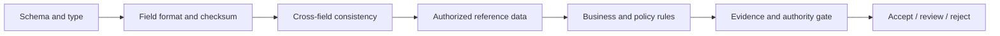

# Classification, Extraction, Validation, Confidence, and Review

**Purpose:** Turn page observations into versioned typed candidates, prove where each value came from, calibrate acceptance by business risk, and route exceptions into an effective human queue.  
**Research baseline:** 2026-08-31

## Keep observation, interpretation, and decision separate

| Layer | Example | Owner |
|---|---|---|
| Observation | Page 2 contains visible tokens `Total`, `1,240.50`, and `USD` in these polygons | Parser/OCR/layout activity |
| Interpretation | `1,240.50` is a candidate for `invoice.total_gross` | Extractor/model activity |
| Normalization | Decimal `1240.50`, currency `USD` | Versioned normalizer |
| Validation | Line items + tax − discount equal `1240.50` within policy tolerance | Deterministic validator |
| Acceptance | Field may proceed automatically for this tenant/class/authority tier | Policy engine or reviewer |
| Effect decision | The accepted record may create a payable draft, but payment still needs separate approval | Workflow/effect policy |

Collapsing these layers makes it impossible to distinguish OCR error, model mapping error, normalization error, business inconsistency, and policy rejection.

## Classify and split before extracting

A transport packet may contain multiple documents, attachments, separators, and unrelated pages. The classifier should produce page-level and document-level candidates:

```yaml
classification:
  result_id: "cls_01K4..."
  taxonomy_version: "ap-documents/5.1"
  page_predictions:
    - page_id: "pg_1"
      class: "cover_letter"
      score_raw: 0.91
    - page_id: "pg_2"
      class: "invoice"
      score_raw: 0.98
      starts_document: true
    - page_id: "pg_3"
      class: "invoice"
      score_raw: 0.96
      continues_document: true
  document_candidates:
    - pages: ["pg_2", "pg_3"]
      class: "invoice"
      alternative_classes: ["credit_note"]
  disposition: "review_required"
  reason_codes: ["cover_page_unattached"]
```

The taxonomy needs `unknown`, `mixed`, and `unsupported`. Forcing every input into a known class raises downstream false accepts. Hierarchical classes are often useful—`financial_document → invoice → utility_invoice`—but every level needs local evaluation and a clear schema mapping.

### Split invariants

- Preserve received page order and original page IDs.
- A page may be shared only when the business definition permits it; otherwise flag an ambiguous boundary.
- Attachments are explicit relationships, not concatenated into the parent’s text.
- Expected page/section rules can detect missing pages but cannot fabricate them.
- A corrected split creates a new document version and invalidates dependent extraction candidates; it does not delete prior evidence.

## Versioned extraction schemas

Use JSON Schema 2020-12 or an equivalently explicit type system for structural validation. Add workload annotations outside the generic schema vocabulary for evidence, authority, and review rules.

```json
{
  "$schema": "https://json-schema.org/draft/2020-12/schema",
  "$id": "https://schemas.example.internal/invoice/7.2.0",
  "type": "object",
  "additionalProperties": false,
  "required": ["supplier", "invoice_number", "invoice_date", "currency", "total_gross"],
  "properties": {
    "invoice_number": {
      "type": "string",
      "minLength": 1,
      "maxLength": 80,
      "x-authority": "material",
      "x-evidence": "required"
    },
    "invoice_date": {
      "type": "string",
      "format": "date",
      "x-locale-policy": "tenant-source-locale"
    },
    "currency": {
      "type": "string",
      "pattern": "^[A-Z]{3}$"
    },
    "total_gross": {
      "type": "string",
      "pattern": "^-?[0-9]+(\\.[0-9]{2})$",
      "x-authority": "critical",
      "x-evidence": "required",
      "x-review-on-conflict": true
    }
  }
}
```

Use strings for externally exact decimals and identifiers until domain parsing is complete. Binary floating point is a poor interchange representation for money. Store parsed decimal/currency types in the application database with explicit scale and rounding policy.

### Schema governance

| Change | Version behavior |
|---|---|
| Add optional field | Compatible minor if consumers tolerate it |
| Add required field | New major/contract version for queued runs |
| Change normalization or enum meaning | New semantic version even if JSON shape is unchanged |
| Rename/split/merge field | Migration mapping plus old/new comparison |
| Change authority or review policy | Policy version and re-evaluation decision |
| Change prompt/model only | New extractor version; schema may stay constant |

Pin the schema in each run. Do not serve a mutable “latest” schema to a workflow that may resume after weeks.

## Field result contract

The output contract must distinguish what the page says from what the application believes it means.

```yaml
field_result:
  field_result_id: "fld_01K4..."
  processing_run_id: "run_01K4..."
  schema_id: "invoice/7.2.0"
  json_pointer: "/total_gross"
  status: "candidate"  # missing | candidate | accepted | invalid | conflicting | not_applicable
  literal: "1,240.50"
  normalized:
    value: "1240.50"
    type: "decimal"
    currency: "USD"
    normalizer: "money-en-US/4"
  evidence:
    - evidence_id: "ev_01K4..."
      artifact_id: "art_01K4..."
      page_id: "pg_2"
      page_render_sha256: "91c2...a83f"
      token_ids: ["tok_184"]
      text_span: {start: 842, end: 850}
      polygon_normalized: [[0.71, 0.82], [0.83, 0.82], [0.83, 0.85], [0.71, 0.85]]
      crop_artifact_id: "crop_01K4..."
  extraction:
    method: "specialized_model"
    model: "provider/processor/version/region"
    score_raw: 0.93
  validations:
    - rule: "line_items_plus_tax_minus_discount_equals_total/3"
      status: "pass"
      observed_delta: "0.00"
  calibrated:
    correctness_probability_estimate: 0.986
    calibration_profile: "invoice.total_gross/en/scan/vendor-17/model-x@2026-08"
  authority_tier: "critical"
```

The calibrated estimate is optional. If local calibration is weak or the input is out of distribution, set it unknown and route accordingly.

## Evidence anchors

A field can have multiple evidence regions or spans across pages. Evidence should support:

- exact page rendering and highlight in the reviewer UI;
- verification that the literal matches tokens/text at the anchor;
- provider-neutral coordinates plus the provider-native anchor payload;
- a content digest to detect drift;
- relationships such as label/value, table cell/header, checkbox/question, or signature/role;
- alternate and contradictory anchors.

W3C Web Annotation selectors provide useful concepts such as text-position, text-quote, and fragment/region selection. In practice, combine page ID, normalized polygon, token/span IDs, exact literal/quote, and render digest. Position alone breaks when OCR text is regenerated; quote alone is ambiguous when values repeat.

### Evidence quality states

| State | Meaning | Automated authority |
|---|---|---|
| `direct_visible` | Literal appears visibly in declared region | Eligible after other checks |
| `derived_from_table` | Value computed from grounded cells | Eligible only if rule and cells are accepted |
| `normalized_from_literal` | Deterministic locale/type transform | Eligible if transform is reversible/explainable |
| `cross_document_lookup` | Value comes from authorized reference, not the page | Must identify reference source and policy |
| `inferred` | Plausible interpretation not directly stated | Never silently present as observed; normally review |
| `missing` | No supporting observation | Cannot be auto-filled |
| `conflicting` | Multiple material observations disagree | Review or deterministic precedence policy |

## Extraction strategies

| Strategy | Best use | Main risk | Required control |
|---|---|---|---|
| Template/coordinates | Stable fixed forms | Layout revision drift | Template version and drift detector |
| Regex/rules over native/OCR text | Known identifiers, dates, labels | Wrong occurrence/reading order | Region and label/value binding |
| Specialized pretrained processor | Common invoices, receipts, IDs | Domain/version limits and opaque score | Local per-field eval and pinned processor |
| Custom supervised extractor | Repeated proprietary documents | Dataset/label drift, maintenance | Held-out source/time splits and label QA |
| Multimodal schema extraction | Heterogeneous layouts and semantic fields | Hallucination, omission, weak anchors | Structured output, evidence constraint, validation, abstention |
| Agentic exception comparison | Residual ambiguous cases | Tool misuse and nonreproducibility | Bounded candidates/tools/budget and deterministic judge |

Use ensembles selectively. Two models agreeing is evidence only if their errors are sufficiently independent and both are grounded. Models using the same OCR, training data, or foundation model can agree on the same wrong value.

## Deterministic validation stack

Apply validations in an explainable order:



### Validation categories

| Category | Examples | Failure meaning |
|---|---|---|
| Structural | Required, array cardinality, enum, decimal/date syntax | Output contract invalid |
| Lexical | Check digit, ID length, allowed script, currency code | Literal/normalization suspect |
| Cross-field | Subtotal + tax − discount = total; start ≤ end | Internal document inconsistency or extraction error |
| Cross-page | Page totals, continuation, repeated identifier | Packet may be incomplete or mis-split |
| Reference | Supplier/customer/case/PO exists under tenant and purpose | Ambiguous or unauthorized entity match |
| Temporal | Date not implausibly future/expired; policy effective date | Context inconsistency |
| Duplicate | Business keys and destination record collision | Potential repeated obligation/effect |
| Authority | Required evidence, reviewer role, approval tier | Candidate cannot be used for this effect |

Validation failure does not always mean rejection. A real document can contain invalid or inconsistent data. Preserve both the extracted observation and the failed rule, then let the case policy route it.

### Never use the model as the only validator

A second prompt asking “is this extraction correct?” is correlated with the first and lacks an authoritative oracle. Models can help explain a failed rule or compare bounded evidence, but schema, arithmetic, check digits, identity lookup, page completeness, and authority are application responsibilities.

## Confidence is a decision problem

Provider/model scores can reflect token likelihood, detector confidence, geometry confidence, class score, or undocumented combinations. Modern neural networks can be miscalibrated. Treat raw scores as features, not probabilities.

### Calibrate locally

Build calibration profiles by the slices that materially change error:

- field and document class;
- model/processor/version and configuration;
- language/script and handwriting/printed status;
- source/vendor/form revision and capture channel;
- scan-quality band, page/layout type, and out-of-distribution signal;
- evidence/validation/disagreement state.

Use a held-out calibration set that is separate from training and final evaluation. Reliability diagrams, Brier/log loss, calibration error, and risk–coverage curves are more informative than a single threshold.

Do not copy a vendor example such as `0.80` into production policy. Official Azure guidance presents such a value only as an illustrative pilot threshold and explicitly recommends use-case evaluation.

### Decide per field and effect

```text
auto_accept(field) when:
  schema_valid
  and evidence_required_is_present
  and no_material_conflict
  and input_in_supported_slice
  and calibrated_risk(field, slice) <= allowed_risk(field, authority_tier)
  and all mandatory_business_rules_pass
  and policy_allows_straight_through
```

Do not average field confidence into a document score. A high-confidence address cannot compensate for an uncertain total or bank account.

### Confidence combination

Keep signals separate in storage and learn/define the decision policy from data:

| Signal | Interpretation |
|---|---|
| OCR token/region score | Text recognition/geometry confidence from one engine |
| Extraction score | Mapping of evidence to a schema field |
| Validation state | Deterministic consistency evidence |
| Model disagreement | Potential uncertainty, not proof of error |
| Input quality/OOD | Whether calibration is applicable |
| Prior source reliability | Operational feature; must not override direct evidence or create unfair treatment |
| Reviewer history | Queue/risk feature; protect against feedback leakage and reviewer bias |

Avoid an undocumented weighted average. If a composite risk model is used, version it, calibrate it, explain its features, and evaluate group/source slices.

## Abstention and exception routing

An exception is a typed work item, not a generic “low confidence” bucket.

```yaml
review_task:
  review_task_id: "rev_01K4..."
  tenant_id: "tenant_7f2"
  document_id: "doc_01K4..."
  extraction_version: "ext_01K4..."
  queue: "ap-critical-amount"
  reason_codes:
    - "ocr_disagreement"
    - "critical_field_below_risk_threshold"
  fields: ["/total_gross"]
  evidence_ids: ["ev_01", "ev_02"]
  candidate_ids: ["cand_01", "cand_02"]
  required_role: "accounts_payable_reviewer"
  priority: 80
  due_at: "2026-08-31T12:00:00Z"
  state: "available"
  lease_version: 0
```

Useful queues include:

- security/quarantine;
- unsupported/encrypted/corrupt;
- classification/split ambiguity;
- missing page or required field;
- OCR/handwriting/locale uncertainty;
- schema/cross-field/reference conflict;
- business duplicate;
- critical-field dual control;
- approval/effect recovery;
- privacy/deletion/hold conflict.

## Human review interface

Review quality is part of model quality. The UI should show:

- exact original page and a clear “derivative” label where applicable;
- highlighted field crop plus enough label/row/page context;
- literal candidates and their distinct evidence, not just model prose;
- normalization and each failed/passed rule;
- document/revision/duplicate signals and destination facts when authorized;
- reason, authority tier, SLA, and allowed dispositions;
- keyboard/accessibility support, zoom, rotation, and page navigation;
- a safe rendering path that does not execute links, macros, scripts, forms, or embedded objects.

Do not show the model’s preferred value in a way that anchors reviewers before they inspect evidence. For critical evaluations, measure blinded or candidate-order-randomized review.

### Review dispositions

| Disposition | Meaning | Result |
|---|---|---|
| Confirm candidate | Evidence supports selected literal/normalization | New reviewed field version |
| Correct from evidence | Reviewer transcribes visible source | New literal/normalized result and correction label |
| Mark missing/illegible | Source does not support a value | Explicit missing state |
| Mark document invalid/incomplete | Document itself fails requirement | Case exception/rejection |
| Request better source | Rescan/resubmit required | Durable wait with source request |
| Escalate domain/security/privacy | Outside reviewer authority | New typed queue |

Reviewer action never mutates OCR or prior extraction. It creates a new review decision and accepted result version, linked to exact evidence and reviewer identity.

## Reviewer concurrency and quality

- Lease tasks with expiry and optimistic version checks.
- Reject stale submissions if another reviewer or reprocessing run changed the target.
- Require independent second review for defined critical fields/effects; do not reveal the first decision before the second when independence matters.
- Sample accepted straight-through and reviewed cases for quality control.
- Track corrections by field/source/model/reviewer without ranking people on unadjusted difficulty.
- Maintain adjudicated gold cases for reviewer and model calibration.
- Separate reviewer feedback approved for training from ordinary operational records; apply license, consent, minimization, and retention policy.

## Failure and decision matrix

| Condition | Auto-accept | Review | Reject/escalate |
|---|---:|---:|---:|
| Required field absent, no evidence | No | Yes if recoverable | Reject/request source if required |
| High raw score, failed arithmetic | No | Yes | Domain escalation if document inconsistent |
| Low raw score, strong visible evidence and calibrated low risk | Policy-specific | Possible | No by score alone |
| VLM value not present in evidence | No | Usually | Reject ungrounded candidate |
| Two engines agree, unsupported language/OOD | No | Yes | Specialist if unavailable |
| Critical account/amount changed from prior revision | No | Dual review | Fraud/domain escalation as policy dictates |
| Optional field not applicable | Yes as `not_applicable` if rule proves | Possible | No |
| Exact duplicate with compatible accepted run | Reuse may be allowed | Review if policy/revision ambiguity | Never infer business duplicate from bytes alone |

## Acceptance checklist

- [ ] Classification supports `unknown`, mixed packets, and versioned split corrections.
- [ ] Extraction schemas are immutable/versioned and pinned to runs.
- [ ] Literal, normalized, inferred, missing, conflicting, and not-applicable are distinct.
- [ ] Every material field has reproducible page/span/region evidence.
- [ ] Validation rules and reference snapshots are recorded independently of model output.
- [ ] Thresholds are field/class/slice specific and locally calibrated.
- [ ] Risk–coverage and critical false-accept rates gate straight-through processing.
- [ ] Reviewer tasks are typed, leased, access-controlled, and protected from stale writes.
- [ ] Reviewer changes create new versions and authorized training feedback is separately governed.

## Sources

- [JSON Schema 2020-12 core](https://json-schema.org/draft/2020-12/json-schema-core)
- [JSON Schema 2020-12 validation](https://json-schema.org/draft/2020-12/json-schema-validation)
- [W3C Web Annotation Data Model](https://www.w3.org/TR/annotation-model/)
- [Google Document AI evaluation and confidence thresholds](https://docs.cloud.google.com/document-ai/docs/evaluate)
- [Azure Document Intelligence transparency note](https://learn.microsoft.com/en-us/azure/foundry/responsible-ai/document-intelligence/transparency-note)
- [On Calibration of Modern Neural Networks](https://proceedings.mlr.press/v70/guo17a.html)
- [Selective Classification via One-Sided Prediction](https://proceedings.mlr.press/v130/gangrade21a.html)
- [Google Document AI entity, text-anchor, and page-anchor model](https://docs.cloud.google.com/document-ai/docs/reference/rest/v1/Document)
