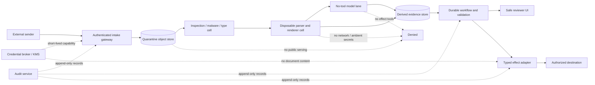
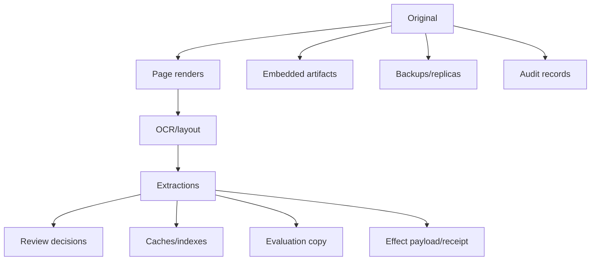

# Security, Privacy, Tenancy, Retention, and Deletion

**Purpose:** Contain hostile document formats and prompt injection, prevent cross-tenant or purpose-incompatible use, and govern sensitive data across the complete artifact lifecycle.  
**Research baseline:** 2026-08-31

## Threat model

Assume an attacker can control any received byte and any content derived from it, including:

- filename, MIME header, file signature, metadata, comments, revision history, and custom properties;
- PDF objects, actions, JavaScript, forms, layers, incremental updates, attachments, links, fonts, images, and signatures;
- Office macros, OLE objects, external relationships, formulas, comments, hidden sheets/slides/text, and tracked changes;
- archives, nested emails, polyglots, parser differentials, compression/zip/XML bombs, huge images, and malformed structures;
- visible, hidden, encoded, multilingual, OCR-only, image, QR/barcode, or metadata prompt injection;
- personal, financial, health, legal, identity, authentication, and payment data;
- plausible business values designed to cause duplicate payment, misfiling, disclosure, or record deletion.

Also assume failures and mistakes:

- a scanner times out or uses stale definitions;
- a parser or model has a vulnerability;
- a provider processes data in an unexpected region or changes a model;
- a reviewer opens the wrong tenant/case or copies content externally;
- logs, traces, caches, backups, and evaluation sets retain data longer than the primary record;
- an authorized employee or workload misuses broad access;
- deletion and legal-hold instructions conflict.

## Trust zones



The parser cell and model lane are deliberately unable to reach the effect adapter. A classifier failing to detect an injection must not grant the injection a path to credentials or external writes.

## Intake and file-admission controls

Apply defense in depth before parsing:

| Control | Requirement |
|---|---|
| Authentication and authorization | Identify uploader/service, tenant, purpose, quota, allowed source/channel |
| Generated storage identity | Ignore filenames for paths/keys; retain escaped name only as metadata |
| Transport limits | Bytes, duration, concurrent uploads, tenant rate, total storage budget |
| Type policy | Decode filename, allow required types only, compare declared type, extension, magic/signature, and parser detection |
| Object commit | Versioned write, SHA-256, byte count, receipt, encryption context before parse |
| Archive/container policy | Depth, entry count, total expanded bytes, compression ratio, per-child bytes, path/Unicode safety |
| Image/PDF limits | Pages, dimensions, megapixels, width/height, render time, output bytes |
| Encryption/password | Reject or route to a controlled password-exchange workflow; never ask a model to guess |
| Malware scanning | Pinned engine/definitions, result and timeout state, quarantine on unavailable/unknown according to risk |
| Active-content inspection | Macros, scripts, actions, external relationships, attachments, embedded objects, links, forms |
| Duplicate check | Tenant/policy scoped; does not bypass scanning required by current policy/version |

OWASP recommends extension allow-lists, type/signature validation, generated names, size limits, storage outside the webroot, authorization, antivirus/sandbox, and CDR where appropriate—and explicitly warns no single technique is sufficient.

### Disposition states

- `ADMITTED`: all mandatory controls passed for the declared pipeline.
- `QUARANTINED`: suspicious, unknown, scanner unavailable, encrypted, or policy exception; no routine processing.
- `REJECTED`: unsupported/forbidden or confirmed malicious; preserve only what policy requires.
- `INCOMPLETE`: upload/inspection/embedded traversal hit a limit; never treated as admitted.

Do not map scanner timeout to clean. Do not map parser success to safe.

## Parser and renderer isolation

Apache Tika’s own security model says parsing untrusted data is dangerous and Tika is not a security boundary. Apply the lesson to all file libraries.

Minimum parse-cell controls:

- disposable VM/container/process with a fresh work directory;
- unprivileged UID, read-only input, write-only bounded output, no host paths or sockets;
- no cloud metadata, control-plane, internal service, or internet network route;
- no ambient credentials, user tokens, model keys, signing keys, or object-store list permission;
- CPU, wall-time, memory, file-count, output, process/thread, and disk quotas;
- fixed parser configuration and allow-listed external executables with absolute paths;
- patched, pinned images/dependencies plus vulnerability response and rollback;
- one hostile object or small bounded batch per worker, with worker recycling;
- sanitized error capture that does not expose paths, secrets, or document data;
- explicit `TIMEOUT`, `OOM`, `CRASH`, `LIMIT`, `PARTIAL`, and `UNSUPPORTED` results.

In-process timeouts do not reliably stop native code, uninterruptible calls, or memory exhaustion. Use an external supervisor that can terminate the process/cell.

### Parser differentials and polyglots

MIME detection and format validation can disagree. For high-risk paths:

- compare extension, signature, container structure, and two independent detectors where useful;
- reject or quarantine polyglot/chimeric objects and mismatched types;
- record the parser chosen and why;
- do not let the user select arbitrary parser classes or external command arguments;
- verify that the same object does not render materially different content across required viewers/parsers.

No detector proves a file benign. The isolation boundary must survive a missed detection.

## Macros, embedded content, and links

### Office macros and active objects

- Never execute VBA, Office scripts, add-ins, formulas, external data connections, or embedded OLE objects during extraction.
- Treat macro presence and signature as observations; a signed macro is not automatically authorized.
- Open/render/convert only in an isolated noninteractive environment with network disabled.
- Preserve macro-enabled originals and label any macro-free derivative.
- Do not rely on desktop Office defaults such as “macros from the internet are blocked”; server-side pipelines need their own enforcement and may not preserve Mark of the Web.

### PDF active content

Inventory JavaScript/actions, launch actions, URI actions, forms/XFA, annotations, multimedia/3D, portfolios, attachments, and incremental updates. Do not execute or fetch them. Amazon Textract’s current fixed limits, for example, state that XFA-based PDFs are unsupported; unsupported interactive content must be surfaced, not silently assumed absent.

### Embedded files

Every embedded object becomes its own quarantined artifact. Enforce recursive limits. Do not expose internal container paths as filesystem paths, and do not serve embedded objects inline to reviewer browsers.

### Links and QR codes

Decoded URLs remain inert strings. If link reputation or retrieval is required, create a separate, policy-controlled network task with:

- explicit user/business purpose;
- URL canonicalization and scheme/host/port policy;
- redirect, DNS rebinding, private/loopback/metadata address, and egress controls;
- no document/model secrets in query strings, headers, or referrers;
- downloaded content returning through quarantine;
- a separate approval for any outbound transmission.

## Content Disarm and Reconstruction

CDR/flattening can reduce active-content risk for supported formats, but it is a transformation, not a proof of safety.

| Benefit | Limitation |
|---|---|
| Removes known active features and rebuilds supported content | May lose comments, forms, layers, attachments, metadata, fonts, accessibility, or fidelity |
| Produces a safer review/distribution derivative | Parser/rendering vulnerabilities can still exist |
| Can normalize complex formats | May invalidate cryptographic signatures and evidentiary equivalence |
| Limits active content reaching users | Does not remove semantic prompt injection visible as ordinary text/image |

Store the original and CDR output separately with tool/config/version, loss report, and both digests. Define allowed use: for example, CDR copy for reviewer display, original for evidentiary retention and signature validation.

## Prompt injection isolation

Indirect prompt injection is an authority-confusion attack: untrusted document content imitates instructions and tries to redirect the model or cause data disclosure/effects. It can be visible, white-on-white, off-page, hidden in metadata/comments, encoded, in images/QR codes, or produced by OCR.

### Required architecture

1. The trusted task envelope is created outside document content.
2. Document text, metadata, images, OCR, and model-derived descriptions carry an untrusted provenance label.
3. Extraction/classification model calls have no effect tools, credentials, unrestricted network, or cross-document memory.
4. Model output is typed data and must reference declared evidence.
5. Tool eligibility, tenant, purpose, object IDs, budgets, and destinations come only from trusted workflow state and current policy.
6. Any agentic resolver receives a closed tool set and cannot widen it from document content.
7. Consequential actions use an effect intent built from accepted fields, then pass independent authorization and approval.
8. Egress is independently restricted so a compromised model cannot exfiltrate through arbitrary links, image loads, Markdown, or tool arguments.

Delimiters, instruction-hierarchy prompts, prompt-injection classifiers, hidden-text detectors, and OCR/render differentials are useful detection layers. They are not the security boundary. Current primary-source guidance treats prompt injection as an evolving social-engineering problem and recommends constraining impact even when attacks succeed.

### Channels to test

- visible body, headers/footers, footnotes, tables, handwriting;
- metadata, comments, annotations, tracked changes, hidden sheets/slides/text;
- white/off-page/zero-size/overlay text and duplicate OCR layers;
- images, steganographic-looking text, QR/barcodes, alt text, filenames;
- embedded documents, email threads, ZIP entry names;
- model/tool/provider error messages and returned URLs;
- delayed injection stored in reviewer correction, cache, index, memory, or training feedback.

## Tenant and purpose isolation

Every access decision should bind:

```text
principal/workload + tenant + purpose + object/resource ID + operation
+ data class + region + time + case/run/effect scope + policy version
```

### Isolation requirements

| Surface | Control |
|---|---|
| Object storage | Tenant-aware authorization, generated keys, object version binding, encryption context, no list-by-default |
| Operational DB | Tenant key in constraints/queries, row policy where useful, tests with denied principals |
| Queue/workflow | Tenant and region in routing; worker capability scoped to one cell or allowed partition |
| Cache | Key includes tenant/purpose/policy and pipeline versions; no cross-tenant existence signal |
| Model/provider | Per-tenant/project credentials where risk warrants; region/data-use policy; request minimization |
| Review UI | Server-side object authorization on every page/crop; no guessable URLs; safe headers/download policy |
| Search/index | ACL and purpose filter before retrieval; version/deletion propagation |
| Telemetry | IDs/pseudonyms, no raw page/field by default; restricted debug capture |
| Evaluation/training | Separate lawful basis, consent/license, minimization, provenance, retention, access |

A model prompt saying “only use tenant A” is not tenant isolation.

### Confused deputy defenses

- Never accept tenant/object IDs only from model output.
- Resolve canonical resource IDs under the authenticated principal before tool dispatch.
- Use short-lived workload tokens with audience, resource, operation, and expiry constraints.
- Do not give parser/model workers permission to enumerate storage.
- Recheck authorization after review waits and before every effect or export.
- Prevent result/crop URLs from being bearer capabilities with long uncontrolled lifetimes.

## PII and regulated-data boundaries

Document intelligence often expands sensitive data: one original can become OCR text, crops, embeddings, traces, review screenshots, and model-provider requests. Maintain a data-flow inventory for each derivative.

### Data minimization

- Process only pages/regions/fields required for the purpose.
- Prefer crop-level model calls when full pages are unnecessary.
- Redact or tokenize before lower-trust providers when the task permits.
- Keep literal sensitive values out of ordinary logs, metrics, trace attributes, exception messages, URLs, and queue names.
- Do not copy production documents into evaluation/training by default.
- Use reference handles instead of account numbers, health identifiers, or names in model/tool state where possible.
- Define whether provider logging, abuse monitoring, human access, training, caching, and backup retention meet the data policy.

### Regulatory examples are scoping inputs, not a checklist

- GDPR principles include purpose limitation, data minimization, accuracy, storage limitation, integrity/confidentiality, accountability, and rights such as erasure subject to exceptions.
- The HIPAA Security Rule requires appropriate administrative, physical, and technical safeguards for ePHI; official guidance highlights access, audit, integrity, authentication, and minimum-necessary considerations.
- PCI DSS v4.0.1 governs environments storing, processing, or transmitting account data; sensitive authentication data has strict storage prohibitions after authorization.

Exact obligations depend on role, jurisdiction, sector, contract, and use. Obtain records/privacy/security/legal review. Do not claim compliance because encryption or one cloud certification is present.

## Provider boundary assessment

Before sending any document or crop to a managed OCR/model service, record:

| Question | Required evidence |
|---|---|
| Where is data processed and stored? | Exact product, processor/model version, endpoint, region, preview/GA status, subprocessor terms |
| Is data retained or used for training? | Current service/data-processing terms and configuration |
| Who can access it? | Customer/provider support and privileged-access controls |
| Which keys protect it? | Transport, at-rest, customer-managed-key support and limitations |
| What enters logs/telemetry? | Service logging and customer instrumentation behavior |
| How is deletion handled? | Online, batch, output bucket, provider jobs, backups, support artifacts |
| What are quotas/limits? | Page/file/format/region limits and failure behavior |
| Can behavior change? | Pinned versions, lifecycle/retirement notice, preview/global-endpoint caveats |

One current Google Document AI layout-parser preview explicitly documents use of a global Gemini endpoint that does not satisfy its data-residency designation. This illustrates why a product name or regional API URL is insufficient; verify each processor version.

The provider assessment is an input to the concrete [adapter qualification dossier](09-provider-and-self-hosted-adapter-qualification.md). A route is admitted only when runtime tests agree with the documented processing path, temporary result retention/deletion, identity/resource scope, result completeness, and failover region. Contract terms without a versioned runtime route are insufficient; runtime behavior without current contractual/security evidence is also insufficient.

## Retention, legal hold, and deletion

### Retention is a graph policy



For each node/edge define data class, purpose, retention start event, duration, legal basis, hold behavior, deletion method, backup expiry, and proof. Derivatives should not default to longer retention than originals without an explicit reason.

### Legal hold

- Resolve holds against canonical subject/case/document IDs and traverse applicable artifacts/results.
- Record who placed/removed the hold, authority, scope, time, and reason code.
- Prevent deletion and retention shortening for held versions.
- Keep hold administration separate from the agent and ordinary reviewer role.
- Re-evaluate pending deletion and reprocessing jobs when a hold changes.

Object-lock/WORM services can enforce version retention, but legal scope still belongs to records governance. Test delete-marker/version semantics and administrative bypass behavior for the selected cloud.

### Deletion workflow

1. Authenticate and authorize the request; resolve subject/tenant/purpose and applicable exceptions/holds.
2. Freeze or fence concurrent processing, review, export, and effect operations.
3. Build a deletion plan over originals, derivatives, object versions, indexes, caches, queues, model/provider jobs, evaluation copies, and backups.
4. Obtain required records/privacy approval for material deletion.
5. Delete or cryptographically render inaccessible using approved mechanisms; record provider/object receipts.
6. Create tombstones sufficient to prevent resurrection without retaining unnecessary content.
7. Verify by inventory, authorized negative reads, index/cache probes, and backup expiry schedule.
8. Reconcile late worker/provider results and reject resurrection from stale messages.
9. Produce a deletion report with exceptions, holds, backup timelines, and verification status.

NIST SP 800-88 Rev. 2 defines media sanitization as making access infeasible for a given effort level and provides program-level guidance. Deleting an object reference, hiding a search result, or removing one database row is not deletion proof.

### Immutability versus erasure

This is a genuine policy tension, not a storage setting to improvise. Separate:

- legally required originals/effect receipts under scoped retention or hold;
- operational derivatives/caches that can expire earlier;
- minimal audit facts from full content;
- reversible governance-mode protection used against accidents from compliance-mode WORM commitments.

Do not place every artifact in irreversible long-term WORM “for safety.” Validate the retention schedule before locking it.

## Security failure matrix

| Injection/failure | Required result |
|---|---|
| Macro-enabled file requests network/PowerShell | Macro never executes; artifact quarantined or parsed in inert mode |
| PDF contains launch action and embedded executable | No action; child artifact separately quarantined; reviewer UI inert |
| Hidden prompt asks model to upload page to attacker | Model has no egress/effect tool; attempt is observable; no data leaves |
| Malware scanner is unavailable | Risk-specific quarantine/backpressure, not clean |
| Parser OOM/crash | Cell terminated; object stays immutable; bounded retry/alternate; no orchestration loss |
| Cross-tenant artifact ID supplied | Server-side authorization denial before storage/model access |
| Debug trace captures bank account | Redaction gate/test blocks release; incident and purge workflow |
| Deletion arrives while review is waiting | Fence case, cancel/expire task, apply hold/retention decision, sweep late results |
| Model/provider changes region behavior | Admission/release gate blocks disallowed processor version |
| CDR copy invalidates signature | Original/signature report retained; derivative labeled unsuitable as signed original |

## Acceptance checklist

- [ ] Upload handling, inspection, parsing, models, review, and effects occupy distinct trust zones.
- [ ] Every parser can be terminated externally and has no ambient credentials or network.
- [ ] Macros, scripts, links, external relationships, and embedded objects never execute in the processing/review path.
- [ ] Scanner timeout/unknown/partial cannot become admitted.
- [ ] Prompt injection cannot widen objects, tenant, tools, network, budget, destination, or authority.
- [ ] Data maps include originals, derivatives, caches, telemetry, evaluation, providers, and backups.
- [ ] Tenant and purpose are enforced server-side on every object and workflow transition.
- [ ] Provider model/version/region/data-use behavior is deployment evidence, not assumption.
- [ ] Holds and deletion fence concurrent work and produce independently verifiable receipts.
- [ ] Security can disable intake, parsing, model calls, exports, or effects independently.

## Sources

- [OWASP File Upload Cheat Sheet](https://cheatsheetseries.owasp.org/cheatsheets/File_Upload_Cheat_Sheet.html)
- [Apache Tika security model](https://tika.apache.org/security-model.html)
- [Apache Tika security and process isolation](https://tika.apache.org/docs/4.0.x/security.html)
- [Microsoft: macros from the internet are blocked by default](https://learn.microsoft.com/en-us/microsoft-365-apps/security/internet-macros-blocked)
- [NIST AI 100-2 E2025 adversarial ML taxonomy](https://csrc.nist.gov/pubs/ai/100/2/e2025/final)
- [Indirect Prompt Injection paper](https://arxiv.org/abs/2302.12173)
- [OpenAI: Designing AI agents to resist prompt injection](https://openai.com/index/designing-agents-to-resist-prompt-injection/)
- [GDPR consolidated text](https://eur-lex.europa.eu/eli/reg/2016/679/oj/eng)
- [HHS HIPAA Security Rule](https://www.hhs.gov/hipaa/for-professionals/security/index.html)
- [PCI DSS document library](https://www.pcisecuritystandards.org/document_library/)
- [NIST SP 800-53 Release 5.2.0](https://csrc.nist.gov/pubs/sp/800/53/r5/upd1/final)
- [NIST SP 800-88 Rev. 2](https://csrc.nist.gov/pubs/sp/800/88/r2/final)
- [Amazon S3 Object Lock](https://docs.aws.amazon.com/AmazonS3/latest/userguide/object-lock.html)
- [Azure immutable storage for blobs](https://learn.microsoft.com/en-us/azure/storage/blobs/immutable-storage-overview)
- [Google Cloud Bucket Lock](https://docs.cloud.google.com/storage/docs/bucket-lock)
- [Google Document AI processor versions and regional caveats](https://docs.cloud.google.com/document-ai/docs/processors-list)
- [ETSI EN 319 142-1 PAdES signatures](https://www.etsi.org/deliver/etsi_EN/319100_319199/31914201/01.02.01_60/en_31914201v010201p.pdf)
