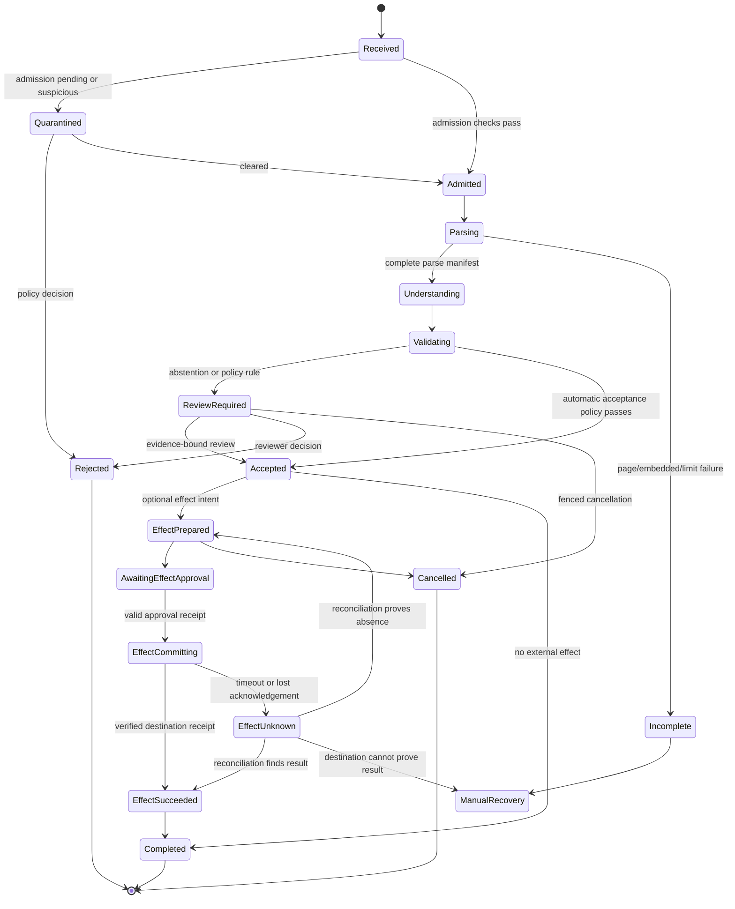
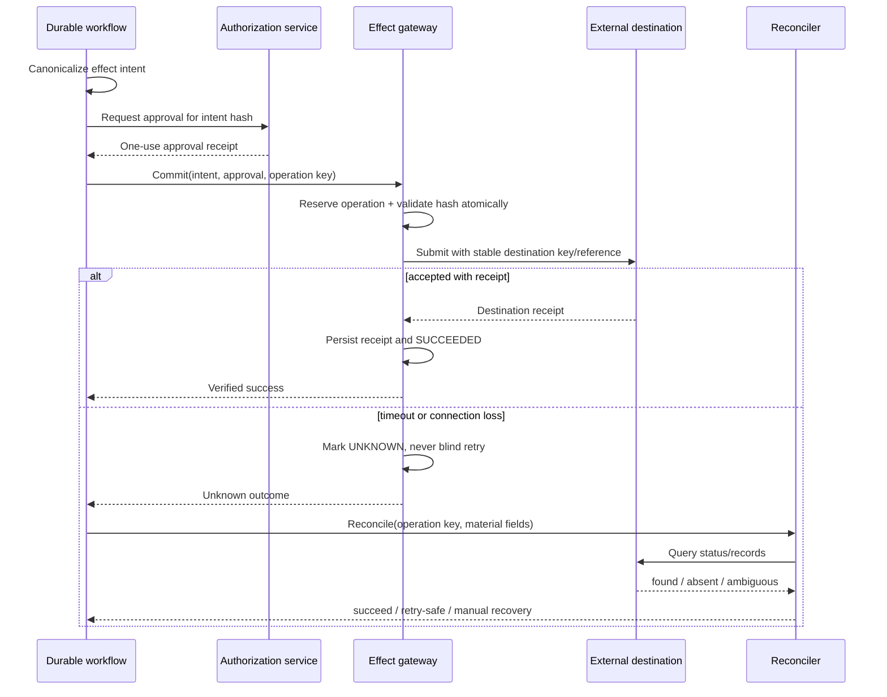

# Workflow State, Approvals, Effects, and Recovery

**Purpose:** Turn document processing into a durable, inspectable workflow without implying that retries make external filing, signing, payment, release, or deletion exactly once.  
**Research baseline:** 2026-08-31

## The reliability boundary

A queue delivers work. A workflow owns the business state that says what may happen next. Keep those responsibilities distinct.

The system can make a local database transition atomic. It cannot atomically commit that transaction with every external authority. If a process crashes after a remote service accepts a request but before the local acknowledgement is stored, the result is **unknown**, not failed. Recovery must query or otherwise reconcile the destination before retrying.

Use a durable workflow when a run can:

- span minutes, days, or retention-policy deadlines;
- wait for a provider, reviewer, approver, signer, or external registry;
- retry transient work while preserving attempt history;
- fan out across pages and join only after completeness is proven;
- survive process, host, or deployment restarts;
- be cancelled, superseded, placed on hold, or reprocessed;
- cause a material external effect.

For a short extraction-only request, a transactional job table and idempotent workers may be enough. Do not introduce a workflow engine merely to wrap a single synchronous call. See [Custom Loop vs Framework vs Workflow Engine](../../comparisons/custom-loop-vs-framework-vs-workflow-engine.md) and [Durable Agent and Workflow Runtimes](../../comparisons/durable-agent-workflow-runtimes.md).

## Separate the records that have different lifecycles

Do not collapse every concern into one `document.status` field.

| Record | Identity | Owns | Must not own |
|---|---|---|---|
| artifact | `artifact_id` | immutable bytes, digest, tenant, lineage, retention | processing success |
| document/revision | `document_id`, `revision_id` | business identity and revision relation | a particular extraction attempt |
| processing run | `processing_run_id` | versioned stage state, attempts, outputs, completeness | approval to create an external effect |
| review task | `review_task_id` | assigned evidence, decisions, reviewer identity, deadline | reusable authorization |
| effect intent | `effect_intent_id` | canonical material arguments and destination | proof that the effect occurred |
| effect operation | `effect_operation_id` | prepare/commit/reconcile attempts and receipt | document truth |

This separation permits a new extraction run without overwriting accepted history or silently reusing an old approval.

## Durable state machine



States are durable facts, not UI labels. Every transition requires:

- current aggregate version and allowed predecessor state;
- actor or service identity, tenant, purpose, policy version, and timestamp;
- input and output references, never mutable embedded blobs;
- an event identifier and causation/correlation identifiers;
- a transition-specific precondition;
- a reason code for rejection, abstention, cancellation, or manual intervention.

Use compare-and-swap or equivalent optimistic concurrency. A late worker holding version 12 must not write after cancellation or reprocessing has advanced the aggregate to version 14.

Persist an application-owned event envelope even when the workflow engine has its own history:

```yaml
document_event:
  event_id: evt_01K
  event_type: page_understanding_completed.v2
  aggregate_type: processing_run
  aggregate_id: run_01K
  prior_version: 12
  new_version: 13
  tenant_id: tenant_42
  actor: svc_doc_understanding
  occurred_at: "2026-08-31T10:11:42Z"
  causation_id: act_01K
  correlation_id: intake_01K
  behavior_bundle_id: doc_bundle_5_3
  payload_ref: result_manifest_77
  payload_sha256: "..."
```

Commit the legal state transition, append-only event, and downstream outbox record in one local transaction or an equivalent atomic boundary. Consumers deduplicate by event/activity identity. Queue delivery order is not global business order; aggregate version and causation establish whether a late or duplicate result is admissible. Telemetry may correlate to the event, but a trace span cannot reconstruct or authorize a lost transition.

## Stage contract and page fan-out

Each activity accepts a versioned input reference and returns a versioned output manifest. It must be safe to repeat or have a compensating/reconciliation protocol.

```yaml
activity_request:
  activity_id: act_01K...
  processing_run_id: run_01K...
  expected_run_version: 12
  tenant_id: tenant_42
  purpose: accounts_payable_validation
  stage: page_understanding
  page_id: page_0007
  input_artifact_sha256: "..."
  parser_version: tika-4.0.0-policy-3
  model_route_version: route-2026-08-31
  schema_version: invoice-4.2.0
  attempt: 2
  deadline: "2026-08-31T10:15:00Z"
```

For fan-out, create the expected page set from the authoritative page manifest before dispatch. The join validates set equality:

```text
expected_page_ids == successful_page_ids
and failed_page_ids is empty
and duplicate_or_unknown_page_ids is empty
```

Counting results is insufficient: two responses for page 4 cannot substitute for a missing page 5. Any forced partial path is explicitly `INCOMPLETE`, carries missing regions/pages, and is ineligible for automatic effects.

## Waiting, deadlines, escalation, and cancellation

Human waits must be modeled, not held in memory:

- persist `available_at`, `due_at`, `escalate_at`, and `expires_at` separately;
- route by tenant, document class, language, sensitivity, and required reviewer role;
- use assignment leases so abandoned work can be recovered;
- expire approvals and effect intents when material inputs change;
- fence the workflow before notifying external workers of cancellation;
- make reminders idempotent and record delivery, not merely enqueueing;
- define what happens when no authorized reviewer exists.

Cancellation is a state transition, not just a message. Workers check a cancellation/fencing token before committing output. External effects already accepted may be irreversible; cancellation then starts reconciliation or an explicit reversal workflow rather than claiming the effect vanished.

## Reprocessing and corrections

Reprocessing creates a new `processing_run_id` with a manifest of all versions. It never rewrites an accepted run.

Reasons include:

- corrected source bytes or a new document revision;
- parser, OCR, model, prompt, schema, validation, or policy change;
- ground-truth correction;
- provider outage or incomplete prior run;
- incident remediation.

A new run does **not** inherit an effect approval. If its canonical material fields differ, the old effect intent is superseded. Even when extraction output is identical, policy decides whether a new approval is required; the decision is recorded.

## Authority model for material effects

The processing system may propose an effect. A deterministic authorization service decides whether the named principal may approve the exact intent. An effect adapter performs only the approved operation.

| Effect | Material data bound into the intent | Required safeguards |
|---|---|---|
| file/submit | jurisdiction, form/version, party, period, destination, attachment digests | filer authority, deadline and destination checks, receipt retrieval |
| sign | exact artifact digest, signer, role, signature purpose/profile, visible representation | signer authentication, certificate/trust validation where applicable, signed-byte preservation |
| pay | payee, account/token, amount, currency, invoice/reference, execution date | separation of duties, payee-change/fraud checks, limits, processor reconciliation |
| release/export | recipient/audience, destination, artifact/field set, data classification, expiry | purpose and tenant policy, DLP/redaction, recipient verification |
| delete | complete deletion graph, subject/tenant, storage classes, hold status, retention policy | hold check, workflow fencing, tombstone/receipt, delayed backup semantics |

Document acceptance only means the evidence satisfied an extraction policy. It does not authorize filing, signing, paying, releasing, or deleting.

## What an approval must sign

Apply the transaction-authorization principle often summarized as “what you see is what you sign”: the reviewer sees and authorizes the material transaction data, not a generic button or mutable document title.

```yaml
approval_receipt:
  approval_id: apr_01K...
  tenant_id: tenant_42
  principal_id: user_123
  role: payment_approver
  authentication_context: phishing_resistant_mfa
  effect_intent_id: intent_01K...
  effect_intent_sha256: "..."
  source_revision_id: rev_07
  accepted_extraction_id: extraction_09
  material_summary:
    payee: "Supplier A"
    destination_token: bank_token_8f3
    amount: "1250.00"
    currency: USD
    invoice_reference: INV-2048
  policy_version: ap-payments-7
  approved_at: "2026-08-31T10:20:00Z"
  expires_at: "2026-08-31T10:35:00Z"
  max_uses: 1
```

The service canonicalizes the intent, hashes it, and compares that hash at commit. Changing destination, source revision, amount, currency, attachment, signer, or recipient invalidates approval. Enforce one-time use in the same local transaction that reserves the operation.

For high-impact paths, enforce separation of duties in policy: the extractor, exception reviewer, effect preparer, and final approver may need different principals. Do not implement it as a front-end convention.

## Effect protocol: prepare, approve, commit, reconcile



### Stable operation identity

An idempotency key identifies one semantic operation, not one network attempt. A practical key is derived from tenant, effect type, approved intent hash, and a stable operation identifier. The gateway stores the canonical request hash with the key and rejects reuse with different parameters.

Do not use a timestamp, retry count, or randomly regenerated UUID on every attempt. That defeats deduplication.

### Local commit protocol

Within one database transaction:

1. Lock or compare-and-swap the effect operation.
2. Verify tenant, state, policy, approval signature/hash, expiry, and remaining uses.
3. Verify the accepted extraction and source revision have not been superseded.
4. Store the canonical request hash and reserve the idempotency key.
5. Consume the one-use approval or bind it exclusively to the operation.
6. Commit state `READY_TO_SEND`.

The network call occurs after that transaction. The resulting receipt or unknown outcome is another durable transition.

### Reconciliation

The destination adapter documents, per operation:

- whether it accepts an idempotency key and how long it retains it;
- which query can find an operation by key, reference, digest, party, or time window;
- which response proves absence versus merely “not yet visible”;
- settlement/finality delay and reversal semantics;
- duplicate detection limitations;
- the evidence retained as a receipt.

If the destination has neither idempotency nor a reliable lookup, automatic retry after ambiguity is unsafe. Route to manual recovery.

## Retry policy by failure class

| Failure | Retry? | Required action |
|---|---:|---|
| validation/schema/policy rejection | no | correct input or policy; new versioned run |
| authentication/authorization denial | no | investigate identity or permission; never broaden scope |
| parser crash on one hostile artifact | bounded, isolated | quarantine after limit; retain crash fingerprint |
| provider 429/temporary 5xx | bounded with jitter | honor server hints, deadline, circuit breaker, quota partition |
| permanent unsupported format/language | no | fallback route or review |
| local transaction conflict | yes | reread state and retry only if transition remains legal |
| external request definitely not sent | yes | same operation and request hash |
| external response lost or timeout after send | not until reconciled | mark `UNKNOWN`; query destination |
| reviewer notification failure | yes | same notification identity; escalation deadline remains |
| workflow code defect | after fix | preserve history; version workflow or migration path |

Retries have a limit, deadline, backoff, and owner. A dead-letter queue is an operational holding area, not a resolution strategy.

## Partial failure and compensation

Multi-document filing, bulk release, or a payment plus ledger update may partially succeed. Record each irreversible boundary independently. A saga can issue compensating actions only when the domain actually supports them.

- A refund is not the same as “payment never occurred.”
- A correction filing does not erase the original filing.
- Revoking a link may not retract a downloaded file.
- A signature cannot be removed from already distributed signed bytes.
- Deleting a database row does not delete provider copies or backups.

Name compensation accurately (`refund_requested`, `correction_submitted`, `access_revoked`) and reconcile it as another effect.

## Workflow engine implementation rules

Whether using Temporal, DBOS, or a project-native transactional workflow:

- keep workflow/orchestration code deterministic where replay is used;
- execute model, parser, network, clock, random, and filesystem operations as activities or recorded effects;
- version workflow changes that can affect replay;
- use activity heartbeats or leases for long processing, with cancellation checks;
- persist only references and small deterministic state in workflow history;
- set timeouts according to provider behavior, document size, and downstream finality;
- define retry policy explicitly rather than inheriting a broad default;
- test worker restart, workflow replay, and deployment rollback with real histories.

Durability prevents lost progress. It does not make a non-idempotent activity safe.

## Recovery sweeps

Scheduled reconcilers should find:

- activities whose lease expired without a terminal result;
- processing runs stuck beyond stage-specific age limits;
- joins with missing, duplicate, or unexpected pages;
- reviews beyond escalation or expiry;
- `READY_TO_SEND` operations never dispatched;
- `SENDING` or `UNKNOWN` effects awaiting reconciliation;
- successful effects missing a destination receipt;
- cancellations with late worker outputs;
- deletion jobs with remaining graph nodes;
- superseded runs that still have active approvals.

Sweep work is tenant-partitioned, bounded, idempotent, and observable. Reconciliation never changes an ambiguous effect to success merely because enough time passed.

## Context assembly, compaction receipts, and memory lifetimes

Conversation history is neither document truth nor workflow state. Build each model context from the current typed stage record, immutable artifact references, page and field evidence, schema/policy versions, review decisions, pending approvals/effects, and the minimum recent interaction needed to interpret the command. Label every element with tenant, document/run identity, source version, trust, sensitivity, freshness, and truncation status. Raw document content remains untrusted data even when it came from an authenticated channel.

Persist a context manifest for every model or bounded-planner call:

```yaml
context_manifest:
  context_manifest_id: ctx_01K
  tenant_id: tenant_42
  document_id: doc_01K
  run_id: run_01K
  task_type: resolve_total_conflict
  immutable_constraints:
    allowed_page_ids: [pg_2]
    allowed_field_ids: [fld_total]
    tool_policy: read_derive_only_v3
    max_steps: 3
    max_cost_usd: "0.04"
  included:
    - {kind: field_candidate, id: cand_9, version: 2, trust: derived}
    - {kind: page_crop, id: crop_7, sha256: "...", trust: untrusted_evidence}
  excluded_counts: {other_pages: 11, prior_chat_turns: 8}
  builder_release: ctx-doc/4.1
  model_profile: provider/model/snapshot
  manifest_sha256: "..."
```

The manifest proves what the model could see and which tools/budgets applied. It does not make model output authoritative. Retrieval and context assembly re-check tenant, purpose, current authorization, deletion/hold state, and artifact version every call; a previously valid pointer can become ineligible.

Use separate memory lifetimes and explicitly reject any layer that has no justified future use:

| Memory class | Suitable document-intelligence contents | Authority and lifecycle |
|---|---|---|
| Turn/scratch memory | One call's candidate classification, field hypotheses, temporary transformations | Ephemeral and non-authoritative; never the only copy of evidence or a review decision |
| Working/run memory | Current stage, page/field work queue, tool results, budgets, conflicts, proposed next step | Typed and checkpointed for recovery; derived from the run aggregate and artifact store |
| Session memory | Authenticated reviewer interaction, active document/run, UI filters, unresolved clarification | Bound to tenant, reviewer, purpose, and expiry; cannot carry authority across sessions |
| Durable workflow memory | Document/run aggregate, events, lineage, field decisions, approvals, effect state, review and reprocessing history | Authoritative application state with version fencing, audit, retention, correction, and deletion policy |
| Domain memory | Versioned schemas, taxonomies, extraction instructions, validators, policy and destination contracts | Curated by named owners, effective-dated, tested, and never silently learned from a document |
| Long-term memory | Curated, reviewed error patterns, source-specific calibration, and approved routing lessons | Optional derived data with provenance, scope, expiry, deletion, poisoning defenses, and release review |
| Episodic memory | Selected closed-run trajectories, corrections, incidents, and downstream defects used for evaluation | Admitted through review; minimized or de-identified where allowed and never authoritative for a new document |
| Raw vector/conversation memory | Unbounded recall of documents, prompts, reviewer chats, or extracted PII | Rejected by default; use permission-filtered, deletion-aware retrieval over governed artifacts instead |

Compact at stage boundaries, before a long wait, or when the context budget is exceeded. The compactor writes a schema-validated **compaction receipt** rather than a prose summary:

```yaml
compaction_receipt:
  receipt_version: 1
  compaction_id: cmp_01K
  tenant_id: tenant_42
  document_id: doc_01K
  run_id: run_01K
  run_state_version: 31
  source_event_range: [evt_1, evt_884]
  artifact_manifest_id: manifest_77
  schema_release: invoice_v8
  policy_release: doc_policy_12
  retained_ids:
    accepted_field_decisions: [fd_9, fd_11]
    unresolved_fields: [total_tax]
    open_reviews: [review_4]
    pending_effects: []
    unknown_effects: []
  unresolved_contradictions: [ocr_total_conflict_2]
  deadlines: {review_4: "2026-09-01T12:00:00Z"}
  remaining_budgets: {steps: 2, provider_calls: 1, cost_usd: "0.02"}
  explicit_omissions: [discarded_scratch_rationale, superseded_candidate_prose]
  context_builder_release: ctx_doc_2026_08_31_1
  compactor_release: cmp_doc_3
  prior_receipt_sha256: "..."
  receipt_sha256: "..."
```

On resume, validate the receipt against the event log, artifact manifest, decisions, approvals, and effect ledger, then reconcile accepted/pending provider jobs and external effects before issuing another tool call. Compaction must preserve exact identifiers, page coordinates, values and units, provenance, schema/policy versions, contradictions, review status, deadlines, budgets, and unknown outcomes. Original evidence survives compaction; missing or inconsistent invariants stop the run instead of being guessed.

Repeated-compaction tests must span more cycles than the longest expected case. Assert that page-set completeness, critical field conflicts, evidence coordinates, tenant/purpose, retention/hold constraints, approval expiry, pending provider jobs, `UNKNOWN` effects, cancellation, and escalation conditions cannot disappear or become more authoritative. Hash-chaining receipts can expose replacement or omission, but the canonical event/evidence stores—not the receipt chain—remain the source of truth.

## Minimum audit events

Record at least:

- state transition requested, accepted, or rejected;
- activity scheduled, started, heartbeated, timed out, cancelled, and completed;
- review assigned, viewed, edited, decided, escalated, and expired;
- effect intent created/superseded;
- approval granted/denied/expired/consumed;
- outbound request hash and destination reference;
- external response class, receipt, and reconciliation result;
- compensation or manual recovery decision;
- code, workflow, policy, schema, parser, model, and provider version manifest.

Audit events contain identifiers and policy-relevant facts, not unrestricted document text or secrets.

## Failure drills

Before enabling effects, demonstrate:

1. Crash before and after every durable transition.
2. Duplicate delivery of every activity completion.
3. Timeout immediately before and after an external destination accepts a request.
4. Late success from a worker after cancellation or supersession.
5. Expired approval, changed material field, and reused approval.
6. Missing page plus duplicate page at the join.
7. Reviewer absence through escalation and expiry.
8. Destination idempotency-key expiry.
9. Workflow upgrade with in-flight histories.
10. Cross-tenant identifier substitution at every API boundary.

No test may assert success from enqueueing alone. Assert the durable state and, for effects, the verified destination receipt.

## Production checklist

- [ ] Business state is separate from queue delivery state.
- [ ] Artifact, run, review, intent, and operation have distinct identities.
- [ ] Every transition has an expected version and a trusted actor.
- [ ] Fan-in validates the exact expected page set.
- [ ] Reprocessing is append-only and cannot silently repeat effects.
- [ ] Approval binds the exact material effect intent and expires.
- [ ] Separation of duties is enforced server-side where required.
- [ ] External operations use stable idempotency identities and request hashes.
- [ ] Lost acknowledgements become `UNKNOWN` and are reconciled before retry.
- [ ] Irreversible partial results and compensations are named honestly.
- [ ] Cancellation fences late workers.
- [ ] Recovery sweeps and failure drills cover every ambiguous boundary.

## Sources

- [Temporal: Workflow Execution](https://docs.temporal.io/workflow-execution)
- [Temporal: Workflow Definition and determinism](https://docs.temporal.io/workflow-definition)
- [Temporal: Retry Policies](https://docs.temporal.io/encyclopedia/retry-policies)
- [DBOS architecture](https://docs.dbos.dev/architecture)
- [Stripe: Idempotent requests](https://docs.stripe.com/api/idempotent_requests)
- [AWS Well-Architected: Make mutating operations idempotent](https://docs.aws.amazon.com/wellarchitected/latest/framework/rel_prevent_interaction_failure_idempotent.html)
- [OWASP Transaction Authorization Cheat Sheet](https://cheatsheetseries.owasp.org/cheatsheets/Transaction_Authorization_Cheat_Sheet.html)
- [NIST SP 800-53 Release 5.2.0, including separation of duties](https://csrc.nist.gov/pubs/sp/800/53/r5/upd1/final)
- [ETSI EN 319 142-1: PAdES digital signatures](https://www.etsi.org/deliver/etsi_EN/319100_319199/31914201/01.02.01_60/en_31914201v010201p.pdf)
- [European Commission eSignature FAQ](https://ec.europa.eu/digital-building-blocks/sites/spaces/DIGITAL/pages/880312429/eSignature%2BFAQ)
