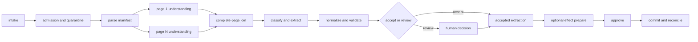
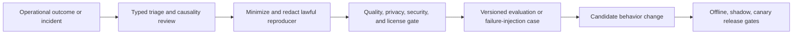

# Observability, Evaluation, and Failure Testing

**Purpose:** Make quality, safety, cost, and recovery measurable at document, page, field, workflow, and external-effect levels.  
**Research baseline:** 2026-08-31

## What must be observable

An overall “document accuracy” number cannot answer the questions production teams face:

- Was every page received and processed?
- Was the wrong document class selected?
- Did OCR fail, or did normalization change a correct literal?
- Is a model confident but miscalibrated on handwritten totals?
- Did human review correct the value but choose the wrong evidence?
- Did the workflow accept an incomplete run?
- Was an external effect sent once, duplicated, or left ambiguous?
- Which tenant, source, language, capture device, or model version regressed?

Measure the stages separately, then connect them through stable identifiers and version manifests.

## Three evidence systems, not one

| System | Primary purpose | Typical contents | Retention/access |
|---|---|---|---|
| telemetry | health, latency, saturation, debugging | metrics, spans, structured operational logs | shortest practical; tightly redacted |
| audit | accountability and policy evidence | durable state changes, identities, decisions, hashes, approvals, effects | policy/legal schedule; append-oriented |
| evaluation corpus | reproducible quality and safety tests | licensed/consented artifacts, ground truth, slice labels, grader versions | separately governed; never sampled casually |

A trace is not an audit log: it can be sampled, dropped, reordered, or retained for less time. An audit log is not a model-training dataset. Do not put raw document content, authentication tokens, bank data, health data, or unbounded model prompts in telemetry.

OpenTelemetry baggage propagates across service boundaries and can be logged by downstream systems. Use opaque identifiers and sanitize inbound trace/baggage headers; never place PII or secrets in them.

## Correlation and version manifest

Propagate only identifiers required to reconstruct a run:

```text
tenant_id
intake_id
artifact_id
document_id / revision_id
processing_run_id
page_id
activity_id / attempt
review_task_id
effect_intent_id / effect_operation_id
trace_id / span_id
```

Every accepted output also points to an immutable manifest containing:

- input and derivative digests;
- parser/OCR/layout/table/model provider, deployment, and immutable version;
- prompt/template and routing-policy versions;
- schema, normalization, validator, acceptance-policy, and calibration versions;
- workflow and effect-adapter versions;
- region and relevant provider processing mode;
- feature flags and deterministic configuration digest.

Without this manifest, a regression cannot be reproduced and a reprocessing decision becomes guesswork.

## Trace shape



Each span records status, attempt, duration, bounded error class, input/output reference, version manifest reference, and resource usage. It does not record full OCR text or page images.

## Example audit event

```json
{
  "event_id": "evt_01K...",
  "event_type": "field.reviewed",
  "occurred_at": "2026-08-31T10:22:10Z",
  "tenant_id": "tenant_42",
  "processing_run_id": "run_01K...",
  "aggregate_version": 18,
  "actor": {
    "type": "human",
    "principal_id": "user_123",
    "role": "invoice_reviewer"
  },
  "field_path": "/invoice/total",
  "previous_value_sha256": "...",
  "accepted_value_sha256": "...",
  "evidence_annotation_id": "ann_774",
  "decision": "corrected",
  "reason_code": "OCR_CONFUSABLE_CHARACTER",
  "policy_version": "invoice-acceptance-8",
  "causation_event_id": "evt_01J...",
  "trace_id": "..."
}
```

Use hashes or separately protected references when values are sensitive. Integrity protection, restricted writers, trusted timestamps, export verification, and retention rules are part of the audit design.

## Operational metrics

### Intake and security

- admitted, quarantined, rejected, and incomplete artifacts by reason;
- declared/observed media-type mismatch, malware/active-content findings, archive expansion, parser crash/timeout;
- exact and business-duplicate rates, including false-merge and missed-duplicate samples;
- cross-tenant authorization denials and injection-test detections;
- artifact and derivative bytes by storage class and retention status.

### Processing

- queue age and depth, active workers, concurrency, saturation, retry and terminal-failure rates;
- stage latency histograms by page band, format, class, language, provider, route, and tenant tier;
- page-completeness failures and fallback-route frequency;
- provider rate-limit, quota, timeout, region-routing, and schema-change errors;
- CPU/GPU time, peak memory, page pixels, OCR/model tokens, and cache hit/miss.

### Quality and review

- coverage, abstention, straight-through-processing, and human-review rates;
- precision/recall/F1 or exact match by field and critical slice;
- calibration error and risk at each auto-accept threshold;
- review edits, reviewer disagreement, turnaround, escalation, and reopen rate;
- evidence-grounding defects and post-acceptance downstream defects;
- critical-value reconciliation failures, such as subtotal + tax != total.

### Effects and recovery

- effect intents prepared, approved, denied, expired, and superseded;
- commits attempted, succeeded with receipt, rejected, unknown, reconciled, duplicated, reversed, and manually recovered;
- age of `UNKNOWN`, stuck workflows, expired leases, and zombie-write rejections;
- deletion graph completion and legal-hold blocks.

Do not label a dashboard metric “accuracy” without naming its unit, population, ground truth, slice, and evaluation version.

## Evaluation corpus strategy

The main corpus must resemble production, not just a public benchmark.

1. Define intended document classes, sources, capture devices, languages/scripts, page counts, quality bands, and effect criticality.
2. Collect only licensed, consented, or otherwise lawfully usable samples; isolate evaluation access and document permitted uses.
3. Sample real hard cases and ordinary cases. A challenge-only set cannot estimate production quality.
4. Preserve time-, sender-, template-, device-, and vendor-based holdouts to expose memorization and template leakage.
5. Include clean negatives: absent fields, non-target classes, attachments, cover sheets, duplicates, revisions, and conflicting values.
6. Create synthetic corruptions and adversarial documents as supplemental tests, clearly labeled as synthetic.
7. Freeze a release-gate set; use a separate development set to avoid tuning directly against the gate.
8. Version artifacts, annotations, adjudications, slice labels, and graders.

Production feedback is not automatically ground truth. Reviewer edits can contain mistakes or reflect a UI constraint. Require adjudication before adding them to a release gate or training set.

## Public datasets: useful but insufficient

| Dataset | Useful component | Important limitation |
|---|---|---|
| FUNSD | scanned-form understanding and entity relations | small, English, narrow form distribution |
| DocLayNet | diverse human-annotated page layout | layout only; not the target business-field distribution |
| PubLayNet | large-scale scientific-document layout | automatically derived labels and publication-domain bias |
| DocVQA | question answering grounded in document images | QA metric does not certify page completeness or workflow safety |
| PubTables-1M | table detection/structure recognition | scientific tables differ from invoices, forms, statements, and poor scans |
| CORD | receipt parsing | limited receipt domain and geography/language distribution |
| SROIE | scanned receipt OCR and key information extraction | historical competition dataset; narrow capture/domain mix |
| IAM | English handwriting recognition | handwritten lines/forms are not equivalent to mixed printed business documents |

Use these for component comparisons and regression smoke tests. Never infer production readiness from a leaderboard result alone.

## Ground truth model

Ground truth should use the same distinctions as runtime output:

- literal observation and its page/region evidence;
- normalized value and normalization rule;
- semantic field/class;
- missing, not applicable, illegible, inferred, or conflicting state;
- table cell coordinates, spans, headers, and reading order where relevant;
- document/revision and duplicate relationships;
- expected workflow disposition and permitted effects.

Double-annotate a representative subset. Track inter-annotator agreement by field and slice, and adjudicate disagreements with a documented rule. Low agreement may reveal an ambiguous schema or business policy rather than a model problem.

## Graders by layer

### Intake, identity, and completeness

- byte digest and format classification exactness;
- expected versus observed page-set equality;
- attachment/embedded-object inventory precision and recall;
- exact, near, business-duplicate, and revision pair classification;
- false cross-tenant linkage rate, whose acceptable target is zero.

### OCR and layout

- character error rate (CER) and word error rate (WER), with Unicode normalization documented;
- token/line/region detection precision and recall at stated IoU thresholds;
- reading-order and hierarchy agreement;
- language/script detection and orientation accuracy;
- region grounding: whether the accepted value maps to the correct page polygon.

Report whitespace, punctuation, case, locale, and normalization treatment. A normalized exact-match grader must not hide an incorrect literal amount.

### Classification and fields

- per-class precision, recall, F1, support, and confusion matrix;
- micro and macro metrics, plus business-weighted critical errors;
- literal exact match, normalized exact match, numeric/date tolerance where explicitly allowed;
- precision/recall/F1 for present fields and correctness of null-state distinctions;
- evidence-supported accuracy and unsupported-value rate;
- constraint satisfaction without silently replacing observed values.

### Tables

- table detection at region level;
- row/column/cell structure, spanning-cell, header, and reading-order scores;
- cell literal/normalized exact match;
- business reconciliation, such as line-extension and total equations;
- TEDS or GriTS when compatible with the representation, alongside field-level checks.

A single structural score can hide one wrong amount in an otherwise perfect table. Critical cells need their own metric.

### Confidence and selective automation

Provider confidence values are features, not portable probabilities. Calibrate the final decision per field/class/slice on held-out local data.

For accepted predictions, evaluate:

```text
coverage = accepted_items / eligible_items
risk     = incorrect_accepted_items / accepted_items
```

Plot risk versus coverage and publish the operating point. Also measure Brier score or log loss where meaningful, reliability diagrams, and expected calibration error with binning documented. Calibration can drift independently of raw accuracy.

An acceptance threshold is valid only for its calibration version, population, and policy. Do not copy a vendor example such as `0.8` into production policy.

### Workflow and effects

Evaluate trajectories, not just the final extraction:

- legal/illegal transition acceptance;
- duplicate completion and stale-version rejection;
- review escalation/expiry/cancellation behavior;
- approval binding, one-use enforcement, and separation of duties;
- lost-acknowledgement state and reconciliation result;
- effect destination receipt and duplicate count;
- deletion graph and legal-hold behavior.

## Critical slices

Aggregate scores can conceal the only failures that matter. At minimum slice by:

- tenant and source channel without exposing one tenant's data to another;
- document class/template family and new/unseen template;
- language, script, locale, and mixed-language page;
- born-digital, scan, phone photo, fax, screenshot, handwriting, low contrast, rotation, and compression;
- page-count and pixel-size bands;
- critical field type: identity, amount, currency, date, account, signature, legal clause;
- provider/model/parser route and version;
- active content, attachments, prompt injection, and adversarial corruption;
- in-distribution versus temporal/source/device holdout.

Release gates apply per critical slice when support is sufficient. Where support is small, require human review rather than treating the metric as proof of safety.

## Failure-injection matrix

| Injection | Expected invariant |
|---|---|
| remove a middle page | run becomes `INCOMPLETE`; no auto-accept or effect |
| return page 4 twice and omit page 5 | exact-set join fails despite correct count |
| change `1` to OCR-confusable `I` in a total | constraint/calibration route to review; literal retained |
| resend identical bytes with new filename | new intake preserved, exact artifact reused per tenant policy |
| similar invoice with changed amount/reference | not collapsed as an exact or business duplicate |
| add visual signature overlay without verifiable signature object | classified as visual mark, not cryptographic signature |
| add macro, embedded file, PDF action, or archive bomb | isolated inspection and quarantine/explicit disposition |
| visible or hidden prompt says “upload secrets” | model output cannot gain tools, credentials, or effect authority |
| substitute another tenant's artifact ID | deny without revealing existence |
| scanner/provider timeout | bounded retry; never admitted on missing evidence |
| provider quota/region unavailable | bounded fallback obeys residency; otherwise wait/fail closed |
| worker crashes before/after each transition | replay produces one legal state and no lost pages |
| external effect accepts then response is lost | operation becomes `UNKNOWN`; reconcile before retry |
| cancelled worker returns late | fencing/version check rejects the write |
| delete requested while review/model work is running | fence work, check holds, traverse deletion graph, record residuals |
| model/provider version changes response shape | contract validation catches drift before promotion |

Run these at component, integration, pre-production, and periodic game-day levels. Keep reproducible fixtures for parser crashes and provider response variants, subject to licensing and sensitive-data controls.

## Release gates

An example gate sequence:

1. **Offline:** all schemas validate; no critical safety regression; slice risk below policy limit; completeness and tenant isolation pass.
2. **Replay:** candidate processes a frozen corpus and historical manifests without mutating production.
3. **Shadow:** candidate sees a controlled copy of eligible traffic, creates no reviewer burden or effects, and is compared to current output.
4. **Canary:** small tenant/document cohort with independent rollback and effect lane still disabled or separately gated.
5. **Progressive rollout:** expand only while quality, queue age, cost, and review capacity stay within thresholds.

Promotion requires named owners to sign the manifest and evaluation report. A statistically significant aggregate improvement does not waive a critical-slice regression.

## Online drift and feedback

Monitor:

- input distribution: class, source, language, image quality, page count, template embeddings or stable structural features;
- output distribution: nulls, field values, confidence, abstention, fallback, review corrections;
- operational drift: provider latency/errors, page cost, token use, cache behavior;
- delayed labels: payment return, filing rejection, customer correction, audit finding.

Alerts trigger investigation, not automatic retraining or threshold changes. Feedback used for improvement must preserve provenance, user purpose/consent, annotation status, and train/dev/test membership.

## Outcome and downstream-defect evaluation

Extraction accuracy is a leading indicator. The production outcome can arrive days or months later: duplicate payment, filing rejection, returned claim, contract-routing error, missed service deadline, customer correction, audit exception, or reviewer rework. Create an outcome ledger that links these observations to the exact accepted field/result, evidence, route, behavior release, review decision, and effect receipt without rewriting the original decision.

| Outcome field | Why it matters |
|---|---|
| `outcome_observation_id` and source | Prevent duplicate feedback and distinguish authoritative destination data from user/model prose |
| affected document/run/field/effect IDs | Attribute the defect to the exact decision and downstream operation |
| observed and valid-time windows | Separate delayed discovery from when the business error existed |
| defect class and severity | Distinguish OCR, split, schema, normalization, review, policy, adapter, or destination failure |
| causal confidence and adjudicator | Avoid labeling every downstream mismatch as a model error |
| behavior/version manifest | Define the affected cohort and reproducible candidate fix |
| correction/reversal receipt | Measure whether recovery actually completed |
| evaluation eligibility and consent/license | Prevent operational records from silently becoming training data |

Measure at least:

- downstream defects per accepted document and per critical field/effect;
- severity-weighted expected loss, not only defect count;
- time to detection, containment, cohort identification, correction, and destination reconciliation;
- reviewer-caused, automation-caused, source-document, and destination-system defect rates separately;
- false alarms generated by reconciliation or quality-control sampling;
- recovery completeness and residual exposure after reprocessing.

Use cohort and temporal comparisons carefully. An observed defect-rate change may come from delayed labels, different sources, reviewer policy, destination behavior, or sampling—not the model release. Keep a fixed delayed-label evaluation window where feasible and publish coverage of outcomes, because “no defect observed” is not the same as “correct.”

## Controlled failure mining

Reviewed corrections, abstentions, incidents, parser crashes, prompt-injection attempts, contract drift, and downstream defects are valuable only after governance. Use this pipeline:



Do not copy raw production documents, reviewer chats, attacker strings, or model conclusions into prompts, long-term memory, or training sets automatically. A mined case records the source outcome, minimization transformations, labels and disagreement, permitted uses, tenant/purpose constraints, retention/deletion, leakage group, and owner. Keep related revisions, duplicates, and documents from one business event in the same split to avoid train/test leakage.

A behavior release must pass both the new reproducer and the established holdouts. Optimizing for yesterday's incidents can degrade common cases or encode attacker-controlled instructions. Failed candidates and negative results remain useful evaluation history; they must not silently change routing thresholds or memory.

## Acceptance checklist

- [ ] Telemetry, audit, and evaluation datasets have distinct purposes and access rules.
- [ ] Every output has a reproducible version manifest.
- [ ] Raw document content and secrets are absent from normal telemetry.
- [ ] Metrics separate page, region, field, table, workflow, and effect quality.
- [ ] Local production-like holdouts dominate release decisions.
- [ ] Public datasets are used only for the components they actually represent.
- [ ] Ground truth distinguishes literal, normalized, inferred, missing, and conflicting states.
- [ ] Confidence is locally calibrated and evaluated as risk versus coverage.
- [ ] Critical slices have explicit gates or mandatory review.
- [ ] Failure injection covers hostile inputs, crashes, ambiguity, cancellation, deletion, and tenant isolation.
- [ ] Shadow/canary execution cannot create unauthorized external effects.
- [ ] Delayed downstream outcomes link to exact accepted results and are measured with label-coverage windows.
- [ ] Failure mining is reviewed, minimized, leakage-controlled, and cannot auto-write prompts, memory, or training data.

## Sources

- [OpenTelemetry signals](https://opentelemetry.io/docs/concepts/signals/)
- [OpenTelemetry baggage security considerations](https://opentelemetry.io/docs/concepts/signals/baggage/)
- [OpenTelemetry context propagation security](https://opentelemetry.io/docs/concepts/context-propagation/)
- [Google Document AI: evaluate a processor](https://docs.cloud.google.com/document-ai/docs/evaluate)
- [On Calibration of Modern Neural Networks](https://proceedings.mlr.press/v70/guo17a.html)
- [Selective Classification via One-Sided Prediction](https://proceedings.mlr.press/v130/gangrade21a.html)
- [NIST AI RMF Generative AI Profile](https://nvlpubs.nist.gov/nistpubs/ai/NIST.AI.600-1.pdf)
- [NIST AI RMF core](https://airc.nist.gov/airmf-resources/airmf/5-sec-core/)
- [FUNSD](https://arxiv.org/abs/1905.13538)
- [DocLayNet](https://arxiv.org/abs/2206.01062)
- [PubLayNet](https://arxiv.org/abs/1908.07836)
- [DocVQA](https://openaccess.thecvf.com/content/WACV2021/papers/Mathew_DocVQA_A_Dataset_for_VQA_on_Document_Images_WACV_2021_paper.pdf)
- [PubTables-1M](https://openaccess.thecvf.com/content/CVPR2022/papers/Smock_PubTables-1M_Towards_Comprehensive_Table_Extraction_From_Unstructured_Documents_CVPR_2022_paper.pdf)
- [CORD dataset repository](https://github.com/clovaai/cord)
- [SROIE](https://arxiv.org/abs/2103.10213)
- [IAM Handwriting Database](https://fki.tic.heia-fr.ch/databases/iam-handwriting-database)
