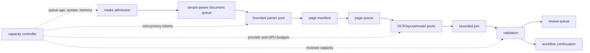
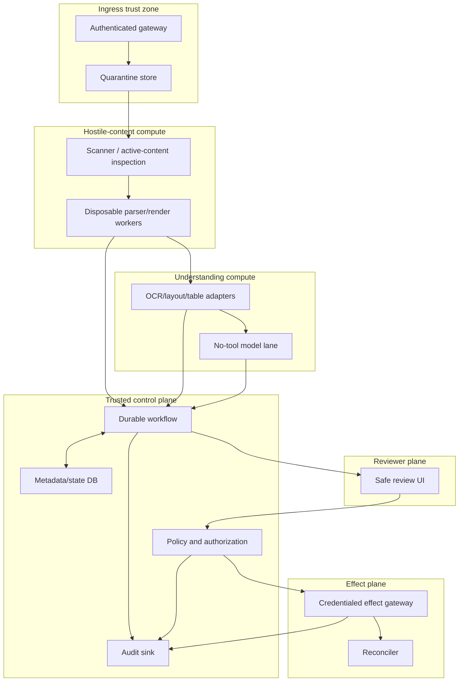

# Performance, Cost, Deployment, and Roadmap

**Purpose:** Operate the document-intelligence system at predictable latency and cost, deploy changes safely, and stage capability according to demonstrated value and risk.  
**Research baseline:** 2026-08-31

## Start with service classes

Not every document needs the same latency, route, or automation ceiling.

| Lane | Example | Latency objective | Default behavior |
|---|---|---|---|
| interactive preview | user wants page thumbnails and preliminary fields | seconds for first useful result | fast native-text/OCR path, preliminary label, no external effect |
| standard asynchronous | invoice, form, correspondence | minutes, size-dependent | full validation and review policy |
| bulk/backfill | archive migration or reprocessing | hours/days with throughput target | rate-limited, preemptible, separate quota |
| high-assurance | payment, legal filing, signature, regulated release | deadline plus human/effect controls | complete evidence, strict abstention, approvals and reconciliation |

Define objectives for queue age, time to first page, time to complete extraction, time awaiting review, and effect finality separately. Human waits and downstream settlement must not be reported as model latency.

## Latency budget

```text
end_to_end = intake_upload
           + admission_queue
           + security_inspection
           + parse_and_render
           + page_understanding_queue
           + max(page_understanding_time)
           + join
           + extraction_validation
           + review_wait_if_any
           + effect_approval_wait_if_any
           + effect_commit_and_finality
```

Measure both service time and queue time. A provider that answers in 500 ms after a 20-minute internal queue does not meet a 2-second objective.

Use early, explicitly provisional results only when the product can prevent them from being mistaken for accepted output. Completion remains gated on the authoritative page manifest.

## Cost model

Avoid one opaque “cost per document” average. Estimate and meter:

```text
document_cost = admission_compute
              + bytes_stored_by_class_and_duration
              + pages_native_parsed
              + pages_ocr_by_route
              + regions_layout_or_table_processed
              + model_input_and_output_units
              + CPU/GPU_seconds
              + provider_egress_or_transfer
              + reviewer_minutes
              + effect_provider_fees
              + expected_rework_and_reconciliation
```

Tag cost with tenant, class, page band, source, route, provider/model version, cache status, review outcome, and whether the run was production, evaluation, shadow, or reprocessing. The reviewer is often the most expensive and capacity-constrained stage; a cheaper model that doubles review can cost more overall.

### Cost controls that preserve quality

- use native text when provenance and coverage checks show it is usable;
- OCR only pages/regions that need it, while preserving a complete page manifest;
- use cheap deterministic checks before expensive model calls;
- route complex tables, handwriting, images, or exceptions to specialized processing;
- batch only where it does not harm deadlines, isolation, or failure attribution;
- cap pages, pixels, embedded objects, archive expansion, and model tokens;
- abstain early on unsupported/corrupt input instead of repeatedly invoking providers;
- cache immutable intermediate results with exact versioned keys;
- shadow a sample rather than duplicating all traffic indefinitely;
- measure downstream defect cost, not merely provider price.

Do not hard-code provider prices in the guide or policy. They vary by region, processor, tier, committed use, and date; deployment owners maintain a dated pricing sheet linked to the selected provider configuration.

## Cache correctness

A cache entry is reusable only when all semantics that can affect output match.

```yaml
cache_key:
  tenant_id: tenant_42
  purpose: accounts_payable_validation
  raw_artifact_sha256: "..."
  derivative_manifest_sha256: "..."
  stage: table_structure
  parser_version: tika-4.0.0-policy-3
  provider: example
  immutable_model_or_processor_version: "..."
  route_config_sha256: "..."
  prompt_template_sha256: "..."
  schema_version: invoice-4.2.0
  normalization_version: norm-6
  region: eu-west
```

Exclude a field only if it provably cannot change the stage result. Never share document-derived cache entries across tenants merely because the byte digest matches: that can leak existence, metadata, or output and may violate purpose/retention boundaries.

Cache records inherit artifact access, hold, deletion, region, encryption, and audit policy. Invalidate by making versioned entries unreachable; avoid global destructive cache flushes. Negative and failure caches have short, explicit lifetimes so a recovered provider or corrected policy can be retried.

## Backpressure and concurrency



### Admission control

- enforce per-request and per-tenant size/page/pixel limits before scarce processing;
- reserve enough capacity to complete already admitted work;
- use weighted tenant fairness so one bulk customer cannot starve interactive traffic;
- keep backfill/shadow/evaluation quotas separate from production;
- reject or defer with a stable reason and retry guidance rather than accepting unbounded work;
- degrade by route/lane policy, never by silently dropping pages or validation.

### Bounded fan-out

One 3,000-page PDF must not create 3,000 simultaneous provider calls. Use document-, tenant-, provider-, and global concurrency tokens. The join state is compact and spillable; page results live in object storage or a result store, not in workflow memory.

Set a maximum in-flight byte/pixel budget in addition to task count. Ten huge images can consume more memory than hundreds of small text pages.

### Poison documents

Repeated parser crashes or extreme resource use are fingerprinted and quarantined after a bounded policy. They must not cycle indefinitely through a shared queue. Preserve enough evidence to reproduce safely in an isolated environment.

## Provider quotas and routing

Quotas are deployment inputs, not timeless product facts. AWS Textract, Google Document AI, Azure Document Intelligence, model APIs, and self-hosted GPU pools expose different size, page, concurrency, rate, format, language, region, and version constraints.

Maintain a tested capability registry:

```yaml
route_capability:
  route_id: eu-invoice-layout-v4
  provider: example
  region: eu-west
  immutable_version: "2026-07-15"
  allowed_classes: [invoice]
  formats: [pdf, png, jpeg, tiff]
  language_scripts: [Latin]
  max_pages: 200
  max_bytes: 20971520
  data_use_policy_version: dp-12
  residency_evidence_ref: evidence_82
  quota_profile_ref: quota_2026_08
```

Preflight against local documented limits, but still handle provider rejection. A fallback must satisfy the same tenant, purpose, region, security, version, and output contracts. If it cannot, wait, review, or fail closed.

## Deployment topology



### Cell responsibilities

| Cell | Scaling unit | Credentials/network | Key isolation |
|---|---|---|---|
| gateway/quarantine | bytes and requests | storage write only; no parser | tenant/purpose admission |
| parser/render | documents, bytes, pixels | no outbound network or business credentials | disposable process/container, strict quotas |
| OCR/layout/table | pages/regions | only selected provider endpoints or local models | per-region/provider pools |
| model lane | token/image units | model endpoint only; no tools/effect credentials | untrusted document content is data |
| workflow/state | active histories/transitions | internal services | deterministic policy and versions |
| reviewer | tasks and image tiles | safe media proxy, authorization API | tenant/role/field-level access |
| effect gateway | semantic operations | narrowly scoped destination credentials | independent authorization and audit |
| reconciler | unknown/stuck operations | destination query scopes | cannot invent success |

Deploy high-risk tenants or regulatory regions into dedicated cells when logical partitioning cannot meet isolation, key-management, residency, or blast-radius requirements.

## Technology selection

Choose components by measured fit, not fashion:

- **JVM/Tika or equivalent isolated parser service:** broad format/metadata extraction, never the security boundary.
- **Python worker services:** strong OCR/document-AI ecosystem; place types and contracts at service boundaries.
- **Go/Rust gateway or effect adapters:** useful where small static binaries, concurrency, and narrow privileged surfaces matter, but not required if the project operates another runtime reliably.
- **Managed document AI:** fast access to OCR/layout/specialized processors, with quota, residency, retention, version, and cost diligence.
- **Self-hosted OCR/layout:** control and possible marginal-cost benefits at scale, with GPU/model operations, language coverage, security patching, and evaluation burden.
- **Durable workflow runtime:** justified by long waits, fan-out, replay, approvals, or effects; a transactional job table is simpler for short extraction-only work.

The simplest production baseline is usually one intake/control service, isolated parser workers, one primary understanding route with a bounded fallback, a durable job/workflow store, a review UI, and no effect gateway until extraction quality and operations are stable.

## Reliability and capacity planning

Capacity models include:

- arrival rate distribution, not only daily average;
- pages/document and pixels/page percentiles;
- route mix, retry/fallback rate, and cache hit rate;
- per-stage service time and memory/GPU footprints;
- provider quotas per project/region/processor;
- reviewer arrival, service rate, skill routing, shifts, and escalation;
- reprocessing, backfill, shadow, and incident surges;
- storage growth across originals, derivatives, audit, evaluation, and backup retention.

Use load tests containing realistic large, malformed, encrypted, image-heavy, table-heavy, and handwriting documents. Synthetic tiny PDFs systematically understate parser memory, rendering, network, and review cost.

Protect dependencies with deadlines, bounded retries, circuit breakers, bulkheads, and per-tenant/provider concurrency. A circuit breaker changes routing only to an approved compatible fallback; it never relaxes residency or acceptance policy.

## Disaster recovery and continuity

Define recovery objectives per asset and workflow class. One global RTO/RPO hides incompatible requirements.

| Asset or capability | Recovery objective question | Required recovery evidence |
|---|---|---|
| Immutable originals and manifests | How much received evidence may be lost? Usually none after an acknowledged intake | versioned inventory, replicated/encrypted object generations, digest reconciliation, restore sample |
| Workflow/event database | How many accepted transitions may be lost and how quickly must cases resume? | point-in-time restore, event/outbox reconciliation, version/schema compatibility |
| Derived artifacts and caches | Can they be rebuilt within the service deadline and policy? | lineage-complete rebuild drill; cache loss must not erase evidence |
| Review queues and decisions | Can assignments, leases, corrections, and approvals be reconstructed exactly? | restored task/version state; expired/stale approvals remain invalid |
| Provider jobs | Will result-retention windows outlive the outage? | persisted job identities, re-query/capture procedure, known expiry route |
| Effect ledger and receipts | Can ambiguous operations be reconciled before any resend? | independent receipt backups, destination queries, `UNKNOWN` queue continuity |
| Audit and legal-hold state | Can policy-relevant history and holds survive regional/control-plane loss? | separate access, integrity verification, hold-aware restore |

The intake acknowledgement boundary must match the durable RPO: do not tell a caller the document is accepted until exact bytes, intake identity, digest, object-version receipt, and minimum workflow record are recoverable under the declared objective. During a regional outage, fail closed if the allowed region has no qualified route; never violate residency merely to meet latency.

Run restore and regional-loss exercises with production-like scale. After restore:

1. fence workers and external effects until the restored epoch is authoritative;
2. inventory originals/artifacts against database manifests and retention/hold metadata;
3. reconcile outbox/queue deliveries, active leases, provider jobs, review tasks, and all `SENDING`/`UNKNOWN` effects;
4. invalidate missing or cross-epoch caches and signed access URLs;
5. resume by service class under admission limits so recovery load does not cause a second outage;
6. verify end-to-end sample outcomes, then gradually re-enable automatic acceptance and effects.

Backup success is not a recovery test. Measure achieved RTO, observed data gap against RPO, restore throughput, reconciliation backlog/age, destination ambiguity, and policy residuals. Include corruption, operator error, key unavailability, provider result expiry, and legal-hold conflict—not only total-region loss.

## Versioned releases

Pin immutable versions where the provider permits it. A mutable alias such as “latest” is not adequate provenance for an accepted result.

A deployable **behavior bundle** is the atomic unit of evaluation and promotion. Its immutable manifest includes:

```text
application and workflow code
database/event schema and migration
parser, renderer, OCR, layout, table, model/provider versions
prompt/template and routing policy
output JSON Schema and normalization/validation code
calibration and acceptance policy
security rules and scanner signatures
review UI and effect adapter
infrastructure/configuration digest and region
evaluation report and approved rollout cohort
```

Add the context-builder and compactor releases, memory admission/retrieval policy, adapter capability dossiers, provider data-boundary evidence, reviewer instructions, failure corpus version, telemetry/audit schema, SLO policy, and rollback target. Sign or otherwise integrity-protect the manifest and give it a stable `behavior_bundle_id`; every processing run and context manifest records that ID.

Do not promote components independently when their combination is untested. A new OCR engine can invalidate extractor calibration; a schema change can invalidate a review UI; a context-builder change can expose more untrusted text; a provider route change can alter residency; an effect adapter change can invalidate approval binding. The evaluation report names the exact bundle candidate and baseline.

Workflow changes must preserve replay compatibility or include a tested version/migration path. Output schema evolution supports old accepted records; never reinterpret old evidence silently with new code. Old queued work either resumes on its pinned compatible bundle or follows an explicit migration that creates a new run/version and preserves the prior state.

Behavior-bundle promotion is separate from authority expansion. A quality improvement cannot add a document class, tenant, region, tool, memory class, lower review threshold, or external effect without returning to its risk gate and updating policy/approval evidence.

## Rollout and rollback

1. Reproduce the current baseline on a frozen corpus.
2. Run candidate offline and inspect critical-slice deltas.
3. Replay historical manifests without external effects.
4. Shadow eligible traffic with separate quotas and retention.
5. Canary by explicit tenant/class/source cohort.
6. Expand progressively while watching quality, latency, queue age, review capacity, cost, and safety.
7. Keep the prior version available until in-flight workflows and rollback behavior are understood.

Rollback may stop new routing to a candidate, but accepted outputs remain immutable. If a defective version produced accepted data, create an incident cohort and versioned reprocessing plan; do not overwrite history.

Rollback also needs an in-flight rule:

- new work routes to the last approved bundle;
- not-yet-started activities may be safely repinned only through a compatible migration;
- accepted provider jobs continue only if their exact version and result path remain qualified;
- model/planner contexts are rebuilt from durable state under the selected bundle, never resumed from mixed-version prose;
- automatic acceptance and effects remain paused for an affected cohort until its results and approvals are revalidated;
- a correction, reversal, filing amendment, or customer notification is a new governed workflow, not “rollback.”

## Independent kill switches

Operators need scoped controls for:

- new intake;
- a format, tenant, source, or document class;
- parser/render route;
- individual provider/model/region;
- automatic acceptance;
- reviewer release/export;
- each effect type and destination;
- deletion execution;
- shadow/backfill/reprocessing.

Kill switches are authenticated, audited, tested, and fail to a documented state. Disabling an effect must not disable reconciliation of already ambiguous operations.

## Incident playbook

For a parser exploit, data exposure, model regression, provider-region issue, or duplicate effect:

1. Fence the affected route/cohort and disable relevant new effects.
2. Preserve immutable audit, version manifests, and affected artifact/run identifiers.
3. Revoke or rotate exposed credentials; parser/model lanes should have none to revoke.
4. Quarantine affected derivatives and stop unsafe cache reuse.
5. Determine impact by exact versions, regions, tenants, time range, and state transitions.
6. Reconcile all `SENDING`/`UNKNOWN` external operations before any retry.
7. Patch and test against the reproducer plus regression corpus.
8. Reprocess into new runs when required; never rewrite accepted history.
9. Restore gradually with explicit approval and monitoring.
10. Complete notification, deletion, evidence preservation, and post-incident actions required by policy/law.

## Staged delivery roadmap


### Stage 0 — define reality

- inventory formats, classes, languages, volumes, sources, tenants, retention, regions, and downstream decisions;
- build lawful production-like evaluation and failure corpora;
- measure current manual time, error, review, and downstream defect cost;
- define schemas, evidence requirements, authority ceiling, and service classes.

**Gate:** owners agree on critical fields/slices, ground truth, threat model, and what the system is forbidden to do.

### Stage 1 — safe extraction only

- authenticated intake, quarantine, immutable originals, identity/lineage;
- isolated parse/render, native-text/OCR cascade, page completeness;
- typed extraction with evidence and mandatory human review;
- no filing, signing, payment, release, or automated deletion.

**Gate:** completeness, tenant isolation, hostile-file tests, reproducibility, and reviewer usability pass.

### Stage 2 — calibrated structured automation

- document classification, tables/images/handwriting routes;
- versioned schema/normalization/validators;
- local calibration, abstention, slice-specific automatic acceptance;
- measured fallbacks, caching, cost and quality dashboards.

**Gate:** risk-at-coverage thresholds hold on production-like temporal/source holdouts; post-acceptance defects remain within policy.

### Stage 3 — durable operations and governance

- durable workflows, exact page joins, review escalation/cancellation;
- append-only reprocessing, reconciliation sweeps, audit evidence;
- privacy/retention/hold/deletion graph; deployment cells and game days.

**Gate:** crash/timeout/zombie/deletion drills pass and in-flight version upgrades are proven.

### Stage 4 — controlled material effects

- one effect type at a time behind independent gateway;
- canonical intent, separation of duties, bound one-use approval;
- destination idempotency, receipts, `UNKNOWN`, reconciliation, and manual recovery;
- canary tenants and low material limits first.

**Gate:** every ambiguous-boundary drill passes; business, security, legal/compliance, and operations owners approve the exact authority.

### Stage 5 — scale, resilience, and optional bounded agentic exceptions

- partition intake, parsing, OCR/model inference, review, effect, and reconciliation pools by workload and danger class;
- enforce byte/page/pixel, tenant, provider, queue-age, concurrency, and cost admission budgets with backpressure and fair scheduling;
- test provider/region degradation, replay storms, review-capacity exhaustion, cache loss, recovery load, and noisy-tenant isolation;
- prove backup/restore, regional artifact access, queue drain, reconciliation continuity, and version compatibility at production scale; and
- only add a planner/agent if measured exception work requires multi-step adaptation that deterministic routes cannot handle economically. Keep it inside a typed, budgeted, no-effect lane with allowlisted read-only tools, maximum steps, full trace, and deterministic validation. It may propose; it does not broaden authorization.

**Gate:** peak and recovery-load tests meet document-class SLOs, cost and human-review capacity stay bounded, tenant/provider blast radius is isolated, and controlled evaluation shows any agentic lane materially improves on a simpler router/workflow. Otherwise keep that lane deterministic.

### Stage 6 — governed continuous evolution

Treat changes to parser/OCR/model versions, prompts, schemas, validators, calibration, routing, context builder, compactor, memory admission, tools, policy, grader, and workflow code as behavior releases. Mine reviewed corrections, abstentions, incidents, source drift, and downstream defects into versioned evaluation cases; do not train or write long-term memory from raw feedback automatically.

Require temporal and source holdouts, slice and threat regression, shadow comparison, limited canary, reviewer and operations sign-off, lineage to the exact artifact manifest, and rapid rollback. Monitor document/source drift, calibration and coverage, review overrides, downstream defects, unknown-effect age, cost, and deletion completeness. A release may improve behavior without expanding authority; a new effect, tenant, jurisdiction, document class, or lower review threshold returns to the relevant earlier gate.

**Gate:** the candidate beats the production baseline within confidence bounds, passes all safety/privacy/reliability invariants, preserves replay and continuity, has an approved rollback target, and shows no material regression in rare or high-consequence slices.

## Go-live checklist

- [ ] Service classes and stage-specific SLOs include queue time and human/effect waits.
- [ ] Cost is attributable by route, page, model, review, and rework.
- [ ] Caches are version-, tenant-, purpose-, region-, retention-, and deletion-aware.
- [ ] Admission and fan-out enforce bounded bytes, pixels, pages, concurrency, and fairness.
- [ ] Provider capability/quotas are dated deployment evidence with fail-closed fallbacks.
- [ ] Hostile parsing, no-tool models, trusted workflow, review, and effects are separate cells.
- [ ] Every release has an immutable behavior-bundle manifest, evaluation report, and rollback target.
- [ ] Replay, shadow, canary, rollback, and workflow-version compatibility are tested.
- [ ] Asset-specific RTO/RPO, restore, regional-loss, reconciliation, and recovery-load drills pass.
- [ ] Scoped kill switches can stop effects while reconciliation continues.
- [ ] Incident response can identify exact affected artifacts and versions.
- [ ] Later roadmap stages cannot bypass earlier safety gates.

## Known limitations

- Provider quotas, supported languages, preview/GA status, data-handling behavior, and prices change; reverify them for each deployment and material upgrade.
- Local evaluation can estimate observed populations, not prove correctness on every future document or adversarial input.
- Some external destinations cannot provide reliable idempotency or lookup; those operations remain manual after ambiguous outcomes.
- WORM retention, legal holds, deletion rights, signatures, and evidentiary rules depend on jurisdiction and organizational policy; the architecture supplies controls, not legal conclusions.
- A model or agent cannot resolve unreadable/missing source evidence. The correct result may be abstention or a request for a better document.

## Sources

- [AWS Textract service limits](https://docs.aws.amazon.com/textract/latest/dg/limits-document.html)
- [AWS Textract asynchronous processing](https://docs.aws.amazon.com/textract/latest/dg/async.html)
- [Google Document AI quotas and limits](https://docs.cloud.google.com/document-ai/quotas)
- [Google Document AI processor and version list](https://docs.cloud.google.com/document-ai/docs/processors-list)
- [Azure Document Intelligence service limits and API lifecycle](https://learn.microsoft.com/en-us/azure/ai-services/document-intelligence/service-limits)
- [Apache Tika setting limits](https://tika.apache.org/docs/4.0.x/advanced/setting-limits.html)
- [Temporal Workflow Execution](https://docs.temporal.io/workflow-execution)
- [OpenTelemetry metrics](https://opentelemetry.io/docs/concepts/signals/metrics/)
