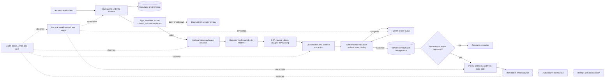
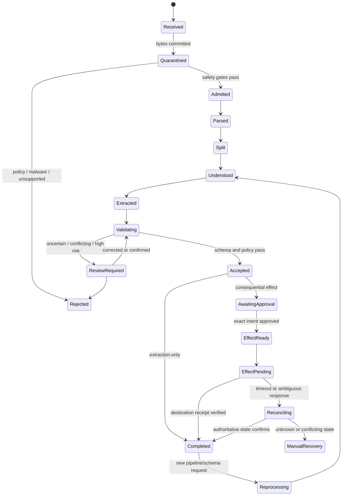

# Production Document Intelligence Agent Blueprint

**Research date:** 2026-08-31  
**Status:** Production architecture blueprint; vendor-neutral reference design  
**Scope:** Governed intake, document identity, safe parsing, OCR and layout understanding, classification, structured extraction, evidence, exception review, reprocessing, and tightly controlled downstream document effects

A production document-intelligence system is not an upload-and-summarize chatbot. It is a **document control plane** that preserves the received bytes, derives reviewable representations, records every transformation, measures uncertainty at the field and page level, and refuses to turn ambiguous content into an authoritative business action.

The recommended default is a **hybrid durable workflow**:

- deterministic services own intake, identity, quarantine, state, schemas, validation, authorization, retention, and effects;
- specialized OCR/layout/table components create evidence-bearing observations;
- multimodal models assist only where they beat measured deterministic baselines;
- humans resolve material exceptions against page evidence;
- an optional agentic resolver investigates bounded exceptions but has no ambient authority to file, sign, pay, delete, or release.

## Purpose

This blueprint fits systems that must turn hostile or imperfect documents into governed records, for example:

- invoices, receipts, purchase orders, remittance notices, and expense evidence;
- claims, applications, identity packets, and supporting attachments;
- contracts, filings, disclosure packages, and signed forms;
- healthcare, insurance, lending, logistics, customs, and public-sector case files;
- mixed batches containing cover pages, forms, photographs, tables, handwriting, and duplicates.

A successful run produces more than JSON. It produces an immutable, versioned bundle containing the received artifact identity, intake event, page manifest, parser/OCR/layout outputs, document boundaries, schema and model versions, raw and normalized fields, field/page anchors, validation results, review decisions, policy context, downstream operation identity, and the authoritative destination receipt when an effect is permitted.

## Non-goals

This design does not make the model:

- the source of truth for document bytes, page count, identity, policy, approval, or destination state;
- a malware scanner, digital-signature validator, retention authority, or access-control system;
- a reliable judge of its own extraction confidence;
- an autonomous signer, filer, payer, releaser, or destroyer of records;
- a substitute for local evaluation, domain validation, records management, privacy review, or legal advice;
- a reason to use an agent when fixed OCR plus deterministic rules solve the workload.

The product boundary ends when exact document bytes have become an evidence-bearing, reviewed structured record or a typed document exception. Corpus synchronization, ACL-aware retrieval, freshness, citation synthesis, and enterprise Q&A belong to the [Enterprise Knowledge Agent](../enterprise-knowledge-agent/README.md). Cross-system business-case ownership, queues, approvals, segregation of duties, and general operational effects belong to the [Back-Office Workflow Agent](../back-office-workflow-agent/README.md). This blueprint describes filing/payment/signing/release only to define the safe handoff and effect boundary; it does not absorb those domains or grant an extractor their authority.

## Recommended control boundary

| A model may propose | Deterministic systems or authorized people must establish |
|---|---|
| Document class, split points, candidate fields, anomaly explanation | Artifact identity, tenant, source, page manifest, and immutable original |
| OCR correction or table interpretation | Which representation is canonical evidence and how it was derived |
| Normalized date, amount, address, or identifier | Schema validity, check digits, totals, reference-data matches, and policy |
| Confidence rationale or review priority | Locally calibrated thresholds, authority tier, queue routing, and SLA |
| Exception-resolution steps | Tool allow-list, read scope, state transitions, retry budget, and stop conditions |
| Filing/payment/signing/release draft | Current authorization, separation of duties, approval receipt, exact effect hash, commit, and reconciliation |

Natural-language content inside a document, its metadata, annotations, comments, embedded files, links, barcodes, QR codes, OCR text, and images is **untrusted evidence**, never workflow instruction.

## Reference architecture

The original store is not a work directory. Parsers receive a read-only copy in a disposable, network-restricted execution cell. Every normalized, rasterized, redacted, OCRed, or content-disarmed object is a new derivative with its own digest and lineage edge.

## Architecture choices

| Variant | Best fit | Strength | Principal failure | Position |
|---|---|---|---|---|
| Deterministic OCR/pipeline | Few stable document types, high volume, clear rules | Predictable, cheap, testable, no agent attack surface | Brittle on novel layouts and ambiguous exceptions | Prefer whenever it meets quality targets |
| Model-assisted workflow | Variable documents with bounded schemas and review | Better generalization while workflow retains control | Hallucinated fields, uncalibrated scores, provider drift | Recommended default |
| Agentic exception resolver | Long-tail cases requiring bounded comparison, lookup, or explanation | Can sequence evidence-gathering steps for hard exceptions | Tool misuse, prompt injection, latency, cost, irreproducible trajectories | Add only for measured exception classes |
| Free-running document agent | Open-ended tools and downstream credentials | Demo speed | Authority confusion, duplicate effects, weak lineage, unsafe retries | Do not use in production |

The key product metric is not “documents touched by AI.” It is the risk-adjusted combination of correct straight-through processing, correctly routed abstentions, reviewer effort, downstream defect rate, latency, and cost.

## End-to-end lifecycle

`Received`, `artifact`, `processing run`, `review task`, and `effect operation` are separate records. Collapsing them into one mutable status makes duplicate intake, reprocessing, legal holds, and ambiguous downstream effects nearly impossible to reason about.

## Non-negotiable invariants

1. The received byte stream is committed before parsing and is never overwritten by a cleaned or normalized copy.
2. A cryptographic digest identifies exact bytes; it does not by itself prove business identity, authorship, authenticity, or semantic duplication.
3. Every accepted field retains the literal observation, normalized value, source artifact, page, region or span, extractor version, and review history.
4. Missing, illegible, conflicting, and not-applicable are distinct states; the model must not fill blanks from plausibility.
5. Provider confidence is not trusted as a calibrated probability and is never compared across providers without local calibration.
6. A document approval does not authorize a payment, filing, signature, release, or deletion.
7. Approval binds the exact extraction version, effect payload, destination, subject, policy version, expiry, and use count.
8. A timed-out write is `UNKNOWN`, not `FAILED`; the workflow reconciles before retrying.
9. Reprocessing creates a new version and diff. It never silently rewrites an earlier record or its audit trail.
10. Tenant, purpose, residency, retention, legal hold, and deletion policy apply to originals, derivatives, caches, queues, traces, evaluation copies, and backups—not only the primary database.

## Guide map

1. [Purpose, architecture, and technology selection](01-purpose-architecture-and-technology-selection.md) — requirements, when not to use an agent, architecture variants, runtime language, framework, model, and build-versus-buy decisions.
2. [Intake, document identity, lineage, and storage](02-intake-document-identity-lineage-and-storage.md) — immutable originals, page and batch identity, exact and semantic duplicates, derivatives, manifests, provenance, and reprocessing.
3. [Document understanding](03-document-understanding-ocr-layout-tables-images-and-handwriting.md) — safe parsing, native text versus OCR, layout, reading order, tables, figures, handwriting, languages, and multimodal cascades.
4. [Classification, extraction, validation, confidence, and review](04-classification-extraction-validation-confidence-and-review.md) — versioned schemas, literal/normalized values, evidence anchors, confidence calibration, abstention, validation, and human exception queues.
5. [Security, privacy, tenancy, retention, and deletion](05-security-privacy-tenancy-retention-and-deletion.md) — malware, macros, embedded content, prompt injection, PII, provider boundaries, tenant isolation, retention, holds, and deletion proof.
6. [Workflow state, approvals, effects, and recovery](06-workflow-state-approvals-effects-and-recovery.md) — durable state, approvals for filing/signing/payment/release, idempotency, partial failure, reconciliation, cancellation, and replay.
7. [Observability, evaluation, and failure testing](07-observability-evaluation-and-failure-testing.md) — audit records, telemetry, realistic datasets, page/field/table/state graders, calibration, acceptance gates, and adversarial/fault injection.
8. [Performance, cost, deployment, and roadmap](08-performance-cost-deployment-and-roadmap.md) — SLOs, page fan-out, caches, admission control, scaling cells, cost model, releases, incident controls, and staged adoption.
9. [Provider and self-hosted adapter qualification](09-provider-and-self-hosted-adapter-qualification.md) — capability dossiers, managed-provider and local-engine playbooks, page/result completeness, asynchronous semantics, normalization contracts, failure testing, and route promotion.

The evidence ledger, source comparisons, disagreements, version baselines, and refresh criteria live in the [research packet](../../research/packets/document-intelligence-agent-blueprint.md).

## Fast design decisions

| Question | Default decision |
|---|---|
| Should this be an agent? | No, unless measured exceptions require tool sequencing or open-ended evidence comparison |
| Where does workflow state live? | Durable application/workflow store, never model context |
| Which representation is authoritative? | Original bytes for receipt; approved extraction version for structured facts; destination system for external effect outcome |
| Cloud service or self-hosted? | Benchmark both on a local, licensed, representative set; select per residency, quality, operations, and total cost |
| Full-page VLM or OCR first? | Native text/OCR/layout first; use VLMs on selected pages or crops unless evidence shows full-page conversion is superior |
| How are low-confidence fields handled? | Field-specific abstention and exception queue, not document-wide averages |
| How are duplicates handled? | Preserve every intake event; reuse exact-byte results only within policy; resolve business duplicates separately |
| Can a cleaned PDF replace the original? | Never; it is a derivative and may invalidate signatures or remove evidence |
| Can the extraction trigger payment or filing? | Only through a separate typed effect, fresh policy check, bound approval, idempotency key, and destination reconciliation |
| How is a model upgrade released? | Frozen evaluation, shadow reprocessing, critical-slice gates, canary, rollback, and version-pinned queued work |

## Baseline and limitations

This blueprint reflects sources available on **2026-08-31**. Notable baselines include Azure Document Intelligence v4.0 API `2024-11-30` GA, current Amazon Textract and Google Document AI processor documentation, Apache Tika 4.0.0, JSON Schema 2020-12, W3C PROV, RFC 8493 BagIt, NIST SP 800-53 Release 5.2.0, NIST SP 800-88 Rev. 2 final, NIST AI 100-2 E2025, NIST AI 600-1, and ETSI EN 319 142-1 V1.2.1.

Important limitations:

- No parser, scanner, CDR product, or MIME detector proves a hostile file safe.
- OCR and multimodal models remain error-prone on degraded scans, handwriting, uncommon scripts, dense tables, stamps, overlays, and adversarial content.
- A page crop or text span supports an extraction claim; it does not prove the document is genuine or the signer had authority.
- Public benchmarks underrepresent local forms, capture devices, languages, policy boundaries, and business costs.
- Immutability and legal holds can conflict with deletion expectations; records and privacy owners must define precedence and lawful scope.
- Exactly-once external effects are generally unavailable. Correctness comes from stable operation identity, destination semantics, and reconciliation.
- Agentic exception resolution increases the attack and reliability surface. It should remain optional and reversible.

Refresh this blueprint when a selected provider changes an API/model version, region or retention behavior; a parser or file format receives a material security advisory; policy or law changes; a workflow/runtime changes replay semantics; a local evaluation slice drifts; or an incident exposes an unmodeled failure.

## Selected primary sources

- [Apache Tika security model](https://tika.apache.org/security-model.html)
- [OWASP File Upload Cheat Sheet](https://cheatsheetseries.owasp.org/cheatsheets/File_Upload_Cheat_Sheet.html)
- [Amazon Textract response objects](https://docs.aws.amazon.com/textract/latest/dg/how-it-works-document-layout.html)
- [Azure Document Intelligence transparency note](https://learn.microsoft.com/en-us/azure/foundry/responsible-ai/document-intelligence/transparency-note)
- [Google Document AI response model](https://docs.cloud.google.com/document-ai/docs/reference/rest/v1/Document)
- [RFC 8493: BagIt](https://www.rfc-editor.org/rfc/rfc8493)
- [W3C PROV overview](https://www.w3.org/TR/prov-overview/)
- [NIST AI RMF Generative AI Profile](https://nvlpubs.nist.gov/nistpubs/ai/NIST.AI.600-1.pdf)
- [NIST SP 800-88 Rev. 2](https://csrc.nist.gov/pubs/sp/800/88/r2/final)
- [OWASP Transaction Authorization Cheat Sheet](https://cheatsheetseries.owasp.org/cheatsheets/Transaction_Authorization_Cheat_Sheet.html)
