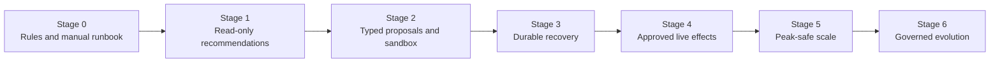

# Mission, Boundaries, and Workload Fit

[Blueprint home](README.md) · [Next: Reference architecture, runtime, and integrations →](02-reference-architecture-runtime-and-integrations.md)

The first engineering decision is not which model to use. It is whether the workload needs an agent at all, and which commerce authority must remain outside it.

## Mission statement

The system helps commerce operators turn fragmented product, offer, availability, policy, channel, and outcome evidence into safe recommendations and controlled channel operations. It reduces catalog drift and review effort while preserving deterministic business authority.

The mission has three distinct products:

1. **Evidence product:** a versioned, provenance-rich view of what authoritative systems say and what each channel submitted, processed, exposed, or rejected.
2. **Decision-support product:** ranked findings and recommendations with assumptions, uncertainty, alternatives, and expected impact.
3. **Controlled-effect product:** immutable, previewable changes that can be approved, committed through a narrow adapter, and reconciled.

Mixing these products is dangerous. A persuasive recommendation is not an authorization, and a successful API response is not proof of a live postcondition.

## Domain object boundary

| Object | Authoritative owner | Agent role | Forbidden inference |
|---|---|---|---|
| Product and variant definition | PIM/product master | Resolve identity; validate channel projection; propose corrections | Create a new canonical product merely from a listing |
| SKU, GTIN, brand, taxonomy | Product master and governed standards | Map, check, and flag ambiguity | Merge identities because names look similar |
| Offer and market projection | Commerce/catalog service | Compare desired and observed channel state | Treat an offer as the product itself |
| Sellable inventory and reservations | Inventory/OMS | Consume timestamped availability evidence; flag staleness | Calculate authoritative availability from page state |
| Price and reference-price policy | Pricing service and named business owner | Validate proposals; explain approved policy output | Choose price floors, discounts, or legal reference prices |
| Promotion definition and eligibility | Promotion service and named owner | Check channel projection; prepare approved activation | Invent eligibility, funding, or stacking rules |
| Product publication and assortment | Catalog owner and channel operator | Draft, preview, commit after exact approval | Add/remove assortment based solely on conversion |
| Product claims and regulated classification | Legal/compliance and product owner | Detect unsupported or risky language; route review | Certify legal compliance |
| Customer cases and return movement | Support and supply chain | Consume approved aggregate reasons and rates | Read case notes or initiate a return by default |
| Conversion and attribution | Analytics/experimentation owners | Treat as observations with lineage and caveats | Assert causality from a channel-reported conversion metric |

## Closest-category seams

### Marketing operations

Marketing owns campaign objective, audience, consent, suppression, media budget, send/activation state, and campaign measurement. E-commerce operations owns the commerce object's readiness and channel projection.

Examples:

- “Publish approved sale price for SKU A in market X” belongs here.
- “Target customers likely to buy SKU A” belongs to Marketing Operations.
- “Generate a product-feed title variant” belongs here when it is a channel product field.
- “Generate lifecycle-email copy” belongs to Marketing or Content Editorial.

### Supply chain and logistics

Supply Chain owns physical availability, allocation, reservation, replenishment, warehouse, carrier, and fulfillment decisions. This agent may consume `available_to_sell` evidence and tell an operator that channel availability is stale. It cannot write stock to make a listing appear available.

### Customer support

Support owns the customer, case, response, refund, replacement, and resolution. This agent may receive a weekly aggregate such as “size-too-small return rate by product/variant/market.” Free-text notes stay in the support boundary unless a separately approved, minimized pipeline produces a task-specific extract.

### Finance and pricing

Finance owns authoritative cost, margin, settlement, tax, and accounting. A pricing system or pricing committee owns policy and approved parameters. The agent can consume a signed constraint such as a market-specific price corridor; it cannot infer authoritative margin from incomplete costs.

### Content editorial

Editorial owns source copy, editorial lifecycle, and brand narrative. This agent owns channel-specific commerce-field readiness: required attributes, structured product fields, title length, image-role mapping, alt-text suggestion, and policy evidence.

## Why an agent may be useful

Agentic reasoning is justified only where the workflow contains semantic ambiguity or a variable evidence path. Suitable cases include:

- resolving a product-type suggestion from descriptions, images, attributes, and provider schema candidates;
- explaining why a provider rejected or suppressed a listing when several fields and policies interact;
- ranking a large remediation queue using commercial impact, confidence, freshness, and reversibility;
- drafting constrained product-field improvements while preserving factual claims and source provenance;
- choosing which read-only diagnostic tools to call within a fixed investigation budget; and
- synthesizing returns, search, suppression, and conversion observations into hypotheses for a human merchandiser.

These cases still require deterministic validation. The model supplies semantic judgment, not authority.

## When not to build an agent

Use a normal program when requirements are stable and complete:

| Problem | Better mechanism |
|---|---|
| Missing required field | Schema validator |
| Duplicate GTIN or SKU | Uniqueness constraint plus identity review queue |
| Price below approved floor | Deterministic policy engine |
| Sale end time elapsed | Scheduler or promotion service |
| Feed drift from source | Set/diff comparison |
| Webhook duplicate | Delivery/event deduplication |
| Stale marketplace state | Reconciliation job |
| Provider quota exhausted | Rate governor and queue |
| Emergency product withdrawal | Pre-approved deterministic runbook |
| Standard dashboard narrative | Templated report unless semantic synthesis is proven useful |

A credible Stage 0 should solve as much of the problem as possible this way. It creates the baseline against which model value, error, latency, and cost can be measured.

## Autonomy envelope

The envelope narrows as consequences or uncertainty increase.

| Class | Examples | Permitted behavior | Required control |
|---|---|---|---|
| D0 — isolated computation | Parse provider schema, calculate exact diff, render preview, run sandbox validation | Automatic | No external effect; resource and data limits |
| D1 — bounded read | Read PIM projection, marketplace status, storefront publication, aggregate returns | Automatic inside tenant/run scope | Read-only credentials; field allowlist; audit |
| D2 — staged and reversible | Create internal recommendation, draft product revision, provider validation preview, test-store publication | Automatic only inside named sandbox or reversible draft area | Policy check; effect record; retention and rollback |
| D3 — consequential | Change live price/promotion, publish/unpublish, alter live product content, bulk correct offers | Model may prepare only | Exact approval, commit-time revalidation, narrow connector, receipt, read-back, kill switch |
| D4 — authority change | Change credentials, scopes, policy, approvers, tenant routing, model/tool allowlist | Proposal only | Separate administrative control plane and change approval |

Some organizations may treat a narrow correction as D2, but only after local evidence proves it is reversible, bounded, and safe. The classification belongs to the effect owner, not the model designer.

## Hard human and deterministic ownership

Humans or deterministic services retain final authority for:

- price strategy, floor/ceiling policy, reference-price legality, markdown depth, and promotion funding;
- canonical product identity, variant relationships, regulated classification, and legal claims;
- sellable inventory, reservations, oversell policy, and physical assortment feasibility;
- live assortment, publication, and high-impact content changes;
- exception disposition when identity, money, policy, or channel state is ambiguous;
- customer remedies, refunds, returns, payment, fulfillment, and financial accounting;
- security policy, credentials, approval roles, tenant binding, and release gates; and
- whether outcome evidence is strong enough to adopt a recommendation or behavioral change.

The workflow may automate the application of an already-approved deterministic rule. It must not reinterpret that rule through natural language at commit time.

## Workflow portfolio

### Catalog remediation

**Trigger:** scheduled drift scan, PIM event, provider issue, or operator request.  
**Evidence:** source revision, product/variant graph, provider schema version, submitted document, processed issue list, observable page or API state.  
**Output:** field-level defect, severity, evidence, suggested correction, identity confidence, preview, approval requirement.  
**Stop:** ambiguous identity, unsupported claim, destructive list replacement, schema drift, or stale source revision.

### Channel publication and withdrawal

**Trigger:** approved assortment decision, product readiness, safety withdrawal, or publication incident.  
**Evidence:** product version, market eligibility, content readiness, inventory policy, price/promotion state, channel account.  
**Output:** immutable target set and desired publication state.  
**Control:** live action is D3 unless a narrow deterministic emergency runbook has separate pre-authorization.

### Price and promotion projection

**Trigger:** approved pricing/promotion change or drift.  
**Evidence:** exact authorized values, currency, tax basis, market, reference-price evidence, effective window, channel capabilities.  
**Output:** provider-native projection and preview.  
**Control:** the model cannot alter amounts or eligibility; it may explain a conflict and propose escalation.

### Merchandising recommendation

**Trigger:** periodic opportunity review or explicit question.  
**Evidence:** catalog quality, suppressed listings, approved availability aggregates, search and conversion observations, return aggregates, margin band if allowed, season/calendar.  
**Output:** ranked hypotheses with expected mechanism, confidence, uncertainty, counter-evidence, reversibility, and evaluation plan.  
**Control:** recommendation never directly becomes an external effect.

### Provider suppression triage

**Trigger:** issue/status event or reconciliation finding.  
**Evidence:** provider error, current product schema, submitted payload, processed state, policy evidence, last known good version.  
**Output:** deterministic issue classification, semantic explanation, proposed correction or human route.  
**Control:** provider policy disputes and regulated claims always route to a human owner.

## Decision record for rejected operating models

| Rejected model | Why it fails | Selected replacement |
|---|---|---|
| General “commerce copilot” with full admin token | Tool availability becomes accidental authority; blast radius is tenant-wide | Stage-specific capabilities and effect-specific credentials |
| Model-owned unified catalog | Produces an unofficial source of truth and stale identity | Versioned read projection plus explicit source owners |
| Autonomous repricer | Competitive signals, cost, legal constraints, strategy, and customer impact are not safely inferred | Deterministic pricing policy; agent recommends and explains only |
| Webhook-only synchronization | Provider events can be delayed, duplicated, reordered, or missing | Event ingestion plus scheduled full/partition reconciliation |
| Success-response completion | Many platforms accept input before policy processing or publication | Submitted/processed/live/observable state model and read-back |
| Browser-first connector | UI semantics are unstable and effect recovery is weak | Supported API/feed first; RPA is an isolated last resort |
| Persistent conversational memory of catalog facts | Facts become stale and provenance disappears | Query-built context from versioned systems of record |
| Outcome-driven online self-learning | Feedback is confounded and can silently change authority | Offline review, evaluation, signed behavior-bundle release |
| Multi-agent by domain object | Handoffs add state and authorization failure without inherent value | One coordinator; add isolated specialists only after evaluation |

## Workload admission checklist

Before admitting a use case, answer all of these:

- What exact business outcome is expected, and what deterministic baseline already exists?
- Which authoritative system owns each input and decision?
- What ambiguity requires semantic reasoning?
- Can the output be a recommendation rather than an effect?
- What is the worst plausible blast radius by tenant, market, SKU count, price delta, and time?
- Can every target and parameter be represented in a typed immutable proposal?
- Is the effect reversible? If not, why is an agent involved?
- What constitutes authoritative verification?
- What happens after a timeout, partial acceptance, rejection, or schema change?
- What data must never enter model context?
- Which evaluator can prove usefulness and which deterministic gate proves safety?
- What is the stop condition and named incident owner?

If these answers are unavailable, keep the workload in discovery or Stage 0.

## Stage-specific boundary evolution

Later stages do not automatically increase autonomy. Stage 5 may scale the number of proposals while live price and publication remain D3 forever. Maturity means stronger evidence and controls, not maximal autonomy.

## Production-readiness checks

- [ ] The boundary document names owners for product, inventory, price, promotion, publication, claims, cases, and accounting.
- [ ] Every use case has a deterministic baseline and explicit model-value hypothesis.
- [ ] Each effect is classified D0–D4 by the effect owner.
- [ ] D3 and D4 behavior cannot be authorized by model output.
- [ ] The system rejects ambiguous identity, stale inventory evidence, and incomplete money semantics.
- [ ] Category seams are represented as typed handoffs, not shared write access.
- [ ] Emergency safety actions use narrow runbooks and do not depend on model availability.
- [ ] Business outcome metrics cannot suppress safety, reliability, or authority failures.
- [ ] A no-agent implementation remains the fallback when semantic value is not demonstrated.

## Sources and related controls

- [GS1 GTIN Management Standard](https://www.gs1.org/1/gtinrules/en/)
- [Google Merchant product data specification](https://support.google.com/merchants/answer/7052112?hl=en-GB)
- [Shopify inventory quantity mutation](https://shopify.dev/docs/api/admin-graphql/latest/mutations/inventorySetQuantities)
- [Anthropic: Building effective agents](https://www.anthropic.com/engineering/building-effective-agents)
- [Execution boundaries](../../runtime/execution-boundaries.md)
- [Production agent control plane](../../architectures/production-agent-control-plane.md)

[Blueprint home](README.md) · [Next: Reference architecture, runtime, and integrations →](02-reference-architecture-runtime-and-integrations.md)
