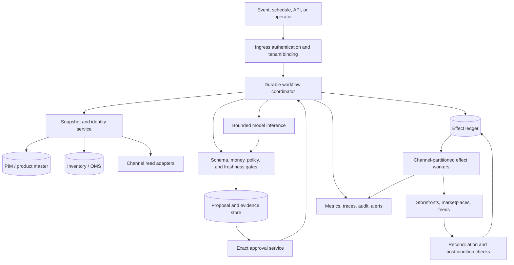
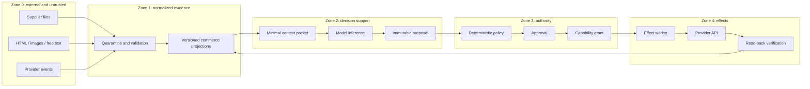
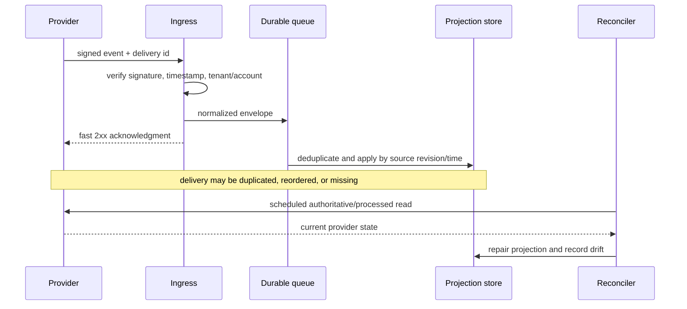

# Reference Architecture, Runtime, and Integrations

[← Previous: Mission, boundaries, and workload fit](01-mission-boundaries-and-workload-fit.md) · [Blueprint home](README.md) · [Next: Catalog identity, offers, and channel state →](03-catalog-identity-offers-and-channel-state.md)

The reference design separates commerce truth, reasoning, authorization, and effects. It keeps provider-native semantics visible behind a common control envelope instead of pretending every channel has the same state machine.

## Selected runtime shape

Use one durable workflow coordinator per run. The coordinator invokes deterministic services, a bounded model stage, an approval service, and narrow connector workers. Keep model inference stateless between calls unless a run explicitly carries forward a typed checkpoint.



### Why a durable coordinator

Commerce operations often wait for human approval, provider processing, rate limits, policy review, publication propagation, and reconciliation. A durable workflow provides resumable timers, explicit state transitions, cancellation, and recovery after process restarts. It does **not** make external effects exactly once; the effect ledger and postcondition checks do that work.

Use a simple request/response service only for read-only D0/D1 analysis that finishes within one bounded call. Escalate to a durable run before introducing approval, delayed processing, or external writes.

### Why one agent by default

A catalog classifier, merchandising analyst, policy explainer, and incident investigator may look like separate personas, but a multi-agent topology adds message contracts, duplicated context, cross-agent permissions, and more ways to lose provenance. Start with stage-specific prompts and tools inside one workflow. Split a specialist only when evaluations show a stable quality or context-isolation advantage and its tool authority is strictly narrower.

## Component responsibilities

| Component | Owns | Must not own |
|---|---|---|
| Ingress gate | Request identity, tenant/account binding, schema validation, request id | Business authorization inferred from caller prose |
| Snapshot service | Versioned reads, field provenance, freshness, normalized projections | Canonical product or inventory truth |
| Identity service | Deterministic identifier graph and ambiguity decisions | Name-similarity auto-merge |
| Workflow coordinator | Run state, timers, retries, cancellation, stage capability selection | External effect truth |
| Rule/policy engine | Exact schemas, money, availability freshness, channel rules, approval policy | Semantic copy judgment |
| Model gateway | Model routing, prompt/tool bundle, structured output, usage metering | Credentials or direct provider access |
| Proposal store | Immutable proposed intent, evidence manifest, preview, diff, digest | Mutating intent after approval |
| Approval service | Authenticated approver, scope, expiry, separation of duties, decision record | Provider credentials |
| Effect worker | One narrow provider-native commit operation | Choosing targets or changing approved parameters |
| Effect ledger | Semantic effect identity, attempts, receipts, verification state | Claiming success without postcondition |
| Reconciler | Full/partition read-back, drift detection, unknown resolution | Blindly reapplying desired state |
| Telemetry/audit | Correlation, decisions, metrics, sanitized traces, incident evidence | Business or effect truth by itself |

## Data planes and trust zones



Data moves toward higher authority only through typed validation. Instructions embedded in Zone 0 content are discarded. The model in Zone 2 cannot mint a Zone 3 capability.

## Integration taxonomy

### Product information management

PIM adapters should expose versioned products, product models, variants, locale/channel-specific fields, completeness/readiness observations, and author/revision metadata. PIM “completeness” usually means configured required fields are present; it does not prove accuracy, legal compliance, accessibility, or channel acceptance.

### Storefront platform

Storefront adapters expose product/variant/catalog/publication/price-list state. Preserve platform distinctions such as product versus variant, publication versus price list, and inventory item versus inventory level. Do not flatten a list-replacement mutation into a generic patch. Shopify's `productSet`, for example, treats list fields differently from scalar fields; adapter contract tests must cover omission and deletion behavior.

### Marketplace and shopping feed

Marketplace adapters expose provider-native schemas, submitted payloads, asynchronous issues, offer/listing status, feed/batch identifiers, and observable state. Google Merchant separates submitted `ProductInput` from the processed product and status. Amazon distinguishes Listings Items operations from bulk JSON feeds, and a synchronously accepted submission may still fail later processing.

### Inventory and order management

This adapter is read-only for the agent boundary. It supplies a timestamped, versioned availability observation and the business rule used to derive it. Shopify's inventory quantity mutation explicitly assumes the caller is acting as the source of truth; this agent is not.

### Pricing and promotion policy

The adapter accepts exact inputs and returns a signed or versioned policy decision: allowed amount/range, currency, tax basis, market, customer/catalog context, reference-price rule, stacking constraints, effective interval, and reason codes. Natural-language summaries are supplemental.

### Analytics, returns, and search

Use aggregated, purpose-limited observations with lineage, time window, denominator, attribution method, and privacy classification. Channel performance reports may use attributed or fractional conversions; they are observations, not causal ground truth. Free-text return notes are excluded by default.

## Common control envelope, native provider semantics

A common connector envelope should standardize safety and observability:

```yaml
operation_id: op_01J...
tenant_id: tenant_123
channel_account_id: shop_456
adapter_contract: shopify-admin-graphql@2026-07
effect_type: product_publication_update
authority_class: D3
proposal_digest: sha256:...
idempotency_key: effect:tenant_123:shop_456:publication:...
deadline: 2026-09-01T12:00:00Z
attempt: 1
expected_postcondition:
  product_id: gid://...
  publication_id: gid://...
  published: true
```

The YAML is illustrative; production types should use the repository's language and schema tooling. The adapter must still expose native provider behavior:

- whether mutation is synchronous or asynchronous;
- whether omission means unchanged, cleared, or replaced;
- provider idempotency or conditional-write support;
- batch limits and partial-result shape;
- error categories and retry hints;
- read-back endpoint and expected propagation delay;
- schema/API version and deprecation horizon; and
- what “accepted,” “active,” “published,” and “observable” mean.

A lowest-common-denominator `updateProduct()` API hides exactly the semantics needed for safe recovery.

## Provider contract examples

| Provider pattern | Architectural consequence |
|---|---|
| Google Merchant product input is processed into a separate product/status view | Persist input identity and poll/read processed state before completion. |
| Amazon one-item listing API and bulk JSON feed have different lifecycle and limits | Separate adapter operations and effect identities; do not switch modes mid-run. |
| Amazon product-type definitions and schemas vary | Pin schema/product-type versions in the proposal and revalidate before commit. |
| Shopify GraphQL uses calculated query costs and per-app/store buckets | Maintain a per-account quota governor using returned cost/throttle status. |
| Shopify webhooks can be unordered, duplicated, delayed, or absent | Verify authenticity, deduplicate delivery/event identity, order by source time, and reconcile. |
| commercetools staged versus current product projections | Represent draft and live projections separately; publishing is an effect. |
| Akeneo product readiness/completeness depends on configuration and feature availability | Treat it as an input observation, not a universal acceptance gate. |

## Event ingestion and reconciliation

Webhooks reduce latency; they do not provide completeness.



Store at least:

- provider, tenant, account, event type, schema version;
- provider event id and delivery id when both exist;
- source resource id, source revision/time, received time;
- authentication result and replay window;
- raw payload location under short, restricted retention if needed;
- normalized payload hash and parser version; and
- processing disposition, duplicate relationship, and reconciliation result.

Never put webhook secrets or raw protected customer payloads in model context.

## Runtime and model selection

Choose the smallest model that meets a measured semantic-quality threshold for the bounded stage. Use a stronger reasoning model only for high-ambiguity diagnosis or cross-signal synthesis. Routing inputs may include task type, context size, allowed latency, privacy class, and evaluator confidence—but never an unconstrained model self-assessment.

Model requirements:

- structured output matching a versioned schema;
- explicit refusal/ambiguity fields;
- enough context capacity for the selected product slice, not the whole catalog;
- stable tool-calling behavior for read-only diagnostics;
- provider and region availability compatible with data policy;
- version pinning or a release process that treats model changes as behavior changes; and
- token/latency telemetry without storing raw sensitive prompts by default.

The model should receive only tools required for the current stage. A diagnostic pass might see `read_product_projection`, `read_channel_issues`, and `validate_schema`; it should not see `publish_offer` or `set_price`.

## Build, buy, and framework decision

| Need | Simple choice | Escalate when |
|---|---|---|
| Read-only analysis under one request | Application service plus model SDK | Runs wait, retry, reconcile, or need cancellation |
| Durable state machine | Existing workflow engine used by the organization | No existing engine satisfies audit, timers, and recovery |
| Connectors | Official provider SDK/API plus thin native adapter | Managed integration is already governed and preserves receipts/versioning |
| Policy | Existing pricing/catalog policy service | Rules are currently trapped in manual prose and need formalization |
| Approval | Existing IAM/change-management workflow | It cannot bind exact content/target digests or expire decisions |
| Agent framework | Direct model/API integration first | Evals prove a framework materially reduces required orchestration code |
| Model Context Protocol | Use for bounded discovery/read tools if already standardized | Consequential effects still require application-side authorization and effect ledger |

See [Custom loop vs framework vs workflow engine](../../comparisons/custom-loop-vs-framework-vs-workflow-engine.md). A framework cannot supply the organization's business authority model.

## High-availability and failure containment

Partition queues and workers by tenant, provider account, market, and effect type where practical. Use bulkheads so a marketplace feed backlog cannot block emergency storefront withdrawals. Keep analysis traffic separate from commit/reconciliation traffic.

Required controls:

- durable inbox/outbox or equivalent event handoff;
- bounded retries with decorrelated backoff and provider retry hints;
- per-account quota and concurrency governor;
- circuit breaker for systematic schema/auth/policy failures;
- dead-letter quarantine with replay through the normal validator;
- independent kill switches for read, propose, commit, and bulk modes;
- leases/fencing for single effect ownership; and
- reconciliation that does not depend on the original worker being alive.

## Deployment units

A practical initial production deployment can remain small:

1. API/ingress service.
2. Durable coordinator workers.
3. Snapshot/identity/read adapter service.
4. Policy/proposal/approval service or modules in the main service.
5. Provider-partitioned effect and reconciliation workers.
6. Relational database for runs, proposals, approvals, and effect ledger.
7. Durable queue/workflow backend.
8. Object storage for large provider documents and evidence under retention controls.
9. Existing telemetry stack.

Do not split every component into a microservice. Separate deployment only for scaling, credential isolation, blast-radius control, or organizational ownership.

## Architecture acceptance tests

- [ ] Killing any coordinator process does not lose or duplicate a run.
- [ ] Killing an effect worker after provider receipt but before local persistence produces `unknown`, then reconciliation resolves it.
- [ ] A read-only stage cannot invoke or discover D3 tools.
- [ ] Provider-native list replacement, partial acceptance, and async lifecycle are covered by adapter contract tests.
- [ ] Webhook duplicates, reordering, delayed delivery, and missing delivery converge after reconciliation.
- [ ] Tenant/account/currency/market mismatches fail before any provider call.
- [ ] A provider schema or API version change fails closed until the adapter bundle is revalidated.
- [ ] Quota exhaustion degrades to queued work and preserves emergency correction capacity.
- [ ] The service continues deterministic validation and reconciliation when the model provider is unavailable.

## Sources and related controls

- [Google Merchant API: add and manage products](https://developers.google.com/merchant/api/guides/products/add-manage)
- [Google Merchant API product migration model](https://developers.google.com/merchant/api/guides/compatibility/products)
- [Amazon Listings Items API](https://developer-docs.amazon.com/sp-api/lang-en_EN/docs/listings-items-api)
- [Amazon Feeds API best practices](https://developer-docs.amazon.com/sp-api/lang-US/docs/feeds-api-best-practices)
- [Shopify API limits](https://shopify.dev/docs/api/usage/limits)
- [Shopify webhook delivery guidance](https://shopify.dev/docs/apps/build/webhooks)
- [commercetools Product Projections](https://docs.commercetools.com/api/projects/productProjections)
- [Durable execution](../../runtime/durable-execution.md)
- [Tool registries, versioning, and lifecycle](../../tools/tool-registries-versioning-and-lifecycle.md)
- [Model Context Protocol](../../protocols/model-context-protocol.md)

[← Previous: Mission, boundaries, and workload fit](01-mission-boundaries-and-workload-fit.md) · [Blueprint home](README.md) · [Next: Catalog identity, offers, and channel state →](03-catalog-identity-offers-and-channel-state.md)
