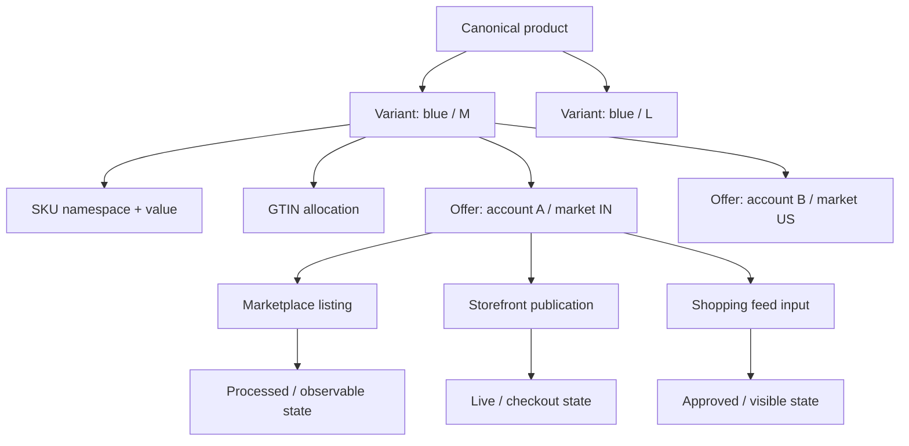
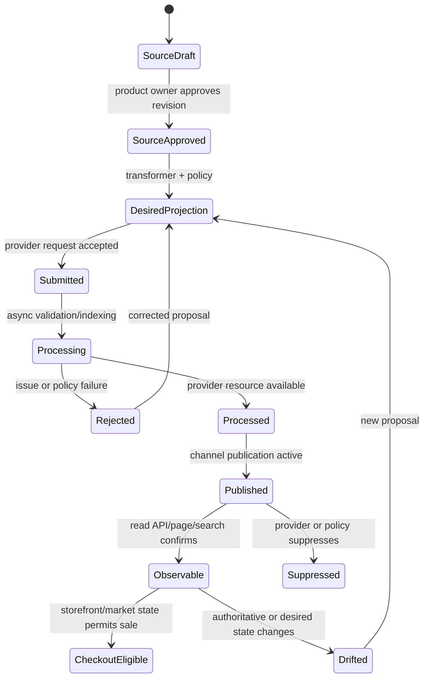

# Catalog Identity, Offers, and Channel State

[← Previous: Reference architecture, runtime, and integrations](02-reference-architecture-runtime-and-integrations.md) · [Blueprint home](README.md) · [Next: Availability, pricing, promotions, and merchandising →](04-availability-pricing-promotions-and-merchandising.md)

Commerce automation fails dangerously when “product,” “SKU,” “variant,” “listing,” and “offer” are treated as synonyms. Identity must be resolved before the system can compare state, reason about quality, or prepare an effect.

## Identity vocabulary

| Term | Meaning in this blueprint | Important distinction |
|---|---|---|
| Product | Canonical sellable concept or product family in the product master | May have many variants and channel projections |
| Variant | A specific option combination or sellable configuration | Needs its own stable SKU and often GTIN/barcode |
| SKU | Internal stock-keeping identifier in a defined owner namespace | Not necessarily globally unique or stable across companies |
| GTIN | GS1 trade-item identifier governed by GTIN allocation rules | Must not be fabricated, reformatted loosely, or reused by semantic similarity |
| Catalog | A market/customer/channel-scoped collection of products and pricing/publication context | Visibility and price may vary by catalog |
| Offer | A merchant's sale proposition for a product/variant in a market/channel | Contains seller, price, availability, condition, and effective state |
| Listing | Provider representation of a product and/or merchant offer | Provider semantics differ; some separate catalog item and offer |
| Publication | Visibility relationship between resource and sales channel | Publication is not the same as product existence or price |
| Projection | Versioned desired, submitted, processed, published, or observed representation | Never automatically canonical truth |

Google Merchant identifies an input using content language, feed label, and offer ID. Shopify separates product variants, publications, catalogs, price lists, inventory items, and inventory levels. Amazon listing and product-type behavior varies by marketplace and seller eligibility. The internal contract must preserve these dimensions.

## Identity and version semantics by commerce object

Do not use one generic `entity_id` or `version`. The minimum identity tuple, version signal, and authority differ by object. `Unknown` is a valid version state and blocks a dependent effect.

| Object | Exact identity tuple | Version or effective-state signal | Authority / unsafe collapse |
|---|---|---|---|
| Product | tenant + product-master namespace + canonical product ID | product revision plus lifecycle interval | Product master; not a provider listing |
| Variant | product ID + stable variant ID + normalized option tuple | variant revision and parent revision | Product master; not a SKU string alone |
| SKU | tenant + issuing-system namespace + literal SKU value | assignment interval and reuse/tombstone revision | ERP/PIM owner; leading zeros and case rules are explicit |
| Offer | seller + market + channel/account + sellable variant + offer ID | offer revision and effective interval | Commerce offer service; not catalog content |
| Seller | tenant + legal/merchant entity + provider seller/account ID | onboarding/verification status version and effective interval | Merchant governance; never inferred from feed content |
| Channel | provider + environment + account/shop/merchant + market/program | API/schema/policy version and enabled capability set | Connector registry; `prod` and sandbox are different identities |
| Catalog projection | catalog + channel + market + locale + customer/catalog segment + source snapshot | mapping bundle + source revisions + desired hash | Derived projection; never source truth |
| Content | product/variant + field + locale + channel + content artifact ID | source revision, claim evidence version, draft/published state | PIM/CMS/editorial owner; generated text remains a candidate |
| Price | offer + currency + market + tax basis + customer/catalog context + price type | exact amount, policy decision, valid interval, source revision | Pricing authority; not a bare decimal |
| Currency | ISO code plus settlement/presentation context | currency-table/exponent version where conversion occurs | Pricing/finance configuration; never inferred from locale |
| Tax | jurisdiction + product tax category + customer/use context + calculation owner | rule/service version, timestamp, evidence/transaction context | Tax service/adviser; the agent does not calculate authoritative tax |
| Promotion | owner + promotion ID + market/channel/program | definition revision, approval version, state, effective interval | Promotion service; provider review is not merchant authorization |
| Coupon | promotion + code or code-set ID + redemption channel | issuance batch, eligibility/usage-rule version, validity interval | Promotion service; never exposed or generated outside policy |
| Inventory | owner system + item/variant + location + stock bucket | inventory sequence or snapshot version and observed time | Inventory/OMS; the agent has no mutation authority |
| Availability | item/variant + market + fulfillment method + channel allocation | derived rule version, source sequence, observed/valid-until times | Freshness-bound evidence; not physical stock truth |
| Order | commerce system + tenant/merchant + order ID | order revision/status event sequence | OMS; read only through minimized aggregate or handoff |
| Return | returns system + order/line + return ID | return lifecycle revision and reason-taxonomy version | Returns/support/supply-chain owner; not an agent effect target |
| Policy | policy domain + jurisdiction + owner + policy ID | immutable release, effective-from/to, supersedes link | Named policy owner; model prose is not policy |
| Approval | proposal digest + approver decision ID | issued/expires/revoked state and role snapshot | Approval service; cannot be copied to a changed target |
| Effect | semantic effect key + target identity | append-only attempt/receipt/reconciliation sequence | Effect ledger; transport request ID is not business identity |
| Correction | original effect/incident + correction proposal/effect ID | new approval and current-state precondition | A new effect, never an edit or deletion of history |

Provider identifiers are stored as scoped bindings to these objects. For example, a Google Merchant `ProductInput` and processed `Product` share a product name derived from language, feed label, and offer ID, but represent different lifecycle layers; a commercetools resource `version` is an optimistic-concurrency signal, while current/staged projections and eventual search propagation are separate; a Contentful `sys.version` is required for optimistic locking, but publication has its own version/state. The adapter must preserve each meaning rather than normalize all of them to `version: 7`.

## Canonical identity contract

The following YAML is illustrative and framework-neutral. Production implementations should use a versioned schema with exact cardinality, normalization, and rejection rules.

```yaml
schema: commerce.identity/v1
tenant_id: t_acme
canonical_product_id: prod_1042
canonical_product_revision: 37
canonical_variant_id: var_1042_blue_m
variant_revision: 12
sku:
  namespace: acme-erp
  value: BLU-M-1042
trade_item:
  identifier_type: GTIN_14
  value: "09506000134352"
  verification: gs1_allocation_record
variant_dimensions:
  color: blue
  size: M
market_context:
  country: IN
  language: en-IN
  currency: INR
channel_binding:
  provider: example_marketplace
  account_id: acct_778
  catalog_id: cat_in
  offer_id: off_445
  listing_id: lst_993
binding_status: exact
binding_evidence:
  - source: pim
    revision: 37
  - source: channel_api
    revision: etag:abc123
resolved_at: 2026-08-31T10:15:00Z
```

Required semantics:

- identifiers are strings; leading zeros are never discarded;
- every identifier has an owner namespace and scope;
- market, locale, currency, tenant, provider account, and catalog are part of identity where provider behavior depends on them;
- a variant-dimension set is normalized and complete before a merge;
- confidence is not a substitute for status—use `exact`, `ambiguous`, `missing`, `conflict`, or `retired`;
- evidence records source revision and resolution time; and
- an ambiguous or conflicting binding cannot enter proposal construction.

## Identity graph, not one universal key



A versioned graph is more reliable than a wide crosswalk table because it can express one-to-many mappings, retired bindings, market-specific offers, and provider resource replacement. The graph need not be a graph database; relational tables with explicit keys and history are often simpler.

## Resolution algorithm

Run deterministic resolution in this order:

1. Verify tenant, source, and provider account scope.
2. Match authoritative native identifiers already stored in a valid binding.
3. Check product/variant revision, retirement, and merge/split history.
4. Validate SKU namespace and exact value.
5. Validate GTIN type, format, check digit, and authoritative allocation evidence where available.
6. Validate the complete normalized variant dimension set.
7. Validate channel-native identifiers under account, market, language, catalog, and seller context.
8. Confirm that all exact signals converge on one canonical variant/offer.
9. If they do not, produce an ambiguity artifact and stop.

Name, image, embedding, or description similarity may rank candidates for review. It must not auto-merge products, transfer reviews, reuse a GTIN, or select an effect target.

### Ambiguity artifact

```json
{
  "schema": "commerce.identity-ambiguity/v1",
  "tenant_id": "t_acme",
  "input_ref": "provider:acct_778:listing:lst_993",
  "reason_codes": ["SKU_REUSED", "VARIANT_DIMENSION_CONFLICT"],
  "candidates": [
    {"variant_id": "var_1042_blue_m", "evidence": ["exact_gtin"]},
    {"variant_id": "var_992_blue_m", "evidence": ["exact_sku"]}
  ],
  "required_owner": "catalog_identity_steward",
  "permitted_next_actions": ["read_more_evidence", "request_resolution", "cancel"]
}
```

This example is illustrative. It intentionally omits raw descriptive text so the reviewer sees the conflicting authoritative evidence, not a model's confidence score.

## Variant-family invariants

Variant grouping improves navigation but can cause serious identity corruption. Enforce:

- a stable parent/group identifier that does not replace variant identifiers;
- one distinct sellable identity per option combination;
- no two active variants with the same normalized option tuple under a product;
- required differentiating attributes for the provider's product type;
- unique SKU within its owner namespace;
- GTIN allocation appropriate to the distinct trade item;
- variant-specific URL, image, price, and availability projections where the channel requires them; and
- explicit lifecycle handling for variant addition, retirement, merge, and split.

Google product-variant guidance uses product groups plus individual products and expects variant-specific identifiers. Provider conformance does not override GS1 allocation or internal product-master rules.

## Projection state model

Do not store a single `listing_status`. Model at least these layers:



Not every provider exposes every state. Record `not_observable` rather than collapsing it into success.

### Projection contract

```yaml
schema: commerce.offer-projection/v1
identity_ref: binding_01J...
layer: provider_processed
source_system: google_merchant
source_resource: en~IN~offer-445
source_revision: product-status:2026-08-31T10:22:14Z
observed_at: 2026-08-31T10:22:18Z
effective_market:
  country: IN
  language: en-IN
  currency: INR
state:
  exists: true
  submitted: true
  processed: true
  published: false
  observable: false
  checkout_eligible: unknown
issues:
  - code: missing_shipping
    severity: disapproved
payload_hash: sha256:...
provenance:
  adapter: google-merchant-v1@4.2.0
  api_version: v1
```

Use separate rows/documents for desired, submitted, processed, live, and externally observed projections. Never overwrite the last-known provider state with desired state.

## Desired-state transformation

Transformation from canonical product data to a provider document is deterministic and versioned:

`desired_projection = transform(product_revision, offer_revision, market_policy, provider_schema, mapping_bundle)`

Persist every input version and the output hash. A proposal is invalid if any required input changes before commit. Model-generated suggestions enter only after human adoption into an approved product/offer revision or as explicitly identified draft fields.

### Provider-specific mapping rules

Mapping must retain:

- source field and revision;
- transformation/mapping rule version;
- target field and provider schema version;
- locale/market/currency/catalog context;
- enumeration mapping and unknown-value behavior;
- truncation or normalization behavior;
- claim/policy classification;
- lossy transformation marker; and
- fallback owner.

Unknown enumerations should fail or enter review. Silent coercion creates plausible but wrong product data.

## Drift classification

| Drift | Example | Default response |
|---|---|---|
| Source drift | PIM revision changed after proposal | Invalidate proposal and rebuild |
| Transformation drift | Mapping bundle changed | Recompute all affected desired projections; do not auto-commit |
| Submission drift | Sent payload differs from immutable proposal | Security/implementation incident; stop connector |
| Processing drift | Provider normalizes/rejects fields | Record issues; explain; prepare correction if safe |
| Publication drift | Processed product exists but is not published | Diagnose catalog/publication/policy state |
| Observable drift | API reports live but page/search does not yet expose it | Wait within propagation budget, then escalate/reconcile |
| Checkout drift | Page appears available but checkout rejects | High-priority incident; involve inventory/storefront owner |
| Unauthorized drift | Live state changed outside approved path | Detect actor/source if available; do not simply overwrite |

Reconciliation should not enforce desired state blindly. A human or another authorized service may have made a valid change. Compare revisions, actor metadata, and authority before proposing repair.

## Tombstones, merges, and lifecycle

Deletion is rarely a simple row removal. Keep tombstones for retired products, variants, offers, provider identifiers, and prior bindings long enough to prevent accidental recreation or ID reuse. A merge/split record needs:

- predecessor and successor identities;
- reason and authorized actor;
- effective time;
- channel-specific migration status;
- review, SEO, inventory, order, and analytics implications; and
- rollback limits.

The agent may produce an impact report. Product identity owners authorize merges/splits; channel adapters execute only an approved migration plan.

## Bulk operations

Bulk operations amplify identity mistakes. Before creating a bulk proposal:

- freeze the source snapshot and target set;
- group by tenant, channel account, market, provider schema, and effect type;
- eliminate duplicate or conflicting effects per offer;
- compute exact adds, changes, clears, and deletes;
- sample plus deterministically validate the complete payload;
- display affected product/variant/offer counts and maximum commercial exposure;
- enforce per-run and per-approval cardinality limits;
- record a recoverable last-known-good projection; and
- split the run where independent rollback or quota behavior is needed.

A random sample is not a substitute for full deterministic validation.

## Required tests

### Identity tests

- leading-zero GTIN and SKU preservation;
- valid and invalid check digits;
- reused SKU in different namespaces;
- same GTIN claimed by two active variants;
- exact SKU versus exact GTIN conflict;
- retired variant receiving a current channel event;
- product merge/split during an active run;
- locale/country/currency mismatch;
- same offer ID under two provider accounts; and
- visual/name similarity with no exact identity evidence.

### Projection tests

- accepted submission later rejected;
- partial batch acceptance;
- processed resource not published;
- live publication not observable within budget;
- stale/out-of-order event after a newer poll;
- provider normalization changes a field;
- omitted list field clears provider data;
- schema enum removed or renamed;
- manual provider-side change creates drift; and
- source revision changes after approval.

## Production checklist

- [ ] All identifiers carry namespace, scope, type, and string representation.
- [ ] Identity resolution can return ambiguity without pressure to choose.
- [ ] Similarity is review assistance only.
- [ ] Variant-group invariants are deterministic and provider-specific.
- [ ] Desired, submitted, processed, published, observable, and checkout states are not collapsed.
- [ ] Transformations and schemas are versioned and reproducible.
- [ ] Bulk target sets are immutable and fully validated.
- [ ] Tombstones prevent unsafe ID reuse.
- [ ] Reconciliation preserves authorized external changes and records drift provenance.

## Sources and related controls

- [GS1 GTIN Management Standard](https://www.gs1.org/1/gtinrules/en/)
- [GS1 Global Data Model artifacts](https://ref.gs1.org/standards/gdm/artefacts)
- [Google Merchant product data specification](https://support.google.com/merchants/answer/7052112?hl=en-GB)
- [Google product variant structured data](https://developers.google.com/search/docs/appearance/structured-data/product-variants)
- [Shopify ProductVariant](https://shopify.dev/docs/api/admin-graphql/latest/objects/productvariant)
- [commercetools Product Projections](https://docs.commercetools.com/api/projects/productProjections)
- [Akeneo product concepts](https://api-prd.akeneo.com/concepts/products.html)
- [Agent state and event contracts](../../runtime/agent-state-and-event-contracts.md)

[← Previous: Reference architecture, runtime, and integrations](02-reference-architecture-runtime-and-integrations.md) · [Blueprint home](README.md) · [Next: Availability, pricing, promotions, and merchandising →](04-availability-pricing-promotions-and-merchandising.md)
