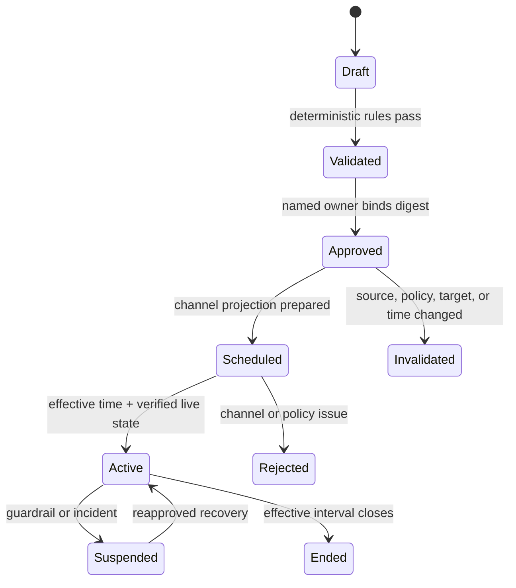

# Availability, Pricing, Promotions, and Merchandising

[← Previous: Catalog identity, offers, and channel state](03-catalog-identity-offers-and-channel-state.md) · [Blueprint home](README.md) · [Next: Content quality, policy, and outcome signals →](05-content-quality-policy-and-outcome-signals.md)

Availability, price, and promotion state are commercially sensitive and time-dependent. The agent may reason over timestamped evidence and approved constraints; deterministic services and named owners retain truth and authority.

## Availability is evidence, not inventory truth

The same item can have several legitimate quantities or states:

- physical on-hand;
- reserved or allocated;
- available to promise/sell;
- safety stock excluded from sale;
- inbound or backorderable quantity;
- channel allocation;
- storefront display availability; and
- checkout-confirmed eligibility.

These values differ by location, market, customer/catalog, fulfillment method, and time. A provider projection may be eventually consistent. The agent must never infer sellable truth from a product page, marketplace flag, or stale cache.

### Availability evidence contract

```yaml
schema: commerce.availability-evidence/v1
tenant_id: t_acme
variant_id: var_1042_blue_m
market: IN
fulfillment_context: ship_to_home
source:
  system: inventory-service
  resource_version: inv-seq-8831002
  rule_version: ats-policy-9
observed_at: 2026-08-31T11:01:04Z
valid_until: 2026-08-31T11:03:04Z
state: available
quantity:
  value: 14
  unit: each
dimensions:
  location_scope: network_IN
  channel_allocation: web_IN
confidence: authoritative_projection
restrictions:
  max_order_quantity: 3
  preorder: false
```

The agent may omit quantity from context if a categorical state is sufficient. Exact inventory values should be minimized and never persisted in conversational memory.

### Freshness budget

Define freshness per use case:

`evidence_age = decision_time - source_observed_at`

The policy engine rejects an availability-dependent proposal when `evidence_age > use_case_budget`, the source version is unknown, or the market/fulfillment dimensions do not match. A content-only recommendation may tolerate older aggregate availability; publication or promotion must use a stricter budget derived from inventory operations.

### Inventory-write boundary

Raw stock, adjustment, reservation, and allocation writes are excluded. If an operator asks the agent to “set stock to 10,” it should:

1. resolve the item and source system;
2. explain that inventory truth is outside this boundary;
3. prepare a typed handoff to the inventory/supply-chain workflow; and
4. avoid calling a channel inventory mutation that would create a conflicting source of truth.

Shopify's inventory quantity API, for example, states that the caller acts as the source of truth and supports compare-and-set semantics. This is a strong reason to keep that mutation out of this agent's tool registry.

## Exact money contract

Do not pass a bare number called `price`.

```json
{
  "schema": "commerce.money/v1",
  "amount_minor": 249900,
  "currency": "INR",
  "scale": 2,
  "market": "IN",
  "tax_basis": "tax_inclusive",
  "price_type": "sale",
  "valid_from": "2026-09-01T00:00:00+05:30",
  "valid_until": "2026-09-07T23:59:59+05:30",
  "catalog_id": "retail-in",
  "customer_context": "public",
  "policy_decision_id": "price-decision-991",
  "policy_version": "in-retail-pricing-14"
}
```

This is illustrative. Production schemas must define currency exponent exceptions, rounding, timezone/DST behavior, tax jurisdiction, unit pricing, deposits/fees, and whether the provider expects decimal strings or minor units.

### Money invariants

- Use integer minor units or exact decimals, never binary floats.
- Carry currency through every transformation; never infer it from account defaults.
- Make tax inclusion and unit basis explicit.
- Distinguish regular, sale, member/catalog, compare-at/reference, minimum advertised, and unit price.
- Bind price to market, catalog/customer context, item/offer, and effective interval.
- Obtain an authoritative policy decision; model reasoning cannot replace it.
- Recalculate provider projection deterministically and compare exact values before commit.
- Read back the provider's processed price and, where feasible, storefront/checkout-visible price.
- Stop on rounding, currency, reference-price, tax, or interval ambiguity.

## Price recommendation boundary

Competitive-price, featured-offer, demand, conversion, margin-band, and inventory observations can support a recommendation. They cannot authorize a price.

A useful recommendation contains:

```yaml
schema: commerce.price-recommendation/v1
offer_ref: binding_01J...
hypothesis: Align the approved public price with the current pricing-service corridor.
observations:
  - competitive_threshold: INR_245000
  - current_processed_price: INR_259900
  - conversion_window: 28d
constraint_refs:
  - price-policy-decision:pd_991
recommended_action:
  kind: request_pricing_decision
  candidate_amount_minor: 249900
uncertainty:
  confidence: medium
  missing: [incrementality_test, current_fulfillment_cost]
forbidden_action: direct_channel_price_write
```

The model may rank or explain candidates produced by a deterministic optimizer/pricing service. It should not invent the objective function, elasticity, costs, or legal constraints.

## Promotions as governed state machines

A promotion is more than a code and percentage. Represent:

- promotion identity and owner;
- objective and funding owner;
- exact benefit calculation;
- eligible products/variants/offers/markets/catalogs/customers;
- exclusions, maximums, minimum basket/order quantity;
- stacking/priority rules;
- reference-price and claims evidence;
- local start/end instants and timezone;
- channel capability and projection;
- approval and policy versions; and
- suspension/withdrawal mechanism.



Provider promotion approval and product mapping are separate from internal business approval. For example, Google Merchant reviews submitted promotions and maps a promotion ID to eligible products; internal eligibility and legal evidence still remain the merchant's responsibility.

### Promotion guardrails

Deterministic gates should cover:

- exact eligible target set and cardinality;
- price and discount corridor from the pricing service;
- funding/budget authorization where relevant;
- overlapping or stacking promotions;
- sale/reference-price policy by jurisdiction;
- start/end ordering, timezone, DST, and provider lead time;
- product availability and sellability policy;
- prohibited categories/claims;
- channel syntax and review state; and
- emergency suspend/withdraw path.

Legal rules vary. For example, EU rules on announced price reductions generally refer to a prior-price period, with specific exceptions and national implementation. Encode jurisdiction-reviewed policy in a deterministic service; do not ask the model to generalize a global rule from memory.

## Merchandising recommendations

The system may propose:

- repair priority for suppressed or incomplete offers;
- product-family/variant grouping review;
- discoverability improvements to titles, attributes, taxonomy, and images;
- assortment hypotheses for a named market or catalog;
- placement or collection hypotheses for human review;
- promotion candidates generated inside approved constraints;
- stale or conflicting channel-state remediation; and
- experiments to validate a content or merchandising hypothesis.

It must not:

- change assortment, ranking, price, discount, publication, or inventory directly;
- optimize solely for conversion while ignoring returns, margin, accessibility, policy, and customer harm;
- use protected/sensitive traits for merchandising eligibility;
- present provider attribution as causal proof; or
- learn a new standing rule from one outcome window.

### Recommendation contract

```yaml
schema: commerce.merchandising-recommendation/v1
recommendation_id: rec_01J...
tenant_id: t_acme
scope:
  market: IN
  catalog: public-web
  target_offers: [off_445, off_446]
objective: reduce_variant_selection_errors
hypothesis: Add explicit size-system attribute and improve variant labels.
evidence:
  - ref: return-aggregate:2026-W33
    observation: size_related_return_rate_above_category_baseline
  - ref: content-audit:ca_778
    observation: size_system_missing
counter_evidence:
  - attribution: size reason includes customer preference and product fit
expected_mechanism: clearer_pre_purchase_selection
confidence: medium
reversibility: high
commercial_exposure:
  offers: 2
  markets: 1
  price_change: none
required_owners: [merchandising, product_content]
evaluation_plan:
  primary: size_related_return_rate
  guardrails: [conversion_rate, support_contact_rate]
  window: 6w
```

The evaluator should score evidence fidelity, actionability, uncertainty calibration, and boundary compliance separately from style.

## Ranking and prioritization

A deterministic priority score can combine explicit normalized inputs:

`priority = impact_band × confidence × urgency × reversibility × evidence_freshness`

Use ordinal bands or documented functions; do not let a model create hidden weights. Preserve component values so an operator can override. Items with safety, legal, wrong-price, false-availability, or cross-tenant risk bypass commercial ranking into incident lanes.

### Avoid proxy optimization

Conversion alone can reward misleading copy, deep discounts, out-of-policy urgency, or changes that increase returns. A balanced recommendation view includes:

- conversion or revenue observation;
- contribution/margin band if approved;
- return/cancellation/support signals;
- search/suppression quality;
- accessibility and content-policy checks;
- inventory/fulfillment feasibility;
- customer harm or complaint risk; and
- experiment validity.

These are not collapsed into one opaque “merch score.” A decision record shows trade-offs.

## Assortment control

Assortment decisions affect contractual, physical, regulatory, and commercial constraints. The agent can produce a candidate with evidence, but humans/deterministic systems decide.

Required inputs before a proposal:

- market/catalog and channel eligibility;
- canonical identity and lifecycle state;
- approved inventory/fulfillment feasibility;
- legal/regulatory eligibility and claims status;
- price/promotion readiness;
- product-content readiness;
- operational support/returns capability;
- explicit owner and review interval; and
- reversible publication/withdrawal plan.

Never infer assortment permission from a provider accepting a product document.

## Failure matrix

| Failure | Detection | Safe behavior | Recovery owner |
|---|---|---|---|
| Stale availability evidence | `valid_until` or source lag exceeded | Stop availability-dependent proposal | Inventory/OMS owner |
| Channel shows stock but checkout rejects | Synthetic/real checkout signal or incident | Pause promotions; consider approved withdrawal; do not alter inventory | Storefront + inventory incident owner |
| Currency/tax mismatch | Exact policy comparison | Block commit | Pricing owner |
| Approved price expired before commit | Effective interval revalidation | Invalidate approval | Pricing/approver |
| Promotion overlap changes discount | Deterministic promotion simulation | Block and show conflict | Promotion owner |
| Reference-price evidence missing | Policy rule result | Route legal/pricing review | Legal/pricing |
| Competitive signal stale or incomparable | Source/time/market validation | Remove from recommendation | Merchandising analyst |
| Low conversion but stock constrained | Evidence contradiction | Mark causal ambiguity; do not recommend discount | Merchandising + inventory |
| Returns spike from small sample | Denominator/confidence check | Wait or request broader evidence | Analytics/product |

## Evaluation cases

- stale versus current availability under identical page state;
- market/currency mix-up with plausible amounts;
- tax-inclusive source projected to tax-exclusive target;
- sale begins across a DST transition;
- approved promotion target set changes before commit;
- overlapping promotions with different stacking priorities;
- price floor updated after approval;
- competitive-price signal for the wrong condition or market;
- conversion rise with a simultaneous stockout or campaign;
- high returns from low denominator;
- provider accepts promotion but leaves products unmapped; and
- merchandising suggestion tries to bypass assortment authority.

## Production checklist

- [ ] Availability carries source, version, timestamp, validity, market, fulfillment, and rule context.
- [ ] Inventory mutation tools are absent from the agent registry.
- [ ] Money is exact and includes currency, tax basis, market, catalog, and interval.
- [ ] A pricing service or named owner produces the policy decision.
- [ ] Promotion state, internal approval, provider review, and live verification are separate.
- [ ] Reference-price/legal rules are jurisdiction-reviewed and deterministic.
- [ ] Recommendations include evidence, counter-evidence, uncertainty, reversibility, exposure, and evaluation plans.
- [ ] Safety and integrity findings bypass commercial priority scoring.
- [ ] Outcome signals cannot directly trigger price, promotion, assortment, or publication changes.

## Sources and related controls

- [commercetools inventory overview](https://docs.commercetools.com/api/inventory-overview)
- [Shopify `inventorySetQuantities`](https://shopify.dev/docs/api/admin-graphql/latest/mutations/inventorySetQuantities)
- [Shopify PriceList](https://shopify.dev/docs/api/admin-graphql/latest/objects/pricelist)
- [Amazon Product Pricing API FAQ](https://developer-docs.amazon.com/sp-api/docs/pricing-faq)
- [Google Merchant promotions specification](https://support.google.com/merchants/answer/2906014?hl=en-GB)
- [FTC Guides Against Deceptive Pricing](https://www.ftc.gov/legal-library/browse/rules/deceptive-pricing)
- [EU guidance on price reductions](https://eur-lex.europa.eu/legal-content/EN/ALL/?uri=CELEX%3A52021XC1229%2806%29)
- [Idempotency and side effects](../../reliability/idempotency-and-side-effects.md)

[← Previous: Catalog identity, offers, and channel state](03-catalog-identity-offers-and-channel-state.md) · [Blueprint home](README.md) · [Next: Content quality, policy, and outcome signals →](05-content-quality-policy-and-outcome-signals.md)
