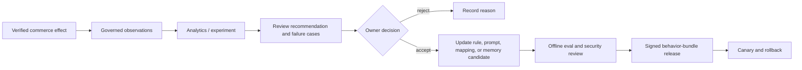

# Content Quality, Policy, and Outcome Signals

[← Previous: Availability, pricing, promotions, and merchandising](04-availability-pricing-promotions-and-merchandising.md) · [Blueprint home](README.md) · [Next: Tools, effects, reconciliation, and recovery →](06-tools-effects-reconciliation-and-recovery.md)

Product content is both business data and untrusted input. The system must distinguish structural completeness, factual evidence, policy compliance, accessibility, channel readiness, and commercial performance rather than hiding them behind one “quality” score.

## Quality dimensions

| Dimension | Question | Best evaluator | Authority |
|---|---|---|---|
| Structural completeness | Are required fields present and well typed? | Deterministic schema | PIM/channel configuration |
| Identity consistency | Do title, brand, GTIN, SKU, options, images, and offer refer to the same trade item? | Deterministic checks plus human ambiguity review | Product identity owner |
| Factual support | Can every material claim be traced to an approved source? | Evidence rule plus subject-matter reviewer | Product/legal owner |
| Channel conformance | Does the projection satisfy the current product type, enums, length, image, and policy schema? | Provider schema/validation/status | Channel policy is necessary but not sufficient |
| Discoverability | Are customer search terms represented naturally in accurate fields? | Search evidence plus bounded semantic review | Merchandising/content owner |
| Accessibility | Does text alternative and product media communicate equivalent purpose in context? | Deterministic checks plus accessibility review | Accessibility owner |
| Localization | Are language, units, claims, cultural context, and legal requirements appropriate for the market? | Locale rules plus qualified reviewer | Market/content/legal owner |
| Commercial outcome | Did a controlled or credible observation improve useful outcomes without harmful guardrails? | Experiment/analytics | Product/experimentation owner |

PIM completeness is useful but narrow: required fields can be filled with inaccurate, unsupported, inaccessible, or channel-incompatible content. Keep each dimension visible.

## Quality finding contract

```yaml
schema: commerce.content-finding/v1
finding_id: cf_01J...
tenant_id: t_acme
target:
  product_id: prod_1042
  variant_id: var_1042_blue_m
  market: IN
  channel: public-web
field_path: product.description
dimension: factual_support
severity: high
rule_or_evaluator: claim-evidence-check@3.4
observation: "Dermatologist approved" has no approved evidence reference.
evidence:
  source_revision: pim:prod_1042:37
  content_hash: sha256:...
  approved_claim_registry_match: none
suggested_disposition: remove_or_legal_review
authority_required: legal_product_claims
automatic_fix_permitted: false
```

Findings carry evidence, version, target, and owner. A model explanation cannot change severity or authority class unless policy explicitly permits a reviewed classification step.

## Validation pipeline

```mermaid
flowchart LR
    A[Versioned source fields] --> B[Schema and required-field checks]
    B --> C[Identity and cross-field consistency]
    C --> D[Claim and prohibited-content policy]
    D --> E[Accessibility and localization checks]
    E --> F[Provider-native validation / preview]
    F --> G[Bounded semantic review]
    G --> H[Human review where required]
    H --> I[Immutable approved projection]
```



Run deterministic checks before model inference. This reduces token cost, avoids asking the model to rediscover exact rules, and prevents invalid content from becoming an authoritative prompt.

## Claims and evidence

Advertising claims must be truthful, non-deceptive, and appropriately supported. The agent cannot determine legal sufficiency from prose alone.

Maintain an approved claim registry with:

- normalized claim or claim family;
- product/category/market scope;
- allowed wording and prohibited transformations;
- evidence artifact and owner;
- substantiation/review type;
- disclaimer/placement requirements;
- effective and expiry dates;
- channels/locales covered; and
- legal/product approver and decision version.

A generated title, bullet, description, alt text, or structured-data field must map each material assertion to this registry or an authoritative product fact. If no support exists, the system should omit the assertion or request review—not soften it into an apparently harmless synonym.

### Claim-sensitive categories

Create stricter policies for health, safety, environmental, financial, child-directed, age-restricted, regulated, origin, certification, compatibility, performance, scarcity, and comparative claims. Category classification itself may require human/legal authority.

Never let the agent transform an observation such as “many reviewers like the fit” into “clinically proven ergonomic fit.” Customer reviews and return notes are not substantiation.

## Accessibility

Accessibility is contextual. W3C guidance distinguishes informative, functional, decorative, complex, and text-containing images; the appropriate text alternative depends on purpose and surrounding content.

For product media:

- identify the media role: primary product view, variant swatch, sizing diagram, instruction, certification label, lifestyle context, decoration, or video;
- preserve essential information that is not available in adjacent text;
- use an empty alternative only when the image is truly decorative in that context;
- avoid redundant marketing filler and keyword stuffing;
- represent variant-specific differences;
- route complex diagrams or safety instructions to content/accessibility owners; and
- verify the rendered storefront, focus/selection behavior, labels, target sizes, contrast, and keyboard/screen-reader experience outside the product-feed agent.

Model-generated alt text is a draft. The agent cannot certify WCAG conformance or European Accessibility Act compliance.

## Localization and market adaptation

Translation is not sufficient. The evidence packet should include:

- source locale and target locale;
- approved terminology and brand glossary;
- unit system and exact conversion rule;
- size system and fit guidance;
- local category taxonomy and provider enumerations;
- market-specific claims/disclaimers;
- legal or cultural exclusions;
- price/currency/tax context; and
- fallback/approval owner.

Do not translate SKUs, GTINs, trademarks, certifications, or regulated terms unless their owning policy explicitly says so. Store both source and approved localized value with provenance.

## Channel-specific readiness

Google, Amazon, Shopify, and other channels have different required fields, product-type schemas, image behavior, publication mechanisms, and policy review. Build a readiness result per channel/account/market/schema version.

```json
{
  "schema": "commerce.channel-readiness/v1",
  "target": "t_acme:acct_778:IN:off_445",
  "provider_schema": "google-merchant-product@2026-08-31",
  "source_revision": "pim:prod_1042:37",
  "status": "blocked",
  "checks": {
    "structural": "pass",
    "identity": "pass",
    "claims": "fail",
    "accessibility": "review",
    "provider_preview": "pass"
  },
  "blocking_findings": ["cf_01J..."],
  "not_evaluated": ["checkout_observability"]
}
```

Avoid a numeric score that lets a severe claim failure be averaged away by many complete fields. Overall state is the strictest blocking dimension under policy.

## Safe content generation

### Allowed pattern

1. Select approved source facts and claim references.
2. Build a minimal field-specific context packet.
3. Generate structured candidates with source citations per assertion.
4. Reject unsupported assertions, prohibited terms, identity changes, and missing facts deterministically.
5. Compare candidate against channel constraints and brand/localization rules.
6. Route required dimensions to named reviewers.
7. Save an immutable proposed field diff, never overwrite the source.
8. Publish only through the D3 effect path after approval.

### Candidate contract

```yaml
schema: commerce.content-candidate/v1
field: title
locale: en-IN
candidate: "Acme Trail Jacket — Blue, Size M"
assertions:
  - text_span: Acme
    evidence_ref: pim.brand@rev37
  - text_span: Trail Jacket
    evidence_ref: pim.product_name@rev37
  - text_span: Blue
    evidence_ref: pim.color@rev12
  - text_span: Size M
    evidence_ref: pim.size@rev12
transform_rules: [title-template@5, provider-length@2026-08]
unsupported_assertions: []
model_release: behavior-bundle-2026.09.1
```

### Disallowed pattern

- Give the model a supplier PDF or product HTML and ask it to publish “the best listing.”
- Treat the source's embedded instructions as workflow instructions.
- Ask the model to fabricate missing materials, dimensions, compatibility, certifications, or benefits.
- Automatically adopt a candidate because provider validation accepts it.
- Use generated fields to update canonical product truth without the product-content lifecycle.

## Untrusted content handling

All external content is hostile-capable:

- supplier descriptions and documents;
- product HTML and metadata;
- marketplace issue text;
- reviews, questions, returns notes, and support content;
- image OCR, alt text, EXIF, and filenames;
- spreadsheet formulas/macros and CSV injection strings;
- URLs and redirects; and
- tool outputs containing natural language.

Defenses:

- parse and normalize in an isolated ingestion zone;
- strip active content and do not execute embedded links/code;
- label origin, trust class, and permitted use at field level;
- provide data inside a typed envelope, not as blended system instructions;
- prevent untrusted fields from changing target, tool, authority, or policy;
- keep dangerous write tools absent from analysis stages;
- use output schemas plus deterministic policy checks; and
- include source-to-sink adversarial evaluations.

Filtering phrases such as “ignore previous instructions” is not a complete defense. The architecture must constrain impact even when the model misinterprets content.

## Returns signals

Returns can expose product-content and merchandising defects, but they cross category boundaries and can contain personal or sensitive data.

The permitted input is normally an aggregate:

```yaml
schema: commerce.return-signal/v1
variant_id: var_1042_blue_m
market: IN
window: 2026-07-01/2026-08-15
cohort_definition: fulfilled_web_orders
denominator: 842
returned_units: 61
reason_distribution:
  size_too_small: 27
  size_too_large: 8
  not_as_described: 6
  other: 20
privacy:
  classification: aggregated
  minimum_cell_size_passed: true
source: returns-analytics@dataset-2026-08-20
```

The agent should not receive names, contact details, addresses, order notes, free-text explanations, images, or case transcripts by default. Support owns case interpretation; Supply Chain owns return movement; Finance owns refund accounting.

### Interpretive limits

- Reason codes can be inconsistent, self-selected, or operationally assigned.
- A return rate needs a denominator and cohort definition.
- Product changes, seasonality, campaign mix, and fulfillment issues confound trends.
- Low counts need suppression or uncertainty handling.
- “Not as described” may indicate content, product quality, fulfillment error, fraud, or expectation mismatch.

Treat a return signal as a hypothesis trigger, not a verdict.

## Conversion and performance signals

Require:

- metric definition and source;
- event/click/order attribution method;
- numerator, denominator, time window, timezone, and lag;
- product/offer/market/channel identity;
- data completeness and known outages;
- experiment assignment if applicable;
- concurrent price, promotion, availability, campaign, and content changes; and
- privacy classification.

Marketplace reports may use attributed and fractional conversions. A rise in provider-reported conversion does not by itself prove that the agent's content change caused incremental sales.

### Evaluation ladder for commercial outcomes

1. **Technical integrity:** intended field is processed and observable; no wrong target or unintended deletion.
2. **Leading quality:** completeness, search relevance, suppression, or selection error improves.
3. **Behavior observation:** conversion, add-to-cart, returns, and support signals move.
4. **Causal evidence:** controlled experiment or credible quasi-experimental analysis attributes the effect.
5. **Policy adoption:** human owner accepts the change as a reusable pattern through governed release.

Do not skip from level 2 to level 5.

## Outcome feedback boundary



There is no direct edge from outcomes to live behavior. Online learning can amplify seasonality, promotion confounding, fraud, bot traffic, and misleading short-term metrics.

## Evaluation matrix

| Scenario | Expected result |
|---|---|
| Required fields complete but claim unsupported | Readiness blocked; completeness does not override claim gate |
| Image is decorative in one page and informative in another | Different alt behavior based on context; no universal generated string |
| Supplier content contains tool instructions | Content treated as data; tool/authority unchanged |
| Return note includes an address and complaint | Raw note excluded; aggregate route only |
| High conversion with high returns | Trade-off surfaced; no automatic promotion |
| Provider accepts generated title | Still requires factual/brand approval and live reconciliation |
| Locale translation changes certification wording | Block and route qualified reviewer |
| Small-cell return spike | Suppress/flag uncertainty; do not expose individuals |
| Product performance report attributes fractional conversion | Preserve metric semantics; do not round into order truth |
| Model candidate adds a plausible material | Unsupported assertion rejected |

## Production checklist

- [ ] Completeness, identity, facts, claims, accessibility, localization, provider readiness, and outcomes are separate dimensions.
- [ ] Severe policy findings cannot be averaged away.
- [ ] Every material generated assertion maps to an approved source.
- [ ] Accessibility output is contextual and reviewer-governed.
- [ ] Untrusted content cannot influence tool, target, authority, or policy.
- [ ] Raw support/return/customer data is excluded by default.
- [ ] Performance metrics preserve denominator, attribution, time window, lag, and confounders.
- [ ] Outcome observations cannot directly update production behavior.
- [ ] Generated content remains a draft until the normal content and effect lifecycles approve it.

## Sources and related controls

- [FTC advertising and marketing guidance](https://www.ftc.gov/business-guidance/advertising-marketing)
- [FTC Advertising FAQs](https://www.ftc.gov/business-guidance/resources/advertising-faqs-guide-small-business)
- [W3C WAI Images Tutorial](https://www.w3.org/WAI/tutorials/images/)
- [Google product structured data](https://developers.google.com/search/docs/appearance/structured-data/product)
- [Google Merchant reports overview](https://developers.google.com/merchant/api/guides/reports/overview)
- [Shopify protected customer data](https://shopify.dev/docs/apps/launch/protected-customer-data)
- [Shopify ReturnLineItem](https://shopify.dev/docs/api/admin-graphql/latest/objects/returnlineitem)
- [Akeneo product completeness](https://help.akeneo.com/v7-your-first-steps-with-akeneo/v7-understand-product-completeness)
- [Prompt injection and untrusted data](../../security/prompt-injection-and-untrusted-data.md)

[← Previous: Availability, pricing, promotions, and merchandising](04-availability-pricing-promotions-and-merchandising.md) · [Blueprint home](README.md) · [Next: Tools, effects, reconciliation, and recovery →](06-tools-effects-reconciliation-and-recovery.md)
