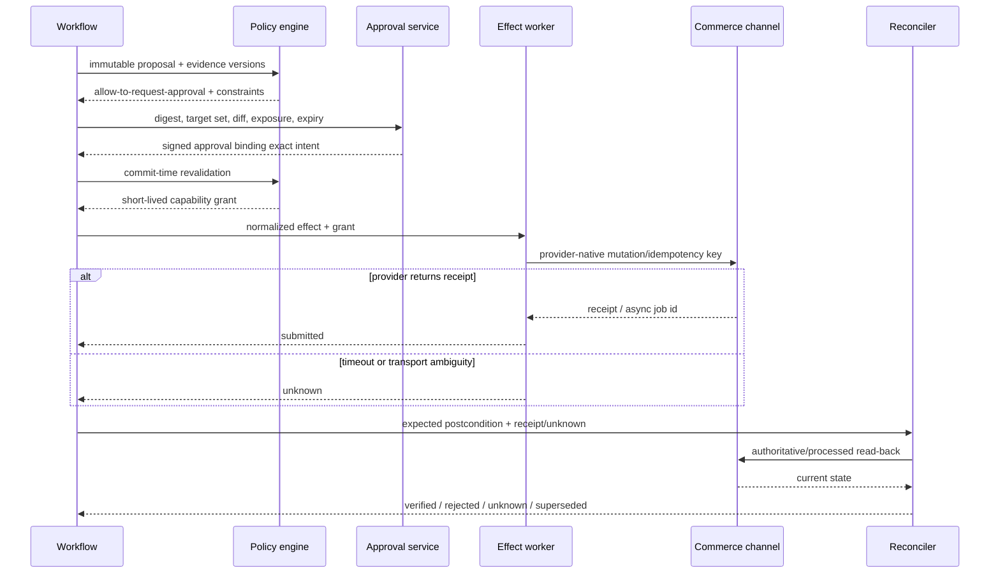
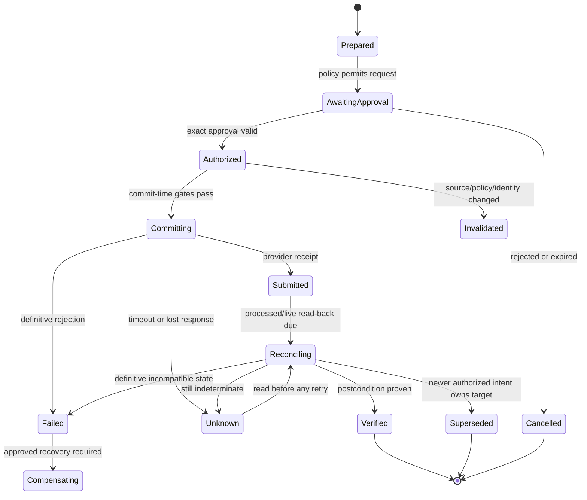
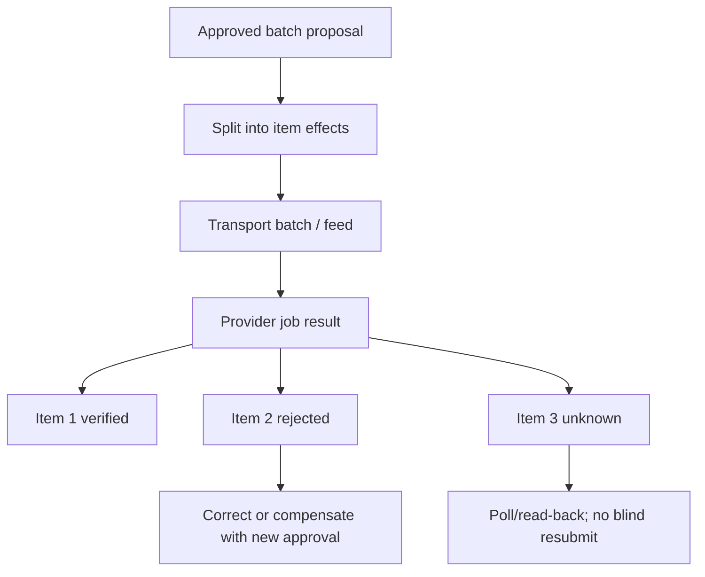

# Tools, Effects, Reconciliation, and Recovery

[← Previous: Content quality, policy, and outcome signals](05-content-quality-policy-and-outcome-signals.md) · [Blueprint home](README.md) · [Next: State, context, memory, and planning →](07-state-context-memory-and-planning.md)

A tool is not safe because its name sounds narrow. Its real authority is the maximum external effect possible with its credentials, input schema, provider behavior, and reachable targets.

## Tool design principles

Every tool contract must declare:

- semantic name and version;
- stage(s) in which it can be discovered;
- authority class D0–D4;
- tenant/account/market binding source;
- input and output schema;
- field and target allowlists;
- credential identity and provider scopes;
- timeout and cancellation behavior;
- retry safety and idempotency strategy;
- rate/size/cardinality limits;
- partial-result shape;
- error taxonomy and retry hint;
- receipt, postcondition, and reconciliation method;
- data classification and trace redaction; and
- owner, rollout state, deprecation, and kill switch.

Tool descriptions must also explain provider-specific destructive semantics. “Updates a product” is insufficient if omitted arrays delete variants or attributes.

## Capability matrix

| Capability | Class | Agent behavior | Credential/control |
|---|---:|---|---|
| Validate canonical/product/provider schema | D0 | Invoke automatically | No network write; pinned schema |
| Render exact product/offer diff and preview | D0 | Invoke automatically | Sandboxed renderer |
| Read PIM product/variant revision | D1 | Invoke inside run scope | Read-only PIM field allowlist |
| Read inventory availability evidence | D1 | Invoke inside product/market scope | Read-only inventory projection; no quantity mutation |
| Read provider submitted/processed/publication/issues | D1 | Invoke inside bound account | Read-only account credential |
| Read aggregated returns/performance | D1 | Invoke only if purpose and privacy policy allow | Aggregated view; minimum-cell controls |
| Run provider validation preview | D2 | Invoke automatically for immutable proposal | Preview/test endpoint; no live publication |
| Create internal PIM draft or review task | D2 | Invoke if reversible and policy allows | Draft-only scope; exact target; audit |
| Publish/unpublish live product or offer | D3 | Prepare only; commit after exact approval | Effect-specific connector and limits |
| Change live content, price, or promotion | D3 | Prepare only; amounts/fields fixed by approved proposal | Separate credential/capability per effect type |
| Bulk live correction | D3 | Prepare only; stricter cardinality and separation of duties | Bulk-specific grant, canary, rollback, read-back |
| Inventory quantity/reservation change | Excluded | Reject and route Supply Chain/Inventory owner | Tool absent |
| Refund/order/customer-message/payment action | Excluded | Reject and route owning workflow | Tool absent |
| Credential, scope, policy, approver, or tenant-routing change | D4 | Produce administrative proposal only | Separate admin control plane |

Do not combine reads and writes in a generic provider admin tool. Do not expose D3 tools during analysis and rely on the prompt to prevent calls.

## Prepare–authorize–commit–reconcile protocol



The approval is permission to attempt an exact effect, not evidence of completion.

## Immutable proposal

```yaml
schema: commerce.effect-proposal/v1
proposal_id: prop_01J...
tenant_id: t_acme
effect_type: offer_price_update
authority_class: D3
target:
  provider: example_marketplace
  account_id: acct_778
  market: IN
  offer_id: off_445
desired_change:
  from:
    amount_minor: 259900
    currency: INR
  to:
    amount_minor: 249900
    currency: INR
  effective_interval: 2026-09-01T00:00:00+05:30/2026-09-07T23:59:59+05:30
evidence_manifest:
  product_revision: 37
  offer_revision: 12
  provider_projection: etag:abc123
  price_policy_decision: pd_991
  policy_version: in-retail-pricing-14
adapter_contract: marketplace-offers@7.3.1
preview_hash: sha256:...
rollback:
  type: compensating_effect
  last_known_good_hash: sha256:...
expires_at: 2026-08-31T18:00:00Z
proposal_digest: sha256:canonicalized-document
```

The proposal must not contain a model-editable expression such as “reduce price by around 4%.” Exact normalized values and target set are fixed before approval.

## Approval contract

An approval binds:

- proposal digest and schema version;
- tenant, provider account, market, catalog, and exact target set;
- exact field diff/parameters;
- product/offer/provider/policy source versions;
- authority class and maximum cardinality/exposure;
- approver identity, role, organization, and authentication assurance;
- purpose, separation-of-duties result, and exception reason if any;
- issued/expiry time and one-time or bounded-use semantics; and
- behavior-bundle and adapter release.

Approval becomes invalid on target expansion, field or amount change, source revision change, policy change, adapter/schema change, expiry, or role revocation. The workflow returns to proposal construction; it does not ask the model whether the difference is “material.”

## Semantic effect identity

Workflow durability cannot guarantee exactly-once effects across a provider boundary. Define a semantic identity from stable business intent:

`effect_key = hash(tenant, account, effect_type, target_identity, normalized_parameters, effective_interval, proposal_digest)`

Store parameter equivalence separately from transport attempts. A retry with a new request ID may still be the same semantic effect; a changed amount, target set, or effective interval is a new proposal/effect.

Prefer, in order:

1. downstream idempotency key with documented semantics;
2. conditional update/compare-and-set using provider revision;
3. create with stable client reference followed by lookup;
4. precondition read plus postcondition verification under a narrow lease; or
5. if none exist, one attempt followed by reconciliation and human handling of uncertainty.

## Effect ledger

```yaml
effect_id: eff_01J...
effect_key: sha256:...
proposal_id: prop_01J...
state: reconciling
lease:
  owner: worker-12
  fencing_token: 88
attempts:
  - attempt_id: att_1
    request_id: req_abc
    started_at: 2026-09-01T00:00:04Z
    result: timeout_after_send
provider_receipts: []
expected_postcondition:
  provider_price_minor: 249900
  currency: INR
next_reconcile_at: 2026-09-01T00:02:00Z
unknown_deadline: 2026-09-01T00:30:00Z
owner: commerce-ops-oncall
```

The record needs an append-only event history even if a materialized current state is maintained for queries.

## Effect state machine



No generic `success` state should collapse `submitted`, `processed`, `published`, and `verified`.

## Retry classification

| Failure | Retry? | Required behavior |
|---|---|---|
| Input/schema/policy rejection | No | Fix proposal or adapter; retain evidence |
| Authentication/authorization failure | No automatic retry | Stop connector; verify account/credential binding |
| Quota/rate limit with retry hint | Yes, bounded | Queue with provider hint/backoff; preserve priority lanes |
| Network failure before request send is proven | Bounded if transport proves no send | Record transport evidence |
| Timeout after request may have been sent | No blind retry | Mark unknown and read postcondition/receipt |
| Provider internal/transient failure | Bounded only if provider semantics and effect idempotency allow | Same semantic effect key; jittered backoff |
| Partial batch result | Only failed members after per-item classification | Each item has independent effect state |
| Schema/version incompatibility | No | Circuit-break adapter release and revalidate |
| Stale conditional revision | No immediate overwrite | Re-read; determine authorized owner of new state |

## Reconciliation algorithm

For each due effect:

1. Acquire a lease with fencing.
2. Load immutable proposal, approval, expected postcondition, attempts, receipts, and superseding effects.
3. Verify tenant/account/target binding and connector health.
4. Use the provider's authoritative or processed read endpoint; do not rely only on cached events.
5. Normalize observed state with the adapter version that understands the provider response.
6. Compare exact postcondition fields, including currency, interval, publication, and target identity.
7. Classify `verified`, `pending`, `rejected`, `conflict`, `superseded`, or `unknown`.
8. Schedule another read within the provider propagation budget, or assign an incident owner at the unknown deadline.
9. Never reapply if a newer authorized intent owns the target.
10. Append evidence and release the lease.

### Postcondition examples

| Effect | Verification |
|---|---|
| Product field update | Processed provider resource has exact expected normalized field/hash and no blocking issue |
| Publication | Correct resource is active on correct publication/catalog and observable where feasible |
| Withdrawal | Resource is unpublished/suppressed in provider state and no longer checkout eligible within defined scope |
| Price | Exact currency/amount/context/interval is processed and storefront/offer observation matches where available |
| Promotion | Provider promotion accepted, mapped to exact offers, active in interval, and effective price/benefit is observable |
| Bulk feed | Feed job complete; every item resolved independently; total counts and target set reconcile |

## Bulk effects and partial failure

A provider batch is a transport optimization, not one business effect. Create one semantic effect per independently verifiable item plus a parent batch record.



Persist target counts before send, accepted/rejected/unknown counts after processing, and a list of every unresolved item. A batch cannot be called complete because the feed job completed.

## Compensation and rollback

Rollback is a new effect, not a database undo. It needs current-state read-back, policy revalidation, authorization proportional to risk, and its own receipt/postcondition.

Prefer:

- versioned draft/current publication mechanisms;
- last-known-good provider projection;
- reversible content/publication changes;
- feature flags or connector kill switches; and
- narrow corrective effects.

Price rollback may be legally or commercially inappropriate after a promotion starts; product withdrawal may be safer. Inventory writes are not a rollback option in this agent.

## Browser/RPA last resort

Use UI automation only if no supported API/feed exists and the business value justifies the risk. Require:

- dedicated, least-privilege account and isolated browser profile;
- exact target allowlist and human approval per D3 effect;
- stable page fingerprint and step-level assertions;
- screenshots/DOM evidence with secrets and customer data redacted;
- one item or very small canary before bulk;
- no CAPTCHA/MFA bypass;
- explicit unknown handling after UI timeout;
- provider terms/security review; and
- immediate kill switch plus supported read-back where possible.

Never use visual similarity alone to select a price, product, or publication target.

## Failure-recovery playbooks

### Wrong price observed

1. Stop price/promotion connectors for affected tenant/account.
2. Preserve approval, proposal, request, receipt, processed, and observable evidence.
3. Determine scope using exact effect ledger and full price reconciliation.
4. Activate approved correction/withdrawal runbook; do not ask the model to choose the remedy.
5. Verify checkout-visible correction where lawful and feasible.
6. Notify pricing, legal, commerce, support, and incident owners under policy.
7. Evaluate identity, currency, rounding, interval, adapter, approval, and reconciliation failure before re-enable.

### False availability or oversell risk

Stop promotions/publication actions dependent on the stale source, involve inventory/storefront owners, prefer approved listing withdrawal over fabricated quantity changes, and reconcile affected offers.

### Bulk content corruption

Stop bulk connector, freeze new proposals using the adapter bundle, calculate exact affected target set, compare last-known-good projections, prepare a reviewed compensating batch, and canary before restoration.

### Unknown provider effect

Keep the effect in `unknown`; suppress semantically equivalent retries; query receipt/job/resource; wait within provider propagation budget; escalate at deadline with current observed state and recovery options.

## Tool and effect acceptance tests

- model invents a target outside the proposal;
- approval expires one millisecond before commit;
- policy changes after approval;
- provider times out after applying change;
- duplicated worker attempts with the same effect key;
- stale worker resumes with an old fencing token;
- batch accepts 99 items and omits one result;
- provider normalizes an amount or content field;
- newer manual/authorized state exists during reconciliation;
- bulk list mutation clears omitted fields;
- write credential is accidentally mounted in a read-only worker; and
- connector kill switch activates during commit.

## Production checklist

- [ ] Stage capability registry contains no unnecessary tools.
- [ ] Every tool exposes provider-native semantics and a typed failure contract.
- [ ] Approval binds immutable intent and expires.
- [ ] Commit revalidates identity, source, policy, permission, and freshness.
- [ ] Semantic effect identity is independent of request/attempt identity.
- [ ] `unknown` blocks blind retry and has a reconciliation deadline/owner.
- [ ] Batch members reconcile independently.
- [ ] Rollback is a new authorized effect.
- [ ] Browser automation is isolated and exceptional.
- [ ] Kill switches operate by tenant, connector, effect type, bulk mode, and release.

## Sources and related controls

- [Google Merchant API error handling](https://developers.google.com/merchant/api/guides/error-handling)
- [Amazon Listings API FAQ](https://developer-docs.amazon.com/sp-api/docs/listings-apis-faq)
- [Amazon Feeds API best practices](https://developer-docs.amazon.com/sp-api/lang-US/docs/feeds-api-best-practices)
- [Shopify `productSet`](https://shopify.dev/docs/api/admin-graphql/latest/mutations/productSet)
- [Shopify webhook verification and delivery](https://shopify.dev/docs/apps/build/webhooks/verify-deliveries)
- [AWS Builders' Library: Making retries safe with idempotent APIs](https://aws.amazon.com/builders-library/making-retries-safe-with-idempotent-APIs/)
- [Tool contracts](../../tools/tool-contracts.md)
- [Idempotency and side effects](../../reliability/idempotency-and-side-effects.md)
- [Durable execution](../../runtime/durable-execution.md)

[← Previous: Content quality, policy, and outcome signals](05-content-quality-policy-and-outcome-signals.md) · [Blueprint home](README.md) · [Next: State, context, memory, and planning →](07-state-context-memory-and-planning.md)
