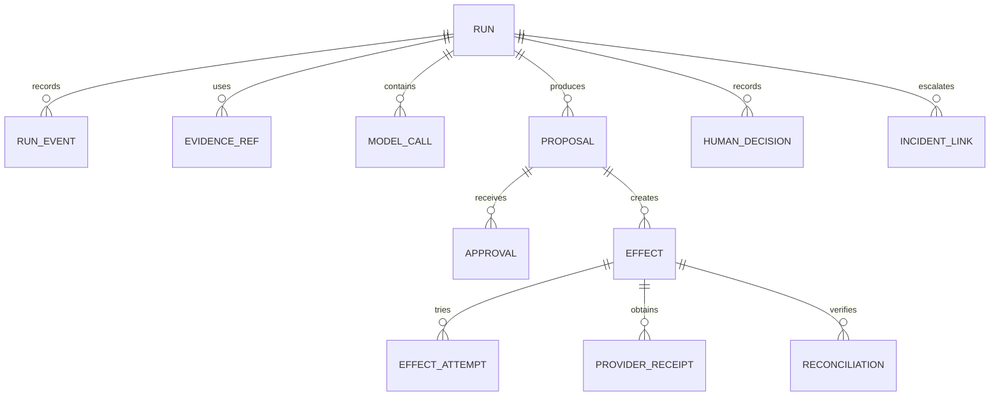

# State, Context, Memory, and Planning

[← Previous: Tools, effects, reconciliation, and recovery](06-tools-effects-reconciliation-and-recovery.md) · [Blueprint home](README.md) · [Next: Security, privacy, permissions, and governance →](08-security-privacy-permissions-and-governance.md)

Commerce facts change too quickly to live safely in conversational memory. Durable state records what happened; authoritative systems own business truth; context is a minimal snapshot for one inference; memory contains only governed reusable knowledge.

## Four distinct data concepts

| Concept | Purpose | Examples | Owner |
|---|---|---|---|
| Authoritative business state | Current product, inventory, price, order, policy, and publication decisions | PIM revision, inventory projection, pricing decision | Domain system outside agent |
| Durable run/effect state | Recoverable workflow history and control evidence | run state, proposal, approval, effect attempts, receipts | Commerce control plane |
| Working context | Bounded evidence presented to one model call | selected fields, issues, rules, candidate mappings | Context builder; ephemeral or short retention |
| Governed memory | Reviewed reusable preference or mapping | approved terminology, confirmed mapping exception, reviewer preference | Named business/data owner |

Do not use a vector database as a substitute for these distinctions.

## Durable state model

Minimum entities:



### Run envelope

```yaml
schema: commerce.run/v1
run_id: run_01J...
tenant_id: t_acme
requester:
  principal_id: user_789
  auth_context: workforce-sso:loa2
purpose: investigate_listing_suppression
scope:
  channel_account: acct_778
  market: IN
  target_refs: [binding_01J...]
behavior_bundle: commerce-agent-2026.09.1
current_stage: evidence_ready
allowed_authority: [D0, D1]
budgets:
  wall_clock_ms: 120000
  model_tokens: 24000
  tool_calls: 20
  provider_reads: 12
deadlines:
  run: 2026-08-31T12:00:00Z
retention_class: commerce-operational-90d
correlation:
  request_id: req_abc
  trace_id: 4bf92f...
```

Budgets are policy inputs, not suggestions to the model. Production values must be calibrated by workload and provider constraints.

### Run event envelope

```json
{
  "schema": "commerce.run-event/v1",
  "event_id": "evt_01J...",
  "run_id": "run_01J...",
  "tenant_id": "t_acme",
  "sequence": 18,
  "event_type": "proposal_validated",
  "occurred_at": "2026-08-31T11:44:02Z",
  "recorded_at": "2026-08-31T11:44:03Z",
  "actor": {"type": "policy_service", "id": "catalog-policy"},
  "artifact_refs": ["prop_01J...", "policy-result_01J..."],
  "behavior_bundle": "commerce-agent-2026.09.1",
  "previous_event_hash": "sha256:...",
  "event_hash": "sha256:..."
}
```

An append-only event history improves recovery and audit, but it does not make logs tamper-proof by itself. Access control, retention, integrity checks, and external audit storage remain necessary.

## State ownership and consistency

| State | Consistency need | Conflict rule |
|---|---|---|
| Product/variant revision | Read exact snapshot for proposal | Source change invalidates proposal |
| Inventory evidence | Freshness-bound read | Stale evidence blocks dependent action |
| Price/promotion decision | Exact version and interval | Current deterministic policy wins at commit |
| Approval | Strong binding to digest and role | Any material difference invalidates |
| Effect lease | Conditional write/fencing | Stale owner cannot commit |
| Provider projection | Eventually consistent observation | Reconcile; do not overwrite source truth |
| Human decision | Append-only revision | New decision supersedes with explicit link |
| Governed memory | Versioned, reviewed | No automatic production update |

## Context packet

A model call receives a task-specific packet rather than a transcript dump.

```yaml
schema: commerce.context-manifest/v1
run_id: run_01J...
stage: suppression_diagnosis
task: Explain blocking issues and propose a non-authoritative repair plan.
authority:
  max: D1
  allowed_tools: [read_product_projection, read_channel_status, validate_provider_schema]
  forbidden: [publish, price_write, promotion_write, inventory_write]
identity:
  binding_status: exact
  binding_ref: binding_01J...
evidence:
  - ref: pim:prod_1042:37
    fields: [brand, title, category, attributes, variants]
    trust: authoritative_product
  - ref: channel:acct_778:off_445:etag_abc
    fields: [submitted, processed, issues]
    trust: provider_observation
policies:
  - catalog-policy@14
  - claims-policy-IN@8
output_schema: commerce.suppression-diagnosis/v2
budgets:
  remaining_tool_calls: 6
  remaining_tokens: 8000
unknowns: [provider_policy_review_queue_age]
```

Every content block should include source, revision/time, trust class, and permitted use. The model should be instructed to cite evidence references in structured output.

## Context construction pipeline


Token limits are the last constraint, not the first selection principle. First exclude unauthorized, irrelevant, stale, or unproven data.

### Context selection rules

- Prefer exact fields and diffs over whole JSON documents.
- Include current source plus last-known-good/failed projection only when comparison is needed.
- Keep source text and instructions in separate structural fields.
- Include policy decision outputs and relevant rule excerpts, not entire policy libraries.
- Include explicit unknowns and missing evidence so the model does not fill gaps.
- Use artifact references for images, schemas, feeds, and histories; fetch bounded slices through read-only tools.
- Record every included source and transformation in the context manifest.
- Rebuild context after source revision or stage change.

## Planning contract

Planning is a typed, bounded choice among permitted read/analysis steps. It is not authority to invent a workflow.

```json
{
  "schema": "commerce.investigation-plan/v1",
  "goal": "classify current suppression and propose a repair",
  "assumptions": [],
  "unknowns": ["current product-type schema", "processed issue details"],
  "steps": [
    {
      "id": "s1",
      "kind": "read",
      "tool": "read_channel_status",
      "reason": "obtain processed issues",
      "max_calls": 1
    },
    {
      "id": "s2",
      "kind": "validate",
      "tool": "validate_provider_schema",
      "depends_on": ["s1"],
      "max_calls": 1
    }
  ],
  "stop_conditions": ["identity_conflict", "schema_unavailable", "tool_budget_exhausted"],
  "output": "commerce.suppression-diagnosis/v2"
}
```

The workflow validates the plan against stage tools, budgets, data policy, and dependency rules. Loops need maximum iterations and progress criteria. A repeated identical call without new evidence is stopped.

## Durable objectives, waits, and handoffs

A plan is disposable reasoning; a durable objective is an owned operational obligation. Long provider reviews, future promotion windows, approval waits, inventory-freshness refreshes, and reconciliation deadlines must survive worker, model, and region restarts.

```yaml
schema: commerce.objective/v1
objective_id: obj_01J...
run_id: run_01J...
kind: verify_multi_channel_publication
scope_digest: sha256:...
terminal_conditions: [all_effects_verified, cancelled_after_reconciliation, incident_handoff_accepted]
clocks:
  approval_expires_at: 2026-09-01T00:00:00Z
  provider_review_not_before: 2026-09-01T00:05:00Z
  reconciliation_due_at: 2026-09-01T00:07:00Z
  business_effective_deadline: 2026-09-01T00:30:00Z
pending_effects: [eff_shopify_1, eff_google_1, eff_amazon_1]
owner: commerce-ops-oncall
handoff:
  queue: commerce-corrections
  required_evidence: [proposal, approval, attempts, receipts, current_readbacks]
```

Timer firing does not authorize an action. On wake, reload durable state, verify the timer generation, re-read current sources, re-evaluate approval/policy/effective-window validity, and then choose only a registered transition. Cancellation prevents new attempts but retains timers or ownership needed to reconcile an already-sent effect. A human handoff is complete only after the receiving queue or person records acceptance; sending a message is not transfer of responsibility.

## Compaction and continuity

Long investigations should checkpoint typed state rather than retain every message. A continuity checkpoint contains:

- run/tenant/purpose/scope and current stage;
- resolved identities and ambiguity status;
- authoritative evidence references and revisions;
- confirmed findings and rejected hypotheses;
- outstanding unknowns and requested evidence;
- tool calls/results summarized with artifact links;
- budgets and deadlines remaining;
- proposals/approvals/effects and their exact states;
- incidents or human decisions; and
- next permitted steps and stop conditions.

```yaml
compaction_receipt:
  receipt_version: 1
  run_id: run_01J...
  run_state_version: 24
  tenant_id: t_acme
  purpose: investigate_listing_suppression
  source_event_high_watermark: 91
  source_revisions: [pim:product_18@42, channel:binding_01J@7]
  version_pins:
    policy: commerce-policy@31
    tool_registry: commerce-tools@18
    adapter: google-merchant-v1@5.1.0
    model: provider-model-snapshot-x
    prompt_schema: suppression-diagnosis@2
  resolved_identity_refs: [product_18, variant_7, offer_9, binding_01J]
  approvals:
    - id: approval_01J
      proposal_digest: sha256:...
      expires_at: 2026-08-31T18:00:00Z
      state: active
  active_clocks:
    - timer_id: timer_reconcile_01J
      generation: 3
      due_at: 2026-08-31T12:02:00Z
  pending_effect_ids: [effect_01J]
  unknown_effect_ids: []
  budgets_remaining: {tool_calls: 4, model_tokens: 6000}
  behavior_bundle: commerce-agent-2026.09.1
  context_compiler_release: commerce-context-4.6.0
  compactor_release: commerce-compactor-2.1.0
  next_safe_action: reconcile_effect_01J
  invariant_hash: sha256:...
  omitted_item_refs:
    - artifact://continuity/run_01J/events/1-80
    - artifact://continuity/run_01J/provider-payloads
  summary_artifact_ref: artifact://continuity/run_01J/24
```

### Compaction safety rules

1. Never summarize away money, currency, market, target, approval digest, source revision, effect identity, receipt, or unknown state.
2. Keep quoted/source text separate from model inference.
3. Mark summary claims as `observed`, `derived`, `model_hypothesis`, or `human_decision`.
4. Validate the checkpoint schema and critical-field equality against durable state.
5. Treat compaction algorithm/model as part of the behavior bundle.
6. Evaluate continuity across compaction boundaries, especially cancellation and unknown-effect recovery.
7. Recompute `invariant_hash` from durable state at restart; reject a receipt whose watermark is behind a committed event, whose effect sets differ, whose approval or clock is stale, or whose version pin is unavailable.
8. Resume only `next_safe_action` after its current preconditions pass. An omitted artifact is retrieved by reference when needed; omission never means absence.

Provider-native compaction may be useful, but it does not replace application checkpoints or state ownership.

## Memory policy

Default to no persistent semantic memory. Add a memory only when it has a named owner, purpose, review path, retention, and measurable value.

| Memory class | Use / reject rule | Retention and deletion | Poisoning control | Required evaluation |
|---|---|---|---|---|
| Turn/scratch memory | Use for one bounded model/tool step; reject as authority or sole material fact | Discard after typed output acceptance; exclude from backups | Schema-bound inputs; untrusted text isolated from instructions | Verify discard and that a poisoned field cannot select a tool or target |
| Working/run memory | Use for current plan, evidence handles, hypotheses, and budgets; reject stale source facts | Run TTL; checkpoint required facts, then delete ephemeral copies after terminal retention window | Tenant/source/revision binding; rebuild after suspicious retrieval or worker loss | Crash/rebuild, stale-evidence, cross-tenant, and no-progress-loop tests |
| Session memory | Use only for authenticated UI focus and display preferences; reject approvals, credentials, or business truth | Principal/tenant-bound short TTL; logout/revocation deletion | Explicit preference fields only; no free-text authority | Session fixation, tenant switch, expiry, export, and deletion tests |
| Durable workflow/task memory | Required for run stage, versions, decisions, approvals, timers, effects, and reconciliation; reject conversation as substitute | Transactional policy retention; deletion/tombstone only under audit and legal policy | Append validation, access control, invariant hashes, and event replay | Failover, clock, cancellation, duplicate, unknown-effect, and replay tests |
| Domain knowledge memory | Use governed terminology, mappings, claims, policies, and approved rules; reject unsupported model-derived facts | Effective interval, owner review, revocation, correction, and derived-index deletion | Signed source/provenance, two-person review where risky, quarantine on anomaly | Revoked-source, malicious-document, mapping-conflict, and freshness tests |
| Long-term/preference memory | Use explicit presentation preferences only; reject customer dossiers or preferences affecting price, eligibility, risk, or authority | Opt-in retention with export/correction/deletion across source, cache, and embedding | Allowlists and bounded values; no inference of sensitive traits | Preference isolation, non-authority, consent withdrawal, and deletion-completeness tests |
| Episodic/outcome memory | Use reviewed minimized outcome/incident cases for eval or governed retrieval; reject automatic precedent and online learning | De-identify, expiry/review, lineage, deletion propagation, and hold exceptions | Curated admission, leakage/duplication checks, incident-owner approval | Selection bias, temporal leakage, contamination, expiry, and counterfactual-slice tests |

Authoritative catalog, price, inventory, order and provider records remain domain systems, while caches and vector indexes remain rebuildable projections. They are not additional memory lifetimes.

### Permitted memory candidates

- approved brand terminology and prohibited expressions by market;
- confirmed provider/category mappings not represented in the product master;
- reviewer preferences that affect presentation, not authority;
- recurring false-positive rule exceptions approved by policy owners; and
- incident lessons encoded as reviewed rules/checklists.

### Prohibited memory

- inventory quantities, prices, promotion state, or publication state;
- raw product truth that belongs in PIM;
- customer names, orders, addresses, cases, or return notes;
- secrets, tokens, session material, or provider payloads containing them;
- model-inferred protected traits;
- unreviewed conclusions from outcomes;
- approvals or authority grants; and
- “facts” without provenance, scope, version, and expiry.

### Memory record

```yaml
schema: commerce.governed-memory/v1
memory_id: mem_01J...
tenant_id: t_acme
type: approved_terminology
scope:
  locale: en-IN
  category: outerwear
statement: Use "water-resistant" only when claim registry entry CR-88 is active.
source_refs: [claim-registry:CR-88@6]
owner: product-legal
approved_by: role:claims-approver
created_at: 2026-08-20T09:00:00Z
expires_at: 2027-08-20T09:00:00Z
review_status: approved
permitted_stages: [content_drafting, content_validation]
```

The memory itself does not authorize the claim; the current claim registry is revalidated.

## Retrieval and deletion

Memory retrieval is filtered deterministically by tenant, purpose, locale, category, current approval, expiry, and stage before semantic ranking. Retrieval results include source and reason. Cross-tenant global memory should contain only deliberately public, centrally governed standards—not learned customer/business data.

Deletion and correction must remove or tombstone the source record, embedding/index entries, caches, derived summaries, and future retrieval eligibility. Retained audit evidence should be minimized and governed by an approved exception.

## Model output provenance

For every call, record:

- behavior-bundle/model snapshot;
- prompt/template/schema versions;
- context manifest hash;
- tool registry and policy versions;
- output artifact hash and validation result;
- token/latency/cost measurements;
- refusal, ambiguity, and citation coverage;
- evaluator results; and
- retention/redaction class.

Avoid raw chain-of-thought collection. Store structured decisions, cited evidence, tool calls, and concise rationale sufficient for audit and improvement.

## State and context failure matrix

| Failure | Detection | Safe response |
|---|---|---|
| Stale source embedded in context | Revision/freshness mismatch | Rebuild packet; invalidate dependent proposal |
| Wrong tenant cache hit | Tenant key/assertion mismatch | Fail closed, purge affected cache, security incident |
| Context omits a blocking policy | Context manifest/policy dependency validation | Do not infer; retrieve required policy or stop |
| Model cites nonexistent evidence | Reference validation | Reject output |
| Compaction drops unknown effect | Critical-field equality check | Restore durable state; block continuation |
| Memory expired or source revoked | Retrieval filter | Exclude and mark evaluation/refresh need |
| Tool loop makes no progress | Repeated call/result hash | Stop and produce bounded inconclusive result |
| Plan requests D3 tool in D1 stage | Capability validator | Reject plan; security telemetry |
| Run cancelled during provider commit | Effect state inspection | Stop new work; reconcile in-flight effect |
| Model outage | Gateway health/circuit breaker | Continue deterministic checks/reconciliation; queue or human route |

## Evaluation cases

- same product name across two tenants;
- old product revision semantically similar to current revision;
- missing fact with a plausible memory candidate;
- policy document containing malicious instructions;
- large provider issue history where only newest revision matters;
- compaction before and after approval;
- compaction during unknown effect reconciliation;
- memory source expires between retrieval and model call;
- tool returns a customer record outside field allowlist;
- repeated plan calls without evidence gain;
- cancellation after send but before receipt; and
- model snapshot changes with identical context.

## Production checklist

- [ ] Authoritative business state, durable control state, context, and memory are separate.
- [ ] Context is query-built, versioned, minimal, and provenance-rich.
- [ ] Plans are typed, budgeted, validated, and stoppable.
- [ ] Durable state—not conversation—controls lifecycle and recovery.
- [ ] Compaction preserves every authority/effect-critical field.
- [ ] Memory is opt-in, tenant-bound, owned, reviewed, expiring, and deletable.
- [ ] Raw customer, price, inventory, secret, and unreviewed outcome data cannot become memory.
- [ ] Model outputs cite validated evidence references.
- [ ] Cancellation and model outage preserve reconciliation obligations.

## Sources and related controls

- [OpenAI model selection and prompting guidance](https://developers.openai.com/api/docs/guides/latest-model)
- [OpenAI Responses compaction reference](https://developers.openai.com/api/reference/java/resources/responses/methods/compact)
- [Anthropic: Effective context engineering for AI agents](https://www.anthropic.com/engineering/effective-context-engineering-for-ai-agents)
- [Memory architecture](../../context-memory/memory-architecture.md)
- [Context engineering](../../context-memory/context-engineering.md)
- [Compaction and continuity](../../context-memory/compaction-and-continuity.md)
- [Agent state and event contracts](../../runtime/agent-state-and-event-contracts.md)

[← Previous: Tools, effects, reconciliation, and recovery](06-tools-effects-reconciliation-and-recovery.md) · [Blueprint home](README.md) · [Next: Security, privacy, permissions, and governance →](08-security-privacy-permissions-and-governance.md)
