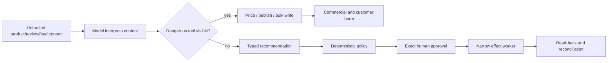

# Security, Privacy, Permissions, and Governance

[← Previous: State, context, memory, and planning](07-state-context-memory-and-planning.md) · [Blueprint home](README.md) · [Next: Reliability, observability, evaluation, and incidents →](09-reliability-observability-evaluation-and-incidents.md)

The dominant security risk is an untrusted commerce input reaching a high-impact channel capability under excessive credentials. Defense requires architectural separation of data, reasoning, authorization, and effects.

## Threat model

### Protected assets

- canonical product/variant identity and catalog integrity;
- live price, promotion, publication, and assortment state;
- inventory, order, and customer-derived observations;
- provider accounts, credentials, quotas, and reputation;
- approval and pricing/legal policy decisions;
- tenant isolation and business-confidential analytics;
- behavior bundle, tool registry, mapping/schema artifacts, and audit evidence; and
- operational availability during peak events.

### Adversaries and failure sources

- malicious supplier or marketplace content;
- compromised merchant/admin/workforce account;
- cross-tenant requester or configuration error;
- malicious or overprivileged integration/app;
- prompt injection in product fields, images, HTML, URLs, reviews, or tool output;
- model hallucination, policy misinterpretation, or target expansion;
- stale/compromised provider events;
- software supply-chain or adapter/schema compromise;
- insider misuse or approval collusion;
- denial of service through catalog size, webhook flood, or quota exhaustion; and
- accidental operator bulk action.

### High-impact attack paths



The design prevents the shortest path, not merely the malicious phrase.

## Principal and credential separation

Keep these identities distinct:

| Identity | Purpose | Must not imply |
|---|---|---|
| Human requester | Opens/scopes a run | Approval or provider write authority |
| Human approver | Authorizes exact proposal under a role | Ability to change policy/credentials |
| Run principal | Tenant/purpose-scoped workflow identity | Reusable broad provider admin |
| Model | Produces structured analysis/recommendation | Any legal or technical principal status |
| Read adapter credential | Reads named account/resources | Write capability |
| Effect worker credential | Performs one effect family on one account/tenant | Discovery across accounts or policy changes |
| Admin principal | Manages credentials, policy, mappings, releases | Normal commerce effect execution |

The approval service issues a short-lived, audience/resource-bound capability grant after commit-time checks. The effect worker does not accept a provider account supplied only by model output.

## Tenant and account binding

Bind tenant at ingress from authenticated organizational membership and authorized account relationships. Propagate it through:

- run and event primary keys;
- workflow/queue partition and lease;
- identity and evidence queries;
- object-store prefixes and encryption context;
- provider credential selection;
- proposal/approval/effect digest;
- caches, embeddings, and memory filters;
- metrics, traces, logs, and incident records; and
- export, retention, deletion, and billing.

At each provider call, compare the grant's tenant/account/resource audience with the adapter's resolved account. A caller-supplied `account_id` is a selector to validate, not an authority fact.

### Cross-tenant negative tests

- valid product ID from tenant A inside tenant B run;
- cache/embedding result from another tenant;
- webhook signed correctly but routed to wrong merchant account;
- approval from parent organization applied to child store without delegation;
- shared SKU name resolving to the wrong account;
- copied effect idempotency key across tenants;
- bulk target set containing one foreign resource; and
- telemetry query or incident export crossing tenant boundaries.

Every test must fail closed; dropping only the foreign row from a D3 bulk effect can hide target-set tampering, so reject the entire proposal.

## Least privilege and provider scopes

Provider OAuth scopes can be broader than this application's internal capability. Apply both layers:

1. Request the narrowest provider scope and account access the provider supports.
2. Bind each credential to tenant, provider account, environment, connector, and effect family.
3. Store in a managed secret system; mount/fetch only in the worker needing it.
4. Mint short-lived tokens where possible; rotate and revoke without redeploying.
5. Enforce application field/target/cardinality policy before provider SDK invocation.
6. Recheck the provider-returned account/resource identity.
7. Record credential version/subject—not secret—in the effect attempt.

For Google Merchant, the OAuth content scope is broadly read/write; the application must impose narrower stage capabilities. Shopify app scopes and protected-customer-data review do not eliminate the need for field minimization. Marketplace seller roles and provider account relationships are similarly not a substitute for internal effect policy.

## Approval security

Consequential effects require:

- authenticated workforce identity and current role;
- exact proposal digest, target set, normalized diff, exposure, source/policy versions, expiry, and environment;
- purpose and business owner;
- separation of duties for high-impact bulk/price/promotion changes;
- step-up authentication where policy requires;
- approval revocation and role-change invalidation;
- commit-time policy and source revalidation; and
- immutable decision/audit record.

No approval via free-text chat response such as “looks good.” The UI may collect a comment, but the signed decision must bind machine-readable intent.

## Prompt-injection containment

### Source-to-sink policy

Assign every input a trust class and every capability an effect class. When untrusted content can affect a D3/D4 sink, require isolation, deterministic policy, exact approval, and application-side target/parameter binding. Prefer removing the sink from that stage entirely.

### Controls

- parse files in quarantine with size/type limits and malware/active-content controls;
- never render/execute supplier HTML, formulas, scripts, macros, or links in the model runtime;
- label untrusted text as data inside a schema;
- prevent source text from defining tools, targets, policies, credentials, or next stage;
- isolate URL fetches with allowlists, egress controls, redirect/IP validation, timeouts, and content limits;
- use stage-specific tools and read-only credentials;
- validate structured output, evidence references, and target equality;
- send exact proposals through independent policy/approval services; and
- continuously test attacks that are semantically subtle, not only obvious jailbreak phrases.

Output filtering is useful for detecting known patterns; it is not the authority boundary.

## File, URL, image, and spreadsheet safety

| Input | Risks | Controls |
|---|---|---|
| CSV/spreadsheet | Formula injection, delimiter confusion, hidden sheets/macros, huge cardinality | Parse as data; neutralize formulas for exports; reject macros; schema/cardinality limits; exact preview |
| Image | OCR injection, misleading labels, EXIF/GPS, huge/decompression payload | Decode in sandbox; strip metadata; size/pixel limits; treat OCR as untrusted; human product-identity check |
| HTML | Script/active content, hidden text, links/redirects, DOM prompt injection | Sanitize/parse text; no script execution; isolated renderer if needed |
| URL | SSRF, credential leak, redirects, tracking, mutable content | Fetch service with scheme/host/IP policy, no internal metadata access, response limits, artifact hash |
| Provider error text | Reflected user content or provider instructions | Data field only; no tool/authority influence |
| PDF/document | Embedded files/scripts, OCR errors, stale certifications | Sandbox extraction; provenance and expiry; qualified reviewer for claims |

## Privacy and data minimization

This agent generally needs product and aggregate operational data, not customer identity. Enforce:

- purpose-specific field allowlists at the data source;
- aggregated returns and performance views with minimum-cell/suppression policy;
- no payment/card data; keep all payment APIs out of the architecture;
- no raw order/customer/support/return-note data in model context by default;
- redaction/tokenization before telemetry or model calls;
- regional/provider routing based on data residency and contractual policy;
- documented retention for run state, evidence artifacts, raw events, traces, and eval data;
- export/correction/deletion workflows across source, object store, caches, indexes, and memory; and
- no use of operational data for provider training unless organizational policy and contract explicitly allow it.

Outsourcing payment processing does not remove all PCI responsibilities, but the safest design for this agent is to avoid cardholder data and payment systems entirely.

## Secret handling

- Use managed secret storage and workload identity; never place credentials in prompts, memory, logs, tool results, or proposal artifacts.
- Prefer short-lived provider tokens and separate test/live credentials.
- Scope tokens per tenant/account/effect worker where provider support allows.
- Block arbitrary outbound network access from model/context components.
- Redact authorization headers, cookies, signed URLs, webhook secrets, and provider tokens at ingestion.
- Test log/tracing exporters for secret leakage.
- Rotate on employee/app compromise, unexpected account access, or connector supply-chain incident.
- Reconciliation should remain possible with an independently scoped read credential when a write token is revoked.

## Policy architecture

Separate policy domains:

| Policy | Examples | Owner |
|---|---|---|
| Identity | identifier uniqueness, variant grouping, merge/split | Product/catalog data governance |
| Content/claims | allowed facts, regulated terms, evidence, accessibility review | Product/content/legal/accessibility |
| Pricing/promotion | corridors, reference price, discounts, stacking, intervals | Pricing/legal/commercial |
| Availability/publication | freshness, eligibility, withdrawal | Inventory/commerce operations |
| Authority | D classes, roles, separation of duties, limits | Security/risk/effect owner |
| Data | purpose, fields, residency, retention, deletion | Privacy/data governance |
| Runtime | model/tool routes, budgets, network, release | Platform/security/SRE |

Policies should return typed reason codes and the version used. The model may translate reason codes for an operator but cannot override them.

## Commerce integrity and consumer-harm controls

| Risk | Required control | Boundary / stop condition |
|---|---|---|
| Restricted, recalled, unsafe, age-gated, or regulated goods | Jurisdiction/category eligibility, seller/economic-operator identity, safety/traceability evidence, recall feed, channel policy, and named compliance owner | No listing or reinstatement when evidence is absent, expired, or conflicting; model cannot grant an exception |
| Misleading price, promotion, scarcity, or fee claim | Exact pricing/promotion decision, reference-price/fee/disclosure rules, truthful availability evidence, effective clocks, and customer-visible verification | Stop on missing jurisdiction policy, stale availability, hidden material fee, or unverifiable urgency claim |
| Differential pricing or merchandising harm | Approved objective and features, sensitive/protected-trait and proxy exclusions, segment justification, outcome slices, appeal/review route | Agent cannot infer traits, create eligibility segments, or personalize a consequential price; route policy questions to legal/risk |
| Accessibility exclusion | Versioned content/UI accessibility requirements, automated checks plus assistive-technology/human review appropriate to the surface | Generated alt text or a passing linter is not a conformance decision; inaccessible critical path blocks release under local policy |
| Brand, trademark, copyright, counterfeit, or asset-license risk | Brand/seller authorization, rights/license registry, provenance, permitted market/channel/use interval, and takedown workflow | Similarity or supplier assertion cannot establish rights; disputes route to brand/legal/trust |
| Fake or manipulated reviews and return signals | Source authenticity, aggregate lineage, manipulation/anomaly checks, incentive/disclosure policy, minimum cells | Reviews do not become product facts or ranking rules; suspicious behavior routes to marketplace trust/fraud |
| Seller/account fraud or payment/order abuse | Minimal typed signal and accepted handoff to Fraud/AML, trust, payments, or support | No expansion into customer identity, payment, case, investigation, refund, or enforcement tools |
| Connector/software supply-chain compromise | Signed builds and manifests, dependency/SBOM review where required, pinned schemas/SDKs, artifact provenance, isolated credentials, staged rollout | Unknown adapter/schema provenance disables affected write operation and triggers reconciliation/security review |

Marketplace acceptance is not a compliance certificate. For EU consumer marketplaces, trader traceability and product-safety duties can affect required seller and offer data; other markets and product categories impose different rules. FTC pricing, advertising, endorsements, and reviews guidance and W3C WCAG 2.2 establish important control domains but do not replace jurisdiction-specific legal or accessibility review.

## Separation of duties and evidence retention

At minimum, separate product/seller onboarding, pricing/promotion policy, proposal review, effect execution, policy/credential administration, and audit review. A single person may hold multiple roles in a small organization only under an explicit risk exception with compensating review; the model never satisfies separation of duties.

An audit query must reconstruct who requested, who approved, which exact product/offer/price/promotion changed, which policy and behavior bundle applied, what connector attempted, what the provider returned, what became observable, and which correction followed. Keep the effect ledger append-only under retention policy. Corrections and overrides supersede records; they do not rewrite them. Logs and traces may point to this evidence but cannot replace it.

## Governance artifacts

Maintain:

- category boundary and RACI;
- tool/capability registry;
- provider account and credential inventory;
- data-flow and classification inventory;
- model/system cards and provider data-use terms;
- behavior-bundle manifest and software bill of materials where applicable;
- policy/schema/mapping register;
- approved use-case and risk register;
- evaluation suite, release decisions, exceptions, and expiry;
- effect/audit evidence and reconciliation reports;
- incident/rollback exercises and corrective actions; and
- governed memory inventory.

## Behavior-bundle manifest

Treat all behavior-shaping artifacts as one release:

```yaml
schema: commerce.behavior-bundle/v1
release: commerce-agent-2026.09.1
model_routes:
  diagnosis: provider-model-snapshot-x
  drafting: provider-model-snapshot-y
prompts:
  diagnosis: sha256:...
  drafting: sha256:...
output_schemas:
  diagnosis: commerce.suppression-diagnosis/v2
tools: commerce-tool-registry@18
policies:
  authority: effect-policy@22
  content: content-policy@14
mappings: commerce-channel-mappings@31
adapters:
  google_merchant: 5.1.0
  amazon_listings: 8.4.2
  shopify_admin: 7.3.1
context_builder: 4.6.0
compaction: 2.1.0
memory_policy: 3.0.0
eval_suite: ecommerce-ops-eval@11
approved_release_record: rel_991
```

An individual model change is not safe to release against unevaluated prompts, tools, mappings, and adapters.

## Security stop conditions

Immediately stop the affected scope when:

- tenant/account binding fails or cross-tenant data appears;
- a read-only stage can discover a write tool;
- credentials or protected customer/payment data enter model/context/telemetry;
- tool input target differs from proposal/approval target;
- an untrusted source changes a tool, policy, target, or authority decision;
- approval or separation-of-duties evidence is invalid;
- provider credential accesses an unregistered account;
- bulk cardinality or commercial exposure exceeds grant;
- adapter/provider schema integrity cannot be verified;
- audit/effect evidence is unavailable for a D3 attempt; or
- behavior bundle is unknown or unsigned under release policy.

## Security evaluation suite

- direct and indirect prompt injection in title, description, image OCR, URL, provider error, and return note;
- poisoned tool output asking for a more privileged tool;
- target expansion through variant group or wildcard;
- currency/account/market substitution;
- cross-tenant cache, event, evidence, approval, effect, trace, and memory access;
- expired/revoked approval and workforce role;
- write token available in model or read worker environment;
- SSRF to metadata/private addresses and malicious redirects;
- CSV formula and spreadsheet hidden-content payloads;
- webhook replay, signature failure, clock skew, duplicate and wrong-account routing;
- bulk effect above approved count or price exposure;
- compromised adapter/schema bundle; and
- model/provider outage during a security correction.

## Production checklist

- [ ] Security controls break source-to-dangerous-sink paths architecturally.
- [ ] Human, run, model, read, effect, and admin identities are separate.
- [ ] Every credential is tenant/account/effect/environment bound and least privilege.
- [ ] Approval is machine-bound, expiring, revalidated, and revocable.
- [ ] Product/customer/provider content is treated as untrusted data.
- [ ] Customer and payment data are excluded by default.
- [ ] Context, telemetry, caches, indexes, and memory enforce retention and deletion.
- [ ] Policy returns typed decisions independent of model output.
- [ ] Full behavior bundle and dependency provenance are release-controlled.
- [ ] Security stop/kill controls work without model availability.

## Sources and related controls

- [OpenAI: Designing AI agents to resist prompt injection](https://openai.com/index/designing-agents-to-resist-prompt-injection/)
- [Shopify security best practices](https://shopify.dev/docs/apps/build/security/following-security-best-practices)
- [Shopify protected customer data](https://shopify.dev/docs/apps/launch/protected-customer-data)
- [Google Merchant authentication](https://developers.google.com/merchant/api/guides/quickstart/authentication)
- [OAuth 2.0 Security Best Current Practice, RFC 9700](https://www.rfc-editor.org/rfc/rfc9700.html)
- [OAuth 2.0 Resource Indicators, RFC 8707](https://www.rfc-editor.org/rfc/rfc8707.html)
- [PCI SSC FAQ 1092](https://www.pcisecuritystandards.org/faqs/1092/)
- [FTC endorsements, influencers, and reviews](https://www.ftc.gov/business-guidance/advertising-marketing/endorsements-influencers-reviews)
- [EU Digital Services Act](https://eur-lex.europa.eu/eli/reg/2022/2065/oj/eng)
- [EU General Product Safety Regulation](https://eur-lex.europa.eu/eli/reg/2023/988/oj/eng)
- [W3C WCAG 2.2](https://www.w3.org/TR/WCAG22/)
- [Agent threat model](../../security/agent-threat-model.md)
- [Permissions, sandboxing, and secrets](../../security/permissions-sandboxing-and-secrets.md)

[← Previous: State, context, memory, and planning](07-state-context-memory-and-planning.md) · [Blueprint home](README.md) · [Next: Reliability, observability, evaluation, and incidents →](09-reliability-observability-evaluation-and-incidents.md)
