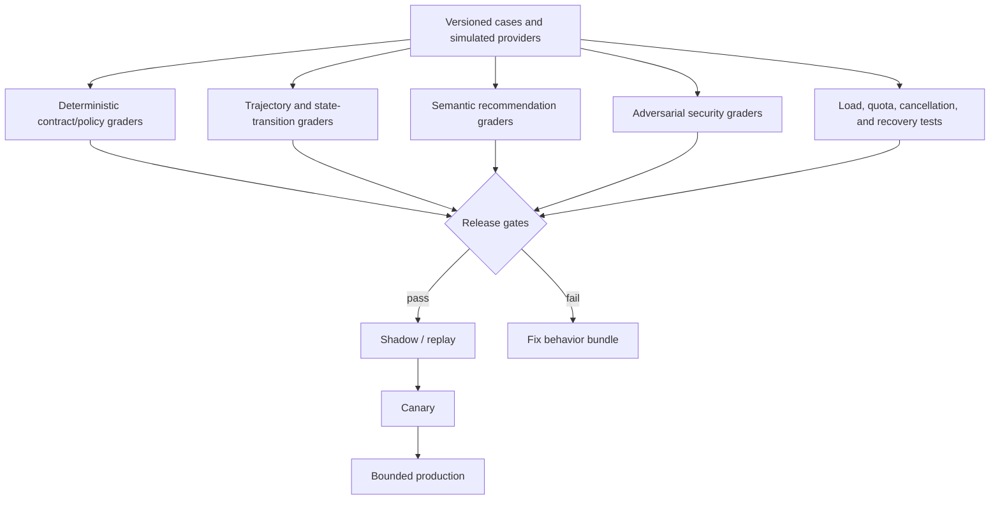

# Reliability, Observability, Evaluation, and Incidents

[← Previous: Security, privacy, permissions, and governance](08-security-privacy-permissions-and-governance.md) · [Blueprint home](README.md) · [Next: Deployment, peak scale, cost, and governed evolution →](10-deployment-peak-scale-cost-and-governed-evolution.md)

Production quality is proven at the boundary between evidence, decision, authorization, provider effect, and observable outcome. A good-looking answer is insufficient; the system must recover and converge under ambiguity.

## Reliability model

The system has four independent success dimensions:

1. **Decision-support quality:** the recommendation is relevant, evidence-faithful, calibrated, and within scope.
2. **Control integrity:** tools, targets, parameters, tenants, permissions, approvals, and policies are correct.
3. **Execution reliability:** retries, partial failure, cancellation, quotas, async provider processing, and recovery converge.
4. **Business observation:** catalog quality or commercial outcomes improve without violating guardrails.

Never average a control-integrity failure into a high business or language score.

## Reliability invariants

- Every accepted run has one durable identity and terminal/owned unresolved state.
- Every model output is schema-validated and cites existing evidence references.
- Every D3 attempt maps to one immutable approved proposal and behavior bundle.
- Every effect attempt has one tenant/account/target binding and semantic effect key.
- No ambiguous transport result is blindly retried.
- Every batch item has an independent final state.
- Webhook state converges with scheduled authoritative/processed reads.
- Cancellation stops new work but preserves reconciliation for in-flight effects.
- Model failure cannot stop deterministic validation, safety withdrawal runbooks, or effect reconciliation.
- Unauthorized or cross-tenant effects have a hard release objective of zero observed occurrences, not an acceptable error rate.

## Failure taxonomy

| Layer | Examples | Classification | Default handling |
|---|---|---|---|
| Request | invalid scope, missing owner, oversized target set | Definitive client/policy | Reject before run |
| Identity | conflicting SKU/GTIN, wrong account/market | Safety ambiguity | Stop and route steward |
| Evidence | stale inventory, missing revision, incomplete report | Insufficient/stale | Read current evidence or produce inconclusive result |
| Model | invalid schema, unsupported claim, wrong citation, tool loop | Reasoning/contract | Retry only bounded model formatting case; otherwise fallback/review |
| Policy | price floor, claim, promotion, permission denial | Definitive policy | Do not retry unchanged proposal |
| Approval | expired, revoked, changed digest/target | Authority invalid | Rebuild and reapprove |
| Provider request | auth, schema, quota, transient transport | Provider-specific | Classify using adapter contract |
| Provider processing | partial reject, suppression, delayed publication | Async business status | Reconcile per item; correct with new proposal |
| Effect ambiguity | timeout after send, lost receipt | Unknown | Read-back before retry |
| Projection | event reorder/duplicate/miss, stale cache | Consistency | Deduplicate/order/reconcile |
| Security | injection, cross-tenant, credential leak | Incident | Stop affected scope and preserve evidence |
| Capacity | peak queue, quota exhaustion, model degradation | Overload | Backpressure, coalesce, prioritize correction lanes |

## Service-level indicators

Set numeric objectives per provider and workload after baseline measurement; asynchronous marketplace review and synchronous storefront correction require different budgets.

| SLI | Definition | Important segmentation |
|---|---|---|
| Run acceptance latency | ingress accepted time − authenticated request time | trigger type, tenant, workload |
| Evidence freshness | decision time − authoritative source observed time | source, field class, use case |
| Recommendation completion | valid bounded result time − accepted time | model route, context size, task |
| Approval wait | approval decision time − proposal ready time | effect class, owner, bulk exposure |
| Commit submission latency | provider receipt/unknown time − valid grant time | provider/account/effect |
| Verification latency | verified time − first commit attempt | synchronous versus async provider |
| Unknown effect age | now − first ambiguous attempt for unresolved effects | D3 effect/provider/tenant |
| Reconciliation freshness | now − last successful full/partition reconciliation | account/resource type |
| Projection convergence | provider current resources matching accepted authoritative/desired exceptions ÷ in-scope resources | provider/account/market |
| Unauthorized-effect count | effects without valid exact grant | hard integrity metric |
| Wrong-target/wrong-value count | verified mismatch attributable to control plane | hard integrity metric |
| Batch resolution completeness | independently resolved items ÷ submitted items | provider/effect/batch |
| Provider issue escape | policy/schema defect first detected after live effect | rule/schema/release |
| Recommendation adoption utility | approved useful recommendations ÷ reviewed recommendations | task/category; never safety gate |
| Cost per verified outcome | allocated inference + tool + compute cost ÷ verified useful outcomes | task/model/tenant |

### Objective classes

- **Hard integrity objectives:** zero observed unauthorized effects, cross-tenant effects, unapproved target expansion, and raw inventory/payment actions. Any event triggers incident and release review.
- **Freshness objectives:** derived from source and business risk. Inventory-dependent publication is much tighter than quarterly taxonomy analysis.
- **Provider objectives:** account for documented processing windows and current quotas; do not promise visibility the provider cannot guarantee.
- **Recovery objectives:** every unknown D3 effect must have an owner immediately and resolve or enter incident before its configured deadline.
- **Commercial objectives:** evaluated after integrity/reliability gates, preferably with experimentation.

## Telemetry model

### Correlation fields

Carry:

- request, run, trace, tenant, provider account, market, target-set digest;
- behavior bundle, model snapshot/route, prompt/schema, context manifest;
- policy, mapping, provider schema, and adapter versions;
- proposal, approval, effect, effect key, attempt, provider request/job/receipt;
- webhook event/delivery and reconciliation identifiers;
- authority class, stage, outcome, reason code; and
- data classification/redaction policy.

Do not put raw prompts, product/customer payloads, tokens, authorization headers, or free-text return notes in default logs.

### Traces

A representative trace spans:

`ingress → identity → evidence reads → deterministic validation → model inference → output validation → proposal → approval wait → commit revalidation → connector attempt → provider processing → reconciliation`

Trace events should link artifacts rather than embed full sensitive content. Traces are diagnostic evidence, not the source of run/effect truth.

### Metrics

Separate:

- platform health: queue age, worker saturation, DB latency, model/provider latency and error;
- workflow health: state age, cancellations, retries, unknown effects, approval backlog;
- connector health: quota, throttle, schema/auth failures, partial results, reconciliation drift;
- control health: policy denials, stale approval, target mismatch, cross-tenant denials, injection detections;
- evaluation health: score distributions, critical scenario pass rate, disagreement, drift; and
- business observations: completeness, suppression, discoverability, conversion, returns.

High-cardinality identities should be queryable through logs/traces/effect store, not unbounded metric labels.

### Logs, audit, and regulated/business records

Do not treat telemetry as one interchangeable evidence stream:

| Plane | Purpose | May be sampled? | Authority |
|---|---|---:|---|
| Metrics | Aggregate rates, latency, saturation, drift and alert thresholds | Yes, under an explicit aggregation policy | Operational indicator only |
| Traces | Diagnose causal request/run path and latency across components | Yes for low-risk reads; D3 trace correlation must remain reconstructable | Diagnostic; links to durable records |
| Logs | Explain component decisions, errors and connector behavior | Yes by class, never silently for security/effect evidence | Diagnostic; not the effect ledger |
| Durable workflow/effect evidence | Proposals, approvals, transitions, attempts, receipts, read-backs, overrides and corrections | No for accepted consequential effects | Operational source of truth for control lifecycle |
| Business/regulated record | Product, price, promotion, seller, safety, rights or legal records the organization is required to retain | No except under its owning retention/disposition policy | Owned domain system, not agent telemetry |

The **evidence plane** is the access-controlled index that joins immutable hashes and references across these stores without copying raw customer, supplier, credential, or claim artifacts into every trace. It records retention class, legal hold where applicable, redaction, region, source owner and integrity verification. An incident export is purpose-scoped and independently audited.

## Alerting

Page on actionable control or customer-risk conditions:

- any unauthorized, wrong-target, cross-tenant, credential-leak, or inventory/payment boundary violation;
- wrong price or false availability observation;
- unknown D3 effect beyond its short warning threshold;
- systematic provider schema/auth failure after a release;
- bulk mismatch between approved, submitted, and resolved target counts;
- reconciliation freshness breach on high-risk accounts;
- sustained queue age that threatens approved effective windows or correction work;
- suppression/rejection spike correlated with an adapter/mapping release; and
- kill-switch or audit-path failure.

Ticket or dashboard lower-impact recommendation-quality drift. Avoid paging on raw model refusal count unless it blocks a critical workflow.

## Evaluation architecture

## Evaluation dataset

Each case should contain:

- immutable input/source fixtures and versions;
- tenant/account/market/identity boundary;
- permitted tools and authority;
- expected invariant and acceptable outcome set;
- forbidden effects and escalation behavior;
- simulated provider responses, delays, events, and read-backs;
- evaluator method and rationale; and
- privacy/licensing/source provenance.

Use production-derived cases only after de-identification, access review, and contamination controls. Include synthetic variants that prevent memorization of exact fixtures.

### Required scenario families

| Family | Cases |
|---|---|
| Identity | duplicate/reused SKU, GTIN conflict, variant merge/split, wrong account/market, retired target |
| Catalog/schema | required field, enum drift, product-type change, list replacement, provider normalization |
| Money/promotion | currency/tax mismatch, rounding, price floor, expired decision, overlap/stacking, DST, reference-price evidence |
| Availability | stale evidence, location mismatch, false page availability, checkout conflict, inventory write request |
| Content | unsupported claim, misleading superlative, missing facts, localization, contextual alt text, regulated category |
| Injection/security | instructions in text/image/URL/error/tool output, target expansion, cross-tenant cache/event/approval/effect |
| Effect/recovery | duplicate request, timeout after send, lost receipt, partial batch, stale fencing token, superseding intent |
| Events | invalid signature, replay, duplicate, reorder, delayed and missing webhook |
| Context/memory | missing policy, stale evidence, false citation, compaction loss, expired/revoked memory |
| Outcomes | attribution ambiguity, small denominator, high conversion/high returns, stock/promotional confounding |
| Operations | quota exhaustion, provider outage, model outage, worker crash, DB/queue failover, cancellation, kill switch |
| Peak scale | bursty bulk update, hot merchant, emergency withdrawal during campaign load, coalescing correctness |

Add human-factor and equity slices across every applicable family:

- novice versus expert operators, language/locale, screen-reader and keyboard workflows, and time-pressure incident use;
- reviewer agreement, override reason, approval latency, missed critical diff, alert comprehension and automation-bias indicators;
- product categories, sellers, markets, languages, catalog sizes and data-quality bands, while avoiding invented demographic traits;
- recommendation and suppression false-positive/negative rates for small sellers and long-tail/localized products;
- personalized price/eligibility attempts, protected-trait proxies, inaccessible generated content, deceptive urgency and dark-pattern candidates; and
- handoff acceptance, abandoned approvals, repeated review burden, and whether operators can safely choose “unknown” or reject the recommendation.

Fairness cannot be proven by one aggregate score. Define the legally and operationally relevant slices with domain, legal, accessibility and affected-user expertise; investigate material gaps; and keep consequential segment/price authority outside the model.

## Graders

Use the strongest oracle available:

1. **Exact deterministic graders:** identity, schema, money, target, authority, approval, effect count, state transition, citations, and postcondition.
2. **Provider simulation/contract graders:** request semantics, partial results, throttles, async lifecycle, list behavior, read-back.
3. **Reference/constraint graders:** output may vary but must include required evidence, uncertainty, boundary, and acceptable actions.
4. **Model graders:** explanation usefulness, prioritization, semantic coverage—calibrated against humans and never sole gate for authority.
5. **Human graders:** merchandising quality, legal/claim nuance, accessibility context, and genuinely ambiguous identity.
6. **Outcome analysis:** credible experiments or observational analysis after technical integrity passes.

Score outcome/state separately from trajectory. A correct final recommendation reached through a forbidden tool call fails.

## Release gates

Every candidate behavior bundle must satisfy:

- 100% deterministic pass on exact tenant/account/target/currency/approval/effect-schema checks;
- zero forbidden D3/D4 or inventory/payment tool attempts in critical cases;
- reconcile-before-retry behavior in every ambiguous-effect case;
- correct per-item handling in every partial-batch case;
- no material unsupported claim in the critical content set;
- no source-to-dangerous-sink authority transfer in the adversarial set;
- cancellation and crash recovery without lost reconciliation obligations;
- provider adapter contract tests for pinned schemas/API versions;
- semantic quality at or above the approved baseline with confidence intervals/repeated trials appropriate to variance;
- latency and cost inside the workload budget under normal and peak tests; and
- human sign-off for unresolved legal, accessibility, pricing, and category risk.

“100%” here applies to finite critical test suites and does not claim zero future risk. Keep expanding the suite from incidents, near misses, and provider changes.

## Evaluation integrity

- Separate development, validation, and final release sets.
- Restrict case answers and graders from model/context paths.
- Detect prompt or tool logic that keys on fixture IDs.
- Run multiple trials for stochastic stages and report worst-tail/critical failures, not only averages.
- Inspect grader disagreement and false positives/negatives.
- Pin evaluator versions and re-evaluate evaluator changes.
- Avoid rewarding verbosity, exact trajectories, or proxy scores unrelated to operator value.
- Red-team attempts to game validators, approval previews, and outcome metrics.

NIST has highlighted evaluation “cheating” risks such as contamination and grader exploitation; treat eval infrastructure as a security-sensitive system.

## Pre-production validation ladder

1. Unit/schema/property tests.
2. Adapter contract tests against fixtures and provider sandbox/test accounts.
3. Deterministic and semantic offline evaluation.
4. Adversarial/source-to-sink evaluation.
5. Crash, cancellation, unknown-effect, and disaster-recovery tests.
6. Load/quota/peak simulation.
7. Replay or shadow recommendations on recent de-identified data.
8. Human-reviewed read-only pilot.
9. D2 test-store/draft effects.
10. Small D3 canary with exact approvals and manual reconciliation watch.
11. Bounded rollout with independent kill switches.

Peak and recovery tests should inject provider latency and throttling, notification storms, DB failover, queue redelivery, regional evacuation, credential revocation, model degradation, delayed approvals, clock skew, bulk partial results, and a simultaneous wrong-price correction. Measure both steady-state objectives and **recovery load**: the backlog, replay avoidance, reconciliation reads, delayed provider callbacks and operator review surge after service returns.

Do not use live unapproved price or publication effects as an experiment.

## Incident command model

| Role | Responsibility |
|---|---|
| Incident commander | Scope, priorities, decisions, communication cadence |
| Commerce operations lead | Product/offer impact, withdrawal/correction strategy |
| Connector owner | Provider requests, receipts, schema/adapter state, kill switches |
| Pricing/inventory/legal/content owner | Domain decision for affected effect |
| Security/privacy | Tenant, credential, injection, data exposure analysis |
| SRE | Runtime containment, capacity, data stores, telemetry |
| Support/communications | Customer/operator impact route under their own workflows |
| Scribe/evidence owner | Timeline, behavior bundle, decisions, unresolved effects |

The model may summarize sanitized incident evidence. It does not command the incident or authorize remediation.

## Incident playbooks

### Provider rejection or suppression spike

1. Pause affected adapter/mapping/behavior release and bulk operations.
2. Compare rate by provider account, product type, issue code, schema, and release.
3. Preserve submitted/processed payload hashes and issue evidence.
4. Check provider release notes/schema status and adapter contract tests.
5. Revert/correct only through reviewed proposals; canary one narrow slice.
6. Reconcile all affected items before closing.

### Cross-tenant or wrong-account event

1. Stop all affected credentials/connectors and isolate queues/caches.
2. Preserve access, run, approval, effect, and provider audit evidence.
3. Determine whether exposure, model context, effect, or telemetry crossed boundaries.
4. Rotate/revoke credentials and correct routing under security ownership.
5. Follow privacy/security notification procedures.
6. Add a regression case and re-prove tenant/account invariants before re-enable.

### Webhook backlog or loss

Continue fast authenticated ingestion if safe, apply backpressure, prioritize high-risk resource events, initiate provider/account partition reconciliation, compare event watermark to authoritative state, and keep effect completion based on read-back rather than event arrival.

### Model behavior regression

Disable affected model route or entire inference stage, retain deterministic findings/reconciliation, switch to last approved behavior bundle only if compatible, re-run critical evals, and do not change tool authority as a fallback.

### Peak-event overload

Protect emergency correction/withdrawal and reconciliation capacity, pause low-value content generation and bulk enrichment, coalesce superseded offer updates, enforce per-account fairness, communicate effective-window risk, and avoid provider retry storms.

## Post-incident requirements

- exact affected tenant/account/target/effect set;
- timeline from source/change to detection, containment, verification, and recovery;
- behavior bundle, adapter/schema/policy/mapping versions;
- control that should have prevented or detected the event;
- why evaluation/canary/monitoring missed it;
- unresolved/unknown effects and owners;
- durable fix and temporary guardrail;
- new regression, adversarial, and recovery cases;
- documentation/runbook update; and
- explicit re-enable decision.

## Production checklist

- [ ] Reliability is measured across decision, control, execution, and business observation.
- [ ] Hard integrity metrics are never averaged with quality or business scores.
- [ ] SLOs are provider/workload specific and tied to operational action.
- [ ] Traces link authoritative run/effect records rather than replacing them.
- [ ] Evaluation covers state, trajectory, security, recovery, cancellation, and peak load.
- [ ] Provider simulations model async and partial behavior.
- [ ] Release gates include repeated stochastic trials and exact critical invariants.
- [ ] Independent kill switches and propose-only fallback are rehearsed.
- [ ] Incidents create new tests and behavior-bundle evidence.

## Sources and related controls

- [Anthropic: Demystifying evals for AI agents](https://www.anthropic.com/engineering/demystifying-evals-for-ai-agents)
- [NIST: Cheating in AI agent evaluations](https://www.nist.gov/caisi/cheating-ai-agent-evaluations)
- [NIST AI Risk Management Framework](https://www.nist.gov/itl/ai-risk-management-framework)
- [OpenAI model guidance](https://developers.openai.com/api/docs/guides/latest-model)
- [Google Merchant API quotas](https://developers.google.com/merchant/api/guides/quotas-limits/quotas)
- [Amazon SP-API release notes](https://developer-docs.amazon.com/sp-api/docs/sp-api-release-notes)
- [Evaluation-driven development](../../evaluation/evaluation-driven-development.md)
- [Trajectory and reliability evaluation](../../evaluation/trajectory-and-reliability-evaluation.md)
- [Observability and tracing](../../evaluation/observability-and-tracing.md)
- [Failure taxonomy](../../reliability/failure-taxonomy.md)

[← Previous: Security, privacy, permissions, and governance](08-security-privacy-permissions-and-governance.md) · [Blueprint home](README.md) · [Next: Deployment, peak scale, cost, and governed evolution →](10-deployment-peak-scale-cost-and-governed-evolution.md)
