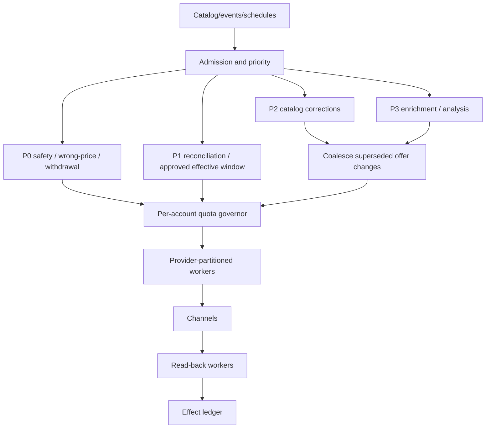

# Deployment, Peak Scale, Cost, and Governed Evolution

[← Previous: Reliability, observability, evaluation, and incidents](09-reliability-observability-evaluation-and-incidents.md) · [Blueprint home](README.md) · [Next: Qualified adapters and worked commerce flows →](11-qualified-adapters-and-worked-commerce-flows.md)

Production maturity is a sequence of evidence gates. It does not require increasing model autonomy; a scaled system may keep every live price, promotion, assortment, and publication change behind exact approval indefinitely.

## Stage 0 — Deterministic baseline

### Stage 0 build

- source-to-channel identity crosswalk with explicit ambiguity queue;
- versioned snapshots for canonical, submitted, processed, published, and observable state;
- deterministic schema, required-field, money, inventory-freshness, promotion, and content-policy checks;
- full/partition drift reconciliation;
- operator dashboard and manual correction runbook;
- baseline metrics for workload volume, defect types, review time, provider latency, errors, and business observations; and
- incident paths and emergency deterministic withdrawal/correction controls.

No model or write credential is required.

### Stage 0 exit gate

- source owners and category seams are approved;
- critical identities resolve exactly or stop;
- current provider/API/schema versions are recorded;
- deterministic checks have measured precision/recall or reviewed false-positive rates;
- manual actions produce receipts and verification evidence;
- baseline volumes, latency, commercial exposure, and failure modes are known; and
- the model-value hypothesis names tasks the deterministic baseline cannot solve well.

## Stage 1 — Bounded read-only assistant

### Stage 1 build

- query-built evidence/context manifests;
- structured recommendations with evidence references, uncertainty, counter-evidence, and owner;
- stage-specific D0/D1 tool registry;
- model gateway with behavior-bundle pinning, budgets, output validation, and trace linkage;
- offline/adversarial eval set and human review UI; and
- deterministic fallback when the model is unavailable.

### Stage 1 exit gate

- no model path has D2/D3/D4 or excluded tools/credentials;
- all outputs pass schema and evidence-reference validation;
- semantic tasks beat the Stage 0 baseline at a justified latency/cost;
- ambiguity and refusal behavior are useful rather than guessed;
- injection, cross-tenant, stale-context, and unsupported-claim cases pass; and
- operators can distinguish observation, inference, recommendation, and authority.

## Stage 2 — Controlled MVP

### Stage 2 build

- immutable proposals, exact diffs, previews, digests, exposure, and expiry;
- deterministic policy results and machine-bound approval service;
- D2 internal draft/test-store/provider-validation tools;
- simulated provider async/partial behavior;
- effect-ledger schema before any live effect; and
- full target-set/cardinality and rollback preview.

### Stage 2 exit gate

- proposed targets/parameters cannot mutate after approval;
- current source/policy/permission is revalidated before D2 commit;
- sandbox/test effects produce receipts and authoritative read-back;
- destructive list/clear/omission semantics have adapter contract tests;
- cancellation, worker crash, duplicate, partial batch, and schema drift pass; and
- no live production price, promotion, assortment, or publication write is enabled.

## Stage 3 — Reliable v1

### Stage 3 build

- durable coordinator with retries, timers, cancellation, and checkpoints;
- semantic effect identity, attempt/receipt history, leases/fencing, unknown state, and reconciliation;
- authenticated/deduplicated webhook ingestion plus scheduled polling;
- per-account quota governor, backoff, circuit breaker, and dead-letter quarantine;
- dashboards/alerts, independent kill switches, incident runbooks, and disaster-recovery procedure; and
- behavior-bundle manifest and automated release evaluation.

### Stage 3 exit gate

- ambiguous commits reconcile before retry in every critical test;
- all batch members reach independent states;
- process/queue/database failover preserves run and reconciliation obligations;
- unknown D3 simulation has a working owner/deadline/alert path;
- webhook loss/reorder/duplicate converges to provider state;
- propose-only fallback works during model or effect-connector outage; and
- rollback and emergency correction drills complete under audit.

## Stage 4 — Production

### Stage 4 build

- narrowly selected D3 connector operations with separate credentials and exact approvals;
- low-exposure canary by tenant, channel account, market, effect type, and SKU count;
- real-time release/connector stop controls and last-known-good behavior bundle;
- security/privacy/data-flow review and provider production authorization;
- on-call ownership across commerce, connector, SRE, security, pricing/inventory/content/legal seams; and
- bounded rollout dashboards comparing canary/control and baseline.

### Stage 4 exit gate

- finite critical suites have zero unauthorized, cross-tenant, wrong-target, and inventory/payment boundary events;
- live canary effects reconcile with exact intended state and no unresolved critical unknowns;
- operator and approver workload remains sustainable;
- SLOs and unknown deadlines are calibrated from real provider/account behavior;
- security, commerce, SRE, privacy, and relevant domain owners approve expansion; and
- rollback/withdrawal is proven in the same environment and provider account class.

## Stage 5 — Peak-safe scale

### Stage 5 build

- tenant/account/market/effect partitions and fairness;
- separate queues/capacity for analysis, bulk enrichment, D3 commit, reconciliation, and emergency correction;
- per-provider/account quota governors using current response headers/contract;
- update coalescing and supersession per offer/field/effective interval;
- adaptive batching that preserves per-item effect identity;
- backpressure, admission control, scheduled windows, and operator exposure estimates;
- full-catalog/partition reconciliation and drift watermarks;
- regional availability/failover appropriate to data and provider constraints; and
- peak-event load, soak, failover, and degraded-mode drills.

### Stage 5 exit gate

- event-like burst tests meet configured queue/reconciliation objectives without provider retry storms;
- emergency correction/withdrawal retains reserved capacity under full bulk load;
- hot tenants/accounts cannot starve others;
- coalescing never changes approved final intent or hides an unresolved intermediate effect;
- provider quota and async processing limits are respected per account;
- failure of one connector/account/region remains contained; and
- cost, reviewer load, incident staffing, and recovery capacity fit the peak plan.

## Stage 6 — Governed evolution

### Stage 6 build

- outcome and incident review pipeline;
- governed candidates for rule, mapping, prompt, memory, model, adapter, or policy changes;
- offline/replay/adversarial/security evaluation of the complete behavior bundle;
- change classification, approvers, canary design, and rollback for every artifact type;
- drift/refresh monitors for provider schemas, APIs, policies, product taxonomy, model snapshots, and laws; and
- periodic decommissioning of unused tools, memories, mappings, and model routes.

### Stage 6 exit gate

- no direct online self-learning or outcome-to-effect path exists;
- every production behavior maps to a signed manifest and release decision;
- memory additions have owner, source, purpose, expiry, evaluation, and deletion path;
- outcome improvements are validated without weakening integrity/guardrail metrics;
- provider/model/policy changes automatically trigger the right test/approval scope; and
- obsolete behavior can be rolled back or retired without losing effect/reconciliation evidence.

## Stage gates summary

```mermaid
flowchart LR
    S0[0 Rules + truth map] -->|measured baseline| S1[1 Read-only assistant]
    S1 -->|semantic value + safety| S2[2 Typed proposals + sandbox]
    S2 -->|immutable intent + contract tests| S3[3 Durable recovery]
    S3 -->|incident + reconciliation proof| S4[4 Narrow production]
    S4 -->|real canary + owner sign-off| S5[5 Peak-safe scale]
    S5 -->|capacity + containment proof| S6[6 Governed evolution]
```

Failure at a gate returns to the earlier stage; it is not an exception approved by the model team alone.

## Capacity model

For a worker class, a first approximation is:

`required_concurrency ≈ ceil(arrival_rate × p_target_service_time / target_utilization)`

This is an input to load testing, not a final capacity number. Commerce traffic is bursty and bounded by provider account quotas, human approval, async processing, DB/queue capacity, and downstream read-back. Model each independently.

### Capacity dimensions

- events and scheduled drift scans per tenant/account;
- changed offers versus total catalog size;
- model calls, input/output tokens, latency, and provider quotas;
- read and write provider API cost/rate buckets;
- feed/batch size, frequency, processing time, and partial-result volume;
- approval arrival and reviewer service time;
- reconciliation reads and propagation windows;
- artifact and audit retention; and
- incident correction surge during peak sale traffic.

Use arrival distributions and tail latency, not daily averages.

## Peak-event architecture

Priority is policy-defined. An LLM cannot promote its recommendation into P0.

### Peak controls

- freeze nonessential schema/mapping/model/adapter releases before major events;
- precompute deterministic projections and validations;
- validate provider quotas and current documented limits per account;
- stagger bulk uploads and avoid sending unchanged listings;
- coalesce pending effects only when no attempt occurred and final approved intent is equivalent;
- reserve capacity for reconciliation and corrections;
- degrade by disabling content generation, deep synthesis, and low-value enrichment before control-plane work;
- bound backlog so expired promotions/approvals are invalidated rather than committed late;
- expose estimated completion by account/effect window; and
- rehearse provider outage and credential-revocation scenarios.

## Quota and backoff strategy

Providers use different quota units and may change them. Do not hard-code a universal request rate.

Maintain a governor keyed by provider, credential/app, merchant/shop/account, endpoint/operation, and quota window. Consume response headers or provider status when available. Backoff uses provider hints plus jitter and has a maximum attempt/deadline. Systematic schema/auth/policy errors open a circuit; they do not consume the retry budget.

Amazon bulk guidance favors changed listings and constrained feed frequency/size; Shopify GraphQL uses calculated cost buckets; Google Merchant quotas have daily and per-minute groups and recommends exponential backoff. These belong in adapter metadata and capacity tests.

## Coalescing and supersession

Coalescing is allowed before external attempt when:

- semantic target/effect field is identical;
- both proposals are approved or the older proposal is cancelled under policy;
- final value/effective interval is exact;
- no provider attempt or externally observable intermediate state exists;
- audit links predecessor to successor; and
- older effective/approval deadline is not silently violated.

After an attempt, use supersession and reconciliation. Do not erase the earlier effect.

## Deployment topology

Start with the fewest deployment units that preserve isolation:

- stateless ingress/API and operator UI backend;
- durable workflow workers;
- read/context/model workers without write credentials;
- effect workers separated by provider/effect family and environment;
- reconciliation workers with independent read capability;
- transactional state/effect database with tested backup/restore;
- durable queue/workflow backend;
- restricted artifact store; and
- existing telemetry/security services.

Separate tenants physically only when risk, residency, scale, or contract requires it. Logical isolation must still be tested everywhere.

### Regional and tenant cells

Use cells only when they reduce a measured failure, residency, or noisy-neighbor risk. A cell owns a bounded tenant/account set, queues, workflow/effect state partition, worker capacity and regional artifact/telemetry routing. Global configuration distributes signed behavior bundles and routing assignments but cannot issue commerce effects.

- bind a tenant/account to one active effect-writing cell at a time;
- fence old-cell workers before changing ownership;
- keep provider credentials and regional data inside the permitted cell;
- route provider callbacks by verified account binding, not an unsigned tenant field;
- allow read-only degraded service when write ownership or current policy cannot be proven; and
- exercise cell evacuation with in-flight attempts classified unknown and reconciled before any replay.

Active-active inference does not imply active-active effect writers. A simpler single-writer-per-target design is preferable unless measured availability requirements justify stronger coordination.

## Data resilience and disaster recovery

Define RPO/RTO per state class:

| State | Loss consequence | Recovery principle |
|---|---|---|
| Product/channel read cache | Rebuildable | Drop and reread authoritative source |
| Run/proposal/approval | Authority/audit loss | Transactional durable backup; fail closed if missing |
| Effect attempts/receipts | Duplicate or unrecoverable effect | Highest durability; reconcile provider before replay |
| Raw webhook | May lose latency evidence | Retain enough for dedupe/audit; reconciliation restores current state |
| Context/model artifact | Explainability/eval loss | Policy-based retention; effect records reference required hashes |
| Memory | Behavioral drift | Versioned backup and revocation; safe default is exclusion |

Disaster recovery must not bulk replay every “incomplete” effect. Restore the ledger, classify in-flight attempts as potentially unknown, and read provider state first.

Capacity plans must include recovery load, not only normal and sale peaks. Estimate restored webhook arrival, due timers, reconciliation scans, provider rate limits, cache warm-up, delayed async jobs, failed approval windows and human-review surge. Admit recovery by risk priority and account fairness; reserve capacity for wrong-price, withdrawal and unknown-effect work. Record RPO/RTO evidence separately for workflow state, effect evidence, rebuildable projections and business systems of record.

## Rollout and rollback

Release order:

1. Validate complete bundle offline.
2. Deploy disabled and run migrations/backward-compatibility checks.
3. Shadow read/analysis and compare with current bundle.
4. Canary D0/D1 by tenant/task.
5. Canary D2 in drafts/test accounts.
6. Canary a narrowly approved D3 effect type with live manual watch.
7. Expand one dimension at a time: tenant, account, market, effect type, target count.
8. Hold and review tail failures before next expansion.

Rollback can disable a model route, tool, adapter, effect type, tenant, bulk mode, mapping/schema bundle, or full behavior release. A previous bundle is usable only if its provider schema/API and current policies remain compatible.

Shadow must not have write credentials or invoke a live D2/D3 endpoint “without committing”; it compares proposed trajectories and outputs against recorded or read-only current evidence. A canary binds the complete behavior bundle, exact eligible tenants/accounts/operations, cardinality/exposure, observation window, stop conditions and rollback owner. Roll back or disable the whole incompatible bundle slice—model, prompt, tool schema, policy, mapping, context/compaction, memory and adapter—rather than mixing artifacts that were not evaluated together.

## Cost model

Track cost by useful verified outcome, not tokens alone:

`unit_cost = (model + provider_API + compute + storage + review + incident_allocation) / verified_useful_outcomes`

Segment by workload, model route, tenant/account, and stage. Include failed and abandoned runs in the numerator.

### Cost controls

- deterministic prefilters and diffs before inference;
- smallest model meeting evaluated quality;
- cache immutable provider schemas and approved policy artifacts, not volatile product state without version keys;
- batch read operations while preserving field/tenant boundaries;
- avoid resending full product/provider documents;
- cap calls/tokens/wall time and stop no-progress loops;
- asynchronous lower-cost processing for nonurgent enrichment;
- reuse validated structured facts within one run;
- use human review strategically for high-impact ambiguity; and
- delete low-value memory/model routes that do not improve verified outcomes.

Never save cost by skipping reconciliation, authority checks, or critical evaluation.

## Governed evolution

### Change classes

| Change | Minimum evidence |
|---|---|
| Prompt/schema wording | Regression + semantic + adversarial eval; canary |
| Model snapshot/route | Full affected task/trajectory/security/cost evaluation |
| Tool contract/registry | Authority and adapter tests; review by tool/effect owner |
| Provider API/schema/mapping | Contract fixtures, migration test, drift reconciliation, provider version check |
| Pricing/content/authority policy | Domain owner approval, exact tests, historical impact simulation |
| Memory addition/retrieval | Provenance/privacy/expiry/deletion review plus retrieval eval |
| Compaction/context builder | Continuity and missing-critical-evidence tests |
| Effect/retry/reconciliation logic | Fault injection, duplicate/unknown/partial/cancellation tests and drill |

### Outcome learning workflow

1. Collect governed, attributed observations after verified effects.
2. Analyze for confounders, cohort validity, guardrails, and uncertainty.
3. Create a candidate change and rationale; never edit production directly.
4. Review by business/data/security/effect owners appropriate to the change.
5. Evaluate the full bundle against frozen and newly derived cases.
6. Release via shadow/canary with rollback.
7. Monitor integrity, reliability, quality, and business outcomes separately.

### Controlled feedback and failure mining

Mine only governed evidence: incidents, near misses, rejected proposals, operator overrides, unknown/partial effects, provider suppressions, accessibility findings and recovery drills. The pipeline must:

1. de-identify and minimize records under purpose/retention policy;
2. preserve event time, behavior bundle, provider/schema/policy versions and selection mechanism;
3. distinguish system failure from legitimate human preference or external provider policy;
4. deduplicate related effects so one incident does not dominate the dataset;
5. have a named reviewer convert evidence into a candidate case, rule, mapping or runbook;
6. place new cases in a leakage-controlled evaluation split; and
7. require normal release gates before any production behavior changes.

Do not train or update retrieval memory directly from raw conversion, returns, complaints, approvals, overrides or incident text. Failure mining improves the controlled test and change system; it is not online self-learning.

## Refresh triggers

Re-run research and affected gates when:

- provider API/schema/deprecation/release notes change;
- marketplace/storefront policy or product-data requirements change;
- quota, webhook, idempotency, batch, or publication semantics change;
- GS1/product identity or commerce interoperability standards change;
- pricing, advertising, accessibility, privacy, payment, or product regulations change;
- PIM/OMS/pricing integration ownership changes;
- model snapshot, tool-calling behavior, context/compaction feature, or data-use terms change;
- a new market, category, provider, effect type, or data class is admitted;
- an incident/near miss exposes a missing invariant; or
- evaluation or business observations drift materially.

The [research packet](../../research/packets/ecommerce-operations-agent-blueprint.md) records source volatility and refresh ownership.

## Production launch checklist

### Business and boundary

- [ ] Owners and seams are signed off.
- [ ] Deterministic baseline and model-value hypothesis are measured.
- [ ] Effect classes and commercial exposure limits are approved.

### Data and integrations

- [ ] Identity, source versions, provider schemas, and projections are exact.
- [ ] Webhooks plus reconciliation converge.
- [ ] Provider quotas, batch, partial, and async semantics are load-tested.

### Authority and security

- [ ] Stage-specific tools and credentials enforce least privilege.
- [ ] Exact approvals, commit revalidation, effect identity, and unknown handling pass.
- [ ] Tenant, injection, privacy, secret, and cross-account tests pass.

### Reliability and operations

- [ ] SLOs, dashboards, alerts, on-call, kill switches, and incident playbooks are live.
- [ ] Backup/restore/failover and reconcile-before-replay are rehearsed.
- [ ] Peak capacity protects correction/reconciliation lanes.

### Evaluation and release

- [ ] Complete behavior bundle passes normal, adversarial, recovery, and load gates.
- [ ] Shadow/canary results and human review meet launch criteria.
- [ ] Rollback remains compatible and independently operable.
- [ ] Every live effect has a verified or explicitly owned unresolved outcome.

## Sources and related controls

- [Google Merchant API quotas and limits](https://developers.google.com/merchant/api/guides/quotas-limits/quotas)
- [Google Merchant concurrent request migration](https://developers.google.com/merchant/api/guides/compatibility/refactor-concurrent-requests)
- [Amazon Feeds API best practices](https://developer-docs.amazon.com/sp-api/lang-US/docs/feeds-api-best-practices)
- [Shopify API limits](https://shopify.dev/docs/api/usage/limits)
- [Shopify bulk operations](https://shopify.dev/docs/api/usage/bulk-operations/queries)
- [Deployment, release, and incident response](../../operations/deployment-release-and-incident-response.md)
- [Scaling, capacity, and SLOs](../../operations/scaling-capacity-and-slos.md)
- [Model routing, cost, and latency](../../operations/model-routing-cost-and-latency.md)

[← Previous: Reliability, observability, evaluation, and incidents](09-reliability-observability-evaluation-and-incidents.md) · [Blueprint home](README.md) · [Next: Qualified adapters and worked commerce flows →](11-qualified-adapters-and-worked-commerce-flows.md)
