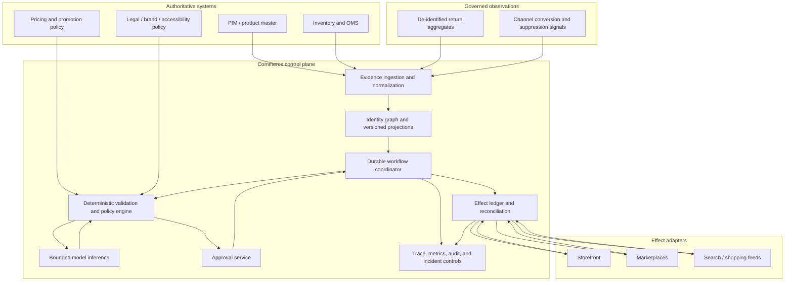

# E-commerce Merchandising and Operations Agent Blueprint

> **Production position:** build this as a durable, policy-gated commerce workflow with an agent inside it—not as a chatbot with broad storefront credentials.

**Status:** research-backed production blueprint, active Pass 1  
**Research date:** 2026-08-31  
**Evidence maturity:** current primary sources were cross-checked across GS1, major commerce channels, PIM platforms, web standards, regulators, and agent-runtime guidance. Provider behavior remains volatile; use the [research packet](../../research/packets/ecommerce-operations-agent-blueprint.md) and refresh triggers before implementation.  
**Target reader:** staff/principal engineers, commerce-platform owners, merchandising operations, security, SRE, data governance, product leadership, and human approvers.

## Purpose and target outcome

This blueprint covers an agent that turns product, offer, availability, policy, channel, and outcome evidence into reviewable merchandising recommendations and tightly controlled channel changes. It is meant to improve catalog quality, speed safe corrections, reduce channel drift, and help operators prioritize opportunities without letting a probabilistic model become the catalog, inventory, pricing, or publication authority.

A successful production system can:

- resolve product, SKU, variant, offer, market, catalog, and channel identifiers without guessing;
- compare authoritative source state with submitted, processed, and observable channel state;
- detect catalog defects, policy risks, stale availability evidence, price inconsistencies, promotion conflicts, and suppressed or missing listings;
- produce evidence-backed assortment, discoverability, content, and merchandising recommendations;
- prepare previewable catalog, offer, price, promotion, publication, and withdrawal changes;
- require effect-specific authorization before consequential changes;
- record semantic effect identities, receipts, postconditions, and unresolved outcomes;
- learn from approved outcome aggregates only through a governed release process; and
- survive duplicates, reordering, timeouts, partial acceptance, schema drift, connector throttling, and peak-event load.

The agent is not the system of record for products, stock, orders, prices, customer cases, accounting, consent, or legal determinations.

## Scope boundaries

| This blueprint owns | It consumes but does not own | Explicitly outside the boundary |
|---|---|---|
| Catalog identity mappings; product/variant/offer projections; channel readiness; content-quality evidence; merchandising recommendations; effect proposals; channel reconciliation; listing suppression triage; offer drift; governed outcome feedback | PIM product truth; ERP/OMS inventory and order state; pricing-policy decisions; promotion approvals; storefront and marketplace status; returns aggregates; conversion observations; legal and brand policies | Audience selection and campaign outcomes; physical inventory movement and fulfillment; customer-support cases; accounting truth; payment processing; general editorial source lifecycle; legal advice; autonomous assortment, price, discount, or publication authority |

The seams are deliberate:

- **Marketing Operations** owns audiences, consent, campaign activation, and campaign outcomes. This agent may publish an approved commerce offer or product state; it does not decide whom to target.
- **Supply Chain and Logistics** owns physical movement, reservations, allocation, fulfillment, and inventory truth. This agent consumes availability evidence and may flag risk; it must not manufacture stock.
- **Customer Support** owns cases, customer communication, and case-resolution policy. This agent may use de-identified return-reason aggregates; it does not read or act on free-text cases by default.
- **Finance** owns accounting truth, margin definitions, settlement, tax, and financial close. This agent may consume approved price floors and economics; it does not calculate authoritative margin.
- **Content Editorial** owns general source creation, editorial governance, and brand narrative. This agent owns commerce-field readiness and channel-specific product-content projections.

## Non-goals

This blueprint does not authorize:

- model-selected live prices, reference prices, discounts, promotion eligibility, or assortment;
- raw inventory-quantity writes or reservation changes;
- payment, refund, order-cancellation, fulfillment, or customer-contact actions;
- legal-claim approval, regulated-product classification, or accessibility certification;
- browser automation as the normal integration strategy;
- cross-tenant discovery, credentials, logs, or memory;
- silent retries after an ambiguous consequential effect;
- self-modification from production outcomes; or
- multi-agent orchestration merely because the domain is broad.

Use deterministic rules, scheduled comparisons, and ordinary dashboards when the work is stable joins, validation, or thresholding. Add a model only where language, sparse evidence, ambiguous taxonomy, prioritization, or explanation creates material value.

## Workload qualification

| Workload | Default implementation | Why |
|---|---|---|
| Required-attribute, schema, GTIN, currency, price-floor, or inventory-freshness checks | Deterministic service | Exact rules are cheaper, explainable, and testable. |
| Full source-to-channel drift comparison | Deterministic reconciler | Completeness matters more than semantic judgment. |
| Product-type or variant-family suggestion from messy evidence | Model proposes; deterministic validation and human review decide | Semantics help, but identity mistakes can corrupt listings. |
| Listing copy or alt-text suggestion | Model drafts; claim and accessibility gates plus reviewer | Language generation is useful; factual and contextual correctness remain governed. |
| Opportunity prioritization across content, suppression, returns, and conversion signals | Model ranks with explicit evidence and uncertainty | Cross-signal synthesis is valuable when the score is not treated as truth. |
| Price, promotion, assortment, or live publication | Deterministic policy and exact approval; connector commits | These are consequential external effects. |
| Emergency withdrawal of an unsafe or legally prohibited item | Narrow deterministic runbook | Safety should not wait for model deliberation. |

## Operating invariants

1. **Identity precedes recommendation.** No action is prepared until product, variant, offer, market, tenant, and channel bindings are resolved or explicitly marked ambiguous.
2. **Authority follows the effect.** A model may propose; an application policy engine and named approver authorize; a narrow connector commits.
3. **Money is exact.** Amounts use integer minor units or an exact decimal plus currency, market, tax basis, and effective interval—never floating-point prose.
4. **Availability is evidence.** Only the inventory/OMS service owns sellable quantity and reservation truth. Cached marketplace or storefront availability may be stale.
5. **Submitted is not live.** Provider acceptance, asynchronous processing, policy review, search indexing, publication, and checkout observability are separate states.
6. **Unknown is a first-class effect result.** A timeout after commit triggers read-back and reconciliation, not a blind retry.
7. **Approvals bind immutable intent.** Approval covers the exact target set, normalized parameters, source versions, policy version, content hash, expiration, and approver.
8. **Current policy wins at commit.** Revalidate identity, permissions, price/promotion policy, inventory freshness, and source revision immediately before the effect.
9. **Untrusted content cannot steer authority.** Product descriptions, supplier files, images, HTML, reviews, return notes, and tool output are data, never instructions.
10. **Outcome signals do not self-authorize.** Conversion and return observations may inform a recommendation; they cannot directly change prompts, rules, prices, or publication.
11. **Every external effect reconciles.** Verification reads authoritative or provider-processed state and records a receipt or an owned unresolved incident.
12. **Tenant and account binding is fail-closed.** Every run, artifact, effect, credential, event, trace, and cache key carries the same verified tenant boundary.

All schemas, payloads, formulas, and pseudocode in this guide set are illustrative and framework-neutral. They show required semantics rather than a drop-in implementation; the surrounding text states material omissions, validation rules, and safe failure behavior. Production implementations must use the project's typed schema, exact money/time libraries, authentication, storage, and provider-version contracts.

## Core workflow

```mermaid
flowchart LR
    A[Trigger or operator request] --> B[Resolve tenant and commerce identity]
    B --> C[Acquire versioned source evidence]
    C --> D[Run deterministic quality and policy checks]
    D --> E{Semantic judgment useful?}
    E -- no --> F[Produce deterministic finding]
    E -- yes --> G[Generate bounded recommendation]
    F --> H[Build immutable proposal]
    G --> H
    H --> I[Preview and simulate provider projection]
    I --> J{Consequential effect?}
    J -- no --> K[Publish report or task]
    J -- yes --> L[Exact approval and commit-time revalidation]
    L --> M[Narrow connector commits]
    M --> N[Read back submitted, processed, live, and observable state]
    N --> O{Postcondition proven?}
    O -- yes --> P[Verified effect and outcome observation]
    O -- no --> Q[Unknown or failed; reconcile or escalate]
```

The durable run lifecycle is:

`accepted → identity_resolved → evidence_ready → proposed → validated → awaiting_approval → ready_to_commit → committing → reconciling → verified | failed | unknown | cancelled`

No state transition is inferred from a model response. The workflow engine advances state only after validating a typed artifact or connector receipt.

## Reference architecture

### Architecture decisions at a glance

| Decision | Default | Reason |
|---|---|---|
| Orchestration | One durable coordinator with typed stages | Commerce effects are long-running, asynchronous, and recovery-sensitive. |
| Agent topology | Single bounded agent; specialists only if evals prove isolation value | More agents add latency, handoff failure, and authorization surface. |
| Source truth | Existing PIM, inventory/OMS, pricing policy, and provider-processed state | Agent records contain evidence and decisions, not business truth. |
| Context | Query-built task packet with source versions and field-level provenance | Whole catalogs exceed context and create stale, irrelevant evidence. |
| Memory | Governed preferences and mappings only; no raw customer notes or silent learning | Persistent memory must be reviewable, tenant-bound, and revocable. |
| Tool exposure | Stage-specific capability registry | A read-only analysis step should not see live price or publication tools. |
| External effects | Prepare → authorize → commit → reconcile | A provider response cannot prove the intended state became live. |
| Browser/RPA | Last-resort, dedicated account, exact approval, and forced read-back | UI flows are unstable and hard to make idempotent. |
| Scaling unit | Tenant × channel account × market partition | Quotas, credentials, failure domains, and business rules align there. |
| Model release | Version the whole behavior bundle | Model, prompt, tools, policies, mappings, memory, and adapters interact. |

## Guide map

| Guide | Production question answered |
|---|---|
| [01 — Mission, boundaries, and workload fit](01-mission-boundaries-and-workload-fit.md) | What should this system own, reject, automate, and escalate? |
| [02 — Reference architecture, runtime, and integrations](02-reference-architecture-runtime-and-integrations.md) | What runs where, and how do channel-specific semantics stay visible? |
| [03 — Catalog identity, offers, and channel state](03-catalog-identity-offers-and-channel-state.md) | How are products, variants, offers, and live projections resolved safely? |
| [04 — Availability, pricing, promotions, and merchandising](04-availability-pricing-promotions-and-merchandising.md) | How can the agent reason about commercial opportunity without owning price or stock truth? |
| [05 — Content quality, policy, and outcome signals](05-content-quality-policy-and-outcome-signals.md) | How are content readiness, claims, accessibility, returns, and conversion evidence governed? |
| [06 — Tools, effects, reconciliation, and recovery](06-tools-effects-reconciliation-and-recovery.md) | How do proposed changes become reversible, verifiable external effects? |
| [07 — State, context, memory, and planning](07-state-context-memory-and-planning.md) | What belongs in durable state, working context, memory, and plans? |
| [08 — Security, privacy, permissions, and governance](08-security-privacy-permissions-and-governance.md) | How are tenants, credentials, untrusted content, approvals, and authority contained? |
| [09 — Reliability, observability, evaluation, and incidents](09-reliability-observability-evaluation-and-incidents.md) | How is behavior measured, tested, diagnosed, and stopped? |
| [10 — Deployment, peak scale, cost, and governed evolution](10-deployment-peak-scale-cost-and-governed-evolution.md) | How does the system progress from deterministic baseline to safe production scale? |
| [11 — Qualified adapters and worked commerce flows](11-qualified-adapters-and-worked-commerce-flows.md) | How are real provider operations admitted, and how do partial multi-channel workflows recover? |

The [dated research packet](../../research/packets/ecommerce-operations-agent-blueprint.md) records source selection, current-version checks, disagreements, architecture decisions, rejected designs, limitations, and refresh triggers.

## Reader paths

- **Commerce and product owners:** start with [01](01-mission-boundaries-and-workload-fit.md), [04](04-availability-pricing-promotions-and-merchandising.md), [05](05-content-quality-policy-and-outcome-signals.md), and the staged roadmap in [10](10-deployment-peak-scale-cost-and-governed-evolution.md).
- **Platform engineers:** read [02](02-reference-architecture-runtime-and-integrations.md), [03](03-catalog-identity-offers-and-channel-state.md), [06](06-tools-effects-reconciliation-and-recovery.md), [07](07-state-context-memory-and-planning.md), and the operation-level qualification in [11](11-qualified-adapters-and-worked-commerce-flows.md).
- **Security and risk:** read the invariants above, then [06](06-tools-effects-reconciliation-and-recovery.md), [08](08-security-privacy-permissions-and-governance.md), and [09](09-reliability-observability-evaluation-and-incidents.md).
- **SRE and release owners:** read [02](02-reference-architecture-runtime-and-integrations.md), [09](09-reliability-observability-evaluation-and-incidents.md), [10](10-deployment-peak-scale-cost-and-governed-evolution.md), and the recovery exercises in [11](11-qualified-adapters-and-worked-commerce-flows.md).
- **Evaluators:** read [03](03-catalog-identity-offers-and-channel-state.md), [05](05-content-quality-policy-and-outcome-signals.md), [07](07-state-context-memory-and-planning.md), and [09](09-reliability-observability-evaluation-and-incidents.md).

## Definition of done

A production release is not done until all of the following are true:

- the category boundary and named human/system owners are approved;
- each product, variant, offer, market, and channel account has deterministic identity resolution or an explicit ambiguity stop;
- authoritative, submitted, processed, published, and observable states are modeled separately;
- every tool has a typed input/output schema, authority class, credential binding, timeout, retry rule, and failure contract;
- money, inventory freshness, promotion eligibility, regulated claims, and publication rules have deterministic gates;
- all consequential effects use immutable proposals, exact approval, commit-time revalidation, semantic effect identity, receipts, postconditions, and reconciliation;
- unknown effects cannot be blindly retried and have an owner plus deadline;
- webhooks are authenticated, deduplicated, reordered by source time where possible, and backed by scheduled reconciliation;
- context, state, memory, traces, and caches are tenant-bound, minimized, retained, and deletable under policy;
- normal, adversarial, ambiguity, partial-failure, provider-drift, peak-load, cancellation, and recovery evaluations pass release gates;
- dashboards distinguish business observations from agent-control metrics;
- kill switches exist by tenant, connector, effect type, release, and model route;
- incident playbooks are rehearsed for wrong price, false availability, bulk corruption, suppression spikes, cross-tenant access, and unknown effects;
- canary and rollback procedures cover the full behavior bundle; and
- every accepted run and every external effect ends as verified, failed with evidence, cancelled safely, or unknown with an explicit reconciliation owner.

## Immediate stop conditions

Stop the affected run, connector, tenant, or release when any of these occur:

- tenant, shop, merchant, marketplace, catalog, currency, or market identity cannot be proven;
- product/variant identity is ambiguous or source versions conflict;
- price basis, currency, tax inclusion, reference-price rule, or promotion jurisdiction is unknown;
- inventory evidence is older than the use-case freshness budget;
- an approval digest, scope, source revision, policy version, or expiration no longer matches;
- a tool requests credentials or fields outside its declared stage and authority;
- untrusted content is observed influencing tool choice, authorization, target expansion, or policy interpretation;
- a commit times out and its postcondition is unknown;
- provider schema, publication, or list-replacement semantics differ from the validated adapter contract;
- bulk failure, suppression, policy rejection, or unknown-effect rate breaches the channel stop threshold;
- cross-tenant data, protected customer data, payment data, or secrets appear in context, logs, or model traffic; or
- a release cannot be mapped to an immutable behavior-bundle manifest.

## Stage path from zero to production

| Stage | Deliverable | Exit signal |
|---|---|---|
| 0 — Deterministic baseline | Identity map, catalog/channel snapshot, drift report, rule engine, human runbook | Exact checks and manual actions are measured; no model or write credentials required. |
| 1 — Bounded assistant | Read-only evidence packets and recommendations | Recommendations are traceable, reviewable, and outperform the deterministic baseline on selected semantic tasks. |
| 2 — Controlled MVP | Typed proposals, previews, approvals, sandbox/test-store adapters | No unreviewed live effects; critical identity, money, tenant, and recovery tests pass. |
| 3 — Reliable v1 | Durable runs, effect ledger, reconciliation, observability, incident controls | Ambiguous outcomes are recovered without duplicate effects; canary criteria are met. |
| 4 — Production | Narrow live D3 effects behind exact approvals and independent kill switches | Security, SRE, commerce, and policy owners sign off on real traffic and rollback drills. |
| 5 — Peak scale | Partitioned queues, quota governors, coalescing, priority lanes, capacity SLOs | Peak simulation and a bounded event prove graceful degradation and correction capacity. |
| 6 — Governed evolution | Outcome review, controlled memory updates, full-bundle eval and release | No online self-learning; every behavior change has evidence, approval, canary, and rollback. |

Detailed entry and exit gates are in [10 — Deployment, peak scale, cost, and governed evolution](10-deployment-peak-scale-cost-and-governed-evolution.md).

## Canonical repository controls

This category specializes, rather than duplicates, the repository-wide contracts:

- [Execution boundaries](../../runtime/execution-boundaries.md)
- [Run controls](../../runtime/run-controls.md)
- [Agent state and event contracts](../../runtime/agent-state-and-event-contracts.md)
- [Durable execution](../../runtime/durable-execution.md)
- [Tool contracts](../../tools/tool-contracts.md)
- [Tool results, artifacts, and provenance](../../tools/tool-results-artifacts-and-provenance.md)
- [Idempotency and side effects](../../reliability/idempotency-and-side-effects.md)
- [Failure taxonomy](../../reliability/failure-taxonomy.md)
- [Evaluation-driven development](../../evaluation/evaluation-driven-development.md)
- [Trajectory and reliability evaluation](../../evaluation/trajectory-and-reliability-evaluation.md)
- [Observability and tracing](../../evaluation/observability-and-tracing.md)
- [Context engineering](../../context-memory/context-engineering.md)
- [Memory architecture](../../context-memory/memory-architecture.md)
- [Agent threat model](../../security/agent-threat-model.md)
- [Prompt injection and untrusted data](../../security/prompt-injection-and-untrusted-data.md)
- [Permissions, sandboxing, and secrets](../../security/permissions-sandboxing-and-secrets.md)
- [Deployment, release, and incident response](../../operations/deployment-release-and-incident-response.md)
- [Scaling, capacity, and SLOs](../../operations/scaling-capacity-and-slos.md)

## Selected primary sources

- [GS1 GTIN Management Standard](https://www.gs1.org/1/gtinrules/en/)
- [GS1 Global Data Model artifacts](https://ref.gs1.org/standards/gdm/artefacts)
- [Google Merchant product data specification](https://support.google.com/merchants/answer/7052112?hl=en-GB)
- [Google Merchant API product management](https://developers.google.com/merchant/api/guides/products/add-manage)
- [Amazon Listings Items API](https://developer-docs.amazon.com/sp-api/lang-en_EN/docs/listings-items-api)
- [Shopify Admin GraphQL ProductVariant](https://shopify.dev/docs/api/admin-graphql/latest/objects/productvariant)
- [Shopify webhook delivery guidance](https://shopify.dev/docs/apps/build/webhooks)
- [commercetools Product Projections](https://docs.commercetools.com/api/projects/productProjections)
- [FTC advertising and marketing basics](https://www.ftc.gov/business-guidance/advertising-marketing)
- [W3C Web Accessibility Initiative image tutorial](https://www.w3.org/WAI/tutorials/images/)

See the [research packet](../../research/packets/ecommerce-operations-agent-blueprint.md) for the full source register and evidence-to-decision chain.
