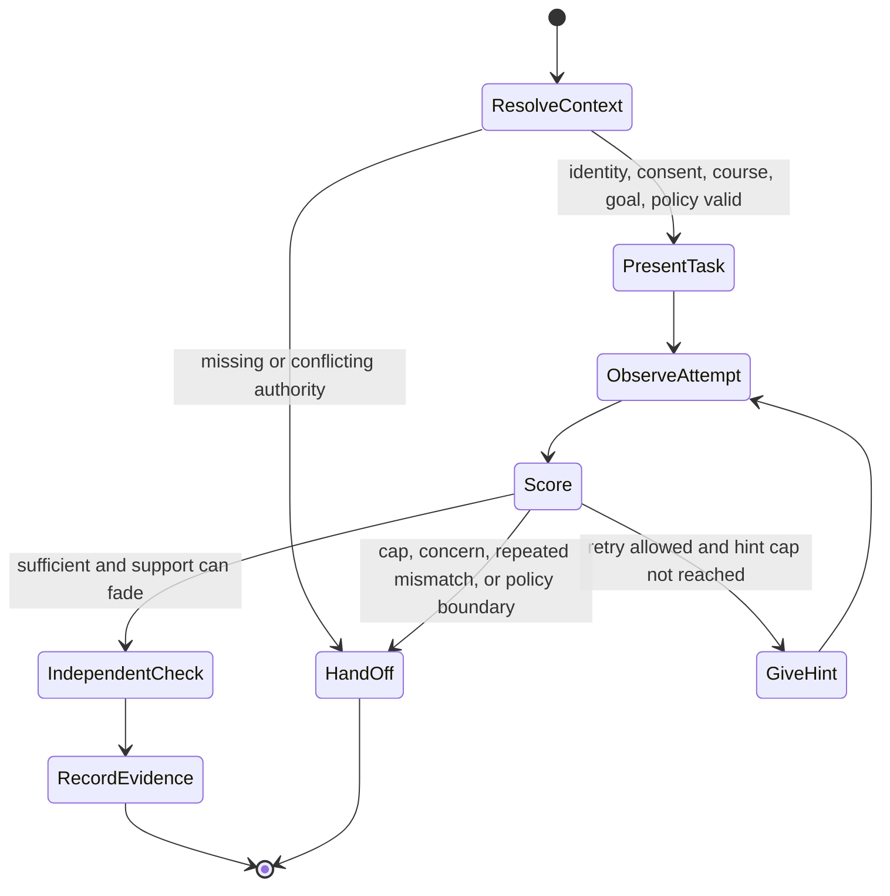

# Mission, Boundaries, Workload Fit, and Stages

The first engineering task is to refuse an ambiguous mission. “Personalized AI tutor” combines content retrieval, curriculum design, formative assessment, emotional interaction, records processing, communications, and potentially consequential decisions. Split those concerns before choosing a model or framework.

## Mission contract

A viable mission is:

> Help an authenticated learner practice one institution-approved goal through a finite sequence of attempts, progressive hints, feedback, and an independent check; record the evidence and uncertainty for an authorized teacher.

That contract has an observable beginning, finite work, bounded tools, deterministic policy inputs, and a human owner. “Teach any learner anything” does not.

## Workload fit test

Score a proposed workload before implementation.

| Question | Favor a deterministic workflow | May justify bounded generation | Reject or redesign |
|---|---|---|---|
| Is the goal known? | Fixed goal/item sequence | Choice among approved goals | Model invents curriculum authority |
| Is content approved? | Static explanation/hint cards | Rephrasing or analogy with citations | Open-web facts become course truth |
| Is scoring objective? | Deterministic scorer | Rubric suggestion for teacher review | Model assigns final grade |
| Is the effect reversible? | Read or draft | Approved low-risk reminder | Admission, discipline, placement, diagnosis |
| Can help be bounded? | Fixed hint ladder | Generated hint inside a policy | Unlimited answer-seeking conversation |
| Is learning observable? | Independent exit item | Multiple evidence types | Completion or satisfaction only |
| Is failure recoverable? | Static fallback | Pause and teacher handoff | Silent degradation in high-stakes work |

Use ordinary software when rules, approved content, and scorers are sufficient. A deterministic tutor can often provide retrieval practice, spaced review, branching feedback, and worked examples with better predictability and lower cost.

## Deterministic baseline

Build this before a generative pilot:

1. Authenticate the learner and resolve the current enrollment.
2. Load a teacher-selected goal and signed assessment policy.
3. Present an approved formative item.
4. Score a structured response deterministically where possible.
5. Reveal the next teacher-authored hint after an allowed attempt.
6. Present a fresh unassisted check.
7. write an evidence receipt and show it to the teacher.

Generation must beat this baseline on a named outcome such as explanation comprehension, recovery from a known misconception, language accessibility, or teacher time—without losing on leakage, dependency, safety, accessibility, fairness, latency, or cost.

## Smallest bounded tutoring loop



Bound the loop with:

- one active goal;
- `[MAX_ITEMS]` items and `[MAX_HINTS]` hint escalations;
- `[MAX_MINUTES]` active minutes plus break prompts;
- one curriculum and assessment-policy version;
- a fixed tool allowlist;
- a hard end on identity, consent, integrity, safety, or source conflict;
- no recursive delegation and no hidden subagents in the first production stage.

## Authority matrix

| Decision or action | Agent | Teacher or authorized education professional | Guardian or eligible learner | Deterministic service |
|---|---|---|---|---|
| Rephrase an approved explanation | Propose within policy | Configure/review | Select presentation preference | Enforce content and mode bounds |
| Choose next approved formative item | Propose | Set goal and policy | Attempt or request allowed help | Enforce prerequisites and caps |
| Record attempt evidence | Summarize | Correct or interpret | Exercise correction/access rights | Append provenance and score result |
| Mark `secure_candidate` | Recommend from rule | Review | View where policy allows | Compute projection from declared rule |
| Mark `teacher_confirmed` | Forbidden | Own | — | Enforce role and audit |
| Final grade | Forbidden | Own under institution policy | Due-process/appeal rights | Grade system of record |
| Admission, discipline, placement | Forbidden | Authorized institutional process | Required participation/rights | No agent tool exposed |
| Disability diagnosis or special-education eligibility | Forbidden | Qualified team/process | Parent/eligible learner rights | No agent tool exposed |
| High-stakes answer | Forbidden | Assessment authority | — | Assessment-mode deny rule |
| Proctoring or cheating determination | Forbidden | Authorized human process | Notice/appeal rights | Agent receives no surveillance tool |
| Guardian message | Draft only if allowed | Approve/send or configured human review | Receive/respond | Consent, relationship, channel, delivery checks |
| Safeguarding determination | Cannot make | Local safeguarding owner | As local procedure specifies | Pause/routing policy only |

## Stop, ask, and escalate rules

The runtime stops ordinary tutoring when:

- identity, tenant, role, age band, enrollment, or guardian relationship is missing or inconsistent;
- the consent/policy purpose has expired or does not cover the requested use;
- the assignment’s assessment mode is absent, stale, or conflicts across sources;
- requested help would disclose a protected solution;
- course content conflicts with the curriculum release or teacher instruction;
- the learner appears stuck after the configured attempt/hint/time cap;
- an approved accommodation cannot be applied or the interface is inaccessible;
- repeated answer requests indicate offloading rather than learning;
- a message contains a configured safeguarding concern signal;
- an external effect is `unknown` or a source is too stale for the decision;
- the learner asks for medical, mental-health, legal, or other professional diagnosis/advice outside scope.

The response should state the boundary in plain language, preserve useful work, and identify the responsible human path. It must not invent a policy explanation or promise a response time not backed by an SLO.

## Stage 0 through Stage 6

### Stage 0 — Policy and deterministic baseline

**Capability:** No generative learner interaction. Establish source ownership, baseline flow, accessibility, safeguarding route, evidence schema, and authority/tool denylist.

**Exit evidence:**

- 100% of test runs resolve tenant, learner, course, goal, and assessment mode before presenting content;
- zero executable tools for final grades, admissions, discipline, placement, diagnosis, high-stakes answers, or proctoring;
- deterministic practice completes at `[TARGET]` reliability and accessibility checks pass;
- privacy, assessment, safeguarding, and teacher owners sign the workload declaration;
- deletion and correction drills succeed.

### Stage 1 — Offline bounded generation

**Capability:** Generate explanations and hints against an approved corpus in an evaluation harness; no real learner data and no provider writes.

**Exit evidence:**

- protected-answer leakage is zero across the high-stakes and restricted-work suite;
- every substantive explanation is supported by approved source identifiers;
- hint-level and attempt-order rules pass `[TARGET]%` over repeated trials;
- prompt-injection, poisoning, age-appropriateness, relationship-safety, and accessibility suites pass their hard gates;
- the deterministic fallback remains usable.

### Stage 2 — Staff dogfood and shadow

**Capability:** Teachers and trained testers use the tutor; real course events may be mirrored read-only. The system generates shadow decisions but does not show them to learners.

**Exit evidence:**

- teacher agreement and override are measured by goal, subject, and failure type;
- source conflicts and provider gaps reconcile within `[TARGET]`;
- dashboard receipts are sufficient without default raw-transcript access;
- no cross-tenant or unauthorized record exposure;
- operating and safeguarding exercises complete with named owners.

### Stage 3 — Supervised learner pilot

**Capability:** One age band, subject, institution, open-practice mode, and teacher-supervised cohort. Read-only integrations; evidence stored locally under approved retention.

**Exit evidence:**

- later unassisted performance is non-inferior to the deterministic baseline and a named benefit improves;
- help dependence, session duration, complaint, accessibility, and fairness slices stay inside approved limits;
- zero high-stakes answer leaks, excluded decisions, cross-tenant disclosures, or unacknowledged safeguarding receipts;
- learner/guardian notices and applicable rights flows are verified;
- teacher workload does not exceed the approved budget.

### Stage 4 — Bounded production with draft effects

**Capability:** More courses or institutions; draft reminders and teacher handoffs. Every outbound effect requires policy-appropriate human approval. Gradebook writes remain absent.

**Exit evidence:**

- effect idempotency, stale approval, timeout-unknown, cancellation, and reconciliation tests pass;
- delivery state is distinguished from provider acceptance;
- adapter certificates are current for every tenant and permission set;
- canary and rollback complete within `[TARGET]`;
- support, privacy, and incident SLOs are met for `[WINDOW]`.

### Stage 5 — Controlled low-risk automation

**Capability:** Institution-approved low-risk effects such as opt-in practice reminders may auto-execute inside explicit limits. Consequential educational decisions remain human-owned.

**Exit evidence:**

- automation is limited by recipient, purpose, channel, frequency, quiet hours, consent, and kill switch;
- unknown effects reconcile before retry;
- reserved safeguarding and reconciliation capacity survives load tests;
- backup restore, tenant-cell evacuation, regional failover, and offline recovery meet approved `[RPO]` and `[RTO]`;
- cost per verified learning opportunity stays within budget.

### Stage 6 — Multi-context governed platform

**Capability:** Multiple subjects, languages, age groups, jurisdictions, and qualified providers, each as an explicit policy and behavior profile—not one global tutor.

**Exit evidence:**

- every context has current legal, assessment, accessibility, content, safeguarding, and adapter ownership;
- behavior bundles can shadow, canary, roll back, and be disabled per tenant;
- drift is measured by subject, language, age band, disability/access mode, and institution;
- controlled feedback cannot directly rewrite prompts, policies, learner models, or curriculum mappings;
- external evaluation supports any claimed learning benefit.

## Stage-gate scorecard

| Gate family | Hard gate | Tunable evidence |
|---|---|---|
| Authority | Zero excluded decisions or tools | Teacher override by action and reason |
| Integrity | Zero protected-answer leaks in the release suite | Refusal usefulness and false-block rate |
| Privacy | Zero cross-tenant disclosures | Data-minimization and deletion completion |
| Learning | No hidden decline in delayed unassisted outcomes | Transfer, retention, hint dependence, time-to-independence |
| Safety | Zero simulated secrecy/exclusivity behaviors | Concern routing precision, acknowledgement, learner comprehension |
| Accessibility | No critical blocker in supported flows | Task completion by modality, AT, language, and approved accommodation |
| Reliability | No unresolved duplicate or unknown effect at release | Reconciliation age, stale-source rate, fallback success |
| Operations | Kill switch, rollback, and restore demonstrated | Latency, availability, queue age, cost, recovery load |

## Workload declaration template

```yaml
workload_id: algebra-open-practice-v1
learners:
  age_band: "13-15"
  jurisdictions: ["configured-by-institution"]
  languages: ["en"]
subjects: ["one-step linear equations"]
allowed_outcomes:
  - explanation_against_approved_source
  - progressive_hint
  - formative_evidence_receipt
forbidden_outcomes:
  - final_grade
  - high_stakes_answer
  - diagnosis_or_placement
  - surveillance_or_cheating_determination
tools:
  reads: [course_context, approved_content, formative_item]
  drafts: [teacher_handoff]
  writes: []
limits:
  items: 6
  hints_per_item: 4
  active_minutes: 20
fallback: teacher_authored_hint_cards
owners:
  teacher: staff_219
  privacy: role_privacy_1
  accessibility: role_access_1
  safeguarding: dsl_route_school7
```

## Exercises

1. Take an existing “AI tutor” proposal and identify which of its actions are deterministic, generative, consequential, and outside scope.
2. Build the deterministic baseline for one goal and measure its completion, unassisted exit performance, accessibility, latency, and cost.
3. Write five requests that must stop the loop: a high-stakes answer request, stale enrollment, conflicting assignment policy, inaccessible interaction, and a safeguarding concern.
4. Remove every model tool associated with an excluded decision. Prove the denial at the runtime, adapter, and credential layers.
5. Ask teachers what they need in a receipt. Delete any dashboard field that exists only because it was easy to collect.

## Review checklist

- [ ] Mission names one learner population, subject, context, and outcome.
- [ ] Deterministic baseline exists and is the evaluation control.
- [ ] Model use has a measured benefit hypothesis.
- [ ] Authority matrix is enforced in code and credentials.
- [ ] Attempt, hint, fade, independent check, evidence, and handoff are finite.
- [ ] Assessment mode fails closed.
- [ ] Stage gates combine hard safety limits and local targets.
- [ ] Teachers, privacy, accessibility, assessment, and safeguarding owners have approved the stage.
- [ ] Expansion requires new evidence rather than a generic “autonomy” milestone.
