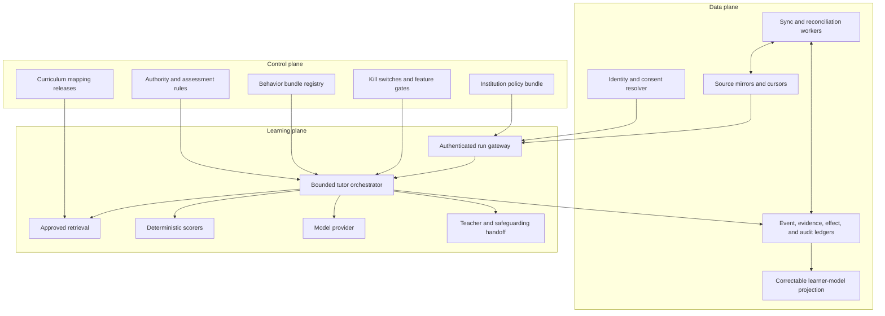
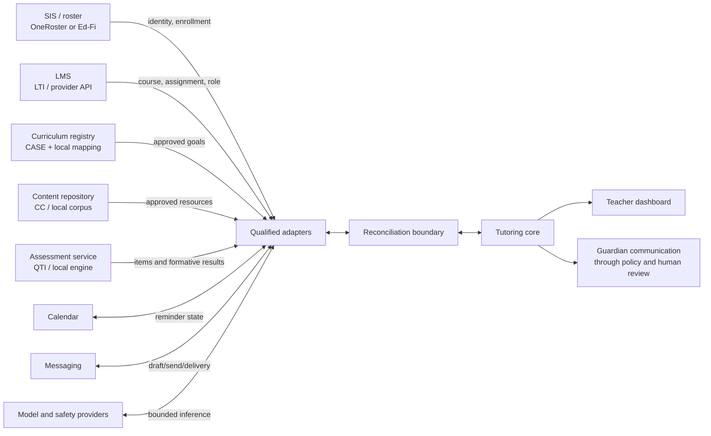
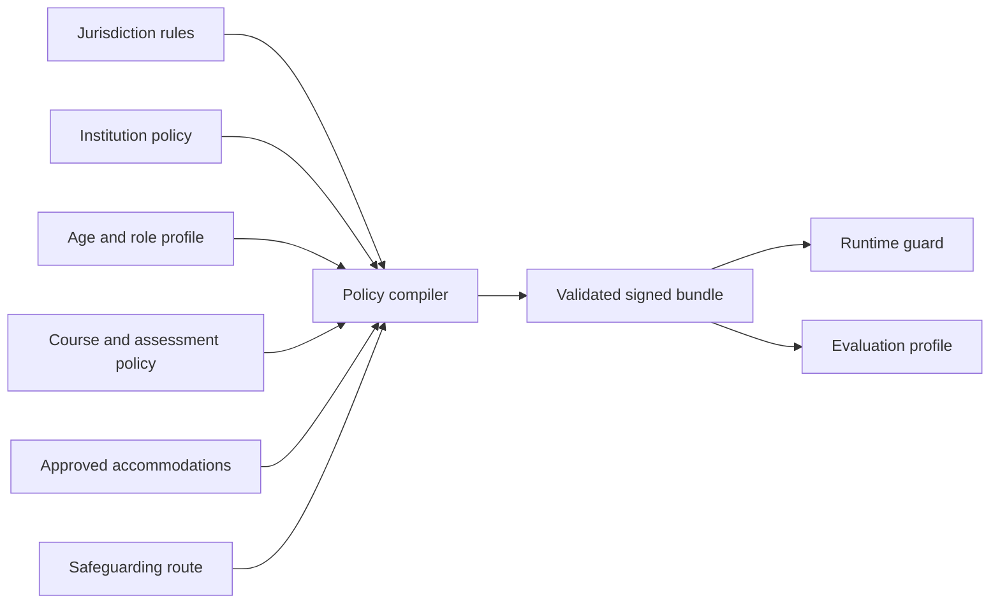

# Reference Architecture, Runtime, and Integration Map

The reference architecture separates three planes because they fail and change for different reasons. The **control plane** decides what is permitted. The **data plane** reconciles institutional facts. The **learning plane** runs bounded instructional interactions and records evidence. A model can propose within the learning plane; it cannot rewrite control declarations or source ownership.

## Three-plane architecture



### Control-plane responsibilities

- compile jurisdiction, institution, age-band, assessment, privacy, retention, accessibility, safeguarding, and tool rules into a signed policy bundle;
- publish immutable curriculum mappings and behavior bundles;
- assign tool capability to workload and stage;
- expose per-tenant kill switches and safe-mode configuration;
- prevent a model response, retrieved document, or provider event from changing authority.

Control changes use review, versioning, staged rollout, and audit. They do not arrive through a learner conversation.

### Data-plane responsibilities

- map institutional identities to pseudonymous runtime subjects;
- import and reconcile enrollment, course, assignment, content, calendar, and delivery facts;
- maintain source cursors, freshness, provenance, and deletion tombstones;
- store append-only events and evidence plus rebuildable projections;
- enforce tenant, institution, course, and learner partitions;
- deliver corrections and deletions through derived stores, indexes, caches, backups, and model-provider retention controls.

### Learning-plane responsibilities

- construct the current run declaration;
- require a genuine attempt unless an approved interaction accommodation applies;
- choose an allowed instructional move;
- invoke only declared retrieval, scoring, and model capabilities;
- enforce hint, item, time, content, and assessment limits before and after generation;
- record evidence without converting it into an unauthorized grade or diagnosis;
- stop, preserve state, and hand off when a boundary is reached.

## Source and adapter map



Adapters translate transport and provider semantics. They do not decide whether a learner may receive an answer, whether an accommodation applies, or whether an effect is educationally authorized.

## Minimal deployable components

| Component | Required behavior | Avoid at first |
|---|---|---|
| Authenticated gateway | Validate SSO/LTI launch and issue short-lived run token | Account creation through chat |
| Context resolver | Join identity, course, goal, policy, consent, and freshness into a receipt | Dynamic free-text source discovery |
| Tutor orchestrator | Execute one finite state machine | General task planner or agent society |
| Approved retrieval | Filter by tenant/course/goal/content release and return provenance | Shared global vector namespace |
| Scorer | Deterministic item scoring or rubric facts | Model-only final scoring |
| Model adapter | Typed prompt/output, timeout, refusal, safety metadata | Provider-specific logic in the domain core |
| Ledgers | Append run events, evidence, effects, audit | Mutating a single “current conversation” row |
| Projection worker | Rebuild learner-model/status views | Opaque model-generated profile |
| Teacher queue | Structured evidence, uncertainty, and handoff receipt | Default full transcript surveillance |
| Reconciler | Compare mirrors/effects with source systems | Blind retries |

A small deployment can combine these into one service and one worker process. The boundaries are logical contracts, not a requirement for microservices.

## Runtime state machine

The orchestrator is a deterministic interpreter over a signed run declaration.

```text
resolve_context
  -> validate identity, purpose, enrollment, source freshness, policy, and goal
  -> if invalid: create boundary receipt and stop

select_task
  -> choose only from approved items for the active goal
  -> apply exclusion, accessibility, prior-exposure, and assessment rules

observe_attempt
  -> append the learner response as an event
  -> scan for boundary and safeguarding signals
  -> score with the declared scorer when possible

select_move
  -> deterministic policy selects: probe, cue, hint, feedback, fade, check, or handoff
  -> model may realize only the selected move using approved sources
  -> output validator checks schema, citations, leakage, tone, and policy

record
  -> append assistance-aware evidence
  -> update a rebuildable projection
  -> produce learner feedback and a teacher receipt

finish_or_continue
  -> continue only while item, hint, time, source, safety, and policy budgets remain
```

The model is never asked, “What should we do next?” without a constrained move set and current authority declaration.

## Instructional move contract

```json
{
  "move_id": "mv_01K...",
  "run_id": "run_01K...",
  "goal_id": "linear_equations_one_step",
  "move_type": "strategic_hint",
  "hint_level": 2,
  "learner_attempt_ref": "evt_01K...",
  "allowed_concepts": ["inverse_operation", "equality_balance"],
  "forbidden_disclosures": ["final_numeric_answer", "answer_key"],
  "source_refs": ["content:alg1:r7:example-12"],
  "response_constraints": {
    "language": "en",
    "reading_profile": "institution-approved-plain-language",
    "maximum_words": 80,
    "ask_for_learner_step": true
  },
  "policy_version": "algebra1-2026-08-15",
  "behavior_bundle": "tutor-math-0.3.1"
}
```

Validate the returned `move_type`, source references, prohibited content, age-appropriate language, unsupported claims, and attempts to alter policy. On validation failure, use the static hint or stop; do not repeatedly regenerate until a dangerous answer slips through.

## Storage model

Use append-only facts and rebuildable views.

| Store | Examples | Mutation rule |
|---|---|---|
| Run ledger | created, policy resolved, paused, resumed, completed | Append transitions with expected state version |
| Event ledger | task shown, attempt received, hint shown, concern detected | Append immutable events; corrections are new events |
| Evidence ledger | scored attempt, assistance level, independent check | Append; never overwrite provenance |
| Effect ledger | draft created, approval, provider commit, delivery, cancel | Append transitions under idempotency key |
| Audit ledger | authority decision, sensitive access, disclosure, correction | Append minimal durable facts |
| Source mirrors | roster, course, assignment, content metadata | Replace/version by provider cursor and tombstone |
| Projections | run view, teacher queue, learner status | Rebuild from ledgers and mapping versions |
| Retrieval index | approved chunks and metadata | Immutable release; delete/rebuild on source change |

Do not place policy, evidence, provider state, and a raw transcript in one mutable session blob. That design cannot reliably reconcile, delete, audit, or recover.

## Retrieval boundary

Every retrieved unit includes:

```yaml
content_ref: content:alg1:r7:example-12
tenant_id: district_42
course_ids: [algebra_1_2026]
goal_ids: [linear_equations_one_step]
content_release: alg1-content-r7
approval:
  status: approved
  approver_role: curriculum_owner
  effective_from: 2026-08-01T00:00:00Z
  expires_at: 2027-07-31T23:59:59Z
rights:
  learner_display: true
  transformation: rephrase_only
  answer_key_access: false
accessibility:
  alt_text_reviewed: true
  language: en
  reading_profile: grade-appropriate
integrity:
  digest: sha256:...
  untrusted_instruction_text: true
```

Search happens after authorization filters, not before. Similarity score cannot override tenant, course, release, rights, or answer-key constraints.

## Policy compilation

Compile human-maintained policy sources into a machine-checkable artifact.



Compilation should reject contradictions such as an assignment simultaneously marked open practice and high stakes. A policy bundle names its sources, effective interval, owner, jurisdiction, intended age band, tool permissions, retention, evaluator suite, and hash.

## Failure-containment matrix

| Failure | Immediate behavior | Recovery |
|---|---|---|
| Model unavailable or slow | Use approved static hint; do not extend session indefinitely | Record fallback and compare quality |
| Retrieval empty | State that approved material is unavailable; hand off | Repair index/release, then replay only if appropriate |
| Curriculum mapping stale | Do not claim alignment | Curriculum owner republishes mapping |
| LMS/SIS unavailable | Use cached state only within declared freshness and low-risk mode | Reconcile before any effect or restricted work |
| Assessment policy conflict | Fail closed; no solution-bearing help | Authorized owner resolves source conflict |
| Scorer uncertain | Record response, not mastery | Teacher or approved rubric workflow reviews |
| Provider mutation timeout | Mark effect `unknown` | Read provider state before retry |
| Cross-tenant assertion fails | Terminate request and page security | Contain cell, investigate audit records |
| Safeguarding signal | Pause ordinary tutoring and route minimal receipt | Human procedure owns follow-up |
| Projection corrupt | Stop using projection | Rebuild from evidence ledger and mapping release |

## No hidden multi-agent requirement

The runtime needs roles, not autonomous personas. A “planner,” “critic,” “teacher,” and “safety agent” passing natural-language messages create more nondeterminism and unclear authority. Use deterministic services and typed validators. Add an additional model call only when an evaluation shows that it catches a specific failure better than a rule, and keep the final authority check outside both models.

## Implementation sequence

1. Create workload and authority declarations.
2. Implement authentication and the learner context receipt.
3. Implement append-only run and event transitions.
4. Add approved content lookup and a deterministic item scorer.
5. Run the fixed hint ladder end to end.
6. Add the typed model adapter for one instructional move.
7. Add output validation and static fallback.
8. Append evidence and build a teacher receipt.
9. Add reconciliation workers and provider health gates.
10. Only then consider draft effects and broader adapters.

## Architecture review questions

- Can the tutor run usefully with generation disabled?
- Can a retrieved document change the policy or tool allowlist?
- Which store proves the exact learner attempt and assistance level?
- Can projections be rebuilt after a correction or curriculum remap?
- Does each provider mirror have a freshness and full-resync rule?
- What happens if the provider committed a write but the response timed out?
- Can a school or district be disabled without affecting other tenant cells?
- Does the teacher dashboard remain useful without storing every raw utterance?
- Can the static fallback meet the accessibility and language profile?
- Is every high-consequence action physically absent from the model’s credentials and adapter?

## Related guides

- [Identity, consent, state, events, and continuity](03-learner-identity-consent-course-state-and-continuity.md)
- [Tools, effects, approvals, reconciliation, and handoffs](06-tools-effects-approvals-reconciliation-and-handoffs.md)
- [Adapter and provider qualification](10-adapter-and-provider-qualification.md)
- [Durable execution](../../runtime/durable-execution.md)
- [Agent state and event contracts](../../runtime/agent-state-and-event-contracts.md)
