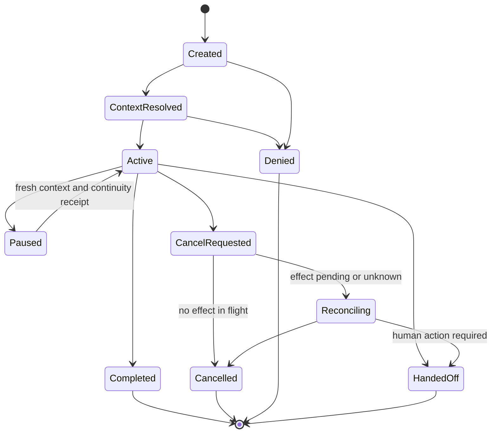
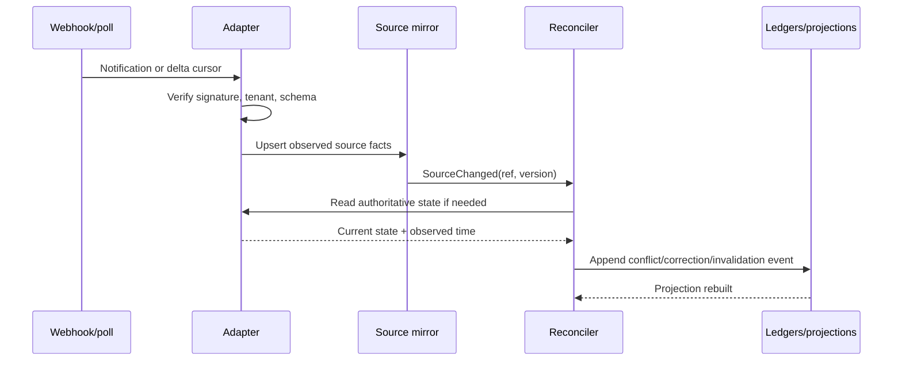
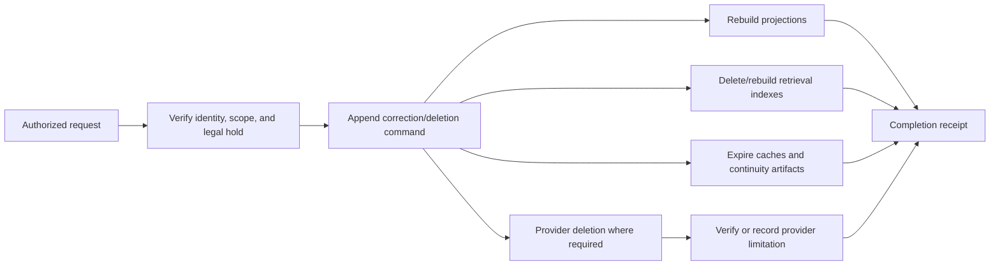

# Learner Identity, Consent, Course State, Events, and Continuity

A safe tutoring run begins with a verified institutional context, not a greeting. “I am a teacher,” “my parent said yes,” or “this is only practice” are conversation data—not authority. The runtime resolves identity, relationship, purpose, enrollment, course, assessment mode, and policy from governed sources and produces a signed receipt.

## Identity principles

- Use institution SSO, a validated LTI 1.3 launch, or another qualified authentication path.
- Keep provider identifiers in an encrypted identity vault and give the learning plane a pseudonymous subject identifier.
- Model learner, teacher, guardian, administrator, service, and support roles separately.
- Represent guardian and delegate relationships with scope and effective dates; a matching surname or email domain is not proof.
- Recheck enrollment and role at an institution-set freshness interval and before any sensitive read or effect.
- Treat account merges, renamed courses, transferred sections, withdrawn learners, and recycled provider identifiers as explicit events.
- Never put direct identifiers into trace IDs, cache keys visible across tenants, model prompts unless necessary, or analytics dimensions.

## Learner context receipt

```json
{
  "receipt_id": "lctx_01K...",
  "issued_at": "2026-08-31T10:15:00Z",
  "expires_at": "2026-08-31T10:30:00Z",
  "tenant_id": "district_42",
  "institution_id": "school_7",
  "subject": {
    "learner_id": "psn_8f1c",
    "age_band": "13-15",
    "age_source": "sis",
    "age_observed_at": "2026-08-31T09:58:11Z"
  },
  "actor": {
    "actor_id": "psn_8f1c",
    "role": "learner",
    "authentication_strength": "institution_sso_mfa_policy",
    "delegation": null
  },
  "course": {
    "course_id": "algebra_1_2026",
    "section_id": "period_3",
    "enrollment_status": "active",
    "source": "sis",
    "source_version": "oneroster:classes:8842:2026-08-31T09:58:11Z"
  },
  "purpose": {
    "code": "course_formative_practice",
    "lawful_or_policy_basis": "institution-configured",
    "consent_artifact_id": "consent_29_or_not_applicable_reason",
    "allowed_recipients": ["course_teacher"],
    "prohibited_uses": ["advertising", "profiling_outside_course", "model_training"]
  },
  "assessment": {
    "assignment_id": "practice_14",
    "mode": "open_practice",
    "policy_version": "algebra1-2026-08-15"
  },
  "policy_bundle": "school7-child-safety-2026-09-01.r2",
  "signature": "jws:..."
}
```

Do not overload one `consent: true` field. Record the purpose, basis, actor, scope, recipients, effective interval, source, notice/version, and withdrawal or expiry behavior. In many institutional contexts consent is not the lawful basis; the receipt must encode the actual approved basis rather than invent one.

## Purpose and authority table

| Purpose | Typical actor | Minimum context | Default model access |
|---|---|---|---|
| Learner formative practice | Authenticated learner | Active course, goal, assessment mode, age/policy profile | Pseudonymous learner context and approved course content |
| Teacher evidence review | Assigned teacher | Current teaching relationship and legitimate purpose | Structured evidence; excerpts only when justified |
| Guardian update | Verified guardian/delegate | Active relationship, communication authority, purpose and channel policy | Human-approved summary, not unrestricted transcript |
| Accessibility support | Learner or authorized professional | Approved accommodation or learner presentation choice | Only fields required to render the current interaction |
| Safeguarding review | Configured safeguarding role | Local procedure and receipt access authority | Minimal relevant concern record under elevated audit |
| Operations support | Authorized support role | Incident ticket and scoped elevation | Metadata first; content only by separately audited access |

## Source-of-truth matrix

| Fact | Authoritative owner | Runtime copy | Conflict behavior |
|---|---|---|---|
| Institutional person and enrollment | SIS/identity service | Pseudonymous link plus freshness | Deny or read-only safe mode if stale for risk |
| Course role and launch context | LMS/LTI plus SIS policy | Run-scoped receipt | Reconcile; do not let a learner-selectable role win |
| Assignment and due state | LMS | Versioned mirror | LMS wins after authenticated read; record changed context |
| Assessment mode | Authorized course/assessment policy | Signed policy field | Conflict fails closed |
| Curriculum alignment | Curriculum registry/local mapping release | Immutable release ref | No alignment claim until owner resolves |
| Content approval and rights | Content repository/release owner | Indexed immutable metadata | Exclude expired or conflicting content |
| Assessment item/result | Assessment engine | Referenced result event | Preserve scorer/version; no model overwrite |
| Tutor attempts and help | Local event/evidence ledger | Authoritative local fact | Corrections append and rebuild projections |
| Delivery state | Messaging/calendar provider | Effect projection | Provider read/callback plus reconciliation wins |
| Final grade | Institution grade system | Not mirrored into model memory by default | Agent cannot write or redefine |

## Aggregate lifecycle

The `TutoringRun` aggregate owns state transitions. It references institutional facts but does not become their new source of truth.



Valid transitions use expected-state versions. A late event cannot silently move a completed or cancelled run back to active.

## Run state contract

```yaml
run_id: run_01K...
state: active
state_version: 12
tenant_id: district_42
learner_context_receipt: lctx_01K...
active_goal:
  local_goal_id: linear_equations_one_step
  curriculum_mapping_release: 2026-fall-r3
current_task:
  item_id: item_104
  item_release: algebra-formative-r8
budgets:
  items_used: 3
  items_limit: 6
  hints_used: 2
  hints_limit: 4
  active_seconds: 511
  active_seconds_limit: 1200
assistance:
  current_hint_level: 2
  full_solution_allowed: false
policy_bundle: school7-child-safety-2026-09-01.r2
behavior_bundle: tutor-math-0.3.1
source_snapshot:
  lms_observed_at: 2026-08-31T10:13:12Z
  sis_observed_at: 2026-08-31T09:58:11Z
open_effects: []
last_event_id: evt_01K...
```

## Event envelope

All domain changes use a common envelope so replay, tenancy checks, ordering, deduplication, and audits remain possible.

```json
{
  "event_id": "evt_01K...",
  "event_type": "learner_attempt_recorded.v1",
  "occurred_at": "2026-08-31T10:17:43.421Z",
  "recorded_at": "2026-08-31T10:17:43.812Z",
  "tenant_id": "district_42",
  "aggregate_type": "tutoring_run",
  "aggregate_id": "run_01K...",
  "aggregate_version": 13,
  "actor": {"type": "learner", "id": "psn_8f1c"},
  "correlation_id": "corr_01K...",
  "causation_id": "evt_task_presented_01K...",
  "idempotency_key": "attempt:run_01K:item_104:client_seq_4",
  "policy_bundle": "school7-child-safety-2026-09-01.r2",
  "behavior_bundle": "tutor-math-0.3.1",
  "payload": {
    "item_id": "item_104",
    "response_ref": "encrypted-object:...",
    "response_type": "structured_equation_step",
    "hint_level_before_attempt": 2,
    "client_sequence": 4
  },
  "schema_version": 1
}
```

Store sensitive response bodies in a separately protected object when necessary. The ledger can carry a reference, digest, classification, and retention class rather than raw text.

## Evidence event contract

```json
{
  "evidence_id": "evd_01K...",
  "learner_id": "psn_8f1c",
  "course_id": "algebra_1_2026",
  "goal_id": "linear_equations_one_step",
  "claim": "isolates_variable_using_inverse_operation",
  "task": {
    "item_id": "item_104",
    "item_release": "algebra-formative-r8",
    "difficulty_band": "course-moderate",
    "novel_transfer": false
  },
  "observation": {
    "result": "correct",
    "scorer": "equation-step-scorer@2.4.0",
    "score": 1,
    "score_max": 1,
    "observed_at": "2026-08-31T10:17:43.421Z"
  },
  "assistance": {
    "independent": false,
    "maximum_hint_level": 2,
    "worked_example_seen": false,
    "answer_exposed": false,
    "seconds_since_help": 38
  },
  "provenance": {
    "run_id": "run_01K...",
    "attempt_event_id": "evt_01K...",
    "assessment_policy": "algebra1-2026-08-15"
  },
  "retention_class": "formative-evidence-90d",
  "supersedes": null
}
```

Assistance is evidence data, not a footnote. An answer exposed earlier in the session can contaminate a nominally “independent” item if it is too similar; item-selection rules must account for exposure and transfer distance.

## Ordering, duplicate, and late-event rules

- Use unique event IDs and semantic idempotency keys.
- Reject an aggregate version that is not the expected next version; reread and re-evaluate.
- Preserve both occurrence and record times.
- Accept late provider facts into a source mirror, then compute whether they invalidate a run or evidence projection.
- A duplicate event is acknowledged without repeating the transition.
- A provider event with an unknown tenant or unmappable source ID enters quarantine, not a global retry loop.
- Corrections append `evidence_corrected` or `source_fact_corrected`; do not edit history invisibly.

## Source reconciliation



Webhooks wake the reconciler; they do not directly mutate the tutor’s current truth. Full scans repair missed notifications and expired cursors. Every adapter defines how deletion, merge, section transfer, and clock skew behave.

## Continuity receipt

A continuity receipt is a typed, loss-aware checkpoint used for pause, compaction, device transfer, human handoff, or recovery. It is not a prose summary.

```yaml
continuity_receipt_id: cont_01K...
run_id: run_01K...
created_at: 2026-08-31T10:20:00Z
reason: context_compaction
resume_requirements:
  - refresh_learner_context_receipt
  - verify_assessment_policy_version
state:
  aggregate_version: 18
  active_goal: linear_equations_one_step
  current_task: item_105
  last_safe_move: conceptual_prompt
budgets_remaining:
  items: 2
  hints: 1
  active_seconds: 404
evidence_refs:
  - evd_01K...
learner_visible_commitments:
  - "We will try one fresh problem without hints next."
teacher_constraints:
  - "Do not introduce two-step equations."
approved_accommodations_applied:
  - "text_to_speech_enabled"
open_questions:
  - id: q1
    question: "Does the sign error persist on a novel item?"
    owner: tutor_runtime
unknowns: []
effects: []
source_versions:
  curriculum_mapping: 2026-fall-r3
  content_release: algebra-formative-r8
  policy_bundle: school7-child-safety-2026-09-01.r2
  behavior_bundle: tutor-math-0.3.1
loss_report:
  omitted:
    - "verbatim small talk"
    - "fully represented correct intermediate steps"
  preserved_by_reference:
    - "encrypted learner responses"
  forbidden_to_infer:
    - "mastery"
    - "disability"
    - "motivation trait"
integrity:
  previous_receipt: cont_01J...
  digest: sha256:...
```

On resume, refresh volatile authority and source facts. Do not resume only because the conversation summary looks coherent.

## Cancellation semantics

Cancellation is cooperative and stateful:

1. Stop new model and tool invocations.
2. Commit or discard the current learner response according to the declared transaction boundary.
3. Mark in-flight effects `cancel_requested`; do not assume the provider cancelled them.
4. Create a continuity/cancellation receipt with open unknowns.
5. Reconcile provider effects and release reservations.
6. Apply retention or deletion policy to scratch and session data.

A learner can leave the interface immediately even if background reconciliation continues. The teacher dashboard must distinguish “learner session ended” from “all provider effects terminal.”

## Correction and deletion workflow



Backups may expire on a documented schedule rather than immediate physical deletion; record that limitation and prevent deleted data from being restored into active systems without replaying tombstones.

## Exercises

1. Replay a run with duplicate attempts, a late enrollment withdrawal, and an expired assessment-policy version. Confirm the final projection and audit trail.
2. Simulate an LTI role claim that conflicts with the SIS. Prove that the learner cannot gain teacher access.
3. Correct an incorrectly scored item and rebuild the learner projection and teacher dashboard.
4. Compact a session after three hints. Resume it with a fresh policy receipt and verify that the hint budget does not reset.
5. Delete a learner preference and trace its removal through the durable store, index, cache, provider, backup-tombstone process, and teacher view.

## Contract review checklist

- [ ] Identity and relationship derive from qualified sources.
- [ ] Purpose/basis and consent are represented precisely.
- [ ] Every source fact carries version, provenance, and observed time.
- [ ] Aggregate transitions reject stale versions.
- [ ] Evidence records assistance, exposure, scorer, task, and time.
- [ ] Provider notifications trigger reads and reconciliation.
- [ ] Continuity receipts report loss, unknowns, commitments, and resume checks.
- [ ] Cancellation handles in-flight and unknown effects.
- [ ] Correction and deletion rebuild all derived views.
- [ ] Raw learner data is separated from operational metadata and protected by retention class.

## Related guides

- [Context, seven memory levels, planning, and compaction](05-context-memory-learner-model-planning-and-compaction.md)
- [Tools, effects, approvals, reconciliation, and handoffs](06-tools-effects-approvals-reconciliation-and-handoffs.md)
- [Agent state and event contracts](../../runtime/agent-state-and-event-contracts.md)
- [Compaction and continuity](../../context-memory/compaction-and-continuity.md)
