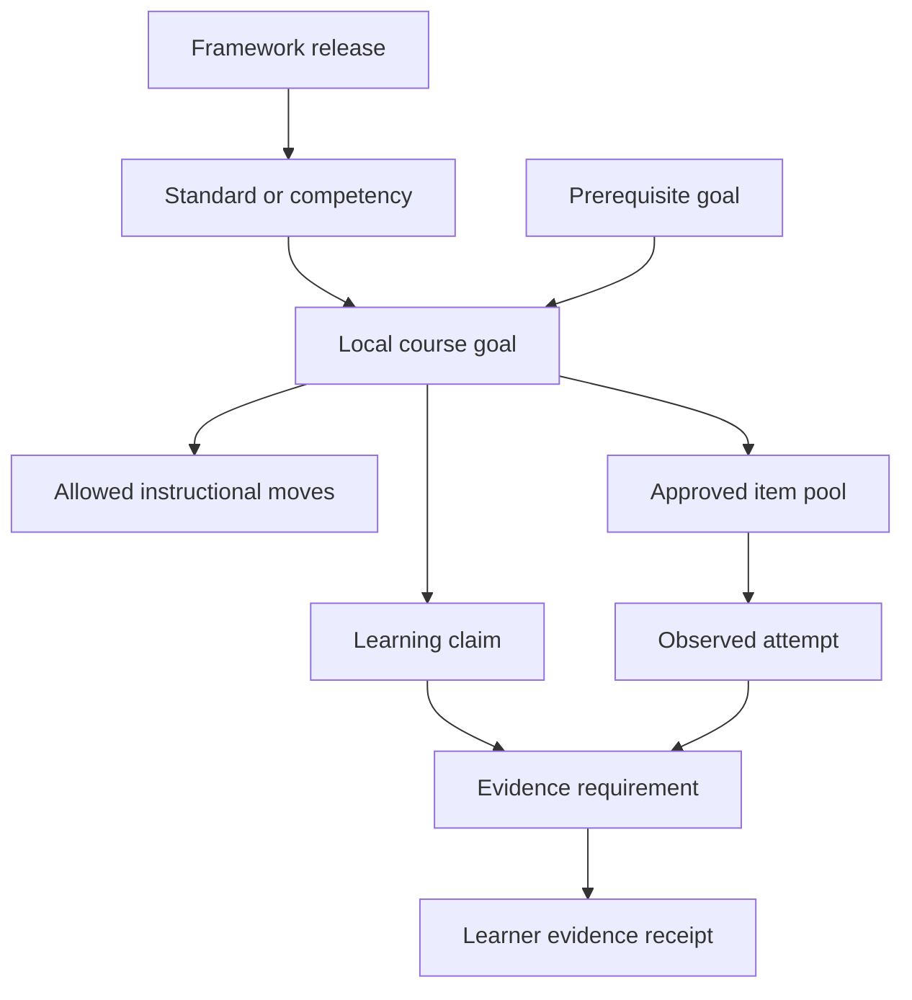

# Curriculum, Learning Design, Adaptive Tutoring, and Assessment

Pedagogy is a controlled domain policy, not a persona prompt. A reliable tutor links an institution-approved goal to observable evidence, selects from allowed instructional moves, gives no more help than needed, and makes the learner do the cognitive work. It reports what happened and what remains uncertain; it does not declare educational truth by conversational confidence.

## Goal-to-evidence design

Define each lesson goal as a versioned contract.

```yaml
goal_id: linear_equations_one_step
title: Solve one-step linear equations
curriculum_mapping:
  framework_id: case:example:math-2026
  framework_item_id: case:item:8.EE.C.7
  mapping_release: 2026-fall-r3
  local_course_id: algebra_1_2026
prerequisites:
  - inverse_operations
  - equality_as_balance
claim: learner_can_isolate_a_variable_using_an_inverse_operation
acceptable_evidence:
  - independently_solves_novel_symbolic_item
  - explains_why_same_operation_applies_to_both_sides
excluded_evidence:
  - copied_final_answer
  - completion_after_full_solution
  - model_self_rating
allowed_moves:
  - retrieval_probe
  - metacognitive_cue
  - conceptual_prompt
  - strategic_hint
  - partial_step_feedback
  - worked_example_after_attempt
assessment_boundaries:
  open_practice: all_allowed_moves
  bounded_homework: no_final_answer
  restricted_assessed_work: process_questions_only
  high_stakes: no_item_specific_help
owner: curriculum_team_math
approved_by: teacher_219
```

The external standard supplies a reference. The local mapping and teacher-approved claim determine what is taught. Store the issuer and version; codes alone are not globally unique or permanent.

## Curriculum graph



Associations can mean prerequisite, broader/narrower, related, or local sequence. Do not convert every association into a prerequisite edge. Graph cycles, orphan goals, deleted framework items, and local overrides require curriculum-owner review.

## Lesson contract

A lesson is finite and measurable:

| Field | Example | Owner |
|---|---|---|
| Goal | Isolate a variable in one-step equations | Teacher/curriculum owner |
| Entry evidence | Recent independent inverse-operation check | Evidence projection with teacher visibility |
| Success evidence | Two novel independent items plus explanation | Institution policy |
| Content release | Algebra formative release 8 | Content owner |
| Item exclusions | Seen answer, active assessment, inaccessible format | Deterministic selector |
| Hint ladder | Levels 0–4 below | Teacher/pedagogy owner |
| Stop rules | Four hints, six items, 20 minutes, concern signal | Institution policy |
| Handoff | Teacher queue for persistent sign misconception | Course teacher |
| Retention | Formative evidence `[RETENTION]` | Privacy/records owner |

## Require an attempt

An attempt can be a selected answer, equation step, sketch, spoken explanation, manipulable action, or explicit “I do not know.” The interface must support approved accommodations; requiring keyboard text from every learner is not a valid universal rule.

Before helping, ask for the smallest meaningful learner contribution:

- “Which operation is attached to the variable?”
- “Show the first step you would try.”
- “Choose the diagram that matches the situation.”
- “Tell me what part is unclear.”

Do not manufacture friction when it has no learning purpose. A learner asking how to navigate the interface, pronounce a word, or access an accommodation should receive direct support.

## Progressive hint ladder

| Level | Move | Example | Evidence consequence |
|---|---|---|---|
| 0 | Retrieval/probe | “What does an equation say about both sides?” | Can still support independent evidence if no answer-bearing cue is given |
| 1 | Metacognitive cue | “Name what you know and what you need to isolate.” | Record light help |
| 2 | Conceptual prompt | “An equation stays true when the same operation is applied to both sides.” | Record concept cue |
| 3 | Strategic hint | “Use the inverse of the operation attached to the variable.” | Record strategy exposure |
| 4 | Partial step or worked analogous example | Demonstrate a different item, then return to the original | Original completion is assisted; require a fresh transfer item |
| Blocked | Full solution or answer key | Not available in this mode | Handoff or policy explanation |

Each level asks the learner to act. Do not present a chain of hints in one message. Configure waiting and retry behavior by interaction modality rather than using a hidden universal timer.

## Feedback contract

Useful feedback is specific to the observed step and preserves learner agency.

```json
{
  "classification": "sign_error_hypothesis",
  "confidence_use": "choose_feedback_only",
  "evidence_refs": ["evt_attempt_17"],
  "acknowledge": "You applied an inverse operation to both sides.",
  "focus": "Check what happens to the sign when subtracting a negative.",
  "next_learner_action": "Rewrite only the right-hand side.",
  "answer_disclosed": false,
  "misconception_expiry": "end_of_run",
  "teacher_review_required": false
}
```

Do not write “you always confuse signs” or persist a trait from one error. A misconception label is a tentative, expiring hypothesis tied to evidence and a use.

## Adaptation policy

Adaptation chooses among approved items and moves; it does not invent the educational objective.

```text
if context invalid or assessment mode conflicts:
    stop
else if concern signal:
    safeguarding handoff
else if response unscorable:
    ask one bounded clarification, then teacher handoff
else if correct and help_level == 0:
    choose fresh item with modest transfer distance
else if correct and help_level > 0:
    fade help and choose comparable fresh item
else if attempts remain and hint_level < policy maximum:
    choose next hint level for observed step
else:
    summarize evidence and hand off
```

The selector considers:

- approved goal and prerequisites;
- content release and item rights;
- item exposure and answer contamination;
- difficulty band validated for the local population;
- modality and approved accommodations;
- language and reading demands separate from target skill;
- recent practice spacing and over-practice limits;
- assessment restrictions and active assignment exclusions;
- teacher exclusions or sequence constraints.

Do not adapt difficulty using a single opaque “ability” number. If a statistical model is used, publish its features, calibration population, uncertainty, minimum evidence, update rule, drift checks, and human correction path.

## Evidence and learner-status projection

The evidence ledger is the source. A status projection is a temporary view.

| Status | Meaning | Permitted transition owner |
|---|---|---|
| `insufficient_evidence` | Too little valid evidence or evidence too stale/assisted | Deterministic projection |
| `emerging` | Some relevant evidence with gaps or high support | Deterministic projection |
| `developing` | Repeated success but independence, transfer, or retention incomplete | Deterministic projection |
| `secure_candidate` | Local rule met across required evidence dimensions | Deterministic projection, visible for teacher review |
| `teacher_confirmed` | Authorized educator accepted the evidence under local policy | Teacher action only |

Example projection rule:

```yaml
projection_rule: algebra1-goal-status-v3
minimum_distinct_items: 3
minimum_independent_items: 2
requires_novel_transfer: true
requires_delayed_evidence_after: PT24H
maximum_evidence_age: P45D
scorers_allowed:
  - equation-step-scorer@2.4.x
disqualifiers:
  - answer_exposed_for_equivalent_item
  - unresolved_score_correction
output_ceiling: secure_candidate
```

These numbers are a local policy example, not a universal definition of mastery. Validate the rule against teacher judgment and independent outcomes.

## Anti-dependency design

Dependency is an interaction failure mode, not a learner defect. Design “give-back” moves that return work to the learner.

- Require an attempt before solution-bearing help.
- Ask the learner to explain, predict, compare, or choose the next step.
- Fade prompts after success rather than keeping the same support.
- Use a fresh, non-isomorphic check when possible.
- Separate immediate assisted score from delayed unassisted score.
- Cap hints, items, and active time; encourage a break or human contact.
- Do not use streaks, emotional obligation, scarcity, or engagement rewards.
- Explain that the system is AI and that a teacher or trusted adult is the human relationship.
- Track answer-request escalation and time-to-independence as product signals, not disciplinary evidence.
- Let the learner disable nonessential personalization and review/correct durable preferences.

### Offloading indicators

Use indicators to change the tutor’s help strategy, never to accuse or discipline:

- repeated requests for “just the answer” without an attempt;
- immediate paste of full items followed by no engagement;
- decreasing independent performance while assisted completion rises;
- escalating hint level across similar items;
- long sessions with little learner-produced work;
- answer-copy patterns detected by deterministic item telemetry.

The response is to reduce answer-bearing help, ask for a smaller learner step, offer a break, or involve the teacher—not to label cheating.

## Assessment-mode matrix

| Mode | Allowed | Restricted | Runtime behavior |
|---|---|---|---|
| `open_practice` | Full hint ladder, analogous worked example, formative check | Answer keys and excluded content | Apply normal loop |
| `bounded_homework` | Concept questions, process feedback, configured hints | Final answer, completed response, hidden rubric | Help the process and record boundaries |
| `restricted_assessed_work` | Clarify permitted instructions and general concepts | Item-specific reasoning, rewriting submission, solution | Refuse narrowly and direct to authorized support |
| `high_stakes_lockout` | Accessibility/navigation and emergency support only | All item-specific tutoring or answers | Disable tutoring tools for the assessment interval |

Policy is assignment-specific and signed by an authorized source. The model cannot lower the restriction based on learner claims, timestamps, or a document embedded in the item.

## Academic-integrity response pattern

Use a brief response:

1. name the applicable boundary without accusation;
2. decline only the prohibited help;
3. offer allowed support such as reviewing the underlying concept using a different item, after the assessment if necessary;
4. point to the institution’s policy or teacher;
5. record the boundary event without creating a misconduct finding.

AI-output detection is not the enforcement mechanism. Evidence design, assignment policy, process artifacts, oral or in-person checks where appropriate, and teacher judgment provide a more defensible integrity approach.

## Accessibility and language within pedagogy

The target skill must not be confused with the access mode. If the goal is algebra, an inaccessible visual or unnecessarily complex English should not determine the result.

- preserve mathematical and semantic structure for screen readers;
- provide reviewed alt text, captions, transcripts, and keyboard operation;
- support speech or symbol input when approved;
- distinguish translation assistance from language-learning assessment;
- allow learner-selected pace, text size, contrast, and audio where policy permits;
- avoid changing assessed constructs through an accommodation;
- mark machine translation and provide a human route when meaning is consequential;
- record which presentation support was applied so evidence is interpreted correctly;
- never infer disability or language status from mistakes or usage.

## Teacher dashboard receipt

```yaml
learner: psn_8f1c
course: algebra_1_2026
goal: linear_equations_one_step
mapping_release: 2026-fall-r3
assessment_mode: open_practice
session:
  items: 4
  maximum_hint_level: 3
  active_minutes: 12
evidence:
  assisted_correct: 2
  independent_correct: 1
  delayed_transfer: not_yet_observed
hypotheses:
  - label: sign_error_on_subtracting_negative
    evidence_refs: [evd_01K...]
    expires: end_of_next_session
    status: teacher_review_optional
access_support_applied:
  - text_to_speech
boundaries:
  - no_full_solution_requested_or_shown
unknowns:
  - retention_not_yet_measured
recommended_human_action:
  - schedule_fresh_check_after_24h
```

The teacher can correct the evidence, dismiss the hypothesis, change the goal, or record confirmation. The dashboard must not turn session signals into rank, discipline, or disability inference.

## Failure patterns

| Pattern | Why it fails | Control |
|---|---|---|
| Praise after every message | Can become manipulative, vague, or distracting | Acknowledge specific work; do not optimize affect |
| Socratic questioning forever | Frustrates learners and can hide lack of content | Finite hint ladder and direct explanation when permitted |
| Worked solution on a near-identical item | Contaminates the independent check | Exposure-aware item selection and transfer distance |
| Reading level inferred from age | Ignores individual and language needs | Approved profile plus learner-controlled presentation |
| Model-generated curriculum sequence | May omit prerequisites or conflict locally | Versioned curriculum graph and teacher ownership |
| One correct answer means mastery | Ignores chance, help, retention, and transfer | Multi-dimensional evidence projection |
| Negative affect classified as a trait | Risks stigma and false inference | Ephemeral signal, non-diagnostic language, human path |

## Pedagogical evaluation questions

- Does the learner produce more of the reasoning over time?
- Does support fade, or does the system increase help to preserve completion?
- Is later unassisted performance stable or improving?
- Are transfer items genuinely novel and free from answer contamination?
- Do language or accessibility demands distort evidence?
- Which learners receive more hints for the same observed work, and why?
- Does teacher correction change projections and future adaptation?
- Are learners and teachers able to explain what the status means and does not mean?

## Exercises

1. Author a goal contract with one claim, three evidence types, an approved item pool, and a four-level hint ladder.
2. Write paired items and show why one is too similar to count as independent transfer after a worked example.
3. Run the same learning task with keyboard, screen-reader, speech, and translated presentation. Check that the target construct is unchanged.
4. Simulate rising assisted scores and falling delayed independent scores. Define the release stop and teacher response.
5. Convert a direct-answer chatbot response into progressive moves that each require learner work.

## Related guides

- [Mission, boundaries, workload fit, and stages](01-mission-boundaries-workload-fit-and-stages.md)
- [Context, seven memory levels, planning, and compaction](05-context-memory-learner-model-planning-and-compaction.md)
- [Evaluation, observability, SLOs, and incidents](08-evaluation-observability-slos-and-safeguarding-incidents.md)
- [Research packet](../../research/packets/education-tutoring-agent-blueprint.md)
