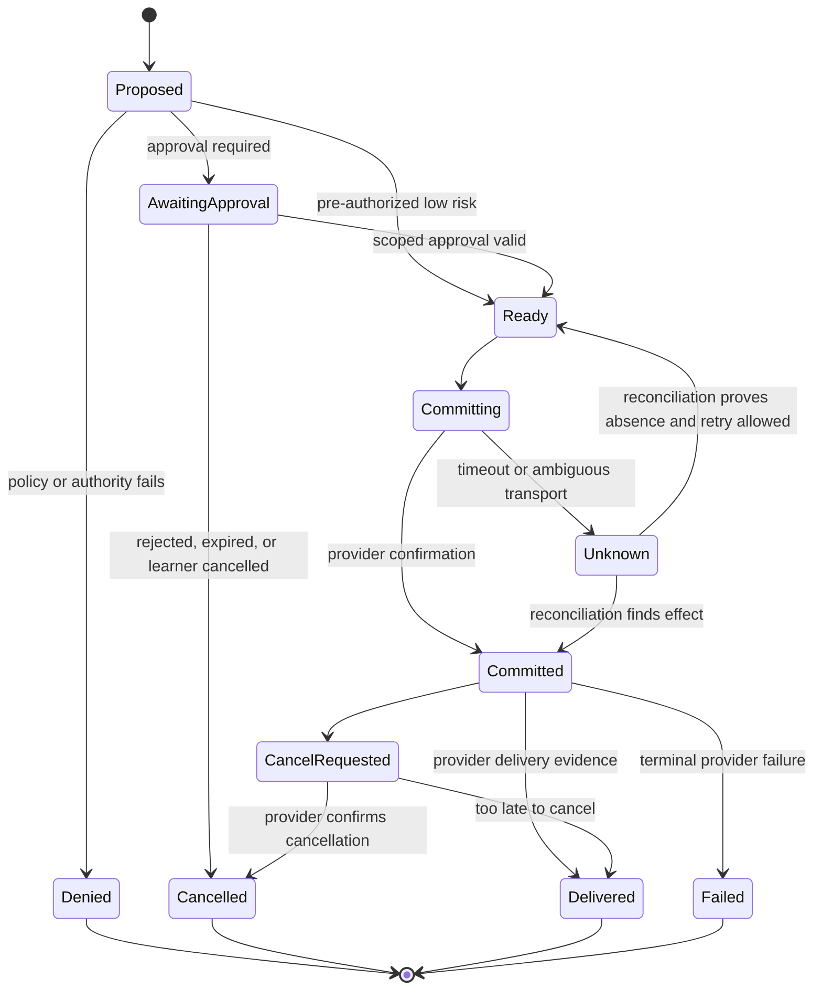
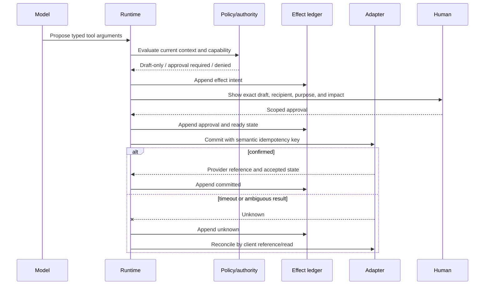

# Tools, Effects, Approvals, Reconciliation, and Handoffs

Reading an approved item and sending a guardian message are not the same kind of operation. The tool layer must express educational purpose, authority, risk, reversibility, provider semantics, and uncertainty. A model chooses neither credentials nor authority; it can only propose arguments for a capability that the runtime already allowed.

## Capability classes

| Class | Examples | Default stage | Control |
|---|---|---|---|
| Deterministic local read | Run state, evidence projection, approved goal | Stage 0 | Tenant/course authorization and version |
| External source read | LMS assignment, SIS enrollment, calendar event | Stage 2 | Qualified adapter, scope, freshness, audit |
| Instructional compute | Structured scorer, item selector, accessibility transform | Stage 0–1 | Versioned deterministic function or approved model move |
| Draft | Teacher handoff, guardian reminder draft | Stage 3–4 | Purpose and recipient resolution; no delivery |
| Reversible low-risk effect | Opt-in practice reminder, calendar hold | Stage 4–5 | Approval or pre-authorized policy, idempotency, cancel/reconcile |
| Consequential education effect | Final grade, admission, discipline, placement, diagnosis | Never | No tool, credential, or adapter operation exposed |
| Restricted assessment effect | Reveal answer, alter high-stakes item, proctoring judgment | Never | Deterministic assessment-mode block |

The adapter credential must match the capability. Hiding a grade-write endpoint from the prompt is not a security boundary if the credential can still call it.

## Tool declaration

```yaml
tool_id: messaging.create_teacher_handoff_draft.v1
purpose: summarize_formative_evidence_for_assigned_teacher
allowed_actors: [learner_runtime]
recipient_roles: [assigned_course_teacher]
input_schema: teacher_handoff_draft.v2
data_classes:
  allowed: [course_context, structured_evidence, boundary_events]
  prohibited: [unrelated_course_history, diagnosis_inference, raw_transcript_by_default]
effect: draft_only
approval:
  required_for_delivery: true
  approver_roles: [assigned_course_teacher, authorized_school_staff]
idempotency:
  key_fields: [tenant_id, learner_id, run_id, handoff_reason]
limits:
  per_run: 1
  maximum_excerpt_count: 2
timeout_ms: 4000
fallback: local_teacher_queue
```

Generate tool schemas from code-owned declarations and validate both input and output. Do not let provider-specific JSON become the domain contract.

## Effect lifecycle



“API returned 200,” “provider accepted,” “provider sent,” “recipient delivered,” and “recipient read” are distinct facts. Expose only states the provider actually supports.

## Effect intent contract

```json
{
  "effect_id": "eff_01K...",
  "effect_type": "practice_reminder.send.v1",
  "tenant_id": "district_42",
  "subject_id": "psn_8f1c",
  "purpose": "teacher_assigned_practice_reminder",
  "destination": {
    "recipient_id": "verified_guardian_81",
    "relationship_ref": "rel_2026_18",
    "channel": "sms"
  },
  "payload_ref": "approved-object:draft_01K...",
  "payload_digest": "sha256:...",
  "assessment_context": null,
  "authority": {
    "policy": "school7-guardian-comms-v4",
    "approval_id": "apr_01K...",
    "approver_role": "assigned_course_teacher"
  },
  "constraints": {
    "quiet_hours_timezone": "Asia/Kolkata",
    "send_not_before": "2026-09-01T10:00:00Z",
    "expires_at": "2026-09-02T10:00:00Z",
    "frequency_cap_key": "guardian_81:practice_reminders"
  },
  "expected_provider_version": null,
  "idempotency_key": "district42:guardian81:practice14:reminder1",
  "reconciliation": "lookup_by_client_reference_then_payload_digest",
  "state": "awaiting_approval"
}
```

The idempotency key represents semantic intent, not one HTTP attempt. A retry with a different recipient, assignment, payload digest, or send window under the same key is rejected as a mismatch.

## Approval contract

Approval must bind exactly what the human saw and what the runtime will do.

```yaml
approval_id: apr_01K...
effect_id: eff_01K...
approver:
  actor_id: staff_219
  role: assigned_course_teacher
  authenticated_at: 2026-08-31T10:24:12Z
scope:
  effect_type: practice_reminder.send.v1
  destination_digest: sha256:...
  payload_digest: sha256:...
  policy_version: school7-guardian-comms-v4
decision: approved
decided_at: 2026-08-31T10:25:03Z
expires_at: 2026-08-31T10:40:03Z
single_use: true
```

Reapproval is required if the content, recipient, channel, educational purpose, policy, schedule, or material source facts change. “Looks good” in a chat transcript is not an approval artifact.

## Tool-call sequence



Run the authority check again immediately before commit. Enrollment, guardian relationship, consent, policy, or assignment state may have changed while approval was pending.

## Unknown and retry rules

| Condition | State | Next action |
|---|---|---|
| Connection failed before request was sent | `ready` if provable | Retry within deadline and same intent key |
| Timeout after request transmission | `unknown` | Query provider or wait for callback; no blind retry |
| 429 with provider retry guidance | `ready` or `unknown` based on provider contract | Respect backoff, deadline, and idempotency semantics |
| Callback says delivered | `delivered` | Record provider time and evidence strength |
| Callback absent past SLO | `committed` or `unknown` | Poll/reconcile; do not label undelivered without evidence |
| Payload changed after approval | New intent | Reapprove; never reuse the old key |
| Recipient relationship expired | `denied`/`cancel_requested` | Stop, audit, and route to human if already committed |

Retry budgets are per semantic effect and provider. Backoff cannot exceed the purpose deadline; a reminder delivered after the assignment is due can be harmful even if technically successful.

## Cancellation

The user-facing action “cancel” means “stop further work and request cancellation where possible,” not “erase the external world.”

```text
cancel requested
  -> prevent unstarted effects
  -> invalidate pending approvals
  -> call provider cancellation only if capability and authority allow
  -> mark in-flight/timeout effects unknown until reconciled
  -> report delivered or too-late effects honestly
  -> preserve minimal audit and apply content retention policy
```

If a message was delivered, deletion from the local system does not remove it from the recipient’s device. Make this limitation visible in the completion receipt.

## Teacher handoff receipt

```yaml
handoff_id: hand_01K...
type: pedagogical_review
priority: normal
tenant_id: district_42
course_id: algebra_1_2026
learner_id: psn_8f1c
recipient_role: assigned_course_teacher
reason:
  code: hint_cap_reached
  learner_visible_explanation: "We have reached the help limit for this practice goal. Your teacher can review the steps with you."
context:
  goal_id: linear_equations_one_step
  assessment_mode: open_practice
  items_attempted: 4
  maximum_hint_level: 4
evidence_refs: [evd_01K..., evd_01J...]
hypotheses:
  - label: sign_error_on_subtracting_negative
    evidence_refs: [evd_01J...]
    confidence: tentative
unknowns:
  - delayed_independent_check_not_observed
access_support_applied: [text_to_speech]
recommended_action: review_one_fresh_item
policy_bundle: school7-child-safety-2026-09-01.r2
retention_class: teacher-handoff-30d
```

The teacher owns disposition. The runtime records `acknowledged`, `corrected`, `actioned`, `closed`, or `transferred`, but it must not guess closure from inactivity.

## Guardian communication boundary

Guardian communication needs a verified relationship, purpose, channel, language, consent/basis, and institutional policy. The safe default is a human-reviewed draft.

Include:

- course and practice purpose in plain language;
- what evidence was observed and what remains unknown;
- no diagnosis, ranking, misconduct implication, or model-generated “mastery” claim;
- the institution’s contact path;
- translation status and human-review note where relevant;
- no raw conversation transcript by default.

Never invite a learner to hide activity from a guardian or teacher. Also do not assume that every guardian is authorized to receive every record; eligible learners, custody restrictions, and institutional policy can change access.

## Teacher dashboard actions

| Action | Authority check | Effect behavior |
|---|---|---|
| Correct evidence | Assigned teacher or authorized reviewer | Append correction; rebuild projection |
| Change active goal | Course authority and curriculum mapping | New goal/run version; do not rewrite old evidence |
| Approve guardian draft | Relationship, purpose, channel, policy current | Bind exact payload and recipient |
| Dismiss misconception hypothesis | Teacher authority | Append disposition; prevent reuse |
| Escalate safeguarding receipt | Configured safeguarding role/path | Separate protected workflow and audit |
| Export records | Legitimate purpose and records policy | Asynchronous, scoped, auditable export |
| View sensitive excerpt | Elevated purpose and policy | Break-glass or scoped reveal; audited |

## Reconciliation worker

The worker processes effects by risk and age:

1. lease one effect partitioned by tenant;
2. refresh credential and authority where required;
3. read provider state using client reference, provider ID, or destination/time digest;
4. append the observed provider fact;
5. transition the local effect deterministically;
6. schedule next check or route an exception;
7. release the lease and emit safe metrics.

Use a single writer or optimistic concurrency per effect. Multiple workers must not race provider retries.

## Failure-injection cases

- provider commits, then the network drops before the response;
- duplicate approval delivery and double-clicked send;
- approval expires one millisecond before commit;
- guardian relationship is revoked after draft but before send;
- callback arrives before the synchronous response;
- delivery callback is duplicated, reordered, or signed with an old key;
- provider returns 429 with and without a retry header;
- user cancels while commit is in flight;
- tenant kill switch activates during a queued effect;
- a malicious learner prompt supplies a new recipient address;
- translation changes the educational meaning after approval;
- course withdrawal arrives while a teacher handoff is queued.

## Anti-patterns

| Anti-pattern | Failure | Replacement |
|---|---|---|
| Model receives a generic HTTP tool | Arbitrary destinations and methods | Named narrow capabilities |
| Approval stored as transcript text | Content can change and authority is unclear | Signed, single-use approval contract |
| Retry every timeout | Duplicate reminders or calendar events | `unknown` plus reconcile |
| Provider ID equals idempotency | ID exists only after commit | Client semantic intent key |
| “Sent” shown as “delivered” | Misleads teachers and guardians | Provider-specific state model |
| Delete local row on cancel | Loses audit and external state | Append cancellation and reconcile |
| Teacher handoff is prose only | Missing evidence, versions, and unknowns | Typed receipt plus protected references |

## Exercises

1. Implement a reminder adapter simulator that commits and then times out. Prove there is one provider effect after reconciliation.
2. Change a draft after approval and verify that commit is rejected.
3. Cancel an effect at every lifecycle state and document the learner-visible result.
4. Remove the grade-write scope from credentials and add a contract test proving the endpoint cannot be called.
5. Draft a guardian message in two languages and require a new approval when translation changes.

## Related guides

- [Reference architecture and runtime](02-reference-architecture-runtime-and-integration-map.md)
- [Learner identity, consent, course state, events, and continuity](03-learner-identity-consent-course-state-and-continuity.md)
- [Adapter and provider qualification](10-adapter-and-provider-qualification.md)
- [Idempotency and side effects](../../reliability/idempotency-and-side-effects.md)
