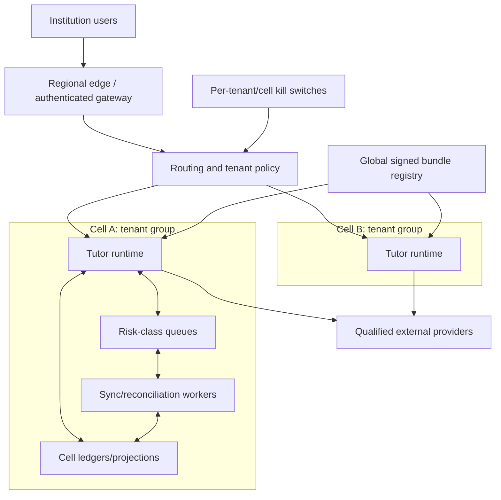
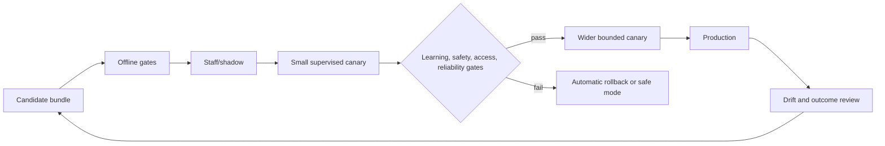
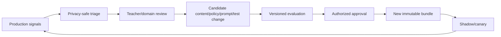

# Deployment, Scale, Cost, Recovery, and Governed Evolution

Scale should preserve educational boundaries, not merely throughput. Under load or dependency failure, the system sheds optional generation before identity, assessment policy, safeguarding, reconciliation, and evidence integrity. Releases are immutable behavior bundles, because a prompt change, curriculum remap, retrieval update, safety rule, or provider configuration can change behavior as much as a model update.

## Deployment topology



A cell contains a bounded tenant group and its runtime/data dependencies. A cell failure should not expose or corrupt another cell. Global services distribute signed configuration and aggregate privacy-safe metrics; they do not create a shared learner-content plane.

## Queue classes and priority

| Class | Examples | Capacity policy | Degradation |
|---|---|---|---|
| Q0 safety/control | Safeguarding delivery, kill switch, security containment | Reserved non-borrowable minimum | Alternate protected route/page |
| Q1 correctness | Unknown-effect reconciliation, identity/enrollment revocation, deletion/correction | Reserved capacity; strict age alerts | Freeze new effects/adaptation |
| Q2 interactive | Active tutoring moves and scoring | Per-tenant fairness, short deadlines | Static hints, smaller context, handoff |
| Q3 synchronization | LMS/SIS/content/calendar deltas and scans | Bounded lag and cursor checkpoints | Read-only or freshness deny by risk |
| Q4 drafts/notifications | Teacher handoffs, approved reminders | Purpose deadlines and frequency caps | Delay, expire, or keep as draft |
| Q5 analytics/backfill | Aggregation, replay, nonurgent projection rebuild | Preemptible | Pause entirely |

Do not use one FIFO queue. A burst of model calls or nightly sync must not delay an urgent safeguarding route or effect reconciliation.

## Backpressure and admission control

Admission evaluates:

- tenant and cell concurrency budgets;
- learner/session fairness;
- provider rate-limit and error state;
- model token/cost budget;
- source freshness;
- queue age and deadline;
- available static fallback;
- assessment and safeguarding risk.

Degrade in this order:

1. stop analytics/backfill;
2. reduce speculative retrieval and optional model calls;
3. switch to smaller approved context or model profile;
4. use teacher-authored static hints and deterministic scoring;
5. prevent new draft effects;
6. enter read-only practice where sources remain fresh enough;
7. deny or hand off rather than serve stale restricted content.

Never reduce tenant checks, assessment enforcement, output validation, accessibility, audit, or safeguarding routing to save latency.

## Fair scheduling

Use hierarchical quotas:

```text
global provider budget
  -> region/cell share
    -> institution share
      -> course/cohort share
        -> learner concurrent-run and daily-help limits
```

Weighted fair queuing or deficit round robin prevents one large district or course event from starving smaller institutions. Within a course, do not prioritize learners by predicted ability, payment tier, engagement, or model-estimated motivation. Reserve capacity for supported access modes if their rendering/scoring path is more expensive.

## Cost model

Track total cost, not tokens alone:

```text
cost per verified learning opportunity =
  model inference
  + retrieval/indexing
  + integration sync and provider fees
  + storage and protected audit
  + evaluation and human review
  + teacher/safeguarding operational time
  + accessibility and translation services
  + incident and recovery allocation
  divided by valid opportunities yielding interpretable evidence
```

Guardrails:

- per-run token, model-call, retrieval, item, hint, effect, and wall-clock budgets;
- tenant and provider monthly budgets with soft and hard alerts;
- caching only for tenant-safe approved content and deterministic transforms;
- no caching personalized outputs across learners;
- route simple scoring and fixed hints to deterministic code;
- expire a job when its educational purpose deadline passes;
- attribute retries and reconciliation separately from successful learning work;
- investigate cost by behavior bundle, course, language, access mode, and provider without exposing individual learners.

Cheap answers that reduce independent learning are not cost savings.

## High availability

### Availability tiers

| Capability | HA expectation | Safe failure |
|---|---|---|
| Identity/policy resolution | Highest | Deny new run; preserve existing safe receipt only within freshness |
| Safeguarding route | Highest plus alternate human channel | Visible emergency/local contact instructions and paging |
| Evidence/event ledger | Strong durability | Buffer locally only under bounded, encrypted policy or stop |
| Static content/scoring | High and cell-local | Read-only static practice |
| Model generation | Replaceable dependency | Static hint or teacher handoff |
| LMS/SIS sync | Eventual within risk-specific freshness | Read-only/deny affected decisions |
| Analytics | Best effort | Pause |

Use multi-zone cell deployment, durable queues, quorum/managed storage appropriate to the risk, provider timeouts/circuit breakers, and tested credential/key rotation. Multi-region is justified only after the recovery, residency, consistency, and operational cost are understood.

## Disaster recovery

Define per-data-class values:

| Data class | Example RPO | Example RTO | Restore invariant |
|---|---|---|---|
| Run/event/evidence ledger | `[RPO]` | `[RTO]` | No duplicate transition; corrections and tombstones replayed |
| Effect ledger | `[RPO]` | `[RTO]` | Unknown effects reconcile before retry |
| Policy/bundle registry | Zero loss of active signed release | `[RTO]` | Only validated bundles activate |
| Source mirrors | Rebuildable from provider within `[RPO]` | `[RTO]` | Freshness reset; no stale authority assumed |
| Retrieval index | Rebuildable immutable release | `[RTO]` | Tenant, rights, answer-key, and content-release filters preserved |
| Audit | Institution records requirement | `[RTO]` | Access integrity and time ordering preserved |

### Restore procedure

1. Isolate the affected cell and stop mutations.
2. Restore ledgers and signed bundle registry.
3. replay correction and deletion tombstones before serving reads.
4. rebuild projections and indexes from authorized releases.
5. mark every nonterminal external effect `reconciliation_required`.
6. refresh identity, enrollment, guardian relationships, assignments, and assessment modes.
7. validate tenant isolation, counts, digests, event versions, and sample outcomes.
8. enable staff/shadow traffic, then a small canary.
9. reopen learner traffic only after reconciliation and safeguarding routes pass.

Recovery load must be tested. A restored system that overwhelms LMS/SIS/provider quotas and delays safety work is not recovered.

## Offline and intermittent operation

Offline mode is an explicit capability profile, not a network error workaround.

Allowed when policy supports it:

- signed, encrypted, expiring package of approved low-risk practice content;
- deterministic scoring and static hints;
- local attempt/evidence events with device sequence and digest;
- learner-controlled accessibility preferences;
- clear display of last sync and offline limits.

Forbidden offline:

- restricted/high-stakes tutoring;
- role, enrollment, guardian, or consent changes;
- final status/grade decisions;
- outbound messages or calendar effects;
- safeguarding workflows that require unavailable delivery—show local/emergency approved guidance instead;
- use of expired curriculum, policy, item, or content packages.

### Reconnect conflicts

On reconnect, upload events to quarantine, validate device/package identity, order by device sequence and occurrence time, refresh authority, check item exposure and assignment changes, append accepted events, and flag incompatible evidence for teacher review. Never rewrite server history from a client summary.

## Behavior bundle

```yaml
bundle_id: tutor-math-0.3.1
created_at: 2026-08-31T00:00:00Z
workload: algebra-open-practice-v1
components:
  model: provider/model-version
  model_parameters_digest: sha256:...
  system_prompt_digest: sha256:...
  tool_schema_release: tutor-tools-v5
  policy_compatibility: school-policy-schema-v4
  curriculum_mapping: 2026-fall-r3
  content_release: algebra-formative-r8
  retrieval_index: idx-algebra-r8
  scorer_release: equation-step-scorer@2.4.0
  hint_policy: math-hints-v3
  safety_rules: child-safety-2026-09.r2
  output_validators: validators-v6
  evaluation_pack: eval-math-open-practice-v11
provenance:
  approvals: [curriculum_approval_18, safety_approval_31, release_approval_42]
  source_revision: repo:commit-or-artifact-digest
rollback_to: tutor-math-0.3.0
signature: sigstore-or-institution-signature
```

A deployment resolves only immutable artifacts. Editing a prompt or policy in place destroys reproducibility and incident reconstruction.

## Release process



Shadow outputs do not reach learners or execute effects. When shadow evaluation uses real learner data, it still requires purpose, minimization, access, retention, and institutional approval.

### Canary dimensions

- institution and tenant cell;
- age band, course, subject, language, access mode, and device/network profile;
- assessment mode;
- provider and model region;
- teacher cohort and support coverage;
- new versus returning learner, without using engagement as a benefit metric.

Never canary an unreviewed child-safety change on an unmonitored learner population.

## Rollback and safe mode

Rollback is an operation, not merely a deployment flag:

1. stop admitting the candidate bundle;
2. keep active runs on the candidate only if completing is safer than switching; otherwise create continuity and restart with compatible bundle;
3. freeze candidate-generated effects awaiting approval;
4. reconcile effects already committing or unknown;
5. preserve bundle/run references for investigation;
6. invalidate poisoned retrieval/content releases if implicated;
7. rebuild projections if scoring or learner-model rules changed;
8. route affected teachers/learners with approved communication.

Safe mode uses authenticated context, approved static content/hints, deterministic scoring, no external effects, no long-term learner-model updates, and teacher handoff.

## Drift monitoring

Monitor:

- policy and curriculum version skew;
- retrieval coverage, source freshness, unsupported claims, and content-expiry rate;
- subject correctness and scorer disagreement;
- answer leakage and refusal false blocks;
- hint escalation, learner-production ratio, and delayed independent outcomes;
- language/access-mode quality and fairness slices;
- relationship-safety and safeguarding-route behavior;
- teacher corrections, overrides, and acknowledgement delays;
- provider latency, rate limits, webhook gaps, and unknown effects;
- context size, compaction loss, fallback, and cost;
- model/provider release changes even when a model alias is unchanged.

Drift alerts produce review candidates, not automatic policy or learner-profile changes.

## Controlled feedback loop



Feedback sources have provenance and purpose. Learner conversations, teacher corrections, complaints, and incidents do not flow directly into training or prompts. Curators remove sensitive data, check rights and representativeness, distinguish product bugs from content/policy errors, and add regression cases. Every accepted change has a responsible owner and rollback.

## Operational exercises

1. Saturate model capacity and prove static tutoring, safeguarding, and reconciliation remain available.
2. Lose one tenant cell and show that other cells neither fail nor receive its jobs/data.
3. Restore from backup, replay tombstones, rebuild projections, and reconcile every nonterminal effect.
4. Reconnect an offline learner after the assignment became restricted and quarantine incompatible evidence.
5. Roll back a behavior bundle that changed scorer and hint policy; verify active runs and projections.
6. Cut provider quotas during recovery and verify fair, risk-prioritized backpressure.

## Production readiness checklist

- [ ] Queue classes reserve safety and correctness capacity.
- [ ] Admission control enforces tenant, learner, provider, cost, and purpose budgets.
- [ ] Degradation preserves authority, assessment, accessibility, and audit.
- [ ] Tenant cells and credentials limit blast radius.
- [ ] Cost is measured per valid learning opportunity, not only per token.
- [ ] RPO/RTO and restore invariants are approved per data class.
- [ ] Recovery includes tombstones, projections, providers, and load.
- [ ] Offline packages are signed, expiring, limited, and conflict-aware.
- [ ] Behavior bundles pin every behavior-affecting component.
- [ ] Shadow, canary, rollback, safe mode, and kill switches are exercised.
- [ ] Drift spans learning, dependency, safety, fairness, access, integrations, and cost.
- [ ] Feedback is curated and evaluated before it changes production.

## Related guides

- [Evaluation, observability, SLOs, and incidents](08-evaluation-observability-slos-and-safeguarding-incidents.md)
- [Adapter and provider qualification](10-adapter-and-provider-qualification.md)
- [Queues, scheduling, and backpressure](../../operations/queues-scheduling-and-backpressure.md)
- [Scaling, capacity, and SLOs](../../operations/scaling-capacity-and-slos.md)
- [Deployment, release, and incident response](../../operations/deployment-release-and-incident-response.md)
