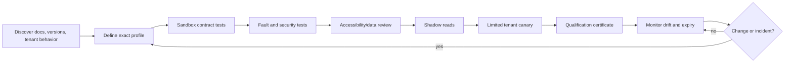

# Adapter and Provider Qualification

An adapter is qualified for an exact provider, tenant, API/specification version, permission grant, region, and capability. “Supports LMS,” “QTI compatible,” or “uses LTI” is too vague for production. Qualification proves identity semantics, source ownership, pagination, events, rate limits, effects, deletion, accessibility metadata, and failure recovery against the deployed profile.

## Integration ownership map

| Adapter | Source facts | Allowed production direction | Explicitly not authorized |
|---|---|---|---|
| Identity/LTI | Actor, role claim, issuer, deployment, course/resource context | Read/launch | Role escalation from chat; account merge decisions |
| SIS/roster | Person link, enrollment, class, organization, term | Read/sync | Admissions, discipline, special-education placement |
| LMS | Course, assignment, due date, teacher relationship, assessment policy reference | Read; narrowly scoped draft/effect only at later stage | Final grade writes by tutor |
| Curriculum/CASE | Frameworks, items, associations, rubrics | Read/import approved release | Selecting institutional curriculum authority |
| Content/package | Approved resources, rights, accessibility metadata | Read/import immutable release | Answer-key access without policy |
| Assessment/QTI | Item definition, scoring metadata, formative result | Read and local formative execution if approved | High-stakes answers, score-of-record mutation |
| Calendar | Assigned practice windows and reminder effect state | Read; approved reversible effect | Attendance or disciplinary inference |
| Messaging | Verified recipient/channel and delivery state | Draft; later approved send | Free-form destinations or autonomous guardian contact |
| Model/safety | Typed inference and provider metadata | Bounded inference | Identity, policy, memory, grade, diagnosis, or provider-generic tool authority |

## Standards profile

### LTI 1.3 and LTI Advantage

Use LTI 1.3 with the qualified 1EdTech security profile. Validate:

- platform issuer and registered client/deployment;
- OIDC login initiation parameters and exact redirect URI;
- JWT signature, algorithm allowlist, key ID/rotation, issuer, audience, nonce, expiry, and message type;
- deployment ID, resource-link ID, context ID, target-link URI, and platform instance;
- roles mapped through institution policy rather than substring matching;
- state/nonce replay prevention and session binding;
- deep-linking content ownership and return validation;
- NRPS roster scope and pagination;
- AGS line item, score, and result scope where used.

The tutoring runtime should normally avoid AGS grade writes. If another institution-owned service uses AGS for formative results, keep it outside the model tool set and distinguish formative evidence from the final grade of record.

### OneRoster 1.2

Qualify REST and CSV profiles separately. Test:

- sourced IDs remain stable within the provider contract;
- `status` and `dateLastModified` behavior;
- academic sessions/terms, organizations, courses, classes, users, enrollments, and demographics actually implemented;
- role and primary-role mapping;
- pagination, filtering, sorting, delta behavior, and maximum page size;
- CSV manifest, required/optional files, quoting, encoding, bulk replacement, partial file, and delete semantics;
- enrollment withdrawal, class transfer, merged accounts, and delayed updates;
- whether the provider is certified for the exact version/profile and what custom extensions exist.

OneRoster is data in motion. The integration still needs a local source mirror, cursor/import record, quarantine, reconciliation, and institutional ownership.

### Ed-Fi Data Standard and ODS/API

The current Data Standard and ODS/API versions move independently. Qualify the exact supported combination and vendor implementation. Test descriptors, natural keys/references, ETags or concurrency behavior where exposed, deletes, change queries, pagination, dependency ordering, claim-set permissions, namespace ownership, and API composites if used.

Do not interpret the presence of disability, program, assessment, or early-access special-education fields as authority for the tutor to diagnose, determine eligibility, or place a learner.

### CASE 1.1

Preserve:

- framework and item sourced IDs/URIs;
- creator/publisher, language, adoption status, license/rights, and last-change information where available;
- association type and direction;
- rubric and rubric-criterion references;
- local extension and mapping provenance;
- immutable import release and digest.

Test deleted items, changed labels with stable identity, association cycles, multiple frameworks that reuse human-readable codes, and a local mapping that points to an expired item. CASE carries a graph; curriculum owners decide how it is used.

### QTI 3.0 and content packages

Qualify QTI version and profiles, not “QTI” generically. Test:

- item and test structure, response declarations, outcome processing, templates, feedback, sections, and navigation;
- accessibility metadata and personal-needs/preferences mapping;
- media, math, language, bidirectionality, alternative content, keyboard operation, and rendering consistency;
- adaptive item/test behavior if in scope;
- answer-key and scoring content separated from learner-visible retrieval;
- imported identifiers, versioning, rights, and deletion;
- conformance claim and locally unsupported elements;
- malformed XML, external references, script/active content, archive traversal, decompression limits, and entity expansion defenses.

QTI 3 integrates accessibility capabilities that older APIP workflows handled separately. New implementations should qualify QTI 3 rather than design a new APIP dependency. Common Cartridge 1.4 is still Candidate Final at the research date; pin the tested profile and do not present it as a final standard.

## Domain adapter interface

Provider transports translate into small domain capabilities.

```typescript
interface CourseContextAdapter {
  readLearnerContext(input: {
    tenantId: string;
    actorSubject: string;
    courseId: string;
    observedNoEarlierThan: string;
  }): Promise<{
    sourceVersion: string;
    observedAt: string;
    course: CourseContext;
    enrollment: EnrollmentContext;
    assessmentPolicyRef?: string;
  }>;

  reconcile(cursor?: string): AsyncIterable<SourceChange>;
}
```

The domain core sees timestamps, versions, provenance, and typed facts—not a provider SDK object. Adapter errors map to stable categories such as `unauthorized`, `forbidden`, `not_found`, `conflict`, `rate_limited`, `transient`, `invalid_data`, `cursor_expired`, and `unknown_commit`.

## Capability declaration

```yaml
adapter_profile_id: canvas-school7-2026-08-v2
provider: canvas
tenant_id: district_42
region: institution-configured
api_profile:
  base_url: tenant-specific
  documented_as_of: 2026-08-31
capabilities:
  course_context_read: qualified
  assignment_read: qualified
  roster_read: qualified_with_limits
  teacher_handoff_draft: local_only
  reminder_send: not_supported
  grade_write: forbidden
auth:
  type: oauth_delegated_or_institution_service
  scopes: [minimum-qualified-scopes]
pagination:
  style: link_header
  opaque_links_required: true
rate_limit:
  style: dynamic_cost
  retry_429: qualified
events:
  support: provider-specific-or-poll
reconciliation:
  full_scan: supported
  maximum_declared_staleness: PT15M
qualification:
  contract_suite: adapter-contract-v7
  tested_at: 2026-08-25T00:00:00Z
  expires_at: 2026-11-25T00:00:00Z
  evidence_digest: sha256:...
owner: integration_team_education
```

## Qualification lifecycle



Qualification expires. Requalify on provider/API changes, new scopes, tenant configuration changes, new regions, SDK updates, certification changes, incidents, or material observed drift.

## Common contract suite

Every adapter profile passes:

### Authentication and authorization

- valid, expired, future, revoked, wrong-audience, wrong-issuer, wrong-deployment, and rotated credentials;
- least-privilege positive and negative scope tests;
- tenant binding and cross-tenant denial;
- delegated versus application permission differences;
- service account impersonation and admin-consent boundaries;
- secret/key rotation without an availability or replay gap.

### Identity and lifecycle

- learner/teacher/guardian roles and multi-role actors;
- duplicate names and changed email addresses;
- merged, split, transferred, suspended, withdrawn, and deleted accounts;
- class rollover, term change, renamed course, and recycled human-readable ID;
- guardian relationship effective dates and access restrictions;
- provider ID mapping correction and tombstone replay.

### Collection and synchronization

- empty, one-page, multi-page, and page-boundary mutation;
- opaque pagination link/cursor use rather than constructing the next URL;
- full sync, delta sync, cursor expiry, HTTP 410 or equivalent, and resnapshot;
- duplicate, missing, late, and reordered source changes;
- malformed, partial, oversized, and unknown-enum data;
- deletion and authorization loss;
- timezone, daylight-saving, precision, and clock-skew behavior.

### Rate, availability, and recovery

- 401/403/404/409/412/429/5xx and network timeout mapping;
- documented retry hints, jitter, maximum deadline, and circuit breaker;
- concurrency and provider cost/quota accounting;
- sandbox/production differences;
- outage with cached source freshness and safe-mode transition;
- post-outage full reconciliation without a thundering herd.

### Effects

- semantic idempotency and parameter mismatch;
- conditional write/expected version;
- commit followed by timeout;
- synchronous response before/after callback;
- duplicate and reordered callbacks;
- cancel before send, in flight, after delivery, and unsupported cancel;
- provider acceptance, sent, delivered, read, failed, and unknown state distinctions;
- changed recipient/relationship/policy after approval;
- read-after-write and eventual consistency.

### Data protection and access

- retention, export, correction, deletion, and backup/subprocessor limitations;
- residency and cross-border configuration;
- provider model-training/secondary-use controls;
- sensitive content excluded from logs and support bundles;
- accessibility metadata round-trip;
- audit records for scopes, sensitive reads, effects, and support elevation.

## Provider-specific profiles

### Canvas LMS

Current Canvas documentation describes dynamic request-cost throttling and HTTP 429 behavior. Its pagination uses an HTTP `Link` header; clients should follow opaque links and not construct pagination URLs or assume a page maximum.

Qualification cases:

- pre-flight and request-cost changes under concurrency;
- `X-Rate-Limit-Remaining`/429 behavior as actually exposed by the tenant;
- pagination while assignments or enrollments change;
- masquerading/as-user behavior prohibited unless explicitly approved;
- course/section/concluded enrollment visibility;
- grading-period and assignment override semantics;
- webhook/live-event availability versus polling and authoritative reread;
- API token/OAuth scope and institution tenant settings.

References: [Canvas throttling](https://developerdocs.instructure.com/services/canvas/basics/file.throttling) and [pagination](https://developerdocs.instructure.com/services/canvas/basics/file.pagination).

### Google Classroom

Teachers retain control of coursework and can change or delete it independently, making cached state stale. An application can modify only coursework it created under the documented model. Push notifications use Pub/Sub and are signals to read current state, not complete authoritative objects; their authorization and domain behavior need tenant-specific tests.

Qualification cases:

- user OAuth scopes and consent; do not assume domain-wide delegation solves push authorization;
- teacher versus student permissions and course state;
- application-created versus teacher-created coursework mutation;
- course/roster/assignment pagination and update time;
- Pub/Sub registration renewal, authorization revocation, duplicate/missing notifications, and full reconciliation;
- deleted coursework and returned student work;
- guardian communication features treated separately from ordinary messaging.

References: [coursework integration](https://developers.google.com/workspace/classroom/guides/coursework-integration) and [push-notification best practices](https://developers.google.com/workspace/classroom/best-practices/push-notifications).

### Microsoft Graph Education

Microsoft Graph education exposes schools, classes, users, assignments, submissions, and related resources, with delegated/application permissions and cloud-availability differences. Qualify the exact endpoints and national cloud/tenant.

Qualification cases:

- least-privilege education permissions and admin consent;
- class/user/assignment/submission lifecycle;
- teacher/student role mapping and multi-school actors;
- submission states, returned/reassigned work, and resource permissions;
- pagination/delta support endpoint by endpoint rather than by assumption;
- throttling headers, retry behavior, and national-cloud availability;
- no grade-of-record effect exposed to the tutoring runtime.

References: [education overview](https://learn.microsoft.com/en-us/graph/education-concept-overview) and [submission retrieval](https://learn.microsoft.com/en-us/graph/api/educationsubmission-get?view=graph-rest-1.0).

### Moodle and other LMS providers

Do not claim compatibility from an LMS category label. Create a dated profile from the deployed product/version, enabled web services, authentication mode, role/capability configuration, plugins, event support, mobile/offline behavior, rate/hosting limits, and tenant customizations. Self-hosted instances can differ materially.

## Calendar adapter

Calendar events are reminders, not enrollment or learning evidence. For Google Calendar incremental synchronization:

- persist sync tokens and all request parameters required for consistent continuation;
- paginate each sync;
- on HTTP 410, clear the mirror and perform a controlled full resync;
- treat push channels as expiring notifications and read current event state;
- handle recurring event instances, cancellations, attendee response, organizer authority, timezone, and daylight saving;
- use a stable private client reference for reconciliation;
- do not infer learner attendance from calendar state.

References: [incremental sync](https://developers.google.com/workspace/calendar/api/guides/sync) and [push notifications](https://developers.google.com/workspace/calendar/api/guides/push).

## Messaging adapter

Normalize only states the channel/provider can substantiate:

```text
local_ready -> provider_accepted -> sent -> delivered -> read
                  |                  |          |
                failed             failed     may be unsupported
```

Qualification covers verified recipient/relationship, opt-in/basis, sender identity, templates, quiet hours, frequency caps, language, encoding/segment behavior, regional restrictions, callback signatures, status monotonicity exceptions, carrier/channel differences, redaction, reply handling, and stop/unsubscribe.

Twilio, for example, exposes outbound status callbacks whose available terminal/intermediate states vary by messaging channel. Never map every `sent` state to `delivered`. Reference: [Twilio outbound status callbacks](https://www.twilio.com/docs/messaging/guides/outbound-message-status-in-status-callbacks).

## Model and safety provider adapter

Qualify:

- exact model/version or snapshot behavior and alias-change policy;
- regional availability, residency, retention, training, subprocessors, abuse monitoring, and deletion;
- maximum input/output, supported modalities, structured-output fidelity, tool protocol, citations, and refusal metadata;
- token accounting, rate limits, batching, timeout, cancellation, streaming partial-output handling, and error taxonomy;
- accessibility of generated math, markup, speech, captions, and supported languages;
- prompt-injection, answer leakage, child-safety, relationship-safety, and fairness suites;
- provider-side moderation limits and false positives/negatives;
- reproducibility limitations and fallback model differences;
- no direct provider tool or long-term memory feature unless it passes the same authority, retention, deletion, and reconciliation controls.

Provider safety filters supplement rather than replace institution policy. Stream only buffered/validated content when a partial unsafe or answer-bearing output could reach a learner.

## Adapter reconciliation contract

```json
{
  "adapter_profile": "google-classroom-school7-2026-08-v3",
  "source": "classroom",
  "tenant_id": "district_42",
  "resource_type": "courseWork",
  "cursor": "encrypted:...",
  "last_full_snapshot_at": "2026-08-30T00:00:00Z",
  "last_delta_at": "2026-08-31T10:00:00Z",
  "maximum_staleness": "PT15M",
  "notification_is_authoritative": false,
  "delete_semantics": "source_read_then_tombstone",
  "cursor_expiry": "full_resnapshot",
  "quarantine_count": 0,
  "next_reconcile_at": "2026-08-31T10:05:00Z"
}
```

## Qualification certificate

```yaml
certificate_id: qual_01K...
adapter_profile: google-classroom-school7-2026-08-v3
tenant: district_42
environment: production
capabilities_approved:
  - course_context_read
  - assignment_read
  - roster_read
capabilities_denied:
  - grade_write
  - autonomous_guardian_message
artifacts:
  docs_snapshot_digest: sha256:...
  contract_results_digest: sha256:...
  security_review: sec_418
  privacy_review: priv_219
  accessibility_review: a11y_103
limits:
  maximum_source_staleness: PT15M
  maximum_concurrency: 20
  region: configured-region
issued_at: 2026-08-31T00:00:00Z
expires_at: 2026-11-30T00:00:00Z
owners:
  integration: team_education_integrations
  institution: school7_technology_owner
revocation_triggers:
  - scope_change
  - provider_breaking_change
  - security_or_privacy_incident
  - contract_test_regression
```

The runtime loads only unexpired certificates compatible with the behavior and policy bundle. Certificate expiry moves affected capabilities to the declared safe mode; it does not silently continue.

## Provider substitution

Avoid least-common-denominator behavior and invisible semantic changes. Before switching providers:

- run the complete contract, pedagogy, safety, accessibility, language, and fairness suites;
- compare error, delivery, pagination, source freshness, model refusal, and data-lifecycle semantics;
- pin a new adapter/behavior bundle;
- shadow and canary by institution/context;
- preserve continuity/effect state or create an explicit migration receipt;
- explain any learner/teacher-visible change;
- retain rollback until nonterminal effects reconcile.

## Qualification exercises

1. Build a fake LMS that deletes an assignment between pagination pages and verify reconciliation.
2. Expire a Calendar sync token and demonstrate a rate-limited full resnapshot without blocking safety work.
3. Forge, duplicate, and reorder messaging callbacks and prove the effect state remains honest.
4. Import a QTI package containing archive traversal, active content, inaccessible media, and answer-key leakage.
5. Change a model alias while keeping the name constant; detect the behavior drift and prevent unqualified rollout.
6. Revoke a guardian relationship after approval but before send and verify the commit-time authority check.

## Qualification checklist

- [ ] Exact provider, tenant, version/profile, region, scopes, and environment are recorded.
- [ ] Standards maturity and certification claims are stated precisely.
- [ ] Identity, role, merge, transfer, withdrawal, and deletion are tested.
- [ ] Pagination, delta, cursor expiry, webhook gaps, and full reconciliation are tested.
- [ ] Provider errors and rate limits map to stable domain categories.
- [ ] Effects survive duplicate, reorder, timeout, cancel, and read-after-write cases.
- [ ] Accessibility metadata and supported interaction round-trip.
- [ ] Retention, training use, residency, deletion, and subprocessor evidence are reviewed.
- [ ] Grade, admission, discipline, diagnosis, placement, high-stakes answer, and proctoring capabilities are absent.
- [ ] Certificate has limits, owner, expiry, safe mode, and revocation triggers.
- [ ] Substitution creates a new behavior/adapter release and passes shadow/canary.

## Related guides

- [Reference architecture and runtime](02-reference-architecture-runtime-and-integration-map.md)
- [Tools, effects, approvals, reconciliation, and handoffs](06-tools-effects-approvals-reconciliation-and-handoffs.md)
- [Deployment, scale, recovery, and governed evolution](09-deployment-scale-cost-recovery-and-governed-evolution.md)
- [Research packet](../../research/packets/education-tutoring-agent-blueprint.md)
